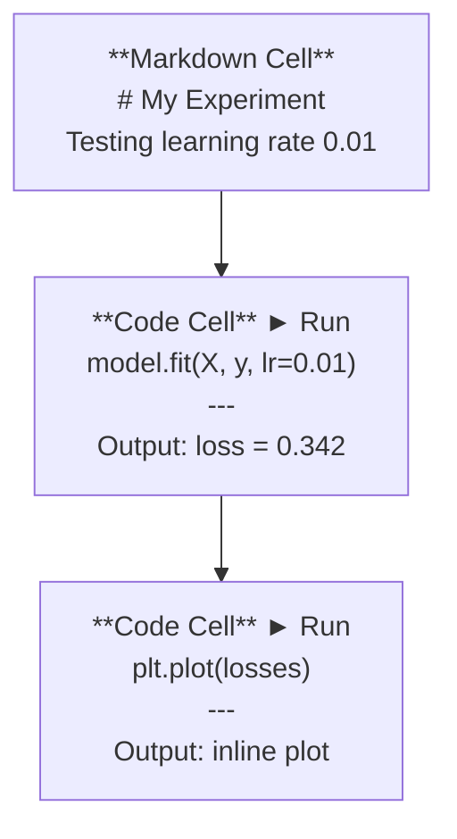
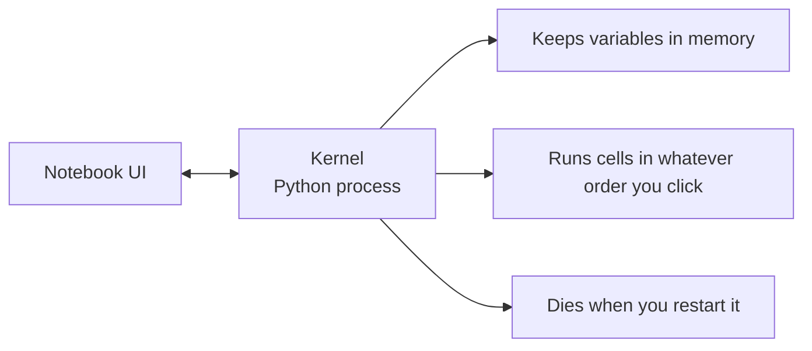

# Jupyter Notebooks | Jupyter 笔记本

> Notebooks are the lab bench of AI engineering. You prototype here, then move what works into production.
> 笔记本是 AI 工程的实验工作台。你在这里做原型验证，然后把有效的部分投入生产。

**Type:** Build | **类型:** 构建
**Languages:** Python | **语言:** Python
**Prerequisites:** Phase 0, Lesson 01 | **前置知识:** Phase 0, 第 01 课
**Time:** ~30 minutes | **时间:** ~30 分钟

## Learning Objectives | 学习目标

- Install and launch JupyterLab, Jupyter Notebook, or VS Code with the Jupyter extension
  中文翻译：安装并启动 JupyterLab、Jupyter Notebook 或带 Jupyter 扩展的 VS Code
- Use magic commands (`%timeit`, `%%time`, `%matplotlib inline`) to benchmark and visualize inline
  中文翻译：使用魔术命令（`%timeit`、`%%time`、`%matplotlib inline`）进行基准测试和内嵌可视化
- Distinguish when to use notebooks vs scripts and apply the "explore in notebooks, ship in scripts" workflow
  中文翻译：区分何时用笔记本何时用脚本，践行"笔记本中探索、脚本中部署"的工作流
- Identify and avoid common notebook traps: out-of-order execution, hidden state, and memory leaks
  中文翻译：识别并避免笔记本常见陷阱：乱序执行、隐藏状态和内存泄漏

> **【中文解读】**
> Jupyter Notebook 是 AI 工程师的"实验室工作台"。你可以在里面逐段运行代码、即时查看结果、混合文字说明和图表。核心理念：在 Notebook 中探索和实验，验证后再迁移到 `.py` 脚本中部署。

## The Problem | 问题描述

Every AI paper, tutorial, and Kaggle competition uses Jupyter notebooks. They let you run code in pieces, see outputs inline, mix code with explanations, and iterate fast. If you try to learn AI without notebooks, you're doing math homework without scratch paper.

> 几乎所有 AI 论文、教程和 Kaggle 比赛都使用 Jupyter Notebook。它让你可以分段运行代码、内嵌查看输出、混合代码和文字说明、快速迭代。如果不用笔记本学 AI，就像没有草稿纸做数学作业。

But notebooks have real traps. People use them for everything, including things they're terrible at. Knowing when to use a notebook and when to use a script will save you from debugging nightmares later.

> 但笔记本也有真正的陷阱。人们用它做所有事情，包括它不擅长的事。知道什么时候用笔记本、什么时候用脚本，能让你免于后期的调试噩梦。

> **【中文解读】**
> Notebook 是 AI 领域的标准工具，几乎所有论文和 Kaggle 比赛都用它。但它也有陷阱：乱序执行、隐藏状态、内存泄漏。关键是知道什么时候用 Notebook、什么时候用脚本。

## The Concept | 核心概念

A notebook is a list of cells. Each cell is either code or text.

> 笔记本由一系列"单元格"组成，每个单元格要么是代码，要么是文本。



The kernel is a Python process running in the background. When you run a cell, it sends the code to the kernel, which executes it and sends back the result. All cells share the same kernel, so variables persist between cells.

> Kernel 是一个在后台运行的 Python 进程。当你运行一个单元格时，代码被发送到 Kernel 执行，结果再返回。所有单元格共享同一个 Kernel，因此变量在单元格之间持久存在。



That "whatever order you click" part is both the superpower and the foot-gun.

> "按你点击的任意顺序执行"这部分既是超能力，也是大坑。

> **【中文解读】**
> Notebook 由多个"单元格"（cell）组成，每个单元格可以是代码或 Markdown。所有单元格共享同一个 Kernel（Python 进程），变量在单元格之间持久存在。"按任意顺序执行"既是超能力也是大坑——乱序执行会导致别人无法复现你的结果。

## Build It | 动手搭建

> **【拓展：Jupyter 在 AI 行业中的地位】** 几乎所有 AI 论文附带的可复现代码都是 Jupyter Notebook 格式。Kaggle 比赛方案、Hugging Face 示例、PyTorch 教程都用它。Google Colab 本质上就是云端的 Jupyter，预装了 PyTorch/TensorFlow，并免费提供 GPU。本课程中有大量 `.ipynb` 练习。

### Step 1: Pick your interface | 选择你的界面

Three options, one format:

> 三种界面选择，同一种文件格式：

| Interface | Install | Best for |
|-----------|---------|----------|
| JupyterLab | `pip install jupyterlab` then `jupyter lab` | Full IDE experience, multiple tabs, file browser, terminal |
| Jupyter Notebook | `pip install notebook` then `jupyter notebook` | Simple, lightweight, one notebook at a time |
| VS Code | Install "Jupyter" extension | Already in your editor, git integration, debugging |

| 界面 | 安装方式 | 最适合 |
|------|---------|--------|
| JupyterLab | `pip install jupyterlab` 后运行 `jupyter lab` | 完整 IDE 体验、多标签、文件浏览器 |
| Jupyter Notebook | `pip install notebook` 后运行 `jupyter notebook` | 简洁轻量、一次一个笔记本 |
| VS Code | 安装 "Jupyter" 扩展 | 集成在编辑器中、Git 整合、可调试 |

All three read and write the same `.ipynb` file. Pick whatever you like. JupyterLab is the most common in AI work.

> 三种界面读写相同的 `.ipynb` 文件格式。选你喜欢的即可。JupyterLab 在 AI 工作中最常见。

```bash
pip install jupyterlab
jupyter lab
```

### Step 2: Keyboard shortcuts that matter | 重要快捷键

You operate in two modes. Press `Escape` for command mode (blue bar on the left), `Enter` for edit mode (green bar).

> 你在两种模式下操作。按 `Escape` 进入命令模式（左侧蓝色条），按 `Enter` 进入编辑模式（绿色条）。

**Command mode (most used):**

> **命令模式（最常用的）：**

| Key | Action |
|-----|--------|
| `Shift+Enter` | Run cell, move to next |
| `A` | Insert cell above |
| `B` | Insert cell below |
| `DD` | Delete cell |
| `M` | Convert to markdown |
| `Y` | Convert to code |
| `Z` | Undo cell operation |
| `Ctrl+Shift+H` | Show all shortcuts |

**Edit mode:**

> **编辑模式：**

| Key | Action |
|-----|--------|
| `Tab` | Autocomplete |
| `Shift+Tab` | Show function signature |
| `Ctrl+/` | Toggle comment |

`Shift+Enter` is the one you'll use a thousand times a day. Learn it first.

> `Shift+Enter` 是你每天会用上千次的快捷键。先学会这个。

### Step 3: Cell types | 单元格类型

**Code cells** run Python and show the output:

> **代码单元格**运行 Python 并显示输出：

```python
import numpy as np
data = np.random.randn(1000)
data.mean(), data.std()
```

Output: `(0.0032, 0.9987)`

**Markdown cells** render formatted text. Use them to document what you're doing and why. Supports headers, bold, italic, LaTeX math (`$E = mc^2$`), tables, and images.

> **Markdown 单元格**渲染格式化文本。用它们来记录你在做什么以及为什么。支持标题、粗体、斜体、LaTeX 数学公式（`$E = mc^2$`）、表格和图片。

### Step 4: Magic commands | 魔术命令

These aren't Python. They're Jupyter-specific commands that start with `%` (line magic) or `%%` (cell magic).

> 这些不是 Python。它们是以 `%`（行魔术）或 `%%`（单元格魔术）开头的 Jupyter 专用命令。

**Time your code:**

> **计时你的代码：**

```python
%timeit np.random.randn(10000)  # 多次运行取平均，适合微基准测试
```

Output: `45.2 us +/- 1.3 us per loop`

```python
%%time  # 单次运行，测量总耗时，适合训练耗时测试
model.fit(X_train, y_train, epochs=10)
```

Output: `Wall time: 2.34 s`

`%timeit` runs the code many times and averages. `%%time` runs it once. Use `%timeit` for microbenchmarks, `%%time` for training runs.

> `%timeit` 多次运行取平均值。`%%time` 只运行一次。微基准测试用 `%timeit`，训练耗时测试用 `%%time`。

**Enable inline plots:**

> **启用内嵌图表：**

```python
%matplotlib inline  # 让图表直接显示在笔记本中
```

Every `plt.plot()` or `plt.show()` now renders directly in the notebook.

> 之后每个 `plt.plot()` 或 `plt.show()` 都会直接在笔记本中渲染。

**Install packages without leaving the notebook:**

> **不离开笔记本就能安装包：**

```python
!pip install scikit-learn  # ! 前缀可以在笔记本中执行 shell 命令
```

The `!` prefix runs any shell command.

> `!` 前缀可以执行任何 shell 命令。

**Check environment variables:**

> **检查环境变量：**

```python
%env CUDA_VISIBLE_DEVICES  # 查看环境变量
```

### Step 5: Display rich output inline | 第5步：内嵌富文本输出

> **【拓展：Notebook 是最佳 AI 实验记录工具】** Notebook 把代码、输出、图表、公式整合在一个文档中，形成了完整的"实验记录"。在 AI 研究中，这意味着别人可以直接复现你的实验——这是论文审稿的基本要求。vscode 的 Jupyter 扩展让你在编辑器内就能获得完整的 Notebook 体验。

Notebooks auto-display the last expression in a cell. But you can control it:

> 笔记本会自动显示单元格中最后一个表达式。但你可以控制它：

```python
import pandas as pd

df = pd.DataFrame({
    "model": ["Linear", "Random Forest", "Neural Net"],
    "accuracy": [0.72, 0.89, 0.94],
    "training_time": [0.1, 2.3, 45.6]
})
df
```

This renders a formatted HTML table, not a text dump. Same with plots:

> 这会渲染一个格式化的 HTML 表格，而不是文本输出。图表也一样：

```python
import matplotlib.pyplot as plt

plt.figure(figsize=(8, 4))
plt.plot([1, 2, 3, 4], [1, 4, 2, 3])
plt.title("Inline Plot")
plt.show()
```

The plot appears right below the cell. This is why notebooks dominate AI work. You see the data, the plot, and the code together.

> 图表直接显示在单元格下方。这就是笔记本在 AI 工作中占主导地位的原因——数据、图表和代码在一起。

For images:

> 对于图片：

```python
from IPython.display import Image, display
display(Image(filename="architecture.png"))
```

### Step 6: Google Colab | 第6步：Google Colab

Colab is a free Jupyter notebook in the cloud. It gives you a GPU, pre-installed libraries, and Google Drive integration. No setup required.

> Colab 是云端的免费 Jupyter 笔记本。它提供 GPU、预装库和 Google Drive 集成。无需任何设置。

1. Go to [colab.research.google.com](https://colab.research.google.com)
2. Upload any `.ipynb` file from this course
3. Runtime > Change runtime type > T4 GPU (free)

Colab differences from local Jupyter:

> Colab 与本地 Jupyter 的区别：

- Files don't persist between sessions (save to Drive or download)
  中文翻译：文件不会在会话间持久保存（需要保存到 Drive 或下载）
- Pre-installed: numpy, pandas, matplotlib, torch, tensorflow, sklearn
  中文翻译：预装了 numpy、pandas、matplotlib、torch、tensorflow、sklearn
- `from google.colab import files` to upload/download files
  中文翻译：`from google.colab import files` 用于上传/下载文件
- `from google.colab import drive; drive.mount('/content/drive')` for persistent storage
  中文翻译：`from google.colab import drive; drive.mount('/content/drive')` 用于持久存储
- Sessions time out after 90 minutes of inactivity (free tier)
  中文翻译：空闲 90 分钟后会话超时（免费版）

## Use It | 使用指南

### Notebooks vs Scripts: When to use which | 什么时候用笔记本、什么时候用脚本

| Use notebooks for | Use scripts for |
|-------------------|-----------------|
| Exploring a dataset | Training pipelines |
| Prototyping a model | Reusable utilities |
| Visualizing results | Anything with `if __name__` |
| Explaining your work | Code that runs on a schedule |
| Quick experiments | Production code |
| Course exercises | Packages and libraries |

| 用 Notebook | 用脚本 |
|-----------|-------|
| 探索数据集 | 训练管线 |
| 原型开发模型 | 可复用的工具函数 |
| 可视化结果 | 带 `if __name__` 的正式代码 |
| 解释你的工作 | 定时运行的代码 |
| 快速实验 | 生产环境代码 |
| 课程练习 | 包和库 |

The rule: **explore in notebooks, ship in scripts**.

> 黄金法则：**在笔记本中探索，在脚本中部署**。

> **【中文解读】**
> 黄金法则：**在 Notebook 中探索，在脚本中部署**。先在 Notebook 里实验想法，验证可行后再将代码迁移到 `.py` 文件。

A common workflow in AI:
1. Explore data in a notebook
2. Prototype your model in the notebook
3. Once it works, move the code to `.py` files
4. Import those `.py` files back into the notebook for further experiments

> AI 中常见的工作流：
> 1. 在笔记本中探索数据
> 2. 在笔记本中做模型原型
> 3. 验证有效后，将代码迁移到 `.py` 文件
> 4. 把 `.py` 文件导入笔记本进行进一步实验

### Common traps | 常见陷阱

> **【拓展：Notebook 反模式】** 三个最常见的 Notebook 反模式：(1) 乱序执行——你跳着跑 cell，别人从头跑就挂了；(2) 隐藏状态——你删了某个 cell，但它创建的变量还在内存中；(3) 内存泄漏——加载 4GB 数据集、训练模型、再加载另一个，内存不断增长。解法：定期 `Kernel > Restart & Run All`，或在训练后用 `del model; gc.collect()` 释放内存。

**Out-of-order execution.** You run cell 5, then cell 2, then cell 7. The notebook works on your machine but breaks when someone runs it top to bottom. Fix: Kernel > Restart & Run All before sharing.

> **乱序执行。** 你先跑第 5 个单元格，再跑第 2 个，然后第 7 个。笔记本在你机器上能用，但别人从头到尾跑就出错了。修复方法：分享前执行 Kernel > Restart & Run All。

**Hidden state.** You delete a cell but the variable it created is still in memory. The notebook looks clean but depends on a ghost cell. Fix: Restart the kernel regularly.

> **隐藏状态。** 你删了一个单元格，但它创建的变量还在内存中。笔记本看起来干净，但其实依赖一个"幽灵"单元格。修复方法：定期重启 Kernel。

**Memory leaks.** Loading a 4GB dataset, training a model, loading another dataset. Nothing gets freed. Fix: `del variable_name` and `gc.collect()`, or restart the kernel.

> **内存泄漏。** 加载 4GB 数据集、训练模型、再加载另一个数据集，内存不断增长没有被释放。修复方法：`del variable_name` 和 `gc.collect()`，或重启 Kernel。

## Ship It | 产出物

> **【拓展：从 Notebook 到生产代码】** 真正的 AI 工程流程：Notebook 实验 → 验证想法 → 将代码重构为 `.py` 模块 → 编写测试 → 部署。Notebook 是"草稿纸"，不是"最终产品"。养成习惯：实验完成后，把核心代码迁移到 `.py` 文件中，Notebook 只保留调用和可视化。

This lesson produces:
- `outputs/prompt-notebook-helper.md` for debugging notebook issues

> 本课产出：
> - `outputs/prompt-notebook-helper.md` 用于调试笔记本问题

## Exercises | 练习题

1. Open JupyterLab, create a notebook, and use `%timeit` to compare list comprehension vs numpy for creating an array of 100,000 random numbers
   打开 JupyterLab，创建笔记本，用 `%timeit` 对比列表推导式和 NumPy 生成 10 万随机数的速度
2. Create a notebook with both markdown and code cells that loads a CSV, displays a dataframe, and plots a chart. Then run Kernel > Restart & Run All to verify it works top to bottom
   创建包含 Markdown 和代码单元格的笔记本，加载 CSV、显示 DataFrame、画图，然后"重启并全部运行"验证顺序正确
3. Take the code from `code/notebook_tips.py`, paste it into a Colab notebook, and run it with a free GPU
   将 `code/notebook_tips.py` 的代码粘贴到 Colab 笔记本中，用免费 GPU 运行

## Key Terms | 关键术语

| Term | What people say | What it actually means |
|------|----------------|----------------------|
| Kernel | "The thing running my code" | A separate Python process that executes cells and keeps variables in memory |
| Cell | "A code block" | An independently runnable unit in a notebook, either code or markdown |
| Magic command | "Jupyter tricks" | Special commands prefixed with `%` or `%%` that control the notebook environment |
| `.ipynb` | "Notebook file" | A JSON file containing cells, outputs, and metadata. Stands for IPython Notebook |

| 术语 | 俗称 | 实际含义 |
|------|------|---------|
| Kernel | "运行代码的那个东西" | 独立的 Python 进程，执行单元格并维护变量状态 |
| Cell | "代码块" | 笔记本中可独立运行的单元，可以是代码或 Markdown |
| Magic command | "Jupyter 魔法" | 以 `%` 或 `%%` 开头的特殊命令，控制笔记本环境 |
| `.ipynb` | "笔记本文件" | 包含单元格、输出和元数据的 JSON 文件 |

## Further Reading | 延伸阅读

- [JupyterLab Docs](https://jupyterlab.readthedocs.io/) for the full feature set
  中文翻译：JupyterLab 完整功能文档
- [Google Colab FAQ](https://research.google.com/colaboratory/faq.html) for Colab-specific limits and features
  中文翻译：Google Colab 常见问题与限制说明
- [28 Jupyter Notebook Tips](https://www.dataquest.io/blog/jupyter-notebook-tips-tricks-shortcuts/) for power-user shortcuts
  中文翻译：28 个 Jupyter Notebook 高级技巧
