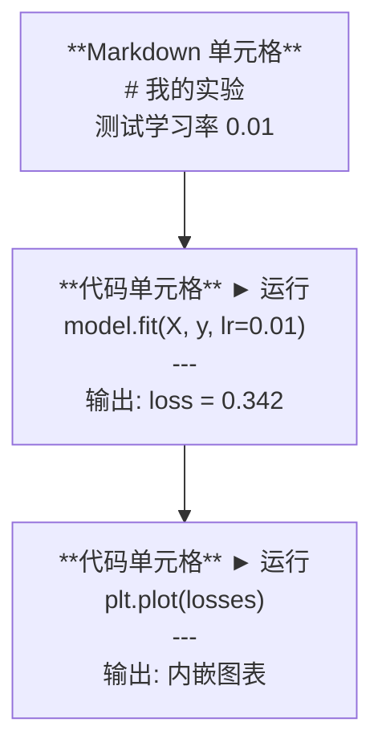
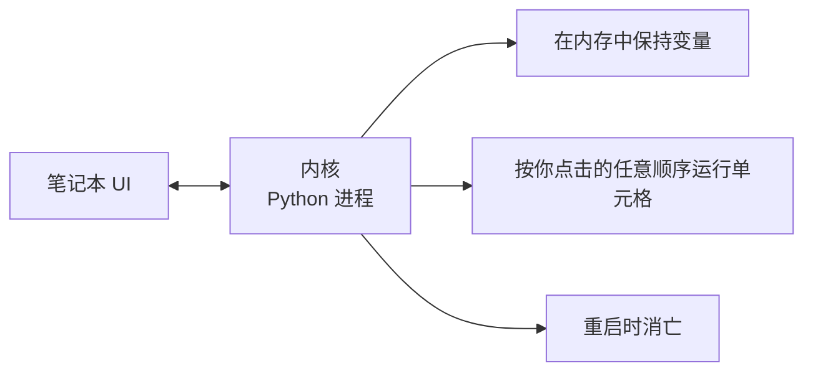

# Jupyter 笔记本

> 笔记本是 AI 工程的实验台。你在这里做原型，然后把可行的东西搬到生产环境。

**类型：** 动手实践
**语言：** Python
**前置条件：** Phase 0, Lesson 01
**预计用时：** 约 30 分钟

## 学习目标

- 安装并启动 JupyterLab、Jupyter Notebook 或带 Jupyter 扩展的 VS Code
- 使用魔术命令（`%timeit`、`%%time`、`%matplotlib inline`）进行基准测试和内嵌可视化
- 区分何时使用笔记本、何时使用脚本，掌握"在笔记本中探索，在脚本中部署"的工作流
- 识别并避免常见笔记本陷阱：乱序执行、隐藏状态和内存泄漏

> **【中文解读】**
> Jupyter Notebook 是 AI 工程师的"实验室工作台"。你可以在里面逐段运行代码、即时查看结果、混合文字说明和图表。核心理念：在 Notebook 中探索和实验，验证后再迁移到 `.py` 脚本中部署。

## 问题引入

几乎每篇 AI 论文、教程和 Kaggle 比赛都使用 Jupyter 笔记本。它们让你分段运行代码、内嵌查看输出、将代码与说明混合、快速迭代。如果你不用笔记本学 AI，就像不用草稿纸做数学作业。

但笔记本有真实的陷阱。人们用它做所有事情，包括它不擅长的事情。知道何时用笔记本、何时用脚本，能帮你避免日后的调试噩梦。

> **【中文解读】**
> Notebook 是 AI 领域的标准工具，几乎所有论文和 Kaggle 比赛都用它。但它也有陷阱：乱序执行、隐藏状态、内存泄漏。关键是知道什么时候用 Notebook、什么时候用脚本。

## 核心概念

笔记本是一个单元格列表。每个单元格要么是代码，要么是文本。



内核（Kernel）是一个在后台运行的 Python 进程。当你运行一个单元格时，它将代码发送给内核执行，内核返回结果。所有单元格共享同一个内核，因此变量在单元格之间持久存在。



"按任意顺序运行"这一特性既是超能力也是大坑。

> **【中文解读】**
> Notebook 由多个"单元格"（cell）组成，每个单元格可以是代码或 Markdown。所有单元格共享同一个 Kernel（Python 进程），变量在单元格之间持久存在。"按任意顺序执行"既是超能力也是大坑——乱序执行会导致别人无法复现你的结果。

## 动手搭建

> **【拓展：Jupyter 在 AI 行业中的地位】** 几乎所有 AI 论文附带的可复现代码都是 Jupyter Notebook 格式。Kaggle 比赛方案、Hugging Face 示例、PyTorch 教程都用它。Google Colab 本质上就是云端的 Jupyter，预装了 PyTorch/TensorFlow，并免费提供 GPU。本课程中有大量 `.ipynb` 练习。

### 第 1 步：选择你的界面

三种选择，同一种格式：

| 界面 | 安装方式 | 最适合 |
|------|---------|--------|
| JupyterLab | `pip install jupyterlab` 后运行 `jupyter lab` | 完整 IDE 体验、多标签、文件浏览器 |
| Jupyter Notebook | `pip install notebook` 后运行 `jupyter notebook` | 简洁轻量、一次一个笔记本 |
| VS Code | 安装 "Jupyter" 扩展 | 集成在编辑器中、Git 整合、可调试 |

三种界面读写相同的 `.ipynb` 文件。选你喜欢的即可。JupyterLab 是 AI 工作中最常用的。

```bash
pip install jupyterlab
jupyter lab
```

### 第 2 步：重要快捷键

你在两种模式下操作。按 `Escape` 进入命令模式（左侧蓝色条），按 `Enter` 进入编辑模式（绿色条）。

**命令模式（最常用）：**

| 快捷键 | 操作 |
|--------|------|
| `Shift+Enter` | 运行单元格，移到下一个 |
| `A` | 在上方插入单元格 |
| `B` | 在下方插入单元格 |
| `DD` | 删除单元格 |
| `M` | 转换为 Markdown |
| `Y` | 转换为代码 |
| `Z` | 撤销单元格操作 |
| `Ctrl+Shift+H` | 显示所有快捷键 |

**编辑模式：**

| 快捷键 | 操作 |
|--------|------|
| `Tab` | 自动补全 |
| `Shift+Tab` | 显示函数签名 |
| `Ctrl+/` | 切换注释 |

`Shift+Enter` 是你一天会用上千次的快捷键。先学它。

### 第 3 步：单元格类型

**代码单元格** 运行 Python 并显示输出：

```python
import numpy as np
data = np.random.randn(1000)
data.mean(), data.std()
```

输出：`(0.0032, 0.9987)`

**Markdown 单元格** 渲染格式化文本。用它们记录你在做什么以及为什么。支持标题、粗体、斜体、LaTeX 数学公式（`$E = mc^2$`）、表格和图片。

### 第 4 步：魔术命令

这些不是 Python。它们是 Jupyter 特有的命令，以 `%`（行魔术）或 `%%`（单元格魔术）开头。

**计时你的代码：**

```python
%timeit np.random.randn(10000)  # 多次运行取平均，适合微基准测试
```

输出：`45.2 us +/- 1.3 us per loop`

```python
%%time  # 单次运行，测量总耗时，适合训练耗时测试
model.fit(X_train, y_train, epochs=10)
```

输出：`Wall time: 2.34 s`

`%timeit` 多次运行代码取平均值。`%%time` 运行一次。微基准测试用 `%timeit`，训练运行用 `%%time`。

**启用内嵌图表：**

```python
%matplotlib inline  # 让图表直接显示在笔记本中
```

每个 `plt.plot()` 或 `plt.show()` 现在都直接在笔记本中渲染。

**不离开笔记本安装包：**

```python
!pip install scikit-learn  # ! 前缀可以在笔记本中执行 shell 命令
```

`!` 前缀可以运行任何 shell 命令。

**检查环境变量：**

```python
%env CUDA_VISIBLE_DEVICES  # 查看环境变量
```

### 第 5 步：内嵌富文本输出

> **【拓展：Notebook 是最佳 AI 实验记录工具】** Notebook 把代码、输出、图表、公式整合在一个文档中，形成了完整的"实验记录"。在 AI 研究中，这意味着别人可以直接复现你的实验——这是论文审稿的基本要求。vscode 的 Jupyter 扩展让你在编辑器内就能获得完整的 Notebook 体验。

笔记本会自动显示单元格中最后一个表达式的结果。但你也可以控制它：

```python
import pandas as pd

df = pd.DataFrame({
    "model": ["Linear", "Random Forest", "Neural Net"],
    "accuracy": [0.72, 0.89, 0.94],
    "training_time": [0.1, 2.3, 45.6]
})
df
```

这会渲染一个格式化的 HTML 表格，而不是文本输出。图表也一样：

```python
import matplotlib.pyplot as plt

plt.figure(figsize=(8, 4))
plt.plot([1, 2, 3, 4], [1, 4, 2, 3])
plt.title("内嵌图表")
plt.show()
```

图表直接出现在单元格下方。这就是笔记本主导 AI 工作的原因——你可以同时看到数据、图表和代码。

显示图片：

```python
from IPython.display import Image, display
display(Image(filename="architecture.png"))
```

### 第 6 步：Google Colab

Colab 是云端的免费 Jupyter 笔记本。它提供 GPU、预装的库和 Google Drive 集成。无需安装。

1. 前往 [colab.research.google.com](https://colab.research.google.com)
2. 上传本课程的任何 `.ipynb` 文件
3. 运行时 > 更改运行时类型 > T4 GPU（免费）

Colab 与本地 Jupyter 的区别：
- 文件在会话之间不会持久保存（保存到 Drive 或下载）
- 预装：numpy、pandas、matplotlib、torch、tensorflow、sklearn
- `from google.colab import files` 上传/下载文件
- `from google.colab import drive; drive.mount('/content/drive')` 持久存储
- 免费层在 90 分钟不活动后会话超时

## 用框架实现

### 什么时候用笔记本、什么时候用脚本

| 用 Notebook | 用脚本 |
|-----------|-------|
| 探索数据集 | 训练管线 |
| 原型开发模型 | 可复用的工具函数 |
| 可视化结果 | 带 `if __name__` 的正式代码 |
| 解释你的工作 | 定时运行的代码 |
| 快速实验 | 生产环境代码 |
| 课程练习 | 包和库 |

黄金法则：**在 Notebook 中探索，在脚本中部署**。

> **【中文解读】**
> 黄金法则：**在 Notebook 中探索，在脚本中部署**。先在 Notebook 里实验想法，验证可行后再将代码迁移到 `.py` 文件。

AI 中常见的工作流：
1. 在笔记本中探索数据
2. 在笔记本中做模型原型
3. 一旦可行，将代码迁移到 `.py` 文件
4. 将 `.py` 文件导入笔记本进行进一步实验

### 常见陷阱

> **【拓展：Notebook 反模式】** 三个最常见的 Notebook 反模式：(1) 乱序执行——你跳着跑 cell，别人从头跑就挂了；(2) 隐藏状态——你删了某个 cell，但它创建的变量还在内存中；(3) 内存泄漏——加载 4GB 数据集、训练模型、再加载另一个，内存不断增长。解法：定期 `Kernel > Restart & Run All`，或在训练后用 `del model; gc.collect()` 释放内存。

**乱序执行。** 你先运行单元格 5，然后单元格 2，然后单元格 7。笔记本在你的机器上能运行，但别人从头到尾运行就会出错。修复方法：分享前执行 Kernel > Restart & Run All。

**隐藏状态。** 你删除了一个单元格，但它创建的变量仍在内存中。笔记本看起来干净，但依赖于一个幽灵单元格。修复方法：定期重启内核。

**内存泄漏。** 加载 4GB 数据集、训练模型、再加载另一个数据集。什么都没有释放。修复方法：`del variable_name` 和 `gc.collect()`，或重启内核。

## 产出物

> **【拓展：从 Notebook 到生产代码】** 真正的 AI 工程流程：Notebook 实验 → 验证想法 → 将代码重构为 `.py` 模块 → 编写测试 → 部署。Notebook 是"草稿纸"，不是"最终产品"。养成习惯：实验完成后，把核心代码迁移到 `.py` 文件中，Notebook 只保留调用和可视化。

本课程产出：
- `outputs/prompt-notebook-helper.md` 用于调试笔记本问题

## 练习题

1. 打开 JupyterLab，创建笔记本，用 `%timeit` 对比列表推导式和 NumPy 生成 10 万随机数的速度
2. 创建包含 Markdown 和代码单元格的笔记本，加载 CSV、显示 DataFrame、画图，然后"重启并全部运行"验证顺序正确
3. 将 `code/notebook_tips.py` 的代码粘贴到 Colab 笔记本中，用免费 GPU 运行

## 术语速查表

| 术语 | 俗称 | 实际含义 |
|------|------|---------|
| Kernel | "运行代码的那个东西" | 独立的 Python 进程，执行单元格并维护变量状态 |
| Cell | "代码块" | 笔记本中可独立运行的单元，可以是代码或 Markdown |
| Magic command | "Jupyter 魔法" | 以 `%` 或 `%%` 开头的特殊命令，控制笔记本环境 |
| `.ipynb` | "笔记本文件" | 包含单元格、输出和元数据的 JSON 文件 |

## 延伸阅读

- [JupyterLab 文档](https://jupyterlab.readthedocs.io/) 了解完整功能
- [Google Colab FAQ](https://research.google.com/colaboratory/faq.html) 了解 Colab 特有的限制和功能
- [28 Jupyter Notebook 技巧](https://www.dataquest.io/blog/jupyter-notebook-tips-tricks-shortcuts/) 高级用户快捷键
