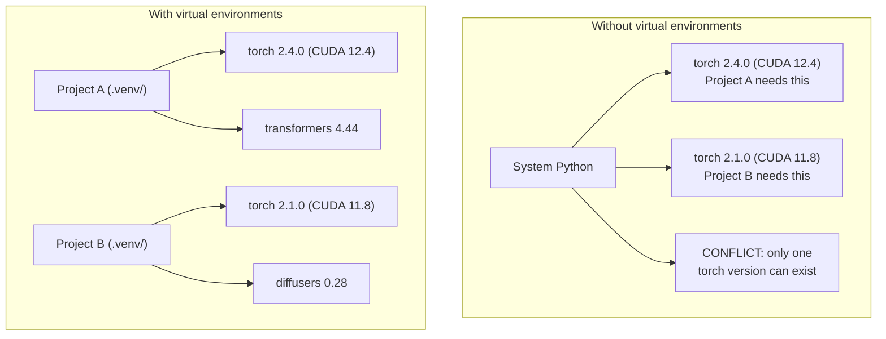

# Python Environments | Python 环境管理

> Dependency hell is real. Virtual environments are the cure.
> 依赖地狱是真实存在的。虚拟环境就是解药。

**Type:** Build | **类型:** 构建
**Languages:** Shell | **语言:** Shell
**Prerequisites:** Phase 0, Lesson 01 | **前置知识:** Phase 0, 第 01 课
**Time:** ~30 minutes | **时间:** ~30 分钟

## Learning Objectives | 学习目标

- Create isolated virtual environments using `uv`, `venv`, or `conda`
  中文翻译：使用 `uv`、`venv` 或 `conda` 创建隔离的虚拟环境
- Write a `pyproject.toml` with optional dependency groups and generate lockfiles for reproducibility
  中文翻译：编写带可选依赖组的 `pyproject.toml`，生成 lockfile 确保可复现性
- Diagnose and fix common pitfalls: global installs, pip/conda mixing, CUDA version mismatches
  中文翻译：诊断并修复常见问题：全局安装、pip/conda 混用、CUDA 版本不匹配
- Implement a per-phase environment strategy for projects with conflicting dependencies
  中文翻译：为有依赖冲突的项目实施按阶段划分的环境策略

> **【中文解读】**
> Python 项目依赖冲突是 AI 开发中最常见的问题之一。本项目需要 PyTorch 2.4，那个项目需要 2.1——全局安装只能有一个版本。虚拟环境让每个项目拥有独立的依赖，互不干扰。

## The Problem | 问题描述

You install PyTorch 2.4 for a fine-tuning project. Next week, a different project needs PyTorch 2.1 because its CUDA build is pinned. You upgrade globally, and the first project breaks. You downgrade, and the second one breaks.

> 你为一个微调项目安装了 PyTorch 2.4。下周，另一个项目因为 CUDA 构建版本锁定需要 PyTorch 2.1。你全局升级，第一个项目就挂了。你降级，第二个项目又挂了。

This is dependency hell. It happens constantly in AI/ML work because:

> 这就是依赖地狱。在 AI/ML 工作中这经常发生，因为：

- PyTorch, JAX, and TensorFlow each ship their own CUDA bindings
  中文翻译：PyTorch、JAX 和 TensorFlow 各自带 CUDA 绑定
- Model libraries pin specific framework versions
  中文翻译：模型库锁定特定框架版本
- A global `pip install` overwrites whatever was there before
  中文翻译：全局 `pip install` 会覆盖之前安装的任何版本
- CUDA 11.8 builds don't work with CUDA 12.x drivers (and vice versa)
  中文翻译：CUDA 11.8 构建在 CUDA 12.x 驱动上不工作（反之亦然）

The fix: every project gets its own isolated environment with its own packages.

> 解决方案：每个项目都有自己的隔离环境，拥有独立的依赖包。

> **【中文解读】**
> "依赖地狱"在 AI 项目中特别常见，因为 PyTorch/JAX/TensorFlow 各自带 CUDA 绑定，版本之间互不兼容。解决方案：每个项目一个隔离的虚拟环境。

## The Concept | 核心概念

> **【中文解读】** 下图展示了有/无虚拟环境的区别：没有虚拟环境时，系统 Python 只能安装一个版本的 PyTorch，项目间互相冲突；有了虚拟环境，每个项目拥有独立的依赖，互不干扰。



## Build It | 动手实现

> **【拓展：uv vs pip vs conda — 该选哪个？】** (1) **uv**（推荐）：Rust 写的，比 pip 快 10-100 倍，自动管理虚拟环境，一行命令搞定 `uv venv && uv pip install`。(2) **venv**：Python 内置，无需安装，但速度慢且功能少。(3) **conda**：适合需要非 Python 依赖（如 CUDA 库）的场景，但环境体积巨大。2026 年的 AI 项目推荐 uv 作为默认选择。

### Option 1: uv venv (Recommended)

`uv` is the fastest Python package manager (10-100x faster than pip). It handles virtual environments, Python versions, and dependency resolution in one tool.

> `uv` 是最快的 Python 包管理器（比 pip 快 10-100 倍）。它在一个工具中处理虚拟环境、Python 版本和依赖解析。

```bash
curl -LsSf https://astral.sh/uv/install.sh | sh

uv python install 3.12

cd your-project
uv venv
source .venv/bin/activate
```

Install packages:

> 安装包：

```bash
uv pip install torch numpy
```

Create a project with `pyproject.toml` in one step:

> 一步创建带 `pyproject.toml` 的项目：

```bash
uv init my-ai-project
cd my-ai-project
uv add torch numpy matplotlib
```

### Option 2: venv (Built-in) | 选项2：venv（Python 内置）

> **【中文解读】** venv 是 Python 自带的虚拟环境工具，不需要额外安装。但相比 uv，它不会自动管理 Python 版本，也不会生成 lockfile。适合简单的、不需要复杂依赖管理的项目。

If you can't install `uv`, Python ships with `venv`:

> 如果你无法安装 `uv`，Python 自带 `venv`：

```bash
python3 -m venv .venv
source .venv/bin/activate  # Linux/macOS
.venv\Scripts\activate     # Windows

pip install torch numpy
```

Slower than `uv`, but works everywhere Python is installed.

> 比 `uv` 慢，但在任何安装了 Python 的地方都能用。

### Option 3: conda (When You Need It)

Conda manages non-Python dependencies like CUDA toolkits, cuDNN, and C libraries. Use it when:

> Conda 管理非 Python 依赖，如 CUDA 工具包、cuDNN 和 C 库。在以下情况使用：

- You need a specific CUDA toolkit version without installing it system-wide
  中文翻译：需要特定 CUDA 工具包版本，但不希望全局安装
- You're on a shared cluster where you can't install system packages
  中文翻译：在共享集群上，无法安装系统包
- A library's install instructions say "use conda"
  中文翻译：库的安装说明写着"使用 conda"

```bash
# Install miniconda (not the full Anaconda)
curl -LsSf https://repo.anaconda.com/miniconda/Miniconda3-latest-Linux-x86_64.sh -o miniconda.sh
bash miniconda.sh -b

conda create -n myproject python=3.12
conda activate myproject

conda install pytorch torchvision torchaudio pytorch-cuda=12.4 -c pytorch -c nvidia
```

One rule: if you use conda for an environment, use conda for all packages in that environment. Mixing `pip install` into a conda env causes dependency conflicts that are painful to debug.

> 一条规则：如果用 conda 管理环境，就用 conda 管理该环境的所有包。在 conda 环境中混用 `pip install` 会导致难以调试的依赖冲突。

### For This Course: Per-Phase Strategy

You could create one environment for the whole course. Don't. Different phases need different (sometimes conflicting) dependencies.

> 你可以为整个课程创建一个环境。不要这样做。不同阶段需要不同（有时冲突的）依赖。

Strategy:

> 策略：

```
ai-engineering-from-scratch/
├── .venv/                    <-- shared lightweight env for phases 0-3
├── phases/
│   ├── 04-neural-networks/
│   │   └── .venv/            <-- PyTorch env
│   ├── 05-cnns/
│   │   └── .venv/            <-- same PyTorch env (symlink or shared)
│   ├── 08-transformers/
│   │   └── .venv/            <-- might need different transformer versions
│   └── 11-llm-apis/
│       └── .venv/            <-- API SDKs, no torch needed
```

The script in `code/env_setup.sh` creates the base environment for this course.

> `code/env_setup.sh` 中的脚本会创建本课程的基础环境。

## pyproject.toml Basics | pyproject.toml 基础

> **【拓展：pyproject.toml 是现代 Python 项目的标准配置】** 它替代了传统的 `setup.py` 和 `requirements.txt`。一个文件定义项目元数据、依赖、开发工具配置。AI 项目推荐使用 optional dependency groups 来区分训练依赖（`[train]`）和推理依赖（`[serve]`），避免在生产环境安装不必要的 GPU 库。

Every Python project should have a `pyproject.toml`. It replaces `setup.py`, `setup.cfg`, and `requirements.txt` in one file.

> 每个 Python 项目都应该有 `pyproject.toml`。它用一个文件替代了 `setup.py`、`setup.cfg` 和 `requirements.txt`。

```toml
[project]
name = "ai-engineering-from-scratch"
version = "0.1.0"
requires-python = ">=3.11"
dependencies = [
    "numpy>=1.26",
    "matplotlib>=3.8",
    "jupyter>=1.0",
    "scikit-learn>=1.4",
]

[project.optional-dependencies]
torch = ["torch>=2.3", "torchvision>=0.18"]
llm = ["anthropic>=0.39", "openai>=1.50"]
```

Then install:

> 然后安装：

```bash
uv pip install -e ".[torch]"    # base + PyTorch
uv pip install -e ".[llm]"     # base + LLM SDKs
uv pip install -e ".[torch,llm]" # everything
```

## Lockfiles

A lockfile pins every dependency (including transitive ones) to exact versions. This guarantees reproducibility: anyone who installs from the lockfile gets exactly the same packages.

> Lockfile 将每个依赖（包括传递依赖）锁定到精确版本。这保证了可复现性：任何人从 lockfile 安装都能获得完全相同的包。

```bash
# uv generates uv.lock automatically when using uv add
uv add numpy

# pip-tools approach
uv pip compile pyproject.toml -o requirements.lock
uv pip install -r requirements.lock
```

Commit your lockfile to git. When someone clones the repo, they install from the lockfile and get identical versions.

> 将 lockfile 提交到 git。当有人克隆仓库时，他们从 lockfile 安装并获得完全相同的版本。

## Common Mistakes | 常见错误

> **【中文解读】** Python 环境管理中最常见的 5 个错误：(1) 全局安装（用 `pip install` 不在虚拟环境中）；(2) 混用 pip 和 conda；(3) 忘记激活虚拟环境；(4) 把 `.venv` 目录提交到 git；(5) CUDA 版本不匹配。以下逐个讲解和修复方法。

### 1. Installing globally

```bash
pip install torch  # BAD: installs to system Python

source .venv/bin/activate
pip install torch  # GOOD: installs to virtual environment
```

Check where your packages go:

> 检查你的包装在哪里：

```bash
which python       # should show .venv/bin/python, not /usr/bin/python
which pip           # should show .venv/bin/pip
```

### 2. Mixing pip and conda

```bash
conda create -n myenv python=3.12
conda activate myenv
conda install pytorch -c pytorch
pip install some-other-package   # BAD: can break conda's dependency tracking
conda install some-other-package # GOOD: let conda manage everything
```

If you must use pip inside conda (some packages are pip-only), install all conda packages first, then pip packages last.

> 如果必须在 conda 中使用 pip（有些包只有 pip 版本），先安装所有 conda 包，最后再安装 pip 包。

### 3. Forgetting to activate

```bash
python train.py           # uses system Python, missing packages
source .venv/bin/activate
python train.py           # uses project Python, packages found
```

Your shell prompt should show the environment name:

> 你的 shell 提示符应该显示环境名称：

```
(.venv) $ python train.py
```

### 4. Committing .venv to git

```bash
echo ".venv/" >> .gitignore
```

Virtual environments are 200MB-2GB. They're local, not portable between machines. Commit `pyproject.toml` and the lockfile instead.

> 虚拟环境有 200MB-2GB。它们是本地的，不能在机器间移植。改为提交 `pyproject.toml` 和 lockfile。

### 5. CUDA version mismatch | 第5个：CUDA 版本不匹配

> **【拓展：CUDA 版本地狱】** PyTorch 每个版本绑定特定 CUDA 版本（如 PyTorch 2.4 → CUDA 12.4）。装错版本会出现"找不到 GPU"或诡异的运行时错误。解决方案：先 `nvidia-smi` 确认驱动版本，再去 [pytorch.org](https://pytorch.org) 查对应的安装命令。用 `uv pip install torch --index-url URL` 指定 CUDA 版本。

```bash
nvidia-smi                # shows driver CUDA version (e.g., 12.4)
python -c "import torch; print(torch.version.cuda)"  # shows PyTorch CUDA version

# These must be compatible.
# PyTorch CUDA version must be <= driver CUDA version.
```

## Use It | 使用指南

> **【中文解读】** 本课程的推荐策略：每个 Phase 创建一个虚拟环境（如 `.venv-phase04`），这样可以避免不同阶段的依赖冲突。AI 工程中，版本不兼容是踩坑的第一大原因，做好环境隔离能省去大量调试时间。

Run the setup script to create your course environment:

> 运行安装脚本创建课程环境：

```bash
bash phases/00-setup-and-tooling/06-python-environments/code/env_setup.sh
```

This creates a `.venv` at the repo root with core dependencies installed and verified.

> 这会在仓库根目录创建一个 `.venv`，并安装和验证核心依赖。

## Exercises | 练习题

1. Run `env_setup.sh` and verify all checks pass
   运行环境安装脚本，确认所有检查通过
2. Create a second virtual environment, install a different version of numpy in it, and confirm the two environments are isolated
   创建第二个虚拟环境，安装不同版本的 NumPy，确认两个环境隔离
3. Write a `pyproject.toml` for a project that needs both PyTorch and the Anthropic SDK
   为一个同时需要 PyTorch 和 Anthropic SDK 的项目编写 `pyproject.toml`
4. Deliberately install a package globally (without activating a venv), notice where it goes, then uninstall it
   故意在全局安装一个包（不激活虚拟环境），观察它装在哪里，然后卸载

## Key Terms | 关键术语

| Term | What people say | What it actually means |
|------|----------------|----------------------|
| Virtual environment | "A venv" | An isolated directory containing a Python interpreter and packages, separate from the system Python |
| Lockfile | "Pinned dependencies" | A file listing every package and its exact version, guaranteeing identical installs across machines |
| pyproject.toml | "The new setup.py" | The standard Python project configuration file, replacing setup.py/setup.cfg/requirements.txt |
| Transitive dependency | "A dependency of a dependency" | Package B depends on C; if you install A which depends on B, C is a transitive dependency of A |
| CUDA mismatch | "My GPU isn't working" | PyTorch was compiled for a different CUDA version than what your GPU driver supports |

| 术语 | 俗称 | 实际含义 |
|------|------|---------|
| Virtual environment | "venv" | 包含独立 Python 解释器和包的隔离目录 |
| Lockfile | "锁定依赖" | 记录每个包精确版本的文件，确保跨机器安装一致 |
| pyproject.toml | "新版 setup.py" | Python 项目标准配置文件，替代 setup.py 和 requirements.txt |
| Transitive dependency | "依赖的依赖" | A 依赖 B，B 依赖 C，C 就是 A 的传递依赖 |
| CUDA mismatch | "GPU 不工作" | PyTorch 编译时的 CUDA 版本与 GPU 驱动不匹配 |
