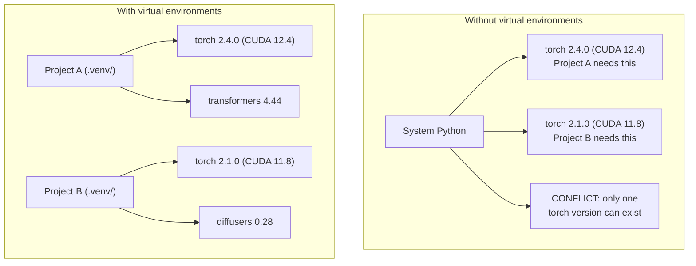

# Python Environments | Python 环境管理

> Dependency hell is real. Virtual environments are the cure.

**Type:** Build
**Languages:** Shell
**Prerequisites:** Phase 0, Lesson 01
**Time:** ~30 minutes

## Learning Objectives | 学习目标

- Create isolated virtual environments using `uv`, `venv`, or `conda`
- Write a `pyproject.toml` with optional dependency groups and generate lockfiles for reproducibility
- Diagnose and fix common pitfalls: global installs, pip/conda mixing, CUDA version mismatches
- Implement a per-phase environment strategy for projects with conflicting dependencies

> **【中文解读】**
> Python 项目依赖冲突是 AI 开发中最常见的问题之一。本项目需要 PyTorch 2.4，那个项目需要 2.1——全局安装只能有一个版本。虚拟环境让每个项目拥有独立的依赖，互不干扰。

## The Problem | 问题描述

You install PyTorch 2.4 for a fine-tuning project. Next week, a different project needs PyTorch 2.1 because its CUDA build is pinned. You upgrade globally, and the first project breaks. You downgrade, and the second one breaks.

This is dependency hell. It happens constantly in AI/ML work because:

- PyTorch, JAX, and TensorFlow each ship their own CUDA bindings
- Model libraries pin specific framework versions
- A global `pip install` overwrites whatever was there before
- CUDA 11.8 builds don't work with CUDA 12.x drivers (and vice versa)

The fix: every project gets its own isolated environment with its own packages.

> **【中文解读】**
> "依赖地狱"在 AI 项目中特别常见，因为 PyTorch/JAX/TensorFlow 各自带 CUDA 绑定，版本之间互不兼容。解决方案：每个项目一个隔离的虚拟环境。

## The Concept



## Build It

### Option 1: uv venv (Recommended)

`uv` is the fastest Python package manager (10-100x faster than pip). It handles virtual environments, Python versions, and dependency resolution in one tool.

```bash
curl -LsSf https://astral.sh/uv/install.sh | sh

uv python install 3.12

cd your-project
uv venv
source .venv/bin/activate
```

Install packages:

```bash
uv pip install torch numpy
```

Create a project with `pyproject.toml` in one step:

```bash
uv init my-ai-project
cd my-ai-project
uv add torch numpy matplotlib
```

### Option 2: venv (Built-in)

If you can't install `uv`, Python ships with `venv`:

```bash
python3 -m venv .venv
source .venv/bin/activate  # Linux/macOS
.venv\Scripts\activate     # Windows

pip install torch numpy
```

Slower than `uv`, but works everywhere Python is installed.

### Option 3: conda (When You Need It)

Conda manages non-Python dependencies like CUDA toolkits, cuDNN, and C libraries. Use it when:

- You need a specific CUDA toolkit version without installing it system-wide
- You're on a shared cluster where you can't install system packages
- A library's install instructions say "use conda"

```bash
# Install miniconda (not the full Anaconda)
curl -LsSf https://repo.anaconda.com/miniconda/Miniconda3-latest-Linux-x86_64.sh -o miniconda.sh
bash miniconda.sh -b

conda create -n myproject python=3.12
conda activate myproject

conda install pytorch torchvision torchaudio pytorch-cuda=12.4 -c pytorch -c nvidia
```

One rule: if you use conda for an environment, use conda for all packages in that environment. Mixing `pip install` into a conda env causes dependency conflicts that are painful to debug.

### For This Course: Per-Phase Strategy

You could create one environment for the whole course. Don't. Different phases need different (sometimes conflicting) dependencies.

Strategy:

```
ai-engineering-from-scratch/
├── .venv/                    <-- shared lightweight env for phases 0-3
├── phases/
│   ├── 04-neural-networks/
│   │   └── .venv/            <-- PyTorch env
│   ├── 05-cnns/
│   │   └── .venv/            <-- same PyTorch env (symlink or shared)
│   ├── 08-transformers/
│   │   └── .venv/            <-- might need different transformer versions
│   └── 11-llm-apis/
│       └── .venv/            <-- API SDKs, no torch needed
```

The script in `code/env_setup.sh` creates the base environment for this course.

## pyproject.toml Basics

Every Python project should have a `pyproject.toml`. It replaces `setup.py`, `setup.cfg`, and `requirements.txt` in one file.

```toml
[project]
name = "ai-engineering-from-scratch"
version = "0.1.0"
requires-python = ">=3.11"
dependencies = [
    "numpy>=1.26",
    "matplotlib>=3.8",
    "jupyter>=1.0",
    "scikit-learn>=1.4",
]

[project.optional-dependencies]
torch = ["torch>=2.3", "torchvision>=0.18"]
llm = ["anthropic>=0.39", "openai>=1.50"]
```

Then install:

```bash
uv pip install -e ".[torch]"    # base + PyTorch
uv pip install -e ".[llm]"     # base + LLM SDKs
uv pip install -e ".[torch,llm]" # everything
```

## Lockfiles

A lockfile pins every dependency (including transitive ones) to exact versions. This guarantees reproducibility: anyone who installs from the lockfile gets exactly the same packages.

```bash
# uv generates uv.lock automatically when using uv add
uv add numpy

# pip-tools approach
uv pip compile pyproject.toml -o requirements.lock
uv pip install -r requirements.lock
```

Commit your lockfile to git. When someone clones the repo, they install from the lockfile and get identical versions.

## Common Mistakes

### 1. Installing globally

```bash
pip install torch  # BAD: installs to system Python

source .venv/bin/activate
pip install torch  # GOOD: installs to virtual environment
```

Check where your packages go:

```bash
which python       # should show .venv/bin/python, not /usr/bin/python
which pip           # should show .venv/bin/pip
```

### 2. Mixing pip and conda

```bash
conda create -n myenv python=3.12
conda activate myenv
conda install pytorch -c pytorch
pip install some-other-package   # BAD: can break conda's dependency tracking
conda install some-other-package # GOOD: let conda manage everything
```

If you must use pip inside conda (some packages are pip-only), install all conda packages first, then pip packages last.

### 3. Forgetting to activate

```bash
python train.py           # uses system Python, missing packages
source .venv/bin/activate
python train.py           # uses project Python, packages found
```

Your shell prompt should show the environment name:

```
(.venv) $ python train.py
```

### 4. Committing .venv to git

```bash
echo ".venv/" >> .gitignore
```

Virtual environments are 200MB-2GB. They're local, not portable between machines. Commit `pyproject.toml` and the lockfile instead.

### 5. CUDA version mismatch

```bash
nvidia-smi                # shows driver CUDA version (e.g., 12.4)
python -c "import torch; print(torch.version.cuda)"  # shows PyTorch CUDA version

# These must be compatible.
# PyTorch CUDA version must be <= driver CUDA version.
```

## Use It

Run the setup script to create your course environment:

```bash
bash phases/00-setup-and-tooling/06-python-environments/code/env_setup.sh
```

This creates a `.venv` at the repo root with core dependencies installed and verified.

## Exercises | 练习题

1. Run `env_setup.sh` and verify all checks pass
   运行环境安装脚本，确认所有检查通过
2. Create a second virtual environment, install a different version of numpy in it, and confirm the two environments are isolated
   创建第二个虚拟环境，安装不同版本的 NumPy，确认两个环境隔离
3. Write a `pyproject.toml` for a project that needs both PyTorch and the Anthropic SDK
   为一个同时需要 PyTorch 和 Anthropic SDK 的项目编写 `pyproject.toml`
4. Deliberately install a package globally (without activating a venv), notice where it goes, then uninstall it
   故意在全局安装一个包（不激活虚拟环境），观察它装在哪里，然后卸载

## Key Terms | 关键术语

| Term | What people say | What it actually means |
|------|----------------|----------------------|
| Virtual environment | "A venv" | An isolated directory containing a Python interpreter and packages, separate from the system Python |
| Lockfile | "Pinned dependencies" | A file listing every package and its exact version, guaranteeing identical installs across machines |
| pyproject.toml | "The new setup.py" | The standard Python project configuration file, replacing setup.py/setup.cfg/requirements.txt |
| Transitive dependency | "A dependency of a dependency" | Package B depends on C; if you install A which depends on B, C is a transitive dependency of A |
| CUDA mismatch | "My GPU isn't working" | PyTorch was compiled for a different CUDA version than what your GPU driver supports |

| 术语 | 俗称 | 实际含义 |
|------|------|---------|
| Virtual environment | "venv" | 包含独立 Python 解释器和包的隔离目录 |
| Lockfile | "锁定依赖" | 记录每个包精确版本的文件，确保跨机器安装一致 |
| pyproject.toml | "新版 setup.py" | Python 项目标准配置文件，替代 setup.py 和 requirements.txt |
| Transitive dependency | "依赖的依赖" | A 依赖 B，B 依赖 C，C 就是 A 的传递依赖 |
| CUDA mismatch | "GPU 不工作" | PyTorch 编译时的 CUDA 版本与 GPU 驱动不匹配 |
