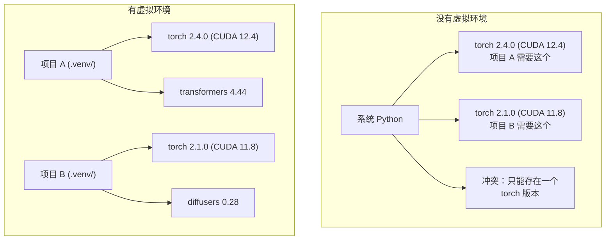

# Python 环境管理

> 依赖地狱是真实存在的。虚拟环境是解药。

**类型：** 动手实践
**语言：** Shell
**前置条件：** Phase 0, Lesson 01
**预计用时：** 约 30 分钟

## 学习目标

- 使用 `uv`、`venv` 或 `conda` 创建隔离的虚拟环境
- 编写带可选依赖组的 `pyproject.toml`，生成 lockfile 实现可复现性
- 诊断和修复常见陷阱：全局安装、pip/conda 混用、CUDA 版本不匹配
- 为有冲突依赖的项目实施按阶段（per-phase）的环境策略

> **【中文解读】**
> Python 项目依赖冲突是 AI 开发中最常见的问题之一。本项目需要 PyTorch 2.4，那个项目需要 2.1——全局安装只能有一个版本。虚拟环境让每个项目拥有独立的依赖，互不干扰。

## 问题引入

你为微调项目安装了 PyTorch 2.4。下周，另一个项目需要 PyTorch 2.1，因为它的 CUDA 构建版本固定了。你全局升级，第一个项目坏了。你降级，第二个项目坏了。

这就是依赖地狱。它在 AI/ML 工作中经常发生，因为：

- PyTorch、JAX 和 TensorFlow 各自附带自己的 CUDA 绑定
- 模型库固定了特定的框架版本
- 全局 `pip install` 会覆盖之前安装的任何东西
- CUDA 11.8 构建版本不能在 CUDA 12.x 驱动上运行（反之亦然）

解决方案：每个项目拥有自己的隔离环境和独立的包。

> **【中文解读】**
> "依赖地狱"在 AI 项目中特别常见，因为 PyTorch/JAX/TensorFlow 各自带 CUDA 绑定，版本之间互不兼容。解决方案：每个项目一个隔离的虚拟环境。

## 核心概念

> **【中文解读】** 下图展示了有/无虚拟环境的区别：没有虚拟环境时，系统 Python 只能安装一个版本的 PyTorch，项目间互相冲突；有了虚拟环境，每个项目拥有独立的依赖，互不干扰。



## 动手实现

> **【拓展：uv vs pip vs conda — 该选哪个？】** (1) **uv**（推荐）：Rust 写的，比 pip 快 10-100 倍，自动管理虚拟环境，一行命令搞定 `uv venv && uv pip install`。(2) **venv**：Python 内置，无需安装，但速度慢且功能少。(3) **conda**：适合需要非 Python 依赖（如 CUDA 库）的场景，但环境体积巨大。2026 年的 AI 项目推荐 uv 作为默认选择。

### 选项 1：uv venv（推荐）

`uv` 是最快的 Python 包管理器（比 pip 快 10-100 倍）。它在一个工具中处理虚拟环境、Python 版本和依赖解析。

```bash
curl -LsSf https://astral.sh/uv/install.sh | sh

uv python install 3.12

cd your-project
uv venv
source .venv/bin/activate
```

安装包：

```bash
uv pip install torch numpy
```

一步创建带 `pyproject.toml` 的项目：

```bash
uv init my-ai-project
cd my-ai-project
uv add torch numpy matplotlib
```

### 选项 2：venv（Python 内置）

> **【中文解读】** venv 是 Python 自带的虚拟环境工具，不需要额外安装。但相比 uv，它不会自动管理 Python 版本，也不会生成 lockfile。适合简单的、不需要复杂依赖管理的项目。

如果你无法安装 `uv`，Python 自带 `venv`：

```bash
python3 -m venv .venv
source .venv/bin/activate  # Linux/macOS
.venv\Scripts\activate     # Windows

pip install torch numpy
```

比 `uv` 慢，但在安装了 Python 的任何地方都能用。

### 选项 3：conda（需要时使用）

Conda 管理非 Python 依赖，如 CUDA 工具包、cuDNN 和 C 库。在以下情况使用：

- 你需要特定 CUDA 工具包版本，但不想全局安装
- 你在共享集群上，无法安装系统包
- 某个库的安装说明说"使用 conda"

```bash
# 安装 miniconda（不是完整版 Anaconda）
curl -LsSf https://repo.anaconda.com/miniconda/Miniconda3-latest-Linux-x86_64.sh -o miniconda.sh
bash miniconda.sh -b

conda create -n myproject python=3.12
conda activate myproject

conda install pytorch torchvision torchaudio pytorch-cuda=12.4 -c pytorch -c nvidia
```

一条规则：如果你在某个环境中使用 conda，就在该环境中对所有包使用 conda。在 conda 环境中混用 `pip install` 会导致难以调试的依赖冲突。

### 本课程策略：按阶段创建环境

你可以为整个课程创建一个环境。不要这样做。不同阶段需要不同（有时冲突）的依赖。

策略：

```
ai-engineering-from-scratch/
├── .venv/                    <-- 阶段 0-3 共享的轻量环境
├── phases/
│   ├── 04-neural-networks/
│   │   └── .venv/            <-- PyTorch 环境
│   ├── 05-cnns/
│   │   └── .venv/            <-- 相同的 PyTorch 环境（符号链接或共享）
│   ├── 08-transformers/
│   │   └── .venv/            <-- 可能需要不同版本的 transformer
│   └── 11-llm-apis/
│       └── .venv/            <-- API SDK，不需要 torch
```

`code/env_setup.sh` 中的脚本创建本课程的基础环境。

## pyproject.toml 基础

> **【拓展：pyproject.toml 是现代 Python 项目的标准配置】** 它替代了传统的 `setup.py` 和 `requirements.txt`。一个文件定义项目元数据、依赖、开发工具配置。AI 项目推荐使用 optional dependency groups 来区分训练依赖（`[train]`）和推理依赖（`[serve]`），避免在生产环境安装不必要的 GPU 库。

每个 Python 项目都应该有 `pyproject.toml`。它用一个文件替代 `setup.py`、`setup.cfg` 和 `requirements.txt`。

```toml
[project]
name = "ai-engineering-from-scratch"
version = "0.1.0"
requires-python = ">=3.11"
dependencies = [
    "numpy>=1.26",
    "matplotlib>=3.8",
    "jupyter>=1.0",
    "scikit-learn>=1.4",
]

[project.optional-dependencies]
torch = ["torch>=2.3", "torchvision>=0.18"]
llm = ["anthropic>=0.39", "openai>=1.50"]
```

然后安装：

```bash
uv pip install -e ".[torch]"    # 基础 + PyTorch
uv pip install -e ".[llm]"     # 基础 + LLM SDK
uv pip install -e ".[torch,llm]" # 全部
```

## Lockfile

lockfile 将每个依赖（包括传递依赖）固定到精确版本。这保证了可复现性：任何从 lockfile 安装的人都能获得完全相同的包。

```bash
# 使用 uv add 时自动生成 uv.lock
uv add numpy

# pip-tools 方式
uv pip compile pyproject.toml -o requirements.lock
uv pip install -r requirements.lock
```

将 lockfile 提交到 git。当别人克隆仓库时，他们从 lockfile 安装并获得相同的版本。

## 常见错误

> **【中文解读】** Python 环境管理中最常见的 5 个错误：(1) 全局安装（用 `pip install` 不在虚拟环境中）；(2) 混用 pip 和 conda；(3) 忘记激活虚拟环境；(4) 把 `.venv` 目录提交到 git；(5) CUDA 版本不匹配。以下逐个讲解和修复方法。

### 错误 1：全局安装

```bash
pip install torch  # 错误：安装到系统 Python

source .venv/bin/activate
pip install torch  # 正确：安装到虚拟环境
```

检查包安装到哪里：

```bash
which python       # 应该显示 .venv/bin/python，而不是 /usr/bin/python
which pip           # 应该显示 .venv/bin/pip
```

### 错误 2：混用 pip 和 conda

```bash
conda create -n myenv python=3.12
conda activate myenv
conda install pytorch -c pytorch
pip install some-other-package   # 错误：可能破坏 conda 的依赖追踪
conda install some-other-package # 正确：让 conda 管理一切
```

如果你必须在 conda 中使用 pip（某些包只有 pip 版本），先安装所有 conda 包，最后安装 pip 包。

### 错误 3：忘记激活环境

```bash
python train.py           # 使用系统 Python，缺少包
source .venv/bin/activate
python train.py           # 使用项目 Python，包都能找到
```

你的 shell 提示符应该显示环境名：

```
(.venv) $ python train.py
```

### 错误 4：将 .venv 提交到 git

```bash
echo ".venv/" >> .gitignore
```

虚拟环境有 200MB-2GB。它们是本地的，不能在机器间移植。应该提交 `pyproject.toml` 和 lockfile。

### 错误 5：CUDA 版本不匹配

> **【拓展：CUDA 版本地狱】** PyTorch 每个版本绑定特定 CUDA 版本（如 PyTorch 2.4 → CUDA 12.4）。装错版本会出现"找不到 GPU"或诡异的运行时错误。解决方案：先 `nvidia-smi` 确认驱动版本，再去 [pytorch.org](https://pytorch.org) 查对应的安装命令。用 `uv pip install torch --index-url URL` 指定 CUDA 版本。

```bash
nvidia-smi                # 显示驱动 CUDA 版本（如 12.4）
python -c "import torch; print(torch.version.cuda)"  # 显示 PyTorch CUDA 版本

# 这两个必须兼容。
# PyTorch CUDA 版本必须 <= 驱动 CUDA 版本。
```

## 用框架实现

> **【中文解读】** 本课程的推荐策略：每个 Phase 创建一个虚拟环境（如 `.venv-phase04`），这样可以避免不同阶段的依赖冲突。AI 工程中，版本不兼容是踩坑的第一大原因，做好环境隔离能省去大量调试时间。

运行安装脚本创建课程环境：

```bash
bash phases/00-setup-and-tooling/06-python-environments/code/env_setup.sh
```

这会在仓库根目录创建一个 `.venv`，安装并验证核心依赖。

## 练习题

1. 运行环境安装脚本，确认所有检查通过
2. 创建第二个虚拟环境，安装不同版本的 NumPy，确认两个环境隔离
3. 为一个同时需要 PyTorch 和 Anthropic SDK 的项目编写 `pyproject.toml`
4. 故意在全局安装一个包（不激活虚拟环境），观察它装在哪里，然后卸载

## 术语速查表

| 术语 | 俗称 | 实际含义 |
|------|------|---------|
| Virtual environment | "venv" | 包含独立 Python 解释器和包的隔离目录 |
| Lockfile | "锁定依赖" | 记录每个包精确版本的文件，确保跨机器安装一致 |
| pyproject.toml | "新版 setup.py" | Python 项目标准配置文件，替代 setup.py 和 requirements.txt |
| Transitive dependency | "依赖的依赖" | A 依赖 B，B 依赖 C，C 就是 A 的传递依赖 |
| CUDA mismatch | "GPU 不工作" | PyTorch 编译时的 CUDA 版本与 GPU 驱动不匹配 |
