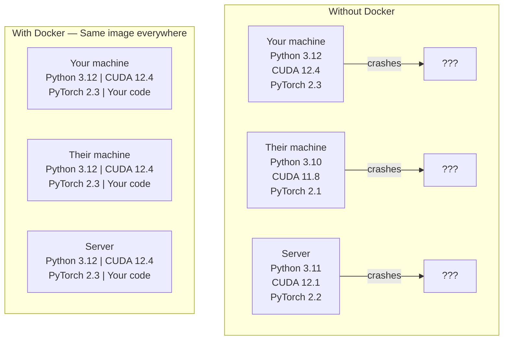

# Docker for AI | Docker 容器化 AI 应用

> Containers make "works on my machine" a thing of the past.
> 容器让"在我机器上能跑"成为历史。

**Type:** Build | **类型:** 构建
**Languages:** Docker | **语言:** Docker
**Prerequisites:** Phase 0, Lessons 01 and 03 | **前置知识:** Phase 0, 第 01 课和第 03 课
**Time:** ~60 minutes | **时间:** ~60 分钟

## Learning Objectives | 学习目标

- Build a GPU-enabled Docker image with CUDA, PyTorch, and AI libraries from a Dockerfile
  中文翻译：从 Dockerfile 构建支持 GPU 的 Docker 镜像，包含 CUDA、PyTorch 和 AI 库
- Mount host directories as volumes to persist models, datasets, and code across container rebuilds
  中文翻译：挂载宿主目录为卷，在容器重建后保持模型、数据集和代码持久化
- Configure the NVIDIA Container Toolkit to expose GPUs inside containers
  中文翻译：配置 NVIDIA Container Toolkit，在容器内暴露 GPU
- Orchestrate multi-service AI applications (inference server + vector database) using Docker Compose
  中文翻译：使用 Docker Compose 编排多服务 AI 应用（推理服务器 + 向量数据库）

> **【中文解读】**
> Docker 把代码、运行时、库和系统工具打包成一个"容器"，确保在任何机器上运行结果一致。AI 项目依赖复杂（CUDA、PyTorch、cuDNN 等），Docker 是解决"在我机器上能跑"问题的标准方案。

## The Problem | 问题描述

You trained a model on your laptop with PyTorch 2.3, CUDA 12.4, and Python 3.12. Your colleague has PyTorch 2.1, CUDA 11.8, and Python 3.10. Your model crashes on their machine. Your Dockerfile works on both.

> 你在笔记本电脑上用 PyTorch 2.3、CUDA 12.4 和 Python 3.12 训练了一个模型。你的同事用的是 PyTorch 2.1、CUDA 11.8 和 Python 3.10。模型在他机器上崩溃。但你的 Dockerfile 两台机器都能跑。

AI projects are dependency nightmares. A typical stack includes Python, PyTorch, CUDA drivers, cuDNN, system-level C libraries, and specialized packages like flash-attn that need exact compiler versions. Docker packages all of this into a single image that runs identically everywhere.

> AI 项目是依赖管理的噩梦。典型的技术栈包括 Python、PyTorch、CUDA 驱动、cuDNN、系统级 C 库，以及需要特定编译器版本的特殊包如 flash-attn。Docker 把所有这些打包成一个在任何地方都能一致运行的镜像。

> **【中文解读】**
> AI 项目是最需要 Docker 的项目类型之一。CUDA 版本不兼容、PyTorch 版本冲突、cuDNN 缺失——这些问题用 Docker 一次性解决。

## The Concept | 核心概念

> **【拓展：Docker 在 AI 中的三大用途】** (1) **环境一致性**：在自己电脑上训练好的模型，部署到服务器时不会因为库版本不同而报错；(2) **GPU 隔离**：多人共享一台 GPU 服务器，每人一个容器互不干扰；(3) **一键部署**：`docker run` 一条命令启动完整的 AI 服务（模型 + API + 前端），无需手动配置。Hugging Face 的 TGI、vLLM 等推理框架都提供 Docker 镜像。

Docker wraps your code, runtime, libraries, and system tools into an isolated unit called a container. Think of it as a lightweight virtual machine, except it shares the host OS kernel instead of running its own, so it starts in seconds instead of minutes.

> Docker 将你的代码、运行时、库和系统工具打包成一个称为"容器"的隔离单元。可以把它想象成一台轻量级虚拟机，只不过它共享宿主操作系统的内核而不是运行自己的内核，所以启动只需几秒而不是几分钟。



### Why AI projects need Docker more than most | 为什么 AI 项目特别需要 Docker

> **【中文解读】** AI 项目的依赖链特别深：Python → PyTorch → CUDA → cuDNN → 系统级 C 库。任何一层版本不匹配都会导致训练崩溃或推理结果不一致。Docker 把所有层次打包成一个镜像，确保"在我机器上能跑"变成"在哪都能跑"。

1. **GPU drivers are fragile.** CUDA 12.4 code does not run on CUDA 11.8. Docker isolates the CUDA toolkit inside the container while sharing the host GPU driver through the NVIDIA Container Toolkit.

> 1. **GPU 驱动很脆弱。** CUDA 12.4 的代码不能在 CUDA 11.8 上运行。Docker 通过 NVIDIA Container Toolkit 在容器内隔离 CUDA 工具包，同时共享宿主 GPU 驱动。

2. **Model weights are large.** A 7B parameter model is 14 GB in fp16. You do not want to re-download it every time you rebuild. Docker volumes let you mount a models directory from the host.

> 2. **模型权重很大。** 7B 参数的模型在 fp16 下有 14 GB。你不想每次重建容器都重新下载。Docker 卷让你从宿主挂载模型目录。

3. **Multi-service architectures are common.** A real AI application is not just a Python script. It is an inference server, a vector database for RAG, maybe a web frontend. Docker Compose orchestrates all of these with one command.

> 3. **多服务架构很常见。** 真正的 AI 应用不只是一个 Python 脚本。它包含推理服务器、RAG 向量数据库、可能还有 Web 前端。Docker Compose 用一条命令编排所有服务。

### Key vocabulary | 核心词汇

| Term | What it means |
|------|---------------|
| Image | A read-only template. Your recipe. Built from a Dockerfile. |
| Container | A running instance of an image. Your kitchen. |
| Dockerfile | Instructions to build an image. Layer by layer. |
| Volume | Persistent storage that survives container restarts. |
| docker-compose | A tool for defining multi-container applications in YAML. |

| 术语 | 含义 |
|------|------|
| Image（镜像） | 只读模板，相当于菜谱。由 Dockerfile 构建。 |
| Container（容器） | 镜像的运行实例，相当于厨房。 |
| Dockerfile | 构建镜像的指令文件，逐层定义。 |
| Volume（卷） | 持久化存储，容器重启后数据不丢失。 |
| docker-compose | 用 YAML 定义多容器应用的编排工具。 |

### Common container patterns in AI | AI 中常见的容器模式

> **【拓展：AI 部署的标准模式】** 最常见的 AI 容器模式：(1) **训练容器**——挂载数据集目录，训练完输出模型权重；(2) **推理容器**——加载模型权重，提供 REST API；(3) **Jupyter 容器**——预装所有库的 Notebook 环境。Hugging Face、NVIDIA NGC 提供了大量预构建的 AI 基础镜像。

```
Dev Container
  Full toolkit. Editor support. Jupyter. Debugging tools.
  Used during development and experimentation.

Training Container
  Minimal. Just the training script and dependencies.
  Runs on GPU clusters. No editor, no Jupyter.

Inference Container
  Optimized for serving. Small image. Fast cold start.
  Runs behind a load balancer in production.
```

## Build It | 动手实现

### Step 1: Install Docker

```bash
# macOS
brew install --cask docker
open /Applications/Docker.app

# Ubuntu
curl -fsSL https://get.docker.com | sh
sudo usermod -aG docker $USER
# Log out and back in for group change to take effect
```

Verify:

> 验证安装：

```bash
docker --version
docker run hello-world
```

### Step 2: Install NVIDIA Container Toolkit (Linux with NVIDIA GPU)

This lets Docker containers access your GPU. macOS and Windows (WSL2) users can skip this; Docker Desktop handles GPU passthrough differently on those platforms.

> 这让 Docker 容器能访问你的 GPU。macOS 和 Windows (WSL2) 用户可以跳过此步骤；Docker Desktop 在这些平台上以不同方式处理 GPU 直通。

```bash
distribution=$(. /etc/os-release;echo $ID$VERSION_ID)
curl -fsSL https://nvidia.github.io/libnvidia-container/gpgkey | sudo gpg --dearmor -o /usr/share/keyrings/nvidia-container-toolkit-keyring.gpg
curl -s -L https://nvidia.github.io/libnvidia-container/$distribution/libnvidia-container.list | \
    sed 's#deb https://#deb [signed-by=/usr/share/keyrings/nvidia-container-toolkit-keyring.gpg] https://#g' | \
    sudo tee /etc/apt/sources.list.d/nvidia-container-toolkit.list

sudo apt-get update
sudo apt-get install -y nvidia-container-toolkit
sudo nvidia-ctk runtime configure --runtime=docker
sudo systemctl restart docker
```

Test GPU access inside a container:

> 测试容器内的 GPU 访问：

```bash
docker run --rm --gpus all nvidia/cuda:12.4.1-base-ubuntu22.04 nvidia-smi
```

If you see your GPU info, the toolkit is working.

> 如果你能看到 GPU 信息，说明工具包工作正常。

### Step 3: Understand base images | 第3步：理解基础镜像

> **【中文解读】** 基础镜像是 Dockerfile 的起点。AI 项目推荐使用 NVIDIA 官方的 CUDA 镜像（`nvidia/cuda:12.4.0-devel-ubuntu22.04`）或 PyTorch 官方镜像（`pytorch/pytorch:2.4.0-cuda12.4`），它们预装了 CUDA 运行时和深度学习库。选错基础镜像会导致 GPU 不可用。

Choosing the right base image saves hours of debugging.

> 选择正确的基础镜像能节省数小时的调试时间。

```
nvidia/cuda:12.4.1-devel-ubuntu22.04
  Full CUDA toolkit. Compilers included.
  Use for: building packages that need nvcc (flash-attn, bitsandbytes)
  Size: ~4 GB

nvidia/cuda:12.4.1-runtime-ubuntu22.04
  CUDA runtime only. No compilers.
  Use for: running pre-built code
  Size: ~1.5 GB

pytorch/pytorch:2.3.1-cuda12.4-cudnn9-runtime
  PyTorch pre-installed on top of CUDA.
  Use for: skipping the PyTorch install step
  Size: ~6 GB

python:3.12-slim
  No CUDA. CPU only.
  Use for: inference on CPU, lightweight tools
  Size: ~150 MB
```

### Step 4: Write a Dockerfile for AI development

Here is the Dockerfile in `code/Dockerfile`. Walk through it:

> 这是 `code/Dockerfile` 中的 Dockerfile。我们逐步过一遍：

```dockerfile
FROM nvidia/cuda:12.4.1-devel-ubuntu22.04

ENV DEBIAN_FRONTEND=noninteractive
ENV PYTHONUNBUFFERED=1

RUN apt-get update && apt-get install -y --no-install-recommends \
    python3.12 \
    python3.12-venv \
    python3.12-dev \
    python3-pip \
    git \
    curl \
    build-essential \
    && rm -rf /var/lib/apt/lists/*

RUN update-alternatives --install /usr/bin/python python /usr/bin/python3.12 1

RUN python -m pip install --no-cache-dir --upgrade pip setuptools wheel

RUN python -m pip install --no-cache-dir \
    torch==2.3.1 \
    torchvision==0.18.1 \
    torchaudio==2.3.1 \
    --index-url https://download.pytorch.org/whl/cu124

RUN python -m pip install --no-cache-dir \
    numpy \
    pandas \
    scikit-learn \
    matplotlib \
    jupyter \
    transformers \
    datasets \
    accelerate \
    safetensors

WORKDIR /workspace

VOLUME ["/workspace", "/models"]

EXPOSE 8888

CMD ["python"]
```

Build it:

> 构建镜像：

```bash
docker build -t ai-dev -f phases/00-setup-and-tooling/07-docker-for-ai/code/Dockerfile .
```

This takes a while the first time (downloading CUDA base image + PyTorch). Subsequent builds use cached layers.

> 首次构建需要一些时间（下载 CUDA 基础镜像 + PyTorch）。后续构建会使用缓存的层。

Run it:

> 运行容器：

```bash
docker run --rm -it --gpus all \
    -v $(pwd):/workspace \
    -v ~/models:/models \
    ai-dev python -c "import torch; print(f'PyTorch {torch.__version__}, CUDA: {torch.cuda.is_available()}')"
```

Run Jupyter inside the container:

> 在容器内运行 Jupyter：

```bash
docker run --rm -it --gpus all \
    -v $(pwd):/workspace \
    -v ~/models:/models \
    -p 8888:8888 \
    ai-dev jupyter notebook --ip=0.0.0.0 --port=8888 --no-browser --allow-root
```

### Step 5: Volume mounts for data and models

Volume mounts are critical for AI work. Without them, your 14 GB model downloads vanish when the container stops.

> 卷挂载对 AI 工作至关重要。没有它们，你下载的 14 GB 模型在容器停止时就会消失。

```bash
# Mount your code
-v $(pwd):/workspace

# Mount a shared models directory
-v ~/models:/models

# Mount datasets
-v ~/datasets:/data
```

Inside your training script, load from the mounted path:

> 在训练脚本中，从挂载路径加载：

```python
from transformers import AutoModel

model = AutoModel.from_pretrained("/models/llama-7b")
```

The model lives on your host filesystem. Rebuild the container as often as you want without re-downloading.

> 模型存储在宿主文件系统上。你可以随意重建容器，无需重新下载。

### Step 6: Docker Compose for multi-service AI apps

A real RAG application needs an inference server and a vector database. Docker Compose runs both with one command.

> 真正的 RAG 应用需要推理服务器和向量数据库。Docker Compose 用一条命令同时运行两者。

See `code/docker-compose.yml`:

```yaml
services:
  ai-dev:
    build:
      context: .
      dockerfile: Dockerfile
    deploy:
      resources:
        reservations:
          devices:
            - driver: nvidia
              count: all
              capabilities: [gpu]
    volumes:
      - ../../../:/workspace
      - ~/models:/models
      - ~/datasets:/data
    ports:
      - "8888:8888"
    stdin_open: true
    tty: true
    command: jupyter notebook --ip=0.0.0.0 --port=8888 --no-browser --allow-root

  qdrant:
    image: qdrant/qdrant:v1.12.5
    ports:
      - "6333:6333"
      - "6334:6334"
    volumes:
      - qdrant_data:/qdrant/storage

volumes:
  qdrant_data:
```

Start everything:

> 启动所有服务：

```bash
cd phases/00-setup-and-tooling/07-docker-for-ai/code
docker compose up -d
```

Now your AI dev container can reach the vector database at `http://qdrant:6333` by service name. Docker Compose creates a shared network automatically.

> 现在 AI 开发容器可以通过服务名 `http://qdrant:6333` 访问向量数据库。Docker Compose 自动创建共享网络。

Test the connection from inside the AI container:

> 从 AI 容器内部测试连接：

```python
from qdrant_client import QdrantClient

client = QdrantClient(host="qdrant", port=6333)
print(client.get_collections())
```

Stop everything:

> 停止所有服务：

```bash
docker compose down
```

Add `-v` to also delete the qdrant volume:

> 加 `-v` 同时删除 qdrant 卷：

```bash
docker compose down -v
```

### Step 7: Useful Docker commands for AI work

> 第7步：AI 工作中常用的 Docker 命令

```bash
# List running containers
docker ps

# List all images and their sizes
docker images

# Remove unused images (reclaim disk space)
docker system prune -a

# Check GPU usage inside a running container
docker exec -it <container_id> nvidia-smi

# Copy a file from container to host
docker cp <container_id>:/workspace/results.csv ./results.csv

# View container logs
docker logs -f <container_id>
```

## Use It | 使用指南

> **【拓展：Docker vs Conda 选择指南】** 简单项目用 Conda/uv 即可；需要部署或多人协作时用 Docker。经验法则：如果你说"在我机器上能跑"，说明你该用 Docker 了。本课程大部分课程不需要 Docker，但 Phase 17（基础设施与生产部署）会深度使用。

You now have a reproducible AI development environment. For the rest of this course:

> 你现在有了一个可复现的 AI 开发环境。在课程的剩余部分：

- Use `docker compose up` to start your dev environment and vector database together
  中文翻译：使用 `docker compose up` 同时启动开发环境和向量数据库
- Mount your code, models, and data as volumes so nothing is lost between rebuilds
  中文翻译：将代码、模型和数据挂载为卷，重建后不会丢失
- When a lesson requires a new Python package, add it to the Dockerfile and rebuild
  中文翻译：当课程需要新的 Python 包时，添加到 Dockerfile 并重建
- Share your Dockerfile with teammates. They get the exact same environment.
  中文翻译：与队友共享 Dockerfile，他们获得完全相同的环境

### No GPU?

Remove the `--gpus all` flag and the NVIDIA deploy block. The container still works for CPU-based lessons. PyTorch detects the absence of CUDA and falls back to CPU automatically.

> 移除 `--gpus all` 标志和 NVIDIA deploy 配置块。容器仍然可以用于基于 CPU 的课程。PyTorch 会自动检测 CUDA 不存在并回退到 CPU。

## Exercises | 练习题

1. Build the Dockerfile and run `python -c "import torch; print(torch.__version__)"` inside the container
   构建 Docker 镜像，在容器内运行 PyTorch 验证
2. Start the docker-compose stack and verify Qdrant is accessible from the AI container at `http://qdrant:6333/collections`
   启动 docker-compose 栈，验证 Qdrant 向量数据库可访问
3. Add `flask` to the Dockerfile, rebuild, and run a simple API server on port 5000. Map the port with `-p 5000:5000`
   在 Dockerfile 中添加 flask，重建镜像，运行 API 服务器
4. Measure the image size with `docker images`. Try switching the base image from `devel` to `runtime` and compare sizes
   测量镜像大小，对比 devel 和 runtime 基础镜像的体积差异

## Key Terms | 关键术语

| Term | What people say | What it actually means |
|------|----------------|----------------------|
| Container | "Lightweight VM" | An isolated process using the host kernel, with its own filesystem and network |
| Image layer | "Cached step" | Each Dockerfile instruction creates a layer. Unchanged layers are cached, so rebuilds are fast. |
| NVIDIA Container Toolkit | "GPU in Docker" | A runtime hook that exposes host GPUs to containers via `--gpus` flag |
| Volume mount | "Shared folder" | A directory on the host mapped into the container. Changes persist after the container stops. |
| Base image | "Starting point" | The `FROM` image your Dockerfile builds on top of. Determines what is pre-installed. |

| 术语 | 俗称 | 实际含义 |
|------|------|---------|
| Container | "轻量虚拟机" | 使用宿主内核的隔离进程，拥有独立文件系统和网络 |
| Image layer | "缓存层" | 每条 Dockerfile 指令创建一层，未修改的层会被缓存 |
| NVIDIA Container Toolkit | "Docker 中的 GPU" | 通过 `--gpus` 标志将宿主 GPU 暴露给容器的运行时钩子 |
| Volume mount | "共享文件夹" | 宿主目录映射到容器内，容器停止后数据保留 |
| Base image | "起点" | Dockerfile 的 FROM 镜像，决定了预装内容 |
