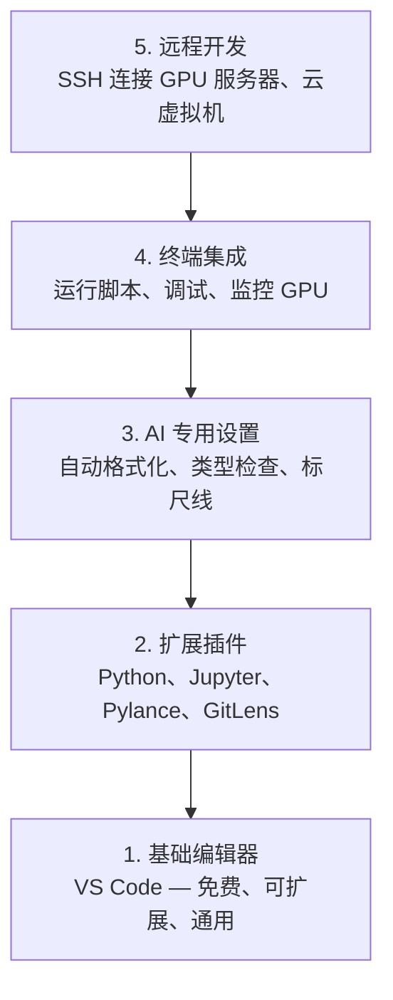

# 编辑器配置

> 你的编辑器是你的副驾驶。配置一次，让它不再碍事，开始发挥价值。

**类型：** 动手实践
**语言：** --
**前置条件：** Phase 0, Lesson 01
**预计用时：** 约 20 分钟

## 学习目标

- 安装 VS Code 及 Python、Jupyter、代码检查和 Remote SSH 等必备扩展
- 配置保存时格式化、类型检查和笔记本输出滚动等 AI 工作流设置
- 设置 Remote SSH，像本地一样编辑和调试远程 GPU 机器上的代码
- 评估替代编辑器（Cursor、Windsurf、Neovim）及其在 AI 工作中的取舍

> **【中文解读】**
> 编辑器是你写代码的主力工具。本章帮你配置 VS Code 用于 AI 开发：Python 支持、Jupyter 集成、远程 SSH 连接 GPU 服务器。配置一次，受益整个课程。

## 问题引入

你将在编辑器中度过数千小时——编写 Python、运行笔记本、调试训练循环、SSH 连接 GPU 服务器。配置不当的编辑器会让每次会话都充满摩擦：没有自动补全、没有类型提示、没有行内错误提示、手动格式化，以及笨拙的终端工作流。

正确的设置只需 20 分钟。跳过它则每天多浪费 20 分钟。

> **【中文解读】**
> 配置编辑器只需 20 分钟，但不配置会让你每天多浪费 20 分钟。自动补全、类型检查、保存时格式化——这些小功能累积起来能省大量时间。

## 核心概念

AI 工程编辑器配置需要五样东西：



> **【中文解读】**
> AI 开发编辑器需要五层配置：基础编辑器 → 扩展插件 → AI 专用设置 → 终端集成 → 远程开发。其中远程 SSH 开发是最重要的——你需要在本地编辑器中直接操作远程 GPU 服务器。

## 动手实现

> **【拓展：VS Code 为什么是 AI 开发的首选编辑器】** VS Code 在 AI 开发中占据统治地位的原因：(1) 免费且轻量；(2) Jupyter Notebook 原生支持；(3) Remote SSH 直接连接 GPU 服务器编辑代码；(4) Python/Jupyter/Python Debugger 扩展生态完善；(5) AI 辅助编程扩展（Copilot、Cline、Continue）开箱即用。Cursor 和 Windsurf 是基于 VS Code 的 AI 增强版本，也值得尝试。

### 第 1 步：安装 VS Code

VS Code 是推荐编辑器。它免费、在所有操作系统上运行、拥有一流的 Jupyter 笔记本支持，且扩展生态覆盖了 AI 工作所需的一切。

从 [code.visualstudio.com](https://code.visualstudio.com/) 下载。

从终端验证：

```bash
code --version
```

如果 macOS 上找不到 `code` 命令，打开 VS Code，按 `Cmd+Shift+P`，输入"Shell Command"，选择"Install 'code' command in PATH"。

### 第 2 步：安装必备扩展

> **【中文解读】** AI 开发必备的 VS Code 扩展：Python（调试+Lint）、Jupyter（在编辑器中运行 Notebook）、Pylance（智能补全和类型检查）、GitLens（查看代码历史）。安装后在设置中开启"保存时格式化"，从此不用手动整理代码。

在 VS Code 中打开集成终端（`Ctrl+`` ` 或 `` Cmd+` ``）并安装 AI 工作所需扩展：

```bash
code --install-extension ms-python.python
code --install-extension ms-python.vscode-pylance
code --install-extension ms-toolsai.jupyter
code --install-extension eamodio.gitlens
code --install-extension ms-vscode-remote.remote-ssh
code --install-extension ms-python.debugpy
code --install-extension ms-python.black-formatter
code --install-extension charliermarsh.ruff
```

各扩展的作用：

| 扩展 | 用途 |
|------|------|
| Python | 语言支持、虚拟环境检测、运行/调试 |
| Pylance | 快速类型检查、自动补全、import 解析 |
| Jupyter | 在 VS Code 中运行笔记本、变量浏览器 |
| GitLens | 查看谁改了什么、行内 git blame |
| Remote SSH | 像本地一样打开远程 GPU 机器上的文件夹 |
| Debugpy | Python 逐步调试 |
| Black Formatter | 保存时自动格式化，统一风格 |
| Ruff | 快速代码检查，捕获常见错误 |

本课程 `code/.vscode/extensions.json` 文件包含完整推荐列表。当你打开项目文件夹时，VS Code 会提示你安装它们。

### 第 3 步：配置设置

复制本课程 `code/.vscode/settings.json` 中的设置，或通过 `Settings > Open Settings (JSON)` 手动应用。

AI 工作的关键设置：

```jsonc
{
    "python.analysis.typeCheckingMode": "basic",
    "editor.formatOnSave": true,
    "editor.rulers": [88, 120],
    "notebook.output.scrolling": true,
    "files.autoSave": "afterDelay"
}
```

为什么这些设置重要：

- **类型检查设为 basic**：在运行前捕获错误的参数类型。节省调试张量形状不匹配和错误 API 参数的时间。
- **保存时格式化**：再也不用考虑格式问题了。Black 帮你处理。
- **88 和 120 处的标尺线**：Black 在 88 处换行。120 标记显示文档字符串和注释何时太长。
- **笔记本输出滚动**：训练循环打印数千行。没有滚动，输出面板会爆炸。
- **自动保存**：你会忘记保存。你的训练脚本会运行旧代码。自动保存防止这种情况。

### 第 4 步：终端集成

VS Code 的集成终端是你运行训练脚本、监控 GPU 和管理环境的地方。

正确配置：

```jsonc
{
    "terminal.integrated.defaultProfile.osx": "zsh",
    "terminal.integrated.defaultProfile.linux": "bash",
    "terminal.integrated.fontSize": 13,
    "terminal.integrated.scrollback": 10000
}
```

常用快捷键：

| 操作 | macOS | Linux/Windows |
|------|-------|---------------|
| 切换终端 | `` Ctrl+` `` | `` Ctrl+` `` |
| 新建终端 | `Ctrl+Shift+`` ` | `Ctrl+Shift+`` ` |
| 分割终端 | `Cmd+\` | `Ctrl+\` |

分割终端很有用：一个运行脚本，一个用 `nvidia-smi -l 1` 或 `watch -n 1 nvidia-smi` 监控 GPU。

### 第 5 步：远程开发（SSH 连接 GPU 服务器）

> **【拓展：Remote SSH 是 AI 开发的杀手级功能】** 大多数人没有本地 GPU，需要 SSH 到远程 GPU 服务器训练模型。VS Code 的 Remote SSH 扩展让你像编辑本地文件一样编辑远程代码——自动补全、调试、终端全都可用。这意味着你可以在轻薄本上开发，在远端 A100 上训练。

这是 AI 工作中最重要的扩展。你将在远程机器（云虚拟机、实验室服务器、Lambda、Vast.ai）上运行训练。Remote SSH 让你打开远程文件系统、编辑文件、运行终端和调试，就像一切都在本地一样。

设置：

1. 安装 Remote SSH 扩展（第 2 步已完成）。
2. 按 `Ctrl+Shift+P`（或 `Cmd+Shift+P`），输入"Remote-SSH: Connect to Host"。
3. 输入 `user@your-gpu-box-ip`。
4. VS Code 自动在远程机器上安装其服务器组件。

要实现免密登录，设置 SSH 密钥：

```bash
ssh-keygen -t ed25519 -C "your-email@example.com"
ssh-copy-id user@your-gpu-box-ip
```

将主机添加到 `~/.ssh/config` 以方便连接：

```
Host gpu-box
    HostName 203.0.113.50
    User ubuntu
    IdentityFile ~/.ssh/id_ed25519
    ForwardAgent yes
```

现在 `Remote-SSH: Connect to Host > gpu-box` 即可瞬间连接。

## 替代方案

> **【拓展：AI 增强编辑器对比】** Cursor（基于 VS Code，内置 AI 编程助手，$20/月）和 Windsurf（Codeium 出品，免费层可用）都是 2024-2026 年兴起的 AI-native 编辑器。它们的核心优势：用自然语言描述需求，AI 自动生成代码。如果你已经在用 VS Code 扩展（如 Cline、Continue），迁移成本很低。

### Cursor

[cursor.com](https://cursor.com) 是一个内置 AI 代码生成的 VS Code 分支。它使用相同的扩展生态和设置格式。如果你使用 Cursor，本课中的所有内容仍然适用。导入相同的 `settings.json` 和 `extensions.json`。

### Windsurf

[windsurf.com](https://windsurf.com) 是另一个 AI 优先的 VS Code 分支。情况相同：相同的扩展、相同的设置格式、相同的 Remote SSH 支持。

### Vim/Neovim

如果你已经在使用 Vim 或 Neovim 并且很高效，继续用它。AI Python 工作的最低配置：

- **pyright** 或 **pylsp** 用于类型检查（通过 Mason 或手动安装）
- **nvim-lspconfig** 用于语言服务器集成
- **jupyter-vim** 或 **molten-nvim** 用于类笔记本执行
- **telescope.nvim** 用于文件/符号搜索
- **none-ls.nvim** 配合 black 和 ruff 用于格式化/代码检查

如果你还没有用过 Vim，现在不要开始。学习曲线会与学习 AI 工程竞争。用 VS Code。

## 用框架实现

> **【中文解读】** 推荐配置：VS Code + Python + Jupyter + Remote SSH。如果用远程 GPU 服务器，Remote SSH 是必须的。调试训练循环时，Jupyter 扩展让你在编辑器内直接查看张量形状和损失曲线。

配置完成后，你的日常工作流：

1. 在 VS Code 中打开项目文件夹（或通过 Remote SSH 连接到 GPU 服务器）。
2. 在编辑器中编写 Python，享受自动补全、类型提示和行内错误提示。
3. 用 Jupyter 扩展在编辑器内运行笔记本。
4. 使用集成终端运行训练脚本、`uv pip install` 和 GPU 监控。
5. 提交前用 GitLens 查看变更。

## 练习题

1. 安装 VS Code 和步骤 2 中列出的所有扩展
2. 将本课的 `settings.json` 复制到你的 VS Code 配置中
3. 打开一个 Python 文件，验证 Pylance 显示类型提示、Black 保存时自动格式化
4. 如果有远程机器，设置 Remote SSH 并打开远程文件夹

## 术语速查表

| 术语 | 俗称 | 实际含义 |
|------|------|---------|
| LSP | "自动补全引擎" | 语言服务器协议（Language Server Protocol）：编辑器获取类型信息、补全和诊断的标准 |
| Pylance | "Python 插件" | 微软的 Python 语言服务器，提供类型检查和智能提示 |
| Remote SSH | "在服务器上开发" | VS Code 在远程机器上运行轻量服务器，将 UI 传输到本地编辑器 |
| Format on save | "保存时自动格式化" | 每次保存时自动运行格式化工具，保持代码风格一致 |
