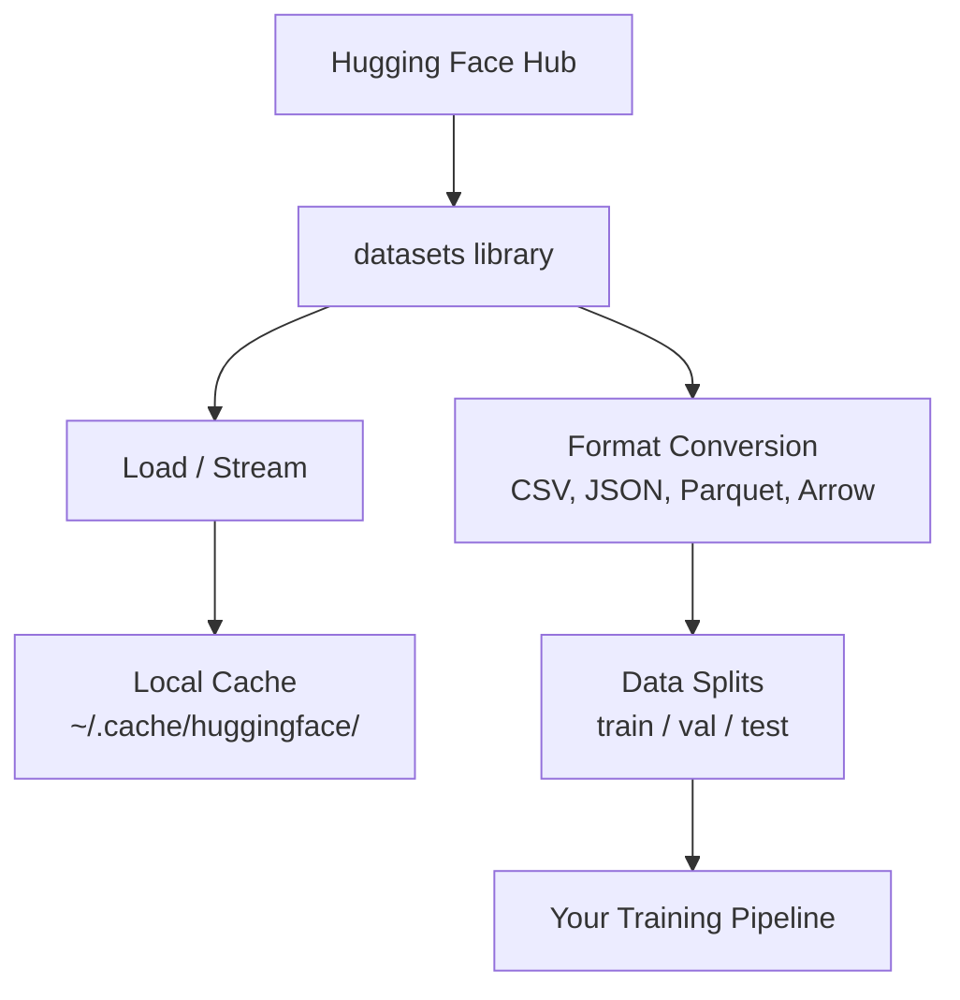

# Data Management | 数据管理

> Data is the fuel. How you manage it determines how fast you go.
> 数据是燃料。你管理它的方式决定了你能跑多快。

**Type:** Build | **类型:** 构建
**Language:** Python | **语言:** Python
**Prerequisites:** Phase 0, Lesson 01 | **前置知识:** Phase 0, 第 01 课
**Time:** ~45 minutes | **时间:** ~45 分钟

## Learning Objectives | 学习目标

- Load, stream, and cache datasets using the Hugging Face `datasets` library
  中文翻译：使用 Hugging Face `datasets` 库加载、流式处理和缓存数据集
- Convert between CSV, JSON, Parquet, and Arrow formats and explain their tradeoffs
  中文翻译：在 CSV、JSON、Parquet 和 Arrow 格式之间转换，并解释各自的优劣
- Create reproducible train/validation/test splits with fixed random seeds
  中文翻译：用固定随机种子创建可复现的训练/验证/测试集拆分
- Manage large model and dataset files using `.gitignore`, Git LFS, or DVC
  中文翻译：使用 `.gitignore`、Git LFS 或 DVC 管理大型模型和数据文件

> **【中文解读】**
> 数据是 AI 的燃料。本章教你如何用 Hugging Face `datasets` 库加载、缓存、转换和拆分数据集。掌握数据管理是开始机器学习实验的前提。

## The Problem | 问题描述

Every AI project starts with data. You need to find datasets, download them, convert between formats, split them for training and evaluation, and version them so experiments are reproducible. Doing this manually every time is slow and error-prone. You need a repeatable workflow.

> 每个 AI 项目都从数据开始。你需要找到数据集、下载、转换格式、拆分为训练集和评估集，并进行版本管理以确保实验可复现。每次手动操作既慢又容易出错。你需要一个可重复的工作流。

> **【中文解读】**
> 每个 AI 项目都从数据开始。你需要下载数据集、转换格式、拆分训练/验证/测试集，并管理版本以确保实验可复现。本章教你建立可重复的数据工作流。

> **【拓展：Hugging Face 在 AI 生态中的地位】**
> Hugging Face 是 AI 领域的"GitHub"，托管了数十万个数据集和预训练模型。`datasets` 库是加载和处理数据的标准工具，类似 Pandas 但专为 AI 优化，支持流式加载超大数据集。

## The Concept | 核心概念



The Hugging Face `datasets` library is the standard way to load data for AI work. It handles downloading, caching, format conversion, and streaming out of the box.

> Hugging Face `datasets` 库是 AI 数据加载的标准方式。它开箱即用地处理下载、缓存、格式转换和流式加载。

> **【中文解读】**
> Hugging Face `datasets` 是 AI 数据加载的事实标准。它自动处理下载、缓存、格式转换和流式加载。你不需要手动管理数据文件，库会帮你完成所有底层工作。理解这个数据流水线是所有 AI 实验的基础。

> **【拓展：数据格式对训练速度的影响】**
> 在实际 AI 工作中，数据格式直接影响训练效率。Parquet 格式比 CSV 小 60-80%，读取速度快 5-10 倍。Google 和 Meta 的内部训练管线全部使用 Parquet/Arrow 格式。一个 100GB 的 CSV 数据集转换为 Parquet 后可能只有 20GB，且加载时间从小时级降到分钟级。

## Build It | 动手实现

### Step 1: Install the datasets library

```bash
pip install datasets huggingface_hub  # 安装 Hugging Face 数据集库和模型仓库工具
```

### Step 2: Load a dataset

```python
from datasets import load_dataset

dataset = load_dataset("imdb")  # 加载 IMDB 电影评论数据集（首次下载，之后从缓存读取）
print(dataset)
print(dataset["train"][0])  # 查看训练集第一条样本
```

This downloads the IMDB movie review dataset. After the first download, it loads from cache at `~/.cache/huggingface/datasets/`.

> 这会下载 IMDB 电影评论数据集。首次下载后，后续从 `~/.cache/huggingface/datasets/` 的缓存中加载。

### Step 3: Stream large datasets

Some datasets are too large to fit on disk. Streaming loads them row by row without downloading the full thing.

> 有些数据集太大无法全部下载到磁盘。流式加载逐行处理数据，无需下载完整数据集。

```python
dataset = load_dataset("wikimedia/wikipedia", "20220301.en", split="train", streaming=True)  # 流式加载：不下载完整数据集

for i, example in enumerate(dataset):
    print(example["title"])  # 逐条处理，内存占用恒定
    if i >= 4:
        break
```

Streaming gives you an `IterableDataset`. You process rows as they arrive. Memory usage stays constant regardless of dataset size.

> 流式加载返回 `IterableDataset`。你逐条处理到达的数据。无论数据集多大，内存占用保持恒定。

> **【拓展：流式加载在大模型训练中的应用】**
> 流式加载是训练大语言模型的关键技术。Common Crawl 数据集约 250TB，不可能全部下载到本地。GPT-4 的训练数据通过流式方式从分布式存储中加载，每秒处理数十万条文本。Hugging Face 的 `streaming=True` 参数让你用同样的方式处理超大数据集，即使只有 8GB 内存的笔记本也能处理 TB 级数据。

### Step 4: Dataset formats

The `datasets` library uses Apache Arrow under the hood. You can convert to other formats depending on what your pipeline needs.

> `datasets` 库底层使用 Apache Arrow。你可以根据管线需要转换为其他格式。

```python
dataset = load_dataset("imdb", split="train")

dataset.to_csv("imdb_train.csv")  # 导出为 CSV 格式（通用但体积大）
dataset.to_json("imdb_train.json")  # 导出为 JSON 格式（适合 API 交换）
dataset.to_parquet("imdb_train.parquet")  # 导出为 Parquet 格式（压缩率高、读取快）
```

Format comparison:

> 格式对比：

| Format | Size | Read Speed | Best For |
|--------|------|-----------|----------|
| CSV | Large | Slow | Human readability, spreadsheets |
| JSON | Large | Slow | APIs, nested data |
| Parquet | Small | Fast | Analytics, columnar queries |
| Arrow | Small | Fastest | In-memory processing (what `datasets` uses internally) |

| 格式 | 体积 | 读取速度 | 最适合 |
|------|------|---------|--------|
| CSV | 大 | 慢 | 人类阅读、电子表格 |
| JSON | 大 | 慢 | API、嵌套数据 |
| Parquet | 小 | 快 | 分析查询、列式存储 |
| Arrow | 小 | 最快 | 内存中处理（datasets 库内部使用） |

For AI work, Parquet is the best storage format. Arrow is what you work with in memory. CSV and JSON are for interchange.

> 对于 AI 工作，Parquet 是最佳存储格式。Arrow 是内存中使用的格式。CSV 和 JSON 用于数据交换。

### Step 5: Data splits

> **【中文解读】**
> 数据拆分是机器学习的基本原则。训练集用来学习，验证集用来调参，测试集用来最终评估。三者必须互不重叠，否则会导致"数据泄漏"——模型表现虚高但实际毫无用处。始终用固定种子保证可复现。

Every ML project needs three splits:

> 每个 ML 项目都需要三个拆分：

- **Train**: The model learns from this (typically 80%)
  中文翻译：**训练集**：模型从这里学习（通常 80%）
- **Validation**: You check progress during training (typically 10%)
  中文翻译：**验证集**：训练过程中检查进度（通常 10%）
- **Test**: Final evaluation after training is done (typically 10%)
  中文翻译：**测试集**：训练完成后的最终评估（通常 10%）

Some datasets come pre-split. When they don't, split them yourself:

> 有些数据集已经预拆分好了。如果没有，你需要自己拆分：

```python
dataset = load_dataset("imdb", split="train")

split = dataset.train_test_split(test_size=0.2, seed=42)  # 80% 训练+验证，20% 测试
train_val = split["train"].train_test_split(test_size=0.125, seed=42)  # 从 80% 中取 12.5% 作为验证集

train_ds = train_val["train"]  # 最终：70% 训练集
val_ds = train_val["test"]  # 最终：10% 验证集
test_ds = split["test"]  # 最终：20% 测试集

print(f"Train: {len(train_ds)}, Val: {len(val_ds)}, Test: {len(test_ds)}")
```

Always set a seed for reproducibility. The same seed produces the same split every time.

> 务必设置种子以确保可复现性。相同的种子每次产生相同的拆分。

### Step 6: Download and cache models

Models are large files. The `huggingface_hub` library handles downloading and caching.

> 模型是大文件。`huggingface_hub` 库负责下载和缓存。

```python
from huggingface_hub import hf_hub_download, snapshot_download

model_path = hf_hub_download(  # 下载单个文件
    repo_id="sentence-transformers/all-MiniLM-L6-v2",
    filename="config.json"
)
print(f"Cached at: {model_path}")

model_dir = snapshot_download("sentence-transformers/all-MiniLM-L6-v2")  # 下载整个模型仓库
print(f"Full model at: {model_dir}")
```

> **【拓展：模型缓存机制】**
> Hugging Face 的缓存机制非常智能：模型下载后存储在 `~/.cache/huggingface/hub/`，后续加载直接读取本地缓存。一个常见的 LLM 如 Llama-2-7B 约 14GB，首次下载需要几分钟，之后秒级加载。企业级场景中，一个团队共享的模型缓存可以节省数百 GB 的重复下载。

Models cache to `~/.cache/huggingface/hub/`. Once downloaded, they load instantly on subsequent runs.

> 模型缓存到 `~/.cache/huggingface/hub/`。下载一次后，后续运行秒级加载。

### Step 7: Handle large files

> **【中文解读】**
> AI 模型文件动辄数 GB（GPT-2 约 500MB，Llama-2-70B 约 140GB），不能用普通 git 管理。三种方案各有适用场景：`.gitignore` 最简单（忽略大文件），Git LFS 适合团队共享模型权重，DVC 适合需要严格复现的实验。

Model weights and large datasets should not go into git. Three options:

> 模型权重和大型数据集不应放入 git。三种选择：

**Option A: .gitignore (simplest)**

> **选项 A：.gitignore（最简单）**

```
*.bin
*.safetensors
*.pt
*.onnx
data/*.parquet
data/*.csv
models/
```

**Option B: Git LFS (track large files in git)**

> **选项 B：Git LFS（在 git 中追踪大文件）**

```bash
git lfs install
git lfs track "*.bin"
git lfs track "*.safetensors"
git add .gitattributes
```

Git LFS stores pointers in your repo and the actual files on a separate server. GitHub gives you 1 GB free.

> Git LFS 在仓库中存储指针，实际文件存储在单独的服务器上。GitHub 提供 1 GB 免费空间。

**Option C: DVC (data version control)**

> **选项 C：DVC（数据版本控制）**

```bash
pip install dvc
dvc init
dvc add data/training_set.parquet
git add data/training_set.parquet.dvc data/.gitignore
git commit -m "Track training data with DVC"
```

DVC creates small `.dvc` files that point to your data. The data itself lives in S3, GCS, or another remote storage backend.

> DVC 创建小的 `.dvc` 文件指向你的数据。数据本身存储在 S3、GCS 或其他远程存储后端。

> **【拓展：工业级数据版本管理】**
> 在 Google 和 Meta 等大厂，数据版本管理比代码版本管理更复杂。一个推荐系统实验可能涉及数十个数据集、数十亿条样本。DVC 是开源解决方案，企业中常用 Databricks、Weights & Biases (W&B) 或 Neptune.ai 来追踪数据、模型和实验。这些工具能记录每次实验使用的精确数据快照，确保结果可复现。

| Approach | Complexity | Best For |
|----------|-----------|----------|
| .gitignore | Low | Personal projects, downloaded data you can re-fetch |
| Git LFS | Medium | Teams sharing model weights via git |
| DVC | High | Reproducible experiments, large datasets, teams |

| 方案 | 复杂度 | 最适合 |
|------|--------|--------|
| .gitignore | 低 | 个人项目、可重新下载的数据 |
| Git LFS | 中 | 通过 git 共享模型权重的团队 |
| DVC | 高 | 需要严格复现的实验、大数据集、团队协作 |

For this course, `.gitignore` is enough. Use DVC when you need to reproduce exact experiments across machines.

> 本课程用 `.gitignore` 就够了。当你需要跨机器精确复现实验时再使用 DVC。

### Step 8: Storage patterns

> **【中文解读】**
> 本地存储适合 10GB 以内的数据集，Hugging Face 缓存自动管理。当数据集更大或需要在多台机器间共享时，就要用云存储（S3、GCS）。DVC 可以直接与云存储集成，实现数据版本管理。

**Local storage** works for datasets under ~10 GB. The HF cache handles this automatically.

> **本地存储**适用于约 10 GB 以下的数据集。HF 缓存自动处理。

**Cloud storage** is for anything larger or shared across machines:

> **云存储**用于更大的数据集或需要跨机器共享的情况：

```python
import os

local_path = os.path.expanduser("~/.cache/huggingface/datasets/")

# s3_path = "s3://my-bucket/datasets/"
# gcs_path = "gs://my-bucket/datasets/"
```

DVC integrates with S3 and GCS directly:

> DVC 直接与 S3 和 GCS 集成：

```bash
dvc remote add -d myremote s3://my-bucket/dvc-store
dvc push
```

For this course, local storage is sufficient. Cloud storage becomes relevant when you fine-tune on remote GPU instances.

> 本课程中本地存储就够了。当你在远程 GPU 实例上微调时才需要云存储。

## Datasets Used in This Course

| Dataset | Lessons | Size | What It Teaches |
|---------|---------|------|----------------|
| IMDB | Tokenization, classification | 84 MB | Text classification basics |
| WikiText | Language modeling | 181 MB | Next-token prediction |
| SQuAD | QA systems | 35 MB | Question answering, spans |
| Common Crawl (subset) | Embeddings | Varies | Large-scale text processing |
| MNIST | Vision basics | 21 MB | Image classification fundamentals |
| COCO (subset) | Multimodal | Varies | Image-text pairs |

| 数据集 | 涉及课程 | 体积 | 教你什么 |
|--------|---------|------|---------|
| IMDB | 分词、分类 | 84 MB | 文本分类基础 |
| WikiText | 语言建模 | 181 MB | 下一个 token 预测 |
| SQuAD | 问答系统 | 35 MB | 问答与区间选择 |
| Common Crawl（子集） | 嵌入 | 不定 | 大规模文本处理 |
| MNIST | 视觉基础 | 21 MB | 图像分类入门 |
| COCO（子集） | 多模态 | 不定 | 图像-文本对 |

You do not need to download all of these now. Each lesson specifies what it needs.

> 你不需要现在就下载所有这些数据集。每节课会说明它需要什么。

## Use It | 用框架实现

> **【中文解读】**
> 实践环节：运行 `data_utils.py` 验证所有数据管理功能正常工作。这个脚本会自动下载一个小数据集、做格式转换、拆分训练/验证/测试集，并打印摘要信息。确保你的环境配置正确后再进入后续课程。

Run the utility script to verify everything works:

> 运行工具脚本验证一切正常：

```bash
python code/data_utils.py
```

This downloads a small dataset, converts it, splits it, and prints a summary.

> 这会下载一个小数据集、转换格式、拆分，并打印摘要。

## Ship It | 产出物

This lesson produces:
- `code/data_utils.py` - reusable data loading and caching utility
- `outputs/prompt-data-helper.md` - prompt for finding the right dataset for a task

> 本课产出：
> - `code/data_utils.py` - 可复用的数据加载和缓存工具
> - `outputs/prompt-data-helper.md` - 用于查找合适数据集的 prompt

## Exercises | 练习题

1. Load the `glue` dataset with the `mrpc` config and inspect the first 5 examples
   加载 `glue` 数据集的 `mrpc` 配置，查看前 5 条数据
2. Stream the `c4` dataset and count how many examples you can process in 10 seconds
   流式加载 `c4` 数据集，统计 10 秒内能处理多少条数据
3. Convert a dataset to Parquet and compare the file size to CSV
   将数据集转换为 Parquet 格式，对比与 CSV 的文件大小
4. Create a 70/15/15 train/val/test split with a fixed seed and verify the sizes
   用固定随机种子创建 70/15/15 的训练/验证/测试集拆分，验证比例

## Key Terms | 关键术语

| Term | What people say | What it actually means |
|------|----------------|----------------------|
| Dataset split | "Training data" | A named subset (train/val/test) used at different stages of the ML lifecycle |
| Streaming | "Load it lazily" | Processing data row by row from a remote source without downloading the full dataset |
| Parquet | "Compressed CSV" | A columnar file format optimized for analytical queries and storage efficiency |
| Arrow | "Fast dataframe" | An in-memory columnar format used internally by the datasets library for zero-copy reads |
| Git LFS | "Git for big files" | An extension that stores large files outside the git repo while keeping pointers in version control |
| DVC | "Git for data" | A version control system for datasets and models that integrates with cloud storage |
| Cache | "Already downloaded" | A local copy of previously fetched data, stored at ~/.cache/huggingface/ by default |

| 术语 | 俗称 | 实际含义 |
|------|------|---------|
| Dataset split | "训练数据" | 数据集的命名子集（训练/验证/测试），用于 ML 生命周期的不同阶段 |
| Streaming | "懒加载" | 逐行处理远程数据，不下载完整数据集 |
| Parquet | "压缩 CSV" | 为分析查询和存储效率优化的列式文件格式 |
| Arrow | "快速数据帧" | datasets 库内部使用的内存列式格式，支持零拷贝读取 |
| Git LFS | "大文件 Git" | 将大文件存储在 git 仓库之外的扩展 |
| DVC | "数据版控" | 数据集和模型的版本控制系统，集成云存储 |
| Cache | "已下载" | 默认存储在 ~/.cache/huggingface/ 的本地缓存 |
