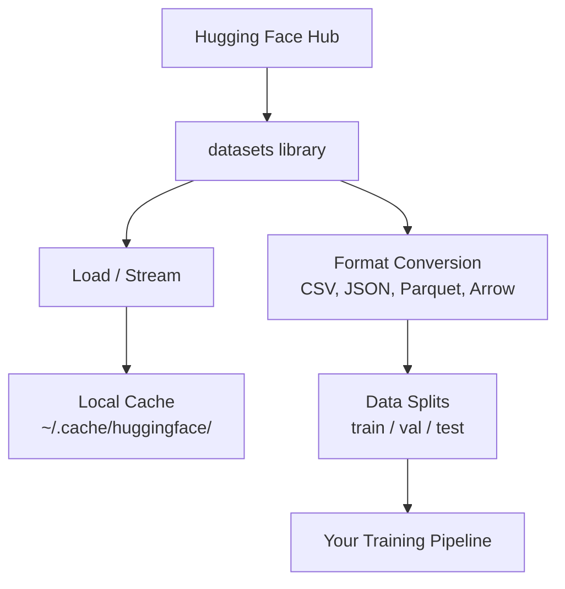

# Data Management | 数据管理

> Data is the fuel. How you manage it determines how fast you go.

**Type:** Build
**Language:** Python
**Prerequisites:** Phase 0, Lesson 01
**Time:** ~45 minutes

## Learning Objectives | 学习目标

- Load, stream, and cache datasets using the Hugging Face `datasets` library
- Convert between CSV, JSON, Parquet, and Arrow formats and explain their tradeoffs
- Create reproducible train/validation/test splits with fixed random seeds
- Manage large model and dataset files using `.gitignore`, Git LFS, or DVC

> **【中文解读】**
> 数据是 AI 的燃料。本章教你如何用 Hugging Face `datasets` 库加载、缓存、转换和拆分数据集。掌握数据管理是开始机器学习实验的前提。

## The Problem | 问题描述

Every AI project starts with data. You need to find datasets, download them, convert between formats, split them for training and evaluation, and version them so experiments are reproducible. Doing this manually every time is slow and error-prone. You need a repeatable workflow.

> **【中文解读】**
> 每个 AI 项目都从数据开始。你需要下载数据集、转换格式、拆分训练/验证/测试集，并管理版本以确保实验可复现。本章教你建立可重复的数据工作流。

> **【拓展：Hugging Face 在 AI 生态中的地位】**
> Hugging Face 是 AI 领域的"GitHub"，托管了数十万个数据集和预训练模型。`datasets` 库是加载和处理数据的标准工具，类似 Pandas 但专为 AI 优化，支持流式加载超大数据集。

## The Concept



The Hugging Face `datasets` library is the standard way to load data for AI work. It handles downloading, caching, format conversion, and streaming out of the box.

## Build It

### Step 1: Install the datasets library

```bash
pip install datasets huggingface_hub
```

### Step 2: Load a dataset

```python
from datasets import load_dataset

dataset = load_dataset("imdb")
print(dataset)
print(dataset["train"][0])
```

This downloads the IMDB movie review dataset. After the first download, it loads from cache at `~/.cache/huggingface/datasets/`.

### Step 3: Stream large datasets

Some datasets are too large to fit on disk. Streaming loads them row by row without downloading the full thing.

```python
dataset = load_dataset("wikimedia/wikipedia", "20220301.en", split="train", streaming=True)

for i, example in enumerate(dataset):
    print(example["title"])
    if i >= 4:
        break
```

Streaming gives you an `IterableDataset`. You process rows as they arrive. Memory usage stays constant regardless of dataset size.

### Step 4: Dataset formats

The `datasets` library uses Apache Arrow under the hood. You can convert to other formats depending on what your pipeline needs.

```python
dataset = load_dataset("imdb", split="train")

dataset.to_csv("imdb_train.csv")
dataset.to_json("imdb_train.json")
dataset.to_parquet("imdb_train.parquet")
```

Format comparison:

| Format | Size | Read Speed | Best For |
|--------|------|-----------|----------|
| CSV | Large | Slow | Human readability, spreadsheets |
| JSON | Large | Slow | APIs, nested data |
| Parquet | Small | Fast | Analytics, columnar queries |
| Arrow | Small | Fastest | In-memory processing (what `datasets` uses internally) |

| 格式 | 体积 | 读取速度 | 最适合 |
|------|------|---------|--------|
| CSV | 大 | 慢 | 人类阅读、电子表格 |
| JSON | 大 | 慢 | API、嵌套数据 |
| Parquet | 小 | 快 | 分析查询、列式存储 |
| Arrow | 小 | 最快 | 内存中处理（datasets 库内部使用） |

For AI work, Parquet is the best storage format. Arrow is what you work with in memory. CSV and JSON are for interchange.

### Step 5: Data splits

Every ML project needs three splits:

- **Train**: The model learns from this (typically 80%)
- **Validation**: You check progress during training (typically 10%)
- **Test**: Final evaluation after training is done (typically 10%)

Some datasets come pre-split. When they don't, split them yourself:

```python
dataset = load_dataset("imdb", split="train")

split = dataset.train_test_split(test_size=0.2, seed=42)
train_val = split["train"].train_test_split(test_size=0.125, seed=42)

train_ds = train_val["train"]
val_ds = train_val["test"]
test_ds = split["test"]

print(f"Train: {len(train_ds)}, Val: {len(val_ds)}, Test: {len(test_ds)}")
```

Always set a seed for reproducibility. The same seed produces the same split every time.

### Step 6: Download and cache models

Models are large files. The `huggingface_hub` library handles downloading and caching.

```python
from huggingface_hub import hf_hub_download, snapshot_download

model_path = hf_hub_download(
    repo_id="sentence-transformers/all-MiniLM-L6-v2",
    filename="config.json"
)
print(f"Cached at: {model_path}")

model_dir = snapshot_download("sentence-transformers/all-MiniLM-L6-v2")
print(f"Full model at: {model_dir}")
```

Models cache to `~/.cache/huggingface/hub/`. Once downloaded, they load instantly on subsequent runs.

### Step 7: Handle large files

Model weights and large datasets should not go into git. Three options:

**Option A: .gitignore (simplest)**

```
*.bin
*.safetensors
*.pt
*.onnx
data/*.parquet
data/*.csv
models/
```

**Option B: Git LFS (track large files in git)**

```bash
git lfs install
git lfs track "*.bin"
git lfs track "*.safetensors"
git add .gitattributes
```

Git LFS stores pointers in your repo and the actual files on a separate server. GitHub gives you 1 GB free.

**Option C: DVC (data version control)**

```bash
pip install dvc
dvc init
dvc add data/training_set.parquet
git add data/training_set.parquet.dvc data/.gitignore
git commit -m "Track training data with DVC"
```

DVC creates small `.dvc` files that point to your data. The data itself lives in S3, GCS, or another remote storage backend.

| Approach | Complexity | Best For |
|----------|-----------|----------|
| .gitignore | Low | Personal projects, downloaded data you can re-fetch |
| Git LFS | Medium | Teams sharing model weights via git |
| DVC | High | Reproducible experiments, large datasets, teams |

For this course, `.gitignore` is enough. Use DVC when you need to reproduce exact experiments across machines.

### Step 8: Storage patterns

**Local storage** works for datasets under ~10 GB. The HF cache handles this automatically.

**Cloud storage** is for anything larger or shared across machines:

```python
import os

local_path = os.path.expanduser("~/.cache/huggingface/datasets/")

# s3_path = "s3://my-bucket/datasets/"
# gcs_path = "gs://my-bucket/datasets/"
```

DVC integrates with S3 and GCS directly:

```bash
dvc remote add -d myremote s3://my-bucket/dvc-store
dvc push
```

For this course, local storage is sufficient. Cloud storage becomes relevant when you fine-tune on remote GPU instances.

## Datasets Used in This Course

| Dataset | Lessons | Size | What It Teaches |
|---------|---------|------|----------------|
| IMDB | Tokenization, classification | 84 MB | Text classification basics |
| WikiText | Language modeling | 181 MB | Next-token prediction |
| SQuAD | QA systems | 35 MB | Question answering, spans |
| Common Crawl (subset) | Embeddings | Varies | Large-scale text processing |
| MNIST | Vision basics | 21 MB | Image classification fundamentals |
| COCO (subset) | Multimodal | Varies | Image-text pairs |

You do not need to download all of these now. Each lesson specifies what it needs.

## Use It

Run the utility script to verify everything works:

```bash
python code/data_utils.py
```

This downloads a small dataset, converts it, splits it, and prints a summary.

## Ship It

This lesson produces:
- `code/data_utils.py` - reusable data loading and caching utility
- `outputs/prompt-data-helper.md` - prompt for finding the right dataset for a task

## Exercises | 练习题

1. Load the `glue` dataset with the `mrpc` config and inspect the first 5 examples
   加载 `glue` 数据集的 `mrpc` 配置，查看前 5 条数据
2. Stream the `c4` dataset and count how many examples you can process in 10 seconds
   流式加载 `c4` 数据集，统计 10 秒内能处理多少条数据
3. Convert a dataset to Parquet and compare the file size to CSV
   将数据集转换为 Parquet 格式，对比与 CSV 的文件大小
4. Create a 70/15/15 train/val/test split with a fixed seed and verify the sizes
   用固定随机种子创建 70/15/15 的训练/验证/测试集拆分，验证比例

## Key Terms | 关键术语

| Term | What people say | What it actually means |
|------|----------------|----------------------|
| Dataset split | "Training data" | A named subset (train/val/test) used at different stages of the ML lifecycle |
| Streaming | "Load it lazily" | Processing data row by row from a remote source without downloading the full dataset |
| Parquet | "Compressed CSV" | A columnar file format optimized for analytical queries and storage efficiency |
| Arrow | "Fast dataframe" | An in-memory columnar format used internally by the datasets library for zero-copy reads |
| Git LFS | "Git for big files" | An extension that stores large files outside the git repo while keeping pointers in version control |
| DVC | "Git for data" | A version control system for datasets and models that integrates with cloud storage |
| Cache | "Already downloaded" | A local copy of previously fetched data, stored at ~/.cache/huggingface/ by default |

| 术语 | 俗称 | 实际含义 |
|------|------|---------|
| Dataset split | "训练数据" | 数据集的命名子集（训练/验证/测试），用于 ML 生命周期的不同阶段 |
| Streaming | "懒加载" | 逐行处理远程数据，不下载完整数据集 |
| Parquet | "压缩 CSV" | 为分析查询和存储效率优化的列式文件格式 |
| Arrow | "快速数据帧" | datasets 库内部使用的内存列式格式，支持零拷贝读取 |
| Git LFS | "大文件 Git" | 将大文件存储在 git 仓库之外的扩展 |
| DVC | "数据版控" | 数据集和模型的版本控制系统，集成云存储 |
| Cache | "已下载" | 默认存储在 ~/.cache/huggingface/ 的本地缓存 |
