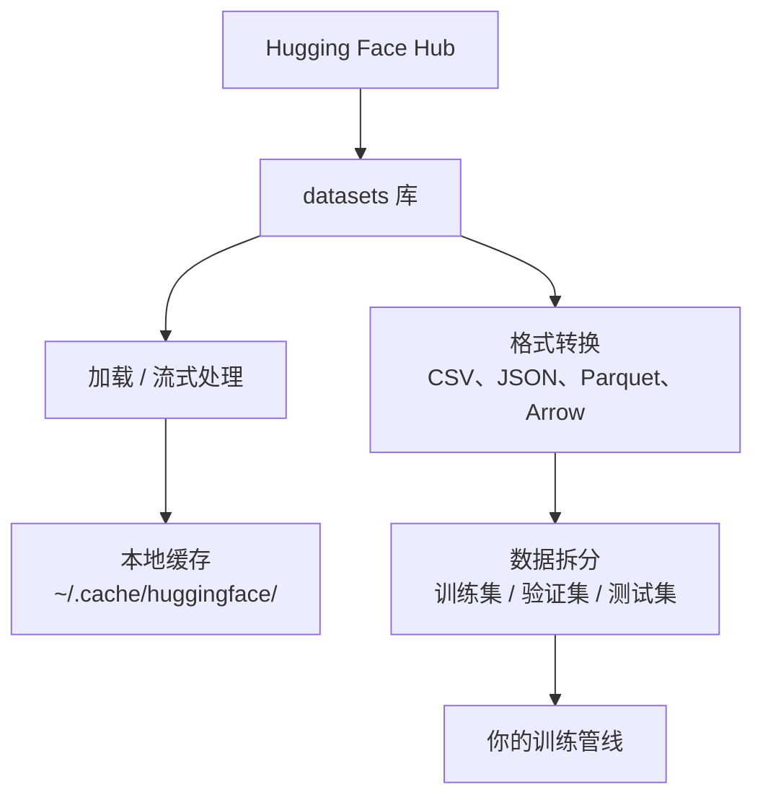

# 数据管理

> 数据是燃料。你如何管理它决定了你能跑多快。

**类型：** 动手实践
**语言：** Python
**前置条件：** Phase 0, Lesson 01
**预计用时：** 约 45 分钟

## 学习目标

- 使用 Hugging Face `datasets` 库加载、流式处理和缓存数据集
- 在 CSV、JSON、Parquet 和 Arrow 格式之间转换，并解释它们的取舍
- 使用固定随机种子创建可复现的训练/验证/测试集拆分
- 使用 `.gitignore`、Git LFS 或 DVC 管理大型模型和数据集文件

> **【中文解读】**
> 数据是 AI 的燃料。本章教你如何用 Hugging Face `datasets` 库加载、缓存、转换和拆分数据集。掌握数据管理是开始机器学习实验的前提。

## 问题引入

每个 AI 项目都从数据开始。你需要找到数据集、下载它们、在格式之间转换、拆分为训练和评估集，并进行版本管理以确保实验可复现。每次手动做这些既慢又容易出错。你需要一个可重复的工作流。

> **【中文解读】**
> 每个 AI 项目都从数据开始。你需要下载数据集、转换格式、拆分训练/验证/测试集，并管理版本以确保实验可复现。本章教你建立可重复的数据工作流。

> **【拓展：Hugging Face 在 AI 生态中的地位】**
> Hugging Face 是 AI 领域的"GitHub"，托管了数十万个数据集和预训练模型。`datasets` 库是加载和处理数据的标准工具，类似 Pandas 但专为 AI 优化，支持流式加载超大数据集。

## 核心概念



Hugging Face `datasets` 库是 AI 工作中加载数据的标准方式。它开箱即用地处理下载、缓存、格式转换和流式处理。

> **【中文解读】**
> Hugging Face `datasets` 是 AI 数据加载的事实标准。它自动处理下载、缓存、格式转换和流式加载。你不需要手动管理数据文件，库会帮你完成所有底层工作。理解这个数据流水线是所有 AI 实验的基础。

> **【拓展：数据格式对训练速度的影响】**
> 在实际 AI 工作中，数据格式直接影响训练效率。Parquet 格式比 CSV 小 60-80%，读取速度快 5-10 倍。Google 和 Meta 的内部训练管线全部使用 Parquet/Arrow 格式。一个 100GB 的 CSV 数据集转换为 Parquet 后可能只有 20GB，且加载时间从小时级降到分钟级。

## 动手实现

### 第 1 步：安装 datasets 库

```bash
pip install datasets huggingface_hub  # 安装 Hugging Face 数据集库和模型仓库工具
```

### 第 2 步：加载数据集

```python
from datasets import load_dataset

dataset = load_dataset("imdb")  # 加载 IMDB 电影评论数据集（首次下载，之后从缓存读取）
print(dataset)
print(dataset["train"][0])  # 查看训练集第一条样本
```

这会下载 IMDB 电影评论数据集。首次下载后，它从 `~/.cache/huggingface/datasets/` 的缓存中加载。

### 第 3 步：流式处理大数据集

有些数据集太大，无法全部放在磁盘上。流式处理逐行加载数据，无需下载完整数据集。

```python
dataset = load_dataset("wikimedia/wikipedia", "20220301.en", split="train", streaming=True)  # 流式加载：不下载完整数据集

for i, example in enumerate(dataset):
    print(example["title"])  # 逐条处理，内存占用恒定
    if i >= 4:
        break
```

流式处理给你一个 `IterableDataset`。你可以在数据到达时逐行处理。无论数据集多大，内存使用都保持恒定。

> **【拓展：流式加载在大模型训练中的应用】**
> 流式加载是训练大语言模型的关键技术。Common Crawl 数据集约 250TB，不可能全部下载到本地。GPT-4 的训练数据通过流式方式从分布式存储中加载，每秒处理数十万条文本。Hugging Face 的 `streaming=True` 参数让你用同样的方式处理超大数据集，即使只有 8GB 内存的笔记本也能处理 TB 级数据。

### 第 4 步：数据集格式

`datasets` 库底层使用 Apache Arrow。你可以根据管线的需要转换为其他格式。

```python
dataset = load_dataset("imdb", split="train")

dataset.to_csv("imdb_train.csv")  # 导出为 CSV 格式（通用但体积大）
dataset.to_json("imdb_train.json")  # 导出为 JSON 格式（适合 API 交换）
dataset.to_parquet("imdb_train.parquet")  # 导出为 Parquet 格式（压缩率高、读取快）
```

格式对比：

| 格式 | 体积 | 读取速度 | 最适合 |
|------|------|---------|--------|
| CSV | 大 | 慢 | 人类阅读、电子表格 |
| JSON | 大 | 慢 | API、嵌套数据 |
| Parquet | 小 | 快 | 分析查询、列式存储 |
| Arrow | 小 | 最快 | 内存中处理（datasets 库内部使用） |

AI 工作中，Parquet 是最佳存储格式。Arrow 是内存中的工作格式。CSV 和 JSON 用于数据交换。

### 第 5 步：数据拆分

> **【中文解读】**
> 数据拆分是机器学习的基本原则。训练集用来学习，验证集用来调参，测试集用来最终评估。三者必须互不重叠，否则会导致"数据泄漏"——模型表现虚高但实际毫无用处。始终用固定种子保证可复现。

每个 ML 项目需要三个拆分：

- **训练集**：模型从中学习（通常 80%）
- **验证集**：训练过程中检查进展（通常 10%）
- **测试集**：训练完成后最终评估（通常 10%）

有些数据集已经预拆分好了。如果没有，自己拆分：

```python
dataset = load_dataset("imdb", split="train")

split = dataset.train_test_split(test_size=0.2, seed=42)  # 80% 训练+验证，20% 测试
train_val = split["train"].train_test_split(test_size=0.125, seed=42)  # 从 80% 中取 12.5% 作为验证集

train_ds = train_val["train"]  # 最终：70% 训练集
val_ds = train_val["test"]  # 最终：10% 验证集
test_ds = split["test"]  # 最终：20% 测试集

print(f"训练集: {len(train_ds)}, 验证集: {len(val_ds)}, 测试集: {len(test_ds)}")
```

始终设置种子以确保可复现性。相同的种子每次产生相同的拆分。

### 第 6 步：下载和缓存模型

模型是大文件。`huggingface_hub` 库处理下载和缓存。

```python
from huggingface_hub import hf_hub_download, snapshot_download

model_path = hf_hub_download(  # 下载单个文件
    repo_id="sentence-transformers/all-MiniLM-L6-v2",
    filename="config.json"
)
print(f"缓存位置: {model_path}")

model_dir = snapshot_download("sentence-transformers/all-MiniLM-L6-v2")  # 下载整个模型仓库
print(f"完整模型位置: {model_dir}")
```

> **【拓展：模型缓存机制】**
> Hugging Face 的缓存机制非常智能：模型下载后存储在 `~/.cache/huggingface/hub/`，后续加载直接读取本地缓存。一个常见的 LLM 如 Llama-2-7B 约 14GB，首次下载需要几分钟，之后秒级加载。企业级场景中，一个团队共享的模型缓存可以节省数百 GB 的重复下载。

模型缓存到 `~/.cache/huggingface/hub/`。下载后，后续运行时即时加载。

### 第 7 步：处理大文件

> **【中文解读】**
> AI 模型文件动辄数 GB（GPT-2 约 500MB，Llama-2-70B 约 140GB），不能用普通 git 管理。三种方案各有适用场景：`.gitignore` 最简单（忽略大文件），Git LFS 适合团队共享模型权重，DVC 适合需要严格复现的实验。

模型权重和大数据集不应放入 git。三种选择：

**选项 A：.gitignore（最简单）**

```
*.bin
*.safetensors
*.pt
*.onnx
data/*.parquet
data/*.csv
models/
```

**选项 B：Git LFS（在 git 中追踪大文件）**

```bash
git lfs install
git lfs track "*.bin"
git lfs track "*.safetensors"
git add .gitattributes
```

Git LFS 在你的仓库中存储指针，实际文件存储在单独的服务器上。GitHub 提供 1 GB 免费空间。

**选项 C：DVC（数据版本控制）**

```bash
pip install dvc
dvc init
dvc add data/training_set.parquet
git add data/training_set.parquet.dvc data/.gitignore
git commit -m "用 DVC 追踪训练数据"
```

DVC 创建小型 `.dvc` 文件指向你的数据。数据本身存储在 S3、GCS 或其他远程存储后端。

> **【拓展：工业级数据版本管理】**
> 在 Google 和 Meta 等大厂，数据版本管理比代码版本管理更复杂。一个推荐系统实验可能涉及数十个数据集、数十亿条样本。DVC 是开源解决方案，企业中常用 Databricks、Weights & Biases (W&B) 或 Neptune.ai 来追踪数据、模型和实验。这些工具能记录每次实验使用的精确数据快照，确保结果可复现。

| 方案 | 复杂度 | 最适合 |
|------|--------|--------|
| .gitignore | 低 | 个人项目、可重新下载的数据 |
| Git LFS | 中 | 通过 git 共享模型权重的团队 |
| DVC | 高 | 需要严格复现的实验、大数据集、团队协作 |

本课程中，`.gitignore` 就够了。当你需要跨机器精确复现实验时，使用 DVC。

### 第 8 步：存储模式

> **【中文解读】**
> 本地存储适合 10GB 以内的数据集，Hugging Face 缓存自动管理。当数据集更大或需要在多台机器间共享时，就要用云存储（S3、GCS）。DVC 可以直接与云存储集成，实现数据版本管理。

**本地存储** 适用于约 10 GB 以下的数据集。HF 缓存自动处理。

**云存储** 用于更大的数据集或跨机器共享：

```python
import os

local_path = os.path.expanduser("~/.cache/huggingface/datasets/")

# s3_path = "s3://my-bucket/datasets/"
# gcs_path = "gs://my-bucket/datasets/"
```

DVC 直接与 S3 和 GCS 集成：

```bash
dvc remote add -d myremote s3://my-bucket/dvc-store
dvc push
```

本课程中，本地存储足够了。在远程 GPU 实例上微调时，云存储才变得相关。

## 本课程使用的数据集

| 数据集 | 涉及课程 | 体积 | 教你什么 |
|--------|---------|------|---------|
| IMDB | 分词、分类 | 84 MB | 文本分类基础 |
| WikiText | 语言建模 | 181 MB | 下一个 token 预测 |
| SQuAD | 问答系统 | 35 MB | 问答与区间选择 |
| Common Crawl（子集） | 嵌入 | 不定 | 大规模文本处理 |
| MNIST | 视觉基础 | 21 MB | 图像分类入门 |
| COCO（子集） | 多模态 | 不定 | 图像-文本对 |

你不需要现在下载所有数据集。每节课会说明需要什么。

## 用框架实现

> **【中文解读】**
> 实践环节：运行 `data_utils.py` 验证所有数据管理功能正常工作。这个脚本会自动下载一个小数据集、做格式转换、拆分训练/验证/测试集，并打印摘要信息。确保你的环境配置正确后再进入后续课程。

运行工具脚本验证一切正常：

```bash
python code/data_utils.py
```

这会下载一个小数据集、转换格式、拆分并打印摘要。

## 产出物

本课程产出：
- `code/data_utils.py` - 可复用的数据加载和缓存工具
- `outputs/prompt-data-helper.md` - 用于找到合适数据集的 prompt

## 练习题

1. 加载 `glue` 数据集的 `mrpc` 配置，查看前 5 条数据
2. 流式加载 `c4` 数据集，统计 10 秒内能处理多少条数据
3. 将数据集转换为 Parquet 格式，对比与 CSV 的文件大小
4. 用固定随机种子创建 70/15/15 的训练/验证/测试集拆分，验证比例

## 术语速查表

| 术语 | 俗称 | 实际含义 |
|------|------|---------|
| Dataset split | "训练数据" | 数据集的命名子集（训练/验证/测试），用于 ML 生命周期的不同阶段 |
| Streaming | "懒加载" | 逐行处理远程数据，不下载完整数据集 |
| Parquet | "压缩 CSV" | 为分析查询和存储效率优化的列式文件格式 |
| Arrow | "快速数据帧" | datasets 库内部使用的内存列式格式，支持零拷贝读取 |
| Git LFS | "大文件 Git" | 将大文件存储在 git 仓库之外的扩展 |
| DVC | "数据版控" | 数据集和模型的版本控制系统，集成云存储 |
| Cache | "已下载" | 默认存储在 ~/.cache/huggingface/ 的本地缓存 |
