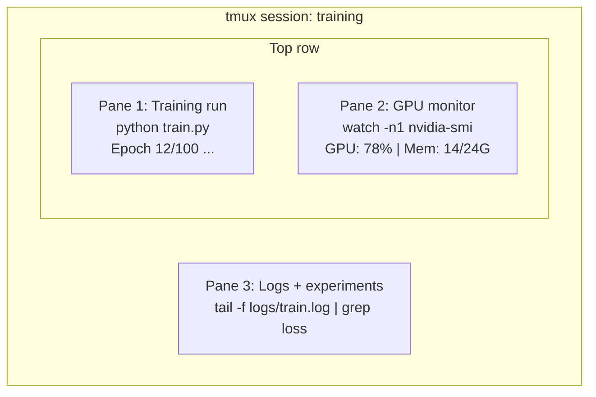

# Terminal & Shell | 终端与 Shell

> The terminal is where AI engineers live. Get comfortable here.

**Type:** Learn
**Languages:** --
**Prerequisites:** Phase 0, Lesson 01
**Time:** ~35 minutes

## Learning Objectives | 学习目标

- Use piping, redirects, and `grep` to filter and process training logs from the command line
- Create persistent tmux sessions with multiple panes for concurrent training and GPU monitoring
- Monitor system and GPU resources with `htop`, `nvtop`, and `nvidia-smi`
- Transfer files between local and remote machines using SSH, `scp`, and `rsync`

> **【中文解读】**
> 终端是 AI 工程师最常使用的工具。训练模型、监控 GPU、查看日志、远程连接——全部在终端完成。本章教你终端操作的核心技能：管道、tmux 会话、GPU 监控和文件传输。

## The Problem | 问题描述

You will spend more time in the terminal than in any editor. Training runs, GPU monitoring, log tailing, remote SSH sessions, environment management. Every AI workflow touches the shell. If you're slow here, you're slow everywhere.

This lesson covers the terminal skills that matter for AI work. No history of Unix. No deep-dive into Bash scripting. Just what you need.

> **【中文解读】**
> AI 工程师在终端的时间比任何编辑器都多。训练模型、监控 GPU、远程 SSH——都依赖终端技能。本章只教 AI 工作中真正需要的终端技巧。

## The Concept | 核心概念



Three things running at once. One terminal. You can detach, go home, SSH back in, and reattach. The training keeps running.

> **【中文解读】**
> 终端复用是 AI 工程师的核心技能。上图展示了一个典型的 tmux 会话：一个面板跑训练、一个面板监控 GPU、一个面板查看日志。三个任务同时在一个终端窗口中运行。断开 SSH 后训练继续，第二天重新连接即可恢复。

> **【拓展：tmux 在 GPU 训练中的重要性】**
> 在 AWS p4d 实例（8x A100 GPU，约 $32.77/小时）上训练 LLM，如果因为关闭笔记本导致训练中断，不仅浪费已完成的所有计算，还要从头重新训练。使用 tmux 可以让训练在后台持续运行数天甚至数周。OpenAI 训练 GPT-4 用了数千个 GPU 运行数月，tmux/screen 是这类长时间任务的必备工具。

## Build It | 动手实现

### Step 1: Know your shell

Check which shell you're running:

```bash
echo $SHELL
```

Most systems use `bash` or `zsh`. Both work fine. The commands in this course work in either.

Key things to know:

```bash
# Move around
cd ~/projects/ai-engineering-from-scratch
pwd
ls -la

# History search (most useful shortcut you'll learn)
# Ctrl+R then type part of a previous command
# Press Ctrl+R again to cycle through matches

# Clear terminal
clear   # or Ctrl+L

# Cancel a running command
# Ctrl+C

# Suspend a running command (resume with fg)
# Ctrl+Z
```

### Step 2: Piping and redirects

Piping connects commands together. This is how you process logs, filter output, and chain tools. You will use this constantly.

> **【中文解读】**
> 管道（pipe）是 Unix 哲学的核心：每个工具只做一件事，通过管道串联完成复杂任务。`cat train.log | grep "loss" | wc -l` 这条命令的含义是：读取日志 → 过滤含 "loss" 的行 → 统计行数。重定向（`>`、`>>`、`2>`）控制输出到文件还是屏幕。这些是 AI 工程师每天必用的操作。

```bash
# Count how many times "loss" appears in a log  统计日志中 "loss" 出现的次数
cat train.log | grep "loss" | wc -l

# Extract just the loss values from training output  提取训练输出中的 loss 值
grep "loss:" train.log | awk '{print $NF}' > losses.txt

# Watch a log file update in real time, filtering for errors  实时过滤错误日志
tail -f train.log | grep --line-buffered "ERROR"

# Sort experiments by final accuracy  按最终准确率排序实验结果
grep "final_accuracy" results/*.log | sort -t= -k2 -n -r

# Redirect stdout and stderr to separate files  分别重定向标准输出和标准错误
python train.py > output.log 2> errors.log

# Redirect both to the same file  将所有输出合并到同一文件
python train.py > train_full.log 2>&1
```

The three redirects you need:

| Symbol | What it does |
|--------|-------------|
| `>` | Write stdout to file (overwrite) |
| `>>` | Append stdout to file |
| `2>` | Write stderr to file |
| `2>&1` | Send stderr to same place as stdout |
| `\|` | Send stdout of one command as stdin to the next |

| 符号 | 作用 |
|------|------|
| `>` | 将标准输出写入文件（覆盖） |
| `>>` | 将标准输出追加到文件 |
| `2>` | 将标准错误写入文件 |
| `2>&1` | 将标准错误合并到标准输出 |
| `\|` | 将一个命令的输出传给下一个命令 |

### Step 3: Background processes

Training runs take hours. You don't want to keep your terminal open the whole time.

```bash
# Run in background (output still goes to terminal)
python train.py &

# Run in background, immune to hangup (closing terminal won't kill it)
nohup python train.py > train.log 2>&1 &

# Check what's running in background
jobs
ps aux | grep train.py

# Bring a background job to foreground
fg %1

# Kill a background process
kill %1
# or find its PID and kill that
kill $(pgrep -f "train.py")
```

The difference between `&`, `nohup`, and `screen`/`tmux`:

| Method | Survives terminal close? | Can reattach? |
|--------|-------------------------|---------------|
| `command &` | No | No |
| `nohup command &` | Yes | No (check log file) |
| `screen` / `tmux` | Yes | Yes |

| 方式 | 关闭终端后存活？ | 可重新连接？ |
|------|---------------|-------------|
| `command &` | 否 | 否 |
| `nohup command &` | 是 | 否（查看日志文件） |
| `screen` / `tmux` | 是 | 是 |

For anything longer than a few minutes, use tmux.

### Step 4: tmux

tmux lets you create persistent terminal sessions with multiple panes. This is the single most useful tool for managing training runs.

> **【中文解读】**
> tmux 是终端复用器，能创建多个面板（pane）和多个窗口（window），断开 SSH 后会话仍然在后台运行。这是管理 GPU 训练任务最重要的工具。上方的代码展示了 tmux 的核心操作：新建会话、分割面板、分离和重连。

```bash
# Install
# macOS
brew install tmux
# Ubuntu
sudo apt install tmux

# Start a named session
tmux new -s training

# Split horizontally
# Ctrl+B then "

# Split vertically
# Ctrl+B then %

# Navigate between panes
# Ctrl+B then arrow keys

# Detach (session keeps running)
# Ctrl+B then d

# Reattach
tmux attach -t training

# List sessions
tmux ls

# Kill a session
tmux kill-session -t training
```

A typical AI workflow session:

```bash
tmux new -s train

# Pane 1: start training
python train.py --epochs 100 --lr 1e-4

# Ctrl+B, " to split, then run GPU monitor
watch -n1 nvidia-smi

# Ctrl+B, % to split vertically, tail the logs
tail -f logs/experiment.log

# Now detach with Ctrl+B, d
# SSH out, go get coffee, come back
# tmux attach -t train
```

### Step 5: Monitoring with htop and nvtop

```bash
# System processes (better than top)  系统进程监控（比 top 更好用）
htop

# GPU processes (if you have NVIDIA GPU)  GPU 进程监控
# Install: sudo apt install nvtop (Ubuntu) or brew install nvtop (macOS)
nvtop

# Quick GPU check without nvtop  快速查看 GPU 状态
nvidia-smi

# Watch GPU usage update every second  每秒刷新 GPU 使用情况
watch -n1 nvidia-smi

# See which processes are using the GPU  查看占用 GPU 的进程
nvidia-smi --query-compute-apps=pid,name,used_memory --format=csv
```

> **【拓展：GPU 监控在实际训练中的价值】**
> 在多 GPU 训练中，GPU 利用率低于 80% 通常意味着数据加载是瓶颈（GPU 在等数据）。通过 `nvidia-smi` 可以快速发现：显存不足（OOM）、GPU 利用率低（数据瓶颈）、温度过高（散热问题）。nvidia-smi 的 `--query-compute-apps` 参数能精确找到哪个进程占用了 GPU 显存——这在共享服务器上非常重要。

`htop` keybindings you'll use:
- `F6` or `>` to sort by column (sort by memory to find memory leaks)
- `F5` to toggle tree view (see child processes)
- `F9` to kill a process
- `/` to search for a process name

### Step 6: SSH for remote GPU boxes

When you rent a cloud GPU (Lambda, RunPod, Vast.ai), you connect via SSH.

```bash
# Basic connection  基本 SSH 连接
ssh user@gpu-box-ip

# With a specific key  使用指定密钥连接
ssh -i ~/.ssh/my_gpu_key user@gpu-box-ip

# Copy files to remote  复制文件到远程服务器
scp model.pt user@gpu-box-ip:~/models/

# Copy files from remote  从远程服务器复制文件
scp user@gpu-box-ip:~/results/metrics.json ./

# Sync a whole directory (faster for many files)  同步整个目录（比 scp 更快）
rsync -avz ./data/ user@gpu-box-ip:~/data/

# Port forward (access remote Jupyter/TensorBoard locally)  端口转发（本地访问远程服务）
ssh -L 8888:localhost:8888 user@gpu-box-ip
# Now open localhost:8888 in your browser
```

# SSH config for convenience
# Add to ~/.ssh/config:
# Host gpu
#     HostName 192.168.1.100
#     User ubuntu
#     IdentityFile ~/.ssh/gpu_key
#
# Then just:
# ssh gpu
```

### Step 7: Useful aliases for AI work

> **【中文解读】**
> Shell 别名（alias）是将常用长命令缩短为短命令的方式。AI 工程中，`gpu` 查看 GPU 状态、`killtraining` 终止所有训练进程、`watchloss` 实时监控 loss——这些别名每天要用几十次。将它们加入 `~/.bashrc` 或 `~/.zshrc` 后，每次打开终端自动生效。

Add these to your `~/.bashrc` or `~/.zshrc`:

```bash
source phases/00-setup-and-tooling/10-terminal-and-shell/code/shell_aliases.sh
```

Or copy the ones you want. The key aliases:

```bash
# GPU status at a glance  一行查看 GPU 状态
alias gpu='nvidia-smi --query-gpu=index,name,utilization.gpu,memory.used,memory.total,temperature.gpu --format=csv,noheader'

# Kill all Python training processes  终止所有训练进程
alias killtraining='pkill -f "python.*train"'

# Quick virtual environment activate  快速激活虚拟环境
alias ae='source .venv/bin/activate'

# Watch training loss  实时监控训练 loss
alias watchloss='tail -f logs/*.log | grep --line-buffered "loss"'
```

See `code/shell_aliases.sh` for the full set.

> **【拓展：管道与重定向在 AI 日志分析中的威力】**
> 在 Google Brain 和 DeepMind，研究员用管道链处理实验日志：`grep "loss" train.log | awk '{print $3}' | sort -n | head -5` 可以在一秒内从百万行日志中找出 loss 最低的 5 个 epoch。这种技能不依赖任何 IDE 或 GUI 工具，在远程 GPU 服务器上尤其有用——那里只有终端可用。

### Step 8: Common AI terminal patterns

These come up repeatedly in practice:

> **【中文解读】**
> 这些是 AI 工程中反复出现的终端模式：用 `tee` 同时输出到终端和日志文件、用 `diff` 对比实验结果、用 `find` 找到最大的模型文件清理磁盘、用 `tar` 解压数据集。掌握这些命令组合能大幅提升日常效率。

```bash
# Run training, log everything, notify when done
python train.py 2>&1 | tee train.log; echo "DONE" | mail -s "Training complete" you@email.com

# Compare two experiment logs side by side
diff <(grep "accuracy" exp1.log) <(grep "accuracy" exp2.log)

# Find the largest model files (clean up disk space)
find . -name "*.pt" -o -name "*.safetensors" | xargs du -h | sort -rh | head -20

# Download a model from Hugging Face
wget https://huggingface.co/model/resolve/main/model.safetensors

# Untar a dataset
tar xzf dataset.tar.gz -C ./data/

# Count lines in all Python files (see how big your project is)
find . -name "*.py" | xargs wc -l | tail -1

# Check disk space (training data fills disks fast)
df -h
du -sh ./data/*

# Environment variable check before training
env | grep -i cuda
env | grep -i torch
```

## Use It | 用框架实现

Here's when each tool comes into play during this course:

| Tool | When you use it |
|------|----------------|
| tmux | Every training run (Phases 3+) |
| `tail -f` + `grep` | Monitoring training logs |
| `nohup` / `&` | Quick background tasks |
| `htop` / `nvtop` | Debugging slow training, OOM errors |
| SSH + `rsync` | Working on cloud GPUs |
| Piping + redirects | Processing experiment results |
| Aliases | Saving time on repetitive commands |

| 工具 | 使用场景 |
|------|---------|
| tmux | 所有训练任务（Phase 3+） |
| `tail -f` + `grep` | 监控训练日志 |
| `nohup` / `&` | 快速后台任务 |
| `htop` / `nvtop` | 排查训练慢、OOM 错误 |
| SSH + `rsync` | 云 GPU 工作 |
| 管道 + 重定向 | 处理实验结果 |
| 别名 | 节省重复命令时间 |

> **【拓展：AI 工程师的终端工作流】**
> 一个高效的 AI 工程师通常同时维护 2-3 个 tmux 会话：一个用于训练（长时间运行）、一个用于数据处理和调试、一个用于监控。SSH config 文件可以简化连接——配置好后只需 `ssh gpu` 就能连上远程服务器。rsync 是传输大数据集的最佳选择，它只传输变化的字节，支持断点续传，比 scp 快 10 倍以上。

## Exercises | 练习题

1. Install tmux, create a session with three panes, and run `htop` in one, `watch -n1 date` in another, and a Python script in the third. Detach and reattach.
   安装 tmux，创建包含三个面板的会话，分别运行 htop、定时命令和 Python 脚本，然后分离并重新连接。
2. Add the aliases from `code/shell_aliases.sh` to your shell config and reload with `source ~/.zshrc` (or `~/.bashrc`).
   将 `code/shell_aliases.sh` 中的别名添加到你的 shell 配置中并重载。
3. Create a fake training log with `for i in $(seq 1 100); do echo "epoch $i loss: $(echo "scale=4; 1/$i" | bc)"; sleep 0.1; done > fake_train.log` and then use `grep`, `tail`, and `awk` to extract just the loss values.
   创建模拟训练日志，用 `grep`、`tail` 和 `awk` 提取 loss 值。
4. Set up an SSH config entry for a server you have access to (or use `localhost` to practice the syntax).
   为你有权限的服务器设置 SSH config 条目。

## Key Terms | 关键术语

| Term | What people say | What it actually means |
|------|----------------|----------------------|
| Shell | "The terminal" | The program that interprets your commands (bash, zsh, fish) |
| tmux | "Terminal multiplexer" | A program that lets you run multiple terminal sessions inside one window, and detach/reattach |
| Pipe | "The bar thing" | The `\|` operator that sends one command's output as input to another |
| PID | "Process ID" | A unique number assigned to every running process, used to monitor or kill it |
| nohup | "No hangup" | Runs a command immune to the hangup signal, so closing the terminal won't kill it |
| SSH | "Connecting to the server" | Secure Shell, an encrypted protocol for running commands on a remote machine |

| 术语 | 俗称 | 实际含义 |
|------|------|---------|
| Shell | "终端" | 解释执行命令的程序（bash、zsh、fish） |
| tmux | "终端复用器" | 在一个窗口中运行多个终端会话，支持分离/重连 |
| Pipe（管道） | "竖线那个" | `\|` 操作符，将一个命令的输出传给另一个命令 |
| PID | "进程号" | 每个运行进程的唯一编号，用于监控或终止 |
| nohup | "不挂断" | 关闭终端也不会终止命令 |
| SSH | "连服务器" | 安全外壳协议，用于远程执行命令 |
