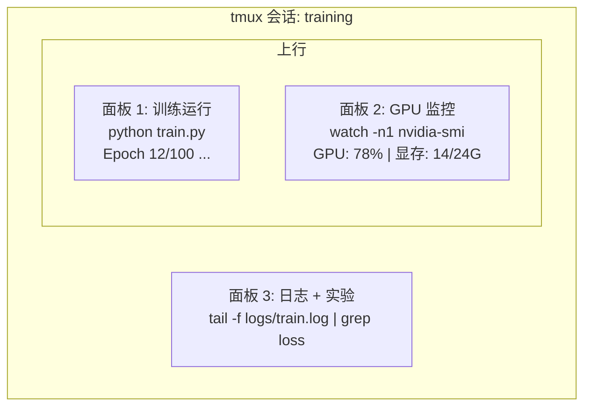

# 终端与 Shell

> 终端是 AI 工程师的家。在这里待得舒服点。

**类型：** 知识学习
**语言：** --
**前置条件：** Phase 0, Lesson 01
**预计用时：** 约 35 分钟

## 学习目标

- 使用管道、重定向和 `grep` 从命令行过滤和处理训练日志
- 创建带有多个面板的持久 tmux 会话，用于并行训练和 GPU 监控
- 使用 `htop`、`nvtop` 和 `nvidia-smi` 监控系统和 GPU 资源
- 使用 SSH、`scp` 和 `rsync` 在本地和远程机器之间传输文件

> **【中文解读】**
> 终端是 AI 工程师最常使用的工具。训练模型、监控 GPU、查看日志、远程连接——全部在终端完成。本章教你终端操作的核心技能：管道、tmux 会话、GPU 监控和文件传输。

## 问题引入

你在终端中度过的时间比任何编辑器都多。训练运行、GPU 监控、日志追踪、远程 SSH 会话、环境管理。每个 AI 工作流都涉及 shell。如果你在这里慢，你在所有地方都慢。

本课涵盖 AI 工作中真正重要的终端技能。不讲 Unix 历史，不讲 Bash 脚本深入。只讲你需要的。

> **【中文解读】**
> AI 工程师在终端的时间比任何编辑器都多。训练模型、监控 GPU、远程 SSH——都依赖终端技能。本章只教 AI 工作中真正需要的终端技巧。

## 核心概念



三个任务同时运行。一个终端。你可以分离、回家、SSH 重新连接、再附着（reattach）。训练一直在跑。

> **【中文解读】**
> 终端复用是 AI 工程师的核心技能。上图展示了一个典型的 tmux 会话：一个面板跑训练、一个面板监控 GPU、一个面板查看日志。三个任务同时在一个终端窗口中运行。断开 SSH 后训练继续，第二天重新连接即可恢复。

> **【拓展：tmux 在 GPU 训练中的重要性】**
> 在 AWS p4d 实例（8x A100 GPU，约 $32.77/小时）上训练 LLM，如果因为关闭笔记本导致训练中断，不仅浪费已完成的所有计算，还要从头重新训练。使用 tmux 可以让训练在后台持续运行数天甚至数周。OpenAI 训练 GPT-4 用了数千个 GPU 运行数月，tmux/screen 是这类长时间任务的必备工具。

## 动手实现

### 第 1 步：了解你的 shell

检查你正在使用哪个 shell：

```bash
echo $SHELL
```

大多数系统使用 `bash` 或 `zsh`。两者都可以。本课程的命令在两者中都适用。

关键要点：

```bash
# 移动操作
cd ~/projects/ai-engineering-from-scratch
pwd
ls -la

# 历史搜索（你将学到的最有用的快捷键）
# Ctrl+R 然后输入之前命令的一部分
# 再次按 Ctrl+R 循环匹配

# 清屏
clear   # 或 Ctrl+L

# 取消正在运行的命令
# Ctrl+C

# 挂起正在运行的命令（用 fg 恢复）
# Ctrl+Z
```

### 第 2 步：管道和重定向

管道将命令连接在一起。这是你处理日志、过滤输出和串联工具的方式。你会经常用到它。

> **【中文解读】**
> 管道（pipe）是 Unix 哲学的核心：每个工具只做一件事，通过管道串联完成复杂任务。`cat train.log | grep "loss" | wc -l` 这条命令的含义是：读取日志 → 过滤含 "loss" 的行 → 统计行数。重定向（`>`、`>>`、`2>`）控制输出到文件还是屏幕。这些是 AI 工程师每天必用的操作。

```bash
# 统计日志中 "loss" 出现的次数
cat train.log | grep "loss" | wc -l

# 提取训练输出中的 loss 值
grep "loss:" train.log | awk '{print $NF}' > losses.txt

# 实时过滤错误日志
tail -f train.log | grep --line-buffered "ERROR"

# 按最终准确率排序实验结果
grep "final_accuracy" results/*.log | sort -t= -k2 -n -r

# 分别重定向标准输出和标准错误
python train.py > output.log 2> errors.log

# 将所有输出合并到同一文件
python train.py > train_full.log 2>&1
```

你需要知道的三个重定向：

| 符号 | 作用 |
|------|------|
| `>` | 将标准输出写入文件（覆盖） |
| `>>` | 将标准输出追加到文件 |
| `2>` | 将标准错误写入文件 |
| `2>&1` | 将标准错误合并到标准输出 |
| `|` | 将一个命令的输出传给下一个命令 |

### 第 3 步：后台进程

训练运行需要数小时。你不想一直保持终端打开。

```bash
# 后台运行（输出仍显示在终端）
python train.py &

# 后台运行，不受挂断影响（关闭终端不会终止）
nohup python train.py > train.log 2>&1 &

# 查看后台运行的任务
jobs
ps aux | grep train.py

# 将后台任务调到前台
fg %1

# 终止后台进程
kill %1
# 或者找到 PID 再终止
kill $(pgrep -f "train.py")
```

`&`、`nohup` 和 `screen`/`tmux` 的区别：

| 方式 | 关闭终端后存活？ | 可重新连接？ |
|------|---------------|-------------|
| `command &` | 否 | 否 |
| `nohup command &` | 是 | 否（查看日志文件） |
| `screen` / `tmux` | 是 | 是 |

对于超过几分钟的任务，使用 tmux。

### 第 4 步：tmux

tmux 让你创建带有多个面板的持久终端会话。这是管理训练运行最有用的工具。

> **【中文解读】**
> tmux 是终端复用器，能创建多个面板（pane）和多个窗口（window），断开 SSH 后会话仍然在后台运行。这是管理 GPU 训练任务最重要的工具。上方的代码展示了 tmux 的核心操作：新建会话、分割面板、分离和重连。

```bash
# 安装
# macOS
brew install tmux
# Ubuntu
sudo apt install tmux

# 启动一个命名会话
tmux new -s training

# 水平分割面板
# Ctrl+B 然后按 "

# 垂直分割面板
# Ctrl+B 然后按 %

# 在面板之间切换
# Ctrl+B 然后按方向键

# 分离（会话继续运行）
# Ctrl+B 然后按 d

# 重新连接
tmux attach -t training

# 列出会话
tmux ls

# 终止会话
tmux kill-session -t training
```

典型的 AI 工作流会话：

```bash
tmux new -s train

# 面板 1：启动训练
python train.py --epochs 100 --lr 1e-4

# Ctrl+B, " 水平分割，然后运行 GPU 监控
watch -n1 nvidia-smi

# Ctrl+B, % 垂直分割，追踪日志
tail -f logs/experiment.log

# 现在用 Ctrl+B, d 分离
# 断开 SSH，去喝杯咖啡，回来
# tmux attach -t train
```

### 第 5 步：使用 htop 和 nvtop 监控

```bash
# 系统进程监控（比 top 更好用）
htop

# GPU 进程监控
# 安装：sudo apt install nvtop（Ubuntu）或 brew install nvtop（macOS）
nvtop

# 快速查看 GPU 状态
nvidia-smi

# 每秒刷新 GPU 使用情况
watch -n1 nvidia-smi

# 查看占用 GPU 的进程
nvidia-smi --query-compute-apps=pid,name,used_memory --format=csv
```

> **【拓展：GPU 监控在实际训练中的价值】**
> 在多 GPU 训练中，GPU 利用率低于 80% 通常意味着数据加载是瓶颈（GPU 在等数据）。通过 `nvidia-smi` 可以快速发现：显存不足（OOM）、GPU 利用率低（数据瓶颈）、温度过高（散热问题）。nvidia-smi 的 `--query-compute-apps` 参数能精确找到哪个进程占用了 GPU 显存——这在共享服务器上非常重要。

常用的 `htop` 快捷键：
- `F6` 或 `>` 按列排序（按内存排序可发现内存泄漏）
- `F5` 切换树形视图（查看子进程）
- `F9` 终止进程
- `/` 搜索进程名

### 第 6 步：SSH 连接远程 GPU 服务器

当你租用云 GPU（Lambda、RunPod、Vast.ai）时，通过 SSH 连接。

```bash
# 基本 SSH 连接
ssh user@gpu-box-ip

# 使用指定密钥连接
ssh -i ~/.ssh/my_gpu_key user@gpu-box-ip

# 复制文件到远程服务器
scp model.pt user@gpu-box-ip:~/models/

# 从远程服务器复制文件
scp user@gpu-box-ip:~/results/metrics.json ./

# 同步整个目录（比 scp 更快）
rsync -avz ./data/ user@gpu-box-ip:~/data/

# 端口转发（本地访问远程服务）
ssh -L 8888:localhost:8888 user@gpu-box-ip
# 然后在浏览器打开 localhost:8888
```

# SSH 配置快捷方式
# 添加到 ~/.ssh/config:
# Host gpu
#     HostName 192.168.1.100
#     User ubuntu
#     IdentityFile ~/.ssh/gpu_key
#
# 然后只需：
# ssh gpu
```

### 第 7 步：AI 工作中的实用别名

> **【中文解读】**
> Shell 别名（alias）是将常用长命令缩短为短命令的方式。AI 工程中，`gpu` 查看 GPU 状态、`killtraining` 终止所有训练进程、`watchloss` 实时监控 loss——这些别名每天要用几十次。将它们加入 `~/.bashrc` 或 `~/.zshrc` 后，每次打开终端自动生效。

将这些添加到你的 `~/.bashrc` 或 `~/.zshrc`：

```bash
source phases/00-setup-and-tooling/10-terminal-and-shell/code/shell_aliases.sh
```

或者复制你想要的。核心别名：

```bash
# 一行查看 GPU 状态
alias gpu='nvidia-smi --query-gpu=index,name,utilization.gpu,memory.used,memory.total,temperature.gpu --format=csv,noheader'

# 终止所有训练进程
alias killtraining='pkill -f "python.*train"'

# 快速激活虚拟环境
alias ae='source .venv/bin/activate'

# 实时监控训练 loss
alias watchloss='tail -f logs/*.log | grep --line-buffered "loss"'
```

完整列表见 `code/shell_aliases.sh`。

> **【拓展：管道与重定向在 AI 日志分析中的威力】**
> 在 Google Brain 和 DeepMind，研究员用管道链处理实验日志：`grep "loss" train.log | awk '{print $3}' | sort -n | head -5` 可以在一秒内从百万行日志中找出 loss 最低的 5 个 epoch。这种技能不依赖任何 IDE 或 GUI 工具，在远程 GPU 服务器上尤其有用——那里只有终端可用。

### 第 8 步：常见 AI 终端模式

这些在实践中反复出现：

> **【中文解读】**
> 这些是 AI 工程中反复出现的终端模式：用 `tee` 同时输出到终端和日志文件、用 `diff` 对比实验结果、用 `find` 找到最大的模型文件清理磁盘、用 `tar` 解压数据集。掌握这些命令组合能大幅提升日常效率。

```bash
# 运行训练，记录一切，完成后通知
python train.py 2>&1 | tee train.log; echo "DONE" | mail -s "Training complete" you@email.com

# 并排比较两个实验日志
diff <(grep "accuracy" exp1.log) <(grep "accuracy" exp2.log)

# 找到最大的模型文件（清理磁盘空间）
find . -name "*.pt" -o -name "*.safetensors" | xargs du -h | sort -rh | head -20

# 从 Hugging Face 下载模型
wget https://huggingface.co/model/resolve/main/model.safetensors

# 解压数据集
tar xzf dataset.tar.gz -C ./data/

# 统计所有 Python 文件的行数（看看项目有多大）
find . -name "*.py" | xargs wc -l | tail -1

# 检查磁盘空间（训练数据很快填满磁盘）
df -h
du -sh ./data/*

# 训练前检查环境变量
env | grep -i cuda
env | grep -i torch
```

## 用框架实现

以下是本课程中各工具的使用时机：

| 工具 | 使用场景 |
|------|---------|
| tmux | 所有训练任务（Phase 3+） |
| `tail -f` + `grep` | 监控训练日志 |
| `nohup` / `&` | 快速后台任务 |
| `htop` / `nvtop` | 排查训练慢、OOM 错误 |
| SSH + `rsync` | 云 GPU 工作 |
| 管道 + 重定向 | 处理实验结果 |
| 别名 | 节省重复命令时间 |

> **【拓展：AI 工程师的终端工作流】**
> 一个高效的 AI 工程师通常同时维护 2-3 个 tmux 会话：一个用于训练（长时间运行）、一个用于数据处理和调试、一个用于监控。SSH config 文件可以简化连接——配置好后只需 `ssh gpu` 就能连上远程服务器。rsync 是传输大数据集的最佳选择，它只传输变化的字节，支持断点续传，比 scp 快 10 倍以上。

## 练习题

1. 安装 tmux，创建包含三个面板的会话，分别运行 htop、定时命令和 Python 脚本，然后分离并重新连接。
2. 将 `code/shell_aliases.sh` 中的别名添加到你的 shell 配置中并重载。
3. 创建模拟训练日志，用 `grep`、`tail` 和 `awk` 提取 loss 值。
4. 为你有权限的服务器设置 SSH config 条目。

## 术语速查表

| 术语 | 俗称 | 实际含义 |
|------|------|---------|
| Shell | "终端" | 解释执行命令的程序（bash、zsh、fish） |
| tmux | "终端复用器" | 在一个窗口中运行多个终端会话，支持分离/重连 |
| Pipe（管道） | "竖线那个" | `|` 操作符，将一个命令的输出传给另一个命令 |
| PID | "进程号" | 每个运行进程的唯一编号，用于监控或终止 |
| nohup | "不挂断" | 关闭终端也不会终止命令 |
| SSH | "连服务器" | 安全外壳协议，用于远程执行命令 |
