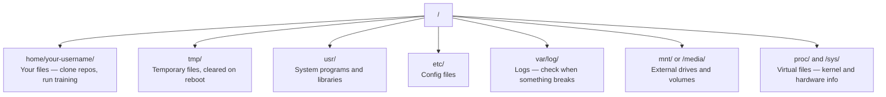

# Linux for AI | Linux 基础（AI 工程师必备）

> Most AI runs on Linux. You need to know enough to not be stuck.

**Type:** Learn
**Languages:** --
**Prerequisites:** Phase 0, Lesson 01
**Time:** ~30 minutes

## Learning Objectives | 学习目标

- Navigate the Linux file system and perform essential file operations from the command line
- Manage file permissions with `chmod` and `chown` to resolve "Permission denied" errors
- Install system packages with `apt` and set up a fresh GPU box for AI work
- Identify macOS-to-Linux differences that commonly trip up developers working on remote machines

> **【中文解读】**
> 大多数 AI 训练在 Linux 服务器上运行。当你 SSH 到云 GPU 实例时，你只有终端界面。本章是 Linux 生存指南——只教 AI 工作中真正需要的文件操作、权限管理和包安装。

## The Problem | 问题描述

You develop on macOS or Windows. But the moment you SSH into a cloud GPU box, rent a Lambda instance, or spin up an EC2 machine, you land in Ubuntu. The terminal is your only interface. There is no Finder, no Explorer, no GUI. If you can't navigate the file system, install packages, and manage processes from the command line, you're stuck paying for idle GPU hours while googling "how to unzip a file in Linux."

This is a survival guide. It covers exactly what you need to operate on a remote Linux machine for AI work. Nothing more.

> **【中文解读】**
> 你平时用 macOS 或 Windows 开发，但一 SSH 到云 GPU 服务器就进入了 Linux 世界。没有文件管理器，只有终端。这是 Linux 生存指南——只教够用的知识。

## File System Layout | 文件系统结构

Linux organizes everything under a single root `/`. There is no `C:\` or `/Volumes`. The directories you'll actually touch:

> **【中文解读】**
> Linux 文件系统是单一树状结构，根目录是 `/`。`/home/用户名/`（简写 `~`）是你的工作目录，几乎所有操作都在这里进行。`/tmp/` 存临时文件，重启后清空。`/var/log/` 存日志，出问题时必查。`/mnt/` 挂载外部存储。理解这个结构是在 Linux 服务器上工作的基础。



Your home directory is `~` or `/home/your-username`. Almost everything you do happens here.

## Essential Commands | 常用命令

These are the 15 commands that cover 95% of what you'll do on a remote GPU box.

> **【中文解读】**
> 你只需要掌握约 15 个命令就能在远程 Linux 服务器上完成 95% 的工作。这些命令分为四类：导航（pwd、ls、cd）、文件操作（cp、mv、rm、mkdir）、查看文件（cat、head、tail、grep）和搜索（find、grep -r）。熟练掌握这些命令比学习复杂的 GUI 工具更实用。

### Moving Around | 导航操作

```bash
pwd                         # Where am I?  当前在哪个目录？
ls                          # What's here?  列出当前目录内容
ls -la                      # What's here, including hidden files with details?  详细列出所有文件（含隐藏文件）
cd /path/to/dir             # Go there  切换到指定目录
cd ~                        # Go home  回到主目录
cd ..                       # Go up one level  返回上一级目录
```

### Files and Directories | 文件与目录操作

```bash
mkdir my-project            # Create a directory  创建目录
mkdir -p a/b/c              # Create nested directories in one shot  递归创建多级目录

cp file.txt backup.txt      # Copy a file  复制文件
cp -r src/ src-backup/      # Copy a directory (recursive)  递归复制目录

mv old.txt new.txt          # Rename a file  重命名文件
mv file.txt /tmp/           # Move a file  移动文件

rm file.txt                 # Delete a file (no trash, it's gone)  删除文件（无法恢复！）
rm -rf my-dir/              # Delete a directory and everything inside  递归删除目录（危险操作！）
```

`rm -rf` is permanent. There is no undo. Double-check the path before hitting enter.

### Reading Files | 查看文件

```bash
cat file.txt                # Print entire file  打印整个文件内容
head -20 file.txt           # First 20 lines  查看前 20 行
tail -20 file.txt           # Last 20 lines  查看后 20 行
tail -f log.txt             # Follow a log file in real time (Ctrl+C to stop)  实时跟踪日志文件
less file.txt               # Scroll through a file (q to quit)  分页浏览文件
```

### Searching | 搜索与查找

```bash
grep "error" training.log           # Find lines containing "error"  搜索包含 "error" 的行
grep -r "learning_rate" .           # Search all files in current directory  递归搜索所有文件
grep -i "cuda" config.yaml          # Case-insensitive search  不区分大小写搜索

find . -name "*.py"                 # Find all Python files under current dir  查找所有 Python 文件
find . -name "*.ckpt" -size +1G     # Find checkpoint files larger than 1GB  查找大于 1GB 的检查点文件
```

## Permissions | 文件权限

Every file in Linux has an owner and permission bits. You'll run into this when scripts won't execute or you can't write to a directory.

> **【中文解读】**
> Linux 权限分为三组：文件所有者（owner）、同组用户（group）、其他用户（others）。每组有读（r）、写（w）、执行（x）三种权限。`chmod +x` 让脚本可执行，`chmod 644` 设置文件为所有者可读写、其他人只读。"Permission denied" 错误几乎都可以用 `chmod` 或 `sudo` 解决。

```bash
ls -l train.py
# -rwxr-xr-- 1 user group 2048 Mar 19 10:00 train.py
#  ^^^             owner permissions: read, write, execute
#     ^^^          group permissions: read, execute
#        ^^        everyone else: read only
```

Common fixes:

```bash
chmod +x train.sh           # Make a script executable  让脚本可执行
chmod 755 deploy.sh         # Owner: full, others: read+execute  所有者全部权限，其他人可读可执行
chmod 644 config.yaml       # Owner: read+write, others: read only  所有者可读写，其他人只读

chown user:group file.txt   # Change who owns a file (needs sudo)  修改文件所有者（需要 sudo）
```

When something says "Permission denied," it's almost always a permissions issue. `chmod +x` or `sudo` will fix most cases.

## Package Management (apt) | 包管理

Ubuntu uses `apt`. This is how you install system-level software.

```bash
sudo apt update             # Refresh the package list (always do this first)  更新软件包列表（首先执行）
sudo apt install -y htop    # Install a package (-y skips confirmation)  安装软件包（-y 跳过确认）
sudo apt install -y build-essential  # C compiler, make, etc. Needed by many Python packages  C 编译器和构建工具
sudo apt install -y tmux    # Terminal multiplexer (keep sessions alive after disconnect)  终端复用器

apt list --installed        # What's installed?  查看已安装的软件包
sudo apt remove htop        # Uninstall  卸载软件包
```

> **【中文解读】**
> `apt` 是 Ubuntu 的包管理器。每次安装软件前先 `apt update` 刷新列表。`build-essential` 提供 C 编译器，很多 Python 包（如 numpy、torch）需要它来编译。`tmux` 是保持远程会话不被中断的必备工具。

> **【拓展：新 GPU 服务器的初始化清单】**
> 拿到一台新的 GPU 服务器后，通常需要执行：`apt update && apt install -y build-essential git curl wget tmux htop unzip python3-venv`。然后安装 NVIDIA 驱动和 CUDA Toolkit，再安装 conda/uv。AWS EC2 的 Deep Learning AMI 已预装大部分工具，但 Lambda Labs 和 Vast.ai 的实例通常需要手动初始化。

Common packages you'll install on a fresh GPU box:

```bash
sudo apt update && sudo apt install -y \
    build-essential \
    git \
    curl \
    wget \
    tmux \
    htop \
    unzip \
    python3-venv
```

## Users and sudo | 用户与权限提升

You're usually logged in as a regular user. Some operations need root (admin) access.

```bash
whoami                      # What user am I?  查看当前用户名
sudo command                # Run a single command as root  以 root 权限执行命令
sudo su                     # Become root (exit to go back, use sparingly)  切换为 root 用户（谨慎使用）
```

> **【中文解读】**
> Linux 有严格的权限层级。普通用户只能操作自己的文件，系统级操作需要 `sudo`（superuser do）。最佳实践是只在必要时使用 `sudo`，不要长期以 root 身份运行——这样可以防止误删系统文件。

On cloud GPU instances, you're typically the only user and already have sudo access. Don't run everything as root. Use sudo only when needed.

## Processes and systemd | 进程管理

When your training hangs, or you need to check what's running:

```bash
htop                        # Interactive process viewer (q to quit)  交互式进程查看器
ps aux | grep python        # Find running Python processes  查找 Python 进程
kill 12345                  # Gracefully stop process with PID 12345  优雅终止进程
kill -9 12345               # Force kill (use when graceful doesn't work)  强制终止进程
nvidia-smi                  # GPU processes and memory usage  查看 GPU 进程和显存
```

> **【中文解读】**
> 当训练卡住时，用 `htop` 查看哪个进程占用资源，用 `kill` 终止失控的进程。`kill -9` 是强制终止，只在普通 `kill` 无效时使用。`nvidia-smi` 是 GPU 进程管理的核心命令，能看到哪些进程在用 GPU、占用了多少显存。

systemd manages services (background daemons). You'll use it if you run inference servers:

```bash
sudo systemctl start nginx          # Start a service  启动服务
sudo systemctl stop nginx           # Stop it  停止服务
sudo systemctl restart nginx        # Restart it  重启服务
sudo systemctl status nginx         # Check if it's running  查看服务状态
sudo systemctl enable nginx         # Start automatically on boot  设置开机自启
```

## Disk Space | 磁盘空间

GPU boxes often have limited disk space. Models and datasets fill it fast.

```bash
df -h                       # Disk usage for all mounted drives  查看所有磁盘使用情况
df -h /home                 # Disk usage for /home specifically  查看 /home 分区使用情况

du -sh *                    # Size of each item in current directory  查看当前目录各项大小
du -sh ~/.cache             # Size of your cache (pip, huggingface models land here)  缓存目录大小
du -sh /data/checkpoints/   # Check how big your checkpoints are  检查检查点文件大小

# Find the biggest space hogs  找出最大的空间占用
du -h --max-depth=1 / 2>/dev/null | sort -hr | head -20
```

> **【中文解读】**
> GPU 服务器的磁盘空间经常不够用。一个 LLM 检查点可能几十 GB，Hugging Face 缓存会自动积累。用 `df -h` 查看整体磁盘使用，用 `du -sh *` 找到具体哪个目录占空间最多。定期清理 `~/.cache/huggingface/` 和旧的检查点文件。

Common space savers:

```bash
# Clear pip cache  清理 pip 缓存
pip cache purge

# Clear apt cache  清理 apt 缓存
sudo apt clean

# Remove old checkpoints you don't need  删除不需要的旧检查点
rm -rf checkpoints/epoch_01/ checkpoints/epoch_02/
```

## Networking | 网络操作

You'll download models, transfer files, and hit APIs from the command line.

```bash
# Download files  下载文件
wget https://example.com/model.bin                   # Download a file  下载文件
curl -O https://example.com/data.tar.gz              # Same thing with curl  用 curl 下载
curl -s https://api.example.com/health | python3 -m json.tool  # Hit an API, pretty-print JSON  调用 API 并格式化输出

# Transfer files between machines  在机器间传输文件
scp model.bin user@remote:/data/                     # Copy file to remote machine  复制文件到远程机器
scp user@remote:/data/results.csv .                  # Copy file from remote to local  从远程复制到本地
scp -r user@remote:/data/checkpoints/ ./local-dir/   # Copy directory  复制整个目录

# Sync directories (faster than scp for large transfers, resumes on failure)  同步目录（比 scp 快，支持断点续传）
rsync -avz --progress ./data/ user@remote:/data/
rsync -avz --progress user@remote:/results/ ./results/
```

> **【中文解读】**
> 网络命令是 AI 工程师的日常工具。`wget` 和 `curl` 下载模型和数据集。`scp` 在本地和远程机器间复制文件。`rsync` 是大数据传输的首选——它只传输变化的字节，支持断点续传，比 scp 快得多。传输几十 GB 的检查点文件时，rsync 可能节省数小时。

> **【拓展：rsync 在 AI 工作流中的关键作用】**
> 当你在 AWS p4d 实例（$32.77/小时）上训练完一个 LLM，需要把 50GB 的检查点传回本地。用 scp 传输大约 30 分钟，如果中途断开要重头开始。用 rsync 只传输剩余部分，断开后重新运行命令即可续传。在大规模 AI 训练中，数据同步是最常见的运维任务之一。

Use `rsync` over `scp` for anything large. It only transfers changed bytes and handles interrupted connections.

## tmux: Keep Sessions Alive | tmux：保持会话

When you SSH into a remote box, closing your laptop kills your training run. tmux prevents this.

```bash
tmux new -s train           # Start a new session named "train"  创建名为 "train" 的新会话
# ... start your training, then:
# Ctrl+B, then D            # Detach (training keeps running)  分离会话（训练继续运行）

tmux ls                     # List sessions  列出所有会话
tmux attach -t train        # Reattach to session  重新连接到会话

# Inside tmux:  tmux 内操作：
# Ctrl+B, then %            # Split pane vertically  垂直分割面板
# Ctrl+B, then "            # Split pane horizontally  水平分割面板
# Ctrl+B, then arrow keys   # Switch between panes  切换面板
```

> **【中文解读】**
> tmux 是远程 GPU 训练的保命工具。没有 tmux，关闭 SSH 连接或笔记本电脑就会终止训练。用 tmux 创建会话后，`Ctrl+B, D` 分离，训练在后台继续。之后 `tmux attach` 重新连接。长时间训练任务必须用 tmux。

Always run long training jobs inside tmux. Always.

> **【拓展：Linux 在 AI 基础设施中的统治地位】**
> 全球超过 99% 的 AI 训练在 Linux 上运行。AWS、GCP、Azure 的 GPU 实例全部运行 Linux（主要是 Ubuntu）。NVIDIA 的 CUDA 驱动、Docker 容器、Kubernetes 集群——AI 训练的每一层基础设施都基于 Linux。熟悉 Linux 不是"加分项"，而是 AI 工程师的必备技能。

## WSL2 for Windows Users | Windows 用户 WSL2 指南

> **【中文解读】**
> WSL2 让 Windows 用户获得真正的 Linux 环境，无需双系统。GPU 直通已支持——只需在 Windows 侧安装 NVIDIA 驱动，WSL2 内即可使用 CUDA。Windows 文件在 WSL2 中通过 `/mnt/c/Users/用户名/` 访问。这是 Windows 用户学习 Linux 和 AI 开发的最佳方案。

If you're on Windows, WSL2 gives you a real Linux environment without dual-booting.

```bash
# In PowerShell (admin)
wsl --install -d Ubuntu-24.04

# After restart, open Ubuntu from Start menu
sudo apt update && sudo apt upgrade -y
```

WSL2 runs a real Linux kernel. Everything in this lesson works inside it. Your Windows files are at `/mnt/c/Users/YourName/` from inside WSL.

GPU passthrough works with NVIDIA drivers installed on the Windows side. Install the Windows NVIDIA driver (not the Linux one), and CUDA will be available inside WSL2.

> **【拓展：WSL2 GPU 支持的实际表现】**
> WSL2 的 GPU 直通性能接近原生 Linux，PyTorch 和 TensorFlow 都能正常使用 CUDA。在 WSL2 中运行 `nvidia-smi` 可以看到 Windows 的 GPU。不过 WSL2 的文件系统性能有限——跨系统文件访问（`/mnt/c/`）比 WSL2 原生文件系统慢 3-5 倍。建议将项目文件放在 WSL2 的 `~/` 目录下以获得最佳性能。

## Gotchas: macOS to Linux | macOS 到 Linux 的踩坑指南

Things that will trip you up if you're coming from macOS:

| macOS | Linux | Notes |
|-------|-------|-------|
| `brew install` | `sudo apt install` | Different package names sometimes. `brew install htop` vs `sudo apt install htop` works the same, but `brew install readline` vs `sudo apt install libreadline-dev` does not. |
| `open file.txt` | `xdg-open file.txt` | But you won't have a GUI on a remote box. Use `cat` or `less`. |
| `pbcopy` / `pbpaste` | Not available | Pipe to/from clipboard doesn't exist over SSH. |
| `~/.zshrc` | `~/.bashrc` | macOS defaults to zsh. Most Linux servers use bash. |
| `/opt/homebrew/` | `/usr/bin/`, `/usr/local/bin/` | Binaries live in different places. |
| `sed -i '' 's/a/b/' file` | `sed -i 's/a/b/' file` | macOS sed needs an empty string after `-i`. Linux does not. |
| Case-insensitive filesystem | Case-sensitive filesystem | `Model.py` and `model.py` are two different files on Linux. |
| Line endings `\n` | Line endings `\n` | Same. But Windows uses `\r\n`, which breaks bash scripts. Run `dos2unix` to fix. |

| macOS | Linux | 注意事项 |
|------|------|---------|
| `brew install` | `sudo apt install` | 包名有时不同，如 readline vs libreadline-dev |
| `open file.txt` | `xdg-open file.txt` | 远程服务器无 GUI，用 `cat` 或 `less` |
| `pbcopy` / `pbpaste` | 不可用 | SSH 下无法操作剪贴板 |
| `~/.zshrc` | `~/.bashrc` | macOS 默认 zsh，Linux 服务器多用 bash |
| `/opt/homebrew/` | `/usr/bin/`, `/usr/local/bin/` | 可执行文件路径不同 |
| `sed -i '' 's/a/b/' file` | `sed -i 's/a/b/' file` | macOS sed 的 `-i` 后需要空字符串 |
| 大小写不敏感 | 大小写敏感 | `Model.py` 和 `model.py` 是两个不同文件 |
| 换行符 `\n` | 换行符 `\n` | 相同，但 Windows 的 `\r\n` 会破坏 bash 脚本 |

## Quick Reference Card | 快速参考卡

```
Navigation:     pwd, ls, cd, find
Files:          cp, mv, rm, mkdir, cat, head, tail, less
Search:         grep, find
Permissions:    chmod, chown, sudo
Packages:       apt update, apt install
Processes:      htop, ps, kill, nvidia-smi
Services:       systemctl start/stop/restart/status
Disk:           df -h, du -sh
Network:        curl, wget, scp, rsync
Sessions:       tmux new/attach/detach
```

## Exercises | 练习题

1. SSH into any Linux machine (or open WSL2) and navigate to your home directory. Create a project folder, create three empty files inside it with `touch`, then list them with `ls -la`.
   SSH 到 Linux 机器，创建项目文件夹和空文件，用 `ls -la` 列出
2. Install `htop` with apt, run it, and identify which process is using the most memory.
   用 apt 安装 htop，找出占用内存最多的进程
3. Start a tmux session, run `sleep 300` inside it, detach, list sessions, and reattach.
   创建 tmux 会话，运行 sleep 命令，分离后重新连接
4. Use `df -h` to check available disk space, then use `du -sh ~/.cache/*` to find what's taking up space in your cache.
   检查磁盘空间，找出缓存中占用空间最大的内容
5. Transfer a file from your local machine to a remote one using `scp`, then do the same transfer with `rsync` and compare the experience.
   用 scp 和 rsync 分别传输文件，对比两种方式
