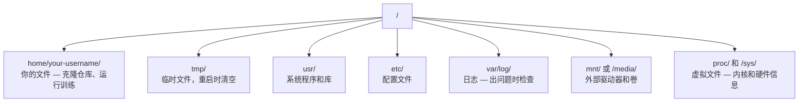

# Linux 基础（AI 工程师必备）

> 大多数 AI 运行在 Linux 上。你需要知道足够多的知识，才不会被卡住。

**类型：** 知识学习
**语言：** --
**前置条件：** Phase 0, Lesson 01
**预计用时：** 约 30 分钟

## 学习目标

- 从命令行导航 Linux 文件系统并执行基本文件操作
- 使用 `chmod` 和 `chown` 管理文件权限，解决"Permission denied"错误
- 使用 `apt` 安装系统包，为 AI 工作搭建全新的 GPU 服务器
- 识别在远程机器上工作时容易踩坑的 macOS 到 Linux 差异

> **【中文解读】**
> 大多数 AI 训练在 Linux 服务器上运行。当你 SSH 到云 GPU 实例时，你只有终端界面。本章是 Linux 生存指南——只教 AI 工作中真正需要的文件操作、权限管理和包安装。

## 问题引入

你在 macOS 或 Windows 上开发。但当你 SSH 到云 GPU 服务器、租用 Lambda 实例或启动 EC2 机器时，你进入的是 Ubuntu。终端是你唯一的界面。没有 Finder，没有 Explorer，没有 GUI。如果你不能从命令行导航文件系统、安装包和管理进程，你就会在付费的空闲 GPU 时间里搜索"如何在 Linux 中解压文件"。

这是一份生存指南。它精确涵盖了你在远程 Linux 机器上进行 AI 工作所需的知识。

> **【中文解读】**
> 你平时用 macOS 或 Windows 开发，但一 SSH 到云 GPU 服务器就进入了 Linux 世界。没有文件管理器，只有终端。这是 Linux 生存指南——只教够用的知识。

## 文件系统结构

Linux 在单一根目录 `/` 下组织一切。没有 `C:\` 或 `/Volumes`。你实际会接触到的目录：

> **【中文解读】**
> Linux 文件系统是单一树状结构，根目录是 `/`。`/home/用户名/`（简写 `~`）是你的工作目录，几乎所有操作都在这里进行。`/tmp/` 存临时文件，重启后清空。`/var/log/` 存日志，出问题时必查。`/mnt/` 挂载外部存储。理解这个结构是在 Linux 服务器上工作的基础。



你的主目录是 `~` 或 `/home/your-username`。几乎你做的所有事情都在这里。

## 常用命令

这是你在远程 GPU 服务器上 95% 的工作会用到的约 15 个命令。

> **【中文解读】**
> 你只需要掌握约 15 个命令就能在远程 Linux 服务器上完成 95% 的工作。这些命令分为四类：导航（pwd、ls、cd）、文件操作（cp、mv、rm、mkdir）、查看文件（cat、head、tail、grep）和搜索（find、grep -r）。熟练掌握这些命令比学习复杂的 GUI 工具更实用。

### 导航操作

```bash
pwd                         # 我在哪？当前在哪个目录？
ls                          # 这里有什么？列出当前目录内容
ls -la                      # 详细列出所有文件（含隐藏文件）
cd /path/to/dir             # 去那里：切换到指定目录
cd ~                        # 回家：回到主目录
cd ..                       # 上一级：返回上一级目录
```

### 文件与目录操作

```bash
mkdir my-project            # 创建目录
mkdir -p a/b/c              # 递归创建多级目录

cp file.txt backup.txt      # 复制文件
cp -r src/ src-backup/      # 递归复制目录

mv old.txt new.txt          # 重命名文件
mv file.txt /tmp/           # 移动文件

rm file.txt                 # 删除文件（无法恢复！）
rm -rf my-dir/              # 递归删除目录（危险操作！）
```

`rm -rf` 是永久删除。没有撤销。按回车前仔细检查路径。

### 查看文件

```bash
cat file.txt                # 打印整个文件内容
head -20 file.txt           # 查看前 20 行
tail -20 file.txt           # 查看后 20 行
tail -f log.txt             # 实时跟踪日志文件（Ctrl+C 停止）
less file.txt               # 分页浏览文件（q 退出）
```

### 搜索与查找

```bash
grep "error" training.log           # 搜索包含 "error" 的行
grep -r "learning_rate" .           # 递归搜索所有文件
grep -i "cuda" config.yaml          # 不区分大小写搜索

find . -name "*.py"                 # 查找所有 Python 文件
find . -name "*.ckpt" -size +1G     # 查找大于 1GB 的检查点文件
```

## 文件权限

Linux 中的每个文件都有所有者和权限位。当脚本无法执行或你无法写入目录时就会遇到这个问题。

> **【中文解读】**
> Linux 权限分为三组：文件所有者（owner）、同组用户（group）、其他用户（others）。每组有读（r）、写（w）、执行（x）三种权限。`chmod +x` 让脚本可执行，`chmod 644` 设置文件为所有者可读写、其他人只读。"Permission denied" 错误几乎都可以用 `chmod` 或 `sudo` 解决。

```bash
ls -l train.py
# -rwxr-xr-- 1 user group 2048 Mar 19 10:00 train.py
#  ^^^             所有者权限: 读、写、执行
#     ^^^          组权限: 读、执行
#        ^^        其他人: 只读
```

常用修复：

```bash
chmod +x train.sh           # 让脚本可执行
chmod 755 deploy.sh         # 所有者: 全部权限，其他人: 读+执行
chmod 644 config.yaml       # 所有者: 读+写，其他人: 只读

chown user:group file.txt   # 修改文件所有者（需要 sudo）
```

当出现"Permission denied"时，几乎总是权限问题。`chmod +x` 或 `sudo` 能解决大部分情况。

## 包管理（apt）

Ubuntu 使用 `apt`。这是安装系统级软件的方式。

```bash
sudo apt update             # 更新软件包列表（首先执行）
sudo apt install -y htop    # 安装软件包（-y 跳过确认）
sudo apt install -y build-essential  # C 编译器和构建工具
sudo apt install -y tmux    # 终端复用器（保持会话不被中断）

apt list --installed        # 查看已安装的软件包
sudo apt remove htop        # 卸载软件包
```

> **【中文解读】**
> `apt` 是 Ubuntu 的包管理器。每次安装软件前先 `apt update` 刷新列表。`build-essential` 提供 C 编译器，很多 Python 包（如 numpy、torch）需要它来编译。`tmux` 是保持远程会话不被中断的必备工具。

> **【拓展：新 GPU 服务器的初始化清单】**
> 拿到一台新的 GPU 服务器后，通常需要执行：`apt update && apt install -y build-essential git curl wget tmux htop unzip python3-venv`。然后安装 NVIDIA 驱动和 CUDA Toolkit，再安装 conda/uv。AWS EC2 的 Deep Learning AMI 已预装大部分工具，但 Lambda Labs 和 Vast.ai 的实例通常需要手动初始化。

在全新 GPU 服务器上通常安装的包：

```bash
sudo apt update && sudo apt install -y \
    build-essential \
    git \
    curl \
    wget \
    tmux \
    htop \
    unzip \
    python3-venv
```

## 用户与权限提升

你通常以普通用户登录。某些操作需要 root（管理员）权限。

```bash
whoami                      # 查看当前用户名
sudo command                # 以 root 权限执行命令
sudo su                     # 切换为 root 用户（谨慎使用）
```

> **【中文解读】**
> Linux 有严格的权限层级。普通用户只能操作自己的文件，系统级操作需要 `sudo`（superuser do）。最佳实践是只在必要时使用 `sudo`，不要长期以 root 身份运行——这样可以防止误删系统文件。

在云 GPU 实例上，你通常既是唯一用户又已拥有 sudo 权限。不要以 root 运行一切。只在需要时使用 sudo。

## 进程管理

当训练卡住，或你需要检查什么在运行：

```bash
htop                        # 交互式进程查看器（q 退出）
ps aux | grep python        # 查找 Python 进程
kill 12345                  # 优雅终止 PID 为 12345 的进程
kill -9 12345               # 强制终止（优雅终止无效时使用）
nvidia-smi                  # GPU 进程和显存使用
```

> **【中文解读】**
> 当训练卡住时，用 `htop` 查看哪个进程占用资源，用 `kill` 终止失控的进程。`kill -9` 是强制终止，只在普通 `kill` 无效时使用。`nvidia-smi` 是 GPU 进程管理的核心命令，能看到哪些进程在用 GPU、占用了多少显存。

systemd 管理服务（后台守护进程）。运行推理服务器时会用到它：

```bash
sudo systemctl start nginx          # 启动服务
sudo systemctl stop nginx           # 停止服务
sudo systemctl restart nginx        # 重启服务
sudo systemctl status nginx         # 查看服务状态
sudo systemctl enable nginx         # 设置开机自启
```

## 磁盘空间

GPU 服务器通常磁盘空间有限。模型和数据集很快就填满它。

```bash
df -h                       # 查看所有磁盘使用情况
df -h /home                 # 查看 /home 分区使用情况

du -sh *                    # 查看当前目录各项大小
du -sh ~/.cache             # 缓存目录大小（pip、huggingface 模型存放在此）
du -sh /data/checkpoints/   # 检查检查点文件大小

# 找出最大的空间占用
du -h --max-depth=1 / 2>/dev/null | sort -hr | head -20
```

> **【中文解读】**
> GPU 服务器的磁盘空间经常不够用。一个 LLM 检查点可能几十 GB，Hugging Face 缓存会自动积累。用 `df -h` 查看整体磁盘使用，用 `du -sh *` 找到具体哪个目录占空间最多。定期清理 `~/.cache/huggingface/` 和旧的检查点文件。

常用的空间清理：

```bash
# 清理 pip 缓存
pip cache purge

# 清理 apt 缓存
sudo apt clean

# 删除不需要的旧检查点
rm -rf checkpoints/epoch_01/ checkpoints/epoch_02/
```

## 网络操作

你需要下载模型、传输文件和从命令行调用 API。

```bash
# 下载文件
wget https://example.com/model.bin                   # 下载文件
curl -O https://example.com/data.tar.gz              # 用 curl 下载
curl -s https://api.example.com/health | python3 -m json.tool  # 调用 API 并格式化输出

# 在机器间传输文件
scp model.bin user@remote:/data/                     # 复制文件到远程机器
scp user@remote:/data/results.csv .                  # 从远程复制到本地
scp -r user@remote:/data/checkpoints/ ./local-dir/   # 复制整个目录

# 同步目录（比 scp 快，支持断点续传）
rsync -avz --progress ./data/ user@remote:/data/
rsync -avz --progress user@remote:/results/ ./results/
```

> **【中文解读】**
> 网络命令是 AI 工程师的日常工具。`wget` 和 `curl` 下载模型和数据集。`scp` 在本地和远程机器间复制文件。`rsync` 是大数据传输的首选——它只传输变化的字节，支持断点续传，比 scp 快得多。传输几十 GB 的检查点文件时，rsync 可能节省数小时。

> **【拓展：rsync 在 AI 工作流中的关键作用】**
> 当你在 AWS p4d 实例（$32.77/小时）上训练完一个 LLM，需要把 50GB 的检查点传回本地。用 scp 传输大约 30 分钟，如果中途断开要重头开始。用 rsync 只传输剩余部分，断开后重新运行命令即可续传。在大规模 AI 训练中，数据同步是最常见的运维任务之一。

传输大文件时用 `rsync` 而非 `scp`。它只传输变化的字节，并处理中断的连接。

## tmux：保持会话

当你 SSH 到远程服务器时，合上笔记本会终止训练运行。tmux 防止了这种情况。

```bash
tmux new -s train           # 创建名为 "train" 的新会话
# ... 开始训练，然后：
# Ctrl+B, 然后按 D            # 分离（训练继续运行）

tmux ls                     # 列出所有会话
tmux attach -t train        # 重新连接到会话

# tmux 内操作：
# Ctrl+B, 然后按 %            # 垂直分割面板
# Ctrl+B, 然后按 "            # 水平分割面板
# Ctrl+B, 然后按方向键   # 切换面板
```

> **【中文解读】**
> tmux 是远程 GPU 训练的保命工具。没有 tmux，关闭 SSH 连接或笔记本电脑就会终止训练。用 tmux 创建会话后，`Ctrl+B, D` 分离，训练在后台继续。之后 `tmux attach` 重新连接。长时间训练任务必须用 tmux。

永远在 tmux 内运行长训练任务。永远。

> **【拓展：Linux 在 AI 基础设施中的统治地位】**
> 全球超过 99% 的 AI 训练在 Linux 上运行。AWS、GCP、Azure 的 GPU 实例全部运行 Linux（主要是 Ubuntu）。NVIDIA 的 CUDA 驱动、Docker 容器、Kubernetes 集群——AI 训练的每一层基础设施都基于 Linux。熟悉 Linux 不是"加分项"，而是 AI 工程师的必备技能。

## Windows 用户 WSL2 指南

> **【中文解读】**
> WSL2 让 Windows 用户获得真正的 Linux 环境，无需双系统。GPU 直通已支持——只需在 Windows 侧安装 NVIDIA 驱动，WSL2 内即可使用 CUDA。Windows 文件在 WSL2 中通过 `/mnt/c/Users/用户名/` 访问。这是 Windows 用户学习 Linux 和 AI 开发的最佳方案。

如果你使用 Windows，WSL2 给你一个真正的 Linux 环境，无需双系统。

```bash
# 在 PowerShell（管理员）中
wsl --install -d Ubuntu-24.04

# 重启后，从开始菜单打开 Ubuntu
sudo apt update && sudo apt upgrade -y
```

WSL2 运行真正的 Linux 内核。本课中的所有内容都在其中工作。从 WSL2 内部，你的 Windows 文件在 `/mnt/c/Users/YourName/`。

GPU 直通需要在 Windows 侧安装 NVIDIA 驱动。安装 Windows 版 NVIDIA 驱动（不是 Linux 版），CUDA 就可以在 WSL2 内使用。

> **【拓展：WSL2 GPU 支持的实际表现】**
> WSL2 的 GPU 直通性能接近原生 Linux，PyTorch 和 TensorFlow 都能正常使用 CUDA。在 WSL2 中运行 `nvidia-smi` 可以看到 Windows 的 GPU。不过 WSL2 的文件系统性能有限——跨系统文件访问（`/mnt/c/`）比 WSL2 原生文件系统慢 3-5 倍。建议将项目文件放在 WSL2 的 `~/` 目录下以获得最佳性能。

## macOS 到 Linux 的踩坑指南

如果你从 macOS 过来，以下事情会让你踩坑：

| macOS | Linux | 注意事项 |
|------|------|---------|
| `brew install` | `sudo apt install` | 包名有时不同，如 readline vs libreadline-dev |
| `open file.txt` | `xdg-open file.txt` | 远程服务器无 GUI，用 `cat` 或 `less` |
| `pbcopy` / `pbpaste` | 不可用 | SSH 下无法操作剪贴板 |
| `~/.zshrc` | `~/.bashrc` | macOS 默认 zsh，Linux 服务器多用 bash |
| `/opt/homebrew/` | `/usr/bin/`, `/usr/local/bin/` | 可执行文件路径不同 |
| `sed -i '' 's/a/b/' file` | `sed -i 's/a/b/' file` | macOS sed 的 `-i` 后需要空字符串 |
| 大小写不敏感 | 大小写敏感 | `Model.py` 和 `model.py` 是两个不同文件 |
| 换行符 `\n` | 换行符 `\n` | 相同，但 Windows 的 `\r\n` 会破坏 bash 脚本 |

## 快速参考卡

```
导航:     pwd, ls, cd, find
文件:     cp, mv, rm, mkdir, cat, head, tail, less
搜索:     grep, find
权限:     chmod, chown, sudo
包管理:   apt update, apt install
进程:     htop, ps, kill, nvidia-smi
服务:     systemctl start/stop/restart/status
磁盘:     df -h, du -sh
网络:     curl, wget, scp, rsync
会话:     tmux new/attach/detach
```

## 练习题

1. SSH 到 Linux 机器，创建项目文件夹和空文件，用 `ls -la` 列出
2. 用 apt 安装 htop，找出占用内存最多的进程
3. 创建 tmux 会话，运行 sleep 命令，分离后重新连接
4. 检查磁盘空间，找出缓存中占用空间最大的内容
5. 用 scp 和 rsync 分别传输文件，对比两种方式
