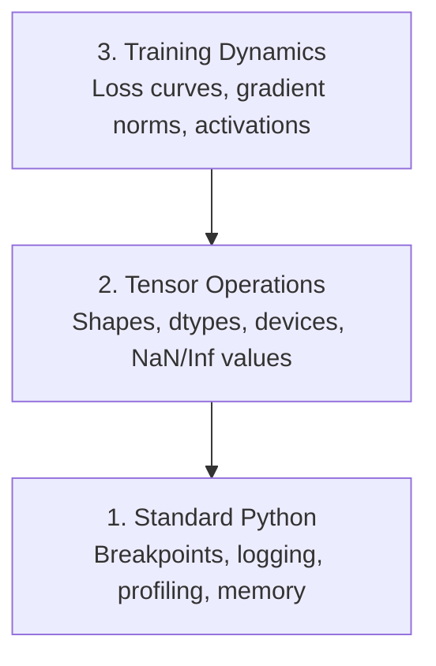

# Debugging and Profiling | 调试与性能分析

> The worst AI bugs don't crash. They train silently on garbage and report a beautiful loss curve.

**Type:** Build
**Language:** Python
**Prerequisites:** Lesson 1 (Dev Environment), basic PyTorch familiarity
**Time:** ~60 minutes

## Learning Objectives | 学习目标

- Use conditional `breakpoint()` and `debug_print` to inspect tensor shapes, dtypes, and NaN values mid-training
- Profile training loops with `cProfile`, `line_profiler`, and `tracemalloc` to find bottlenecks
- Detect common AI bugs: shape mismatches, NaN loss, data leakage, and wrong-device tensors
- Set up TensorBoard to visualize loss curves, weight histograms, and gradient distributions

> **【中文解读】**
> AI 代码的 bug 和普通代码不同：它不会崩溃报错，而是默默用错误数据训练出一个毫无用处的模型。本章教你如何调试张量形状、检测 NaN、分析性能瓶颈，以及用 TensorBoard 可视化训练过程。

> **【拓展：AI 调试为什么特别难？】**
> 传统 Web 开发的 bug 通常有明确的错误栈。但 AI 的 bug 是"静默失败"——模型在错误数据上训练 8 小时，loss 看起来正常，但最终预测全是垃圾。常见原因：张量形状不匹配、NaN 悄悄出现、数据泄漏、张量在错误的设备上。

## The Problem | 问题描述

AI code fails differently than regular code. A web app crashes with a stack trace. A misconfigured training loop runs for 8 hours, burns $200 in GPU time, and produces a model that predicts the mean of every input. The code never errored. The bug was a tensor on the wrong device, a forgotten `.detach()`, or labels leaking into features.

You need debugging tools that catch these silent failures before they waste your time and compute.

> **【中文解读】**
> AI 调试最难的地方在于"静默失败"：代码不报错，但训练结果完全错误。比如张量在 CPU 而不是 GPU 上、忘记 `.detach()` 导致梯度泄漏、标签混入特征——这些 bug 都不会触发异常，但会让模型输出垃圾。

## The Concept | 核心概念

AI debugging operates at three levels:



Most people jump straight to level 3 (staring at TensorBoard). But 80% of AI bugs live at levels 1 and 2.

> **【中文解读】**
> AI 调试分三个层次：第一层是标准 Python 调试（断点、日志、内存分析）；第二层是张量操作检查（形状、数据类型、设备、NaN 值）；第三层是训练动态观察（loss 曲线、梯度分布、激活值）。大多数人直接看 TensorBoard，但 80% 的 bug 其实在前两层就能发现。

## Build It | 动手实现

### Part 1: Print Debugging (Yes, It Works)

Print debugging gets dismissed. It shouldn't. For tensor code, a targeted print statement beats stepping through a debugger because you need to see shapes, dtypes, and value ranges all at once.

```python
def debug_print(name, tensor):
    print(f"{name}: shape={tensor.shape}, dtype={tensor.dtype}, "
          f"device={tensor.device}, "  # 张量在 CPU 还是 GPU 上？
          f"min={tensor.min().item():.4f}, max={tensor.max().item():.4f}, "
          f"mean={tensor.mean().item():.4f}, "
          f"has_nan={tensor.isnan().any().item()}")  # 检测是否有 NaN 值
```

Call this after every suspicious operation. When the bug is found, remove the prints. Simple.

### Part 2: Python Debugger (pdb and breakpoint)

The built-in debugger is underrated for AI work. Drop `breakpoint()` into your training loop and inspect tensors interactively.

> **【中文解读】**
> `breakpoint()` 是条件断点的最佳方式。在训练循环中设置触发条件（如 loss 突然变大或出现 NaN），程序只在异常时暂停。这在万步训练中至关重要——你不可能逐步调试每一步。进入调试器后，用 `p` 命令检查张量形状、值范围和梯度。

```python
def training_step(model, batch, criterion, optimizer):
    inputs, labels = batch
    outputs = model(inputs)
    loss = criterion(outputs, labels)

    if loss.item() > 100 or torch.isnan(loss):  # loss 异常大或为 NaN 时触发断点
        breakpoint()  # 进入交互式调试器

    loss.backward()
    optimizer.step()
```

When the debugger drops you in, useful commands:

- `p outputs.shape` to check shapes
- `p loss.item()` to see the loss value
- `p torch.isnan(outputs).sum()` to count NaNs
- `p model.fc1.weight.grad` to check gradients
- `c` to continue, `q` to quit

This is conditional debugging. You only stop when something looks wrong. For a 10,000-step training run, that matters.

### Part 3: Python Logging

Replace print statements with logging when your debugging goes beyond a quick check.

```python
import logging

logging.basicConfig(
    level=logging.INFO,
    format="%(asctime)s [%(levelname)s] %(message)s",  # 带时间戳和级别的格式
    handlers=[
        logging.FileHandler("training.log"),  # 输出到文件
        logging.StreamHandler()  # 同时输出到终端
    ]
)
logger = logging.getLogger(__name__)

logger.info("Starting training: lr=%.4f, batch_size=%d", lr, batch_size)
logger.warning("Loss spike detected: %.4f at step %d", loss.item(), step)  # 警告级别
logger.error("NaN loss at step %d, stopping", step)  # 错误级别
```

> **【中文解读】**
> 日志比 print 强大得多：自动加时间戳、分级别（INFO/WARNING/ERROR）、同时写入文件和终端。凌晨 3 点训练崩溃时，你需要的是日志文件而不是已滚动的终端输出。

Logging gives you timestamps, severity levels, and file output. When a training run fails at 3 AM, you want a log file, not terminal output that scrolled off screen.

### Part 4: Timing Code Sections

Knowing where time goes is the first step to optimization.

```python
import time

class Timer:
    def __init__(self, name=""):
        self.name = name

    def __enter__(self):
        self.start = time.perf_counter()  # 高精度计时器
        return self

    def __exit__(self, *args):
        elapsed = time.perf_counter() - self.start
        print(f"[{self.name}] {elapsed:.4f}s")  # 打印耗时

with Timer("data loading"):  # 计时数据加载
    batch = next(dataloader_iter)

with Timer("forward pass"):  # 计时前向传播
    outputs = model(batch)

with Timer("backward pass"):  # 计时反向传播
    loss.backward()
```

Common finding: data loading takes 60% of training time. The fix is `num_workers > 0` in your DataLoader, not a faster GPU.

> **【中文解读】**
> 性能优化的第一步是找到瓶颈。上面的 `Timer` 类用 Python 上下文管理器精确计时每个步骤。最常见的发现是数据加载占 60% 的训练时间——解决方案不是买更贵的 GPU，而是设置 DataLoader 的 `num_workers > 0`。

> **【拓展：数据加载瓶颈是 AI 训练的头号性能杀手】**
> 在工业界，GPU 利用率低于 80% 的头号原因是数据加载太慢，GPU 在等数据。解决方案包括：增加 DataLoader 的 `num_workers`（通常设为 4-8）、使用 `pin_memory=True` 加速 CPU-GPU 传输、使用 `prefetch_factor` 预取数据。Google 内部的 TPU 训练管线用了专门的数据流水线优化，确保 TPU 永远不用等数据。

### Part 5: cProfile and line_profiler

When you need more than manual timers:

```bash
python -m cProfile -s cumtime train.py  # 按累计时间排序的性能分析
```

This shows every function call sorted by cumulative time. For line-by-line profiling:

```bash
pip install line_profiler
```

```python
@profile  # line_profiler 装饰器，逐行统计耗时
def train_step(model, data, target):
    output = model(data)
    loss = F.cross_entropy(output, target)
    loss.backward()
    return loss

# Run with: kernprof -l -v train.py  运行逐行性能分析
```

### Part 6: Memory Profiling

> **【中文解读】**
> 内存分析分 CPU 和 GPU 两部分。CPU 用 `tracemalloc` 找到分配最多内存的代码行，GPU 用 `torch.cuda.memory_summary()` 查看显存使用。OOM（Out of Memory）是 AI 训练最常见的错误之一——先减 batch size，再尝试混合精度训练。

#### CPU Memory with tracemalloc

```python
import tracemalloc

tracemalloc.start()  # 开始跟踪内存分配

# your code here
model = build_model()
data = load_dataset()

snapshot = tracemalloc.take_snapshot()  # 拍摄内存快照
top_stats = snapshot.statistics("lineno")  # 按代码行统计内存
for stat in top_stats[:10]:
    print(stat)
```

#### CPU Memory with memory_profiler

```bash
pip install memory_profiler
```

```python
from memory_profiler import profile

@profile  # 逐行分析内存使用
def load_data():
    raw = read_csv("data.csv")       # watch memory jump here  观察内存跳变
    processed = preprocess(raw)       # and here  数据预处理也会增加内存
    return processed
```

Run with `python -m memory_profiler your_script.py` to see line-by-line memory usage.

#### GPU Memory with PyTorch

```python
import torch

if torch.cuda.is_available():
    print(torch.cuda.memory_summary())  # GPU 显存完整报告

    print(f"Allocated: {torch.cuda.memory_allocated() / 1e9:.2f} GB")  # 已分配的显存
    print(f"Cached: {torch.cuda.memory_reserved() / 1e9:.2f} GB")  # 缓存的显存
```

When you hit OOM (Out of Memory):

1. Reduce batch size (first thing to try, always)
2. Use `torch.cuda.empty_cache()` to free cached memory
3. Use `del tensor` followed by `torch.cuda.empty_cache()` for large intermediates
4. Use mixed precision (`torch.cuda.amp`) to halve memory usage
5. Use gradient checkpointing for very deep models

### Part 7: Common AI Bugs and How to Catch Them

> **【中文解读】**
> 这是本章最实用的部分。四种最常见的 AI bug：形状不匹配（tensor 形状对不上）、NaN loss（数值爆炸）、数据泄漏（训练集和测试集有重叠）、设备错误（CPU 和 GPU 混用）。每种 bug 都有对应的检测函数，可以在训练前和训练中快速排查。

#### Shape Mismatch

The most frequent bug. A tensor has shape `[batch, features]` when the model expects `[batch, channels, height, width]`.

```python
def check_shapes(model, sample_input):
    print(f"Input: {sample_input.shape}")  # 打印输入形状
    hooks = []

    def make_hook(name):
        def hook(module, inp, out):
            in_shape = inp[0].shape if isinstance(inp, tuple) else inp.shape
            out_shape = out.shape if hasattr(out, "shape") else type(out)
            print(f"  {name}: {in_shape} -> {out_shape}")  # 打印每层的输入输出形状
        return hook

    for name, module in model.named_modules():
        hooks.append(module.register_forward_hook(make_hook(name)))  # 注册钩子函数

    with torch.no_grad():  # 不计算梯度，仅检查形状
        model(sample_input)

    for h in hooks:
        h.remove()  # 清理钩子
```

Run this once with a sample batch. It maps every shape transformation in your model.

#### NaN Loss

NaN loss means something exploded. Common causes:

> **【拓展：NaN 在大模型训练中的灾难性影响】**
> 在 LLM 训练中，NaN 一旦出现在梯度中，就会通过反向传播扩散到所有参数，导致整个模型不可恢复。GPT-3 训练论文中提到，他们使用梯度裁剪（gradient clipping）和学习率预热（warmup）来防止 NaN。一旦检测到 NaN，通常的做法是回退到最近的检查点重新开始，而不是尝试修复。这会浪费数十小时的 GPU 计算时间。

- Learning rate too high
- Division by zero in custom loss
- Log of zero or negative number
- Exploding gradients in RNNs

```python
def detect_nan(model, loss, step):
    if torch.isnan(loss):  # 检测 loss 是否为 NaN
        print(f"NaN loss at step {step}")
        for name, param in model.named_parameters():
            if param.grad is not None:
                if torch.isnan(param.grad).any():  # 检测梯度中的 NaN
                    print(f"  NaN gradient in {name}")
                if torch.isinf(param.grad).any():  # 检测梯度中的 Inf
                    print(f"  Inf gradient in {name}")
        return True
    return False
```

#### Data Leakage

Your model gets 99% accuracy on the test set. Sounds great. It's a bug.

```python
def check_data_leakage(train_set, test_set, id_column="id"):
    train_ids = set(train_set[id_column].tolist())  # 训练集 ID 集合
    test_ids = set(test_set[id_column].tolist())  # 测试集 ID 集合
    overlap = train_ids & test_ids  # 取交集
    if overlap:
        print(f"DATA LEAKAGE: {len(overlap)} samples in both train and test")  # 发现重叠！
        return True
    return False
```

Also check for temporal leakage: using future data to predict the past. Sort by timestamp before splitting.

#### Wrong Device

Tensors on different devices (CPU vs GPU) cause runtime errors. But sometimes a tensor silently stays on CPU while everything else is on GPU, and training just runs slowly.

```python
def check_devices(model, *tensors):
    model_device = next(model.parameters()).device  # 获取模型所在设备
    print(f"Model device: {model_device}")
    for i, t in enumerate(tensors):
        if t.device != model_device:  # 检查张量和模型是否在同一设备
            print(f"  WARNING: tensor {i} on {t.device}, model on {model_device}")
```

### Part 8: TensorBoard Basics

TensorBoard shows you what's happening inside training over time.

```bash
pip install tensorboard  # 安装 TensorBoard
```

```python
from torch.utils.tensorboard import SummaryWriter

writer = SummaryWriter("runs/experiment_1")  # 创建日志写入器

for step in range(num_steps):
    loss = train_step(model, batch)

    writer.add_scalar("loss/train", loss.item(), step)  # 记录训练 loss
    writer.add_scalar("lr", optimizer.param_groups[0]["lr"], step)  # 记录学习率

    if step % 100 == 0:
        for name, param in model.named_parameters():
            writer.add_histogram(f"weights/{name}", param, step)  # 记录权重分布
            if param.grad is not None:
                writer.add_histogram(f"grads/{name}", param.grad, step)  # 记录梯度分布

writer.close()
```

Launch it:

```bash
tensorboard --logdir=runs  # 启动 TensorBoard 可视化服务
```

What to look for:

- **Loss not decreasing**: Learning rate too low, or model architecture issue
- **Loss oscillating wildly**: Learning rate too high
- **Loss goes to NaN**: Numerical instability (see NaN section above)
- **Train loss decreasing, val loss increasing**: Overfitting
- **Weight histograms collapsing to zero**: Vanishing gradients
- **Gradient histograms exploding**: Need gradient clipping

> **【中文解读】**
> TensorBoard 是训练可视化的标准工具。关键观察点：loss 不降（学习率太低或模型架构有问题）、loss 剧烈震荡（学习率太高）、loss 变 NaN（数值不稳定）、训练 loss 降但验证 loss 升（过拟合）、权重直方图趋零（梯度消失）、梯度直方图爆炸（需要梯度裁剪）。

> **【拓展：Weights & Biases 与 TensorBoard 的对比】**
> TensorBoard 是 Google 开源的训练可视化工具，适合个人和小团队。Weights & Biases (W&B) 是商业工具，增加了实验对比、团队协作、超参数搜索等功能。在 OpenAI、Anthropic 等公司，W&B 是标准实验追踪平台。一个典型的大型实验会追踪数千个指标：loss、学习率、梯度范数、各层权重分布、GPU 利用率等。这些数据帮助工程师在数百次实验中找到最佳超参数。

### Part 9: VS Code Debugger

For interactive debugging, configure VS Code with a `launch.json`:

```json
{
    "version": "0.2.0",
    "configurations": [
        {
            "name": "Debug Training",
            "type": "debugpy",
            "request": "launch",
            "program": "${file}",  // 调试当前打开的文件
            "console": "integratedTerminal",  // 使用集成终端
            "justMyCode": false  // 允许调试第三方库代码
        }
    ]
}
```

Set breakpoints by clicking the gutter. Use the Variables pane to inspect tensor properties. The Debug Console lets you run arbitrary Python expressions mid-execution.

Useful for stepping through data preprocessing pipelines where you want to see each transformation.

## Use It | 用框架实现

> **【中文解读】**
> 实践中的调试工作流分五步：训练前用 `check_shapes` 验证维度；前 10 步用 `debug_print` 检查张量值；训练中用 TensorBoard 监控；出问题时用 `breakpoint()` 交互调试；性能瓶颈用计时器和内存分析器定位。这个流程能捕获绝大多数 AI bug。

Here's the debugging workflow that catches most AI bugs:

1. **Before training**: Run `check_shapes` with a sample batch. Verify input and output dimensions match expectations.
2. **First 10 steps**: Use `debug_print` on loss, outputs, and gradients. Confirm nothing is NaN and values are in reasonable ranges.
3. **During training**: Log loss, learning rate, and gradient norms. Use TensorBoard for visualization.
4. **When something breaks**: Drop `breakpoint()` at the failure point. Inspect tensors interactively.
5. **For performance**: Time your data loading vs forward vs backward pass. Profile memory if you're near OOM.

## Ship It | 产出物

Run the debugging toolkit script:

```bash
python phases/00-setup-and-tooling/12-debugging-and-profiling/code/debug_tools.py
```

See `outputs/prompt-debug-ai-code.md` for a prompt that helps diagnose AI-specific bugs.

## Exercises | 练习题

1. Run `debug_tools.py` and read through each section's output. Modify the dummy model to introduce a NaN (hint: divide by zero in the forward pass) and watch the detector catch it.
   运行调试工具脚本，修改模型引入 NaN，观察检测器如何捕获它
2. Profile a training loop with `cProfile` and identify the slowest function.
   用 cProfile 分析训练循环，找出最慢的函数
3. Use `tracemalloc` to find which line in your data loading pipeline allocates the most memory.
   用 tracemalloc 找出数据加载管线中哪一行分配了最多内存
4. Set up TensorBoard for a simple training run and identify whether the model is overfitting.
   设置 TensorBoard 监控训练过程，判断模型是否过拟合
5. Use `breakpoint()` inside a training loop. Practice inspecting tensor shapes, devices, and gradient values from the debugger prompt.
   在训练循环中使用 breakpoint()，练习检查张量形状、设备和梯度值
