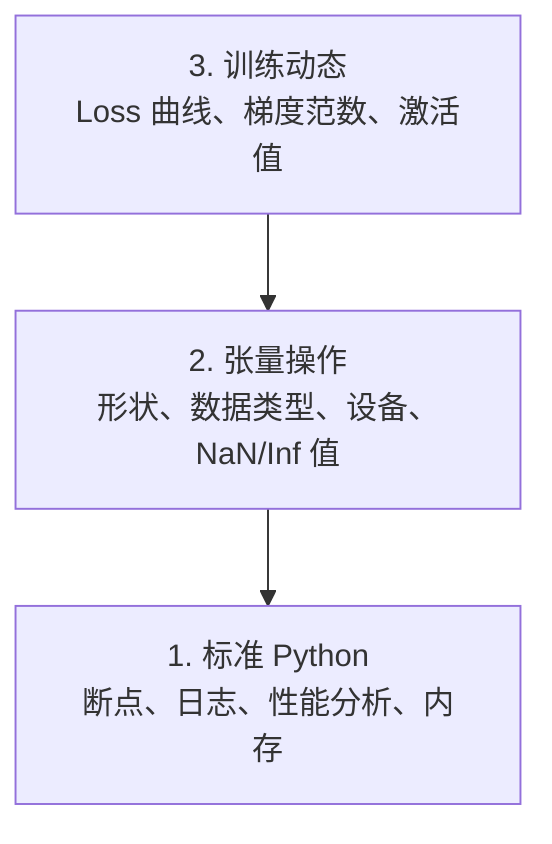

# 调试与性能分析

> 最糟糕的 AI bug 不会崩溃。它们在垃圾数据上默默训练，然后报告一条漂亮的 loss 曲线。

**类型：** 动手实践
**语言：** Python
**前置条件：** Lesson 1（开发环境），基本 PyTorch 熟悉度
**预计用时：** 约 60 分钟

## 学习目标

- 使用条件 `breakpoint()` 和 `debug_print` 在训练过程中检查张量形状、数据类型和 NaN 值
- 使用 `cProfile`、`line_profiler` 和 `tracemalloc` 分析训练循环，找到性能瓶颈
- 检测常见 AI bug：形状不匹配、NaN loss、数据泄漏和设备错误
- 设置 TensorBoard 可视化 loss 曲线、权重直方图和梯度分布

> **【中文解读】**
> AI 代码的 bug 和普通代码不同：它不会崩溃报错，而是默默用错误数据训练出一个毫无用处的模型。本章教你如何调试张量形状、检测 NaN、分析性能瓶颈，以及用 TensorBoard 可视化训练过程。

> **【拓展：AI 调试为什么特别难？】**
> 传统 Web 开发的 bug 通常有明确的错误栈。但 AI 的 bug 是"静默失败"——模型在错误数据上训练 8 小时，loss 看起来正常，但最终预测全是垃圾。常见原因：张量形状不匹配、NaN 悄悄出现、数据泄漏、张量在错误的设备上。

## 问题引入

AI 代码的失败方式与普通代码不同。Web 应用崩溃时有堆栈跟踪。而配置错误的训练循环运行 8 小时、烧掉 $200 的 GPU 时间，产出一个对每个输入都预测均值的模型。代码从未报错。bug 可能是张量在错误的设备上、忘记 `.detach()`、或标签泄漏到特征中。

你需要能在静默失败浪费你的时间和计算资源之前捕获它们的调试工具。

> **【中文解读】**
> AI 调试最难的地方在于"静默失败"：代码不报错，但训练结果完全错误。比如张量在 CPU 而不是 GPU 上、忘记 `.detach()` 导致梯度泄漏、标签混入特征——这些 bug 都不会触发异常，但会让模型输出垃圾。

## 核心概念

AI 调试在三个层面运作：



大多数人直接跳到第 3 层（盯着 TensorBoard 看）。但 80% 的 AI bug 存在于第 1 层和第 2 层。

> **【中文解读】**
> AI 调试分三个层次：第一层是标准 Python 调试（断点、日志、内存分析）；第二层是张量操作检查（形状、数据类型、设备、NaN 值）；第三层是训练动态观察（loss 曲线、梯度分布、激活值）。大多数人直接看 TensorBoard，但 80% 的 bug 其实在前两层就能发现。

## 动手实现

### 第 1 部分：打印调试（是的，它有效）

打印调试常被看不起。但它不应该被忽视。对于张量代码，有针对性的 print 语句胜过逐步调试，因为你需要同时查看形状、数据类型和值范围。

```python
def debug_print(name, tensor):
    print(f"{name}: shape={tensor.shape}, dtype={tensor.dtype}, "
          f"device={tensor.device}, "  # 张量在 CPU 还是 GPU 上？
          f"min={tensor.min().item():.4f}, max={tensor.max().item():.4f}, "
          f"mean={tensor.mean().item():.4f}, "
          f"has_nan={tensor.isnan().any().item()}")  # 检测是否有 NaN 值
```

在每个可疑操作后调用它。找到 bug 后，删除打印。简单有效。

### 第 2 部分：Python 调试器（pdb 和 breakpoint）

内置调试器在 AI 工作中被低估了。在训练循环中插入 `breakpoint()`，交互式检查张量。

> **【中文解读】**
> `breakpoint()` 是条件断点的最佳方式。在训练循环中设置触发条件（如 loss 突然变大或出现 NaN），程序只在异常时暂停。这在万步训练中至关重要——你不可能逐步调试每一步。进入调试器后，用 `p` 命令检查张量形状、值范围和梯度。

```python
def training_step(model, batch, criterion, optimizer):
    inputs, labels = batch
    outputs = model(inputs)
    loss = criterion(outputs, labels)

    if loss.item() > 100 or torch.isnan(loss):  # loss 异常大或为 NaN 时触发断点
        breakpoint()  # 进入交互式调试器

    loss.backward()
    optimizer.step()
```

调试器进入后，有用的命令：

- `p outputs.shape` 检查形状
- `p loss.item()` 查看 loss 值
- `p torch.isnan(outputs).sum()` 统计 NaN 数量
- `p model.fc1.weight.grad` 检查梯度
- `c` 继续，`q` 退出

这就是条件调试。只在看起来有问题时才停下来。对于 10,000 步的训练运行，这很重要。

### 第 3 部分：Python 日志

当调试超越快速检查时，用日志替代 print 语句。

```python
import logging

logging.basicConfig(
    level=logging.INFO,
    format="%(asctime)s [%(levelname)s] %(message)s",  # 带时间戳和级别的格式
    handlers=[
        logging.FileHandler("training.log"),  # 输出到文件
        logging.StreamHandler()  # 同时输出到终端
    ]
)
logger = logging.getLogger(__name__)

logger.info("开始训练: lr=%.4f, batch_size=%d", lr, batch_size)
logger.warning("检测到 loss 激增: %.4f 在第 %d 步", loss.item(), step)  # 警告级别
logger.error("第 %d 步出现 NaN loss，停止训练", step)  # 错误级别
```

> **【中文解读】**
> 日志比 print 强大得多：自动加时间戳、分级别（INFO/WARNING/ERROR）、同时写入文件和终端。凌晨 3 点训练崩溃时，你需要的是日志文件而不是已滚动的终端输出。

日志给你时间戳、严重级别和文件输出。当训练在凌晨 3 点失败时，你需要的是日志文件，而不是已经滚出屏幕的终端输出。

### 第 4 部分：代码段计时

知道时间花在哪里是优化的第一步。

```python
import time

class Timer:
    def __init__(self, name=""):
        self.name = name

    def __enter__(self):
        self.start = time.perf_counter()  # 高精度计时器
        return self

    def __exit__(self, *args):
        elapsed = time.perf_counter() - self.start
        print(f"[{self.name}] {elapsed:.4f}s")  # 打印耗时

with Timer("数据加载"):  # 计时数据加载
    batch = next(dataloader_iter)

with Timer("前向传播"):  # 计时前向传播
    outputs = model(batch)

with Timer("反向传播"):  # 计时反向传播
    loss.backward()
```

常见发现：数据加载占训练时间的 60%。解决方案是设置 DataLoader 的 `num_workers > 0`，而不是买更快的 GPU。

> **【中文解读】**
> 性能优化的第一步是找到瓶颈。上面的 `Timer` 类用 Python 上下文管理器精确计时每个步骤。最常见的发现是数据加载占 60% 的训练时间——解决方案不是买更贵的 GPU，而是设置 DataLoader 的 `num_workers > 0`。

> **【拓展：数据加载瓶颈是 AI 训练的头号性能杀手】**
> 在工业界，GPU 利用率低于 80% 的头号原因是数据加载太慢，GPU 在等数据。解决方案包括：增加 DataLoader 的 `num_workers`（通常设为 4-8）、使用 `pin_memory=True` 加速 CPU-GPU 传输、使用 `prefetch_factor` 预取数据。Google 内部的 TPU 训练管线用了专门的数据流水线优化，确保 TPU 永远不用等数据。

### 第 5 部分：cProfile 和 line_profiler

当你需要超越手动计时器：

```bash
python -m cProfile -s cumtime train.py  # 按累计时间排序的性能分析
```

这显示每个函数调用并按累计时间排序。逐行性能分析：

```bash
pip install line_profiler
```

```python
@profile  # line_profiler 装饰器，逐行统计耗时
def train_step(model, data, target):
    output = model(data)
    loss = F.cross_entropy(output, target)
    loss.backward()
    return loss

# 运行：kernprof -l -v train.py
```

### 第 6 部分：内存分析

> **【中文解读】**
> 内存分析分 CPU 和 GPU 两部分。CPU 用 `tracemalloc` 找到分配最多内存的代码行，GPU 用 `torch.cuda.memory_summary()` 查看显存使用。OOM（Out of Memory）是 AI 训练最常见的错误之一——先减 batch size，再尝试混合精度训练。

#### 使用 tracemalloc 分析 CPU 内存

```python
import tracemalloc

tracemalloc.start()  # 开始跟踪内存分配

# 你的代码
model = build_model()
data = load_dataset()

snapshot = tracemalloc.take_snapshot()  # 拍摄内存快照
top_stats = snapshot.statistics("lineno")  # 按代码行统计内存
for stat in top_stats[:10]:
    print(stat)
```

#### 使用 memory_profiler 分析 CPU 内存

```bash
pip install memory_profiler
```

```python
from memory_profiler import profile

@profile  # 逐行分析内存使用
def load_data():
    raw = read_csv("data.csv")       # 观察内存跳变
    processed = preprocess(raw)       # 数据预处理也会增加内存
    return processed
```

用 `python -m memory_profiler your_script.py` 运行，查看逐行内存使用。

#### 使用 PyTorch 分析 GPU 内存

```python
import torch

if torch.cuda.is_available():
    print(torch.cuda.memory_summary())  # GPU 显存完整报告

    print(f"已分配: {torch.cuda.memory_allocated() / 1e9:.2f} GB")  # 已分配的显存
    print(f"已缓存: {torch.cuda.memory_reserved() / 1e9:.2f} GB")  # 缓存的显存
```

遇到 OOM（内存不足）时：

1. 减小 batch size（首先尝试，永远如此）
2. 使用 `torch.cuda.empty_cache()` 释放缓存内存
3. 对大型中间变量使用 `del tensor` 后跟 `torch.cuda.empty_cache()`
4. 使用混合精度（`torch.cuda.amp`）将内存使用减半
5. 对非常深的模型使用梯度检查点

### 第 7 部分：常见 AI bug 及捕获方法

> **【中文解读】**
> 这是本章最实用的部分。四种最常见的 AI bug：形状不匹配（tensor 形状对不上）、NaN loss（数值爆炸）、数据泄漏（训练集和测试集有重叠）、设备错误（CPU 和 GPU 混用）。每种 bug 都有对应的检测函数，可以在训练前和训练中快速排查。

#### 形状不匹配

最常见的 bug。张量的形状是 `[batch, features]`，但模型期望 `[batch, channels, height, width]`。

```python
def check_shapes(model, sample_input):
    print(f"输入: {sample_input.shape}")  # 打印输入形状
    hooks = []

    def make_hook(name):
        def hook(module, inp, out):
            in_shape = inp[0].shape if isinstance(inp, tuple) else inp.shape
            out_shape = out.shape if hasattr(out, "shape") else type(out)
            print(f"  {name}: {in_shape} -> {out_shape}")  # 打印每层的输入输出形状
        return hook

    for name, module in model.named_modules():
        hooks.append(module.register_forward_hook(make_hook(name)))  # 注册钩子函数

    with torch.no_grad():  # 不计算梯度，仅检查形状
        model(sample_input)

    for h in hooks:
        h.remove()  # 清理钩子
```

用一个样本批次运行一次。它会映射模型中每个形状变换。

#### NaN Loss

NaN loss 说明有什么东西爆炸了。常见原因：

> **【拓展：NaN 在大模型训练中的灾难性影响】**
> 在 LLM 训练中，NaN 一旦出现在梯度中，就会通过反向传播扩散到所有参数，导致整个模型不可恢复。GPT-3 训练论文中提到，他们使用梯度裁剪（gradient clipping）和学习率预热（warmup）来防止 NaN。一旦检测到 NaN，通常的做法是回退到最近的检查点重新开始，而不是尝试修复。这会浪费数十小时的 GPU 计算时间。

- 学习率太高
- 自定义损失函数中除以零
- 对零或负数取对数
- RNN 中的梯度爆炸

```python
def detect_nan(model, loss, step):
    if torch.isnan(loss):  # 检测 loss 是否为 NaN
        print(f"第 {step} 步出现 NaN loss")
        for name, param in model.named_parameters():
            if param.grad is not None:
                if torch.isnan(param.grad).any():  # 检测梯度中的 NaN
                    print(f"  {name} 中有 NaN 梯度")
                if torch.isinf(param.grad).any():  # 检测梯度中的 Inf
                    print(f"  {name} 中有 Inf 梯度")
        return True
    return False
```

#### 数据泄漏

你的模型在测试集上获得了 99% 的准确率。听起来很棒。但这是个 bug。

```python
def check_data_leakage(train_set, test_set, id_column="id"):
    train_ids = set(train_set[id_column].tolist())  # 训练集 ID 集合
    test_ids = set(test_set[id_column].tolist())  # 测试集 ID 集合
    overlap = train_ids & test_ids  # 取交集
    if overlap:
        print(f"数据泄漏：{len(overlap)} 个样本同时出现在训练集和测试集中")  # 发现重叠！
        return True
    return False
```

还要检查时间泄漏：使用未来数据预测过去。拆分前按时间戳排序。

#### 设备错误

不同设备（CPU vs GPU）上的张量会导致运行时错误。但有时一个张量静默地留在 CPU 上，而其他一切都在 GPU 上，训练只是变得很慢。

```python
def check_devices(model, *tensors):
    model_device = next(model.parameters()).device  # 获取模型所在设备
    print(f"模型设备: {model_device}")
    for i, t in enumerate(tensors):
        if t.device != model_device:  # 检查张量和模型是否在同一设备
            print(f"  警告: 张量 {i} 在 {t.device} 上，模型在 {model_device} 上")
```

### 第 8 部分：TensorBoard 基础

TensorBoard 展示训练过程中随时间发生的变化。

```bash
pip install tensorboard  # 安装 TensorBoard
```

```python
from torch.utils.tensorboard import SummaryWriter

writer = SummaryWriter("runs/experiment_1")  # 创建日志写入器

for step in range(num_steps):
    loss = train_step(model, batch)

    writer.add_scalar("loss/train", loss.item(), step)  # 记录训练 loss
    writer.add_scalar("lr", optimizer.param_groups[0]["lr"], step)  # 记录学习率

    if step % 100 == 0:
        for name, param in model.named_parameters():
            writer.add_histogram(f"weights/{name}", param, step)  # 记录权重分布
            if param.grad is not None:
                writer.add_histogram(f"grads/{name}", param.grad, step)  # 记录梯度分布

writer.close()
```

启动：

```bash
tensorboard --logdir=runs  # 启动 TensorBoard 可视化服务
```

需要关注什么：

- **Loss 不降**：学习率太低，或模型架构问题
- **Loss 剧烈震荡**：学习率太高
- **Loss 变 NaN**：数值不稳定（见上面的 NaN 部分）
- **训练 loss 降但验证 loss 升**：过拟合
- **权重直方图趋零**：梯度消失
- **梯度直方图爆炸**：需要梯度裁剪

> **【中文解读】**
> TensorBoard 是训练可视化的标准工具。关键观察点：loss 不降（学习率太低或模型架构有问题）、loss 剧烈震荡（学习率太高）、loss 变 NaN（数值不稳定）、训练 loss 降但验证 loss 升（过拟合）、权重直方图趋零（梯度消失）、梯度直方图爆炸（需要梯度裁剪）。

> **【拓展：Weights & Biases 与 TensorBoard 的对比】**
> TensorBoard 是 Google 开源的训练可视化工具，适合个人和小团队。Weights & Biases (W&B) 是商业工具，增加了实验对比、团队协作、超参数搜索等功能。在 OpenAI、Anthropic 等公司，W&B 是标准实验追踪平台。一个典型的大型实验会追踪数千个指标：loss、学习率、梯度范数、各层权重分布、GPU 利用率等。这些数据帮助工程师在数百次实验中找到最佳超参数。

### 第 9 部分：VS Code 调试器

对于交互式调试，用 `launch.json` 配置 VS Code：

```json
{
    "version": "0.2.0",
    "configurations": [
        {
            "name": "调试训练",
            "type": "debugpy",
            "request": "launch",
            "program": "${file}",  // 调试当前打开的文件
            "console": "integratedTerminal",  // 使用集成终端
            "justMyCode": false  // 允许调试第三方库代码
        }
    ]
}
```

通过点击行号左侧的空白处设置断点。使用变量面板检查张量属性。调试控制台让你在执行过程中运行任意 Python 表达式。

适用于逐步调试数据预处理管线——你可以看到每个变换的效果。

## 用框架实现

> **【中文解读】**
> 实践中的调试工作流分五步：训练前用 `check_shapes` 验证维度；前 10 步用 `debug_print` 检查张量值；训练中用 TensorBoard 监控；出问题时用 `breakpoint()` 交互调试；性能瓶颈用计时器和内存分析器定位。这个流程能捕获绝大多数 AI bug。

以下是能捕获大多数 AI bug 的调试工作流：

1. **训练前**：用样本批次运行 `check_shapes`。验证输入和输出维度符合预期。
2. **前 10 步**：对 loss、输出和梯度使用 `debug_print`。确认没有 NaN 且值在合理范围内。
3. **训练中**：记录 loss、学习率和梯度范数。使用 TensorBoard 可视化。
4. **出问题时**：在失败点插入 `breakpoint()`。交互式检查张量。
5. **性能分析**：计时数据加载 vs 前向传播 vs 反向传播。接近 OOM 时分析内存。

## 产出物

运行调试工具脚本：

```bash
python phases/00-setup-and-tooling/12-debugging-and-profiling/code/debug_tools.py
```

参见 `outputs/prompt-debug-ai-code.md`，这是一个帮助诊断 AI 特有 bug 的 prompt。

## 练习题

1. 运行调试工具脚本，修改模型引入 NaN，观察检测器如何捕获它
2. 用 cProfile 分析训练循环，找出最慢的函数
3. 用 tracemalloc 找出数据加载管线中哪一行分配了最多内存
4. 设置 TensorBoard 监控训练过程，判断模型是否过拟合
5. 在训练循环中使用 breakpoint()，练习检查张量形状、设备和梯度值
