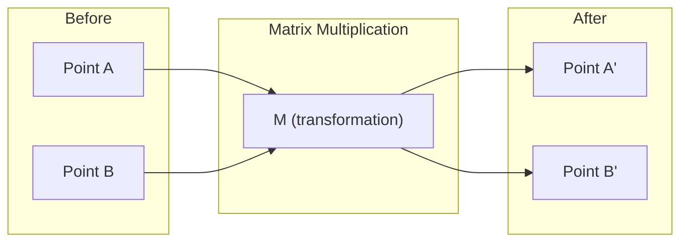
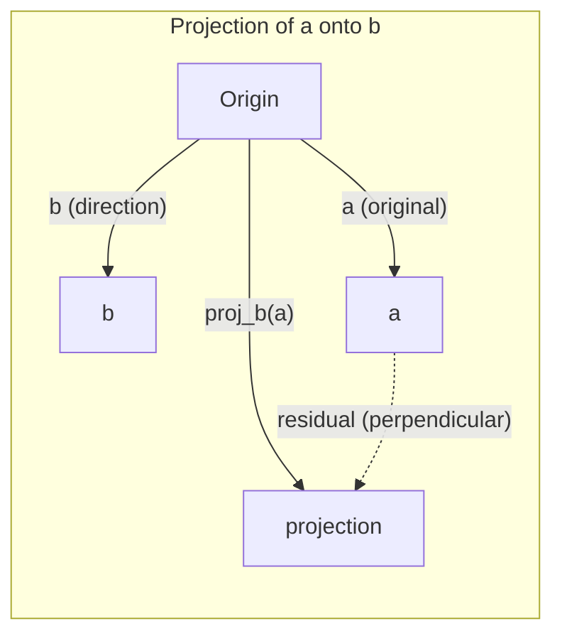

# Linear Algebra Intuition
# 线性代数直觉

> Every AI model is just matrix math wearing a fancy hat.
> 每个 AI 模型本质上就是矩阵运算穿了一件花哨的外衣。

**Type:** Learn | **类型:** 学习 | **Languages:** Python, Julia | **语言:** Python, Julia | **Prerequisites:** Phase 0 | **前置知识:** Phase 0 | **Time:** ~60 minutes | **时间:** ~60 分钟

## Learning Objectives | 学习目标

- Implement vector and matrix operations (addition, dot product, matrix multiply) from scratch in Python
  从零实现向量和矩阵运算（加法、点积、矩阵乘法）
- Explain geometrically what the dot product, projection, and Gram-Schmidt process do
  从几何角度解释点积、投影、Gram-Schmidt 过程的含义
- Determine linear independence, rank, and basis of a set of vectors using row reduction
  用行化简（高斯消元）判断线性无关性、秩和基
- Connect linear algebra concepts to their AI applications: embeddings, attention scores, and LoRA
  **将线性代数概念与 AI 应用对接：词嵌入、注意力分数、LoRA 微调**

## The Problem | 为什么必须学这个

Open any ML paper. Within the first page, you'll see vectors, matrices, dot products, and transformations. Without linear algebra intuition, these are just symbols. With it, you can see what a neural network is actually doing -- moving points around in space.

You don't need to be a mathematician. You need to see what these operations mean geometrically, then code them yourself.

> **【中文解读】** 翻开任何一篇机器学习论文，第一页就会出现向量、矩阵、点积、变换。没有线性代数直觉，这些只是符号。有了直觉，你就能"看穿"神经网络在做什么——在空间中移动点的位置。你不需要成为数学家，只需要理解这些操作的几何含义，然后自己写代码实现。

## The Concept | 核心概念

### Vectors Are Points (and Directions) | 向量是点（也是方向）

A vector is just a list of numbers. But those numbers mean something -- they're coordinates in space.

**2D vector [3, 2]:**

| x | y | Point |
|---|---|-------|
| 3 | 2 | The vector points from origin (0,0) to (3, 2) on the plane |

The vector has magnitude sqrt(3^2 + 2^2) = sqrt(13) and points up and to the right.

In AI, vectors represent everything:
- A word → a vector of 768 numbers (its "meaning" in embedding space)
- An image → a vector of millions of pixel values
- A user → a vector of preferences

> **【中文解读】** 向量就是一组数字，代表空间中的坐标。`[3, 2]` 表示从原点 (0,0) 指向 (3,2) 的箭头，长度 = √(3²+2²) = √13。
>
> **【拓展：向量在 AI 中的化身】**
> - **词嵌入 (Word Embedding)**：每个词变成 768 维向量。"国王"和"女王"的向量很接近，因为语义相关。这就是 Word2Vec、BERT、GPT 的底层表示。
> - **图片特征**：一张 224×224 的彩色图片 = 150,528 个数字的向量。CNN 本质上就是在逐步压缩这个向量。
> - **用户画像**：推荐系统把你的浏览/购买历史编码成一个偏好向量，然后找最相似的商品向量推荐给你。

### Matrices Are Transformations | 矩阵是变换

A matrix transforms one vector into another. It can rotate, scale, stretch, or project.



In AI, matrices ARE the model:
- Neural network weights → matrices that transform input into output
- Attention scores → matrices that decide what to focus on
- Embeddings → matrices that map words to vectors

> **【中文解读】** 矩阵就是一个"变换规则"：输入一个向量，输出另一个向量。可以旋转、缩放、拉伸、投影。
>
> **【拓展：神经网络就是矩阵乘法的嵌套】**
> 神经网络的一层 = `output = W × input + bias`
> - W 是权重矩阵（要学习的参数）
> - input 是输入向量（上一层的输出）
> - 一个 3 层网络就是 3 次矩阵乘法的串联
> - GPT-3 有 1750 亿个参数，本质上就是几百个巨型矩阵
> - **训练** = 用梯度下降不断调整这些矩阵里的数字

### The Dot Product Measures Similarity | 点积衡量相似度

The dot product of two vectors tells you how similar they are.

```
a · b = a₁×b₁ + a₂×b₂ + ... + aₙ×bₙ

Same direction:      a · b > 0  (similar)
Perpendicular:       a · b = 0  (unrelated)
Opposite direction:  a · b < 0  (dissimilar)
```

This is literally how search engines, recommendation systems, and RAG work -- find vectors with high dot products.

> **【中文解读】** 点积 = 对应分量相乘后求和。结果 > 0 方向相似，= 0 垂直无关，< 0 方向相反。
>
> **【拓展：点积是 AI 最核心的数学操作】**
> 1. **Transformer Attention**：`Attention(Q,K,V) = softmax(Q·K^T / √d)·V`
>    - Q(查询) 和 K(键) 的点积 = "我应该多关注这个词"的分数
>    - 这是 ChatGPT、BERT 等所有大模型的核心机制
> 2. **RAG 检索**：把用户问题变成向量，和所有文档向量做点积，找最相关的文档
> 3. **推荐系统**：用户偏好向量 · 商品特征向量 = 推荐分数
> 4. **余弦相似度** = 归一化后的点积，`cos(a,b) = a·b / (|a|×|b|)`，值域 [-1, 1]
>    比"欧氏距离"更好：只看方向不看长度，"喜欢"和"非常喜欢"语义相似

### Linear Independence | 线性无关

Vectors are linearly independent if no vector in the set can be written as a combination of the others. If v1, v2, v3 are independent, they span a 3D space. If one is a combination of the others, they only span a plane.

Why it matters for AI: your feature matrix should have linearly independent columns. If two features are perfectly correlated (linearly dependent), the model cannot distinguish their effects. This causes multicollinearity in regression -- the weight matrix becomes unstable, and small input changes produce wild output swings.

**Concrete example:**

```
v1 = [1, 0, 0]
v2 = [0, 1, 0]
v3 = [2, 1, 0]   # v3 = 2*v1 + v2
```

v1 and v2 are independent -- neither is a scalar multiple or combination of the other. But v3 = 2*v1 + v2, so {v1, v2, v3} is a dependent set. These three vectors all lie in the xy-plane. No matter how you combine them, you cannot reach [0, 0, 1]. You have three vectors but only two dimensions of freedom.

In a dataset: if feature_3 = 2*feature_1 + feature_2, adding feature_3 gives the model zero new information. Worse, it makes the normal equations singular -- there is no unique solution for the weights.

> **【中文解读】** 一组向量"线性无关" = 没有任何一个能被其他向量凑出来。
>
> 例：`[1,0,0]`, `[0,1,0]`, `[0,0,1]` 互相独立 ✓
>     `[1,0,0]`, `[0,1,0]`, `[2,1,0]` 不独立 ✗（第三个 = 2×第一个 + 第二个）
>
> **【拓展：多重共线性问题】**
> 在金融数据中很常见：比如"房价按美元计"和"房价按人民币计"是完全线性相关的，
> 同时放进模型会导致权重不稳定、模型过拟合。处理方法：删掉冗余特征，或用正则化（Ridge/Lasso）。

### Basis and Rank | 基与秩

A basis is a minimal set of linearly independent vectors that span the entire space. The number of basis vectors is the dimension of the space.

The standard basis for 3D space is {[1,0,0], [0,1,0], [0,0,1]}. But any three independent vectors in 3D form a valid basis. The choice of basis is a choice of coordinate system.

Rank of a matrix = number of linearly independent columns = number of linearly independent rows. If rank < min(rows, cols), the matrix is rank-deficient. This means:
- The system has infinitely many solutions (or none)
- Information is lost in the transformation
- The matrix cannot be inverted

| Situation | Rank | What it means for ML |
|-----------|------|---------------------|
| Full rank (rank = min(m, n)) | Maximum possible | Unique least-squares solution exists. Model is well-conditioned. |
| Rank deficient (rank < min(m, n)) | Below maximum | Features are redundant. Infinitely many weight solutions. Regularization needed. |
| Rank 1 | 1 | Every column is a scaled copy of one vector. All data lies on a line. |
| Near rank-deficient (small singular values) | Numerically low | Matrix is ill-conditioned. Tiny input noise causes large output changes. Use SVD truncation or ridge regression. |

> **【中文解读】**
> - **基 (Basis)**：描述一个空间所需的最少向量。3D 空间的标准基是 [1,0,0], [0,1,0], [0,0,1]。
> - **秩 (Rank)**：矩阵中真正独立的列数（或行数）。
>
> | 情况 | 含义 | ML 影响 |
> |------|------|---------|
> | 满秩 | 信息完整 | 有唯一解，模型稳定 |
> | 低秩 | 有冗余 | 无穷多解，需要正则化 |
> | 秩≈1 | 数据几乎全共线 | 所有信息在一个方向上 |
>
> **【拓展：LoRA —— 秩在 AI 中最惊艳的应用】**
> LoRA（Low-Rank Adaptation）微调大模型的核心洞察：
> - 原始权重矩阵 W 是 4096×4096（1600 万参数）
> - 微调时，权重更新 ΔW 实际上是"低秩"的（真正的变化只发生在少数几个方向上）
> - LoRA 把 ΔW 分解为两个小矩阵 A(4096×16) 和 B(16×4096)
> - 参数从 1600万 → 13万，减少 **99%**，但效果几乎不降
> - 这就是"秩"概念直接变现的例子

### Projection | 投影

Projecting vector **a** onto vector **b** gives the component of **a** in the direction of **b**:

```
proj_b(a) = (a dot b / b dot b) * b
```

The residual (a - proj_b(a)) is perpendicular to b. This orthogonal decomposition is the foundation of least-squares fitting.

Projection is everywhere in ML:
- Linear regression minimizes the distance from observations to the column space -- the solution IS a projection
- PCA projects data onto the directions of maximum variance
- Attention in transformers computes projections of queries onto keys



**Example:** a = [3, 4], b = [1, 0]

proj_b(a) = (3*1 + 4*0) / (1*1 + 0*0) * [1, 0] = 3 * [1, 0] = [3, 0]

The projection drops the y-component. This is dimensionality reduction in its simplest form -- throw away the directions you don't care about.

> **【中文解读】** 投影 = 向量在某个方向上的"影子"。
> `a=[3,4]` 投影到 x 轴 `[1,0]` 上 = `[3,0]`，就是把 y 分量扔掉了。
> 残差 = 原向量 - 投影 = `[0,4]`，与投影方向垂直。
>
> **【拓展：投影与降维的关系】**
> 投影是最朴素的"降维"——扔掉不关心的方向。PCA（主成分分析）是它的升级版：
> 不扔固定方向，而是自动找到"方差最大"（信息最多）的方向来投影。
> 把 1000 维数据投影到 50 维，保留 95% 以上的信息。这就是特征压缩的数学本质。

### Gram-Schmidt Process | Gram-Schmidt 正交化

Converting any set of independent vectors into an orthonormal basis. Orthonormal means every vector has length 1 and every pair is perpendicular.

The algorithm:
1. Take the first vector, normalize it
2. Take the second vector, subtract its projection onto the first, normalize
3. Take the third vector, subtract its projections onto all previous vectors, normalize
4. Repeat for remaining vectors

```
Input:  v1, v2, v3, ... (linearly independent)

u1 = v1 / |v1|

w2 = v2 - (v2 dot u1) * u1
u2 = w2 / |w2|

w3 = v3 - (v3 dot u1) * u1 - (v3 dot u2) * u2
u3 = w3 / |w3|

Output: u1, u2, u3, ... (orthonormal basis)
```

This is how QR decomposition works internally. Q is the orthonormal basis, R captures the projection coefficients. QR decomposition is used in:
- Solving linear systems (more stable than Gaussian elimination)
- Computing eigenvalues (QR algorithm)
- Least-squares regression (the standard numerical method)

> **【中文解读】** 把任意一组向量变成"互相垂直 + 长度为1"的标准正交基。
>
> 直觉：每个新向量先减去在已有方向上的"重合部分"（投影），只保留全新方向，再归一化。
> 就像搭积木——每一块都选一个全新的方向，不和之前的重叠。
>
> **【拓展：为什么"正交"这么重要？】**
> 正交基的计算最稳定。如果基向量之间有"重合"（不正交），计算误差会不断累积放大。
> QR 分解（Gram-Schmidt 的矩阵形式）是数值计算的基石：
> - NumPy 解方程底层用的就是 QR 分解
> - 特征值计算用的 QR 迭代算法
> - 最小二乘回归的标准数值解法

## Build It | 动手实现

### Step 1: Vectors from scratch (Python) | 第1步：从零实现向量

```python
class Vector:
    def __init__(self, components):
        self.components = list(components)
        self.dim = len(self.components)

    def __add__(self, other):
        return Vector([a + b for a, b in zip(self.components, other.components)])

    def __sub__(self, other):
        return Vector([a - b for a, b in zip(self.components, other.components)])

    def dot(self, other):
        # 点积：对应分量相乘后求和。AI 中最核心的相似度度量。
        return sum(a * b for a, b in zip(self.components, other.components))

    def magnitude(self):
        return sum(x**2 for x in self.components) ** 0.5

    def normalize(self):
        # 归一化：缩放到长度1。归一化后点积=余弦相似度。
        mag = self.magnitude()
        return Vector([x / mag for x in self.components])

    def cosine_similarity(self, other):
        # 余弦相似度：只看方向不看长度，值域[-1,1]
        return self.dot(other) / (self.magnitude() * other.magnitude())

    def __repr__(self):
        return f"Vector({self.components})"


a = Vector([1, 2, 3])
b = Vector([4, 5, 6])

print(f"a + b = {a + b}")
print(f"a · b = {a.dot(b)}")
print(f"|a| = {a.magnitude():.4f}")
print(f"cosine similarity = {a.cosine_similarity(b):.4f}")
```

### Step 2: Matrices from scratch (Python) | 第2步：从零实现矩阵

```python
class Matrix:
    def __init__(self, rows):
        self.rows = [list(row) for row in rows]
        self.shape = (len(self.rows), len(self.rows[0]))

    def __matmul__(self, other):
        # 矩阵乘法 = 神经网络一层的前向传播
        if isinstance(other, Vector):
            return Vector([
                sum(self.rows[i][j] * other.components[j] for j in range(self.shape[1]))
                for i in range(self.shape[0])
            ])
        rows = []
        for i in range(self.shape[0]):
            row = []
            for j in range(other.shape[1]):
                row.append(sum(
                    self.rows[i][k] * other.rows[k][j]
                    for k in range(self.shape[1])
                ))
            rows.append(row)
        return Matrix(rows)

    def transpose(self):
        return Matrix([
            [self.rows[j][i] for j in range(self.shape[0])]
            for i in range(self.shape[1])
        ])

    def __repr__(self):
        return f"Matrix({self.rows})"


rotation_90 = Matrix([[0, -1], [1, 0]])
point = Vector([3, 1])

rotated = rotation_90 @ point
print(f"Original: {point}")
print(f"Rotated 90°: {rotated}")
```

### Step 3: Why this matters for AI | 第3步：这和 AI 有什么关系

```python
import random

random.seed(42)
weights = Matrix([[random.gauss(0, 0.1) for _ in range(3)] for _ in range(2)])
input_vector = Vector([1.0, 0.5, -0.3])

output = weights @ input_vector
print(f"Input (3D): {input_vector}")
print(f"Output (2D): {output}")
print("This is what a neural network layer does -- matrix multiplication.")
# 矩阵乘法：3维输入 → 2维输出。这就是神经网络一层的全部计算。
# 一个真正的网络就是把很多这样的层串起来，每层都有一个权重矩阵。
```

### Step 4: Julia version | 第4步：Julia 版本

```julia
a = [1.0, 2.0, 3.0]
b = [4.0, 5.0, 6.0]

println("a + b = ", a + b)
println("a · b = ", a ⋅ b)       # Julia supports unicode operators
println("|a| = ", √(a ⋅ a))
println("cosine = ", (a ⋅ b) / (√(a ⋅ a) * √(b ⋅ b)))

# Matrix-vector multiplication
W = [0.1 -0.2 0.3; 0.4 0.5 -0.1]
x = [1.0, 0.5, -0.3]
println("Wx = ", W * x)
println("This is a neural network layer.")
```

### Step 5: Linear independence and projection from scratch (Python) | 第5步：线性无关性和投影

```python
def is_linearly_independent(vectors):
    # 高斯消元法：把向量排成矩阵，化简，看秩是否等于向量个数
    n = len(vectors)
    dim = len(vectors[0].components)
    mat = Matrix([v.components[:] for v in vectors])
    rows = [row[:] for row in mat.rows]
    rank = 0
    for col in range(dim):
        pivot = None
        for row in range(rank, len(rows)):
            if abs(rows[row][col]) > 1e-10:
                pivot = row
                break
        if pivot is None:
            continue
        rows[rank], rows[pivot] = rows[pivot], rows[rank]
        scale = rows[rank][col]
        rows[rank] = [x / scale for x in rows[rank]]
        for row in range(len(rows)):
            if row != rank and abs(rows[row][col]) > 1e-10:
                factor = rows[row][col]
                rows[row] = [rows[row][j] - factor * rows[rank][j] for j in range(dim)]
        rank += 1
    return rank == n


def project(a, b):
    # 投影：a 在 b 方向上的"影子"
    scalar = a.dot(b) / b.dot(b)
    return Vector([scalar * x for x in b.components])


def gram_schmidt(vectors):
    # 正交化：每个向量减去在已有方向上的投影，只保留新方向
    orthonormal = []
    for v in vectors:
        w = v
        for u in orthonormal:
            proj = project(w, u)
            w = w - proj
        if w.magnitude() < 1e-10:
            continue
        orthonormal.append(w.normalize())
    return orthonormal


v1 = Vector([1, 0, 0])
v2 = Vector([1, 1, 0])
v3 = Vector([1, 1, 1])
basis = gram_schmidt([v1, v2, v3])
for i, u in enumerate(basis):
    print(f"u{i+1} = {u}")
    print(f"  |u{i+1}| = {u.magnitude():.6f}")

print(f"u1 · u2 = {basis[0].dot(basis[1]):.6f}")
print(f"u1 · u3 = {basis[0].dot(basis[2]):.6f}")
print(f"u2 · u3 = {basis[1].dot(basis[2]):.6f}")
```

## Use It | 用框架实现（实战中你真正会用的方式）

Now the same thing with NumPy -- what you'll actually use in practice:
现在用 NumPy 做——实际工作中你用的就是这些：

```python
import numpy as np

a = np.array([1, 2, 3], dtype=float)
b = np.array([4, 5, 6], dtype=float)

print(f"a + b = {a + b}")
print(f"a · b = {np.dot(a, b)}")
print(f"|a| = {np.linalg.norm(a):.4f}")
print(f"cosine = {np.dot(a, b) / (np.linalg.norm(a) * np.linalg.norm(b)):.4f}")

W = np.random.randn(2, 3) * 0.1
x = np.array([1.0, 0.5, -0.3])
print(f"Wx = {W @ x}")
```

### Rank, Projection, and QR with NumPy | 秩、投影和 QR 分解

```python
import numpy as np

A = np.array([[1, 2], [2, 4]])
print(f"Rank: {np.linalg.matrix_rank(A)}")  # 秩=1，第2行是第1行的2倍

a = np.array([3, 4])
b = np.array([1, 0])
proj = (np.dot(a, b) / np.dot(b, b)) * b
print(f"Projection of {a} onto {b}: {proj}")

Q, R = np.linalg.qr(np.random.randn(3, 3))  # QR 分解 = Gram-Schmidt 的矩阵形式
print(f"Q is orthogonal: {np.allclose(Q @ Q.T, np.eye(3))}")  # Q 正交
print(f"R is upper triangular: {np.allclose(R, np.triu(R))}")  # R 上三角
```

### PyTorch -- Tensors Are Vectors with Autodiff | PyTorch：带自动求导的张量

```python
import torch

x = torch.randn(3, requires_grad=True)  # 3维向量，开启自动求导
y = torch.tensor([1.0, 0.0, 0.0])

similarity = torch.dot(x, y)  # 点积
similarity.backward()          # 自动求导！

print(f"x = {x.data}")
print(f"y = {y.data}")
print(f"dot product = {similarity.item():.4f}")
print(f"d(dot)/dx = {x.grad}")  # 梯度 = y 本身，因为 d(x·y)/dx = y
```

> **【拓展：自动求导的魔法】**
> PyTorch 的 `backward()` 自动算出了梯度 d(x·y)/dx = y。
> 神经网络训练 = 反复做：
> 1. 前向传播（矩阵乘法的串联）
> 2. 计算损失（标量）
> 3. 反向传播（`backward()` 自动求每个权重的梯度）
> 4. 更新权重（梯度下降）
> 第2-3步完全依赖"自动求导"，而自动求导的数学基础就是链式法则——下一课会讲。

The gradient of the dot product with respect to x is just y. PyTorch computed this automatically. Every operation in a neural network is built from operations like this -- matrix multiplies, dot products, projections -- and autodiff tracks gradients through all of them.

You just built from scratch what NumPy does in one line. Now you know what's happening under the hood.
你刚刚从零实现了 NumPy 一行代码做的事情。现在你知道底层发生了什么。

## Ship It | 产出物

This lesson produces:
- `outputs/prompt-linear-algebra-tutor.md` -- a prompt for AI assistants to teach linear algebra through geometric intuition

## Connections | 概念关联地图

Everything in this lesson connects to specific parts of modern AI:
本课每个概念都直接对应现代 AI 的某个组件：

| Concept 概念 | Where it shows up 在 AI 中的位置 |
|---------|------------------|
| Dot product 点积 | Attention scores in transformers, cosine similarity in RAG / Transformer 的注意力分数、RAG 的余弦相似度 |
| Matrix multiply 矩阵乘法 | Every neural network layer, every linear transformation / 神经网络的每一层 |
| Linear independence 线性无关 | Feature selection, avoiding multicollinearity / 特征选择、避免多重共线性 |
| Rank 秩 | Determining if a system is solvable, LoRA (low-rank adaptation) / 方程可解性判断、LoRA 微调 |
| Projection 投影 | Linear regression (projecting onto column space), PCA / 线性回归、PCA 降维 |
| Gram-Schmidt / QR | Numerical solvers, eigenvalue computation / 数值求解器、特征值计算 |
| Orthonormal basis 正交基 | Stable numerical computation, whitening transforms / 数值稳定计算、白化变换 |

LoRA deserves special mention. It fine-tunes large language models by decomposing weight updates into low-rank matrices. Instead of updating a 4096x4096 weight matrix (16M parameters), LoRA updates two matrices of size 4096x16 and 16x4096 (131K parameters). The rank-16 constraint means LoRA assumes the weight update lives in a 16-dimensional subspace of the full 4096-dimensional space. That is linear algebra doing real work.

> **【中文解读】LoRA 特别值得一提。** 它把大模型的微调过程分解为低秩矩阵运算。
> 原本要更新 4096×4096 的权重矩阵（1600万参数），
> LoRA 只更新 4096×16 和 16×4096 两个小矩阵（13万参数）。
> "秩=16"意味着：权重更新实际只发生在16个方向上，而不是完整的4096维空间。
> 这就是线性代数在 AI 中最赚钱的应用——让普通显卡也能微调大模型。

## Exercises | 练习题

1. Implement `Vector.angle_between(other)` that returns the angle in degrees between two vectors
   **实现计算两向量夹角的方法（返回角度）**
2. Create a 2D scaling matrix that doubles the x-coordinate and triples the y-coordinate, then apply it to the vector [1, 1]
   **创建一个 2D 缩放矩阵（x坐标翻倍，y坐标三倍），应用到向量 [1, 1]**
3. Given 5 random word-like vectors (dimension 50), find the two most similar using cosine similarity
   **给定5个随机50维"词向量"，用余弦相似度找最相似的2个**
4. Verify that the Gram-Schmidt output is truly orthonormal: check that every pair has dot product 0 and every vector has magnitude 1
   **验证 Gram-Schmidt 输出确实正交：任意两个点积=0，每个长度=1**
5. Create a 3x3 matrix with rank 2. Verify using the `rank()` method. Then explain what geometric object the columns span.
   **构造一个秩为2的3×3矩阵，验证秩，解释它的列向量张成什么几何体（答案：一个平面）**
6. Project the vector [1, 2, 3] onto [1, 1, 1]. What does the result represent geometrically?
   **把 [1,2,3] 投影到 [1,1,1] 上，几何含义是什么？（答案：在对角线方向上的分量）**

## Key Terms | 术语速查表

| Term 英文 | What people say 常见误解 | What it actually means 准确含义 |
|------|----------------|----------------------|
| Vector 向量 | "An arrow 一根箭头" | A list of numbers representing a point or direction in n-dimensional space / n维空间中的点或方向 |
| Matrix 矩阵 | "A table of numbers 一堆数字" | A transformation that maps vectors from one space to another / 把向量从一个空间映射到另一个空间的变换 |
| Dot product 点积 | "Multiply and sum 乘完加起来" | A measure of how aligned two vectors are -- the core of similarity search / 衡量对齐程度——相似度搜索的核心 |
| Embedding 嵌入 | "Some AI magic AI魔法" | A vector that represents the meaning of something (word, image, user) / 表示事物"意义"的向量 |
| Linear independence 线性无关 | "They don't overlap 不重叠" | No vector in the set can be written as a combination of the others / 没有向量能用其他向量凑出来 |
| Rank 秩 | "How many dimensions 几个维度" | The number of linearly independent columns (or rows) in a matrix / 独立列（行）的数量 |
| Projection 投影 | "The shadow 影子" | The component of one vector in the direction of another / 一个向量在另一个方向上的分量 |
| Basis 基 | "The coordinate axes 坐标轴" | A minimal set of independent vectors that span the space / 张成整个空间的最少独立向量 |
| Orthonormal 正交归一 | "Perpendicular unit vectors 垂直单位向量" | Vectors that are mutually perpendicular and each have length 1 / 互相垂直且长度各为1 |
