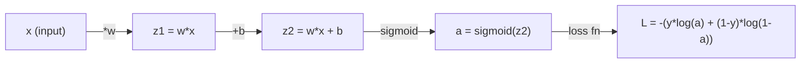
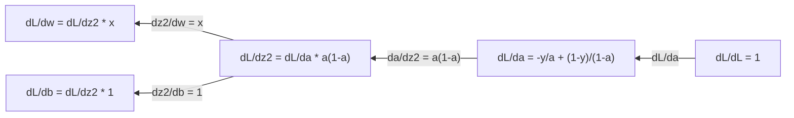
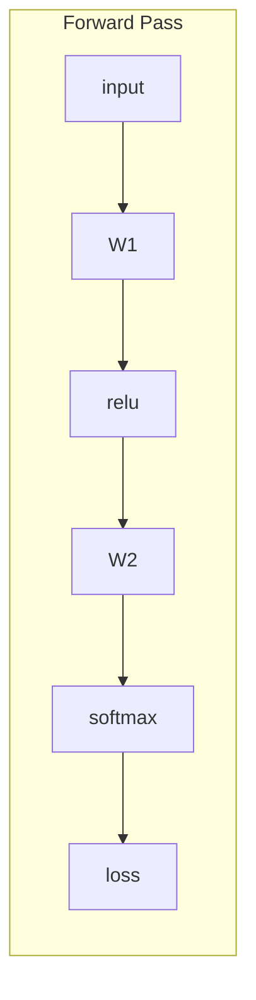
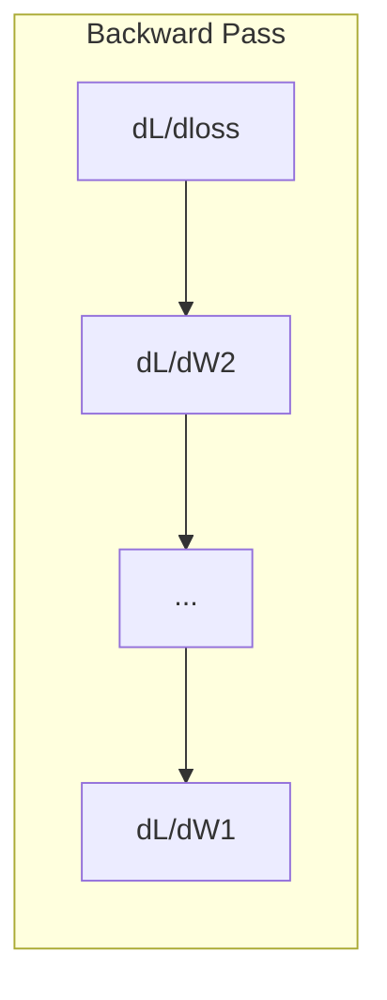

# Calculus for Machine Learning | 机器学习中的微积分

> Derivatives tell you which way is downhill. That is all a neural network needs to learn.

> 导数告诉你哪边是下坡方向——这就是神经网络学习所需的全部。

**Type:** Learn | **类型:** 学习
**Language:** Python | **语言:** Python
**Prerequisites:** Phase 1, Lessons 01-03 | **前置知识:** Phase 1, Lessons 01-03
**Time:** ~60 minutes | **时间:** ~60 分钟

## Learning Objectives | 学习目标

- Compute numerical and analytical derivatives for common ML functions (x^2, sigmoid, cross-entropy)
  计算常见 ML 函数（x^2、sigmoid、交叉熵）的数值导数和解析导数
- Implement gradient descent from scratch to minimize a loss function in 1D and 2D
  从零实现梯度下降，在 1D 和 2D 中最小化损失函数
- Derive the gradient of a linear regression model and train it via manual weight updates
  推导线性回归模型的梯度，并通过手动权重更新进行训练
- Explain the Hessian matrix, Taylor series approximations, and their connection to optimization methods
  解释 Hessian 矩阵、Taylor 级数近似及其与优化方法的联系

> **【中文解读】**
> 导数告诉你"往哪个方向走能让误差变小"。神经网络有数百万个参数，每个参数都是一个"旋钮"，微积分告诉你每个旋钮该往哪个方向调。梯度下降就是沿着导数的反方向一步步走到最小值。

> **【拓展：微积分与神经网络】**
> - **梯度下降**: 神经网络训练的核心算法——沿着梯度的反方向更新参数。
> - **SGD/Adam**: 都是梯度下降的变体，Adam 加入了动量和自适应学习率。
> - **学习率**: 梯度下降的步长。太大则跳过最小值，太小则收敛太慢。

## The Problem | 问题引入

> **【中文解读】** 神经网络有百万个权重（旋钮），训练就是找到每个旋钮该往哪个方向转。微积分告诉你答案：导数（梯度）= 每个权重对误差的影响方向和大小。没有微积分，训练就是随机试错；有了梯度，每次都朝正确方向调整。

## The Concept | 核心概念

> **【拓展：偏导数就是"只动一个旋钮看效果"]** 神经网络的损失函数 L(w1, w2, ..., wn) 有百万个变量。偏导数 ∂L/∂w_i 告诉你"只改 w_i 一个权重，损失变化多少"。梯度就是把所有偏导数组合成一个向量，指向"最陡的上坡方向"，所以沿负梯度走就是最快的下坡路。

### What is a derivative?

A derivative measures the rate of change. For a function y = f(x), the derivative f'(x) tells you: if you nudge x by a tiny amount, how much does y change?

> 导数衡量变化率。对于函数 y = f(x)，导数 f'(x) 告诉你：如果 x 微小变化，y 变化多少？

Geometrically, the derivative is the slope of the tangent line at a point.

> 几何上，导数是某一点切线的斜率。

**f(x) = x^2:**

| x | f(x) | f'(x) (slope) |
|---|------|---------------|
| 0 | 0    | 0 (flat, at the bottom) |
| 1 | 1    | 2 |
| 2 | 4    | 4 (tangent line slope at this point) |
| 3 | 9    | 6 |

At x=2, the slope is 4. If you move x a tiny bit to the right, y increases by about 4 times that amount. At x=0, the slope is 0. You are at the bottom of the bowl.

> 在 x=2 处，斜率为 4。如果你将 x 向右移动一点，y 大约增加该移动量的 4 倍。在 x=0 处，斜率为 0——你正处于"碗底"。

The formal definition:

```
f'(x) = lim   f(x + h) - f(x)
        h->0  -----------------
                     h
```

In code, you skip the limit and just use a very small h. That is the numerical derivative.

> 在代码中，跳过极限，直接用很小的 h 来近似。这就是数值导数。

### Partial derivatives: one variable at a time

Real functions have many inputs. A neural network loss depends on thousands of weights. A partial derivative holds all variables constant except one, then takes the derivative with respect to that one.

> 真实函数有多个输入。神经网络损失函数依赖数千个权重。偏导数保持其他变量不变，只对一个变量求导——这正好对应"只动一个旋钮看效果"的直觉。

```
f(x, y) = x^2 + 3xy + y^2

df/dx = 2x + 3y     (treat y as a constant)
df/dy = 3x + 2y     (treat x as a constant)
```

Each partial derivative answers: if I nudge just this one weight, how does the loss change?

> 每个偏导数回答：如果我只拨动这一个权重，损失变化多少？

### The gradient: vector of all partial derivatives

The gradient collects every partial derivative into one vector. For a function f(x, y, z), the gradient is:

> 梯度把所有偏导数收集成一个向量。对于函数 f(x, y, z)，梯度为：

```
grad f = [ df/dx, df/dy, df/dz ]
```

The gradient points in the direction of steepest ascent. To minimize a function, go in the opposite direction.

> 梯度指向最陡上升方向。要最小化函数，就沿相反方向走。

**Contour plot of f(x,y) = x^2 + y^2:**

The function forms a bowl shape with concentric circles as contour lines. The minimum is at (0, 0).

> 该函数形成一个碗状形状，等高线是同心圆。最小值在 (0, 0)。

| Point | grad f | -grad f (descent direction) |
|-------|--------|----------------------------|
| (1, 1) | [2, 2] (points uphill, away from minimum) | [-2, -2] (points downhill, toward minimum) |
| (0, 0) | [0, 0] (flat, at the minimum) | [0, 0] |

> 梯度方向指向最陡上坡，负梯度方向指向最陡下坡（即朝向最小值）。在最小值处梯度为零。

This is gradient descent in a picture. Compute the gradient, negate it, take a step.

> 这就是梯度下降的图示。计算梯度，取反，走一步。

### The connection to optimization

Training a neural network is optimization. You have a loss function L(w1, w2, ..., wn) that measures how wrong the model is. You want to minimize it.

> 训练神经网络就是优化。损失函数 L(w1, w2, ..., wn) 衡量模型有多"错"，你要最小化它。

```
Gradient descent update rule:

  w_new = w_old - learning_rate * dL/dw

For every weight:
  1. Compute the partial derivative of loss with respect to that weight
  2. Subtract a small multiple of it from the weight
  3. Repeat
```

> 梯度下降规则：新权重 = 旧权重 - 学习率 × 梯度。重复：1）计算每个权重的偏导数；2）从权重中减去它的一个小倍数；3）迭代数百万次。

The learning rate controls step size. Too big and you overshoot. Too small and you crawl.

> 学习率控制步长。太大则跳过最小值，太小则收敛太慢。

**Loss landscape (1D slice):**

The loss function L(w) forms a curve with peaks and valleys as the weight w varies.

> 损失函数 L(w) 随权重 w 变化形成带峰和谷的曲线。

| Feature | Description |
|---------|-------------|
| Global minimum | The lowest point on the entire curve -- the best solution |
| Local minimum | A valley that is lower than its neighbors but not the lowest overall |
| Slope | Gradient descent follows the slope downhill from any starting point |

> 全局最小值是整条曲线的最低点（最佳解）；局部最小值是邻居中较低但非全局最低的山谷；梯度下降从任意起点沿斜坡下行。

Gradient descent follows the slope downhill. It can get stuck in local minima, but in high-dimensional spaces (millions of weights) this is rarely a practical problem.

> 梯度下降沿坡下行。可能陷入局部最小值，但在高维空间中（百万级权重），这很少成为实际问题。

### Numerical vs analytical derivatives

There are two ways to compute a derivative.

> 计算导数有两种方法。

Analytical: apply calculus rules by hand. For f(x) = x^2, the derivative is f'(x) = 2x. Exact. Fast.

> 解析法：手动应用微积分规则。如 f(x) = x^2 的导数是 f'(x) = 2x。精确且快速。

Numerical: approximate using the definition. Compute f(x+h) and f(x-h) for a tiny h, then use the difference.

> 数值法：用定义近似。计算 f(x+h) 和 f(x-h)，用差值除以 2h。

```
Numerical (central difference):

f'(x) ~= f(x + h) - f(x - h)
          -----------------------
                  2h

h = 0.0001 works well in practice
```

Numerical derivatives are slower but work for any function. Analytical derivatives are fast but require you to derive the formula. Neural network frameworks use a third approach: automatic differentiation, which computes exact derivatives mechanically. You will see that in Phase 3.

> 数值导数较慢但适用于任何函数。解析导数快但需要手动推导。神经网络框架使用第三种方法：自动微分，机械地计算精确导数。

### Derivatives by hand for simple functions

These are the derivatives you will see over and over in ML.

> 这些是你将在 ML 中反复见到的导数。

```
Function        Derivative       Used in
--------        ----------       -------
f(x) = x^2     f'(x) = 2x      Loss functions (MSE)
f(x) = wx + b  f'(w) = x        Linear layer (gradient w.r.t. weight)
                f'(b) = 1        Linear layer (gradient w.r.t. bias)
                f'(x) = w        Linear layer (gradient w.r.t. input)
f(x) = e^x     f'(x) = e^x     Softmax, attention
f(x) = ln(x)   f'(x) = 1/x     Cross-entropy loss
f(x) = 1/(1+e^-x)  f'(x) = f(x)(1-f(x))   Sigmoid activation
```

For f(x) = x^2:

```
f(x) = x^2    f'(x) = 2x

  x    f(x)   f'(x)   meaning
  -2    4      -4      slope tilts left (decreasing)
  -1    1      -2      slope tilts left (decreasing)
   0    0       0      flat (minimum!)
   1    1       2      slope tilts right (increasing)
   2    4       4      slope tilts right (increasing)
```

> 在 x<0 时导数为负（函数递减），x=0 时导数为零（达到最小值），x>0 时导数为正（函数递增）。

For f(w) = wx + b with x=3, b=1:

```
f(w) = 3w + 1    f'(w) = 3

The derivative with respect to w is just x.
If x is big, a small change in w causes a big change in output.
```

> 对 w 求导结果就是 x 本身。如果 x 很大，w 的微小变化会导致输出的巨大变化——这就是为什么输入归一化对训练稳定性如此重要。

### The chain rule

When functions are composed, the chain rule tells you how to differentiate.

> 当函数复合时，链式法则告诉你如何求导。

```
If y = f(g(x)), then dy/dx = f'(g(x)) * g'(x)

Example: y = (3x + 1)^2
  outer: f(u) = u^2       f'(u) = 2u
  inner: g(x) = 3x + 1    g'(x) = 3
  dy/dx = 2(3x + 1) * 3 = 6(3x + 1)
```

Neural networks are chains of functions: input -> linear -> activation -> linear -> activation -> loss. Backpropagation is the chain rule applied repeatedly from output to input. That is the entire algorithm.

> 神经网络是函数链：输入 -> 线性 -> 激活 -> 线性 -> 激活 -> 损失。反向传播就是从输出到输入反复应用链式法则。这就是整个算法。

### The Hessian Matrix

The gradient tells you the slope. The Hessian tells you the curvature.

> 梯度告诉你斜率，Hessian 矩阵告诉你曲率。

The Hessian is the matrix of second-order partial derivatives. For a function f(x1, x2, ..., xn), entry (i, j) of the Hessian is:

> Hessian 是二阶偏导数组成的矩阵。对于函数 f(x1, x2, ..., xn)，Hessian 的第 (i, j) 项是 ∂²f/(∂x_i ∂x_j)。

```
H[i][j] = d^2f / (dx_i * dx_j)
```

For a 2-variable function f(x, y):

```
H = | d^2f/dx^2    d^2f/dxdy |
    | d^2f/dydx    d^2f/dy^2 |
```

**What the Hessian tells you at a critical point (where gradient = 0):**

> Hessian 在临界点（梯度为 0 处）告诉你：是否是局部最小值、局部最大值还是鞍点。

| Hessian property | Meaning | Example surface |
|-----------------|---------|-----------------|
| Positive definite (all eigenvalues > 0) | Local minimum | Bowl pointing up |
| Negative definite (all eigenvalues < 0) | Local maximum | Bowl pointing down |
| Indefinite (mixed eigenvalues) | Saddle point | Horse saddle shape |

> 正定（所有特征值 > 0）= 局部最小值；负定（所有特征值 < 0）= 局部最大值；不定（特征值有正有负）= 鞍点。

**Example:** f(x, y) = x^2 - y^2 (a saddle function)

```
df/dx = 2x       df/dy = -2y
d^2f/dx^2 = 2    d^2f/dy^2 = -2    d^2f/dxdy = 0

H = | 2   0 |
    | 0  -2 |

Eigenvalues: 2 and -2 (one positive, one negative)
--> Saddle point at (0, 0)
```

Compare with f(x, y) = x^2 + y^2 (a bowl):

```
H = | 2  0 |
    | 0  2 |

Eigenvalues: 2 and 2 (both positive)
--> Local minimum at (0, 0)
```

**Why the Hessian matters in ML:**

> Hessian 在 ML 中为何重要：Newton 法用 Hessian 修正梯度方向，使陡峭方向走小步、平坦方向走大步，从而比梯度下降更快收敛。

Newton's method uses the Hessian to take better optimization steps than gradient descent. Instead of just following the slope, it accounts for curvature:

```
Newton's update:    w_new = w_old - H^(-1) * gradient
Gradient descent:   w_new = w_old - lr * gradient
```

> Newton 更新：w_new = w_old - H⁻¹ × gradient。它用曲率重新缩放梯度。

Newton's method converges faster because the Hessian "rescales" the gradient -- steep directions get smaller steps, flat directions get larger steps.

> Newton 法收敛更快，因为 Hessian "重新缩放"梯度——陡峭方向走小步，平坦方向走大步。

The catch: for a neural network with N parameters, the Hessian is N x N. A model with 1 million parameters would need a 1 trillion-entry matrix. That is why we use approximations.

> 问题在于：N 个参数的网络，Hessian 是 N×N。百万参数模型需要万亿规模矩阵——这就是为什么我们使用近似（如 Adam、L-BFGS）。

| Method | What it uses | Cost | Convergence |
|--------|-------------|------|-------------|
| Gradient descent | First derivatives only | O(N) per step | Slow (linear) |
| Newton's method | Full Hessian | O(N^3) per step | Fast (quadratic) |
| L-BFGS | Approximate Hessian from gradient history | O(N) per step | Medium (superlinear) |
| Adam | Per-parameter adaptive rates (diagonal Hessian approx) | O(N) per step | Medium |
| Natural gradient | Fisher information matrix (statistical Hessian) | O(N^2) per step | Fast |

> 不同优化器对比：梯度下降只用一阶导数（O(N)，慢）；Newton 法用完整 Hessian（O(N³)，快但太贵）；L-BFGS 用梯度历史近似 Hessian；Adam 用对角 Hessian 近似做每参数自适应；自然梯度用 Fisher 信息矩阵。

In practice, Adam is the default optimizer for deep learning. It approximates second-order information cheaply by tracking the running mean and variance of gradients per parameter.

> 实际中，Adam 是深度学习的默认优化器。它通过跟踪每个参数梯度的均值和方差，廉价地近似二阶信息。

### Taylor Series Approximation

Any smooth function can be approximated locally by a polynomial:

> 任何平滑函数都可以在局部用多项式近似——这就是 Taylor 级数。

```
f(x + h) = f(x) + f'(x)*h + (1/2)*f''(x)*h^2 + (1/6)*f'''(x)*h^3 + ...
```

The more terms you include, the better the approximation -- but only near the point x.

> 包含的项越多，近似越好——但只在 x 附近有效。一阶 Taylor = 梯度下降，二阶 Taylor = Newton 法。

**Why Taylor series matter for ML:**

- **First-order Taylor = gradient descent.** When you use f(x + h) ~ f(x) + f'(x)*h, you are making a linear approximation. Gradient descent minimizes this linear model to choose h = -lr * f'(x).

- **Second-order Taylor = Newton's method.** Using f(x + h) ~ f(x) + f'(x)*h + (1/2)*f''(x)*h^2, you get a quadratic model. Minimizing it gives h = -f'(x)/f''(x) -- Newton's step.

- **Loss function design.** MSE and cross-entropy are smooth, which means their Taylor expansions are well-behaved. This is not an accident. Smooth losses make optimization predictable.

> Taylor 级数在 ML 中的意义：一阶 Taylor = 线性近似 = 梯度下降；二阶 Taylor = 二次近似 = Newton 法；MSE 和交叉熵的平滑性不是巧合——平滑损失让优化可预测。

```
Approximation order    What it captures    Optimization method
-------------------    -----------------   -------------------
0th order (constant)   Just the value      Random search
1st order (linear)     Slope               Gradient descent
2nd order (quadratic)  Curvature           Newton's method
Higher orders          Finer structure     Rarely used in ML
```

> 近似阶数与优化方法：0 阶只用值（随机搜索）；1 阶用斜率（梯度下降）；2 阶用曲率（Newton 法）；更高阶在 ML 中很少使用。

The key insight: all gradient-based optimization is really about approximating the loss function locally and stepping to the minimum of that approximation.

> 关键洞见：所有基于梯度的优化本质上都是在局部近似损失函数，然后走到该近似的极小值点。

### Integrals in ML

Derivatives tell you rates of change. Integrals compute accumulations -- area under a curve.

> 导数告诉你变化率，积分计算累积（曲线下的面积）。

In ML, you rarely compute integrals by hand, but the concept is everywhere:

> 在 ML 中你很少手算积分，但积分概念无处不在：

**Probability.** For a continuous random variable with density p(x):
```
P(a < X < b) = integral from a to b of p(x) dx
```
The area under the probability density curve between a and b is the probability of landing in that range.

> **概率**：对连续随机变量，密度函数 p(x) 在 [a, b] 区间的积分就是落在此区间的概率。

**Expected value.** The average outcome weighted by probability:
```
E[f(X)] = integral of f(x) * p(x) dx
```
The expected loss over a data distribution is an integral. Training minimizes an empirical approximation of this.

> **期望**：加权平均。数据分布上的期望损失就是一个积分，训练最小化它的经验近似。

**KL divergence.** Measures how different two distributions are:
```
KL(p || q) = integral of p(x) * log(p(x) / q(x)) dx
```
Used in VAEs, knowledge distillation, and Bayesian inference.

> **KL 散度**：衡量两个分布的差异。用于 VAE、知识蒸馏和贝叶斯推理。

**Normalization constants.** In Bayesian inference:
```
p(w | data) = p(data | w) * p(w) / integral of p(data | w) * p(w) dw
```
The denominator is an integral over all possible parameter values. It is often intractable, which is why we use approximations like MCMC and variational inference.

> **归一化常数**：贝叶斯推理中，分母是对所有可能参数值的积分，通常无法解析计算——这就是为什么用 MCMC 和变分推理近似。

| Integral concept | Where it appears in ML |
|-----------------|----------------------|
| Area under curve | Probability from density functions |
| Expected value | Loss functions, risk minimization |
| KL divergence | VAEs, policy optimization, distillation |
| Normalization | Bayesian posteriors, softmax denominator |
| Marginal likelihood | Model comparison, evidence lower bound (ELBO) |

> 积分概念在 ML 中的体现：曲线下面积（密度函数求概率）、期望（损失函数）、KL 散度（VAE/蒸馏）、归一化（贝叶斯后验/softmax 分母）、边际似然（模型比较/ELBO）。

### Multivariable Chain Rule in a Computation Graph

The chain rule does not just apply to scalar functions in a line. In a neural network, variables fan out and merge. Here is how derivatives flow through a simple forward pass:

> 多变量链式法则不只适用于线性标量函数。在神经网络中，变量会分叉和汇合。下面是导数如何在一个简单前向传播中流动：



The backward pass computes gradients right to left:



Each arrow multiplies by the local derivative. The gradient for any parameter is the product of all local derivatives along the path from loss to that parameter. When paths branch and merge, you sum the contributions (multivariate chain rule).

> 每条箭头乘以局部导数。任何参数的梯度 = 从损失到该参数路径上所有局部导数的乘积。当路径分叉和汇合时，需把各贡献求和（多元链式法则）。

This is all backpropagation is: the chain rule applied systematically through a computation graph, from output to inputs.

> 反向传播的全部就是：在计算图中从输出到输入系统化地应用链式法则。

### The Jacobian matrix

When a function maps a vector to a vector (like a neural network layer), its derivative is a matrix. The Jacobian contains every partial derivative of every output with respect to every input.

> 当函数把向量映射到向量（如神经网络层），它的导数是一个矩阵——Jacobian 包含每个输出对每个输入的偏导数。

For f: R^n -> R^m, the Jacobian J is an m x n matrix:

> 对于 f: R^n → R^m，Jacobian J 是一个 m × n 矩阵：

| | x1 | x2 | ... | xn |
|---|---|---|---|---|
| f1 | df1/dx1 | df1/dx2 | ... | df1/dxn |
| f2 | df2/dx1 | df2/dx2 | ... | df2/dxn |
| ... | ... | ... | ... | ... |
| fm | dfm/dx1 | dfm/dx2 | ... | dfm/dxn |

You will not compute Jacobians by hand for neural networks. PyTorch handles it. But knowing it exists helps you understand shapes in backpropagation: if a layer maps R^n to R^m, its Jacobian is m x n. The gradient flows backward through the transpose of this matrix.

> 你不会手算神经网络的 Jacobian——PyTorch 自动处理。但知道它的存在能帮你理解反向传播中的形状：如果层把 R^n 映射到 R^m，其 Jacobian 是 m×n，梯度通过它的转置反向流动。

### Why this matters for neural networks

Every weight in a neural network gets a gradient. The gradient tells you how to adjust that weight to reduce the loss.

> 神经网络中的每个权重都有一个梯度，告诉你如何调整该权重以减少损失。





Each weight update:
- `W1 = W1 - lr * dL/dW1`
- `W2 = W2 - lr * dL/dW2`

> 每个权重更新：W = W - lr × dL/dW。前向计算预测和损失，反向计算每个权重的梯度，每个权重沿梯度负方向走一小步。

The forward pass computes the prediction and loss. The backward pass computes the gradient of the loss with respect to every weight. Then every weight takes a small step downhill. Repeat for millions of steps. That is deep learning.

> 前向传播计算预测和损失，反向传播计算每个权重的梯度，然后每个权重沿梯度负方向走一小步。重复数百万次。这就是深度学习。

## Build It | 动手实现

### Step 1: Numerical derivative from scratch

```python
def numerical_derivative(f, x, h=1e-7):
    return (f(x + h) - f(x - h)) / (2 * h)

def f(x):
    return x ** 2

for x in [-2, -1, 0, 1, 2]:
    numerical = numerical_derivative(f, x)
    analytical = 2 * x
    print(f"x={x:2d}  f'(x) numerical={numerical:.6f}  analytical={analytical:.1f}")
```

> 用中心差分法实现数值导数。h=1e-7 通常足够精确。结果与解析导数高度吻合。

The numerical derivative matches the analytical one to many decimal places.

> 数值导数与解析导数在小数点后多位上保持一致——验证了中心差分公式的正确性。

### Step 2: Partial derivatives and gradients

```python
def numerical_gradient(f, point, h=1e-7):
    gradient = []
    for i in range(len(point)):
        point_plus = list(point)
        point_minus = list(point)
        point_plus[i] += h
        point_minus[i] -= h
        partial = (f(point_plus) - f(point_minus)) / (2 * h)
        gradient.append(partial)
    return gradient

def f_multi(point):
    x, y = point
    return x**2 + 3*x*y + y**2

grad = numerical_gradient(f_multi, [1.0, 2.0])
print(f"Numerical gradient at (1,2): {[f'{g:.4f}' for g in grad]}")
print(f"Analytical gradient at (1,2): [2*1+3*2, 3*1+2*2] = [{2*1+3*2}, {3*1+2*2}]")
```

> 数值梯度：对每个维度独立地用中心差分求偏导，组合成梯度向量。验证 f(x,y)=x²+3xy+y² 在 (1,2) 处的梯度为 [8, 7]。

### Step 3: Gradient descent to find the minimum of f(x) = x^2

```python
x = 5.0
lr = 0.1
for step in range(20):
    grad = 2 * x
    x = x - lr * grad
    print(f"step {step:2d}  x={x:8.4f}  f(x)={x**2:10.6f}")
```

Starting at x=5, each step moves closer to x=0 (the minimum).

> 从 x=5 出发，每步都更接近 x=0（最小值）。学习率 0.1 让 x 逐步缩小至接近 0。

### Step 4: Gradient descent on a 2D function

```python
def f_2d(point):
    x, y = point
    return x**2 + y**2

point = [4.0, 3.0]
lr = 0.1
for step in range(30):
    grad = numerical_gradient(f_2d, point)
    point = [p - lr * g for p, g in zip(point, grad)]
    loss = f_2d(point)
    if step % 5 == 0 or step == 29:
        print(f"step {step:2d}  point=({point[0]:7.4f}, {point[1]:7.4f})  f={loss:.6f}")
```

> 2D 梯度下降：从 (4, 3) 出发，每步更新 point -= lr × grad，逐步收敛到 (0, 0)。

### Step 5: Comparing numerical and analytical derivatives

```python
import math

test_functions = [
    ("x^2",      lambda x: x**2,          lambda x: 2*x),
    ("x^3",      lambda x: x**3,          lambda x: 3*x**2),
    ("sin(x)",   lambda x: math.sin(x),   lambda x: math.cos(x)),
    ("e^x",      lambda x: math.exp(x),   lambda x: math.exp(x)),
    ("1/x",      lambda x: 1/x,           lambda x: -1/x**2),
]

x = 2.0
print(f"{'Function':<12} {'Numerical':>12} {'Analytical':>12} {'Error':>12}")
print("-" * 50)
for name, f, df in test_functions:
    num = numerical_derivative(f, x)
    ana = df(x)
    err = abs(num - ana)
    print(f"{name:<12} {num:12.6f} {ana:12.6f} {err:12.2e}")
```

> 对比 5 种常见函数在 x=2 处的数值导数与解析导数：x²、x³、sin(x)、e^x、1/x。误差通常在 1e-10 量级，验证数值方法的正确性。

### Step 6: Computing the Hessian numerically

```python
def hessian_2d(f, x, y, h=1e-5):
    fxx = (f(x + h, y) - 2 * f(x, y) + f(x - h, y)) / (h ** 2)
    fyy = (f(x, y + h) - 2 * f(x, y) + f(x, y - h)) / (h ** 2)
    fxy = (f(x + h, y + h) - f(x + h, y - h) - f(x - h, y + h) + f(x - h, y - h)) / (4 * h ** 2)
    return [[fxx, fxy], [fxy, fyy]]

def saddle(x, y):
    return x ** 2 - y ** 2

def bowl(x, y):
    return x ** 2 + y ** 2

H_saddle = hessian_2d(saddle, 0.0, 0.0)
H_bowl = hessian_2d(bowl, 0.0, 0.0)
print(f"Saddle Hessian: {H_saddle}")  # [[2, 0], [0, -2]] -- mixed signs
print(f"Bowl Hessian:   {H_bowl}")    # [[2, 0], [0, 2]]  -- both positive
```

> 数值计算 Hessian 矩阵：fxx、fyy 是二阶偏导，fxy 是混合偏导。鞍点函数 x²-y² 的 Hessian 是 [[2,0],[0,-2]]（一正一负=鞍点），碗形 x²+y² 是 [[2,0],[0,2]]（均正=最小值）。

The Hessian of the saddle function has eigenvalues 2 and -2 (mixed signs, confirming a saddle point). The bowl has eigenvalues 2 and 2 (both positive, confirming a minimum).

> 鞍点函数的 Hessian 特征值是 2 和 -2（一正一负，确认为鞍点）；碗形函数的 Hessian 特征值都是 2（均正，确认为最小值）。

### Step 7: Taylor approximation in action

```python
import math

def taylor_approx(f, f_prime, f_double_prime, x0, h, order=2):
    result = f(x0)
    if order >= 1:
        result += f_prime(x0) * h
    if order >= 2:
        result += 0.5 * f_double_prime(x0) * h ** 2
    return result

x0 = 0.0
for h in [0.1, 0.5, 1.0, 2.0]:
    true_val = math.sin(h)
    t1 = taylor_approx(math.sin, math.cos, lambda x: -math.sin(x), x0, h, order=1)
    t2 = taylor_approx(math.sin, math.cos, lambda x: -math.sin(x), x0, h, order=2)
    print(f"h={h:.1f}  sin(h)={true_val:.4f}  order1={t1:.4f}  order2={t2:.4f}")
```

> Taylor 近似实战：在 x0=0 处用一阶和二阶 Taylor 近似 sin(h)。h=0.1 时近似精度极高，h=2 时偏差很大。这是梯度下降要用小学习率的数学根源。

Near x0=0, sin(x) ~ x (first-order Taylor). The approximation is excellent for small h but breaks down for large h. This is why gradient descent works best with small learning rates -- each step assumes the linear approximation is accurate.

> 在 x0=0 附近，sin(x) ≈ x（一阶 Taylor）。h 小时近似精确，h 大时偏离——这就是为什么梯度下降需要小学习率（每步假设线性近似准确）。

### Step 8: Why this matters for a neural network

```python
import random

random.seed(42)

w = random.gauss(0, 1)
b = random.gauss(0, 1)
lr = 0.01

xs = [1.0, 2.0, 3.0, 4.0, 5.0]
ys = [3.0, 5.0, 7.0, 9.0, 11.0]

for epoch in range(200):
    total_loss = 0
    dw = 0
    db = 0
    for x, y in zip(xs, ys):
        pred = w * x + b
        error = pred - y
        total_loss += error ** 2
        dw += 2 * error * x
        db += 2 * error
    dw /= len(xs)
    db /= len(xs)
    total_loss /= len(xs)
    w -= lr * dw
    b -= lr * db
    if epoch % 40 == 0 or epoch == 199:
        print(f"epoch {epoch:3d}  w={w:.4f}  b={b:.4f}  loss={total_loss:.6f}")

print(f"\nLearned: y = {w:.2f}x + {b:.2f}")
print(f"Actual:  y = 2x + 1")
```

> 完整的线性回归训练循环：从随机权重 w、b 出发，对每个样本计算预测、误差、梯度 dw 和 db，然后更新参数。重复 200 轮后，模型自动学到 y = 2x + 1。这是所有深度学习训练循环的原型。

Every gradient-based training loop follows this pattern: predict, compute loss, compute gradients, update weights.

> 每个基于梯度的训练循环都遵循这个模式：预测 → 计算损失 → 计算梯度 → 更新权重。这课实现了线性回归 y=2x+1 的训练。

## Use It | 用框架实现

With NumPy, the same operations are faster and more concise:

> 用 NumPy 重写：同样的运算更简洁更快。矢量化避免了 Python 循环，让梯度计算更高效。

```python
import numpy as np

x = np.array([1, 2, 3, 4, 5], dtype=float)
y = np.array([3, 5, 7, 9, 11], dtype=float)

w, b = np.random.randn(), np.random.randn()
lr = 0.01

for epoch in range(200):
    pred = w * x + b
    error = pred - y
    loss = np.mean(error ** 2)
    dw = np.mean(2 * error * x)
    db = np.mean(2 * error)
    w -= lr * dw
    b -= lr * db

print(f"Learned: y = {w:.2f}x + {b:.2f}")
```

> NumPy 向量化版本：用 `np.mean` 替代 Python 循环求平均，更快更简洁。矢量化是数值计算的核心优化技巧。

You just built gradient descent from scratch. PyTorch automates the gradient computation, but the update loop is identical.

> 你刚从零实现了梯度下降。PyTorch 自动化了梯度计算，但更新循环完全相同——`w -= lr * dw` 这一行永远不会变。

## Exercises | 练习题

1. Implement `numerical_second_derivative(f, x)` using `numerical_derivative` called twice. Verify that the second derivative of x^3 at x=2 is 12.
   实现 `numerical_second_derivative(f, x)`，调用两次 `numerical_derivative`。验证 x^3 在 x=2 处的二阶导数为 12。
2. Use gradient descent to find the minimum of f(x, y) = (x - 3)^2 + (y + 1)^2. Start from (0, 0). The answer should converge to (3, -1).
   用梯度下降找 f(x, y) = (x - 3)² + (y + 1)² 的最小值，从 (0, 0) 出发，应收敛到 (3, -1)。
3. Add momentum to the gradient descent loop: maintain a velocity vector that accumulates past gradients. Compare convergence speed with and without momentum on f(x) = x^4 - 3x^2.
   给梯度下降循环加动量：维护一个累积过去梯度的速度向量。比较有无动量在 f(x) = x⁴ - 3x² 上的收敛速度。

## Key Terms | 术语速查表

| Term | What people say | What it actually means |
|------|----------------|----------------------|
| Derivative | "The slope" | The rate of change of a function at a point. Tells you how much the output changes per unit change in input. |
| Partial derivative | "Derivative of one variable" | The derivative with respect to one variable while all others are held constant. |
| Gradient | "Direction of steepest ascent" | A vector of all partial derivatives. Points in the direction that increases the function fastest. |
| Gradient descent | "Go downhill" | Subtract the gradient (times a learning rate) from the parameters to reduce the loss. The core of neural network training. |
| Learning rate | "Step size" | A scalar that controls how big each gradient descent step is. Too large: diverge. Too small: converge slowly. |
| Chain rule | "Multiply the derivatives" | The rule for differentiating composed functions: df/dx = df/dg * dg/dx. The mathematical basis of backpropagation. |
| Jacobian | "Matrix of derivatives" | When a function maps vectors to vectors, the Jacobian is the matrix of all partial derivatives of outputs with respect to inputs. |
| Numerical derivative | "Finite differences" | Approximating a derivative by evaluating the function at two nearby points and computing the slope between them. |
| Backpropagation | "Reverse-mode autodiff" | Computing gradients layer by layer from output to input using the chain rule. How neural networks learn. |
| Hessian | "Matrix of second derivatives" | The matrix of all second-order partial derivatives. Describes the curvature of a function. Positive definite Hessian at a critical point means local minimum. |
| Taylor series | "Polynomial approximation" | Approximating a function near a point using its derivatives: f(x+h) ~ f(x) + f'(x)h + (1/2)f''(x)h^2 + ... The basis for understanding why gradient descent and Newton's method work. |
| Integral | "Area under the curve" | The accumulation of a quantity over a range. In ML, integrals define probabilities, expected values, and KL divergence. |

> 术语速查：Derivative（导数/斜率）、Partial derivative（偏导数，固定其他变量）、Gradient（梯度，所有偏导数组成的向量，指向最陡上升方向）、Gradient descent（梯度下降，沿梯度负方向更新）、Learning rate（学习率，步长）、Chain rule（链式法则，反向传播的数学基础）、Jacobian（向量到向量函数的导数矩阵）、Numerical derivative（数值导数/有限差分）、Backpropagation（反向传播，逐层链式法则）、Hessian（二阶偏导矩阵，描述曲率，正定=最小值）、Taylor series（多项式局部近似）、Integral（积分/曲线下面积，定义概率、期望、KL 散度）。

## Further Reading | 延伸阅读

- [3Blue1Brown: Essence of Calculus](https://www.3blue1brown.com/topics/calculus) - visual intuition for derivatives, integrals, and the chain rule
- [Stanford CS231n: Backpropagation](https://cs231n.github.io/optimization-2/) - how gradients flow through neural network layers
