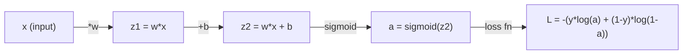
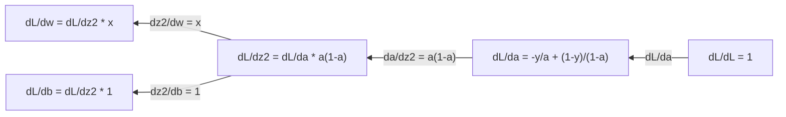
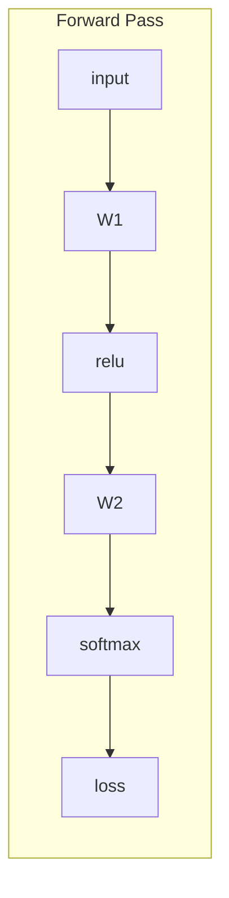
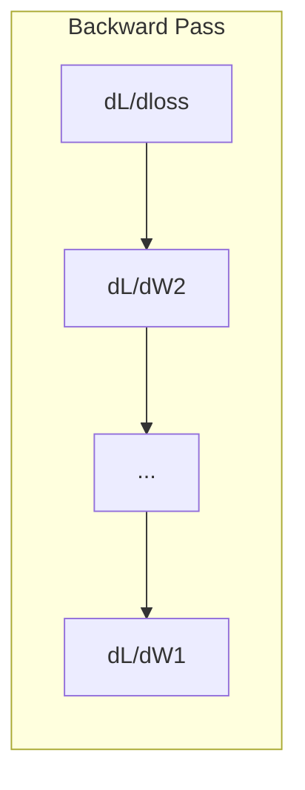

# Calculus for Machine Learning | 机器学习中的微积分

> Derivatives tell you which way is downhill. That is all a neural network needs to learn.

**Type:** Learn
**Language:** Python
**Prerequisites:** Phase 1, Lessons 01-03
**Time:** ~60 minutes

## Learning Objectives | 学习目标

- Compute numerical and analytical derivatives for common ML functions (x^2, sigmoid, cross-entropy)
- Implement gradient descent from scratch to minimize a loss function in 1D and 2D
- Derive the gradient of a linear regression model and train it via manual weight updates
- Explain the Hessian matrix, Taylor series approximations, and their connection to optimization methods

> **【中文解读】** 导数告诉你"往哪个方向走能让误差变小"。神经网络有数百万个参数，每个参数都是一个"旋钮"，微积分告诉你每个旋钮该往哪个方向调。梯度下降就是沿着导数的反方向一步步走到最小值。本节从导数的定义出发，到梯度、链式法则、Hessian 矩阵和泰勒展开，最终回到神经网络的训练循环。

> **【拓展：微积分与神经网络】**
> - **梯度下降**: 神经网络训练的核心算法——沿着梯度的反方向更新参数。
> - **SGD/Adam**: 都是梯度下降的变体，Adam 加入了动量和自适应学习率。
> - **学习率**: 梯度下降的步长。太大则跳过最小值，太小则收敛太慢。

## The Problem

You have a neural network with millions of weights. Each weight is a knob. You need to figure out which direction to turn every single knob to make the model slightly less wrong. Calculus gives you that direction.

Without calculus, training a neural network would mean trying random changes and hoping for the best. With derivatives, you know exactly how each weight affects the error. You turn every knob the right way, every time.

> **【中文解读】** 核心问题：神经网络有数百万个权重参数，怎么知道每个该往哪个方向调？答案就是导数——它精确告诉你"调大一点误差会变大还是变小"。没有微积分，训练就是盲人摸象；有了导数，每一步都朝着让误差减少的方向走。

## The Concept

### What is a derivative?

A derivative measures the rate of change. For a function y = f(x), the derivative f'(x) tells you: if you nudge x by a tiny amount, how much does y change?

Geometrically, the derivative is the slope of the tangent line at a point.

**f(x) = x^2:**

| x | f(x) | f'(x) (slope) |
|---|------|---------------|
| 0 | 0    | 0 (flat, at the bottom) |
| 1 | 1    | 2 |
| 2 | 4    | 4 (tangent line slope at this point) |
| 3 | 9    | 6 |

At x=2, the slope is 4. If you move x a tiny bit to the right, y increases by about 4 times that amount. At x=0, the slope is 0. You are at the bottom of the bowl.

The formal definition:

```
f'(x) = lim   f(x + h) - f(x)
        h->0  -----------------
                     h
```

In code, you skip the limit and just use a very small h. That is the numerical derivative.

> **【中文解读】** 导数衡量函数在某点的变化率。几何上就是切线斜率。以 f(x)=x^2 为例，x=0 处斜率为 0（谷底），x=2 处斜率为 4（往上走）。定义是极限，但代码中用很小的 h（如 1e-7）做差分近似，这就是数值导数。

### Partial derivatives: one variable at a time

Real functions have many inputs. A neural network loss depends on thousands of weights. A partial derivative holds all variables constant except one, then takes the derivative with respect to that one.

```
f(x, y) = x^2 + 3xy + y^2

df/dx = 2x + 3y     (treat y as a constant)
df/dy = 3x + 2y     (treat x as a constant)
```

Each partial derivative answers: if I nudge just this one weight, how does the loss change?

> **【中文解读】** 偏导数是"只动一个旋钮"时的变化率。对于 f(x,y) = x^2 + 3xy + y^2，对 x 求偏导时把 y 当常数，得到 2x+3y；对 y 求偏导时把 x 当常数，得到 3x+2y。神经网络中每个权重都有一个偏导数，回答"只调这个权重，损失怎么变"。

### The gradient: vector of all partial derivatives

The gradient collects every partial derivative into one vector. For a function f(x, y, z), the gradient is:

```
grad f = [ df/dx, df/dy, df/dz ]
```

The gradient points in the direction of steepest ascent. To minimize a function, go in the opposite direction.

**Contour plot of f(x,y) = x^2 + y^2:**

The function forms a bowl shape with concentric circles as contour lines. The minimum is at (0, 0).

| Point | grad f | -grad f (descent direction) |
|-------|--------|----------------------------|
| (1, 1) | [2, 2] (points uphill, away from minimum) | [-2, -2] (points downhill, toward minimum) |
| (0, 0) | [0, 0] (flat, at the minimum) | [0, 0] |

This is gradient descent in a picture. Compute the gradient, negate it, take a step.

> **【中文解读】** 梯度是所有偏导数组成的向量，指向函数增长最快的方向。要最小化函数，就沿梯度的反方向走。在 f(x,y)=x^2+y^2 的碗形曲面上，(1,1) 处的梯度是 [2,2]（指向远离最小值的方向），取负得 [-2,-2]（指向最小值）。这就是梯度下降的全部几何直觉。

### The connection to optimization

Training a neural network is optimization. You have a loss function L(w1, w2, ..., wn) that measures how wrong the model is. You want to minimize it.

```
Gradient descent update rule:

  w_new = w_old - learning_rate * dL/dw

For every weight:
  1. Compute the partial derivative of loss with respect to that weight
  2. Subtract a small multiple of it from the weight
  3. Repeat
```

The learning rate controls step size. Too big and you overshoot. Too small and you crawl.

**Loss landscape (1D slice):**

The loss function L(w) forms a curve with peaks and valleys as the weight w varies.

| Feature | Description |
|---------|-------------|
| Global minimum | The lowest point on the entire curve -- the best solution |
| Local minimum | A valley that is lower than its neighbors but not the lowest overall |
| Slope | Gradient descent follows the slope downhill from any starting point |

Gradient descent follows the slope downhill. It can get stuck in local minima, but in high-dimensional spaces (millions of weights) this is rarely a practical problem.

> **【中文解读】** 训练神经网络 = 优化 = 最小化损失函数。更新规则极其简单：w_new = w_old - lr * dL/dw。学习率控制步长：太大跳过最小值，太小收敛太慢。梯度下降可能卡在局部最小值，但在高维空间（百万级参数）中这很少是实际问题——因为"逃离"一个局部最小值通常只需要少数维度上有向下的路径。

### Numerical vs analytical derivatives

There are two ways to compute a derivative.

Analytical: apply calculus rules by hand. For f(x) = x^2, the derivative is f'(x) = 2x. Exact. Fast.

Numerical: approximate using the definition. Compute f(x+h) and f(x-h) for a tiny h, then use the difference.

```
Numerical (central difference):

f'(x) ~= f(x + h) - f(x - h)
          -----------------------
                  2h

h = 0.0001 works well in practice
```

Numerical derivatives are slower but work for any function. Analytical derivatives are fast but require you to derive the formula. Neural network frameworks use a third approach: automatic differentiation, which computes exact derivatives mechanically. You will see that in Phase 3.

> **【中文解读】** 两种求导方式：解析法（手工推导公式，精确快速，如 x^2 导数为 2x）和数值法（用差分近似，慢但通用）。深度学习框架用第三种方式——自动微分，机械地计算精确导数。数值导数虽然慢，但在验证解析导数是否正确时非常有用。

### Derivatives by hand for simple functions

These are the derivatives you will see over and over in ML.

```
Function        Derivative       Used in
--------        ----------       -------
f(x) = x^2     f'(x) = 2x      Loss functions (MSE)
f(x) = wx + b  f'(w) = x        Linear layer (gradient w.r.t. weight)
                f'(b) = 1        Linear layer (gradient w.r.t. bias)
                f'(x) = w        Linear layer (gradient w.r.t. input)
f(x) = e^x     f'(x) = e^x     Softmax, attention
f(x) = ln(x)   f'(x) = 1/x     Cross-entropy loss
f(x) = 1/(1+e^-x)  f'(x) = f(x)(1-f(x))   Sigmoid activation
```

For f(x) = x^2:

```
f(x) = x^2    f'(x) = 2x

  x    f(x)   f'(x)   meaning
  -2    4      -4      slope tilts left (decreasing)
  -1    1      -2      slope tilts left (decreasing)
   0    0       0      flat (minimum!)
   1    1       2      slope tilts right (increasing)
   2    4       4      slope tilts right (increasing)
```

For f(w) = wx + b with x=3, b=1:

```
f(w) = 3w + 1    f'(w) = 3

The derivative with respect to w is just x.
If x is big, a small change in w causes a big change in output.
```

### The chain rule

When functions are composed, the chain rule tells you how to differentiate.

```
If y = f(g(x)), then dy/dx = f'(g(x)) * g'(x)

Example: y = (3x + 1)^2
  outer: f(u) = u^2       f'(u) = 2u
  inner: g(x) = 3x + 1    g'(x) = 3
  dy/dx = 2(3x + 1) * 3 = 6(3x + 1)
```

Neural networks are chains of functions: input -> linear -> activation -> linear -> activation -> loss. Backpropagation is the chain rule applied repeatedly from output to input. That is the entire algorithm.

> **【中文解读】** 链式法则处理复合函数的求导：y=f(g(x)) 时 dy/dx = f'(g(x)) * g'(x)。神经网络就是函数的嵌套链条：输入 -> 线性层 -> 激活 -> 线性层 -> 激活 -> 损失。反向传播无非是从输出到输入逐层应用链式法则——这就是深度学习的全部数学核心。

### The Hessian Matrix

The gradient tells you the slope. The Hessian tells you the curvature.

The Hessian is the matrix of second-order partial derivatives. For a function f(x1, x2, ..., xn), entry (i, j) of the Hessian is:

```
H[i][j] = d^2f / (dx_i * dx_j)
```

For a 2-variable function f(x, y):

```
H = | d^2f/dx^2    d^2f/dxdy |
    | d^2f/dydx    d^2f/dy^2 |
```

**What the Hessian tells you at a critical point (where gradient = 0):**

| Hessian property | Meaning | Example surface |
|-----------------|---------|-----------------|
| Positive definite (all eigenvalues > 0) | Local minimum | Bowl pointing up |
| Negative definite (all eigenvalues < 0) | Local maximum | Bowl pointing down |
| Indefinite (mixed eigenvalues) | Saddle point | Horse saddle shape |

**Example:** f(x, y) = x^2 - y^2 (a saddle function)

```
df/dx = 2x       df/dy = -2y
d^2f/dx^2 = 2    d^2f/dy^2 = -2    d^2f/dxdy = 0

H = | 2   0 |
    | 0  -2 |

Eigenvalues: 2 and -2 (one positive, one negative)
--> Saddle point at (0, 0)
```

Compare with f(x, y) = x^2 + y^2 (a bowl):

```
H = | 2  0 |
    | 0  2 |

Eigenvalues: 2 and 2 (both positive)
--> Local minimum at (0, 0)
```

**Why the Hessian matters in ML:**

Newton's method uses the Hessian to take better optimization steps than gradient descent. Instead of just following the slope, it accounts for curvature:

```
Newton's update:    w_new = w_old - H^(-1) * gradient
Gradient descent:   w_new = w_old - lr * gradient
```

Newton's method converges faster because the Hessian "rescales" the gradient -- steep directions get smaller steps, flat directions get larger steps.

The catch: for a neural network with N parameters, the Hessian is N x N. A model with 1 million parameters would need a 1 trillion-entry matrix. That is why we use approximations.

| Method | What it uses | Cost | Convergence |
|--------|-------------|------|-------------|
| Gradient descent | First derivatives only | O(N) per step | Slow (linear) |
| Newton's method | Full Hessian | O(N^3) per step | Fast (quadratic) |
| L-BFGS | Approximate Hessian from gradient history | O(N) per step | Medium (superlinear) |
| Adam | Per-parameter adaptive rates (diagonal Hessian approx) | O(N) per step | Medium |
| Natural gradient | Fisher information matrix (statistical Hessian) | O(N^2) per step | Fast |

In practice, Adam is the default optimizer for deep learning. It approximates second-order information cheaply by tracking the running mean and variance of gradients per parameter.

> **【中文解读】** 梯度告诉你斜率，Hessian 告诉你曲率。在临界点（梯度为零），Hessian 的特征值决定其性质：全正为局部最小（碗朝上），全负为局部最大（碗朝下），有正有负为鞍点。牛顿法用 Hessian 的逆来调整步长，比梯度下降收敛更快，但 N 个参数需要 N×N 的 Hessian 矩阵——百万参数就是万亿级别的矩阵。Adam 巧妙地用对角近似来获取二阶信息，成本仅 O(N)。

> **【拓展：为什么鞍点比局部最小值更常见】** 在高维空间中，随机一个临界点处 Hessian 的所有特征值恰好都为正的概率极低。更常见的是部分正部分负的鞍点。好消息是：鞍点处总有某个方向是向下的，所以梯度下降通常能"溜走"。

### Taylor Series Approximation

Any smooth function can be approximated locally by a polynomial:

```
f(x + h) = f(x) + f'(x)*h + (1/2)*f''(x)*h^2 + (1/6)*f'''(x)*h^3 + ...
```

The more terms you include, the better the approximation -- but only near the point x.

**Why Taylor series matter for ML:**

- **First-order Taylor = gradient descent.** When you use f(x + h) ~ f(x) + f'(x)*h, you are making a linear approximation. Gradient descent minimizes this linear model to choose h = -lr * f'(x).

- **Second-order Taylor = Newton's method.** Using f(x + h) ~ f(x) + f'(x)*h + (1/2)*f''(x)*h^2, you get a quadratic model. Minimizing it gives h = -f'(x)/f''(x) -- Newton's step.

- **Loss function design.** MSE and cross-entropy are smooth, which means their Taylor expansions are well-behaved. This is not an accident. Smooth losses make optimization predictable.

```
Approximation order    What it captures    Optimization method
-------------------    -----------------   -------------------
0th order (constant)   Just the value      Random search
1st order (linear)     Slope               Gradient descent
2nd order (quadratic)  Curvature           Newton's method
Higher orders          Finer structure     Rarely used in ML
```

The key insight: all gradient-based optimization is really about approximating the loss function locally and stepping to the minimum of that approximation.

> **【中文解读】** 泰勒展开用多项式局部逼近任意光滑函数：零阶（只看值）= 随机搜索，一阶（加斜率）= 梯度下降，二阶（加曲率）= 牛顿法。核心洞察：所有基于梯度的优化本质上都是在局部用多项式逼近损失函数，然后走到那个多项式的最小值。学习率太大时，线性近似就不准了，所以步子不能迈太大。

### Integrals in ML

Derivatives tell you rates of change. Integrals compute accumulations -- area under a curve.

In ML, you rarely compute integrals by hand, but the concept is everywhere:

**Probability.** For a continuous random variable with density p(x):
```
P(a < X < b) = integral from a to b of p(x) dx
```
The area under the probability density curve between a and b is the probability of landing in that range.

**Expected value.** The average outcome weighted by probability:
```
E[f(X)] = integral of f(x) * p(x) dx
```
The expected loss over a data distribution is an integral. Training minimizes an empirical approximation of this.

**KL divergence.** Measures how different two distributions are:
```
KL(p || q) = integral of p(x) * log(p(x) / q(x)) dx
```
Used in VAEs, knowledge distillation, and Bayesian inference.

**Normalization constants.** In Bayesian inference:
```
p(w | data) = p(data | w) * p(w) / integral of p(data | w) * p(w) dw
```
The denominator is an integral over all possible parameter values. It is often intractable, which is why we use approximations like MCMC and variational inference.

> **【中文解读】** 积分在 ML 中虽然很少手算，但概念无处不在：概率密度曲线下的面积就是概率；期望值是对所有可能结果按概率加权平均；KL 散度衡量两个分布的差异（VAE、知识蒸馏中常用）；贝叶斯推断中的归一化常数是参数空间上的积分，通常无法解析求解，所以用 MCMC 或变分推断来近似。

| Integral concept | Where it appears in ML |
|-----------------|----------------------|
| Area under curve | Probability from density functions |
| Expected value | Loss functions, risk minimization |
| KL divergence | VAEs, policy optimization, distillation |
| Normalization | Bayesian posteriors, softmax denominator |
| Marginal likelihood | Model comparison, evidence lower bound (ELBO) |

### Multivariable Chain Rule in a Computation Graph

The chain rule does not just apply to scalar functions in a line. In a neural network, variables fan out and merge. Here is how derivatives flow through a simple forward pass:



The backward pass computes gradients right to left:



Each arrow multiplies by the local derivative. The gradient for any parameter is the product of all local derivatives along the path from loss to that parameter. When paths branch and merge, you sum the contributions (multivariate chain rule).

This is all backpropagation is: the chain rule applied systematically through a computation graph, from output to inputs.

> **【中文解读】** 计算图展示了链式法则在神经网络中的实际运作：前向传播从左到右计算预测值和损失，反向传播从右到左逐层乘以局部导数。每个箭头代表乘一个局部导数。当路径分支又合并时（多变量链式法则），要把各路径的贡献加起来。这就是反向传播的全部——在计算图上系统性地应用链式法则。

### The Jacobian matrix

When a function maps a vector to a vector (like a neural network layer), its derivative is a matrix. The Jacobian contains every partial derivative of every output with respect to every input.

For f: R^n -> R^m, the Jacobian J is an m x n matrix:

| | x1 | x2 | ... | xn |
|---|---|---|---|---|
| f1 | df1/dx1 | df1/dx2 | ... | df1/dxn |
| f2 | df2/dx1 | df2/dx2 | ... | df2/dxn |
| ... | ... | ... | ... | ... |
| fm | dfm/dx1 | dfm/dx2 | ... | dfm/dxn |

You will not compute Jacobians by hand for neural networks. PyTorch handles it. But knowing it exists helps you understand shapes in backpropagation: if a layer maps R^n to R^m, its Jacobian is m x n. The gradient flows backward through the transpose of this matrix.

> **【中文解读】** 当函数映射向量到向量时（如神经网络的一层），导数是一个矩阵——Jacobian 矩阵。它包含每个输出对每个输入的偏导数。一层从 R^n 映射到 R^m 时，Jacobian 是 m×n 矩阵，梯度反向传播时经过它的转置。实践中 PyTorch 自动处理，但理解 Jacobian 的形状有助于调试维度不匹配的错误。

### Why this matters for neural networks

Every weight in a neural network gets a gradient. The gradient tells you how to adjust that weight to reduce the loss.





Each weight update:
- `W1 = W1 - lr * dL/dW1`
- `W2 = W2 - lr * dL/dW2`

The forward pass computes the prediction and loss. The backward pass computes the gradient of the loss with respect to every weight. Then every weight takes a small step downhill. Repeat for millions of steps. That is deep learning.

> **【中文解读】** 深度学习的全貌：前向传播算预测和损失，反向传播算每个权重的梯度，然后每个权重沿梯度反方向走一小步。W = W - lr * dL/dW。重复数百万次。就这么简单。不管模型是 GPT-4 还是 ResNet，训练过程本质上都是这个循环。

## Build It

### Step 1: Numerical derivative from scratch

```python
def numerical_derivative(f, x, h=1e-7):
    return (f(x + h) - f(x - h)) / (2 * h)

def f(x):
    return x ** 2

for x in [-2, -1, 0, 1, 2]:
    numerical = numerical_derivative(f, x)
    analytical = 2 * x
    print(f"x={x:2d}  f'(x) numerical={numerical:.6f}  analytical={analytical:.1f}")
```

The numerical derivative matches the analytical one to many decimal places.

### Step 2: Partial derivatives and gradients

```python
def numerical_gradient(f, point, h=1e-7):
    gradient = []
    for i in range(len(point)):
        point_plus = list(point)
        point_minus = list(point)
        point_plus[i] += h
        point_minus[i] -= h
        partial = (f(point_plus) - f(point_minus)) / (2 * h)
        gradient.append(partial)
    return gradient

def f_multi(point):
    x, y = point
    return x**2 + 3*x*y + y**2

grad = numerical_gradient(f_multi, [1.0, 2.0])
print(f"Numerical gradient at (1,2): {[f'{g:.4f}' for g in grad]}")
print(f"Analytical gradient at (1,2): [2*1+3*2, 3*1+2*2] = [{2*1+3*2}, {3*1+2*2}]")
```

### Step 3: Gradient descent to find the minimum of f(x) = x^2

```python
x = 5.0
lr = 0.1
for step in range(20):
    grad = 2 * x
    x = x - lr * grad
    print(f"step {step:2d}  x={x:8.4f}  f(x)={x**2:10.6f}")
```

Starting at x=5, each step moves closer to x=0 (the minimum).

### Step 4: Gradient descent on a 2D function

```python
def f_2d(point):
    x, y = point
    return x**2 + y**2

point = [4.0, 3.0]
lr = 0.1
for step in range(30):
    grad = numerical_gradient(f_2d, point)
    point = [p - lr * g for p, g in zip(point, grad)]
    loss = f_2d(point)
    if step % 5 == 0 or step == 29:
        print(f"step {step:2d}  point=({point[0]:7.4f}, {point[1]:7.4f})  f={loss:.6f}")
```

### Step 5: Comparing numerical and analytical derivatives

```python
import math

test_functions = [
    ("x^2",      lambda x: x**2,          lambda x: 2*x),
    ("x^3",      lambda x: x**3,          lambda x: 3*x**2),
    ("sin(x)",   lambda x: math.sin(x),   lambda x: math.cos(x)),
    ("e^x",      lambda x: math.exp(x),   lambda x: math.exp(x)),
    ("1/x",      lambda x: 1/x,           lambda x: -1/x**2),
]

x = 2.0
print(f"{'Function':<12} {'Numerical':>12} {'Analytical':>12} {'Error':>12}")
print("-" * 50)
for name, f, df in test_functions:
    num = numerical_derivative(f, x)
    ana = df(x)
    err = abs(num - ana)
    print(f"{name:<12} {num:12.6f} {ana:12.6f} {err:12.2e}")
```

### Step 6: Computing the Hessian numerically

```python
def hessian_2d(f, x, y, h=1e-5):
    fxx = (f(x + h, y) - 2 * f(x, y) + f(x - h, y)) / (h ** 2)
    fyy = (f(x, y + h) - 2 * f(x, y) + f(x, y - h)) / (h ** 2)
    fxy = (f(x + h, y + h) - f(x + h, y - h) - f(x - h, y + h) + f(x - h, y - h)) / (4 * h ** 2)
    return [[fxx, fxy], [fxy, fyy]]

def saddle(x, y):
    return x ** 2 - y ** 2

def bowl(x, y):
    return x ** 2 + y ** 2

H_saddle = hessian_2d(saddle, 0.0, 0.0)
H_bowl = hessian_2d(bowl, 0.0, 0.0)
print(f"Saddle Hessian: {H_saddle}")  # [[2, 0], [0, -2]] -- mixed signs
print(f"Bowl Hessian:   {H_bowl}")    # [[2, 0], [0, 2]]  -- both positive
```

The Hessian of the saddle function has eigenvalues 2 and -2 (mixed signs, confirming a saddle point). The bowl has eigenvalues 2 and 2 (both positive, confirming a minimum).

### Step 7: Taylor approximation in action

```python
import math

def taylor_approx(f, f_prime, f_double_prime, x0, h, order=2):
    result = f(x0)
    if order >= 1:
        result += f_prime(x0) * h
    if order >= 2:
        result += 0.5 * f_double_prime(x0) * h ** 2
    return result

x0 = 0.0
for h in [0.1, 0.5, 1.0, 2.0]:
    true_val = math.sin(h)
    t1 = taylor_approx(math.sin, math.cos, lambda x: -math.sin(x), x0, h, order=1)
    t2 = taylor_approx(math.sin, math.cos, lambda x: -math.sin(x), x0, h, order=2)
    print(f"h={h:.1f}  sin(h)={true_val:.4f}  order1={t1:.4f}  order2={t2:.4f}")
```

Near x0=0, sin(x) ~ x (first-order Taylor). The approximation is excellent for small h but breaks down for large h. This is why gradient descent works best with small learning rates -- each step assumes the linear approximation is accurate.

### Step 8: Why this matters for a neural network

```python
import random

random.seed(42)

w = random.gauss(0, 1)
b = random.gauss(0, 1)
lr = 0.01

xs = [1.0, 2.0, 3.0, 4.0, 5.0]
ys = [3.0, 5.0, 7.0, 9.0, 11.0]

for epoch in range(200):
    total_loss = 0
    dw = 0
    db = 0
    for x, y in zip(xs, ys):
        pred = w * x + b
        error = pred - y
        total_loss += error ** 2
        dw += 2 * error * x
        db += 2 * error
    dw /= len(xs)
    db /= len(xs)
    total_loss /= len(xs)
    w -= lr * dw
    b -= lr * db
    if epoch % 40 == 0 or epoch == 199:
        print(f"epoch {epoch:3d}  w={w:.4f}  b={b:.4f}  loss={total_loss:.6f}")

print(f"\nLearned: y = {w:.2f}x + {b:.2f}")
print(f"Actual:  y = 2x + 1")
```

Every gradient-based training loop follows this pattern: predict, compute loss, compute gradients, update weights.

## Use It

With NumPy, the same operations are faster and more concise:

```python
import numpy as np

x = np.array([1, 2, 3, 4, 5], dtype=float)
y = np.array([3, 5, 7, 9, 11], dtype=float)

w, b = np.random.randn(), np.random.randn()
lr = 0.01

for epoch in range(200):
    pred = w * x + b
    error = pred - y
    loss = np.mean(error ** 2)
    dw = np.mean(2 * error * x)
    db = np.mean(2 * error)
    w -= lr * dw
    b -= lr * db

print(f"Learned: y = {w:.2f}x + {b:.2f}")
```

You just built gradient descent from scratch. PyTorch automates the gradient computation, but the update loop is identical.

> **【中文解读】** 用 NumPy 的实现更简洁但逻辑完全相同：预测、算误差、算梯度、更新权重。PyTorch 帮你自动算梯度（autograd），但更新循环和这里一模一样。理解手写版本是理解 PyTorch 的基础。

## Exercises

1. Implement `numerical_second_derivative(f, x)` using `numerical_derivative` called twice. Verify that the second derivative of x^3 at x=2 is 12.
   > **中文：** 用两次 `numerical_derivative` 实现数值二阶导数。验证 x^3 在 x=2 处的二阶导数为 12。

2. Use gradient descent to find the minimum of f(x, y) = (x - 3)^2 + (y + 1)^2. Start from (0, 0). The answer should converge to (3, -1).
   > **中文：** 用梯度下降找 f(x,y) = (x-3)^2 + (y+1)^2 的最小值。从 (0,0) 出发，答案应收敛到 (3,-1)。

3. Add momentum to the gradient descent loop: maintain a velocity vector that accumulates past gradients. Compare convergence speed with and without momentum on f(x) = x^4 - 3x^2.
   > **中文：** 给梯度下降加入动量：维护一个速度向量累积历史梯度。在 f(x) = x^4 - 3x^2 上比较有动量和无动量的收敛速度。

## Key Terms

| Term | What people say | What it actually means | 中文释义 |
|------|----------------|----------------------|---------|
| Derivative | "The slope" | The rate of change of a function at a point. Tells you how much the output changes per unit change in input. | 导数：函数在某点的变化率，几何上是切线斜率 |
| Partial derivative | "Derivative of one variable" | The derivative with respect to one variable while all others are held constant. | 偏导数：固定其他变量，只对一个变量求导 |
| Gradient | "Direction of steepest ascent" | A vector of all partial derivatives. Points in the direction that increases the function fastest. | 梯度：所有偏导数组成的向量，指向函数增长最快方向 |
| Gradient descent | "Go downhill" | Subtract the gradient (times a learning rate) from the parameters to reduce the loss. The core of neural network training. | 梯度下降：沿梯度反方向更新参数以减少损失 |
| Learning rate | "Step size" | A scalar that controls how big each gradient descent step is. Too large: diverge. Too small: converge slowly. | 学习率：控制每步大小，太大发散太小收敛慢 |
| Chain rule | "Multiply the derivatives" | The rule for differentiating composed functions: df/dx = df/dg * dg/dx. The mathematical basis of backpropagation. | 链式法则：复合函数求导规则，反向传播的数学基础 |
| Jacobian | "Matrix of derivatives" | When a function maps vectors to vectors, the Jacobian is the matrix of all partial derivatives of outputs with respect to inputs. | Jacobian 矩阵：向量到向量映射的导数矩阵 |
| Numerical derivative | "Finite differences" | Approximating a derivative by evaluating the function at two nearby points and computing the slope between them. | 数值导数：用差分近似计算导数 |
| Backpropagation | "Reverse-mode autodiff" | Computing gradients layer by layer from output to input using the chain rule. How neural networks learn. | 反向传播：从输出到输入逐层计算梯度 |
| Hessian | "Matrix of second derivatives" | The matrix of all second-order partial derivatives. Describes the curvature of a function. Positive definite Hessian at a critical point means local minimum. | Hessian 矩阵：二阶偏导数矩阵，描述函数曲率 |
| Taylor series | "Polynomial approximation" | Approximating a function near a point using its derivatives: f(x+h) ~ f(x) + f'(x)h + (1/2)f''(x)h^2 + ... The basis for understanding why gradient descent and Newton's method work. | 泰勒展开：用多项式局部逼近函数，理解优化的理论基础 |
| Integral | "Area under the curve" | The accumulation of a quantity over a range. In ML, integrals define probabilities, expected values, and KL divergence. | 积分：曲线下面积，ML 中定义概率、期望和 KL 散度 |

## Further Reading

- [3Blue1Brown: Essence of Calculus](https://www.3blue1brown.com/topics/calculus) - visual intuition for derivatives, integrals, and the chain rule
- [Stanford CS231n: Backpropagation](https://cs231n.github.io/optimization-2/) - how gradients flow through neural network layers
