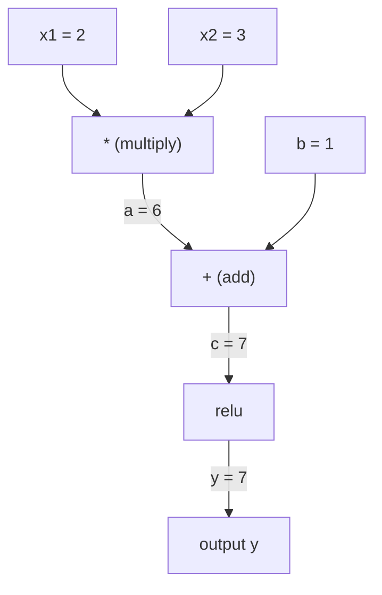
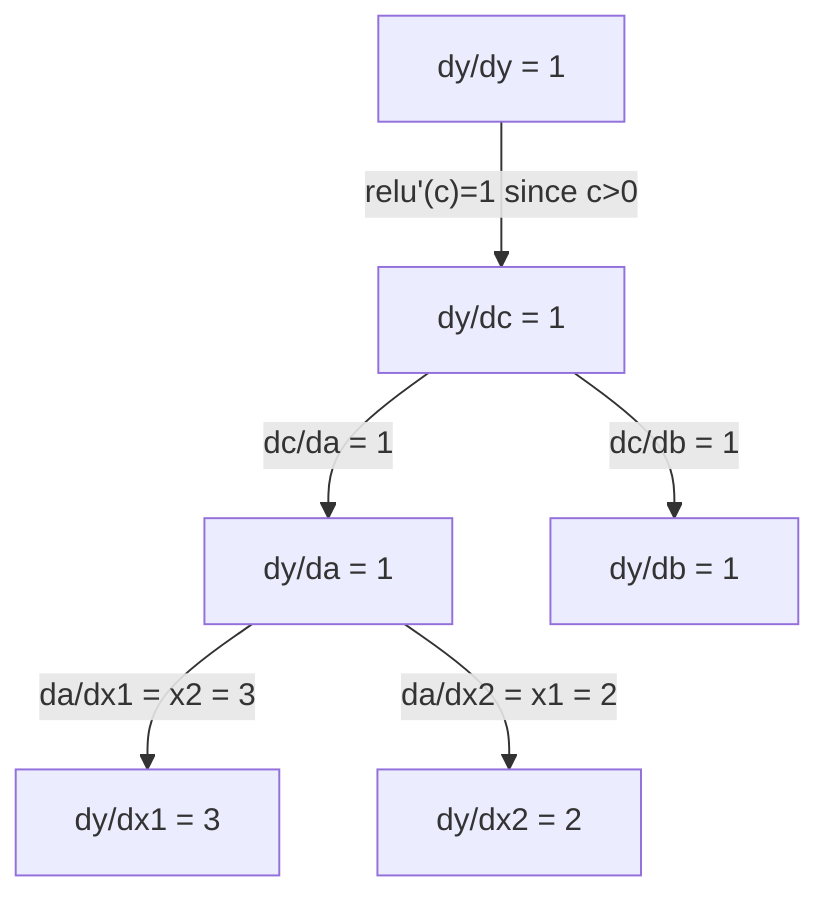

# Chain Rule & Automatic Differentiation | 链式法则与自动微分

> The chain rule is the engine behind every neural network that learns.

**Type:** Build | **类型:** 动手
**Language:** Python | **语言:** Python
**Prerequisites:** Phase 1, Lesson 04 (Derivatives & Gradients) | **前置知识:** Phase 1, Lesson 04（导数与梯度）
**Time:** ~90 minutes | **时间:** ~90 分钟

## Learning Objectives | 学习目标

- Build a minimal autograd engine (Value class) that records operations and computes gradients via reverse-mode autodiff
  构建最小化 autograd 引擎（Value 类），记录运算并通过反向模式自动微分计算梯度
- Implement forward and backward passes through a computation graph using topological sort
  用拓扑排序实现计算图的前向和反向传播
- Construct and train a multi-layer perceptron on XOR using only the from-scratch autograd engine
  仅用从零实现的 autograd 引擎构建并在 XOR 上训练多层感知机
- Verify autodiff correctness using gradient checking against numerical finite differences
  用数值有限差分进行梯度检查，验证 autodiff 的正确性

> **【中文解读】**
> 链式法则是"函数套函数的导数怎么算"。神经网络就是几百个函数嵌套在一起：矩阵乘法→加偏置→激活函数→再矩阵乘法→Softmax→交叉熵。链式法则让你能从最后一层开始，逐层往回计算每个参数的梯度——这就是反向传播。

> **【拓展：链式法则 → 反向传播 → PyTorch autograd】**
> 链式法则是反向传播（Backpropagation）的数学基础。PyTorch 的 `autograd`、TensorFlow 的 `GradientTape` 都是用反向模式自动微分实现的——它们自动追踪计算图，然后用链式法则计算所有梯度。你将在本章从零构建一个迷你的 autograd 引擎。

## The Problem | 问题引入

You can compute derivatives of simple functions. But a neural network is not a simple function. It is hundreds of functions composed together: matrix multiply, add bias, apply activation, matrix multiply again, softmax, cross-entropy loss. The output is a function of a function of a function.

> 你能计算简单函数的导数。但神经网络不是简单函数。它是数百个函数的复合：矩阵乘法、加偏置、激活函数、再矩阵乘法、Softmax、交叉熵损失。输出是函数的函数的函数。

To train the network, you need the gradient of the loss with respect to every single weight. Doing this by hand is impossible for millions of parameters. Doing it numerically (finite differences) is too slow.

> 要训练网络，你需要损失对每个权重的梯度。手动计算百万参数不可能，数值方法（有限差分）太慢。

The chain rule gives you the math. Automatic differentiation gives you the algorithm. Together they let you compute exact gradients through arbitrary compositions of functions in time proportional to a single forward pass.

> 链式法则给出数学，自动微分给出算法。两者结合，让你在与单次前向传播相当的时间内，计算任意复合函数的精确梯度。

This is how PyTorch, TensorFlow, and JAX work. You will build a miniature version from scratch.

> 这就是 PyTorch、TensorFlow 和 JAX 的工作方式。你将从零构建一个微型版本。

> **【中文解读】** 神经网络 = 函数的函数的函数。链式法则让你逐层拆解复合函数的导数：dL/dw = dL/d_out × d_out/d_hidden × d_hidden/d_w。自动求导把这个过程自动化——PyTorch 的 `backward()` 一行代码搞定百万参数的梯度计算。

## The Concept | 核心概念

> **【拓展：自动求导是深度学习的引擎】** PyTorch 的 `loss.backward()` 用反向模式自动求导：从输出往回，逐层应用链式法则。这比数值方法快百万倍。GPT-4 有 1.8 万亿参数，`backward()` 一次就能算出所有参数的梯度。没有自动求导，深度学习不可能处理如此巨大的模型。

### The Chain Rule

If `y = f(g(x))`, the derivative of `y` with respect to `x` is:

> 如果 `y = f(g(x))`，y 对 x 的导数是：

```
dy/dx = dy/dg * dg/dx = f'(g(x)) * g'(x)
```

Multiply the derivatives along the chain. Each link contributes its local derivative.

> 沿链路乘导数。每一步贡献其局部导数。

Example: `y = sin(x^2)`

```
g(x) = x^2       g'(x) = 2x
f(g) = sin(g)     f'(g) = cos(g)

dy/dx = cos(x^2) * 2x
```

> 示例：y = sin(x²)。内层 g(x) = x² 的导数是 2x，外层 f(g) = sin(g) 的导数是 cos(g)，链式相乘：dy/dx = cos(x²) × 2x。

For deeper compositions, the chain extends:

```
y = f(g(h(x)))

dy/dx = f'(g(h(x))) * g'(h(x)) * h'(x)
```

> 更深的复合：y = f(g(h(x)))，导数为 f'(g(h(x))) × g'(h(x)) × h'(x)，每多一层就多乘一项。

Every layer in a neural network is one link in this chain.

> 神经网络的每一层都是这个链条中的一个环节。

### Computational Graphs

A computational graph makes the chain rule visual. Every operation becomes a node. Data flows forward through the graph. Gradients flow backward.

> 计算图让链式法则可视化。每个操作变成一个节点，数据向前流动，梯度向后流动。

> 计算图是 PyTorch autograd 的底层抽象：节点是运算，前向时存储中间值，反向时计算局部梯度。

**Forward pass (compute values):**



**Backward pass (compute gradients):**



The backward pass applies the chain rule at every node, propagating gradients from output to inputs.

> 反向传播在每个节点应用链式法则，将梯度从输出传播到输入。

### Forward Mode vs Reverse Mode

There are two ways to apply the chain rule through a graph.

> 通过计算图应用链式法则有两种方式。

**Forward mode** starts at the inputs and pushes derivatives forward. It computes `dx/dx = 1` and propagates through each operation. Good when you have few inputs and many outputs.

> **前向模式**从输入开始向前推进导数。它计算 `dx/dx = 1` 并通过每个操作传播。当输入少、输出多时适用。

```
Forward mode: seed dx/dx = 1, propagate forward

  x = 2       (dx/dx = 1)
  a = x^2     (da/dx = 2x = 4)
  y = sin(a)  (dy/dx = cos(a) * da/dx = cos(4) * 4 = -2.615)
```

**Reverse mode** starts at the output and pulls gradients backward. It computes `dy/dy = 1` and propagates through each operation in reverse. Good when you have many inputs and few outputs.

> **反向模式**从输出开始向后拉回梯度。它计算 `dy/dy = 1` 并反向通过每个操作。当输入多、输出少时适用——这正是神经网络的情况。

```
Reverse mode: seed dy/dy = 1, propagate backward

  y = sin(a)  (dy/dy = 1)
  a = x^2     (dy/da = cos(a) = cos(4) = -0.654)
  x = 2       (dy/dx = dy/da * da/dx = -0.654 * 4 = -2.615)
```

Neural networks have millions of inputs (weights) and one output (loss). Reverse mode computes all gradients in one backward pass. This is why backpropagation uses reverse mode.

> 神经网络有百万个输入（权重）和一个输出（损失）。反向模式一次反向传播就能计算所有梯度。这就是反向传播使用反向模式的原因。

| Mode | Seed | Direction | Best when |
|------|------|-----------|-----------|
| Forward | `dx_i/dx_i = 1` | Input to output | Few inputs, many outputs |
| Reverse | `dy/dy = 1` | Output to input | Many inputs, few outputs (neural nets) |

> 两种模式对比：前向模式种子 dx/dx = 1，输入到输出，适合少输入多输出；反向模式种子 dy/dy = 1，输出到输入，适合多输入少输出（神经网络）。

### Dual Numbers for Forward Mode

Forward mode can be implemented elegantly with dual numbers. A dual number has the form `a + b*epsilon` where `epsilon^2 = 0`.

> 前向模式可以用对偶数优雅地实现。对偶数形式为 `a + b*ε`，其中 `ε² = 0`。

```
Dual number: (value, derivative)

(2, 1) means: value is 2, derivative w.r.t. x is 1

Arithmetic rules:
  (a, a') + (b, b') = (a+b, a'+b')
  (a, a') * (b, b') = (a*b, a'*b + a*b')
  sin(a, a')         = (sin(a), cos(a)*a')
```

> 对偶数：(值, 导数)。算术规则：加法对应分量相加；乘法用积的求导法则；sin 用链式法则。把输入的导数种子设为 1，导数会自动通过每个运算传播。

Seed the input variable with derivative 1. The derivative propagates automatically through every operation.

> 把输入变量的导数种子设为 1，导数会自动通过每个运算传播。

### Building an Autograd Engine

An autograd engine needs three things:

1. **Value wrapping.** Wrap every number in an object that stores its value and gradient.
2. **Graph recording.** Every operation records its inputs and the local gradient function.
3. **Backward pass.** Topological sort the graph, then walk it in reverse, applying the chain rule at each node.

> autograd 引擎需要三件事：1. **数值包装**：把每个数字包装成存储值和梯度的对象；2. **图记录**：每个操作记录其输入和局部梯度函数；3. **反向传播**：拓扑排序图，反向遍历并在每个节点应用链式法则。

This is exactly what PyTorch's `autograd` does. The `torch.Tensor` class wraps values, records operations when `requires_grad=True`, and computes gradients when you call `.backward()`.

> 这正是 PyTorch 的 `autograd` 做的事。`torch.Tensor` 包装数值，当 `requires_grad=True` 时记录操作，调用 `.backward()` 时计算梯度。

### How PyTorch Autograd Works Under the Hood

When you write PyTorch code:

```python
x = torch.tensor(2.0, requires_grad=True)
y = x ** 2 + 3 * x + 1
y.backward()
print(x.grad)  # 7.0 = 2*x + 3 = 2*2 + 3
```

> 当你写 PyTorch 代码时：x 设 requires_grad=True，运算自动记录，调用 backward() 后 x.grad 自动算出梯度 7.0。

PyTorch internally:

1. Creates a `Tensor` node for `x` with `requires_grad=True`
2. Every operation (`**`, `*`, `+`) creates a new node and records the backward function
3. `y.backward()` triggers reverse-mode autodiff through the recorded graph
4. Each node's `grad_fn` computes local gradients and passes them to parent nodes
5. Gradients accumulate in `.grad` attributes via addition (not replacement)

> PyTorch 内部：1) 为 x 创建 Tensor 节点；2) 每个运算（**、*、+）创建新节点并记录反向函数；3) y.backward() 触发反向自动微分；4) 每个节点的 grad_fn 计算局部梯度并传给父节点；5) 梯度通过加法累积到 .grad 属性（不是替换）。

The graph is dynamic (define-by-run). A new graph is built on every forward pass. This is why PyTorch supports control flow (if/else, loops) inside models.

> 计算图是动态的（define-by-run）。每次前向传播都构建新图。这就是 PyTorch 支持模型内部控制流（if/else、循环）的原因。

## Build It | 动手实现

### Step 1: The Value class

```python
class Value:
    def __init__(self, data, children=(), op=''):
        self.data = data
        self.grad = 0.0
        self._backward = lambda: None
        self._prev = set(children)
        self._op = op

    def __repr__(self):
        return f"Value(data={self.data:.4f}, grad={self.grad:.4f})"
```

> Value 类是 autograd 的核心数据结构。每个 Value 存储数值、梯度、反向函数闭包和子节点指针。

Every `Value` stores its numeric data, its gradient (initially zero), a backward function, and pointers to child nodes that produced it.

> 每个 `Value` 存储数值、梯度（初始为零）、反向函数和产生它的子节点指针。

### Step 2: Arithmetic operations with gradient tracking

```python
    def __add__(self, other):
        other = other if isinstance(other, Value) else Value(other)
        out = Value(self.data + other.data, (self, other), '+')
        def _backward():
            self.grad += out.grad
            other.grad += out.grad
        out._backward = _backward
        return out

    def __mul__(self, other):
        other = other if isinstance(other, Value) else Value(other)
        out = Value(self.data * other.data, (self, other), '*')
        def _backward():
            self.grad += other.data * out.grad
            other.grad += self.data * out.grad
        out._backward = _backward
        return out

    def relu(self):
        out = Value(max(0, self.data), (self,), 'relu')
        def _backward():
            self.grad += (1.0 if out.data > 0 else 0.0) * out.grad
        out._backward = _backward
        return out
```

Each operation creates a closure that knows how to compute local gradients and multiply by the upstream gradient (`out.grad`). The `+=` handles the case where a value is used in multiple operations.

> 每个操作创建一个闭包，知道如何计算局部梯度并乘以上游梯度。`+=` 处理一个值被多个操作使用的情况（梯度累积）。

> 关键设计：加法的反向是 1（梯度直接传给两个输入），乘法的反向是另一个操作数（链式法则：d(a*b)/da = b）。relu 的反向是 0 或 1（取决于前向是否激活）。

### Step 3: The backward pass

```python
    def backward(self):
        topo = []
        visited = set()
        def build_topo(v):
            if v not in visited:
                visited.add(v)
                for child in v._prev:
                    build_topo(child)
                topo.append(v)
        build_topo(self)

        self.grad = 1.0
        for v in reversed(topo):
            v._backward()
```

Topological sort ensures every node's gradient is fully computed before it propagates to its children. The seed gradient is 1.0 (dy/dy = 1).

> 拓扑排序确保每个节点的梯度在传播到子节点之前完全计算。种子梯度是 1.0（dy/dy = 1）。

> backward() 算法：先用递归构建拓扑序（每个节点出现在所有依赖之后），再按拓扑序的逆序依次调用每个节点的 _backward()。

### Step 4: More operations for a complete engine

The basic Value class handles addition, multiplication, and relu. A real autograd engine needs more. Here are the operations you need to build neural networks:

> 基础 Value 类只支持加、乘、relu。一个真正的 autograd 引擎需要更多操作：减法、幂、除法、exp、log、tanh。

```python
    def __neg__(self):
        return self * -1

    def __sub__(self, other):
        return self + (-other)

    def __radd__(self, other):
        return self + other

    def __rmul__(self, other):
        return self * other

    def __rsub__(self, other):
        return other + (-self)

    def __pow__(self, n):
        out = Value(self.data ** n, (self,), f'**{n}')
        def _backward():
            self.grad += n * (self.data ** (n - 1)) * out.grad
        out._backward = _backward
        return out

    def __truediv__(self, other):
        return self * (other ** -1) if isinstance(other, Value) else self * (Value(other) ** -1)

    def exp(self):
        import math
        e = math.exp(self.data)
        out = Value(e, (self,), 'exp')
        def _backward():
            self.grad += e * out.grad
        out._backward = _backward
        return out

    def log(self):
        import math
        out = Value(math.log(self.data), (self,), 'log')
        def _backward():
            self.grad += (1.0 / self.data) * out.grad
        out._backward = _backward
        return out

    def tanh(self):
        import math
        t = math.tanh(self.data)
        out = Value(t, (self,), 'tanh')
        def _backward():
            self.grad += (1 - t ** 2) * out.grad
        out._backward = _backward
        return out
```

**Why each operation matters:**

| Operation | Backward rule | Used in |
|-----------|--------------|---------|
| `__sub__` | Reuses add + neg | Loss computation (pred - target) |
| `__pow__` | n * x^(n-1) | Polynomial activations, MSE (error^2) |
| `__truediv__` | Reuses mul + pow(-1) | Normalization, learning rate scaling |
| `exp` | exp(x) * upstream | Softmax, log-likelihood |
| `log` | (1/x) * upstream | Cross-entropy loss, log probabilities |
| `tanh` | (1 - tanh^2) * upstream | Classic activation function |

> 各操作的反向规则：减法复用加法+取负；幂用 n*x^(n-1)；除法复用乘法+幂(-1)；exp 用 exp(x)×上游；log 用 (1/x)×上游；tanh 用 (1-tanh²)×上游。

The clever part: `__sub__` and `__truediv__` are defined in terms of existing operations. They get correct gradients for free because the chain rule composes through the underlying add/mul/pow operations.

> 巧妙之处：`__sub__` 和 `__truediv__` 通过已有操作定义，所以梯度通过链式法则自动正确——这是组合性的威力。

### Step 5: Mini MLP from scratch

With a complete Value class, you can build a neural network. No PyTorch. No NumPy. Just Values and the chain rule.

> 有了完整的 Value 类，你可以构建神经网络。不用 PyTorch、不用 NumPy，只用 Value 和链式法则。这是 Karpathy 的 micrograd 的精髓。

```python
import random

class Neuron:
    def __init__(self, n_inputs):
        self.w = [Value(random.uniform(-1, 1)) for _ in range(n_inputs)]
        self.b = Value(0.0)

    def __call__(self, x):
        act = sum((wi * xi for wi, xi in zip(self.w, x)), self.b)
        return act.tanh()

    def parameters(self):
        return self.w + [self.b]

class Layer:
    def __init__(self, n_inputs, n_outputs):
        self.neurons = [Neuron(n_inputs) for _ in range(n_outputs)]

    def __call__(self, x):
        return [n(x) for n in self.neurons]

    def parameters(self):
        return [p for n in self.neurons for p in n.parameters()]

class MLP:
    def __init__(self, sizes):
        self.layers = [Layer(sizes[i], sizes[i+1]) for i in range(len(sizes)-1)]

    def __call__(self, x):
        for layer in self.layers:
            x = layer(x)
        return x[0] if len(x) == 1 else x

    def parameters(self):
        return [p for layer in self.layers for p in layer.parameters()]
```

A `Neuron` computes `tanh(w1*x1 + w2*x2 + ... + b)`. A `Layer` is a list of neurons. An `MLP` stacks layers. Every weight is a `Value`, so calling `loss.backward()` propagates gradients to every parameter.

> 一个 `Neuron` 计算 `tanh(w1*x1 + w2*x2 + ... + b)`。一个 `Layer` 是神经元列表。一个 `MLP` 堆叠多层。每个权重都是 `Value`，所以调用 `loss.backward()` 会把梯度传播到每个参数。

**Training on XOR:**

> **在 XOR 上训练**：XOR 是经典的非线性可分问题，单层感知机无法解决，必须用至少一层隐藏层。

```python
random.seed(42)
model = MLP([2, 4, 1])  # 2 inputs, 4 hidden neurons, 1 output

xs = [[0, 0], [0, 1], [1, 0], [1, 1]]
ys = [-1, 1, 1, -1]  # XOR pattern (using -1/1 for tanh)

for step in range(100):
    preds = [model(x) for x in xs]
    loss = sum((p - y) ** 2 for p, y in zip(preds, ys))

    for p in model.parameters():
        p.grad = 0.0
    loss.backward()

    lr = 0.05
    for p in model.parameters():
        p.data -= lr * p.grad

    if step % 20 == 0:
        print(f"step {step:3d}  loss = {loss.data:.4f}")

print("\nPredictions after training:")
for x, y in zip(xs, ys):
    print(f"  input={x}  target={y:2d}  pred={model(x).data:6.3f}")
```

This is micrograd. A complete neural network training loop in pure Python with automatic differentiation. Every commercial deep learning framework does the same thing at massive scale.

> 这就是 micrograd。用纯 Python 实现的完整神经网络训练循环和自动微分。每个商业深度学习框架在更大规模上做着同样的事。

> 训练循环 5 步：1) 前向预测；2) 计算损失（MSE）；3) 清零所有参数梯度；4) 反向传播；5) 沿梯度负方向更新参数。这就是 PyTorch 训练循环的核心。

### Step 6: Gradient checking

How do you know your autodiff is correct? Compare it against numerical derivatives. This is gradient checking.

> 怎么知道你的 autodiff 是正确的？与数值导数对比，这就是梯度检查。

```python
def gradient_check(build_expr, x_val, h=1e-7):
    x = Value(x_val)
    y = build_expr(x)
    y.backward()
    autodiff_grad = x.grad

    y_plus = build_expr(Value(x_val + h)).data
    y_minus = build_expr(Value(x_val - h)).data
    numerical_grad = (y_plus - y_minus) / (2 * h)

    diff = abs(autodiff_grad - numerical_grad)
    return autodiff_grad, numerical_grad, diff
```

Test it on a complex expression:

```python
def expr(x):
    return (x ** 3 + x * 2 + 1).tanh()

ad, num, diff = gradient_check(expr, 0.5)
print(f"Autodiff:  {ad:.8f}")
print(f"Numerical: {num:.8f}")
print(f"Difference: {diff:.2e}")
# Difference should be < 1e-5
```

Gradient checking is essential when implementing new operations. If your backward pass has a bug, the numerical check catches it. Every serious deep learning implementation runs gradient checks during development.

> 梯度检查在实现新操作时必不可少。如果反向传播有 bug，数值检查能发现。每个严肃的深度学习实现在开发阶段都跑梯度检查。

**When to use gradient checking:**

| Situation | Do gradient check? |
|-----------|-------------------|
| Adding a new operation to your autograd | Yes, always |
| Debugging a training loop that won't converge | Yes, check gradients first |
| Production training | No, too slow (2x forward passes per parameter) |
| Unit tests for autograd code | Yes, automate it |

> 何时使用梯度检查：给 autograd 加新操作（永远要）；调试不收敛的训练循环（先查梯度）；生产训练（不要，太慢）；autograd 单元测试（自动化）。

### Step 7: Verify against manual calculation

```python
x1 = Value(2.0)
x2 = Value(3.0)
a = x1 * x2          # a = 6.0
b = a + Value(1.0)    # b = 7.0
y = b.relu()          # y = 7.0

y.backward()

print(f"y = {y.data}")          # 7.0
print(f"dy/dx1 = {x1.grad}")   # 3.0 (= x2)
print(f"dy/dx2 = {x2.grad}")   # 2.0 (= x1)
```

> 手动验证：y = relu(x1*x2 + 1)，因为 x1*x2 + 1 = 7 > 0，relu 是恒等映射。dy/dx1 = x2 = 3，dy/dx2 = x1 = 2。引擎计算结果完全匹配。

Manual check: `y = relu(x1*x2 + 1)`. Since `x1*x2 + 1 = 7 > 0`, relu is identity.
`dy/dx1 = x2 = 3`. `dy/dx2 = x1 = 2`. The engine matches.

## Use It | 用框架实现

### Verify against PyTorch

> 与 PyTorch 对比验证：用 torch 重写同样表达式，对比梯度结果。

```python
import torch

x1 = torch.tensor(2.0, requires_grad=True)
x2 = torch.tensor(3.0, requires_grad=True)
a = x1 * x2
b = a + 1.0
y = torch.relu(b)
y.backward()

print(f"PyTorch dy/dx1 = {x1.grad.item()}")  # 3.0
print(f"PyTorch dy/dx2 = {x2.grad.item()}")  # 2.0
```

Same gradients. Your engine computes the same result as PyTorch because the math is the same: reverse-mode autodiff via the chain rule.

> 相同的梯度。你的引擎和 PyTorch 计算出相同的结果，因为数学相同：通过链式法则的反向模式自动微分。

## Ship It | 产出物

This lesson produces:
- `outputs/skill-autodiff.md` -- a skill for building and debugging autograd systems
- `code/autodiff.py` -- a minimal autograd engine you can extend

> 本课产出：构建和调试 autograd 系统的技能文档 + 可扩展的最小 autograd 引擎代码。

The Value class built here is the foundation for the neural network training loop in Phase 3.

> 这里构建的 Value 类是 Phase 3 神经网络训练循环的基础。

### A more complex expression

```python
a = Value(2.0)
b = Value(-3.0)
c = Value(10.0)
f = (a * b + c).relu()  # relu(2*(-3) + 10) = relu(4) = 4

f.backward()
print(f"df/da = {a.grad}")  # -3.0 (= b)
print(f"df/db = {b.grad}")  #  2.0 (= a)
print(f"df/dc = {c.grad}")  #  1.0
```

> 更复杂的表达式：relu(a*b + c) 在 a=2, b=-3, c=10 处，结果是 relu(4) = 4。df/da = b = -3，df/db = a = 2，df/dc = 1。

## Exercises | 练习题

1. Add `__pow__` to the Value class so you can compute `x ** n`. Verify that `d/dx(x^3)` at `x=2` equals `12.0`.
   给 Value 类添加 `__pow__`，让你能计算 `x ** n`。验证 `d/dx(x^3)` 在 `x=2` 处等于 `12.0`。

2. Add `tanh` as an activation function. Verify that `tanh'(0) = 1` and `tanh'(2) = 0.0707` (approx).
   添加 `tanh` 激活函数。验证 `tanh'(0) = 1`，`tanh'(2) ≈ 0.0707`。

3. Build a computation graph for a single neuron: `y = relu(w1*x1 + w2*x2 + b)`. Compute all five gradients and verify against PyTorch.
   为单个神经元构建计算图：`y = relu(w1*x1 + w2*x2 + b)`。计算所有五个梯度并与 PyTorch 验证。

4. Implement forward-mode autodiff using dual numbers. Create a `Dual` class and verify it gives the same derivatives as your reverse-mode engine.
   用对偶数实现前向模式自动微分。创建 `Dual` 类并验证它与你的反向模式引擎给出相同的导数。

## Key Terms | 术语速查表

| Term | What people say | What it actually means |
|------|----------------|----------------------|
| Chain rule | "Multiply the derivatives" | The derivative of composed functions equals the product of each function's local derivative, evaluated at the right point |
| Computational graph | "The network diagram" | A directed acyclic graph where nodes are operations and edges carry values (forward) or gradients (backward) |
| Forward mode | "Push derivatives forward" | Autodiff that propagates derivatives from inputs to outputs. One pass per input variable. |
| Reverse mode | "Backpropagation" | Autodiff that propagates gradients from outputs to inputs. One pass per output variable. |
| Autograd | "Automatic gradients" | A system that records operations on values, builds a graph, and computes exact gradients via the chain rule |
| Dual numbers | "Value plus derivative" | Numbers of the form a + b*epsilon (epsilon^2 = 0) that carry derivative information through arithmetic |
| Topological sort | "Dependency order" | Ordering graph nodes so every node comes after all its dependencies. Required for correct gradient propagation. |
| Gradient accumulation | "Add, don't replace" | When a value feeds into multiple operations, its gradient is the sum of all incoming gradient contributions |
| Dynamic graph | "Define by run" | A computation graph rebuilt on every forward pass, allowing Python control flow inside models (PyTorch style) |
| Gradient checking | "Numerical verification" | Comparing autodiff gradients against numerical finite-difference gradients to verify correctness. Essential for debugging. |
| MLP | "Multi-layer perceptron" | A neural network with one or more hidden layers of neurons. Each neuron computes a weighted sum plus bias, then applies an activation function. |
| Neuron | "Weighted sum + activation" | The basic unit: output = activation(w1*x1 + w2*x2 + ... + b). The weights and bias are learnable parameters. |

> 术语速查：Chain rule（链式法则，复合函数导数=各局部导数之积）、Computational graph（计算图，运算为节点的有向无环图）、Forward mode（前向模式，输入到输出传播导数）、Reverse mode（反向模式，输出到输入传播梯度，即反向传播）、Autograd（PyTorch 自动微分系统）、Dual numbers（对偶数 a+bε，前向模式实现）、Topological sort（拓扑排序，按依赖关系排序节点）、Gradient accumulation（梯度累积，加法不是替换）、Dynamic graph（动态图，每次前向重建）、Gradient checking（梯度检查，与数值导数对比验证）、MLP（多层感知机）、Neuron（神经元，加权求和+激活）。

## Further Reading | 延伸阅读

- [3Blue1Brown: Backpropagation calculus](https://www.youtube.com/watch?v=tIeHLnjs5U8) -- visual explanation of the chain rule in neural networks
- [PyTorch Autograd mechanics](https://pytorch.org/docs/stable/notes/autograd.html) -- how the real system works
- [Baydin et al., Automatic Differentiation in Machine Learning: a Survey](https://arxiv.org/abs/1502.05767) -- comprehensive reference
