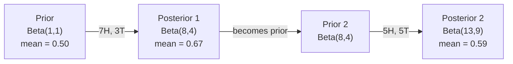

# Bayes' Theorem | 贝叶斯定理

> Probability is about what you expect. Bayes' theorem is about what you learn.
> 概率关乎你的期望。贝叶斯定理关乎你学到的。

**Type:** Build | **类型:** 动手
**Language:** Python | **语言:** Python
**Prerequisites:** Phase 1, Lesson 06 (Probability Fundamentals) | **前置知识:** Phase 1, Lesson 06（概率基础）
**Time:** ~75 minutes | **时间:** ~75 分钟

## Learning Objectives | 学习目标

- Apply Bayes' theorem to compute posterior probabilities from priors, likelihoods, and evidence
- Build a Naive Bayes text classifier from scratch with Laplace smoothing and log-space computation
- Compare MLE and MAP estimation and explain how MAP corresponds to L2 regularization
- Implement sequential Bayesian updating using Beta-Binomial conjugate priors for A/B testing

> **【中文解读】**
> 贝叶斯定理的核心思想：用新的证据更新你的信念。先验概率（你原本的猜测）× 似然（证据出现的概率）= 后验概率（更新后的猜测）。本章还从零构建朴素贝叶斯文本分类器。

> **【拓展：贝叶斯在 AI 中的位置】**
> - **朴素贝叶斯分类器**: 垃圾邮件过滤的经典算法，sklearn 中的 `GaussianNB`/`MultinomialNB`。
> - **贝叶斯优化**: 用于超参数调优（如 Optuna），比网格搜索高效得多。
> - **MAP 与正则化**: 最大后验估计(MAP)等价于 L2 正则化——这是贝叶斯视角下的"防止过拟合"。

## The Problem | 问题引入

> **【中文解读】** 一个医学检测准确率 99%，你测出阳性，实际患病概率是多少？直觉说 99%，但用贝叶斯定理算可能只有 50%——因为要先考虑"先验概率"（发病率有多低）。贝叶斯定理教会我们：看到新证据后如何更新信念。

## The Concept | 核心概念

> **【拓展：贝叶斯思维是 AI 的核心范式】** 贝叶斯定理 `P(假设|证据) = P(证据|假设) × P(假设) / P(证据)` 在 AI 中无处不在：(1) **朴素贝叶斯分类器**：垃圾邮件过滤的经典方法；(2) **贝叶斯优化**：调超参数的高效方法（比网格搜索快 10 倍）；(3) **MAP = L2 正则化**：最大后验估计等价于加 L2 惩罚项，从贝叶斯角度解释了为什么正则化能防过拟合；(4) **贝叶斯神经网络**：输出不确定性估计，知道"我不知道"。

Most people say 99%. The real answer depends on how rare the disease is. If 1 in 10,000 people have it, a positive result only gives you about a 1% chance of being sick. The other 99% of positive results are false alarms from healthy people.

> 大多数人说 99%。真实答案取决于疾病有多罕见。如果万分之一的人患病，阳性结果只给你大约 1% 的患病概率。其余 99% 的阳性结果都是健康人的假阳性。

This is not a trick question. It is Bayes' theorem. Every spam filter, every medical diagnostic, every machine learning model that quantifies uncertainty uses this exact reasoning. You start with a belief. You see evidence. You update.

> 这不是脑筋急转弯。这是贝叶斯定理。每个垃圾邮件过滤器、每个医疗诊断、每个量化不确定性的 ML 模型都使用同样的推理：从信念出发，看到证据，更新信念。

If you build ML systems without understanding this, you will misinterpret model outputs, set bad thresholds, and ship overconfident predictions.

> 如果不理解这一点就构建 ML 系统，你会误判模型输出、设置错误的阈值、发布过度自信的预测。

## The Concept | 核心概念

### From joint probability to Bayes

You already know from Lesson 06 that conditional probability is:

> 你在第 06 课已经学过条件概率：

```
P(A|B) = P(A and B) / P(B)
```

And symmetrically:

```
P(B|A) = P(A and B) / P(A)
```

Both expressions share the same numerator: P(A and B). Set them equal and rearrange:

> 两个表达式共用相同的分子：P(A and B)。将它们等同并重新排列：

```
P(A and B) = P(A|B) * P(B) = P(B|A) * P(A)

Therefore:

P(A|B) = P(B|A) * P(A) / P(B)
```

That is Bayes' theorem. Four quantities, one equation.

> 这就是贝叶斯定理。四个量，一个等式。

### The four parts

| Part | Name | What it means |
|------|------|---------------|
| P(A\|B) | Posterior / 后验 | Your updated belief about A after seeing evidence B / 看到证据 B 后对 A 的更新信念 |
| P(B\|A) | Likelihood / 似然 | How probable the evidence B is if A is true / 如果 A 为真，证据 B 出现的概率 |
| P(A) | Prior / 先验 | Your belief about A before seeing any evidence / 看到任何证据前对 A 的信念 |
| P(B) | Evidence / 证据 | Total probability of seeing B under all possibilities / 在所有可能情况下看到 B 的总概率 |

The evidence term P(B) acts as a normalizer. You can expand it using the law of total probability:

> 证据项 P(B) 作为归一化因子。可以用全概率公式展开：

```
P(B) = P(B|A) * P(A) + P(B|not A) * P(not A)
```

### Medical test example

A disease affects 1 in 10,000 people. The test is 99% accurate (catches 99% of sick people, gives false positives 1% of the time).

> 一种疾病影响万分之一的人。检测准确率 99%（能发现 99% 的患者，假阳性率 1%）。

```
P(sick)          = 0.0001     (prior: disease is rare)
P(positive|sick) = 0.99       (likelihood: test catches it)
P(positive|healthy) = 0.01    (false positive rate)

P(positive) = P(positive|sick) * P(sick) + P(positive|healthy) * P(healthy)
            = 0.99 * 0.0001 + 0.01 * 0.9999
            = 0.000099 + 0.009999
            = 0.010098

P(sick|positive) = P(positive|sick) * P(sick) / P(positive)
                 = 0.99 * 0.0001 / 0.010098
                 = 0.0098
                 = 0.98%
```

Less than 1%. The prior dominates. When a condition is rare, even accurate tests produce mostly false positives. This is why doctors order confirmation tests.

> 不到 1%。先验概率占主导。当疾病罕见时，即使精确的检测也主要产生假阳性。这就是为什么医生要求复查。

### Spam filter example

You receive an email containing the word "lottery". Is it spam?

> 你收到一封包含"lottery"（彩票）的邮件。它是垃圾邮件吗？

```
P(spam)                = 0.3      (30% of email is spam)
P("lottery"|spam)      = 0.05     (5% of spam emails contain "lottery")
P("lottery"|not spam)  = 0.001    (0.1% of legitimate emails contain "lottery")

P("lottery") = 0.05 * 0.3 + 0.001 * 0.7
             = 0.015 + 0.0007
             = 0.0157

P(spam|"lottery") = 0.05 * 0.3 / 0.0157
                  = 0.955
                  = 95.5%
```

One word shifts the probability from 30% to 95.5%. A real spam filter applies Bayes across hundreds of words simultaneously.

> 一个词将概率从 30% 推到 95.5%。真实的垃圾邮件过滤器同时跨数百个词应用贝叶斯。

### Naive Bayes: independence assumption

Naive Bayes extends this to multiple features by assuming all features are conditionally independent given the class:

> 朴素贝叶斯将此扩展到多个特征，假设所有特征在给定类别的条件下相互独立：

```
P(class | feature_1, feature_2, ..., feature_n)
  = P(class) * P(feature_1|class) * P(feature_2|class) * ... * P(feature_n|class)
    / P(feature_1, feature_2, ..., feature_n)
```

The "naive" part is the independence assumption. In text, word occurrences are not independent ("New" and "York" are correlated). But the assumption works surprisingly well in practice because the classifier only needs to rank classes, not produce calibrated probabilities.

> "朴素"部分是独立性假设。在文本中，词的出现并不独立（"New" 和 "York" 相关）。但这个假设在实践中出奇地好用，因为分类器只需排序类别，不需要校准概率。

Since the denominator is the same for all classes, you can skip it and just compare numerators:

> 由于分母对所有类别都相同，可以跳过它，只比较分子：

```
score(class) = P(class) * product of P(feature_i | class)
```

Pick the class with the highest score.

> 选择得分最高的类别。

### Maximum likelihood estimation (MLE)

How do you get P(feature|class) from training data? Count.

> 如何从训练数据中得到 P(feature|class)？计数。

```
P("free"|spam) = (number of spam emails containing "free") / (total spam emails)
```

This is MLE: choose the parameter values that make the observed data most likely. You are maximizing the likelihood function, which for discrete counts reduces to relative frequency.

> 这就是 MLE（最大似然估计）：选择使观测数据最可能出现的参数值。你在最大化似然函数，对于离散计数它简化为相对频率。

Problem: if a word never appears in spam during training, MLE gives it probability zero. One unseen word kills the entire product. Fix this with Laplace smoothing:

> 问题：如果一个词在训练期间从未出现在垃圾邮件中，MLE 给它概率零。一个未见过的词就会摧毁整个乘积。用拉普拉斯平滑来修复：

```
P(word|class) = (count(word, class) + 1) / (total_words_in_class + vocabulary_size)
```

Adding 1 to every count ensures no probability is ever zero.

> 给每个计数加 1 确保概率永远不会为零。

### Maximum a posteriori (MAP)

MLE asks: what parameters maximize P(data|parameters)?

> MLE 问：什么参数使 P(data|parameters) 最大？

MAP asks: what parameters maximize P(parameters|data)?

> MAP 问：什么参数使 P(parameters|data) 最大？

By Bayes' theorem:

> 根据贝叶斯定理：

```
P(parameters|data) proportional to P(data|parameters) * P(parameters)
```

MAP adds a prior over the parameters themselves. If you believe parameters should be small, you encode that as a prior that penalizes large values. This is identical to L2 regularization in ML. The "ridge" penalty in ridge regression is literally a Gaussian prior on the weights.

> MAP 在参数本身上加了一个先验。如果你认为参数应该较小，就用先验惩罚大值。这与 ML 中的 L2 正则化完全等价。岭回归中的"岭"惩罚本质上就是权重的高斯先验。

| Estimation | Optimizes | ML equivalent |
|------------|-----------|---------------|
| MLE | P(data\|params) | Unregularized training / 无正则化训练 |
| MAP | P(data\|params) * P(params) | L2 / L1 regularization / L2/L1 正则化 |

### Bayesian vs frequentist: the practical difference

Frequentists treat parameters as fixed unknowns. They ask: "If I repeated this experiment many times, what would happen?"

> 频率学派将参数视为固定的未知量。他们问："如果我重复这个实验很多次，会发生什么？"

Bayesians treat parameters as distributions. They ask: "Given what I have observed, what do I believe about the parameters?"

> 贝叶斯学派将参数视为分布。他们问："根据我观察到的，我对参数有什么信念？"

For building ML systems, the practical difference:

> 对于构建 ML 系统，实际区别在于：

| Aspect | Frequentist | Bayesian |
|--------|-------------|----------|
| Output | Point estimate / 点估计 | Distribution over values / 值的分布 |
| Uncertainty | Confidence intervals (about procedure) / 置信区间（关于过程） | Credible intervals (about parameter) / 可信区间（关于参数） |
| Small data | Can overfit / 可能过拟合 | Prior acts as regularization / 先验充当正则化 |
| Computation | Usually faster / 通常更快 | Often requires sampling (MCMC) / 通常需要采样（MCMC） |

Most production ML is frequentist (SGD, point estimates). Bayesian methods shine when you need calibrated uncertainty (medical decisions, safety-critical systems) or when data is scarce (few-shot learning, cold start).

> 大多数生产 ML 是频率学派的（SGD、点估计）。当你需要校准的不确定性（医疗决策、安全关键系统）或数据稀少时（少样本学习、冷启动），贝叶斯方法表现出色。

### Why Bayesian thinking matters for ML

The connection is deeper than analogy:

> 这种联系比类比更深：

**Priors are regularization.** A Gaussian prior on weights is L2 regularization. A Laplace prior is L1. Every time you add a regularization term, you are making a Bayesian statement about what parameter values you expect.

> **先验就是正则化。** 权重上的高斯先验就是 L2 正则化，拉普拉斯先验就是 L1。每次你添加正则化项，就是在做一个关于参数期望值的贝叶斯声明。

**Posteriors are uncertainty.** A single predicted probability tells you nothing about how confident the model is in that estimate. Bayesian methods give you a distribution: "I think P(spam) is between 0.8 and 0.95."

> **后验就是不确定性。** 单个预测概率不能告诉你模型对这个估计有多自信。贝叶斯方法给你一个分布："我认为 P(spam) 在 0.8 到 0.95 之间。"

**Bayes updates are online learning.** Today's posterior becomes tomorrow's prior. When your model sees new data, it updates its beliefs incrementally instead of retraining from scratch.

> **贝叶斯更新就是在线学习。** 今天的后验成为明天的先验。当模型看到新数据时，它增量更新信念而不是从头重新训练。

**Model comparison is Bayesian.** Bayesian information criterion (BIC), marginal likelihood, and Bayes factors all use Bayesian reasoning to choose between models without overfitting.

> **模型比较是贝叶斯的。** 贝叶斯信息准则（BIC）、边际似然和贝叶斯因子都使用贝叶斯推理来在模型之间选择而不导致过拟合。

## Build It | 动手实现

### Step 1: Bayes theorem function

```python
def bayes(prior, likelihood, false_positive_rate):
    evidence = likelihood * prior + false_positive_rate * (1 - prior)
    posterior = likelihood * prior / evidence
    return posterior

result = bayes(prior=0.0001, likelihood=0.99, false_positive_rate=0.01)
print(f"P(sick|positive) = {result:.4f}")
```

### Step 2: Naive Bayes classifier

```python
import math
from collections import defaultdict

class NaiveBayes:
    def __init__(self, smoothing=1.0):
        self.smoothing = smoothing
        self.class_counts = defaultdict(int)
        self.word_counts = defaultdict(lambda: defaultdict(int))
        self.class_word_totals = defaultdict(int)
        self.vocab = set()

    def train(self, documents, labels):
        for doc, label in zip(documents, labels):
            self.class_counts[label] += 1
            words = doc.lower().split()
            for word in words:
                self.word_counts[label][word] += 1
                self.class_word_totals[label] += 1
                self.vocab.add(word)

    def predict(self, document):
        words = document.lower().split()
        total_docs = sum(self.class_counts.values())
        vocab_size = len(self.vocab)
        best_class = None
        best_score = float("-inf")
        for cls in self.class_counts:
            score = math.log(self.class_counts[cls] / total_docs)
            for word in words:
                count = self.word_counts[cls].get(word, 0)
                total = self.class_word_totals[cls]
                score += math.log((count + self.smoothing) / (total + self.smoothing * vocab_size))
            if score > best_score:
                best_score = score
                best_class = cls
        return best_class
```

Log probabilities prevent underflow. Multiplying many small probabilities produces numbers too tiny for floating point. Summing log-probabilities is numerically stable and mathematically equivalent.

> 对数概率防止下溢。许多小概率相乘产生对浮点数来说太小的数字。对数概率求和数值稳定且数学等价。

### Step 3: Train on spam data

```python
train_docs = [
    "win free money now",
    "free lottery ticket winner",
    "claim your prize today free",
    "urgent offer free cash",
    "congratulations you won free",
    "meeting tomorrow at noon",
    "project update attached",
    "can we schedule a call",
    "quarterly report review",
    "lunch on thursday sounds good",
    "team standup notes attached",
    "please review the pull request",
]

train_labels = [
    "spam", "spam", "spam", "spam", "spam",
    "ham", "ham", "ham", "ham", "ham", "ham", "ham",
]

classifier = NaiveBayes()
classifier.train(train_docs, train_labels)

test_messages = [
    "free money waiting for you",
    "meeting rescheduled to friday",
    "you won a free prize",
    "please review the attached report",
]

for msg in test_messages:
    print(f"  '{msg}' -> {classifier.predict(msg)}")
```

### Step 4: Inspect the learned probabilities

```python
def show_top_words(classifier, cls, n=5):
    vocab_size = len(classifier.vocab)
    total = classifier.class_word_totals[cls]
    probs = {}
    for word in classifier.vocab:
        count = classifier.word_counts[cls].get(word, 0)
        probs[word] = (count + classifier.smoothing) / (total + classifier.smoothing * vocab_size)
    sorted_words = sorted(probs.items(), key=lambda x: x[1], reverse=True)
    for word, prob in sorted_words[:n]:
        print(f"    {word}: {prob:.4f}")

print("\nTop spam words:")
show_top_words(classifier, "spam")
print("\nTop ham words:")
show_top_words(classifier, "ham")
```

## Use It | 用框架实现

Scikit-learn ships production-ready naive Bayes implementations:

> Scikit-learn 提供了生产就绪的朴素贝叶斯实现：

```python
from sklearn.feature_extraction.text import CountVectorizer
from sklearn.naive_bayes import MultinomialNB
from sklearn.metrics import classification_report

vectorizer = CountVectorizer()
X_train = vectorizer.fit_transform(train_docs)
clf = MultinomialNB()
clf.fit(X_train, train_labels)

X_test = vectorizer.transform(test_messages)
predictions = clf.predict(X_test)
for msg, pred in zip(test_messages, predictions):
    print(f"  '{msg}' -> {pred}")
```

Same algorithm. CountVectorizer handles tokenization and vocabulary building. MultinomialNB handles smoothing and log-probabilities internally. Your from-scratch version does the same thing in 40 lines.

> 同样的算法。CountVectorizer 处理分词和词汇构建，MultinomialNB 内部处理平滑和对数概率。你的从零版本用 40 行做了同样的事。

## Ship It | 产出物

The NaiveBayes class built here demonstrates the full pipeline: tokenization, probability estimation with Laplace smoothing, log-space prediction. The code in `code/bayes.py` runs end-to-end with no dependencies beyond Python's standard library.

> 这里构建的 NaiveBayes 类演示了完整流程：分词、带拉普拉斯平滑的概率估计、对数空间预测。`code/bayes.py` 中的代码端到端运行，无需 Python 标准库之外的依赖。

### Conjugate Priors

When the prior and posterior belong to the same family of distributions, the prior is called "conjugate." This makes Bayesian updating algebraically clean -- you get a closed-form posterior without numerical integration.

> 当先验和后验属于同一分布族时，先验被称为"共轭的"。这让贝叶斯更新在代数上很简洁——无需数值积分就能得到封闭形式的后验。

| Likelihood | Conjugate Prior | Posterior | Example |
|-----------|----------------|-----------|---------|
| Bernoulli | Beta(a, b) | Beta(a + successes, b + failures) | Coin flip bias estimation / 抛硬币偏差估计 |
| Normal (known variance) | Normal(mu_0, sigma_0) | Normal(weighted mean, smaller variance) | Sensor calibration / 传感器校准 |
| Poisson | Gamma(a, b) | Gamma(a + sum of counts, b + n) | Modeling arrival rates / 建模到达率 |
| Multinomial | Dirichlet(alpha) | Dirichlet(alpha + counts) | Topic modeling, language models / 主题建模，语言模型 |

Why this matters: without conjugate priors, you need Monte Carlo sampling or variational inference to approximate the posterior. With conjugate priors, you just update two numbers.

> 为什么这很重要：没有共轭先验，你需要蒙特卡洛采样或变分推断来近似后验。有了共轭先验，只需更新两个数字。

The Beta distribution is the most common conjugate prior in practice. Beta(a, b) represents your belief about a probability parameter. The mean is a/(a+b). The larger a+b, the more concentrated (confident) the distribution.

> Beta 分布是实践中最常用的共轭先验。Beta(a, b) 表示你对一个概率参数的信念。均值是 a/(a+b)。a+b 越大，分布越集中（越自信）。

Special cases of the Beta prior:
- Beta(1, 1) = uniform. You have no opinion about the parameter.
  中文翻译：均匀分布，你对参数没有任何看法。
- Beta(10, 10) = peaked at 0.5. You strongly believe the parameter is near 0.5.
  中文翻译：在 0.5 处尖峰，你强烈认为参数接近 0.5。
- Beta(1, 10) = skewed toward 0. You believe the parameter is small.
  中文翻译：偏向 0，你认为参数很小。

The update rule is dead simple:

> 更新规则极其简单：

```
Prior:     Beta(a, b)
Data:      s successes, f failures
Posterior: Beta(a + s, b + f)
```

No integrals. No sampling. Just addition.

> 无需积分，无需采样，只需加法。

### Sequential Bayesian Updating

Bayesian inference is naturally sequential. Today's posterior becomes tomorrow's prior. This is how real systems learn incrementally without reprocessing all historical data.

> 贝叶斯推断天然是序贯的。今天的后验变成明天的先验。这就是真实系统如何在不重新处理所有历史数据的情况下增量学习。

Concrete example: estimating whether a coin is fair.

> 具体示例：估计一枚硬币是否公平。

**Day 1: No data yet.**
Start with Beta(1, 1) -- a uniform prior. You have no opinion.
- Prior mean: 0.5
- Prior is flat across [0, 1]

> **第 1 天：还没有数据。** 从 Beta(1, 1) 开始——均匀先验，你没有预设观点。

**Day 2: Observe 7 heads, 3 tails.**
Posterior = Beta(1 + 7, 1 + 3) = Beta(8, 4)
- Posterior mean: 8/12 = 0.667
- Evidence suggests the coin is biased toward heads

> **第 2 天：观察到 7 次正面，3 次反面。** 后验 = Beta(8, 4)，均值 0.667，证据暗示硬币偏向正面。

**Day 3: Observe 5 more heads, 5 more tails.**
Use yesterday's posterior as today's prior.
Posterior = Beta(8 + 5, 4 + 5) = Beta(13, 9)
- Posterior mean: 13/22 = 0.591
- The balanced new data pulled the estimate back toward 0.5

> **第 3 天：又观察 5 次正面，5 次反面。** 用昨天的后验作为今天的先验。后验 = Beta(13, 9)，均值 0.591。均衡的新数据将估计值拉回 0.5。



The order of observations does not matter. Beta(1,1) updated with all 12 heads and 8 tails at once gives Beta(13, 9) -- the same result. Sequential updating and batch updating are mathematically equivalent. But sequential updating lets you make decisions at each step without storing raw data.

> 观测顺序无关紧要。Beta(1,1) 一次性用全部 12 次正面和 8 次反面更新得到 Beta(13, 9)——同样的结果。序贯更新和批量更新在数学上等价。但序贯更新让你可以在每步做决策而无需存储原始数据。

This is the foundation of online learning in production ML systems. Thompson sampling for bandits, incremental recommendation systems, and streaming anomaly detectors all use this pattern.

> 这是生产 ML 系统中在线学习的基础。用于赌博机问题的 Thompson 采样、增量推荐系统和流式异常检测器都使用这种模式。

### Connection to A/B Testing

A/B testing is Bayesian inference in disguise.

> A/B 测试就是伪装的贝叶斯推断。

Setup: you are testing two button colors. Variant A (blue) and variant B (green). You want to know which one gets more clicks.

> 设置：你在测试两种按钮颜色。变体 A（蓝色）和变体 B（绿色）。你想知道哪个获得更多点击。

The Bayesian A/B test:

> 贝叶斯 A/B 测试步骤：

1. **Prior.** Start with Beta(1, 1) for both variants. No prior preference.
2. **Data.** Variant A: 50 clicks out of 1000 views. Variant B: 65 clicks out of 1000 views.
3. **Posteriors.**
   - A: Beta(1 + 50, 1 + 950) = Beta(51, 951). Mean = 0.051
   - B: Beta(1 + 65, 1 + 935) = Beta(66, 936). Mean = 0.066
4. **Decision.** Compute P(B > A) -- the probability that B's true conversion rate is higher than A's.

Computing P(B > A) analytically is hard. But Monte Carlo makes it trivial:

> 解析计算 P(B > A) 很难。但蒙特卡洛让这变得轻而易举：

```
1. Draw 100,000 samples from Beta(51, 951)  -> samples_A
2. Draw 100,000 samples from Beta(66, 936)  -> samples_B
3. P(B > A) = fraction of samples where B > A
```

If P(B > A) > 0.95, you ship variant B. If it is between 0.05 and 0.95, you keep collecting data. If P(B > A) < 0.05, you ship variant A.

> 如果 P(B > A) > 0.95，发布变体 B。如果在 0.05 和 0.95 之间，继续收集数据。如果 P(B > A) < 0.05，发布变体 A。

Advantages over frequentist A/B testing:
- You get a direct probability statement: "there is a 97% chance B is better"
  中文翻译：你得到一个直接的概率陈述："B 更好的概率是 97%"
- No p-value confusion. No "fail to reject the null hypothesis" hedging.
  中文翻译：没有 p 值的混淆，没有"未能拒绝零假设"的含糊措辞。
- You can check results at any time without inflating false positive rates (no "peeking problem")
  中文翻译：你可以在任何时候查看结果而不会增加假阳性率（没有"偷看问题"）
- You can incorporate prior knowledge (e.g., previous tests suggest conversion rates are usually 3-8%)
  中文翻译：你可以融入先验知识（例如，之前的测试表明转化率通常在 3-8%）

| Aspect | Frequentist A/B | Bayesian A/B |
|--------|----------------|--------------|
| Output | p-value / p 值 | P(B > A) |
| Interpretation | "How surprising is this data if A=B?" / "如果 A=B，数据有多令人惊讶？" | "How likely is B better than A?" / "B 比 A 好的可能性有多大？" |
| Early stopping | Inflates false positives / 会增加假阳性 | Safe at any point (given a well-chosen prior and correctly specified model) / 随时安全（假设先验选择合理且模型正确） |
| Prior knowledge | Not used / 不使用 | Encoded as Beta prior / 编码为 Beta 先验 |
| Decision rule | p < 0.05 | P(B > A) > threshold / P(B > A) > 阈值 |

## Exercises | 练习题

1. **Multiple tests.** A patient tests positive twice on independent tests (both 99% accurate, disease prevalence 1 in 10,000). What is P(sick) after both tests? Use the posterior from the first test as the prior for the second.

2. **Smoothing impact.** Run the spam classifier with smoothing values of 0.01, 0.1, 1.0, and 10.0. How do the top word probabilities change? What happens with smoothing=0 and a word that appears only in ham?

3. **Add features.** Extend the NaiveBayes class to also use message length (short/long) as a feature alongside word counts. Estimate P(short|spam) and P(short|ham) from the training data and fold it into the prediction score.

4. **MAP by hand.** Given observed data (7 heads in 10 coin flips), compute the MAP estimate of the bias using a Beta(2,2) prior. Compare it to the MLE estimate (7/10).

## Key Terms | 术语速查表

| Term | What people say | What it actually means |
|------|----------------|----------------------|
| Prior | "My initial guess" / "我的初始猜测" | P(hypothesis) before observing evidence. In ML: the regularization term. / 观测证据前的 P(hypothesis)。在 ML 中：正则化项。 |
| Likelihood | "How well the data fits" / "数据拟合得好不好" | P(evidence\|hypothesis). How probable the observed data is under a specific hypothesis. / 在特定假设下观测数据的概率。 |
| Posterior | "My updated belief" / "我的更新信念" | P(hypothesis\|evidence). The prior multiplied by the likelihood, then normalized. / 先验乘以似然再归一化。 |
| Evidence | "The normalizing constant" / "归一化常数" | P(data) across all hypotheses. Ensures the posterior sums to 1. / 所有假设下 P(data) 的总和，确保后验求和为 1。 |
| Naive Bayes | "That simple text classifier" / "那个简单的文本分类器" | A classifier that assumes features are independent given the class. Works well despite the false assumption. / 假设特征在给定类别下独立的分类器，尽管假设不成立但效果很好。 |
| Laplace smoothing | "Add-one smoothing" / "加一平滑" | Adding a small count to every feature to prevent zero probabilities from unseen data. / 给每个特征加一个小计数以防止未见数据的零概率。 |
| MLE | "Just use the frequencies" / "直接用频率" | Choose parameters that maximize P(data\|parameters). No prior. Can overfit with small data. / 选择使 P(data\|parameters) 最大的参数。无先验，小数据可能过拟合。 |
| MAP | "MLE with a prior" / "带先验的 MLE" | Choose parameters that maximize P(data\|parameters) * P(parameters). Equivalent to regularized MLE. / 选择使 P(data\|parameters) * P(parameters) 最大的参数，等价于正则化 MLE。 |
| Log-probability | "Work in log space" / "在对数空间计算" | Using log(P) instead of P to avoid floating-point underflow when multiplying many small numbers. / 用 log(P) 代替 P，避免许多小数相乘时的浮点下溢。 |
| False positive | "A wrong alarm" / "错误警报" | The test says positive, but the true state is negative. Drives the base rate fallacy. / 检测为阳性但实际为阴性，是基本比率谬误的根源。 |

## Further Reading | 延伸阅读

- [3Blue1Brown: Bayes' theorem](https://www.youtube.com/watch?v=HZGCoVF3YvM) - visual explanation with the medical test example
- [Stanford CS229: Generative Learning Algorithms](https://cs229.stanford.edu/notes2022fall/cs229-notes2.pdf) - naive Bayes and its connection to discriminative models
- [Think Bayes](https://greenteapress.com/wp/think-bayes/) - free book, Bayesian statistics with Python code
- [scikit-learn Naive Bayes](https://scikit-learn.org/stable/modules/naive_bayes.html) - production implementations and when to use each variant
