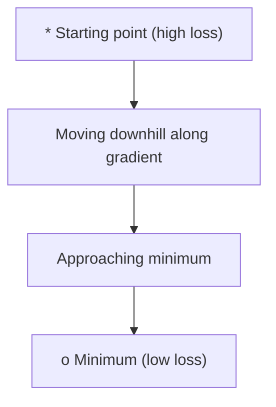
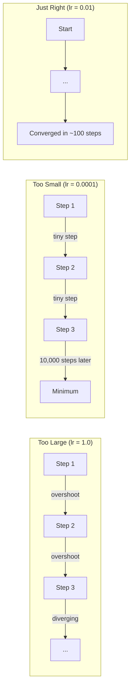
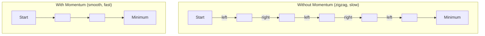
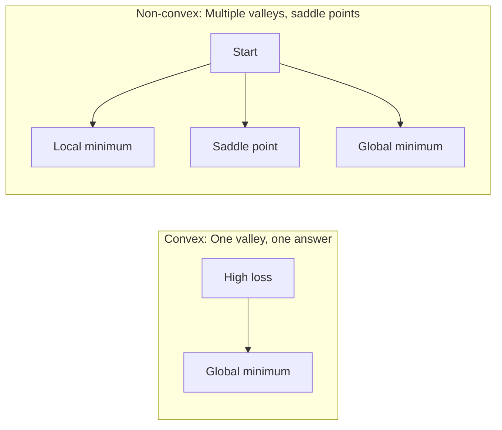
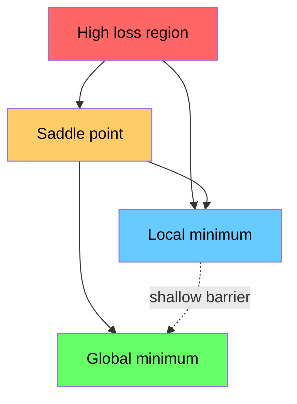

# Optimization | 优化

> Training a neural network is nothing more than finding the bottom of a valley.
> 训练神经网络无非就是找到山谷的最低点。

**Type:** Build | **类型:** 动手
**Language:** Python | **语言:** Python
**Prerequisites:** Phase 1, Lessons 04-05 (Derivatives, Gradients) | **前置知识:** Phase 1, Lessons 04-05 (Derivatives, Gradients)
**Time:** ~75 minutes | **时间:** ~75 分钟

## Learning Objectives | 学习目标

- Implement vanilla gradient descent, SGD with momentum, and Adam from scratch
  从零实现原始梯度下降、带动量的 SGD 和 Adam 优化器
- Compare optimizer convergence on the Rosenbrock function and explain why Adam adapts per-weight learning rates
  在 Rosenbrock 函数上比较优化器的收敛性，解释为什么 Adam 为每个权重自适应学习率
- Distinguish convex from non-convex loss landscapes and explain the role of saddle points in high dimensions
  区分凸与非凸损失曲面，解释高维空间中鞍点的作用
- Configure learning rate schedules (step decay, cosine annealing, warmup) for training stability
  配置学习率调度（步衰减、余弦退火、预热）以保证训练稳定性

> **【中文解读】**
> 训练神经网络就是"找山谷最低点"。损失函数告诉你当前有多错，梯度告诉你哪个方向能让误差更小，优化器决定你怎么走。本章从零实现 SGD、Momentum 和 Adam——PyTorch 中最常用的三个优化器。

> **【拓展：优化器在 AI 中的位置】**
> - **SGD**: 最基础的优化器，所有优化器的"祖先"。
> - **Adam**: 目前最流行的优化器，自适应学习率 + 动量，几乎成了默认选择。
> - **学习率调度**: 训练初期用大步长快速接近最优，后期用小步长精细调整。Cosine Annealing 和 Warmup 是 Transformer 训练的标准配置。

## The Problem | 问题引入

You have a loss function. It tells you how wrong your model is. You have gradients. They tell you which direction makes the loss worse. Now you need a strategy for walking downhill.

> 你有损失函数，它告诉你模型有多差。你有梯度，它告诉你哪个方向让损失更大。现在你需要一个策略走向谷底。

The naive approach is simple: move opposite the gradient. Scale the step by some number called the learning rate. Repeat. This is gradient descent, and it works. But "works" has caveats. Too large a learning rate and you overshoot the valley entirely, bouncing between walls. Too small and you crawl toward the answer over thousands of unnecessary steps. Hit a saddle point and you stop moving even though you have not found a minimum.

> 朴素方法很简单：沿梯度反方向移动，步长由学习率控制。不断重复。这就是梯度下降。但"有效"是有条件的：学习率太大，你会跳过谷底在两壁间来回震荡；太小，你会在数千步不必要的迭代中缓慢爬行。碰到鞍点，你会停下来但并未到达最低点。

Every optimizer in deep learning is an answer to the same question: how do you get to the bottom of the valley faster and more reliably?

> 深度学习中的每个优化器都在回答同一个问题：如何更快、更可靠地到达谷底？

> **【中文解读】** 你有损失函数（告诉你有多错）和梯度（告诉你哪个方向能让误差更小）。现在需要一个策略"走到山谷最低点"。朴素方法：沿梯度反方向走。学习率太大→跳过最低点来回震荡；太小→走几千步才到。鞍点→停下来但没到最低。所有优化器都在回答同一个问题：怎么更快更稳地走到谷底？

## The Concept | 核心概念

### What optimization means | 什么是优化

Optimization is finding the input values that minimize (or maximize) a function. In machine learning, the function is the loss. The inputs are the model's weights. Training is optimization.

> 优化就是找到使函数最小化（或最大化）的输入值。在机器学习中，函数是损失函数，输入是模型权重。训练就是优化。

```
minimize L(w) where:
  L = loss function
  w = model weights (could be millions of parameters)
```

> **【拓展：优化是机器学习的引擎】** 训练 = 优化。GPT-4 的训练过程就是：用 1.8 万亿参数的损失函数，通过 Adam 优化器迭代调整参数，使预测越来越准确。训练一个大型 Transformer 可能需要 10^20 次 FLOPS 的计算，但核心操作就是反复执行 `w = w - lr * gradient`。

### Gradient descent (vanilla) | 梯度下降（原始版）

The simplest optimizer. Compute the gradient of the loss with respect to every weight. Move each weight in the opposite direction of its gradient. Scale the step by the learning rate.

> 最简单的优化器。计算损失对每个权重的梯度，沿反方向移动，步长由学习率控制。

```
w = w - lr * gradient
```

That is the entire algorithm. One line.

> 这就是完整的算法。一行代码。

> **【中文解读】** 梯度下降：计算损失对每个权重的梯度，沿反方向走一步，步长由学习率控制。`w = w - lr * gradient`，一行的完整算法。直觉：蒙着眼下山，每一步都朝最陡的下坡方向走。



### Learning rate: the most important hyperparameter | 学习率：最重要的超参数

The learning rate controls step size. It determines everything about convergence.

> 学习率控制步长，决定了收敛的一切。



There is no formula for the right learning rate. You find it by experiment. Common starting points: 0.001 for Adam, 0.01 for SGD with momentum.

> 没有公式能告诉你正确的学习率。你只能通过实验找到。常见起点：Adam 用 0.001，SGD with momentum 用 0.01。

> **【拓展：学习率选择的实践指南】** 学习率是最难调的超参数。经验法则：从 0.001 开始（Adam 的默认值），观察训练曲线。损失不降→学习率太小；损失震荡→学习率太大。Transformer 训练标准配置：warmup（前 N 步从 0 线性增到 0.001）+ cosine decay（之后余弦衰减到 0）。GPT-3 使用了 0.6 的峰值学习率配合 warmup。

### SGD vs batch vs mini-batch | SGD vs 全批量 vs 小批量

Vanilla gradient descent computes the gradient over the entire dataset before taking one step. This is called batch gradient descent. It is stable but slow.

> 原始梯度下降在走一步之前用全部数据计算梯度。这叫全批量梯度下降，稳定但慢。

Stochastic gradient descent (SGD) computes the gradient on a single random sample and steps immediately. It is noisy but fast.

> 随机梯度下降 (SGD) 在单个随机样本上计算梯度后立即更新。噪声大但快。

Mini-batch gradient descent splits the difference. Compute the gradient over a small batch (32, 64, 128, 256 samples), then step. This is what everyone actually uses.

> 小批量梯度下降取折中方案：用一小批数据（32、64、128、256 个样本）计算梯度后更新。这是实际中最常用的方式。

| Variant | Batch size | Gradient quality | Speed per step | Noise |
|---------|-----------|-----------------|---------------|-------|
| Batch GD / 全批量 | Entire dataset | Exact / 精确 | Slow / 慢 | None / 无 |
| SGD / 随机 | 1 sample | Very noisy / 噪声大 | Fast / 快 | High / 高 |
| Mini-batch / 小批量 | 32-256 | Good estimate / 好的估计 | Balanced / 均衡 | Moderate / 中等 |

The noise in SGD and mini-batch is not a bug. It helps escape shallow local minima and saddle points.

> SGD 和小批量中的噪声不是 bug，它有助于逃出浅层局部最小值和鞍点。

> **【中文解读】** 三种梯度计算方式：(1) 全批量——用全部数据算一次梯度，准但慢；(2) 随机 SGD——用一条数据算梯度，快但噪声大；(3) 小批量——折中方案，用 32/64/256 条数据。实际 AI 训练中几乎都用小批量，batch size 是另一个关键超参数。

### Momentum: the ball rolling downhill | 动量法：球从山坡滚下

Vanilla gradient descent only looks at the current gradient. If the gradient zigzags (common in narrow valleys), progress is slow. Momentum fixes this by accumulating past gradients into a velocity term.

> 原始梯度下降只看当前梯度。如果梯度呈锯齿形（在窄谷中常见），进展缓慢。动量法通过将历史梯度累积到速度项来解决这个问题。

```
v = beta * v + gradient
w = w - lr * v
```

The analogy: a ball rolling downhill. It does not stop and restart at every bump. It builds speed in consistent directions and dampens oscillations.

> 类比：球从山坡滚下。它不会在每个凸起处停下重启。它在一致的方向上积累速度，抑制震荡。



`beta` (typically 0.9) controls how much history to keep. Higher beta means more momentum, smoother paths, but slower response to direction changes.

> `beta`（通常为 0.9）控制保留多少历史。更高的 beta 意味着更大的动量、更平滑的路径，但对方向变化的响应更慢。

> **【拓展：动量在深度学习中的效果】** 动量法让优化"记住"之前的方向，像球滚下山坡一样积累动能。好处：(1) 加速通过平坦区域；(2) 抑制震荡（在窄谷中来回弹的问题）。PyTorch 中 `torch.optim.SGD(lr=0.1, momentum=0.9)` 的 momentum=0.9 是常用配置。

### Adam: adaptive learning rates | Adam：自适应学习率

Different weights need different learning rates. A weight that rarely gets large gradients should take bigger steps when it finally does. A weight that gets huge gradients constantly should take smaller steps.

> 不同的权重需要不同的学习率。很少获得大梯度的权重应该迈更大的步，持续获得大梯度的权重应该迈更小的步。

Adam (Adaptive Moment Estimation) tracks two things per weight:
  Adam（自适应矩估计）为每个权重跟踪两个量：

1. First moment (m): running average of gradients (like momentum)
   一阶矩 (m)：梯度的移动平均（类似动量）
2. Second moment (v): running average of squared gradients (gradient magnitude)
   二阶矩 (v)：梯度平方的移动平均（梯度大小）

```
m = beta1 * m + (1 - beta1) * gradient
v = beta2 * v + (1 - beta2) * gradient^2

m_hat = m / (1 - beta1^t)    bias correction
v_hat = v / (1 - beta2^t)    bias correction

w = w - lr * m_hat / (sqrt(v_hat) + epsilon)
```

The division by `sqrt(v_hat)` is the key insight. Weights with large gradients get divided by a large number (small effective step). Weights with small gradients get divided by a small number (large effective step). Each weight gets its own adaptive learning rate.

> 除以 `sqrt(v_hat)` 是关键洞见。梯度大的权重被大数除（有效步长小），梯度小的权重被小数除（有效步长大）。每个权重获得自己的自适应学习率。

Default hyperparameters: `lr=0.001, beta1=0.9, beta2=0.999, epsilon=1e-8`. These defaults work well for most problems.

> 默认超参数：`lr=0.001, beta1=0.9, beta2=0.999, epsilon=1e-8`。这些默认值对大多数问题都有效。

> **【中文解读】** Adam = Momentum + 自适应学习率。它为每个参数维护独立的"速度"，根据梯度历史自动调整步长。梯度大的参数走小步，梯度小的参数走大步。Adam 是目前最常用的优化器，PyTorch 中 `torch.optim.Adam(lr=0.001)` 几乎是默认选择。

### Learning rate schedules | 学习率调度

A fixed learning rate is a compromise. Early in training, you want large steps to make fast progress. Late in training, you want small steps to fine-tune near the minimum.

> 固定的学习率是折中方案。训练早期需要大步快速进展，训练后期需要小步精细调整。

Common schedules:
  常见调度方式：

| Schedule / 调度方式 | Formula / 公式 | Use case / 使用场景 |
|----------|---------|----------|
| Step decay / 步衰减 | lr = lr * factor every N epochs | Simple, manual control / 简单手动控制 |
| Exponential decay / 指数衰减 | lr = lr_0 * decay^t | Smooth reduction / 平滑递减 |
| Cosine annealing / 余弦退火 | lr = lr_min + 0.5 * (lr_max - lr_min) * (1 + cos(pi * t / T)) | Transformers, modern training / Transformer、现代训练 |
| Warmup + decay / 预热+衰减 | Linear ramp up, then decay | Large models, prevents early instability / 大模型，防止早期不稳定 |

### Convex vs non-convex | 凸优化 vs 非凸优化

A convex function has one minimum. Gradient descent always finds it. A quadratic like `f(x) = x^2` is convex.

> 凸函数只有一个最小值，梯度下降总能找到。像 `f(x) = x^2` 这样的二次函数是凸的。

Neural network loss functions are non-convex. They have many local minima, saddle points, and flat regions.

> 神经网络的损失函数是非凸的，有许多局部最小值、鞍点和平坦区域。



In practice, local minima in high-dimensional neural networks are rarely a problem. Most local minima have loss values close to the global minimum. Saddle points (flat in some directions, curved in others) are the real obstacle. Momentum and noise from mini-batches help escape them.

> 实践中，高维神经网络中的局部最小值很少是问题。大多数局部最小值的损失接近全局最小值。鞍点（某些方向平坦、某些方向弯曲）才是真正的障碍。动量和小批量的噪声有助于逃出鞍点。

> **【拓展：神经网络的损失曲面为什么是非凸的】** 线性回归的损失函数是凸的（只有一个最低点，一定能找到），但神经网络的损失曲面有无数个局部最低点和鞍点。在 100 万维的参数空间中，鞍点（某些维度上升、某些维度下降的点）比局部最低点多得多。好消息：Adam 等自适应优化器能有效逃离鞍点。这也是为什么深度学习需要好的优化器——而不仅仅靠梯度下降。

### Loss landscape visualization | 损失曲面可视化

The loss is a function of all weights. For a model with 1 million weights, the loss landscape lives in 1,000,001-dimensional space. We visualize it by picking two random directions in weight space and plotting the loss along those directions, producing a 2D surface.

> 损失是所有权重的函数。对于有 100 万个权重的模型，损失曲面存在于 1,000,001 维空间中。我们通过在权重空间中选取两个随机方向，沿这些方向绘制损失来可视化，得到 2D 曲面。



Sharp minima generalize poorly. Flat minima generalize well. This is one reason SGD with momentum often outperforms Adam on final test accuracy: its noise prevents settling into sharp minima.

> 尖锐的最小值泛化能力差，平坦的最小值泛化能力好。这是 SGD with momentum 在最终测试精度上经常优于 Adam 的原因之一：它的噪声防止陷入尖锐的最小值。

## Build It | 动手实现

### Step 1: Define a test function | 第1步：定义测试函数

The Rosenbrock function is a classic optimization benchmark. Its minimum is at (1, 1) inside a narrow curved valley that is easy to find but hard to follow.

> Rosenbrock 函数是经典的优化基准。它的最小值在 (1, 1)，位于一个容易找到但难以跟随的窄弯曲谷中。

```
f(x, y) = (1 - x)^2 + 100 * (y - x^2)^2
```

```python
def rosenbrock(params):
    x, y = params
    return (1 - x) ** 2 + 100 * (y - x ** 2) ** 2

def rosenbrock_gradient(params):
    x, y = params
    df_dx = -2 * (1 - x) + 200 * (y - x ** 2) * (-2 * x)
    df_dy = 200 * (y - x ** 2)
    return [df_dx, df_dy]
```

### Step 2: Vanilla gradient descent | 第2步：原始梯度下降

```python
class GradientDescent:
    def __init__(self, lr=0.001):
        self.lr = lr

    def step(self, params, grads):
        return [p - self.lr * g for p, g in zip(params, grads)]
```

### Step 3: SGD with momentum | 第3步：带动量的 SGD

```python
class SGDMomentum:
    def __init__(self, lr=0.001, momentum=0.9):
        self.lr = lr
        self.momentum = momentum
        self.velocity = None

    def step(self, params, grads):
        if self.velocity is None:
            self.velocity = [0.0] * len(params)
        self.velocity = [
            self.momentum * v + g
            for v, g in zip(self.velocity, grads)
        ]
        return [p - self.lr * v for p, v in zip(params, self.velocity)]
```

### Step 4: Adam | 第4步：Adam 优化器

```python
class Adam:
    def __init__(self, lr=0.001, beta1=0.9, beta2=0.999, epsilon=1e-8):
        self.lr = lr
        self.beta1 = beta1
        self.beta2 = beta2
        self.epsilon = epsilon
        self.m = None
        self.v = None
        self.t = 0

    def step(self, params, grads):
        if self.m is None:
            self.m = [0.0] * len(params)
            self.v = [0.0] * len(params)

        self.t += 1

        self.m = [
            self.beta1 * m + (1 - self.beta1) * g
            for m, g in zip(self.m, grads)
        ]
        self.v = [
            self.beta2 * v + (1 - self.beta2) * g ** 2
            for v, g in zip(self.v, grads)
        ]

        m_hat = [m / (1 - self.beta1 ** self.t) for m in self.m]
        v_hat = [v / (1 - self.beta2 ** self.t) for v in self.v]

        return [
            p - self.lr * mh / (vh ** 0.5 + self.epsilon)
            for p, mh, vh in zip(params, m_hat, v_hat)
        ]
```

### Step 5: Run and compare | 第5步：运行并比较

```python
def optimize(optimizer, func, grad_func, start, steps=5000):
    params = list(start)
    history = [params[:]]
    for _ in range(steps):
        grads = grad_func(params)
        params = optimizer.step(params, grads)
        history.append(params[:])
    return history

start = [-1.0, 1.0]

gd_history = optimize(GradientDescent(lr=0.0005), rosenbrock, rosenbrock_gradient, start)
sgd_history = optimize(SGDMomentum(lr=0.0001, momentum=0.9), rosenbrock, rosenbrock_gradient, start)
adam_history = optimize(Adam(lr=0.01), rosenbrock, rosenbrock_gradient, start)

for name, history in [("GD", gd_history), ("SGD+M", sgd_history), ("Adam", adam_history)]:
    final = history[-1]
    loss = rosenbrock(final)
    print(f"{name:6s} -> x={final[0]:.6f}, y={final[1]:.6f}, loss={loss:.8f}")
```

Expected output: Adam converges fastest. SGD with momentum follows a smoother path. Vanilla GD makes slow progress along the narrow valley.

> 预期输出：Adam 收敛最快，SGD with momentum 路径更平滑，原始 GD 在窄谷中进展缓慢。

## Use It | 用框架实现

In practice, use PyTorch or JAX optimizers. They handle parameter groups, weight decay, gradient clipping, and GPU acceleration.

> 实践中，使用 PyTorch 或 JAX 的优化器。它们处理参数组、权重衰减、梯度裁剪和 GPU 加速。

> **【中文解读】** PyTorch 中优化器的标准用法：`optimizer = torch.optim.Adam(model.parameters(), lr=0.001)`，然后在训练循环中 `optimizer.zero_grad()` → `loss.backward()` → `optimizer.step()`。这三行代码就是深度学习训练的核心循环。

```python
import torch

model = torch.nn.Linear(784, 10)

sgd = torch.optim.SGD(model.parameters(), lr=0.01, momentum=0.9)
adam = torch.optim.Adam(model.parameters(), lr=0.001)
adamw = torch.optim.AdamW(model.parameters(), lr=0.001, weight_decay=0.01)

scheduler = torch.optim.lr_scheduler.CosineAnnealingLR(adam, T_max=100)
```

Rules of thumb:
  经验法则：

- Start with Adam (lr=0.001). It works for most problems without tuning.
  从 Adam (lr=0.001) 开始，无需调参即可解决大多数问题。
- Switch to SGD with momentum (lr=0.01, momentum=0.9) when you need the best final accuracy and can afford more tuning.
  当需要最佳最终精度且能承受更多调参时，切换到 SGD with momentum。
- Use AdamW (Adam with decoupled weight decay) for transformers.
  Transformer 模型使用 AdamW（带解耦权重衰减的 Adam）。
- Always use a learning rate schedule for training runs longer than a few epochs.
  训练超过几个 epoch 时始终使用学习率调度。
- If training is unstable, reduce the learning rate. If training is too slow, increase it.
  训练不稳定时减小学习率，训练太慢时增大学习率。

## Ship It | 产出物

This lesson produces a prompt for choosing the right optimizer. See `outputs/prompt-optimizer-guide.md`.

> 本课程产出一份选择合适优化器的提示词。参见 `outputs/prompt-optimizer-guide.md`。

The optimizer classes built here reappear in Phase 3 when we train a neural network from scratch.

> 这里构建的优化器类将在 Phase 3 从零训练神经网络时再次出现。

## Exercises | 练习题

1. **Learning rate sweep.** Run vanilla gradient descent on the Rosenbrock function with learning rates [0.0001, 0.0005, 0.001, 0.005, 0.01]. Plot or print the final loss after 5000 steps for each. Find the largest learning rate that still converges.
   **学习率扫描。** 用不同的学习率 [0.0001, 0.0005, 0.001, 0.005, 0.01] 在 Rosenbrock 函数上运行原始梯度下降。打印每个学习率 5000 步后的最终损失。找到仍能收敛的最大学习率。

2. **Momentum comparison.** Run SGD with momentum values [0.0, 0.5, 0.9, 0.99] on the Rosenbrock function. Track the loss at every step. Which momentum value converges fastest? Which overshoots?
   **动量比较。** 用不同的动量值 [0.0, 0.5, 0.9, 0.99] 在 Rosenbrock 函数上运行 SGD。跟踪每步的损失。哪个动量值收敛最快？哪个会过冲？

3. **Saddle point escape.** Define the function `f(x, y) = x^2 - y^2` (a saddle point at the origin). Start at (0.01, 0.01). Compare how vanilla GD, SGD with momentum, and Adam behave. Which escapes the saddle point?
   **鞍点逃逸。** 定义函数 `f(x, y) = x^2 - y^2`（原点处有鞍点）。从 (0.01, 0.01) 开始。比较原始 GD、SGD with momentum 和 Adam 的行为。哪个能逃出鞍点？

4. **Implement learning rate decay.** Add an exponential decay schedule to the GradientDescent class: `lr = lr_0 * 0.999^step`. Compare convergence with and without decay on the Rosenbrock function.
   **实现学习率衰减。** 在 GradientDescent 类中添加指数衰减调度：`lr = lr_0 * 0.999^step`。比较在 Rosenbrock 函数上有无衰减的收敛情况。

## Key Terms | 术语速查表

| Term / 术语 | What people say | What it actually means / 实际含义 |
|------|----------------|----------------------|
| Gradient descent / 梯度下降 | "Go downhill" | Update weights by subtracting the gradient scaled by the learning rate. The most basic optimizer. / 用学习率缩放梯度后从权重中减去，更新权重。最基础的优化器。 |
| Learning rate / 学习率 | "Step size" | A scalar that controls how far each update moves the weights. Too large causes divergence. Too small wastes compute. / 控制每次更新移动多远的标量。太大导致发散，太小浪费算力。 |
| Momentum / 动量 | "Keep rolling" | Accumulate past gradients into a velocity vector. Dampens oscillations and accelerates movement through consistent directions. / 将历史梯度累积到速度向量中。抑制震荡，在一致方向上加速。 |
| SGD / 随机梯度下降 | "Random sampling" | Stochastic gradient descent. Compute gradient on a random subset instead of the full dataset. Almost always means mini-batch SGD in practice. / 随机梯度下降。在随机子集上计算梯度。实践中几乎都指小批量 SGD。 |
| Mini-batch / 小批量 | "A chunk of data" | A small subset of training data (32-256 samples) used to estimate the gradient. Balances speed and gradient accuracy. / 训练数据的小子集（32-256 个样本），用于估计梯度。平衡速度和梯度精度。 |
| Adam / Adam 优化器 | "The default optimizer" | Adaptive Moment Estimation. Tracks per-weight running averages of gradients and squared gradients to give each weight its own learning rate. / 自适应矩估计。跟踪每个权重的梯度和平方梯度的移动平均，为每个权重提供独立的学习率。 |
| Bias correction / 偏差校正 | "Fix the cold start" | Adam's first and second moments are initialized to zero. Bias correction divides by (1 - beta^t) to compensate during early steps. / Adam 的一阶和二阶矩初始化为零。偏差校正除以 (1 - beta^t) 来补偿早期步骤。 |
| Learning rate schedule / 学习率调度 | "Change lr over time" | A function that adjusts the learning rate during training. Large steps early, small steps late. / 训练过程中调整学习率的函数。早期大步，后期小步。 |
| Convex function / 凸函数 | "One valley" | A function where any local minimum is the global minimum. Gradient descent always finds it. Neural network losses are not convex. / 任何局部最小值都是全局最小值的函数。梯度下降总能找到。神经网络损失不是凸的。 |
| Saddle point / 鞍点 | "Flat but not a minimum" | A point where the gradient is zero but it is a minimum in some directions and a maximum in others. Common in high dimensions. / 梯度为零但在某些方向是最小值、某些方向是最大值的点。在高维中常见。 |
| Loss landscape / 损失曲面 | "The terrain" | The loss function plotted over weight space. Visualized by slicing along two random directions. / 在权重空间上绘制的损失函数。通过沿两个随机方向切片来可视化。 |
| Convergence / 收敛 | "Getting there" | The optimizer has reached a point where further steps do not meaningfully reduce the loss. / 优化器已到达一个点，进一步步进不会显著降低损失。 |

## Further Reading | 延伸阅读

- [Sebastian Ruder: An overview of gradient descent optimization algorithms](https://ruder.io/optimizing-gradient-descent/) - comprehensive survey of all major optimizers
  梯度下降优化算法综述，全面覆盖所有主要优化器
- [Why Momentum Really Works (Distill)](https://distill.pub/2017/momentum/) - interactive visualization of momentum dynamics
  为什么动量有效，动量动态的交互式可视化
- [Adam: A Method for Stochastic Optimization (Kingma & Ba, 2014)](https://arxiv.org/abs/1412.6980) - the original Adam paper, readable and short
  Adam 原始论文，可读且简短
- [Visualizing the Loss Landscape of Neural Nets (Li et al., 2018)](https://arxiv.org/abs/1712.09913) - the paper that showed sharp vs flat minima
  展示尖锐与平坦最小值的论文
