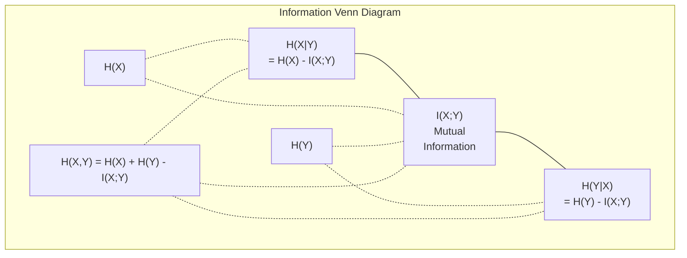

# Information Theory | 信息论

> Information theory measures surprise. Loss functions are built on it.
> 信息论衡量惊喜程度。损失函数建立在它之上。

**Type:** Learn | **类型:** 学习
**Language:** Python | **语言:** Python
**Prerequisites:** Phase 1, Lesson 06 (Probability) | **前置知识:** Phase 1, Lesson 06 (Probability)
**Time:** ~60 minutes | **时间:** ~60 分钟

## Learning Objectives | 学习目标

- Compute entropy, cross-entropy, and KL divergence from scratch and explain their relationship
  从零计算熵、交叉熵和 KL 散度，解释它们之间的关系
- Derive why minimizing cross-entropy loss is equivalent to maximizing log-likelihood
  推导为什么最小化交叉熵损失等价于最大化对数似然
- Calculate mutual information between features and a target to rank feature importance
  计算特征与目标之间的互信息来排序特征重要性
- Explain perplexity as the effective vocabulary size a language model chooses from
  解释困惑度作为语言模型选择的有效词汇量

> **【中文解读】**
> 信息论衡量"惊喜程度"——越不可能发生的事件，包含的信息量越大。交叉熵损失函数、KL 散度、困惑度（perplexity）——这些概念统一在信息论的框架下。

> **【拓展：信息论在 AI 中的位置】**
> - **交叉熵损失**: 所有分类模型和语言模型的标准损失函数（`CrossEntropyLoss`）。
> - **KL 散度**: VAE 的损失函数之一、知识蒸馏的核心、RLHF 中奖励模型的训练目标。
> - **困惑度(Perplexity)**: 语言模型的评价标准，越低越好，表示模型对下一个词的预测越确定。

## The Problem | 问题引入

> **【中文解读】** 你在训练分类模型时调用 `CrossEntropyLoss()`，在语言模型论文中看到"perplexity"，在 VAE、蒸馏、RLHF 中遇到 KL 散度。这些不是独立的概念——它们都是信息论的同源概念，只是换了不同的帽子。理解信息论，就能看穿这些概念的本质联系。

## The Concept | 核心概念

> **【拓展：Shannon 与信息论的诞生】** 1948 年 Claude Shannon 发表《通信的数学理论》，提出了用比特衡量信息量的框架。80 年后，这个框架成了 AI 的基石：交叉熵是所有分类和语言模型的损失函数，KL 散度是生成模型（VAE、扩散模型）的训练目标，互信息是特征选择的工具。信息论是从通信工程到 AI 的桥梁。

### Information Content (Surprise) | 信息量（惊喜度）

When something unlikely happens, it carries more information. A coin landing heads? Not surprising. A lottery win? Very surprising.

> 当不太可能的事情发生时，它携带更多信息。硬币正面朝上？不令人惊讶。中彩票？非常令人惊讶。

The information content of an event with probability p is:
  概率为 p 的事件的信息量为：

```
I(x) = -log(p(x))
```

Using log base 2 gives you bits. Using natural log gives you nats. Same idea, different units.
  使用以 2 为底的对数得到比特（bits），使用自然对数得到奈特（nats）。同一个概念，不同单位。

```
Event              Probability    Surprise (bits)
Fair coin heads    0.5            1.0
Rolling a 6        0.167          2.58
1-in-1000 event    0.001          9.97
Certain event      1.0            0.0
```

Certain events carry zero information. You already knew they would happen.
> 必然事件携带零信息。你早就知道它们会发生。

### Entropy (Average Surprise) | 熵（平均惊喜度）

Entropy is the expected surprise across all possible outcomes of a distribution.
> 熵是分布中所有可能结果的期望惊喜度。

```
H(P) = -sum( p(x) * log(p(x)) )  for all x
```

A fair coin has maximum entropy for a binary variable: 1 bit. A biased coin (99% heads) has low entropy: 0.08 bits. You already know what will happen, so each flip tells you almost nothing.
> 公平硬币对二元变量有最大熵：1 比特。偏置硬币（99% 正面）的熵很低：0.08 比特。你已经知道会发生什么，所以每次抛硬币几乎不提供新信息。

```
Fair coin:    H = -(0.5 * log2(0.5) + 0.5 * log2(0.5)) = 1.0 bit
Biased coin:  H = -(0.99 * log2(0.99) + 0.01 * log2(0.01)) = 0.08 bits
```

Entropy measures the irreducible uncertainty in a distribution. You cannot compress below it.
> 熵衡量分布中不可约减的不确定性。你无法压缩到它以下。

### Cross-Entropy (The Loss Function You Use Every Day) | 交叉熵（你每天都在用的损失函数）

Cross-entropy measures the average surprise when you use distribution Q to encode events that actually come from distribution P.
> 交叉熵衡量使用分布 Q 编码实际来自分布 P 的事件时的平均惊喜度。

```
H(P, Q) = -sum( p(x) * log(q(x)) )  for all x
```

P is the true distribution (the labels). Q is your model's predictions. If Q matches P perfectly, cross-entropy equals entropy. Any mismatch makes it larger.
> P 是真实分布（标签），Q 是模型的预测。如果 Q 完美匹配 P，交叉熵等于熵。任何不匹配都会使它更大。

In classification, P is a one-hot vector (the true class has probability 1, everything else 0). This simplifies cross-entropy to:
> 在分类中，P 是 one-hot 向量（真实类概率为 1，其余为 0）。这使交叉熵简化为：

```
H(P, Q) = -log(q(true_class))
```

That is the entire cross-entropy loss formula for classification. Maximize the predicted probability of the correct class.
> 这就是分类的完整交叉熵损失公式。最大化正确类别的预测概率。

### KL Divergence (Distance Between Distributions) | KL 散度（分布间的距离）

KL divergence measures how much extra surprise you get from using Q instead of P.
> KL 散度衡量使用 Q 代替 P 时多出的惊喜度。

```
D_KL(P || Q) = sum( p(x) * log(p(x) / q(x)) )  for all x
             = H(P, Q) - H(P)
```

Cross-entropy is entropy plus KL divergence. Since entropy of the true distribution is constant during training, minimizing cross-entropy is the same as minimizing KL divergence. You are pushing your model's distribution toward the true distribution.
> 交叉熵 = 熵 + KL 散度。由于训练过程中真实分布的熵是常数，最小化交叉熵等价于最小化 KL 散度。你在把模型分布推向真实分布。

KL divergence is not symmetric: D_KL(P || Q) != D_KL(Q || P). It is not a true distance metric.
> KL 散度不对称：D_KL(P || Q) != D_KL(Q || P)。它不是真正的距离度量。

### Mutual Information | 互信息

Mutual information measures how much knowing one variable tells you about another.
> 互信息衡量知道一个变量后能告诉你关于另一个变量的多少信息。

```
I(X; Y) = H(X) - H(X|Y)
        = H(X) + H(Y) - H(X, Y)
```

If X and Y are independent, mutual information is zero. Knowing one tells you nothing about the other. If they are perfectly correlated, mutual information equals the entropy of either variable.
> 如果 X 和 Y 独立，互信息为零。知道一个不能告诉你关于另一个的任何信息。如果完全相关，互信息等于任一变量的熵。

In feature selection, high mutual information between a feature and the target means the feature is useful. Low mutual information means it is noise.
> 在特征选择中，特征与目标之间的高互信息意味着特征有用。低互信息意味着它是噪声。

### Conditional Entropy | 条件熵

H(Y|X) measures how much uncertainty remains about Y after you observe X.
> H(Y|X) 衡量在观察到 X 后关于 Y 还剩多少不确定性。

```
H(Y|X) = H(X,Y) - H(X)
```

Two extremes:
  两个极端：

- If X completely determines Y, then H(Y|X) = 0. Knowing X eliminates all uncertainty about Y. Example: X = temperature in Celsius, Y = temperature in Fahrenheit.
  如果 X 完全决定 Y，则 H(Y|X) = 0。知道 X 消除了关于 Y 的所有不确定性。
- If X tells you nothing about Y, then H(Y|X) = H(Y). Knowing X does not reduce your uncertainty at all. Example: X = coin flip, Y = tomorrow's weather.
  如果 X 对 Y 没有任何信息，则 H(Y|X) = H(Y)。知道 X 完全不减少不确定性。

Conditional entropy is always non-negative and never exceeds H(Y):
> 条件熵始终非负且不超过 H(Y)：

```
0 <= H(Y|X) <= H(Y)
```

In machine learning, conditional entropy appears in decision trees. At each split, the algorithm picks the feature X that minimizes H(Y|X) -- the feature that removes the most uncertainty about the label Y.
> 在机器学习中，条件熵出现在决策树中。每次分裂时，算法选择使 H(Y|X) 最小的特征 X——即最能消除标签 Y 不确定性的特征。

### Joint Entropy | 联合熵

H(X,Y) is the entropy of the joint distribution of X and Y together.
> H(X,Y) 是 X 和 Y 联合分布的熵。

```
H(X,Y) = -sum sum p(x,y) * log(p(x,y))   for all x, y
```

Key property:
  关键性质：

```
H(X,Y) <= H(X) + H(Y)
```

Equality holds when X and Y are independent. If they share information, the joint entropy is less than the sum of individual entropies. The "missing" entropy is exactly the mutual information.
> 当 X 和 Y 独立时等号成立。如果它们共享信息，联合熵小于各自熵之和。"缺失"的熵恰好是互信息。



The relationships:
  关系式：

- H(X,Y) = H(X) + H(Y|X) = H(Y) + H(X|Y)
- I(X;Y) = H(X) - H(X|Y) = H(Y) - H(Y|X)
- H(X,Y) = H(X) + H(Y) - I(X;Y)

### Mutual Information (Deep Dive) | 互信息（深入理解）

Mutual information I(X;Y) quantifies how much knowing one variable reduces uncertainty about the other.
> 互信息 I(X;Y) 量化知道一个变量后对另一个变量不确定性的减少量。

```
I(X;Y) = H(X) - H(X|Y)
       = H(Y) - H(Y|X)
       = H(X) + H(Y) - H(X,Y)
       = sum sum p(x,y) * log(p(x,y) / (p(x) * p(y)))
```

Properties:
  性质：

- I(X;Y) >= 0 always. You never lose information by observing something.
  I(X;Y) >= 0 始终成立。观察事物永远不会丢失信息。
- I(X;Y) = 0 if and only if X and Y are independent.
  I(X;Y) = 0 当且仅当 X 和 Y 独立。
- I(X;Y) = I(Y;X). It is symmetric, unlike KL divergence.
  I(X;Y) = I(Y;X)。它是对称的，与 KL 散度不同。
- I(X;X) = H(X). A variable shares all its information with itself.
  I(X;X) = H(X)。变量与自身共享所有信息。

**Mutual information for feature selection.** In ML, you want features that are informative about the target. Mutual information gives you a principled way to rank features:
> **互信息用于特征选择。** 在机器学习中，你需要对目标有信息量的特征。互信息提供了一种有原则的方式来排序特征：

1. For each feature X_i, compute I(X_i; Y) where Y is the target variable.
   对每个特征 X_i，计算 I(X_i; Y)，其中 Y 是目标变量。
2. Rank features by MI score.
   按 MI 得分排序特征。
3. Keep the top k features.
   保留前 k 个特征。

This works for any relationship between feature and target -- linear, nonlinear, monotonic, or not. Correlation only catches linear relationships. MI catches everything.
> 这适用于特征与目标之间的任何关系——线性的、非线性的、单调的或非单调的。相关性只能捕捉线性关系，互信息能捕捉一切。

| Method / 方法 | Detects / 检测 | Computational cost / 计算成本 | Handles categorical? / 处理类别型？ |
|--------|---------|-------------------|---------------------|
| Pearson correlation / 皮尔逊相关 | Linear relationships / 线性关系 | O(n) | No / 否 |
| Spearman correlation / 斯皮尔曼相关 | Monotonic relationships / 单调关系 | O(n log n) | No / 否 |
| Mutual information / 互信息 | Any statistical dependency / 任何统计依赖 | O(n log n) with binning | Yes / 是 |

### Label Smoothing and Cross-Entropy | 标签平滑与交叉熵

Standard classification uses hard targets: [0, 0, 1, 0]. The true class gets probability 1, everything else gets 0. Label smoothing replaces these with soft targets:
> 标准分类使用硬目标：[0, 0, 1, 0]。真实类概率为 1，其余为 0。标签平滑将其替换为软目标：

```
soft_target = (1 - epsilon) * hard_target + epsilon / num_classes
```

With epsilon = 0.1 and 4 classes:
  当 epsilon = 0.1 且有 4 个类别时：

- Hard target:  [0, 0, 1, 0]
- Soft target:  [0.025, 0.025, 0.925, 0.025]

From an information theory perspective, label smoothing increases the entropy of the target distribution. Hard one-hot targets have entropy 0 -- there is no uncertainty. Soft targets have positive entropy.
> 从信息论角度看，标签平滑增加了目标分布的熵。硬 one-hot 目标的熵为 0——没有不确定性。软目标有正熵。

Why this helps:
  为什么这有帮助：

- Prevents the model from driving logits to extreme values (infinite logits would be needed to perfectly match a one-hot target under cross-entropy)
  防止模型将 logits 推到极端值
- Acts as regularization: the model cannot be 100% confident
  作为正则化：模型不能 100% 自信
- Improves calibration: predicted probabilities better reflect true uncertainty
  改善校准：预测概率更好地反映真实不确定性
- Reduces the gap between training and inference behavior
  减少训练和推理行为之间的差距

The cross-entropy loss with label smoothing becomes:
> 带标签平滑的交叉熵损失为：

```
L = (1 - epsilon) * CE(hard_target, prediction) + epsilon * H_uniform(prediction)
```

The second term penalizes predictions that are far from uniform -- a direct regularization on confidence.
> 第二项惩罚远离均匀分布的预测——对置信度的直接正则化。

### Why Cross-Entropy Is THE Classification Loss | 为什么交叉熵是分类的标准损失

Three perspectives, same conclusion.
> 三个视角，同一个结论。

**Information theory view.** Cross-entropy measures how many bits you waste by using your model's distribution instead of the true distribution. Minimizing it makes your model the most efficient encoder of reality.
> **信息论视角。** 交叉熵衡量使用模型分布代替真实分布浪费了多少比特。最小化它使你的模型成为最高效的现实编码器。

**Maximum likelihood view.** For N training samples with true classes y_i:
> **最大似然视角。** 对于 N 个训练样本，真实类别为 y_i：

```
Likelihood     = product( q(y_i) )
Log-likelihood = sum( log(q(y_i)) )
Negative log-likelihood = -sum( log(q(y_i)) )
```

That last line is cross-entropy loss. Minimizing cross-entropy = maximizing the likelihood of the training data under your model.
> 最后一行就是交叉熵损失。最小化交叉熵 = 最大化模型下训练数据的似然。

**Gradient view.** The gradient of cross-entropy with respect to the logits is simply (predicted - true). Clean, stable, and fast to compute. This is why it pairs perfectly with softmax.
> **梯度视角。** 交叉熵对 logits 的梯度就是 (predicted - true)。简洁、稳定、计算快速。这就是为什么它与 softmax 完美搭配。

### Bits vs Nats | 比特 vs 奈特

The only difference is the log base.
> 唯一的区别是对数的底数。

```
log base 2   -> bits      (information theory tradition / 信息论传统)
log base e   -> nats      (machine learning convention / 机器学习惯例)
log base 10  -> hartleys  (rarely used / 很少使用)
```

1 nat = 1/ln(2) bits = 1.4427 bits. PyTorch and TensorFlow use natural log (nats) by default.
> 1 nat = 1/ln(2) bits = 1.4427 bits。PyTorch 和 TensorFlow 默认使用自然对数（nats）。

### Perplexity | 困惑度

Perplexity is the exponential of cross-entropy. It tells you the effective number of equally likely choices the model is uncertain between.
> 困惑度是交叉熵的指数。它告诉你模型在多少个等概率选择之间犹豫。

```
Perplexity = 2^H(P,Q)   (if using bits / 使用 bits 时)
Perplexity = e^H(P,Q)   (if using nats / 使用 nats 时)
```

A language model with perplexity 50 is, on average, as confused as if it had to pick uniformly from 50 possible next tokens. Lower is better.
> 困惑度为 50 的语言模型，平均而言就像在 50 个可能的下一个词中均匀选择一样困惑。越低越好。

GPT-2 achieved perplexity ~30 on common benchmarks. Modern models are in the single digits for well-represented domains.
> GPT-2 在常见基准上达到 ~30 的困惑度。现代模型在代表性好的领域已达到个位数。

## Build It | 动手实现

### Step 1: Information content and entropy | 第1步：信息量与熵

```python
import math

def information_content(p, base=2):
    if p <= 0 or p > 1:
        return float('inf') if p <= 0 else 0.0
    return -math.log(p) / math.log(base)

def entropy(probs, base=2):
    return sum(
        p * information_content(p, base)
        for p in probs if p > 0
    )

fair_coin = [0.5, 0.5]
biased_coin = [0.99, 0.01]
fair_die = [1/6] * 6

print(f"Fair coin entropy:   {entropy(fair_coin):.4f} bits")
print(f"Biased coin entropy: {entropy(biased_coin):.4f} bits")
print(f"Fair die entropy:    {entropy(fair_die):.4f} bits")
```

### Step 2: Cross-entropy and KL divergence | 第2步：交叉熵与 KL 散度

```python
def cross_entropy(p, q, base=2):
    total = 0.0
    for pi, qi in zip(p, q):
        if pi > 0:
            if qi <= 0:
                return float('inf')
            total += pi * (-math.log(qi) / math.log(base))
    return total

def kl_divergence(p, q, base=2):
    return cross_entropy(p, q, base) - entropy(p, base)

true_dist = [0.7, 0.2, 0.1]
good_model = [0.6, 0.25, 0.15]
bad_model = [0.1, 0.1, 0.8]

print(f"Entropy of true dist:     {entropy(true_dist):.4f} bits")
print(f"CE (good model):          {cross_entropy(true_dist, good_model):.4f} bits")
print(f"CE (bad model):           {cross_entropy(true_dist, bad_model):.4f} bits")
print(f"KL divergence (good):     {kl_divergence(true_dist, good_model):.4f} bits")
print(f"KL divergence (bad):      {kl_divergence(true_dist, bad_model):.4f} bits")
```

### Step 3: Cross-entropy as classification loss | 第3步：交叉熵作为分类损失

```python
def softmax(logits):
    max_logit = max(logits)
    exps = [math.exp(z - max_logit) for z in logits]
    total = sum(exps)
    return [e / total for e in exps]

def cross_entropy_loss(true_class, logits):
    probs = softmax(logits)
    return -math.log(probs[true_class])

logits = [2.0, 1.0, 0.1]
true_class = 0

probs = softmax(logits)
loss = cross_entropy_loss(true_class, logits)

print(f"Logits:      {logits}")
print(f"Softmax:     {[f'{p:.4f}' for p in probs]}")
print(f"True class:  {true_class}")
print(f"Loss:        {loss:.4f} nats")
print(f"Perplexity:  {math.exp(loss):.2f}")
```

### Step 4: Cross-entropy equals negative log-likelihood | 第4步：交叉熵等于负对数似然

```python
import random

random.seed(42)

n_samples = 1000
n_classes = 3
true_labels = [random.randint(0, n_classes - 1) for _ in range(n_samples)]
model_logits = [[random.gauss(0, 1) for _ in range(n_classes)] for _ in range(n_samples)]

ce_loss = sum(
    cross_entropy_loss(label, logits)
    for label, logits in zip(true_labels, model_logits)
) / n_samples

nll = -sum(
    math.log(softmax(logits)[label])
    for label, logits in zip(true_labels, model_logits)
) / n_samples

print(f"Cross-entropy loss:      {ce_loss:.6f}")
print(f"Negative log-likelihood: {nll:.6f}")
print(f"Difference:              {abs(ce_loss - nll):.2e}")
```

### Step 5: Mutual information | 第5步：互信息

```python
def mutual_information(joint_probs, base=2):
    rows = len(joint_probs)
    cols = len(joint_probs[0])

    margin_x = [sum(joint_probs[i][j] for j in range(cols)) for i in range(rows)]
    margin_y = [sum(joint_probs[i][j] for i in range(rows)) for j in range(cols)]

    mi = 0.0
    for i in range(rows):
        for j in range(cols):
            pxy = joint_probs[i][j]
            if pxy > 0:
                mi += pxy * math.log(pxy / (margin_x[i] * margin_y[j])) / math.log(base)
    return mi

independent = [[0.25, 0.25], [0.25, 0.25]]
dependent = [[0.45, 0.05], [0.05, 0.45]]

print(f"MI (independent): {mutual_information(independent):.4f} bits")
print(f"MI (dependent):   {mutual_information(dependent):.4f} bits")
```

## Use It | 用框架实现

The same concepts using NumPy, the way you will use them in practice:
> 使用 NumPy 实现同样的概念，这是你在实践中的使用方式：

```python
import numpy as np

def np_entropy(p):
    p = np.asarray(p, dtype=float)
    mask = p > 0
    result = np.zeros_like(p)
    result[mask] = p[mask] * np.log(p[mask])
    return -result.sum()

def np_cross_entropy(p, q):
    p, q = np.asarray(p, dtype=float), np.asarray(q, dtype=float)
    mask = p > 0
    return -(p[mask] * np.log(q[mask])).sum()

def np_kl_divergence(p, q):
    return np_cross_entropy(p, q) - np_entropy(p)

true = np.array([0.7, 0.2, 0.1])
pred = np.array([0.6, 0.25, 0.15])
print(f"Entropy:    {np_entropy(true):.4f} nats")
print(f"Cross-ent:  {np_cross_entropy(true, pred):.4f} nats")
print(f"KL div:     {np_kl_divergence(true, pred):.4f} nats")
```

You built from scratch what `torch.nn.CrossEntropyLoss()` does internally. Now you know why the loss goes down during training: your model's predicted distribution is getting closer to the true distribution, measured in nats of wasted information.
> 你从零构建了 `torch.nn.CrossEntropyLoss()` 内部做的事情。现在你知道为什么训练中损失会下降：你的模型预测分布越来越接近真实分布，用浪费信息的奈特数来衡量。

## Exercises | 练习题

1. Compute the entropy of the English alphabet assuming uniform distribution (26 letters). Then estimate it using actual letter frequencies. Which is higher and why?
   假设均匀分布计算英文字母表（26 个字母）的熵。然后用实际字母频率估计。哪个更高？为什么？

2. A model outputs logits [5.0, 2.0, 0.5] for a sample with true class 1. Compute the cross-entropy loss by hand, then verify with your `cross_entropy_loss` function. What logits would give zero loss?
   模型对真实类别为 1 的样本输出 logits [5.0, 2.0, 0.5]。手算交叉熵损失，然后用你的函数验证。什么 logits 会给出零损失？

3. Show that KL divergence is not symmetric. Pick two distributions P and Q and compute D_KL(P || Q) and D_KL(Q || P). Explain why they differ.
   证明 KL 散度不对称。选择两个分布 P 和 Q，计算 D_KL(P || Q) 和 D_KL(Q || P)。解释为什么它们不同。

4. Build a function that computes perplexity for a sequence of token predictions. Given a list of (true_token_index, predicted_logits) pairs, return the perplexity of the sequence.
   构建一个计算 token 预测序列困惑度的函数。给定 (真实 token 索引, 预测 logits) 对的列表，返回序列的困惑度。

## Key Terms | 术语速查表

| Term / 术语 | What people say | What it actually means / 实际含义 |
|------|----------------|----------------------|
| Information content / 信息量 | "Surprise" | The number of bits (or nats) needed to encode an event: -log(p) / 编码事件所需的比特数（或奈特数）：-log(p) |
| Entropy / 熵 | "Randomness" | The average surprise across all outcomes of a distribution. Measures irreducible uncertainty. / 分布中所有结果的平均惊喜度。衡量不可约减的不确定性。 |
| Cross-entropy / 交叉熵 | "The loss function" | Average surprise when using model distribution Q to encode events from true distribution P. / 使用模型分布 Q 编码来自真实分布 P 的事件时的平均惊喜度。 |
| KL divergence / KL 散度 | "Distance between distributions" | Extra bits wasted by using Q instead of P. Equals cross-entropy minus entropy. Not symmetric. / 使用 Q 代替 P 浪费的额外比特。等于交叉熵减熵。不对称。 |
| Mutual information / 互信息 | "How related are X and Y" | Reduction in uncertainty about X from knowing Y. Zero means independent. / 知道 Y 后关于 X 不确定性的减少。零意味着独立。 |
| Softmax | "Turn logits into probabilities" | Exponentiate and normalize. Maps any real-valued vector to a valid probability distribution. / 指数化并归一化。将任意实值向量映射为有效概率分布。 |
| Perplexity / 困惑度 | "How confused the model is" | Exponential of cross-entropy. The effective vocabulary size the model is choosing from at each step. / 交叉熵的指数。模型每一步选择时的有效词汇量。 |
| Bits / 比特 | "Shannon's unit" | Information measured with log base 2. One bit resolves one fair coin flip. / 用以 2 为底的对数衡量的信息。一比特解决一次公平抛硬币。 |
| Nats / 奈特 | "ML's unit" | Information measured with natural log. Used by PyTorch and TensorFlow by default. / 用自然对数衡量的信息。PyTorch 和 TensorFlow 默认使用。 |
| Negative log-likelihood / 负对数似然 | "NLL loss" | Identical to cross-entropy loss for one-hot labels. Minimizing it maximizes the probability of correct predictions. / 对 one-hot 标签等价于交叉熵损失。最小化它等于最大化正确预测的概率。 |

## Further Reading | 延伸阅读

- [Shannon 1948: A Mathematical Theory of Communication](https://people.math.harvard.edu/~ctm/home/text/others/shannon/entropy/entropy.pdf) - the original paper, still readable
  原始论文，至今仍可读
- [Visual Information Theory (Chris Olah)](https://colah.github.io/posts/2015-09-Visual-Information/) - best visual explanation of entropy and KL divergence
  熵和 KL 散度最佳可视化解释
- [PyTorch CrossEntropyLoss docs](https://pytorch.org/docs/stable/generated/torch.nn.CrossEntropyLoss.html) - how the framework implements what you just built
  框架如何实现你刚构建的内容
