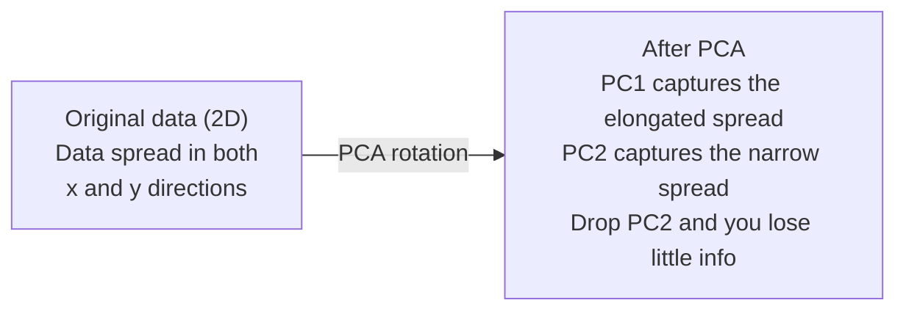

# Dimensionality Reduction | 降维

> High-dimensional data has structure. You find it by looking from the right angle.
> 高维数据有结构。你需要找到正确的角度去观察。

**Type:** Build | **类型:** 动手
**Language:** Python | **语言:** Python
**Prerequisites:** Phase 1, Lessons 01 (Linear Algebra Intuition), 02 (Vectors, Matrices & Operations), 03 (Eigenvalues & Eigenvectors), 06 (Probability & Distributions) | **前置知识:** Phase 1, Lessons 01-03, 06
**Time:** ~90 minutes | **时间:** ~90 分钟

## Learning Objectives | 学习目标

- Implement PCA from scratch: center data, compute the covariance matrix, eigendecompose, and project
  从零实现 PCA：数据中心化、计算协方差矩阵、特征值分解、投影
- Use explained variance ratio and the elbow method to choose the number of principal components
  使用解释方差比和肘部法则选择主成分数量
- Compare PCA, t-SNE, and UMAP for visualizing MNIST digits in 2D and explain their tradeoffs
  比较 PCA、t-SNE 和 UMAP 在 MNIST 手写数字 2D 可视化中的效果与权衡
- Apply kernel PCA with an RBF kernel to separate nonlinear data structures that standard PCA cannot handle
  应用带 RBF 核的核 PCA 分离标准 PCA 无法处理的非线性数据结构

> **【中文解读】**
> 784 维的手写数字数据无法可视化。降维就是找到"最佳角度"投影数据，用尽量少的维度保留尽量多的信息。PCA 是最经典的降维方法，t-SNE 和 UMAP 适合非线性数据的可视化。

> **【拓展：降维在 AI 中的位置】**
> - **PCA**: sklearn 的 `PCA`，数据预处理的标准步骤，也是理解特征值分解的最佳实践。
> - **t-SNE/UMAP**: 高维数据 2D 可视化的标准工具，论文中几乎每个嵌入可视化都用它们。
> - **推荐系统**: 协同过滤本质上就是对用户-物品矩阵做降维，发现隐因子。

## The Problem | 问题引入

> **【中文解读】** 784 维的手写数字数据（28×28 像素）无法可视化，也无法直观理解。但其中大部分是冗余的——一个手写的"7"只需要几个关键特征：笔画角度、横线长度、倾斜程度。降维就是找到这些关键特征，把 784 维压缩到 2-50 维，同时保留有意义的信息结构。

Maybe it is pixel values of handwritten digits. Maybe it is gene expression levels. Maybe it is user behavior signals. You cannot visualize 784 dimensions. You cannot plot them. You cannot even think about them.
> 也许是手写数字的像素值，也许是基因表达水平，也许是用户行为信号。你无法可视化 784 维，无法绘图，甚至无法想象。

But most of those 784 features are redundant. The actual information lives on a much smaller surface. A handwritten "7" does not need 784 independent numbers to describe it. It needs a few: the angle of the stroke, the length of the crossbar, how much it leans. The rest is noise.
> 但这 784 个特征中大部分是冗余的。真正有用的信息存在于一个更小的面上。一个手写的"7"不需要 784 个独立的数字来描述，只需要几个：笔画角度、横线长度、倾斜程度。其余是噪声。

Dimensionality reduction finds that smaller surface. It takes your 784-dimensional data and compresses it to 2, 10, or 50 dimensions while keeping the structure that matters.
> 降维找到那个更小的面。它将 784 维数据压缩到 2、10 或 50 维，同时保留有意义的结构。

## The Concept | 核心概念

> **【拓展：PCA 与 LoRA 的数学联系】** PCA 找到数据中方差最大的方向（主成分），这与 LoRA 微调的核心思想相同：权重更新 ΔW 的有效信息集中在少数几个方向上。PCA 用特征值分解找主成分，LoRA 用低秩矩阵 A·B 近似这些方向。理解 PCA 的数学，就能理解 LoRA 为什么能用 1% 的参数达到接近全量微调的效果。

### The curse of dimensionality | 维度灾难

High-dimensional spaces are unintuitive. Three things break as dimensions grow.
> 高维空间违反直觉。随着维度增长，三件事会出问题。

**Distance becomes meaningless.** In high dimensions, the distance between any two random points converges to the same value. If every point is roughly the same distance from every other point, nearest-neighbor search stops working.
> **距离变得无意义。** 在高维中，任意两个随机点之间的距离趋近于相同值。如果每个点到其他所有点距离大致相同，最近邻搜索就失效了。

```
Dimension    Avg distance ratio (max/min between random points)
2            ~5.0
10           ~1.8
100          ~1.2
1000         ~1.02
```

**Volume concentrates in corners.** A unit hypercube in d dimensions has 2^d corners. In 100 dimensions, nearly all the volume is in the corners, far from the center. Data points spread to the edges and your models starve for data in the interior.
> **体积集中在角落。** d 维单位超立方体有 2^d 个角。在 100 维中，几乎所有体积都在角落，远离中心。数据点扩散到边缘，模型在内部缺乏数据。

**You need exponentially more data.** To maintain the same density of samples in a space, going from 2D to 20D means you need 10^18 times more data. You never have enough. Reducing dimensions brings the data density back to something workable.
> **需要指数级更多的数据。** 从 2D 到 20D，为保持相同的样本密度，需要 10^18 倍的数据。降维将数据密度恢复到可用的水平。

### PCA: find the directions that matter | PCA：找到重要的方向

Principal Component Analysis (PCA) finds the axes along which your data varies the most. It rotates your coordinate system so the first axis captures the most variance, the second captures the next most, and so on.
> 主成分分析 (PCA) 找到数据变化最大的轴。它旋转坐标系，使第一个轴捕获最大方差，第二个捕获次大方差，依此类推。

The algorithm:
  算法步骤：

```
1. Center the data        (subtract the mean from each feature) / 数据中心化
2. Compute covariance     (how features move together) / 计算协方差
3. Eigendecomposition     (find the principal directions) / 特征值分解
4. Sort by eigenvalue     (biggest variance first) / 按特征值排序
5. Project               (keep top k eigenvectors, drop the rest) / 投影
```

Why eigendecomposition? The covariance matrix is symmetric and positive semi-definite. Its eigenvectors are orthogonal directions in feature space. The eigenvalues tell you how much variance each direction captures. The eigenvector with the largest eigenvalue points along the direction of maximum variance.
> 为什么用特征值分解？协方差矩阵是对称正半定的。其特征向量是特征空间中的正交方向。特征值告诉你每个方向捕获多少方差。最大特征值对应的特征向量指向最大方差方向。



- **Before PCA:** Data cloud is spread diagonally across both x and y axes
  **PCA 前：** 数据云在对角线方向跨越 x 和 y 轴
- **After PCA:** Coordinate system is rotated so PC1 aligns with the direction of maximum variance (elongated spread) and PC2 aligns with the direction of minimum variance (narrow spread)
  **PCA 后：** 坐标系旋转，PC1 对齐最大方差方向，PC2 对齐最小方差方向
- **Dimensionality reduction:** Dropping PC2 projects the data onto PC1, losing very little information
  **降维：** 丢弃 PC2 将数据投影到 PC1 上，损失很少的信息

### Explained variance ratio | 解释方差比

Each principal component captures a fraction of the total variance. The explained variance ratio tells you how much.
> 每个主成分捕获总方差的一部分。解释方差比告诉你捕获了多少。

```
Component    Eigenvalue    Explained ratio    Cumulative
PC1          4.73          0.473              0.473
PC2          2.51          0.251              0.724
PC3          1.12          0.112              0.836
PC4          0.89          0.089              0.925
...
```

When the cumulative explained variance reaches 0.95, you know that many components capture 95% of the information. Everything after that is mostly noise.
> 当累积解释方差达到 0.95 时，这些成分捕获了 95% 的信息。之后的基本是噪声。

### Choosing the number of components | 选择成分数量

Three strategies:
  三种策略：

1. **Threshold.** Keep enough components to explain 90-95% of the variance.
   **阈值法。** 保留足够的成分来解释 90-95% 的方差。
2. **Elbow method.** Plot explained variance per component. Look for a sharp drop-off.
   **肘部法则。** 绘制每个成分的解释方差，寻找急剧下降点。
3. **Downstream performance.** Use PCA as preprocessing. Sweep k and measure your model's accuracy. The best k is wherever accuracy plateaus.
   **下游性能。** 将 PCA 作为预处理。扫描 k 值并测量模型精度。最佳 k 在精度平台期处。

### t-SNE: preserve neighborhoods | t-SNE：保留邻域结构

t-Distributed Stochastic Neighbor Embedding (t-SNE) is designed for visualization. It maps high-dimensional data to 2D (or 3D) while preserving which points are near each other.
> t-SNE 专为可视化设计。它将高维数据映射到 2D（或 3D），同时保留哪些点彼此接近。

The intuition: in the original space, compute a probability distribution over pairs of points based on their distances. Near points get high probability. Far points get low probability. Then find a 2D arrangement where the same probability distribution holds. Points that were neighbors in 784 dimensions stay neighbors in 2D.
> 直觉：在原始空间中，基于距离计算点对之间的概率分布。近的点概率高，远的点概率低。然后找到一个 2D 排列使相同的概率分布成立。784 维中的邻居在 2D 中仍然是邻居。

Key properties of t-SNE:
  t-SNE 的关键特性：

- Non-linear. It can unfold complex manifolds that PCA cannot.
  非线性。能展开 PCA 无法处理的复杂流形。
- Stochastic. Different runs produce different layouts.
  随机性。不同运行产生不同布局。
- Perplexity parameter controls how many neighbors to consider (typical range: 5-50).
  Perplexity 参数控制考虑多少邻居（典型范围：5-50）。
- Distances between clusters in the output are not meaningful. Only the clusters themselves are.
  输出中聚类之间的距离无意义。只有聚类本身有意义。
- Slow on large datasets. O(n^2) by default.
  大数据集上慢。默认 O(n^2)。

### UMAP: faster, better global structure | UMAP：更快，全局结构更好

Uniform Manifold Approximation and Projection (UMAP) works similarly to t-SNE but with two advantages:
> UMAP 与 t-SNE 类似，但有两个优势：

- Faster. It uses approximate nearest-neighbor graphs instead of computing all pairwise distances.
  更快。使用近似最近邻图而非计算所有成对距离。
- Better global structure. The relative positions of clusters in the output tend to be more meaningful than in t-SNE.
  更好的全局结构。输出中聚类的相对位置比 t-SNE 更有意义。

UMAP builds a weighted graph in high-dimensional space (the "fuzzy topological representation") and then finds a low-dimensional layout that preserves this graph as well as possible.
> UMAP 在高维空间中构建加权图（"模糊拓扑表示"），然后找到尽可能保留该图的低维布局。

Key parameters:
  关键参数：

- `n_neighbors`: how many neighbors define local structure (similar to perplexity). Higher values preserve more global structure.
  `n_neighbors`：多少邻居定义局部结构（类似 perplexity）。更高的值保留更多全局结构。
- `min_dist`: how tightly points pack together in the output. Lower values create denser clusters.
  `min_dist`：输出中点聚拢的紧密程度。更低的值创建更密集的聚类。

### When to use which | 何时使用哪种方法

| Method / 方法 | Use case / 使用场景 | Preserves / 保留 | Speed / 速度 |
|--------|----------|-----------|-------|
| PCA | Preprocessing before training / 训练前预处理 | Global variance / 全局方差 | Fast (exact), works on millions of samples / 快速（精确），支持百万级样本 |
| PCA | Quick exploratory visualization / 快速探索性可视化 | Linear structure / 线性结构 | Fast / 快 |
| t-SNE | Publication-quality 2D plots / 发表级 2D 图 | Local neighborhoods / 局部邻域 | Slow (< 10k samples ideal) / 慢（<1万样本最佳） |
| UMAP | 2D visualization at scale / 大规模 2D 可视化 | Local + some global structure / 局部+部分全局结构 | Medium (handles millions) / 中等（支持百万级） |
| PCA | Feature reduction for models / 模型特征降维 | Variance-ranked features / 方差排序特征 | Fast / 快 |
| t-SNE / UMAP | Understanding cluster structure / 理解聚类结构 | Cluster separation / 聚类分离 | Medium to slow / 中等到慢 |

Rule of thumb: use PCA for preprocessing and data compression. Use t-SNE or UMAP when you need to visualize structure in 2D.
> 经验法则：PCA 用于预处理和数据压缩。需要 2D 可视化结构时用 t-SNE 或 UMAP。

### Kernel PCA | 核 PCA

Standard PCA finds linear subspaces. It rotates your coordinate system and drops axes. But what if the data lies on a nonlinear manifold? A circle in 2D cannot be separated by any line. Standard PCA will not help.
> 标准 PCA 找线性子空间。但如果数据位于非线性流形上呢？2D 中的圆无法被任何直线分离。标准 PCA 无能为力。

Kernel PCA applies PCA in a high-dimensional feature space induced by a kernel function, without explicitly computing the coordinates in that space. This is the kernel trick -- the same idea behind SVMs.
> 核 PCA 在核函数诱导的高维特征空间中应用 PCA，而不显式计算该空间中的坐标。这就是核技巧——与 SVM 背后的思想相同。

The algorithm:
  算法步骤：

1. Compute the kernel matrix K where K_ij = k(x_i, x_j)
   计算核矩阵 K，其中 K_ij = k(x_i, x_j)
2. Center the kernel matrix in feature space
   在特征空间中中心化核矩阵
3. Eigendecompose the centered kernel matrix
   对中心化核矩阵做特征值分解
4. The top eigenvectors (scaled by 1/sqrt(eigenvalue)) are the projections
   顶部特征向量（缩放 1/sqrt(特征值)）即为投影

Common kernel functions:
  常见核函数：

| Kernel / 核函数 | Formula / 公式 | Good for / 适用于 |
|--------|---------|----------|
| RBF (Gaussian) | exp(-gamma * \|\|x - y\|\|^2) | Most nonlinear data, smooth manifolds / 大多数非线性数据，光滑流形 |
| Polynomial / 多项式 | (x . y + c)^d | Polynomial relationships / 多项式关系 |
| Sigmoid | tanh(alpha * x . y + c) | Neural network-like mappings / 类神经网络映射 |

When to use kernel PCA vs standard PCA:
  核 PCA vs 标准 PCA 的使用场景：

| Criterion / 标准 | Standard PCA / 标准 PCA | Kernel PCA / 核 PCA |
|-----------|-------------|------------|
| Data structure / 数据结构 | Linear subspace / 线性子空间 | Nonlinear manifold / 非线性流形 |
| Speed / 速度 | O(min(n^2 d, d^2 n)) | O(n^2 d + n^3) |
| Interpretability / 可解释性 | Components are linear combinations of features / 成分是特征的线性组合 | Components lack direct feature interpretation / 成分缺乏直接特征解释 |
| Scalability / 可扩展性 | Works on millions of samples / 支持百万级样本 | Kernel matrix is n x n, memory-limited / 核矩阵为 n x n，受内存限制 |
| Reconstruction / 重建 | Direct inverse transform / 直接逆变换 | Requires pre-image approximation / 需要预图像近似 |

The classic example: concentric circles in 2D. Two rings of points, one inside the other. Standard PCA projects both onto the same line -- useless for classification. Kernel PCA with an RBF kernel maps the inner circle and outer circle to different regions, making them linearly separable.
> 经典例子：2D 同心圆。两圈点，一圈在另一圈内。标准 PCA 将两者投影到同一条线上——对分类无用。带 RBF 核的核 PCA 将内圈和外圈映射到不同区域，使其线性可分。

### Reconstruction Error | 重建误差

How good is your dimensionality reduction? You compressed 784 dimensions to 50. What did you lose?
> 你的降维效果如何？你将 784 维压缩到 50 维。损失了什么？

Measure reconstruction error:
  测量重建误差：

1. Project data to k dimensions: X_reduced = X @ W_k
   将数据投影到 k 维
2. Reconstruct: X_hat = X_reduced @ W_k^T
   重建
3. Compute MSE: mean((X - X_hat)^2)
   计算 MSE

For PCA, reconstruction error has a clean relationship to explained variance:
> 对 PCA，重建误差与解释方差有简洁的关系：

```
Reconstruction error = sum of eigenvalues NOT included
Total variance = sum of ALL eigenvalues
Fraction lost = (sum of dropped eigenvalues) / (sum of all eigenvalues)
```

The explained variance ratio for each component is:
> 每个成分的解释方差比为：

```
explained_ratio_k = eigenvalue_k / sum(all eigenvalues)
```

Plotting cumulative explained variance against number of components gives you the "elbow" curve. The right number of components is where:
> 绘制累积解释方差与成分数量的关系得到"肘部"曲线。正确的成分数量在以下位置：

- The curve flattens out (diminishing returns) / 曲线变平（收益递减）
- Cumulative variance crosses your threshold (usually 0.90 or 0.95) / 累积方差超过阈值
- Downstream task performance plateaus / 下游任务性能达到平台期

Reconstruction error is useful beyond choosing k. You can use it for anomaly detection: samples with high reconstruction error are outliers that do not fit the learned subspace. This is the basis of PCA-based anomaly detection in production systems.
> 重建误差不仅用于选择 k。你还可以用于异常检测：重建误差高的样本是不符合学习子空间的异常值。这是生产系统中 PCA 异常检测的基础。

## Build It | 动手实现

> **【中文解读】** 以下从零实现 PCA 的完整流程：数据中心化 → 协方差矩阵 → 特征值分解 → 投影。然后在 MNIST 数据上对比 PCA、t-SNE、UMAP 的可视化效果。

### Step 1: PCA from scratch | 第1步：从零实现 PCA

```python
import numpy as np

class PCA:
    def __init__(self, n_components):
        self.n_components = n_components
        self.components = None
        self.mean = None
        self.eigenvalues = None
        self.explained_variance_ratio_ = None

    def fit(self, X):
        self.mean = np.mean(X, axis=0)
        X_centered = X - self.mean

        cov_matrix = np.cov(X_centered, rowvar=False)

        eigenvalues, eigenvectors = np.linalg.eigh(cov_matrix)

        sorted_idx = np.argsort(eigenvalues)[::-1]
        eigenvalues = eigenvalues[sorted_idx]
        eigenvectors = eigenvectors[:, sorted_idx]

        self.components = eigenvectors[:, :self.n_components].T
        self.eigenvalues = eigenvalues[:self.n_components]
        total_var = np.sum(eigenvalues)
        self.explained_variance_ratio_ = self.eigenvalues / total_var

        return self

    def transform(self, X):
        X_centered = X - self.mean
        return X_centered @ self.components.T

    def fit_transform(self, X):
        self.fit(X)
        return self.transform(X)
```

### Step 2: Test on synthetic data | 第2步：在合成数据上测试

```python
np.random.seed(42)
n_samples = 500

t = np.random.uniform(0, 2 * np.pi, n_samples)
x1 = 3 * np.cos(t) + np.random.normal(0, 0.2, n_samples)
x2 = 3 * np.sin(t) + np.random.normal(0, 0.2, n_samples)
x3 = 0.5 * x1 + 0.3 * x2 + np.random.normal(0, 0.1, n_samples)

X_synthetic = np.column_stack([x1, x2, x3])

pca = PCA(n_components=2)
X_reduced = pca.fit_transform(X_synthetic)

print(f"Original shape: {X_synthetic.shape}")
print(f"Reduced shape:  {X_reduced.shape}")
print(f"Explained variance ratios: {pca.explained_variance_ratio_}")
print(f"Total variance captured: {sum(pca.explained_variance_ratio_):.4f}")
```

### Step 3: MNIST digits in 2D | 第3步：MNIST 手写数字 2D 可视化

```python
from sklearn.datasets import fetch_openml

mnist = fetch_openml("mnist_784", version=1, as_frame=False, parser="auto")
X_mnist = mnist.data[:5000].astype(float)
y_mnist = mnist.target[:5000].astype(int)

pca_mnist = PCA(n_components=50)
X_pca50 = pca_mnist.fit_transform(X_mnist)
print(f"50 components capture {sum(pca_mnist.explained_variance_ratio_):.2%} of variance")

pca_2d = PCA(n_components=2)
X_pca2d = pca_2d.fit_transform(X_mnist)
print(f"2 components capture {sum(pca_2d.explained_variance_ratio_):.2%} of variance")
```

### Step 4: Compare with sklearn | 第4步：与 sklearn 比较

```python
from sklearn.decomposition import PCA as SklearnPCA
from sklearn.manifold import TSNE

sklearn_pca = SklearnPCA(n_components=2)
X_sklearn_pca = sklearn_pca.fit_transform(X_mnist)

print(f"\nOur PCA explained variance:     {pca_2d.explained_variance_ratio_}")
print(f"Sklearn PCA explained variance: {sklearn_pca.explained_variance_ratio_}")

diff = np.abs(np.abs(X_pca2d) - np.abs(X_sklearn_pca))
print(f"Max absolute difference: {diff.max():.10f}")

tsne = TSNE(n_components=2, perplexity=30, random_state=42)
X_tsne = tsne.fit_transform(X_mnist)
print(f"\nt-SNE output shape: {X_tsne.shape}")
```

### Step 5: UMAP comparison | 第5步：UMAP 比较

```python
try:
    from umap import UMAP

    reducer = UMAP(n_components=2, n_neighbors=15, min_dist=0.1, random_state=42)
    X_umap = reducer.fit_transform(X_mnist)
    print(f"UMAP output shape: {X_umap.shape}")
except ImportError:
    print("Install umap-learn: pip install umap-learn")
```

## Use It | 用框架实现

> **【拓展：t-SNE vs UMAP 选哪个？】** t-SNE：经典方法，保持局部邻近关系，适合发现数据中的聚类结构。缺点：慢（O(n²)）、不能用于新数据投影。UMAP：更快（O(n)）、可以投影新数据、保留更多全局结构。2026 年推荐：探索性分析用 UMAP，论文中用 t-SNE（审稿人更熟悉）。两者都不适合作为下游模型的特征工程步骤。

PCA as preprocessing before a classifier:
> 将 PCA 作为分类器的预处理：

```python
from sklearn.decomposition import PCA as SklearnPCA
from sklearn.linear_model import LogisticRegression
from sklearn.model_selection import train_test_split
from sklearn.metrics import accuracy_score

X_train, X_test, y_train, y_test = train_test_split(
    X_mnist, y_mnist, test_size=0.2, random_state=42
)

results = {}
for k in [10, 30, 50, 100, 200]:
    pca_k = SklearnPCA(n_components=k)
    X_tr = pca_k.fit_transform(X_train)
    X_te = pca_k.transform(X_test)

    clf = LogisticRegression(max_iter=1000, random_state=42)
    clf.fit(X_tr, y_train)
    acc = accuracy_score(y_test, clf.predict(X_te))
    var_captured = sum(pca_k.explained_variance_ratio_)
    results[k] = (acc, var_captured)
    print(f"k={k:>3d}  accuracy={acc:.4f}  variance={var_captured:.4f}")
```

Performance plateaus well before 784 dimensions. That plateau is your operating point.
> 性能在远低于 784 维时就达到平台期。那个平台期就是你的最佳操作点。

## Ship It | 产出物

This lesson produces:
> 本课程产出：

- `outputs/skill-dimensionality-reduction.md` - a skill for choosing the right dimensionality reduction technique for a given task
  一份为给定任务选择合适降维技术的技能文档

## Exercises | 练习题

1. Modify the PCA class to support `inverse_transform`. Reconstruct MNIST digits from 10, 50, and 200 components. Print the reconstruction error (mean squared difference from the original) for each.
   修改 PCA 类以支持 `inverse_transform`。用 10、50 和 200 个成分重建 MNIST 数字。打印每个的重建误差。

2. Run t-SNE on the same MNIST subset with perplexity values of 5, 30, and 100. Describe how the output changes. Why does perplexity affect cluster tightness?
   用 perplexity 值 5、30 和 100 在相同的 MNIST 子集上运行 t-SNE。描述输出变化。为什么 perplexity 影响聚类紧密度？

3. Take a dataset with 50 features where only 5 are informative (generate one with `sklearn.datasets.make_classification`). Apply PCA and check whether the explained variance curve correctly identifies that the data is effectively 5-dimensional.
   取一个有 50 个特征但只有 5 个有用的数据集。应用 PCA，检查解释方差曲线是否正确识别数据实际上是 5 维的。

## Key Terms | 术语速查表

| Term / 术语 | What people say | What it actually means / 实际含义 |
|------|----------------|----------------------|
| Curse of dimensionality / 维度灾难 | "Too many features" | Distances, volumes, and data density all behave counterintuitively as dimensions grow. Models need exponentially more data to compensate. / 随维度增长，距离、体积和数据密度都反直觉。模型需要指数级更多数据来补偿。 |
| PCA / 主成分分析 | "Reduce dimensions" | Rotate your coordinate system so the axes align with the directions of maximum variance, then drop the low-variance axes. / 旋转坐标系使轴对齐最大方差方向，然后丢弃低方差轴。 |
| Principal component / 主成分 | "An important direction" | An eigenvector of the covariance matrix. The direction in feature space along which the data varies most. / 协方差矩阵的特征向量。特征空间中数据变化最大的方向。 |
| Explained variance ratio / 解释方差比 | "How much info this component has" | The fraction of total variance captured by one principal component. Sum the top k ratios to see how much k components preserve. / 一个主成分捕获的总方差比例。累加前 k 个比率看 k 个成分保留了多少。 |
| Covariance matrix / 协方差矩阵 | "How features correlate" | A symmetric matrix where entry (i,j) measures how feature i and feature j move together. Diagonal entries are individual variances. / 对称矩阵，第 (i,j) 项衡量特征 i 和 j 如何共同变化。对角项是各自方差。 |
| t-SNE | "That cluster plot" | A nonlinear method that maps high-dimensional data to 2D by preserving pairwise neighborhood probabilities. Good for visualization, not for preprocessing. / 非线性方法，通过保留成对邻域概率将高维数据映射到 2D。适合可视化，不适合预处理。 |
| UMAP | "Faster t-SNE" | A nonlinear method based on topological data analysis. Preserves both local and some global structure. Scales better than t-SNE. / 基于拓扑数据分析的非线性方法。保留局部和部分全局结构。扩展性优于 t-SNE。 |
| Perplexity / 困惑度 | "A t-SNE knob" | Controls the effective number of neighbors each point considers. Low perplexity focuses on very local structure. High perplexity captures broader patterns. / 控制每个点考虑的有效邻居数。低困惑度关注局部结构，高困惑度捕获更广模式。 |
| Manifold / 流形 | "The surface the data lives on" | A lower-dimensional surface embedded in a higher-dimensional space. A sheet of paper crumpled in 3D is a 2D manifold. / 嵌入高维空间的低维曲面。揉成团的纸是 2D 流形。 |

## Further Reading | 延伸阅读

- [A Tutorial on Principal Component Analysis](https://arxiv.org/abs/1404.1100) (Shlens) - clear derivation of PCA from the ground up
  PCA 清晰推导
- [How to Use t-SNE Effectively](https://distill.pub/2016/misread-tsne/) (Wattenberg et al.) - interactive guide to t-SNE pitfalls and parameter choices
  t-SNE 使用指南，交互式展示参数选择和陷阱
- [UMAP documentation](https://umap-learn.readthedocs.io/) - theory and practical guidance from the UMAP authors
  UMAP 理论与实践指南
