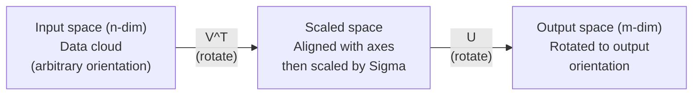
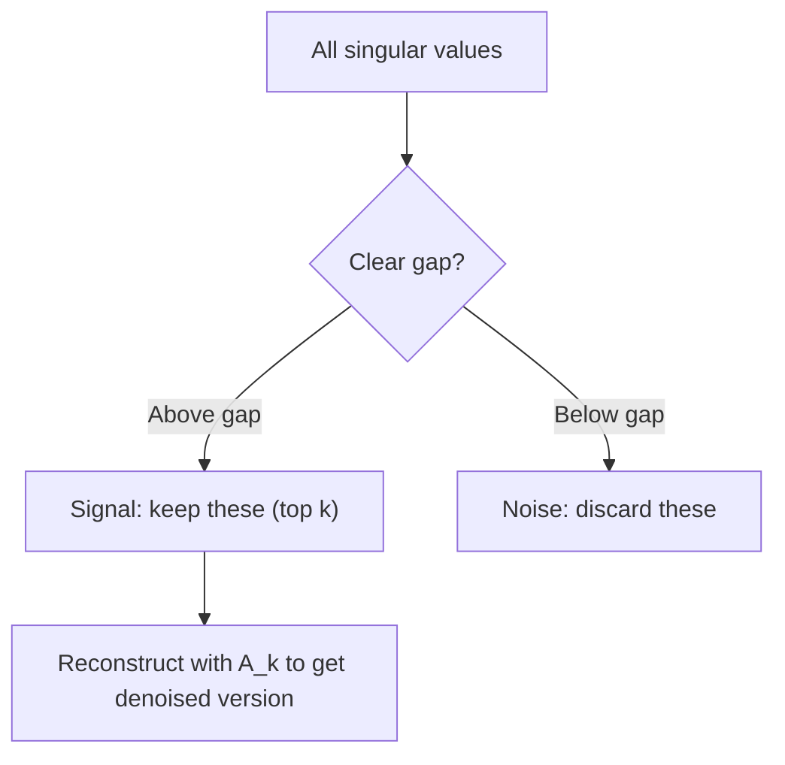

# Singular Value Decomposition | 奇异值分解 (SVD)

> SVD is the Swiss Army knife of linear algebra. Every matrix has one. Every data scientist needs one.
> SVD 是线性代数的"瑞士军刀"。每个矩阵都有一个。每个数据科学家都需要一个。

**Type:** Build | **类型:** 动手
**Languages:** Python, Julia | **语言:** Python, Julia
**Prerequisites:** Phase 1, Lessons 01 (Linear Algebra Intuition), 02 (Vectors & Matrices Operations), 03 (Matrix Transformations) | **前置知识:** Phase 1, Lessons 01-03
**Time:** ~120 minutes | **时间:** ~120 分钟

## Learning Objectives | 学习目标

- Implement SVD via power iteration and explain the geometric meaning of U, Sigma, and V^T
  通过幂迭代实现 SVD，解释 U、Sigma 和 V^T 的几何含义
- Apply truncated SVD for image compression and measure the compression ratio vs reconstruction error
  应用截断 SVD 进行图像压缩，测量压缩比与重建误差
- Compute the Moore-Penrose pseudoinverse via SVD to solve overdetermined least-squares systems
  通过 SVD 计算 Moore-Penrose 伪逆来求解超定最小二乘系统
- Connect SVD to PCA, recommendation systems (latent factors), and Latent Semantic Analysis in NLP
  将 SVD 与 PCA、推荐系统（隐因子）和 NLP 中的潜在语义分析联系起来

> **【中文解读】**
> SVD 是线性代数的"瑞士军刀"——任何矩阵都能分解为 U * Sigma * V^T。截断 SVD 可以压缩图像，用户-电影评分矩阵的 SVD 可以发现隐因子（推荐系统的核心），文档-词频矩阵的 SVD 可以发现主题（LSA）。

> **【拓展：SVD 在 AI 中的位置】**
> - **推荐系统**: Netflix 竞赛的获胜方案就是用户-物品评分矩阵的 SVD 分解。
> - **图像压缩**: 截断 SVD 只保留最大的几个奇异值，就能用很少的数据近似还原图像。
> - **LSA (潜在语义分析)**: NLP 中最早的主题模型方法，对文档-词矩阵做 SVD 发现隐含主题。

## The Problem | 问题引入

> **【中文解读】** 你有一个 1000×2000 的矩阵（可能是用户-电影评分、文档-词频表、图片像素）。特征值分解只适用于方阵，SVD 则对任意形状、任意秩的矩阵都有效。它把矩阵分解为三个因子 U·Σ·V^T，揭示矩阵"做了什么"的几何本质。

Maybe it is user-movie ratings. Maybe it is a document-term frequency table. Maybe it is the pixel values of an image. You need to compress it, denoise it, find hidden structure in it, or solve a least-squares system with it. Eigendecomposition only works on square matrices. Even then, it requires the matrix to have a full set of linearly independent eigenvectors.
> 也许是用户-电影评分，也许是文档-词频表，也许是图像像素。你需要压缩它、去噪、发现隐藏结构，或用它求解最小二乘。特征值分解只适用于方阵，且需要矩阵有完整的线性无关特征向量。

SVD works on any matrix. Any shape. Any rank. No conditions. It decomposes the matrix into three factors that reveal the geometry of what the matrix does to space. It is the most general and most useful factorization in all of linear algebra.
> SVD 适用于任何矩阵。任何形状、任何秩、无条件。它将矩阵分解为三个因子，揭示矩阵对空间做了什么。它是线性代数中最通用、最有用的分解。

## The Concept | 核心概念

> **【拓展：SVD 是 LoRA 的数学根基】** LoRA 微调的核心假设：权重更新矩阵 ΔW 是低秩的。SVD 告诉我们，任何矩阵都可以分解为 U·Σ·V^T，其中 Σ 中的奇异值按大小排列。LoRA 只保留最大的 k 个奇异值对应的分量（即 rank-k 近似），参数从 mn 减少到 k(m+n)。这就是 SVD 从理论到应用的直接转化。

### What SVD does geometrically | SVD 的几何含义

Every matrix, regardless of shape, performs three operations in sequence: rotate, scale, rotate. SVD makes this decomposition explicit.
> 每个矩阵，无论形状如何，都按顺序执行三个操作：旋转、缩放、旋转。SVD 使这个分解显式化。

```
A = U * Sigma * V^T

      m x n     m x m    m x n    n x n
     (any)    (rotate)  (scale)  (rotate)
```

Given any matrix A, SVD factors it into:
> 给定任意矩阵 A，SVD 将其分解为：

- V^T rotates vectors in the input space (n-dimensional)
  V^T 在输入空间（n 维）中旋转向量
- Sigma scales along each axis (stretches or compresses)
  Sigma 沿每个轴缩放（拉伸或压缩）
- U rotates the result into the output space (m-dimensional)
  U 将结果旋转到输出空间（m 维）



Think of it this way. You hand SVD a matrix. It tells you: "This matrix takes a sphere of inputs, first rotates it by V^T, then stretches it into an ellipsoid by Sigma, then rotates the ellipsoid by U." The singular values are the lengths of the ellipsoid's axes.
> 想象一下：你把矩阵交给 SVD，它告诉你："这个矩阵接收一组球面输入，先用 V^T 旋转，再用 Sigma 拉伸成椭球，再用 U 旋转椭球。"奇异值就是椭球各轴的长度。

### The full decomposition | 完整分解

For a matrix A with shape m x n:

```
A = U * Sigma * V^T

where:
  U     is m x m, orthogonal (U^T U = I)
  Sigma is m x n, diagonal (singular values on the diagonal)
  V     is n x n, orthogonal (V^T V = I)

The singular values sigma_1 >= sigma_2 >= ... >= sigma_r > 0
where r = rank(A)
```

The columns of U are called left singular vectors. The columns of V are called right singular vectors. The diagonal entries of Sigma are called singular values. They are always non-negative and conventionally sorted in decreasing order.
> U 的列称为左奇异向量，V 的列称为右奇异向量，Sigma 的对角线元素称为奇异值。它们始终非负，按惯例降序排列。

### Left singular vectors, singular values, right singular vectors | 左奇异向量、奇异值、右奇异向量

Each component of the SVD has a distinct geometric meaning.
> SVD 的每个分量都有独特的几何含义。

**Right singular vectors (columns of V):** These form an orthonormal basis for the input space (R^n). They are the directions in input space that the matrix maps to orthogonal directions in output space. Think of them as the natural coordinate system for the domain.
> **右奇异向量（V 的列）：** 构成输入空间 (R^n) 的正交基。它们是输入空间中矩阵映射到输出空间正交方向的方向。

**Singular values (diagonal of Sigma):** These are the scaling factors. The i-th singular value tells you how much the matrix stretches vectors along the i-th right singular vector. A singular value of zero means the matrix crushes that direction entirely.
> **奇异值（Sigma 的对角线）：** 缩放因子。第 i 个奇异值告诉你矩阵沿第 i 个右奇异向量方向拉伸多少。奇异值为零意味着矩阵完全压扁了该方向。

**Left singular vectors (columns of U):** These form an orthonormal basis for the output space (R^m). The i-th left singular vector is the direction in output space where the i-th right singular vector lands (after scaling).
> **左奇异向量（U 的列）：** 构成输出空间 (R^m) 的正交基。第 i 个左奇异向量是第 i 个右奇异向量（缩放后）落在输出空间中的方向。

The relationship between them:
> 它们之间的关系：

```
A * v_i = sigma_i * u_i

The matrix A takes the i-th right singular vector v_i,
scales it by sigma_i, and maps it to the i-th left singular vector u_i.
```

This gives you a coordinate-by-coordinate picture of what any matrix does.
> 这为你提供了任何矩阵操作的逐坐标图像。

### Outer product form | 外积形式

The SVD can be written as a sum of rank-1 matrices:
> SVD 可以写成秩-1 矩阵之和：

```
A = sigma_1 * u_1 * v_1^T + sigma_2 * u_2 * v_2^T + ... + sigma_r * u_r * v_r^T

Each term sigma_i * u_i * v_i^T is a rank-1 matrix (an outer product).
The full matrix is the sum of r such matrices, where r is the rank.
```

This form is the foundation of low-rank approximation. Each term adds one layer of structure. The first term captures the single most important pattern. The second captures the next most important. And so on. Truncating this sum gives you the best possible approximation at any given rank.
> 这种形式是低秩近似的基础。每项添加一层结构。第一项捕获最重要的模式，第二项捕获次重要的，依此类推。截断此和在任意给定秩处给出最佳近似。

```
Rank-1 approx:    A_1 = sigma_1 * u_1 * v_1^T
                  (captures the dominant pattern)

Rank-2 approx:    A_2 = sigma_1 * u_1 * v_1^T + sigma_2 * u_2 * v_2^T
                  (captures the two most important patterns)

Rank-k approx:    A_k = sum of top k terms
                  (optimal by the Eckart-Young theorem)
```

### Relationship to eigendecomposition | 与特征值分解的关系

SVD and eigendecomposition are deeply connected. The singular values and vectors of A come directly from the eigenvalues and eigenvectors of A^T A and A A^T.
> SVD 和特征值分解深度相关。A 的奇异值和向量直接来自 A^T A 和 A A^T 的特征值和特征向量。

```
A^T A = V * Sigma^T * U^T * U * Sigma * V^T
      = V * Sigma^T * Sigma * V^T
      = V * D * V^T

where D = Sigma^T * Sigma is a diagonal matrix with sigma_i^2 on the diagonal.

So:
- The right singular vectors (V) are eigenvectors of A^T A
- The singular values squared (sigma_i^2) are eigenvalues of A^T A

Similarly:
A A^T = U * Sigma * V^T * V * Sigma^T * U^T
      = U * Sigma * Sigma^T * U^T

So:
- The left singular vectors (U) are eigenvectors of A A^T
- The eigenvalues of A A^T are also sigma_i^2
```

This connection tells you three things:
> 这个联系告诉你三件事：

1. Singular values are always real and non-negative (they are square roots of eigenvalues of a positive semi-definite matrix).
   奇异值始终为实数且非负。
2. You could compute SVD via eigendecomposition of A^T A, but this squares the condition number and loses numerical precision. Dedicated SVD algorithms avoid this.
   可以通过 A^T A 的特征值分解计算 SVD，但这会平方条件数，损失数值精度。
3. When A is square and symmetric positive semi-definite, SVD and eigendecomposition are the same thing.
   当 A 是方阵且对称正半定时，SVD 和特征值分解是一回事。

### Truncated SVD: low-rank approximation | 截断 SVD：低秩近似

The Eckart-Young-Mirsky theorem states that the best rank-k approximation to A (in both Frobenius and spectral norm) is obtained by keeping only the top k singular values and their corresponding vectors:
> Eckart-Young-Mirsky 定理指出，A 的最佳秩-k 近似（在 Frobenius 和谱范数下）通过只保留前 k 个奇异值及其对应向量获得：

```
A_k = U_k * Sigma_k * V_k^T

where:
  U_k     is m x k  (first k columns of U)
  Sigma_k is k x k  (top-left k x k block of Sigma)
  V_k     is n x k  (first k columns of V)

Approximation error = sigma_{k+1}  (in spectral norm)
                    = sqrt(sigma_{k+1}^2 + ... + sigma_r^2)  (in Frobenius norm)
```

This is not just "a good" approximation. It is provably the best possible approximation of rank k. No other rank-k matrix is closer to A.
> 这不只是"一个很好的"近似。它是可证明的秩 k 最佳近似。没有其他秩-k 矩阵比它更接近 A。

| Component | Relative magnitude | Kept in rank-3 approx? / 保留在秩-3 近似中？ |
|-----------|-------------------|------------------------|
| sigma_1 | Largest / 最大 | Yes / 是 |
| sigma_2 | Large / 大 | Yes / 是 |
| sigma_3 | Medium-large / 中大 | Yes / 是 |
| sigma_4 | Medium / 中 | No (error) / 否（误差） |
| sigma_5 | Medium-small / 中小 | No (error) / 否（误差） |
| sigma_6 | Small / 小 | No (error) / 否（误差） |
| sigma_7 | Very small / 很小 | No (error) / 否（误差） |
| sigma_8 | Tiny / 极小 | No (error) / 否（误差） |

Keep top 3: A_3 captures the three largest singular values. Error = remaining values (sigma_4 through sigma_8).

If singular values decay fast, a small k captures most of the matrix. If they decay slowly, the matrix has no low-rank structure.
> 如果奇异值快速衰减，小的 k 就能捕获矩阵大部分。如果衰减缓慢，矩阵没有低秩结构。

### Image compression with SVD | 用 SVD 压缩图像

A grayscale image is a matrix of pixel intensities. An 800x600 image has 480,000 values. SVD lets you approximate it with far fewer.
> 灰度图像是像素强度矩阵。800x600 的图像有 480,000 个值。SVD 可以用远少于此的值来近似。

```
Original image: 800 x 600 = 480,000 values

SVD with rank k:
  U_k:      800 x k values
  Sigma_k:  k values
  V_k:      600 x k values
  Total:    k * (800 + 600 + 1) = k * 1401 values

  k=10:   14,010 values   (2.9% of original)
  k=50:   70,050 values  (14.6% of original)
  k=100: 140,100 values  (29.2% of original)

  The compression ratio improves as k gets smaller,
  but visual quality degrades.
```

The key insight: natural images have rapidly decaying singular values. The first few singular values capture the broad structure (shapes, gradients). The later ones capture fine detail and noise. Truncating at rank 50 often produces an image that looks nearly identical to the original while using 85% less storage.
> 关键洞见：自然图像的奇异值快速衰减。前几个奇异值捕获宏观结构（形状、渐变），后面的捕获细节和噪声。在秩 50 处截断通常产生与原图几乎相同的图像，同时节省 85% 的存储。

### SVD for recommendation systems | SVD 用于推荐系统

The Netflix Prize made this famous. You have a user-movie ratings matrix where most entries are missing.
> Netflix 竞赛使之出名。你有一个大部分条目缺失的用户-电影评分矩阵。

```
             Movie1  Movie2  Movie3  Movie4  Movie5
  User1      [  5      ?       3       ?       1  ]
  User2      [  ?      4       ?       2       ?  ]
  User3      [  3      ?       5       ?       ?  ]
  User4      [  ?      ?       ?       4       3  ]

  ? = unknown rating
```

The idea: this ratings matrix has low rank. Users do not have completely independent tastes. There are a handful of latent factors (action vs. drama, old vs. new, cerebral vs. visceral) that explain most preferences.
> 核心思想：评分矩阵是低秩的。用户的品味并非完全独立。存在少数隐因子（动作 vs 文艺、老片 vs 新片）能解释大部分偏好。

SVD on the (filled-in) ratings matrix decomposes it into:
> 对（填充后的）评分矩阵做 SVD 分解为：

- U: user profiles in latent factor space / 隐因子空间中的用户画像
- Sigma: importance of each latent factor / 每个隐因子的重要性
- V^T: movie profiles in latent factor space / 隐因子空间中的电影画像

A user's predicted rating for a movie is the dot product of their user profile with the movie's profile (weighted by singular values). The low-rank approximation fills in the missing entries.
> 用户对电影的预测评分是其用户画像与电影画像的点积（加权奇异值）。低秩近似填充缺失条目。

### SVD in NLP: Latent Semantic Analysis | SVD 在 NLP 中：潜在语义分析

Latent Semantic Analysis (LSA), also called Latent Semantic Indexing (LSI), applies SVD to a term-document matrix.
> 潜在语义分析 (LSA) 将 SVD 应用于词-文档矩阵。

```
             Doc1   Doc2   Doc3   Doc4
  "cat"      [  3      0      1      0  ]
  "dog"      [  2      0      0      1  ]
  "fish"     [  0      4      1      0  ]
  "pet"      [  1      1      1      1  ]
  "ocean"    [  0      3      0      0  ]

After SVD with rank k=2:

  Each document becomes a point in 2D "concept space."
  Each term becomes a point in the same 2D space.
  Documents about similar topics cluster together.
  Terms with similar meanings cluster together.
```

LSA was one of the first successful methods for capturing semantic similarity from raw text. It works because synonymous terms tend to appear in similar documents, so SVD groups them into the same latent dimensions. Modern word embeddings (Word2Vec, GloVe) can be seen as descendants of this idea.
> LSA 是最早从原始文本捕获语义相似度的成功方法之一。它有效是因为同义词往往出现在相似的文档中，SVD 将它们归入相同的隐维度。现代词嵌入（Word2Vec、GloVe）可视为此思想的后继。

### SVD for noise reduction | SVD 用于降噪

Noisy data has signal concentrated in the top singular values and noise spread across all singular values. Truncating removes the noise floor.
> 噪声数据中信号集中在顶部奇异值，噪声分散在所有奇异值中。截断移除噪声基底。



This is used in signal processing, scientific measurement, and data cleaning. Any time you have a matrix corrupted by additive noise, truncated SVD is a principled way to separate signal from noise.
> 这用于信号处理、科学测量和数据清洗。只要你有被加性噪声污染的矩阵，截断 SVD 是一种有原则的信号与噪声分离方法。

### Pseudoinverse via SVD | 通过 SVD 计算伪逆

The Moore-Penrose pseudoinverse A+ generalizes matrix inversion to non-square and singular matrices. SVD makes computing it trivial.
> Moore-Penrose 伪逆 A+ 将矩阵求逆推广到非方阵和奇异矩阵。SVD 使计算变得简单。

```
If A = U * Sigma * V^T, then:

A+ = V * Sigma+ * U^T

where Sigma+ is formed by:
  1. Transpose Sigma (swap rows and columns)
  2. Replace each non-zero diagonal entry sigma_i with 1/sigma_i
  3. Leave zeros as zeros
```

The pseudoinverse solves least-squares problems. If Ax = b has no exact solution (overdetermined system), then x = A+ b is the least-squares solution (minimizes ||Ax - b||).
> 伪逆求解最小二乘问题。如果 Ax = b 没有精确解（超定系统），则 x = A+ b 是最小二乘解。

### Numerical stability advantages | 数值稳定性优势

Computing eigendecomposition of A^T A squares the singular values (eigenvalues of A^T A are sigma_i^2). This squares the condition number, amplifying numerical errors.
> 计算 A^T A 的特征值分解会平方奇异值，平方条件数，放大数值误差。

Modern SVD algorithms (Golub-Kahan bidiagonalization) work directly on A, never forming A^T A. This is why you should always prefer `np.linalg.svd(A)` over `np.linalg.eig(A.T @ A)`.
> 现代 SVD 算法直接对 A 操作，不形成 A^T A。这就是为什么应始终用 `np.linalg.svd(A)` 而非 `np.linalg.eig(A.T @ A)`。

### Connection to PCA | 与 PCA 的联系

PCA IS SVD on centered data. This is not an analogy. It is literally the same computation.
> PCA 就是对中心化数据做 SVD。这不是类比，是完全相同的计算。

```
Given data matrix X (n_samples x n_features), centered (mean subtracted):

Covariance matrix: C = (1/(n-1)) * X^T X

PCA finds eigenvectors of C. But:

  X = U * Sigma * V^T    (SVD of X)

  X^T X = V * Sigma^2 * V^T

  C = (1/(n-1)) * V * Sigma^2 * V^T

So the principal components are exactly the right singular vectors V.
The explained variance for each component is sigma_i^2 / (n-1).

In sklearn, PCA is implemented using SVD, not eigendecomposition.
It is faster and more numerically stable.
```

This means everything you learned about dimensionality reduction in Lesson 10 is SVD under the hood. PCA is the most common application of SVD in machine learning.
> 这意味着你在 Lesson 10 学到的降维内容底层都是 SVD。PCA 是 SVD 在机器学习中最常见的应用。

## Build It | 动手实现

### Step 1: SVD from scratch using power iteration | 第1步：用幂迭代从零实现 SVD

The idea: to find the largest singular value and its vectors, use power iteration on A^T A (or A A^T). Then deflate the matrix and repeat for the next singular value.
> 思路：用幂迭代在 A^T A 上找最大奇异值及其向量，然后收缩矩阵，重复找下一个奇异值。

```python
import numpy as np

def power_iteration(M, num_iters=100):
    n = M.shape[1]
    v = np.random.randn(n)
    v = v / np.linalg.norm(v)

    for _ in range(num_iters):
        Mv = M @ v
        v = Mv / np.linalg.norm(Mv)

    eigenvalue = v @ M @ v
    return eigenvalue, v

def svd_from_scratch(A, k=None):
    m, n = A.shape
    if k is None:
        k = min(m, n)

    sigmas = []
    us = []
    vs = []

    A_residual = A.copy().astype(float)

    for _ in range(k):
        AtA = A_residual.T @ A_residual
        eigenvalue, v = power_iteration(AtA, num_iters=200)

        if eigenvalue < 1e-10:
            break

        sigma = np.sqrt(eigenvalue)
        u = A_residual @ v / sigma

        sigmas.append(sigma)
        us.append(u)
        vs.append(v)

        A_residual = A_residual - sigma * np.outer(u, v)

    U = np.column_stack(us) if us else np.empty((m, 0))
    S = np.array(sigmas)
    V = np.column_stack(vs) if vs else np.empty((n, 0))

    return U, S, V
```

### Step 2: Test and compare with NumPy | 第2步：测试并与 NumPy 比较

```python
np.random.seed(42)
A = np.random.randn(5, 4)

U_ours, S_ours, V_ours = svd_from_scratch(A)
U_np, S_np, Vt_np = np.linalg.svd(A, full_matrices=False)

print("Our singular values:", np.round(S_ours, 4))
print("NumPy singular values:", np.round(S_np, 4))

A_reconstructed = U_ours @ np.diag(S_ours) @ V_ours.T
print(f"Reconstruction error: {np.linalg.norm(A - A_reconstructed):.8f}")
```

### Step 3: Image compression demo | 第3步：图像压缩演示

```python
def compress_image_svd(image_matrix, k):
    U, S, Vt = np.linalg.svd(image_matrix, full_matrices=False)
    compressed = U[:, :k] @ np.diag(S[:k]) @ Vt[:k, :]
    return compressed

image = np.random.seed(42)
rows, cols = 200, 300
image = np.random.randn(rows, cols)

for k in [1, 5, 10, 20, 50]:
    compressed = compress_image_svd(image, k)
    error = np.linalg.norm(image - compressed) / np.linalg.norm(image)
    original_size = rows * cols
    compressed_size = k * (rows + cols + 1)
    ratio = compressed_size / original_size
    print(f"k={k:>3d}  error={error:.4f}  storage={ratio:.1%}")
```

### Step 4: Noise reduction | 第4步：降噪

```python
np.random.seed(42)
clean = np.outer(np.sin(np.linspace(0, 4*np.pi, 100)),
                 np.cos(np.linspace(0, 2*np.pi, 80)))
noise = 0.3 * np.random.randn(100, 80)
noisy = clean + noise

U, S, Vt = np.linalg.svd(noisy, full_matrices=False)
denoised = U[:, :5] @ np.diag(S[:5]) @ Vt[:5, :]

print(f"Noisy error:    {np.linalg.norm(noisy - clean):.4f}")
print(f"Denoised error: {np.linalg.norm(denoised - clean):.4f}")
print(f"Improvement:    {(1 - np.linalg.norm(denoised - clean) / np.linalg.norm(noisy - clean)):.1%}")
```

### Step 5: Pseudoinverse | 第5步：伪逆

```python
A = np.array([[1, 1], [2, 1], [3, 1]], dtype=float)
b = np.array([3, 5, 6], dtype=float)

U, S, Vt = np.linalg.svd(A, full_matrices=False)
S_inv = np.diag(1.0 / S)
A_pinv = Vt.T @ S_inv @ U.T

x_svd = A_pinv @ b
x_lstsq = np.linalg.lstsq(A, b, rcond=None)[0]
x_pinv = np.linalg.pinv(A) @ b

print(f"SVD pseudoinverse solution:  {x_svd}")
print(f"np.linalg.lstsq solution:   {x_lstsq}")
print(f"np.linalg.pinv solution:    {x_pinv}")
```

## Use It | 用框架实现

Full working demos are in `code/svd.py`. Run it to see SVD applied to image compression, recommendation systems, latent semantic analysis, and noise reduction.
> 完整可运行的演示在 `code/svd.py` 中。运行它可看到 SVD 应用于图像压缩、推荐系统、潜在语义分析和降噪。

```bash
python svd.py
```

The Julia version in `code/svd.jl` demonstrates the same concepts using Julia's native `svd()` function and `LinearAlgebra` package.
> `code/svd.jl` 中的 Julia 版本使用 Julia 原生 `svd()` 函数和 `LinearAlgebra` 包演示相同概念。

```bash
julia svd.jl
```

## Ship It | 产出物

This lesson produces:
> 本课程产出：

- `outputs/skill-svd.md` - a skill for knowing when and how to apply SVD in real projects
  一份关于何时及如何在真实项目中应用 SVD 的技能文档

## Exercises | 练习题

1. Implement the full SVD from scratch without using power iteration. Instead, compute the eigendecomposition of A^T A to get V and the singular values, then compute U = A V Sigma^{-1}. Compare numerical accuracy with your power iteration version and with NumPy.
   不使用幂迭代从零实现完整 SVD。改为计算 A^T A 的特征值分解来获得 V 和奇异值，然后计算 U = A V Sigma^{-1}。比较数值精度。

2. Load a real grayscale image (or convert one to grayscale). Compress it at ranks 1, 5, 10, 25, 50, 100. For each rank, compute the compression ratio and the relative error. Find the rank where the image becomes visually acceptable.
   加载一张真实灰度图像。用秩 1、5、10、25、50、100 压缩。计算每个秩的压缩比和相对误差。找到图像视觉可接受的秩。

3. Build a tiny recommendation system. Create a 10x8 user-movie ratings matrix with some known entries. Fill missing entries with row means. Compute SVD and reconstruct a rank-3 approximation. Use the reconstructed matrix to predict the missing ratings.
   构建一个小型推荐系统。创建 10x8 用户-电影评分矩阵。用行均值填充缺失条目。计算 SVD 并重建秩-3 近似。用重建矩阵预测缺失评分。

4. Create a 100x50 document-term matrix with 3 synthetic topics. Each topic has 5 associated terms. Add noise. Apply SVD and verify that the top 3 singular values are much larger than the rest. Project documents into the 3D latent space and check that documents from the same topic cluster together.
   创建一个有 3 个合成主题的 100x50 文档-词矩阵。每个主题有 5 个关联词。加噪声。应用 SVD 验证前 3 个奇异值远大于其余的。

5. Generate a clean low-rank matrix (rank 3, size 50x40) and add Gaussian noise at different levels (sigma = 0.1, 0.5, 1.0, 2.0). For each noise level, find the optimal truncation rank by sweeping k from 1 to 40 and measuring reconstruction error against the clean matrix.
   生成干净的秩-3 矩阵（50x40），加不同级别的高斯噪声。对每个噪声级别，通过扫描 k 找到最优截断秩。

## Key Terms | 术语速查表

| Term / 术语 | What people say | What it actually means / 实际含义 |
|------|----------------|----------------------|
| SVD / 奇异值分解 | "Factor any matrix" | Decompose A into U Sigma V^T where U and V are orthogonal and Sigma is diagonal with non-negative entries. Works for any matrix of any shape. / 将 A 分解为 U Sigma V^T，U 和 V 正交，Sigma 对角非负。适用于任何形状的矩阵。 |
| Singular value / 奇异值 | "How important this component is" | The i-th diagonal entry of Sigma. Measures how much the matrix stretches along the i-th principal direction. / Sigma 的第 i 个对角线元素。衡量矩阵沿第 i 主方向的拉伸程度。 |
| Left singular vector / 左奇异向量 | "Output direction" | A column of U. The direction in output space that the i-th right singular vector maps to. / U 的列。第 i 个右奇异向量映射到的输出空间方向。 |
| Right singular vector / 右奇异向量 | "Input direction" | A column of V. The direction in input space that the matrix maps to the i-th left singular vector. / V 的列。矩阵映射到第 i 个左奇异向量的输入空间方向。 |
| Truncated SVD / 截断 SVD | "Low-rank approximation" | Keep only the top k singular values and their vectors. Produces the provably best rank-k approximation (Eckart-Young theorem). / 只保留前 k 个奇异值及其向量。产生可证明的最佳秩-k 近似。 |
| Rank / 秩 | "True dimensionality" | The number of non-zero singular values. Tells you how many independent directions the matrix actually uses. / 非零奇异值的数量。告诉你矩阵实际使用多少独立方向。 |
| Pseudoinverse / 伪逆 | "Generalized inverse" | V Sigma+ U^T. Inverts non-zero singular values, leaves zeros as zeros. Solves least-squares for non-square or singular matrices. / V Sigma+ U^T。反转非零奇异值，零保持不变。 |
| Condition number / 条件数 | "How sensitive to errors" | sigma_max / sigma_min. A large condition number means small input changes cause large output changes. / sigma_max / sigma_min。条件数大意味着小的输入变化引起大的输出变化。 |
| Latent factor / 隐因子 | "Hidden variable" | A dimension in the low-rank space discovered by SVD. In recommendations, a genre preference. In NLP, a topic. / SVD 发现的低秩空间中的维度。推荐中是类型偏好，NLP 中是主题。 |
| Frobenius norm / Frobenius 范数 | "Total matrix size" | Square root of the sum of squared entries. Equals sqrt of sum of squared singular values. / 所有元素平方和的平方根。等于奇异值平方和的平方根。 |
| Eckart-Young theorem / Eckart-Young 定理 | "SVD gives the best compression" | For any target rank k, the truncated SVD minimizes the approximation error over all possible rank-k matrices. / 对任意目标秩 k，截断 SVD 在所有可能的秩-k 矩阵中最小化近似误差。 |
| Power iteration / 幂迭代 | "Find the biggest eigenvector" | Repeatedly multiply a random vector by the matrix and normalize. Converges to the largest eigenvector. / 反复将随机向量乘以矩阵并归一化。收敛到最大特征向量。 |

## Further Reading | 延伸阅读

- [Gilbert Strang: Linear Algebra and Its Applications, Chapter 7](https://math.mit.edu/~gs/linearalgebra/) - thorough treatment of SVD with applications
  SVD 的完整处理与应用
- [3Blue1Brown: But what is the SVD?](https://www.youtube.com/watch?v=vSczTbgc8Rc) - geometric intuition for SVD
  SVD 的几何直觉
- [We Recommend a Singular Value Decomposition](https://www.ams.org/publicoutreach/feature-column/fcarc-svd) - accessible overview from the American Mathematical Society
  来自 AMS 的 SVD 入门概述
- [Netflix Prize and Matrix Factorization](https://sifter.org/~simon/journal/20061211.html) - Simon Funk's original blog post on SVD for recommendations
  Simon Funk 关于 SVD 推荐的原始博客
- [Latent Semantic Analysis](https://en.wikipedia.org/wiki/Latent_semantic_analysis) - the original NLP application of SVD
  SVD 在 NLP 中的原始应用
- [Numerical Linear Algebra by Trefethen and Bau](https://people.maths.ox.ac.uk/trefethen/text.html) - the gold standard for understanding SVD algorithms
  理解 SVD 算法的黄金标准
