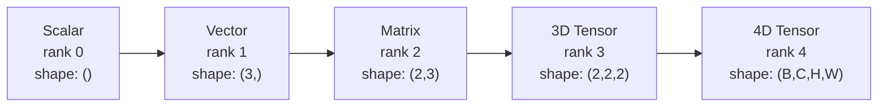
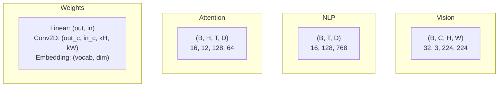
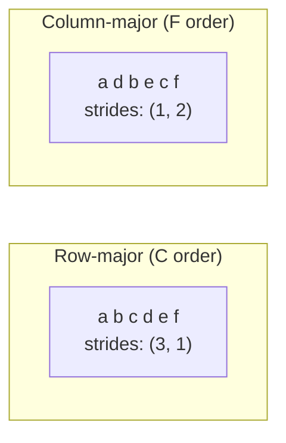
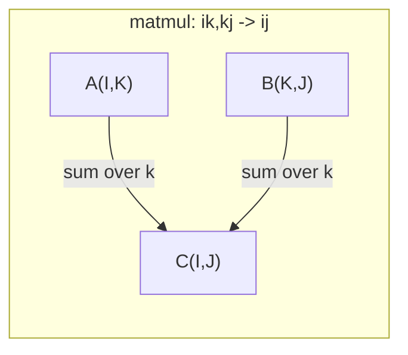

# Tensor Operations | 张量运算

> Tensors are the common language between data and deep learning. Every image, every sentence, every gradient flows through them.
> 张量是数据和深度学习的通用语言。每张图像、每个句子、每个梯度都通过张量流动。

**Type:** Build | **类型:** 动手
**Language:** Python | **语言:** Python
**Prerequisites:** Phase 1, Lessons 01 (Linear Algebra Intuition), 02 (Vectors, Matrices & Operations) | **前置知识:** Phase 1, Lessons 01-02
**Time:** ~90 minutes | **时间:** ~90 分钟

## Learning Objectives | 学习目标

- Implement a tensor class with shape, strides, reshape, transpose, and element-wise operations from scratch
  从零实现具有形状、步长、重塑、转置和逐元素操作的张量类
- Apply broadcasting rules to operate on tensors of different shapes without copying data
  应用广播规则对不同形状的张量进行操作而无需复制数据
- Write einsum expressions for dot products, matrix multiplications, outer products, and batched operations
  编写 einsum 表达式实现点积、矩阵乘法、外积和批量操作
- Trace the exact tensor shapes through every step of multi-head attention
  跟踪多头注意力中每一步的精确张量形状

> **【中文解读】**
> 张量是数据和深度学习的通用语言。向量是一维张量，矩阵是二维张量，RGB 图像是三维张量。本章从零实现张量类，理解形状、步长、广播和 einsum。Transformer 多头注意力中 Q/K/V 都是四维张量，理解张量形状是调试的关键。

## The Problem | 问题引入

> **【中文解读】** 你构建了一个 Transformer，运行后报错 `RuntimeError: shapes cannot be multiplied (32x768 and 512x768)`。Shape 错误是深度学习中最常见的 bug。Transformer 有几十个 reshape/transpose/broadcast 操作串联，一个轴搞错就级联报错。张量是向量和矩阵的推广，理解张量操作是调试神经网络的基本功。

## The Concept | 核心概念

> **【拓展：张量 shape 是 AI 工程师的日常】** 调试神经网络 90% 的时间在处理 shape 问题。关键工具：`print(tensor.shape)` 查看形状，`.reshape()` 重塑，`.transpose()` 转置，`.unsqueeze()` 增加维度。PyTorch 的 einsum（`torch.einsum('bhd,bhd->bh', q, k)`）用 Einstein 求和约定一行搞定复杂张量运算，是 Transformer 实现的利器。

### What a tensor is | 什么是张量

A tensor is a multi-dimensional array of numbers with a uniform data type. The number of dimensions is the **rank** (or **order**). Each dimension is an **axis**. The **shape** is a tuple listing the size along each axis.
> 张量是具有统一数据类型的多维数组。维度数是**秩**（或**阶**），每个维度是一个**轴**，**形状**是列出各轴大小的元组。



Total elements = product of all sizes. A shape `(2, 3, 4)` holds `2 * 3 * 4 = 24` elements.
> 总元素数 = 所有维度大小的乘积。形状 `(2, 3, 4)` 包含 `2 * 3 * 4 = 24` 个元素。

### Tensor shapes in deep learning | 深度学习中的张量形状

Different data types map to specific tensor shapes by convention.
> 不同数据类型按惯例映射到特定的张量形状。



PyTorch uses NCHW (channels-first). TensorFlow defaults to NHWC (channels-last). Mismatched layouts cause silent slowdowns or errors.
> PyTorch 使用 NCHW（通道在前），TensorFlow 默认 NHWC（通道在后）。布局不匹配会导致隐性减速或错误。

### How memory layout works | 内存布局原理

A 2D array in memory is a 1D sequence of bytes. **Strides** tell you how many elements to skip to move one step along each axis.
> 内存中的 2D 数组是 1D 字节序列。**步长**告诉你沿每个轴移动一步需要跳过多少个元素。



Transpose does not move data. It swaps the strides, making the tensor **non-contiguous** -- the elements for a row are no longer adjacent in memory.
> 转置不移动数据。它交换步长，使张量**不连续**——一行的元素不再在内存中相邻。

### Broadcasting rules | 广播规则

Broadcasting lets you operate on tensors of different shapes without copying data. Align shapes from the right. Two dimensions are compatible when they are equal or one is 1. Fewer dimensions get padded with 1s on the left.
> 广播让你对形状不同的张量操作而无需复制数据。从右对齐形状。两个维度相等或其中一个为 1 时兼容。较少的维度在左侧填充 1。

```
Tensor A:     (8, 1, 6, 1)
Tensor B:        (7, 1, 5)
Padded B:     (1, 7, 1, 5)
Result:       (8, 7, 6, 5)
```

### Einsum: the universal tensor operation | Einsum：通用张量操作

Einstein summation labels each axis with a letter. Axes in the input but not the output get summed. Axes in both are kept.
> Einstein 求和用字母标记每个轴。在输入但不在输出中的轴被求和。两者都有的轴保留。



Key patterns: `i,i->` (dot product / 点积), `i,j->ij` (outer product / 外积), `ii->` (trace / 迹), `ij->ji` (transpose / 转置), `bij,bjk->bik` (batch matmul / 批量矩阵乘法), `bhtd,bhsd->bhts` (attention scores / 注意力分数).

## Build It | 动手实现

The code lives in `code/tensors.py`. Each step references the implementation there.
> 代码在 `code/tensors.py` 中。每一步都引用那里的实现。

### Step 1: Tensor storage and strides | 第1步：张量存储与步长

A tensor stores a flat list of numbers plus shape metadata. Strides tell the indexing logic how to map multi-dimensional indices to flat positions.
> 张量存储一个扁平的数字列表加上形状元数据。步长告诉索引逻辑如何将多维索引映射到扁平位置。

```python
class Tensor:
    def __init__(self, data, shape=None):
        if isinstance(data, (list, tuple)):
            self._data, self._shape = self._flatten_nested(data)
        elif isinstance(data, np.ndarray):
            self._data = data.flatten().tolist()
            self._shape = tuple(data.shape)
        else:
            self._data = [data]
            self._shape = ()

        if shape is not None:
            total = reduce(lambda a, b: a * b, shape, 1)
            if total != len(self._data):
                raise ValueError(
                    f"Cannot reshape {len(self._data)} elements into shape {shape}"
                )
            self._shape = tuple(shape)

        self._strides = self._compute_strides(self._shape)

    @staticmethod
    def _compute_strides(shape):
        if len(shape) == 0:
            return ()
        strides = [1] * len(shape)
        for i in range(len(shape) - 2, -1, -1):
            strides[i] = strides[i + 1] * shape[i + 1]
        return tuple(strides)
```

For shape `(3, 4)`, strides are `(4, 1)` -- skip 4 elements to advance one row, skip 1 element to advance one column.
> 对于形状 `(3, 4)`，步长为 `(4, 1)`——前进一行跳过 4 个元素，前进一列跳过 1 个元素。

### Step 2: Reshape, squeeze, unsqueeze | 第2步：重塑、压缩、扩展维度

Reshape changes the shape without changing element order. The total number of elements must stay the same. Use `-1` for one dimension to infer its size.
> Reshape 改变形状而不改变元素顺序。总元素数必须不变。用 `-1` 自动推断某一维的大小。

```python
t = Tensor(list(range(12)), shape=(2, 6))
r = t.reshape((3, 4))
r = t.reshape((-1, 3))
```

Squeeze removes axes of size 1. Unsqueeze inserts one. Unsqueezing is critical for broadcasting -- a bias vector `(D,)` added to a batch `(B, T, D)` needs unsqueezing to `(1, 1, D)`.
> Squeeze 移除大小为 1 的轴，Unsqueeze 插入一个。Unsqueeze 对广播至关重要——偏置向量 `(D,)` 加到批次 `(B, T, D)` 上需要 unsqueeze 到 `(1, 1, D)`。

```python
t = Tensor(list(range(6)), shape=(1, 3, 1, 2))
s = t.squeeze()
v = Tensor([1, 2, 3])
u = v.unsqueeze(0)
```

### Step 3: Transpose and permute | 第3步：转置与排列

Transpose swaps two axes. Permute reorders all axes. This is how you convert between NCHW and NHWC.
> Transpose 交换两个轴。Permute 重排所有轴。这是在 NCHW 和 NHWC 之间转换的方式。

```python
mat = Tensor(list(range(6)), shape=(2, 3))
tr = mat.transpose(0, 1)

t4d = Tensor(list(range(24)), shape=(1, 2, 3, 4))
perm = t4d.permute((0, 2, 3, 1))
```

After transpose or permute, the tensor is non-contiguous in memory. In PyTorch, `view` fails on non-contiguous tensors -- use `reshape` or call `.contiguous()` first.
> 转置或排列后，张量在内存中不连续。PyTorch 中 `view` 在不连续张量上会失败——使用 `reshape` 或先调用 `.contiguous()`。

### Step 4: Element-wise operations and reductions | 第4步：逐元素操作与归约

Element-wise ops (add, multiply, subtract) apply independently to each element and preserve shape. Reductions (sum, mean, max) collapse one or more axes.
> 逐元素操作（加、乘、减）独立应用于每个元素并保持形状。归约（sum、mean、max）折叠一个或多个轴。

```python
a = Tensor([[1, 2], [3, 4]])
b = Tensor([[10, 20], [30, 40]])
c = a + b
d = a * 2
s = a.sum(axis=0)
```

Global average pooling in a CNN: `(B, C, H, W).mean(axis=[2, 3])` produces `(B, C)`. Sequence mean pooling in NLP: `(B, T, D).mean(axis=1)` produces `(B, D)`.
> CNN 中的全局平均池化：`(B, C, H, W).mean(axis=[2, 3])` 产生 `(B, C)`。NLP 中的序列均值池化：`(B, T, D).mean(axis=1)` 产生 `(B, D)`。

### Step 5: Broadcasting with NumPy | 第5步：用 NumPy 实现广播

The `demo_broadcasting_numpy()` function in `tensors.py` shows the core patterns.
> `tensors.py` 中的 `demo_broadcasting_numpy()` 函数展示了核心模式。

```python
activations = np.random.randn(4, 3)
bias = np.array([0.1, 0.2, 0.3])
result = activations + bias

images = np.random.randn(2, 3, 4, 4)
scale = np.array([0.5, 1.0, 1.5]).reshape(1, 3, 1, 1)
result = images * scale

a = np.array([1, 2, 3]).reshape(-1, 1)
b = np.array([10, 20, 30, 40]).reshape(1, -1)
outer = a * b
```

Pairwise distance via broadcasting: reshape `(M, 2)` to `(M, 1, 2)` and `(N, 2)` to `(1, N, 2)`, subtract, square, sum along last axis, take square root. Result: `(M, N)`.
> 通过广播计算成对距离：将 `(M, 2)` 重塑为 `(M, 1, 2)`，`(N, 2)` 重塑为 `(1, N, 2)`，相减、平方、沿最后轴求和、取平方根。结果：`(M, N)`。

### Step 6: Einsum operations | 第6步：Einsum 操作

The `demo_einsum()` and `demo_einsum_gallery()` functions walk through every common pattern.
> `demo_einsum()` 和 `demo_einsum_gallery()` 函数演示了每种常见模式。

```python
a = np.array([1.0, 2.0, 3.0])
b = np.array([4.0, 5.0, 6.0])
dot = np.einsum("i,i->", a, b)

A = np.array([[1, 2], [3, 4], [5, 6]], dtype=float)
B = np.array([[7, 8, 9], [10, 11, 12]], dtype=float)
matmul = np.einsum("ik,kj->ij", A, B)

batch_A = np.random.randn(4, 3, 5)
batch_B = np.random.randn(4, 5, 2)
batch_mm = np.einsum("bij,bjk->bik", batch_A, batch_B)
```

The computational cost of a contraction is the product of all index sizes (kept and summed). For `bij,bjk->bik` with B=32, I=128, J=64, K=128: `32 * 128 * 64 * 128 = 33,554,432` multiply-adds.
> 收缩的计算成本是所有索引大小（保留和求和的）的乘积。

### Step 7: Attention mechanism via einsum | 第7步：用 einsum 实现注意力机制

The `demo_attention_einsum()` function implements multi-head attention end to end.
> `demo_attention_einsum()` 函数端到端实现多头注意力。

```python
B, H, T, D = 2, 4, 8, 16
E = H * D

X = np.random.randn(B, T, E)
W_q = np.random.randn(E, E) * 0.02

Q = np.einsum("bte,ek->btk", X, W_q)
Q = Q.reshape(B, T, H, D).transpose(0, 2, 1, 3)

scores = np.einsum("bhtd,bhsd->bhts", Q, K) / np.sqrt(D)
weights = softmax(scores, axis=-1)
attn_output = np.einsum("bhts,bhsd->bhtd", weights, V)

concat = attn_output.transpose(0, 2, 1, 3).reshape(B, T, E)
output = np.einsum("bte,ek->btk", concat, W_o)
```

Every step is a tensor operation: projection (matmul via einsum), head splitting (reshape + transpose), attention scores (batch matmul via einsum), weighted sum (batch matmul via einsum), head merging (transpose + reshape), output projection (matmul via einsum).
> 每一步都是张量操作：投影（einsum 矩阵乘法）、头分裂（reshape + transpose）、注意力分数（einsum 批量矩阵乘法）、加权求和、头合并（transpose + reshape）、输出投影。

## Use It | 用框架实现

### Scratch vs NumPy | 手写 vs NumPy

| Operation / 操作 | Scratch (Tensor class) | NumPy |
|---|---|---|
| Create / 创建 | `Tensor([[1,2],[3,4]])` | `np.array([[1,2],[3,4]])` |
| Reshape / 重塑 | `t.reshape((3,4))` | `a.reshape(3,4)` |
| Transpose / 转置 | `t.transpose(0,1)` | `a.T` or `a.transpose(0,1)` |
| Squeeze / 压缩 | `t.squeeze(0)` | `np.squeeze(a, 0)` |
| Sum / 求和 | `t.sum(axis=0)` | `a.sum(axis=0)` |
| Einsum | N/A | `np.einsum("ij,jk->ik", a, b)` |

### Scratch vs PyTorch | 手写 vs PyTorch

```python
import torch

t = torch.tensor([[1, 2, 3], [4, 5, 6]], dtype=torch.float32)
t.shape
t.stride()
t.is_contiguous()

t.reshape(3, 2)
t.unsqueeze(0)
t.transpose(0, 1)
t.transpose(0, 1).contiguous()

torch.einsum("ik,kj->ij", A, B)
```

PyTorch adds autograd, GPU support, and optimized BLAS kernels. The shape semantics are identical. If you understand the scratch version, PyTorch shape errors become readable.
> PyTorch 增加了自动微分、GPU 支持和优化的 BLAS 内核。形状语义完全相同。理解手写版本后，PyTorch 的形状错误变得可读。

### Every neural network layer as a tensor operation | 每个神经网络层都是张量操作

| Operation / 操作 | Tensor Form / 张量形式 | Einsum |
|---|---|---|
| Linear layer / 线性层 | `Y = X @ W.T + b` | `"bd,od->bo"` + bias |
| Attention QKV | `Q = X @ W_q` | `"btd,dh->bth"` |
| Attention scores / 注意力分数 | `Q @ K.T / sqrt(d)` | `"bhtd,bhsd->bhts"` |
| Attention output / 注意力输出 | `softmax(scores) @ V` | `"bhts,bhsd->bhtd"` |
| Batch norm / 批归一化 | `(X - mu) / sigma * gamma` | element-wise + broadcast |
| Softmax | `exp(x) / sum(exp(x))` | element-wise + reduction |

## Ship It | 产出物

This lesson produces two reusable prompts:
> 本课程产出两个可复用的提示词：

1. **`outputs/prompt-tensor-shapes.md`** -- A systematic prompt for debugging tensor shape mismatches.
   一份系统性的张量形状不匹配调试提示词。

2. **`outputs/prompt-tensor-debugger.md`** -- A step-by-step debugging prompt you paste into any AI assistant when a shape error is blocking you.
   一份逐步调试提示词，在形状错误阻塞时粘贴到任何 AI 助手中。

## Exercises | 练习题

1. **Easy -- Reshape round-trip.** Take a tensor of shape `(2, 3, 4)`. Reshape it to `(6, 4)`, then to `(24,)`, then back to `(2, 3, 4)`. Verify element order is preserved at each step by printing the flat data.
   **简单 -- 重塑往返。** 取形状 `(2, 3, 4)` 的张量，重塑为 `(6, 4)`，再为 `(24,)`，再回到 `(2, 3, 4)`。验证元素顺序保持不变。

2. **Medium -- Implement broadcasting.** Extend the `Tensor` class with a `broadcast_to(shape)` method that expands dimensions of size 1 to match a target shape. Then modify `_elementwise_op` to automatically broadcast before operating. Test with shapes `(3, 1)` and `(1, 4)` producing `(3, 4)`.
   **中等 -- 实现广播。** 在 `Tensor` 类中添加 `broadcast_to(shape)` 方法。修改 `_elementwise_op` 自动广播。测试 `(3, 1)` 和 `(1, 4)` 产生 `(3, 4)`。

3. **Hard -- Build einsum from scratch.** Implement a basic `einsum(subscripts, *tensors)` function that handles at least: dot product (`i,i->`), matrix multiply (`ij,jk->ik`), outer product (`i,j->ij`), and transpose (`ij->ji`). Parse the subscript string, identify contracted indices, and loop over all index combinations. Compare your results against `np.einsum`.
   **困难 -- 从零构建 einsum。** 实现基本的 `einsum` 函数处理点积、矩阵乘法、外积和转置。解析下标字符串，识别收缩索引，遍历所有索引组合。

4. **Hard -- Attention shape tracker.** Write a function that takes `batch_size`, `seq_len`, `embed_dim`, and `num_heads` as inputs and prints the exact shape at every step of multi-head attention.
   **困难 -- 注意力形状追踪器。** 编写函数，输入 `batch_size`、`seq_len`、`embed_dim` 和 `num_heads`，打印多头注意力每一步的精确形状。

## Key Terms | 术语速查表

| Term / 术语 | What people say | What it actually means / 实际含义 |
|---|---|---|
| Tensor / 张量 | "A matrix but more dimensions" | A multi-dimensional array with uniform type and defined shape, strides, and operations / 具有统一类型和定义的形状、步长、操作的多维数组 |
| Rank / 秩 | "The number of dimensions" | The number of axes. A matrix has rank 2, not rank equal to its matrix rank / 轴的数量。矩阵的秩为 2 |
| Shape / 形状 | "The size of the tensor" | A tuple listing the size along each axis. `(2, 3)` means 2 rows, 3 columns / 列出各轴大小的元组 |
| Stride / 步长 | "How memory is laid out" | The number of elements to skip to advance one position along each axis / 沿每个轴前进一个位置要跳过的元素数 |
| Broadcasting / 广播 | "It just works when shapes differ" | A strict set of rules: align from right, dimensions must be equal or one must be 1 / 严格规则：从右对齐，维度必须相等或一个为 1 |
| Contiguous / 连续 | "The tensor is normal" | Elements stored sequentially in memory with no gaps / 元素在内存中顺序存储无间隙 |
| Einsum | "A fancy way to write matmul" | A general notation that expresses any tensor contraction, outer product, trace, or transpose in one line / 通用表示法，一行表达任何张量收缩、外积、迹或转置 |
| View / 视图 | "Same as reshape" | A tensor sharing the same memory buffer but with different shape/stride metadata. Fails on non-contiguous data / 共享内存缓冲区但形状/步长元数据不同的张量 |
| Contraction / 收缩 | "Summing over an index" | The general operation where a shared index between tensors is multiplied and summed / 共享索引被乘和求和的通用操作 |
| NCHW / NHWC | "PyTorch vs TensorFlow format" | Memory layout conventions for image tensors / 图像张量的内存布局约定 |

## Further Reading | 延伸阅读

- [NumPy Broadcasting](https://numpy.org/doc/stable/user/basics.broadcasting.html) -- The canonical rules with visual examples
  NumPy 广播规则与可视化示例
- [PyTorch Tensor Views](https://pytorch.org/docs/stable/tensor_view.html) -- When views work and when they copy
  PyTorch 视图何时工作何时复制
- [einops](https://github.com/arogozhnikov/einops) -- A library that makes tensor reshaping readable and safe
  让张量重塑可读且安全的库
- [The Illustrated Transformer](https://jalammar.github.io/illustrated-transformer/) -- Visualizes the tensor shapes flowing through attention
  可视化注意力中流动的张量形状
- [Einstein Summation in NumPy](https://numpy.org/doc/stable/reference/generated/numpy.einsum.html) -- Full einsum documentation with examples
  NumPy einsum 完整文档与示例
