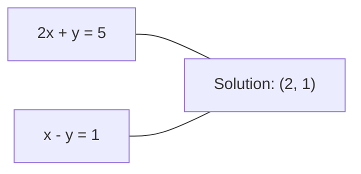
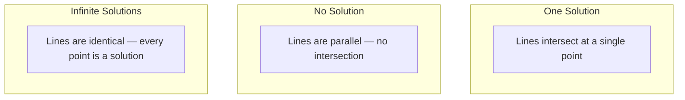

# Linear Systems | 线性系统

> Solving Ax = b is the oldest problem in mathematics that still runs your neural network.
> 解 Ax=b 是数学中最古老的问题，至今仍在驱动你的神经网络。

**Type:** Build | **类型:** 动手
**Language:** Python | **语言:** Python
**Prerequisites:** Phase 1, Lessons 01 (Linear Algebra Intuition), 02 (Vectors & Matrices), 03 (Matrix Transformations) | **前置知识:** Phase 1, 第 01 课（线性代数直觉）、第 02 课（向量与矩阵）、第 03 课（矩阵变换）
**Time:** ~120 minutes | **时间:** ~120 分钟

## Learning Objectives | 学习目标

- Solve Ax = b using Gaussian elimination with partial pivoting and back substitution
  使用带部分主元选取（Partial Pivoting）的高斯消元法和回代法求解 Ax = b
- Factor matrices with LU, QR, and Cholesky decompositions and explain when each is appropriate
  使用 LU、QR 和 Cholesky 分解（Decomposition）分解矩阵，并解释各方法的适用场景
- Derive the normal equations for least squares and connect them to linear and ridge regression
  推导最小二乘法的正规方程（Normal Equations），并将其与线性回归和岭回归联系起来
- Diagnose ill-conditioned systems using the condition number and apply regularization to stabilize them
  使用条件数（Condition Number）诊断病态系统，并应用正则化（Regularization）使其稳定


> **【中文解读】**
> 解 Ax=b 是数学中最古老的问题。线性回归的正规方程、岭回归的正则化系统、高斯过程的矩阵分解——都是线性系统。条件数衡量系统的数值稳定性。

## The Problem | 问题引入

Every time you train a linear regression, you solve a linear system. Every time you compute a least-squares fit, you solve a linear system. Every time a neural network layer computes `y = Wx + b`, it is evaluating one side of a linear system. When you add regularization, you modify the system. When you use Gaussian processes, you factor a matrix. When you invert a covariance matrix for Mahalanobis distance, you solve a linear system.

> 每次训练线性回归，你都在解线性系统。每次计算最小二乘拟合，你都在解线性系统。每次神经网络层计算 `y = Wx + b`，它都在评估线性系统的一侧。添加正则化时，你修改了系统。使用高斯过程（Gaussian Process）时，你对矩阵做分解。为了 Mahalanobis 距离而求逆协方差矩阵时，你也在解线性系统。

The equation Ax = b appears everywhere. A is a matrix of known coefficients. b is a vector of known outputs. x is the vector of unknowns you want to find. In linear regression, A is your data matrix, b is your target vector, and x is the weight vector. The entire model reduces to: find x such that Ax is as close to b as possible.

> 方程 Ax = b 无处不在。A 是已知系数矩阵，b 是已知输出向量，x 是你要求的未知向量。在线性回归中，A 是数据矩阵，b 是目标向量，x 是权重向量。整个模型归结为：找到 x 使得 Ax 尽可能接近 b。

This lesson builds every major method for solving that equation from scratch. You will understand why some methods are fast and others are stable, why some work only for square systems and others handle overdetermined ones, and why the condition number of your matrix determines whether your answer means anything at all.

> 本课从零构建求解该方程的所有主要方法。你将理解为什么有些方法快而有些稳定，为什么有些只适用于方阵系统而有些能处理超定系统，以及为什么矩阵的条件数决定了你的答案是否有意义。

## The Concept | 核心概念

> **【中文解读】**
> Ax=b 的几何含义：每行方程定义一个超平面，解是所有超平面的交点。对于超定系统（方程数 > 未知数），不存在精确解，最小二乘法找到让残差最小的"最佳近似"。这就是线性回归的数学本质。

> **【拓展：线性系统在推荐系统中的规模】**
> Netflix Prize 竞赛中，矩阵分解问题涉及 480,000 个用户和 17,770 部电影。这个约 500,000 x 17,770 的矩阵需要高效的矩阵分解算法。Netflix 大奖赛推动了大规模矩阵分解（SVD、ALS）算法的发展，如今这些方法仍是推荐系统的核心。

### What Ax = b means geometrically

A system of linear equations has a geometric interpretation. Each equation defines a hyperplane. The solution is the point (or set of points) where all hyperplanes intersect.

> 线性方程组有几何解释。每个方程定义一个超平面（Hyperplane）。解是所有超平面的交点（或交点集）。

```
2x + y = 5          Two lines in 2D.
x - y  = 1          They intersect at x=2, y=1.
```



Three things can happen:



In matrix form, "one solution" means A is invertible. "No solution" means the system is inconsistent. "Infinite solutions" means A has a null space. Most ML problems fall in the "no exact solution" category because you have more equations (data points) than unknowns (parameters). That is where least squares comes in.

> 用矩阵语言说，"一个解"意味着 A 可逆。"无解"意味着系统不一致。"无穷多解"意味着 A 有零空间（Null Space）。大多数 ML 问题属于"无精确解"类别，因为方程数（数据点）多于未知数（参数）。这就是最小二乘法的用武之地。

### Column picture vs row picture

There are two ways to read Ax = b.

> 阅读 Ax = b 有两种方式。

**Row picture.** Each row of A defines one equation. Each equation is a hyperplane. The solution is where they all intersect.

> **行视角。** A 的每一行定义一个方程。每个方程是一个超平面。解是所有超平面的交点。

**Column picture.** Each column of A is a vector. The question becomes: what linear combination of the columns of A produces b?

> **列视角。** A 的每一列是一个向量。问题变成：A 的列的什么线性组合（Linear Combination）能产生 b？

```
A = | 2  1 |    b = | 5 |
    | 1 -1 |        | 1 |

Row picture: solve 2x + y = 5 and x - y = 1 simultaneously.

Column picture: find x1, x2 such that:
  x1 * [2, 1] + x2 * [1, -1] = [5, 1]
  2 * [2, 1] + 1 * [1, -1] = [4+1, 2-1] = [5, 1]   check.
```

The column picture is more fundamental. If b lies in the column space of A, the system has a solution. If b does not, you find the closest point in the column space. That closest point is the least-squares solution.

> 列视角更根本。如果 b 在 A 的列空间（Column Space）中，系统有解。如果 b 不在列空间中，你找到列空间中最近的点。那个最近的点就是最小二乘解。

### Gaussian elimination

Gaussian elimination transforms Ax = b into an upper triangular system Ux = c that you solve by back substitution. It is the most direct method.

> 高斯消元法将 Ax = b 转化为上三角系统 Ux = c，然后通过回代法求解。这是最直接的方法。

The algorithm:

```
1. For each column k (the pivot column):
   a. Find the largest entry in column k at or below row k (partial pivoting).
   b. Swap that row with row k.
   c. For each row i below k:
      - Compute multiplier m = A[i][k] / A[k][k]
      - Subtract m times row k from row i.
2. Back substitute: solve from the last equation upward.
```

Example:

```
Original:
| 2  1  1 | 8 |       R2 = R2 - (2)R1     | 2  1   1 |  8 |
| 4  3  3 |20 |  -->  R3 = R3 - (1)R1 --> | 0  1   1 |  4 |
| 2  3  1 |12 |                            | 0  2   0 |  4 |

                       R3 = R3 - (2)R2     | 2  1   1 |  8 |
                                       --> | 0  1   1 |  4 |
                                           | 0  0  -2 | -4 |

Back substitute:
  -2 * x3 = -4    -->  x3 = 2
  x2 + 2  = 4     -->  x2 = 2
  2*x1 + 2 + 2 = 8 --> x1 = 2
```

Gaussian elimination costs O(n^3) operations. For a 1000x1000 system, that is about a billion floating-point operations. Fast, but you can do better if you need to solve multiple systems with the same A.

> 高斯消元法的计算量是 O(n^3)。对于 1000x1000 的系统，大约需要十亿次浮点运算。很快，但如果需要对同一个 A 求解多个系统，还有更好的方法。

> **【中文解读】**
> 高斯消元法的思想很简单：通过行变换把矩阵变成上三角形式（对角线以下全是零），然后从最后一行开始"回代"求解。部分主元选取（partial pivoting）是关键——每步选绝对值最大的元素做主元，避免除以很小的数导致数值误差爆炸。

### Partial pivoting: why it matters

Without pivoting, Gaussian elimination can fail or produce garbage. If a pivot element is zero, you divide by zero. If it is small, you amplify rounding errors.

> 没有主元选取，高斯消元法可能失败或产生垃圾结果。如果主元为零，你会除以零。如果主元很小，你会放大舍入误差。

```
Bad pivot:                       With partial pivoting:
| 0.001  1 | 1.001 |            Swap rows first:
| 1      1 | 2     |            | 1      1 | 2     |
                                 | 0.001  1 | 1.001 |
m = 1/0.001 = 1000              m = 0.001/1 = 0.001
R2 = R2 - 1000*R1               R2 = R2 - 0.001*R1
| 0.001  1     | 1.001   |      | 1      1     | 2     |
| 0     -999   | -999.0  |      | 0      0.999 | 0.999 |

x2 = 1.000 (correct)            x2 = 1.000 (correct)
x1 = (1.001 - 1)/0.001          x1 = (2 - 1)/1 = 1.000 (correct)
   = 0.001/0.001 = 1.000        Stable because the multiplier is small.
```

In floating-point arithmetic with limited precision, the unpivoted version can lose significant digits. Partial pivoting always selects the largest available pivot to minimize error amplification.

> 在有限精度的浮点运算中，无主元选取的版本可能丢失有效数字。部分主元选取总是选择最大的可用主元以最小化误差放大。

### LU decomposition

LU decomposition factors A into a lower triangular matrix L and an upper triangular matrix U: A = LU. The L matrix stores the multipliers from Gaussian elimination. The U matrix is the result of elimination.

> LU 分解将 A 分解为一个下三角矩阵 L 和一个上三角矩阵 U：A = LU。L 矩阵存储高斯消元中的乘数。U 矩阵是消元的结果。

```
A = L @ U

| 2  1  1 |   | 1  0  0 |   | 2  1   1 |
| 4  3  3 | = | 2  1  0 | @ | 0  1   1 |
| 2  3  1 |   | 1  2  1 |   | 0  0  -2 |
```

Why factor instead of just eliminating? Because once you have L and U, solving Ax = b for any new b costs only O(n^2):

> 为什么分解而不是直接消元？因为一旦有了 L 和 U，对于任何新的 b 求解 Ax = b 只需 O(n^2)：

```
Ax = b
LUx = b
Let y = Ux:
  Ly = b    (forward substitution, O(n^2))
  Ux = y    (back substitution, O(n^2))
```

The O(n^3) cost is paid once during factorization. Every subsequent solve is O(n^2). If you need to solve 1000 systems with the same A but different b vectors, LU saves a factor of 1000/3 in total work.

> O(n^3) 的代价在分解时只付一次。每次后续求解只需 O(n^2)。如果需要对同一个 A 但不同的 b 向量求解 1000 个系统，LU 在总工作量上节省 1000/3 倍。

With partial pivoting, you get PA = LU where P is a permutation matrix recording the row swaps.

> 使用部分主元选取，得到 PA = LU，其中 P 是记录行交换的置换矩阵（Permutation Matrix）。

> **【拓展：LU 分解在大规模科学计算中的角色】**
> 有限元分析（FEA）中，结构力学的刚度矩阵通常是稀疏的百万阶矩阵。SuperLU 和 MUMPS 等库通过稀疏 LU 分解求解这些系统。一次分解后的多次求解时间可降低 100-1000 倍。天气预报模型每 6 小时更新一次，需要多次求解同一稀疏矩阵不同右侧向量的线性系统。

### QR decomposition

QR decomposition factors A into an orthogonal matrix Q and an upper triangular matrix R: A = QR.

> QR 分解将 A 分解为一个正交矩阵（Orthogonal Matrix）Q 和一个上三角矩阵 R：A = QR。

An orthogonal matrix has the property Q^T Q = I. Its columns are orthonormal vectors. Multiplying by Q preserves lengths and angles.

> 正交矩阵具有性质 Q^T Q = I。其列是标准正交向量。乘以 Q 保持长度和角度不变。

```
A = Q @ R

Q has orthonormal columns: Q^T Q = I
R is upper triangular

To solve Ax = b:
  QRx = b
  Rx = Q^T b    (just multiply by Q^T, no inversion needed)
  Back substitute to get x.
```

QR is numerically more stable than LU for solving least-squares problems. The Gram-Schmidt process builds Q column by column:

> QR 在求解最小二乘问题时数值上比 LU 更稳定。Gram-Schmidt 过程逐列构建 Q：

```
Given columns a1, a2, ... of A:

q1 = a1 / ||a1||

q2 = a2 - (a2 . q1) * q1        (subtract projection onto q1)
q2 = q2 / ||q2||                (normalize)

q3 = a3 - (a3 . q1) * q1 - (a3 . q2) * q2
q3 = q3 / ||q3||

R[i][j] = qi . aj    for i <= j
```

Each step removes the component along all previous q vectors, leaving only the new orthogonal direction.

> 每一步都移除沿所有先前 q 向量方向的分量，只留下新的正交方向。

### Cholesky decomposition

When A is symmetric (A = A^T) and positive definite (all eigenvalues positive), you can factor it as A = L L^T where L is lower triangular. This is the Cholesky decomposition.

> 当 A 是对称的（A = A^T）且正定的（所有特征值为正），你可以将其分解为 A = L L^T，其中 L 是下三角矩阵。这就是 Cholesky 分解。

```
A = L @ L^T

| 4  2 |   | 2  0 |   | 2  1 |
| 2  5 | = | 1  2 | @ | 0  2 |

L[i][i] = sqrt(A[i][i] - sum(L[i][k]^2 for k < i))
L[i][j] = (A[i][j] - sum(L[i][k]*L[j][k] for k < j)) / L[j][j]    for i > j
```

Cholesky is twice as fast as LU and requires half the storage. It only works for symmetric positive definite matrices, but those show up constantly:

> Cholesky 比 LU 快两倍，只需一半的存储空间。它只适用于对称正定矩阵，但这种矩阵无处不在：

- Covariance matrices are symmetric positive semi-definite (positive definite with regularization).
  协方差矩阵是对称半正定的（加正则化后正定）。
- The kernel matrix in Gaussian processes is symmetric positive definite.
  高斯过程中的核矩阵是对称正定的。
- The Hessian of a convex function at a minimum is symmetric positive definite.
  凸函数在极小值处的 Hessian 矩阵是对称正定的。
- A^T A is always symmetric positive semi-definite.
  A^T A 总是对称半正定的。

In Gaussian processes, you factor the kernel matrix K with Cholesky, then solve K alpha = y to get the predictive mean. The Cholesky factor also gives you the log-determinant for the marginal likelihood: log det(K) = 2 * sum(log(diag(L))).

> 在高斯过程中，你用 Cholesky 分解核矩阵 K，然后求解 K alpha = y 得到预测均值。Cholesky 因子还给出边际似然的行列式对数：log det(K) = 2 * sum(log(diag(L)))。

> **【中文解读】**
> Cholesky 分解是 LU 分解的"特殊优惠版"——只适用于对称正定矩阵，但速度是 LU 的两倍。好消息是 ML 中到处都是对称正定矩阵：协方差矩阵、核矩阵、X^T X、Hessian 矩阵。GPTQ 等模型量化方法中也用到 Cholesky 分解来处理 Hessian。

### Least squares: when Ax = b has no exact solution

If A is m x n with m > n (more equations than unknowns), the system is overdetermined. There is no exact solution. Instead, you minimize the squared error:

> 如果 A 是 m x n 且 m > n（方程数多于未知数），系统是超定的（Overdetermined）。没有精确解。取而代之，你最小化平方误差：

```
minimize ||Ax - b||^2

This is the sum of squared residuals:
  sum((A[i,:] @ x - b[i])^2 for i in range(m))
```

The minimizer satisfies the normal equations:

```
A^T A x = A^T b
```

Derivation: expand ||Ax - b||^2 = (Ax - b)^T (Ax - b) = x^T A^T A x - 2 x^T A^T b + b^T b. Take the gradient with respect to x, set it to zero: 2 A^T A x - 2 A^T b = 0.

> 推导：展开 ||Ax - b||^2 = (Ax - b)^T (Ax - b) = x^T A^T A x - 2 x^T A^T b + b^T b。对 x 求梯度并设为零：2 A^T A x - 2 A^T b = 0。

```
Original system (overdetermined, 4 equations, 2 unknowns):
| 1  1 |         | 3 |
| 1  2 | x     = | 5 |       No exact x satisfies all 4 equations.
| 1  3 |         | 6 |
| 1  4 |         | 8 |

Normal equations:
A^T A = | 4  10 |    A^T b = | 22 |
        | 10 30 |            | 63 |

Solve: x = [1.5, 1.7]

This is linear regression. x[0] is the intercept, x[1] is the slope.
```

### Normal equations = linear regression

The connection is exact. In linear regression, your data matrix X has one row per sample and one column per feature. Your target vector y has one entry per sample. The weight vector w satisfies:

> 这个联系是精确的。在线性回归中，数据矩阵 X 每行一个样本、每列一个特征。目标向量 y 每个样本一个条目。权重向量 w 满足：

```
X^T X w = X^T y
w = (X^T X)^(-1) X^T y
```

This is the closed-form solution to linear regression. Every call to `sklearn.linear_model.LinearRegression.fit()` computes this (or an equivalent via QR or SVD).

> 这是线性回归的解析解。每次调用 `sklearn.linear_model.LinearRegression.fit()` 都在计算这个（或通过 QR 或 SVD 的等价形式）。

Add a regularization term lambda * I to the matrix and you get ridge regression:

> 在矩阵上添加正则化项 lambda * I 就得到岭回归（Ridge Regression）：

```
(X^T X + lambda * I) w = X^T y
w = (X^T X + lambda * I)^(-1) X^T y
```

The regularization makes the matrix better conditioned (easier to invert accurately) and prevents overfitting by shrinking the weights toward zero. The matrix X^T X + lambda * I is always symmetric positive definite when lambda > 0, so you can use Cholesky to solve it.

> 正则化使矩阵条件数更好（更容易精确求逆）并通过将权重收缩到零来防止过拟合。当 lambda > 0 时，矩阵 X^T X + lambda * I 总是对称正定的，所以可以用 Cholesky 求解。

> **【拓展：条件数与深度学习训练稳定性】**
> Transformer 训练中的梯度爆炸/消失问题与条件数密切相关。残差连接（ResNet）和层归一化（LayerNorm）本质上是在改善各层的条件数。研究表明，当 X^T X 的条件数超过 10^10 时，float32 精度下线性回归的结果可能完全不可靠。混合精度训练（FP16/BF16）对条件数更加敏感，这是为什么需要 loss scaling 的原因。

### Pseudoinverse (Moore-Penrose)

The pseudoinverse A+ generalizes matrix inversion to non-square and singular matrices. For any matrix A:

> 伪逆（Pseudoinverse）A+ 将矩阵求逆推广到非方阵和奇异矩阵。对于任何矩阵 A：

```
x = A+ b

where A+ = V Sigma+ U^T    (computed via SVD)
```

Sigma+ is formed by taking the reciprocal of each nonzero singular value and transposing the result. If A = U Sigma V^T, then A+ = V Sigma+ U^T.

> Sigma+ 由每个非零奇异值取倒数并转置得到。如果 A = U Sigma V^T，那么 A+ = V Sigma+ U^T。

```
A = U Sigma V^T        (SVD)

Sigma = | 5  0 |       Sigma+ = | 1/5  0  0 |
        | 0  2 |                | 0  1/2  0 |
        | 0  0 |

A+ = V Sigma+ U^T
```

The pseudoinverse gives the minimum-norm least-squares solution. If the system has:
- One solution: A+ b gives it.
  一个解：A+ b 给出该解。
- No solution: A+ b gives the least-squares solution.
  无解：A+ b 给出最小二乘解。
- Infinite solutions: A+ b gives the one with the smallest ||x||.
  无穷多解：A+ b 给出范数最小的那个。

NumPy's `np.linalg.lstsq` and `np.linalg.pinv` both use the SVD internally.

> NumPy 的 `np.linalg.lstsq` 和 `np.linalg.pinv` 内部都使用 SVD。

### Condition number

The condition number measures how sensitive the solution is to small changes in the input. For a matrix A, the condition number is:

> 条件数（Condition Number）衡量解对输入微小变化的敏感程度。对于矩阵 A，条件数为：

```
kappa(A) = ||A|| * ||A^(-1)|| = sigma_max / sigma_min
```

where sigma_max and sigma_min are the largest and smallest singular values.

```
Well-conditioned (kappa ~ 1):        Ill-conditioned (kappa ~ 10^15):
Small change in b -->                Small change in b -->
small change in x                    huge change in x

| 2  0 |   kappa = 2/1 = 2          | 1   1          |   kappa ~ 10^15
| 0  1 |   safe to solve            | 1   1+10^(-15) |   solution is garbage
```

Rules of thumb:
- kappa < 100: safe, solution is accurate.
  安全，解是精确的。
- kappa ~ 10^k: you lose about k digits of precision from your floating-point arithmetic.
  你会丢失约 k 位浮点精度。
- kappa ~ 10^16 (for float64): the solution is meaningless. The matrix is effectively singular.
  解无意义。矩阵实际上是奇异的。

In ML, ill-conditioning happens when features are nearly collinear. Regularization (adding lambda * I) improves the condition number from sigma_max / sigma_min to (sigma_max + lambda) / (sigma_min + lambda).

> 在 ML 中，当特征近似共线（Collinear）时会出现病态条件。正则化（添加 lambda * I）将条件数从 sigma_max / sigma_min 改善为 (sigma_max + lambda) / (sigma_min + lambda)。

### Iterative methods: conjugate gradient

For very large sparse systems (millions of unknowns), direct methods like LU or Cholesky are too expensive. Iterative methods approximate the solution by improving a guess over many iterations.

> 对于非常大的稀疏系统（数百万未知数），LU 或 Cholesky 等直接方法太昂贵。迭代方法通过多次改进猜测来近似求解。

Conjugate gradient (CG) solves Ax = b when A is symmetric positive definite. It finds the exact solution in at most n iterations (in exact arithmetic), but typically converges much faster if the eigenvalues of A are clustered.

> 共轭梯度法（Conjugate Gradient, CG）在 A 是对称正定时求解 Ax = b。它最多 n 次迭代就能找到精确解（精确算术中），但如果 A 的特征值聚集在一起，通常收敛得更快。

```
Algorithm sketch:
  x0 = initial guess (often zero)
  r0 = b - A x0           (residual)
  p0 = r0                 (search direction)

  For k = 0, 1, 2, ...:
    alpha = (rk . rk) / (pk . A pk)
    x_{k+1} = xk + alpha * pk
    r_{k+1} = rk - alpha * A pk
    beta = (r_{k+1} . r_{k+1}) / (rk . rk)
    p_{k+1} = r_{k+1} + beta * pk
    if ||r_{k+1}|| < tolerance: stop
```

CG is used in:
- Large-scale optimization (Newton-CG method)
  大规模优化（Newton-CG 方法）
- Solving PDE discretizations
  求解偏微分方程离散化
- Kernel methods where the kernel matrix is too large to factor
  核矩阵太大无法分解的核方法
- Preconditioning for other iterative solvers
  其他迭代求解器的预处理

The convergence rate depends on the condition number. Better conditioned systems converge faster, which is another reason regularization helps.

> 收敛速率取决于条件数。条件数更好的系统收敛更快，这也是正则化有帮助的另一个原因。

> **【中文解读】**
> 共轭梯度法是大规模稀疏系统的救星。它不需要存储整个矩阵（O(n^2) 内存），只需矩阵-向量乘法（O(nnz) 时间）。在图神经网络的消息传递中，邻接矩阵-特征矩阵乘法本质上就是稀疏矩阵运算。条件数越小的系统收敛越快，这也是正则化的另一个好处。

### The full picture: which method when

| Method | Requirements | Cost | Use case |
|--------|-------------|------|----------|
| Gaussian elimination | Square, nonsingular A | O(n^3) | One-off solve of a square system |
| LU decomposition | Square, nonsingular A | O(n^3) factor + O(n^2) solve | Multiple solves with the same A |
| QR decomposition | Any A (m >= n) | O(mn^2) | Least squares, numerically stable |
| Cholesky | Symmetric positive definite A | O(n^3/3) | Covariance matrices, Gaussian processes, ridge regression |
| Normal equations | Overdetermined (m > n) | O(mn^2 + n^3) | Linear regression (small n) |
| SVD / pseudoinverse | Any A | O(mn^2) | Rank-deficient systems, minimum-norm solutions |
| Conjugate gradient | Symmetric positive definite, sparse A | O(n * k * nnz) | Large sparse systems, k = iterations |

### Connection to ML

Every method in this lesson appears in production ML:

> 本课中的每个方法都出现在生产 ML 中：

**Linear regression.** The closed-form solution solves the normal equations X^T X w = X^T y. This is done via Cholesky (if n is small) or QR (if numerical stability matters) or SVD (if the matrix might be rank-deficient).

> **线性回归。** 解析解求解正规方程 X^T X w = X^T y。通过 Cholesky（n 较小时）或 QR（需要数值稳定性时）或 SVD（矩阵可能不满秩时）完成。

**Ridge regression.** Adds lambda * I to X^T X. The regularized system (X^T X + lambda * I) w = X^T y is always solvable via Cholesky because X^T X + lambda * I is symmetric positive definite for lambda > 0.

> **岭回归。** 在 X^T X 上加 lambda * I。正则化系统 (X^T X + lambda * I) w = X^T y 总是可以通过 Cholesky 求解，因为当 lambda > 0 时 X^T X + lambda * I 是对称正定的。

**Gaussian processes.** The predictive mean requires solving K alpha = y where K is the kernel matrix. Cholesky factorization of K is the standard approach. The log marginal likelihood uses log det(K) = 2 sum(log(diag(L))).

> **高斯过程。** 预测均值需要求解 K alpha = y，其中 K 是核矩阵。Cholesky 分解 K 是标准方法。对数边际似然使用 log det(K) = 2 sum(log(diag(L)))。

**Neural network initialization.** Orthogonal initialization uses QR decomposition to create weight matrices whose columns are orthonormal. This prevents signal collapse in deep networks.

> **神经网络初始化。** 正交初始化使用 QR 分解创建列标准正交的权重矩阵。这防止了深层网络中的信号坍缩。

**Preconditioning.** Large-scale optimizers use incomplete Cholesky or incomplete LU as preconditioners for conjugate gradient solvers.

> **预处理。** 大规模优化器使用不完全 Cholesky 或不完全 LU 作为共轭梯度求解器的预处理条件。

**Feature engineering.** The condition number of X^T X tells you if your features are collinear. If kappa is large, drop features or add regularization.

> **特征工程。** X^T X 的条件数告诉你特征是否共线。如果 kappa 很大，删除特征或添加正则化。

## Build It | 动手实现

### Step 1: Gaussian elimination with partial pivoting

```python
import numpy as np

def gaussian_elimination(A, b):
    n = len(b)
    Ab = np.hstack([A.astype(float), b.reshape(-1, 1).astype(float)])

    for k in range(n):
        max_row = k + np.argmax(np.abs(Ab[k:, k]))  # 部分主元选取：找列中绝对值最大的行
        Ab[[k, max_row]] = Ab[[max_row, k]]           # 交换行使最大元素到主元位置

        if abs(Ab[k, k]) < 1e-12:                     # 检查主元是否接近零（矩阵奇异）
            raise ValueError(f"Matrix is singular or nearly singular at pivot {k}")

        for i in range(k + 1, n):
            m = Ab[i, k] / Ab[k, k]                   # 计算消元乘数
            Ab[i, k:] -= m * Ab[k, k:]                # 消元：将第 k 列第 i 行以下变为零

    x = np.zeros(n)
    for i in range(n - 1, -1, -1):
        x[i] = (Ab[i, -1] - Ab[i, i+1:n] @ x[i+1:n]) / Ab[i, i]  # 回代求解

    return x
```

### Step 2: LU decomposition

```python
def lu_decompose(A):
    n = A.shape[0]
    L = np.eye(n)
    U = A.astype(float).copy()
    P = np.eye(n)

    for k in range(n):
        max_row = k + np.argmax(np.abs(U[k:, k]))
        if max_row != k:
            U[[k, max_row]] = U[[max_row, k]]
            P[[k, max_row]] = P[[max_row, k]]
            if k > 0:
                L[[k, max_row], :k] = L[[max_row, k], :k]

        for i in range(k + 1, n):
            L[i, k] = U[i, k] / U[k, k]
            U[i, k:] -= L[i, k] * U[k, k:]

    return P, L, U

def lu_solve(P, L, U, b):
    n = len(b)
    Pb = P @ b.astype(float)

    y = np.zeros(n)
    for i in range(n):
        y[i] = Pb[i] - L[i, :i] @ y[:i]

    x = np.zeros(n)
    for i in range(n - 1, -1, -1):
        x[i] = (y[i] - U[i, i+1:] @ x[i+1:]) / U[i, i]

    return x
```

### Step 3: Cholesky decomposition

```python
def cholesky(A):
    n = A.shape[0]
    L = np.zeros_like(A, dtype=float)

    for i in range(n):
        for j in range(i + 1):
            s = A[i, j] - L[i, :j] @ L[j, :j]       # 减去已计算部分的贡献
            if i == j:
                if s <= 0:                             # 对角线元素必须为正（正定条件）
                    raise ValueError("Matrix is not positive definite")
                L[i, j] = np.sqrt(s)                  # 对角线元素 = sqrt(剩余值)
            else:
                L[i, j] = s / L[j, j]                 # 非对角线元素除以对应对角线值

    return L
```

### Step 4: Least squares via normal equations

```python
def least_squares_normal(A, b):
    AtA = A.T @ A
    Atb = A.T @ b
    return gaussian_elimination(AtA, Atb)

def ridge_regression(A, b, lam):
    n = A.shape[1]
    AtA = A.T @ A + lam * np.eye(n)
    Atb = A.T @ b
    L = cholesky(AtA)
    y = np.zeros(n)
    for i in range(n):
        y[i] = (Atb[i] - L[i, :i] @ y[:i]) / L[i, i]
    x = np.zeros(n)
    for i in range(n - 1, -1, -1):
        x[i] = (y[i] - L.T[i, i+1:] @ x[i+1:]) / L.T[i, i]
    return x
```

### Step 5: Condition number

```python
def condition_number(A):
    U, S, Vt = np.linalg.svd(A)
    return S[0] / S[-1]
```

## Use It | 用框架实现

Putting the pieces together for linear regression and ridge regression on real data:

> 将这些部分组合起来，在真实数据上进行线性回归和岭回归：

```python
np.random.seed(42)
X_raw = np.random.randn(100, 3)
w_true = np.array([2.0, -1.0, 0.5])
y = X_raw @ w_true + np.random.randn(100) * 0.1

X = np.column_stack([np.ones(100), X_raw])

w_ols = least_squares_normal(X, y)
print(f"OLS weights (ours):    {w_ols}")

w_np = np.linalg.lstsq(X, y, rcond=None)[0]
print(f"OLS weights (numpy):   {w_np}")
print(f"Max difference: {np.max(np.abs(w_ols - w_np)):.2e}")

w_ridge = ridge_regression(X, y, lam=1.0)
print(f"Ridge weights (ours):  {w_ridge}")

from sklearn.linear_model import Ridge
ridge_sk = Ridge(alpha=1.0, fit_intercept=False)
ridge_sk.fit(X, y)
print(f"Ridge weights (sklearn): {ridge_sk.coef_}")
```

## Ship It | 产出物

This lesson produces:
- `code/linear_systems.py` containing from-scratch implementations of Gaussian elimination, LU decomposition, Cholesky decomposition, least squares, and ridge regression
  包含高斯消元法、LU 分解、Cholesky 分解、最小二乘法和岭回归的从零实现
- A working demonstration that normal equations and sklearn's LinearRegression produce the same weights
  正规方程和 sklearn 的 LinearRegression 产生相同权重的演示

## Exercises | 练习题

1. Solve the system `[[1,2,3],[4,5,6],[7,8,10]] x = [6, 15, 27]` using your Gaussian elimination, your LU solver, and `np.linalg.solve`. Verify all three give the same answer within floating-point tolerance.

2. Generate a 50x5 random matrix X and target y = X @ w_true + noise. Solve for w using normal equations, QR (via `np.linalg.qr`), SVD (via `np.linalg.svd`), and `np.linalg.lstsq`. Compare all four solutions. Measure the condition number of X^T X and explain how it affects which method you trust.

3. Create a nearly singular matrix by making two columns almost identical (e.g., column 2 = column 1 + 1e-10 * noise). Compute its condition number. Solve Ax = b with and without regularization (add 0.01 * I). Compare the solutions and residuals. Explain why regularization helps.

4. Implement the conjugate gradient algorithm for a 100x100 random symmetric positive definite matrix. Count how many iterations it takes to converge to tolerance 1e-8. Compare with the theoretical maximum of n iterations.

5. Time your Cholesky solver vs your LU solver vs `np.linalg.solve` on symmetric positive definite matrices of size 10, 50, 200, 500. Plot the results. Verify Cholesky is roughly 2x faster than LU.

## Key Terms | 术语速查表

| Term | What people say | What it actually means |
|------|----------------|----------------------|
| Linear system | "Solve for x" | A set of linear equations Ax = b. Finding x means finding the input that produces output b under transformation A. |
| Gaussian elimination | "Row reduce" | Systematically zero out entries below the diagonal using row operations, producing an upper triangular system solvable by back substitution. O(n^3). |
| Partial pivoting | "Swap rows for stability" | Before eliminating in column k, swap the row with the largest absolute value in that column to the pivot position. Prevents division by small numbers. |
| LU decomposition | "Factor into triangles" | Write A = LU where L is lower triangular (stores multipliers) and U is upper triangular (the eliminated matrix). Amortizes the O(n^3) cost over multiple solves. |
| QR decomposition | "Orthogonal factorization" | Write A = QR where Q has orthonormal columns and R is upper triangular. More stable than LU for least squares. |
| Cholesky decomposition | "Square root of a matrix" | For symmetric positive definite A, write A = LL^T. Half the cost of LU. Used for covariance matrices, kernel matrices, and ridge regression. |
| Least squares | "Best fit when exact is impossible" | Minimize the sum of squared residuals ||Ax - b||^2 when the system is overdetermined (more equations than unknowns). |
| Normal equations | "The calculus shortcut" | A^T A x = A^T b. Setting the gradient of ||Ax - b||^2 to zero. This IS the closed-form solution to linear regression. |
| Pseudoinverse | "Inversion for non-square matrices" | A+ = V Sigma+ U^T via SVD. Gives the minimum-norm least-squares solution for any matrix, square or rectangular, singular or not. |
| Condition number | "How trustworthy is this answer" | kappa = sigma_max / sigma_min. Measures sensitivity to input perturbations. Lose about log10(kappa) digits of precision. |
| Ridge regression | "Regularized least squares" | Solve (X^T X + lambda I) w = X^T y. Adding lambda I improves conditioning and shrinks weights toward zero. Prevents overfitting. |
| Conjugate gradient | "Iterative Ax=b for big matrices" | An iterative solver for symmetric positive definite systems. Converges in at most n steps. Practical for large sparse systems where factorization is too expensive. |
| Overdetermined system | "More data than parameters" | m > n in an m-by-n system. No exact solution exists. Least squares finds the best approximation. This is every regression problem. |
| Back substitution | "Solve from the bottom up" | Given an upper triangular system, solve the last equation first, then substitute backward. O(n^2). |
| Forward substitution | "Solve from the top down" | Given a lower triangular system, solve the first equation first, then substitute forward. O(n^2). Used in the L step of LU solves. |

## Further Reading | 延伸阅读

- [MIT 18.06: Linear Algebra](https://ocw.mit.edu/courses/18-06-linear-algebra-spring-2010/) (Gilbert Strang) -- the definitive course on linear systems and matrix factorizations
- [Numerical Linear Algebra](https://people.maths.ox.ac.uk/trefethen/text.html) (Trefethen & Bau) -- the standard reference for understanding numerical stability, conditioning, and why algorithms fail
- [Matrix Computations](https://www.cs.cornell.edu/cv/GolubVanLoan4/golubandvanloan.htm) (Golub & Van Loan) -- the encyclopedic reference for every matrix algorithm
- [3Blue1Brown: Inverse Matrices](https://www.3blue1brown.com/lessons/inverse-matrices) -- visual intuition for what solving Ax = b means geometrically
