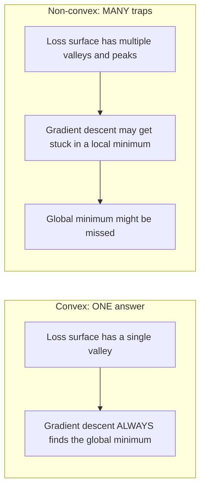
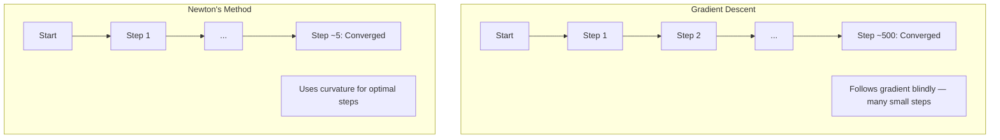
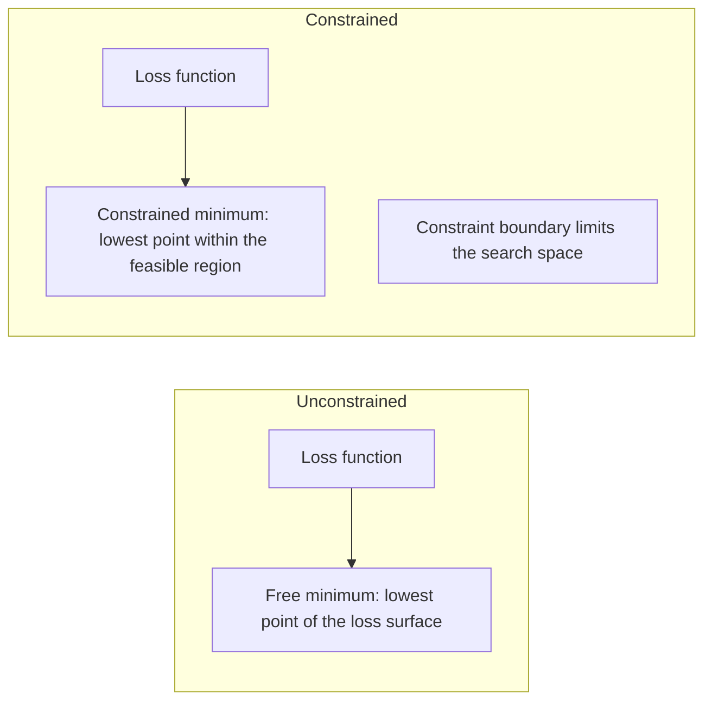
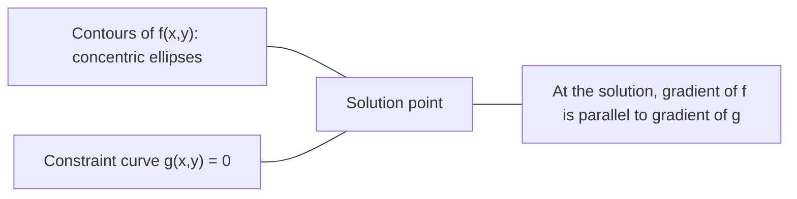

# Convex Optimization | 凸优化

> Convex problems have one valley. Neural networks have millions. Knowing the difference matters.
> 凸问题只有一个谷底。神经网络有数百万个。理解差异至关重要。

**Type:** Build | **类型:** 动手
**Language:** Python | **语言:** Python
**Prerequisites:** Phase 1, Lessons 04 (Calculus for ML), 08 (Optimization) | **前置知识:** Phase 1, 第 04 课（微积分）、第 08 课（优化）
**Time:** ~90 minutes | **时间:** ~90 分钟

## Learning Objectives | 学习目标

- Test whether a function is convex using the definition, second derivative, and Hessian criteria
  使用定义、二阶导数和 Hessian 判据测试函数是否为凸函数
- Implement Newton's method and compare its quadratic convergence against gradient descent
  实现牛顿法（Newton's Method）并比较其二次收敛与梯度下降
- Solve constrained optimization problems using Lagrange multipliers and interpret KKT conditions
  使用拉格朗日乘子（Lagrange Multipliers）求解约束优化问题，解释 KKT 条件
- Explain why neural network loss landscapes are non-convex yet SGD still finds good solutions
  解释为什么神经网络损失面是非凸的，但 SGD 仍能找到好解


> **【中文解读】**
> 凸函数只有一个山谷（全局最优），线性回归是凸的所以一定有全局最优。神经网络是非凸的但有无数个山谷，SGD 在实践中仍能找到好的解。牛顿法利用二阶信息实现二次收敛。

## The Problem | 问题引入

Lesson 08 taught you gradient descent, momentum, and Adam. Those optimizers walk downhill on any surface. But they come with no guarantees. Gradient descent on a non-convex landscape might land in a bad local minimum, get stuck on a saddle point, or oscillate forever. You used it anyway because neural networks are non-convex and there is no alternative.

> 第 08 课教你梯度下降、动量和 Adam。这些优化器可以在任何表面上下坡。但它们没有保证。在非凸表面上，梯度下降可能陷入差的局部最小值、卡在鞍点（Saddle Point）或永远振荡。你还是用了它，因为神经网络是非凸的，没有替代方案。

But many problems in machine learning are convex. Linear regression, logistic regression, SVMs, LASSO, ridge regression. For these, something stronger exists: optimization with mathematical guarantees. A convex problem has exactly one valley. Any algorithm that walks downhill will reach the global minimum. No restarts needed. No learning rate schedules. No prayer.

> 但机器学习中的许多问题是凸的。线性回归、逻辑回归、SVM、LASSO、岭回归。对于这些，存在更强的东西：带有数学保证的优化。凸问题恰好只有一个谷底。任何下坡算法都会到达全局最小值。不需要重启。不需要学习率调度。不需要祈祷。

Understanding convexity does three things. First, it tells you when your problem is easy (convex) versus hard (non-convex). Second, it gives you faster tools like Newton's method for convex problems. Third, it explains concepts that appear throughout ML: regularization as a constraint, duality in SVMs, and why deep learning works despite violating every nice property convexity gives you.

> 理解凸性有三个作用。第一，它告诉你问题何时是容易的（凸的）还是困难的（非凸的）。第二，它为凸问题提供了更快的工具，如牛顿法。第三，它解释了贯穿 ML 的概念：正则化作为约束、SVM 中的对偶性，以及为什么深度学习在违反凸性的所有优良性质的情况下仍然有效。

## The Concept | 核心概念

> **【中文解读】**
> 凸函数的形状像一个碗——只有一个最低点（全局最优）。线性回归、逻辑回归、SVM 的损失函数都是凸的，所以训练一定收敛到全局最优。神经网络是非凸的，像连绵山脉，但 SGD 在实践中仍能找到好解。理解凸优化就是理解"什么时候可以放心"。

> **【拓展：凸优化在工业中的实际规模】**
> Google 的广告排序系统使用大规模逻辑回归（凸优化），每天处理数十亿次请求。SVM 在人脸检测（Viola-Jones）和文本分类中被广泛使用。现代 LP 求解器（Gurobi、CPLEX）可以在几分钟内求解百万变量的线性规划问题。凸优化是少数能给出"最优解保证"的数学工具之一。

### Convex sets

A set S is convex if for any two points in S, the line segment between them also lies entirely in S.

> 如果集合 S 中任意两点之间的线段完全位于 S 内，则 S 是凸集（Convex Set）。

| Convex sets | Not convex |
|---|---|
| **Rectangle**: any two points inside can be connected by a line segment that stays inside | **Star/crescent shape**: a line between two interior points can pass outside the set |
| **Triangle**: same property holds for all interior points | **Donut/annulus**: the hole means some line segments leave the set |
| The line segment between any two points stays within the set | The line segment between some pairs of points exits the set |

Formal test: for any points x, y in S and any t in [0, 1], the point tx + (1-t)y is also in S.

> 形式化测试：对于 S 中的任意点 x、y 和 [0, 1] 中的任意 t，点 tx + (1-t)y 也在 S 中。

Examples of convex sets:
- A line, a plane, all of R^n
  一条直线、一个平面、整个 R^n
- A ball (circle, sphere, hypersphere)
  一个球（圆、球面、超球面）
- A halfspace: {x : a^T x <= b}
  半空间：{x : a^T x <= b}
- The intersection of any number of convex sets
  任意数量凸集的交集

Examples of non-convex sets:
- A donut (annulus)
  环面（圆环）
- The union of two disjoint circles
  两个不相交圆的并集
- Any set with a "dent" or "hole"
  任何有"凹陷"或"洞"的集合

### Convex functions

A function f is convex if its domain is a convex set and for any two points x, y in its domain and any t in [0, 1]:

> 如果函数 f 的定义域是凸集，且对于定义域中的任意两点 x、y 和 [0, 1] 中的任意 t：

```
f(tx + (1-t)y) <= t*f(x) + (1-t)*f(y)
```

Geometrically: the line segment between any two points on the graph lies above or on the graph.

> 几何上：图上任意两点之间的线段位于图的上方或图上。

| Property | Convex function | Non-convex function |
|---|---|---|
| **Line segment test** | The line between any two points on the graph lies **above or on** the curve | The line between some points on the graph dips **below** the curve |
| **Shape** | Single bowl/valley curving upward | Multiple peaks and valleys with mixed curvature |
| **Local minima** | Every local minimum is the global minimum | Multiple local minima may exist at different heights |

Common convex functions:
- f(x) = x^2 (parabola)
  抛物线
- f(x) = |x| (absolute value)
  绝对值
- f(x) = e^x (exponential)
  指数函数
- f(x) = max(0, x) (ReLU, though piecewise linear)
  ReLU（虽然分段线性）
- f(x) = -log(x) for x > 0 (negative log)
  负对数
- Any linear function f(x) = a^T x + b (both convex and concave)
  任何线性函数（既是凸的也是凹的）

### Testing for convexity

Three practical tests, from easiest to most rigorous.

> 三种实用测试，从最简单到最严格。

**Test 1: Second derivative test (1D).** If f''(x) >= 0 for all x, then f is convex.

> **测试 1：二阶导数测试（一维）。** 如果对所有 x 都有 f''(x) >= 0，则 f 是凸的。

- f(x) = x^2: f''(x) = 2 >= 0. Convex.
- f(x) = x^3: f''(x) = 6x. Negative for x < 0. Not convex.
- f(x) = e^x: f''(x) = e^x > 0. Convex.

**Test 2: Hessian test (multivariate).** If the Hessian matrix H(x) is positive semidefinite for all x, then f is convex. The Hessian is the matrix of second partial derivatives.

> **测试 2：Hessian 测试（多变量）。** 如果 Hessian 矩阵 H(x) 对所有 x 都是半正定的，则 f 是凸的。Hessian 是二阶偏导数矩阵。

**Test 3: Definition test.** Check the inequality f(tx + (1-t)y) <= t*f(x) + (1-t)*f(y) directly. Useful for functions where derivatives are hard to compute.

> **测试 3：定义测试。** 直接检查不等式 f(tx + (1-t)y) <= t*f(x) + (1-t)*f(y)。适用于导数难以计算的函数。

### Why convexity matters

The central theorem of convex optimization:

**For a convex function, every local minimum is a global minimum.**

> **对于凸函数，每个局部最小值都是全局最小值。**

This means gradient descent cannot get trapped. Any downhill path leads to the same answer. The algorithm is guaranteed to converge to the optimal solution.

> 这意味着梯度下降不会被困住。任何下坡路径都通向同一个答案。算法保证收敛到最优解。

> **【中文解读】**
> 这是凸优化的核心定理：凸函数的每个局部最小值都是全局最小值。这意味着梯度下降永远不会卡在"差"的局部最优。线性回归的 MSE 损失就是一个完美的碗，随便从哪开始走，都能走到碗底。



Consequences:
- No need for random restarts
  不需要随机重启
- No need for sophisticated learning rate schedules
  不需要复杂的学习率调度
- Convergence proofs are possible (rate depends on function properties)
  可以证明收敛性（速率取决于函数性质）
- The solution is unique (up to flat regions)
  解是唯一的（平坦区域除外）

### Convex vs non-convex in ML

| Problem | Convex? | Why |
|---------|---------|-----|
| Linear regression (MSE) | Yes | Loss is quadratic in weights |
| Logistic regression | Yes | Log-loss is convex in weights |
| SVM (hinge loss) | Yes | Maximum of linear functions |
| LASSO (L1 regression) | Yes | Sum of convex functions is convex |
| Ridge regression (L2) | Yes | Quadratic + quadratic = convex |
| Neural network (any loss) | No | Nonlinear activations create non-convex landscape |
| k-means clustering | No | Discrete assignment step |
| Matrix factorization | No | Product of unknowns |

Linear models with convex losses are convex. The moment you add hidden layers with nonlinear activations, convexity breaks.

> 具有凸损失的线性模型是凸的。一旦你添加带非线性激活的隐藏层，凸性就被打破了。

### The Hessian matrix

The Hessian H of a function f: R^n -> R is the n x n matrix of second partial derivatives.

> 函数 f: R^n -> R 的 Hessian 矩阵 H 是 n x n 的二阶偏导数矩阵。

```
H[i][j] = d^2 f / (dx_i dx_j)
```

For f(x, y) = x^2 + 3xy + y^2:

```
df/dx = 2x + 3y       d^2f/dx^2 = 2      d^2f/dxdy = 3
df/dy = 3x + 2y       d^2f/dydx = 3      d^2f/dy^2 = 2

H = [ 2  3 ]
    [ 3  2 ]
```

The Hessian tells you about curvature:
- Eigenvalues all positive: the function curves upward in every direction (convex at that point)
  特征值全为正：函数在每个方向都向上弯曲（该点处凸）
- Eigenvalues all negative: curves downward in every direction (concave, a local max)
  特征值全为负：每个方向都向下弯曲（凹的，局部最大值）
- Mixed signs: saddle point (curves up in some directions, down in others)
  混合符号：鞍点（某些方向向上弯曲，其他方向向下）
- Zero eigenvalue: flat in that direction (degenerate)
  零特征值：该方向平坦（退化）

For convexity, the Hessian must be positive semidefinite (all eigenvalues >= 0) everywhere, not just at one point.

> 对于凸性，Hessian 必须在任何地方都是半正定的（所有特征值 >= 0），而不仅仅在一个点上。

### Newton's method

Gradient descent uses first-order information (the gradient). Newton's method uses second-order information (the Hessian). It fits a quadratic approximation at the current point and jumps directly to the minimum of that quadratic.

> 梯度下降使用一阶信息（梯度）。牛顿法使用二阶信息（Hessian）。它在当前点拟合一个二次近似，然后直接跳到该二次函数的最小值。

```
Update rule:
  x_new = x - H^(-1) * gradient

Compare to gradient descent:
  x_new = x - lr * gradient
```

Newton's method replaces the scalar learning rate with the inverse Hessian. This automatically adjusts the step size and direction based on local curvature.

> 牛顿法用逆 Hessian 替代标量学习率。这根据局部曲率自动调整步长和方向。

> **【拓展：牛顿法在现代 ML 中的实际使用】**
> 虽然牛顿法在深度学习中不实用（Hessian 太大），但在经典 ML 中仍是主力。XGBoost 和 LightGBM 在构建每棵树时，对损失函数做二阶泰勒展开（本质上是牛顿步）。scikit-learn 的 LogisticRegression 默认使用 L-BFGS 优化。对于小于 1 万个参数的问题，牛顿法往往比 SGD 快 10-100 倍。



Advantages:
- Quadratic convergence near the minimum (error squares each step)
  在最小值附近二次收敛（每步误差平方级缩小）
- No learning rate to tune
  无需调节学习率
- Scale-invariant (works regardless of how you parameterize the problem)
  尺度不变（无论怎样参数化问题都能工作）

Disadvantages:
- Computing the Hessian costs O(n^2) memory and O(n^3) to invert
  计算 Hessian 需要 O(n^2) 内存和 O(n^3) 求逆
- For a neural network with 1 million weights, that is 10^12 entries and 10^18 operations
  对于 100 万权重的神经网络，那是 10^12 个元素和 10^18 次运算
- Not practical for deep learning
  不适用于深度学习

### Constrained optimization

Unconstrained optimization: minimize f(x) over all x.
Constrained optimization: minimize f(x) subject to constraints.

> 无约束优化：在所有 x 上最小化 f(x)。约束优化：在约束条件下最小化 f(x)。

Real problems have constraints. You want to minimize cost but your budget is limited. You want to minimize error but your model complexity is bounded.

> 真实问题都有约束。你想最小化成本但预算有限。你想最小化误差但模型复杂度有界。



### Lagrange multipliers

The method of Lagrange multipliers converts a constrained problem into an unconstrained one.

> 拉格朗日乘子法将约束问题转化为无约束问题。

Problem: minimize f(x) subject to g(x) = 0.

Solution: introduce a new variable (the Lagrange multiplier lambda) and solve the unconstrained problem:

```
L(x, lambda) = f(x) + lambda * g(x)
```

At the solution, the gradient of L is zero:

```
dL/dx = df/dx + lambda * dg/dx = 0
dL/dlambda = g(x) = 0
```

Geometric intuition: at the constrained minimum, the gradient of f must be parallel to the gradient of the constraint g. If they were not parallel, you could move along the constraint surface and reduce f further.

> 几何直觉：在约束最小值处，f 的梯度必须与约束 g 的梯度平行。如果不平行，你可以沿着约束曲面移动并进一步降低 f。



Example: minimize f(x,y) = x^2 + y^2 subject to x + y = 1.

```
L = x^2 + y^2 + lambda(x + y - 1)

dL/dx = 2x + lambda = 0  =>  x = -lambda/2
dL/dy = 2y + lambda = 0  =>  y = -lambda/2
dL/dlambda = x + y - 1 = 0

From first two: x = y
Substituting: 2x = 1, so x = y = 0.5, lambda = -1
```

The closest point on the line x + y = 1 to the origin is (0.5, 0.5).

> 直线 x + y = 1 上离原点最近的点是 (0.5, 0.5)。

### KKT conditions

The Karush-Kuhn-Tucker conditions extend Lagrange multipliers to inequality constraints.

> KKT 条件（Karush-Kuhn-Tucker Conditions）将拉格朗日乘子推广到不等式约束。

Problem: minimize f(x) subject to g_i(x) <= 0 for i = 1, ..., m.

The KKT conditions (necessary for optimality):

```
1. Stationarity:    df/dx + sum(lambda_i * dg_i/dx) = 0
2. Primal feasibility:  g_i(x) <= 0  for all i
3. Dual feasibility:    lambda_i >= 0  for all i
4. Complementary slackness:  lambda_i * g_i(x) = 0  for all i
```

Complementary slackness is the key insight: either the constraint is active (g_i = 0, the solution sits on the boundary) or the multiplier is zero (the constraint does not matter). A constraint that does not affect the solution has lambda = 0.

> 互补松弛性（Complementary Slackness）是关键洞察：要么约束是活跃的（g_i = 0，解在边界上），要么乘子为零（约束不重要）。不影响解的约束其 lambda = 0。

KKT conditions are central to SVMs. The support vectors are the data points where the constraint is active (lambda > 0). All other data points have lambda = 0 and do not affect the decision boundary.

> KKT 条件是 SVM 的核心。支持向量（Support Vectors）就是约束活跃的那些数据点（lambda > 0）。所有其他数据点的 lambda = 0，不影响决策边界。

> **【中文解读】**
> KKT 条件是拉格朗日乘子的推广版，处理不等式约束。互补松弛性是最精妙的洞察：对于每个约束，要么它是"活跃的"（刚好触碰边界），要么它对解没有影响（乘子为零）。SVM 的支持向量就是约束活跃的那些数据点。

### Regularization as constrained optimization

L1 and L2 regularization are not arbitrary tricks. They are constrained optimization problems in disguise.

> L1 和 L2 正则化不是随意的技巧。它们是伪装的约束优化问题。

**L2 regularization (Ridge):**

```
minimize  Loss(w)  subject to  ||w||^2 <= t

Equivalent unconstrained form:
minimize  Loss(w) + lambda * ||w||^2
```

The constraint ||w||^2 <= t defines a ball (circle in 2D, sphere in 3D). The solution is where the loss contours first touch this ball.

> 约束 ||w||^2 <= t 定义一个球（2D 中是圆，3D 中是球面）。解是损失等高线首次触碰这个球的位置。

**L1 regularization (LASSO):**

```
minimize  Loss(w)  subject to  ||w||_1 <= t

Equivalent unconstrained form:
minimize  Loss(w) + lambda * ||w||_1
```

The constraint ||w||_1 <= t defines a diamond (rotated square in 2D).

> 约束 ||w||_1 <= t 定义一个菱形（2D 中是旋转的正方形）。

| Property | L2 constraint (circle) | L1 constraint (diamond) |
|---|---|---|
| **Constraint shape** | Circle (sphere in higher dims) | Diamond (rotated square in 2D) |
| **Where loss contour touches** | Smooth boundary — any point on the circle | Corner — aligned with an axis |
| **Solution behavior** | Weights are small but nonzero | Some weights are exactly zero (sparse) |
| **Result** | Weight shrinkage | Feature selection |

This explains why L1 produces sparse models (feature selection) while L2 only shrinks weights. The diamond has corners aligned with axes. Loss contours are more likely to touch a corner, setting one or more weights exactly to zero.

> 这解释了为什么 L1 产生稀疏模型（特征选择）而 L2 只收缩权重。菱形的角与坐标轴对齐。等高线更容易碰到角，将一个或多个权重精确设为零。

> **【拓展：L1 正则化与 L2 正则化的几何直觉】**
> L1 约束的形状是菱形（在 2D 中是旋转的正方形），L2 约束的形状是圆形。菱形的角恰好落在坐标轴上，所以等高线更容易碰到角——这意味着某些权重被精确地设为零（特征选择）。这就是 LASSO 能自动做特征选择的几何原因。在基因表达数据分析中，LASSO 常从数万个基因中筛选出几十个关键基因。

### Duality

Every constrained optimization problem (the primal) has a companion problem (the dual). For convex problems, the primal and dual have the same optimal value. This is strong duality.

> 每个约束优化问题（原始问题）都有一个伴随问题（对偶问题）。对于凸问题，原始问题和对偶问题有相同的最优值。这就是强对偶性（Strong Duality）。

The Lagrangian dual function:

```
Primal: minimize f(x) subject to g(x) <= 0
Lagrangian: L(x, lambda) = f(x) + lambda * g(x)
Dual function: d(lambda) = min_x L(x, lambda)
Dual problem: maximize d(lambda) subject to lambda >= 0
```

Why duality matters:
- The dual problem is sometimes easier to solve than the primal
  对偶问题有时比原始问题更容易求解
- SVMs are solved in their dual form, where the problem depends on dot products between data points (enabling the kernel trick)
  SVM 以对偶形式求解，问题只依赖数据点之间的点积（从而可以使用核技巧）
- The dual provides a lower bound on the primal optimum, useful for checking solution quality
  对偶为原始最优值提供下界，用于检验解的质量

For SVMs specifically:

```
Primal: find w, b that maximize the margin 2/||w|| subject to
        y_i(w^T x_i + b) >= 1 for all i

Dual:   maximize sum(alpha_i) - 0.5 * sum_ij(alpha_i * alpha_j * y_i * y_j * x_i^T x_j)
        subject to alpha_i >= 0 and sum(alpha_i * y_i) = 0

The dual only involves dot products x_i^T x_j.
Replace x_i^T x_j with K(x_i, x_j) to get the kernel trick.
```

### Why deep learning works despite non-convexity

Neural network loss functions are wildly non-convex. By every classical measure, optimizing them should fail. Yet stochastic gradient descent finds good solutions reliably. Several factors explain this.

> 神经网络损失函数极度非凸。按经典理论，优化它们应该失败。但随机梯度下降可靠地找到了好的解。几个因素解释了这一点。

**Most local minima are good enough.** In high-dimensional spaces, random critical points (where the gradient is zero) are overwhelmingly saddle points, not local minima. The few local minima that exist tend to have loss values close to the global minimum. Getting trapped in a terrible local minimum is extremely unlikely when the parameter space has millions of dimensions.

> **大多数局部最小值都足够好。** 在高维空间中，随机临界点（梯度为零的点）绝大多数是鞍点，而非局部最小值。少数存在的局部最小值的损失值往往接近全局最小值。当参数空间有数百万维时，被困在糟糕的局部最小值中几乎不可能。

**Saddle points, not local minima, are the real obstacle.** In a function with n parameters, a saddle point has a mix of positive and negative curvature directions. For a random critical point in high dimensions, the probability of all n eigenvalues being positive (local minimum) is roughly 2^(-n). Almost all critical points are saddle points. SGD's noise helps escape them.

> **鞍点而非局部最小值才是真正的障碍。** 在有 n 个参数的函数中，鞍点具有正负曲率方向的混合。对于高维中的随机临界点，所有 n 个特征值都为正（局部最小值）的概率约为 2^(-n)。几乎所有临界点都是鞍点。SGD 的噪声帮助逃离它们。

**Overparameterization smooths the landscape.** Networks with more parameters than training examples have smoother, more connected loss surfaces. Wider networks have fewer bad local minima. This is counterintuitive but empirically consistent.

> **过参数化（Overparameterization）使损失面更平滑。** 参数多于训练样本的网络具有更平滑、更连通的损失面。更宽的网络有更少的坏局部最小值。这违反直觉但在经验上一致。

**Loss landscape structure:**

| Property | Low-dimensional space | High-dimensional space |
|---|---|---|
| **Landscape** | Many isolated peaks and valleys | Smoothly connected valleys |
| **Minima** | Many isolated local minima | Few bad local minima; most are near-optimal |
| **Navigation** | Hard to find global minimum | Many paths lead to good solutions |
| **Critical points** | Mix of local minima and saddle points | Overwhelmingly saddle points, not local minima |

**Stochastic noise acts as implicit regularization.** Mini-batch SGD adds noise that prevents settling into sharp minima. Sharp minima overfit; flat minima generalize. The noise biases optimization toward flat regions of the loss landscape.

> **随机噪声充当隐式正则化。** Mini-batch SGD 添加的噪声防止陷入尖锐的极小值。尖锐极小值过拟合；平坦极小值泛化好。噪声使优化偏向损失面的平坦区域。

> **【中文解读】**
> 深度学习的成功看起来违反了凸优化的理论：非凸函数应该很难优化，但 SGD 却工作得很好。原因有三：第一，高维空间中几乎所有临界点都是鞍点而非局部最小值；第二，过参数化让损失面变得更平滑；第三，SGD 的噪声充当隐式正则化，帮助逃离尖锐极小值，找到更平坦、泛化更好的解。

### Second-order methods in practice

Pure Newton's method is impractical for large models. Several approximations make second-order information usable.

> 纯牛顿法对大模型不实用。几种近似方法使二阶信息可用。

**L-BFGS (Limited-memory BFGS):** Approximates the inverse Hessian using the last m gradient differences. Requires O(mn) memory instead of O(n^2). Works well for problems with up to ~10,000 parameters. Used in classical ML (logistic regression, CRFs) but not deep learning.

> **L-BFGS：** 使用最近 m 个梯度差近似逆 Hessian。需要 O(mn) 内存而非 O(n^2)。适用于最多约 10,000 个参数的问题。用于经典 ML（逻辑回归、CRF）但不用于深度学习。

**Natural gradient:** Uses the Fisher information matrix (expected Hessian of the log-likelihood) instead of the standard Hessian. This accounts for the geometry of probability distributions. K-FAC (Kronecker-Factored Approximate Curvature) approximates the Fisher matrix as a Kronecker product, making it practical for neural networks.

> **自然梯度（Natural Gradient）：** 使用 Fisher 信息矩阵（对数似然的期望 Hessian）替代标准 Hessian。这考虑了概率分布的几何结构。K-FAC 将 Fisher 矩阵近似为 Kronecker 乘积，使其在神经网络中可行。

**Hessian-free optimization:** Uses conjugate gradient to solve Hx = g without ever forming H. Only requires Hessian-vector products, which can be computed in O(n) time via automatic differentiation.

> **无 Hessian 优化：** 使用共轭梯度求解 Hx = g 而无需形成 H。只需要 Hessian-向量乘积，可通过自动微分在 O(n) 时间内计算。

**Diagonal approximations:** Adam's second moment is a diagonal approximation of the Hessian's diagonal. AdaHessian extends this by using actual Hessian diagonal elements via Hutchinson's estimator.

> **对角近似：** Adam 的二阶矩是 Hessian 对角线的对角近似。AdaHessian 通过 Hutchinson 估计器使用实际的 Hessian 对角元素进行扩展。

| Method | Memory | Per-step cost | When to use |
|--------|--------|--------------|-------------|
| Gradient descent | O(n) | O(n) | Baseline, large models |
| Newton's method | O(n^2) | O(n^3) | Small convex problems |
| L-BFGS | O(mn) | O(mn) | Medium convex problems |
| Adam | O(n) | O(n) | Deep learning default |
| K-FAC | O(n) | O(n) per layer | Research, large-batch training |

## Build It | 动手实现

### Step 1: Convexity checker

Build a function that tests convexity empirically by sampling points and checking the definition.

> 构建一个函数，通过采样点并检查定义来经验性地测试凸性。

```python
import random
import math

def check_convexity(f, dim, bounds=(-5, 5), samples=1000):
    violations = 0
    for _ in range(samples):
        x = [random.uniform(*bounds) for _ in range(dim)]  # 随机采样点 x
        y = [random.uniform(*bounds) for _ in range(dim)]  # 随机采样点 y
        t = random.uniform(0, 1)                            # 随机混合系数
        mid = [t * xi + (1 - t) * yi for xi, yi in zip(x, y)]  # 凸组合 tx + (1-t)y
        lhs = f(mid)                                        # f(凸组合)
        rhs = t * f(x) + (1 - t) * f(y)                    # tf(x) + (1-t)f(y)
        if lhs > rhs + 1e-10:                               # 违反凸性不等式
            violations += 1
    return violations == 0, violations
```

### Step 2: Newton's method for 2D

Implement Newton's method using an explicit Hessian. Compare convergence speed against gradient descent.

> 使用显式 Hessian 实现牛顿法。比较与梯度下降的收敛速度。

```python
def newtons_method(f, grad_f, hessian_f, x0, steps=50, tol=1e-12):
    x = list(x0)
    history = [x[:]]
    for _ in range(steps):
        g = grad_f(x)
        H = hessian_f(x)
        det = H[0][0] * H[1][1] - H[0][1] * H[1][0]
        if abs(det) < 1e-15:
            break
        H_inv = [
            [H[1][1] / det, -H[0][1] / det],
            [-H[1][0] / det, H[0][0] / det],
        ]
        dx = [
            H_inv[0][0] * g[0] + H_inv[0][1] * g[1],
            H_inv[1][0] * g[0] + H_inv[1][1] * g[1],
        ]
        x = [x[0] - dx[0], x[1] - dx[1]]
        history.append(x[:])
        if sum(gi ** 2 for gi in g) < tol:
            break
    return history
```

### Step 3: Lagrange multiplier solver

Solve constrained optimization using gradient descent on the Lagrangian.

> 使用拉格朗日函数上的梯度下降求解约束优化。

```python
def lagrange_solve(f_grad, g_val, g_grad, x0, lr=0.01,
                   lr_lambda=0.01, steps=5000):
    x = list(x0)
    lam = 0.0
    history = []
    for _ in range(steps):
        fg = f_grad(x)
        gv = g_val(x)
        gg = g_grad(x)
        x = [
            xi - lr * (fgi + lam * ggi)
            for xi, fgi, ggi in zip(x, fg, gg)
        ]
        lam = lam + lr_lambda * gv
        history.append((x[:], lam, gv))
    return history
```

### Step 4: Compare first-order vs second-order

Run gradient descent and Newton's method on the same quadratic function. Count the steps to convergence.

```python
def quadratic(x):
    return 5 * x[0] ** 2 + x[1] ** 2

def quadratic_grad(x):
    return [10 * x[0], 2 * x[1]]

def quadratic_hessian(x):
    return [[10, 0], [0, 2]]
```

Newton's method will converge in 1 step (it is exact for quadratics). Gradient descent will take hundreds of steps because the eigenvalues of the Hessian differ by a factor of 5, creating an elongated valley.

> 牛顿法将在 1 步内收敛（对二次函数是精确的）。梯度下降需要数百步，因为 Hessian 的特征值相差 5 倍，形成了细长的山谷。

## Use It | 用框架实现

Convexity analysis applies directly when choosing ML models and solvers.

> 凸性分析在选择 ML 模型和求解器时直接适用。

For convex problems (logistic regression, SVMs, LASSO):
- Use dedicated solvers (liblinear, CVXPY, scipy.optimize.minimize with method='L-BFGS-B')
  使用专用求解器
- Expect a unique global solution
  期望唯一的全局解
- Second-order methods are practical and fast
  二阶方法实用且快速

For non-convex problems (neural networks):
- Use first-order methods (SGD, Adam)
  使用一阶方法
- Accept that the solution depends on initialization and randomness
  接受解依赖于初始化和随机性
- Use overparameterization, noise, and learning rate schedules as implicit regularization
  使用过参数化、噪声和学习率调度作为隐式正则化
- Do not waste time searching for the global minimum. A good local minimum is sufficient.
  不要浪费时间寻找全局最小值。一个好的局部最小值就足够了。

```python
from scipy.optimize import minimize

result = minimize(
    fun=lambda w: sum((y - X @ w) ** 2) + 0.1 * sum(w ** 2),
    x0=np.zeros(d),
    method='L-BFGS-B',
    jac=lambda w: -2 * X.T @ (y - X @ w) + 0.2 * w,
)
```

For SVMs, the dual formulation lets you use the kernel trick:

> 对于 SVM，对偶形式让你可以使用核技巧（Kernel Trick）：

```python
from sklearn.svm import SVC

svm = SVC(kernel='rbf', C=1.0)
svm.fit(X_train, y_train)
print(f"Support vectors: {svm.n_support_}")
```

## Exercises | 练习题

1. **Convexity gallery.** Test these functions for convexity using the checker: f(x) = x^4, f(x) = sin(x), f(x,y) = x^2 + y^2, f(x,y) = x*y, f(x) = max(x, 0). Explain why each result makes sense.

2. **Newton vs gradient descent race.** Run both methods on f(x,y) = 50*x^2 + y^2 from the starting point (10, 10). How many steps does each need to reach loss < 1e-10? What happens to gradient descent when the condition number (ratio of largest to smallest Hessian eigenvalue) increases?

3. **Lagrange multiplier geometry.** Minimize f(x,y) = (x-3)^2 + (y-3)^2 subject to x + 2y = 4. Verify the solution by checking that the gradient of f is parallel to the gradient of g at the solution.

4. **Regularization constraint.** Implement L1-constrained optimization: minimize (x-3)^2 + (y-2)^2 subject to |x| + |y| <= 1. Show that the solution has one coordinate equal to zero (sparsity from the diamond constraint).

5. **Hessian eigenvalue analysis.** Compute the Hessian of the Rosenbrock function at (1,1) and at (-1,1). Compute eigenvalues at both points. What do the eigenvalues tell you about the curvature at the minimum versus far from it?

## Key Terms | 术语速查表

| Term | What it means |
|------|---------------|
| Convex set | A set where the line segment between any two points in the set stays inside the set |
| Convex function | A function where the line between any two points on its graph lies above or on the graph. Equivalently, Hessian is positive semidefinite everywhere |
| Local minimum | A point lower than all nearby points. For convex functions, every local minimum is the global minimum |
| Global minimum | The lowest point of a function over its entire domain |
| Hessian matrix | The matrix of all second partial derivatives. Encodes curvature information |
| Positive semidefinite | A matrix whose eigenvalues are all non-negative. The multidimensional analogue of "second derivative >= 0" |
| Condition number | Ratio of largest to smallest eigenvalue of the Hessian. High condition number means elongated valleys and slow gradient descent |
| Newton's method | Second-order optimizer that uses the inverse Hessian to determine step direction and size. Quadratic convergence near the minimum |
| Lagrange multiplier | A variable introduced to convert a constrained optimization problem into an unconstrained one |
| KKT conditions | Necessary conditions for optimality with inequality constraints. Generalize Lagrange multipliers |
| Complementary slackness | At the solution, either a constraint is active or its multiplier is zero. Never both nonzero |
| Duality | Every constrained problem has a companion dual problem. For convex problems, both have the same optimal value |
| Strong duality | Primal and dual optimal values are equal. Holds for convex problems satisfying Slater's condition |
| L-BFGS | Approximate second-order method that stores the last m gradient differences instead of the full Hessian |
| Saddle point | A point where the gradient is zero but it is a minimum in some directions and a maximum in others |
| Overparameterization | Using more parameters than training examples. Smooths the loss landscape and reduces bad local minima |

## Further Reading | 延伸阅读

- [Boyd & Vandenberghe: Convex Optimization](https://web.stanford.edu/~boyd/cvxbook/) - the standard textbook, freely available online
- [Bottou, Curtis, Nocedal: Optimization Methods for Large-Scale Machine Learning (2018)](https://arxiv.org/abs/1606.04838) - bridges convex optimization theory and deep learning practice
- [Choromanska et al.: The Loss Surfaces of Multilayer Networks (2015)](https://arxiv.org/abs/1412.0233) - why non-convex neural network landscapes are not as bad as they seem
- [Nocedal & Wright: Numerical Optimization](https://link.springer.com/book/10.1007/978-0-387-40065-5) - comprehensive reference for Newton's method, L-BFGS, and constrained optimization
