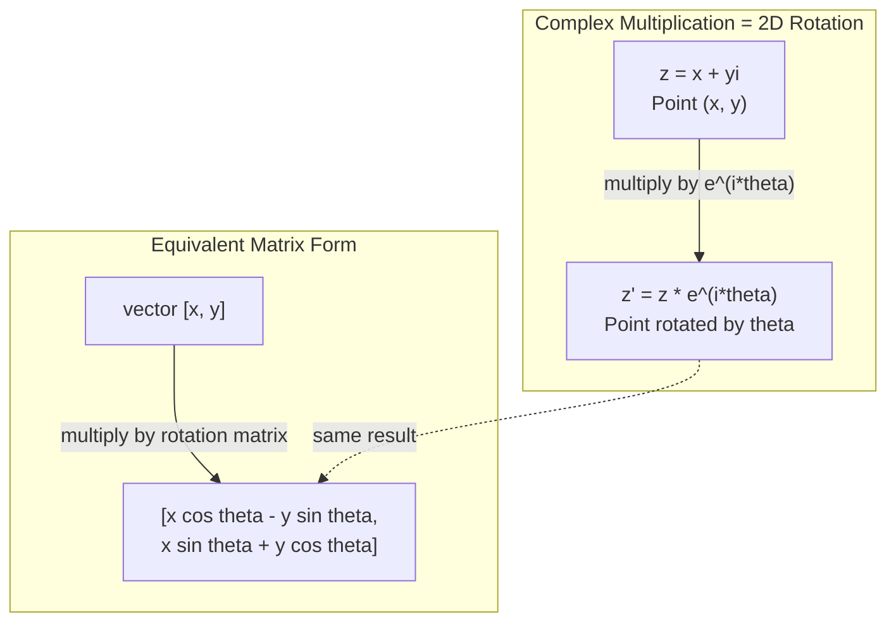
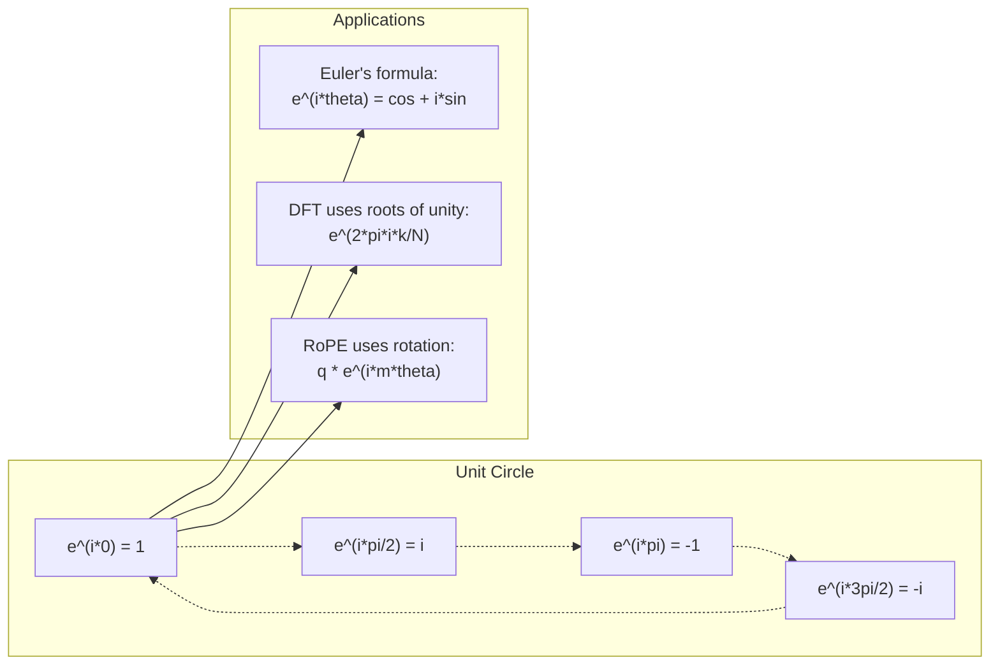

# Complex Numbers for AI | AI 中的复数

> The square root of -1 is not imaginary. It is the key to rotations, frequencies, and half of signal processing.
> -1 的平方根并非"虚"的。它是旋转、频率和半个信号处理领域的钥匙。

**Type:** Learn | **类型:** 学习
**Language:** Python | **语言:** Python
**Prerequisites:** Phase 1, Lessons 01-04 (linear algebra, calculus) | **前置知识:** Phase 1, 第 01-04 课（线性代数、微积分）
**Time:** ~60 minutes | **时间:** ~60 分钟

## Learning Objectives | 学习目标

- Perform complex arithmetic (add, multiply, divide, conjugate) in both rectangular and polar form
  执行复数运算（加、乘、除、共轭），包括直角坐标和极坐标形式
- Apply Euler's formula to convert between complex exponentials and trigonometric functions
  应用欧拉公式在复指数和三角函数之间转换
- Implement the Discrete Fourier Transform using complex roots of unity
  使用单位根实现离散傅里叶变换（DFT）
- Explain how complex rotations underlie RoPE and sinusoidal positional encodings in transformers
  解释复数旋转如何构成 RoPE 和 Transformer 正弦位置编码的基础


> **【中文解读】**
> 虚数 i 是旋转和频率的钥匙。Transformer 中的 RoPE 位置编码（LLaMA 等模型使用）本质上就是复数旋转。正弦位置编码是复指数的实部和虚部。

## The Problem | 问题引入

You open a paper on Fourier transforms and there is `i` everywhere. You look at transformer positional encodings and see `sin` and `cos` at different frequencies -- the real and imaginary parts of complex exponentials. You read about quantum computing and find everything expressed in complex vector spaces.

> 你打开一篇关于傅里叶变换的论文，到处都是 `i`。你看 Transformer 位置编码，看到不同频率的 `sin` 和 `cos`——它们是复指数的实部和虚部。你读量子计算，发现一切都在复数向量空间中表达。

Complex numbers seem abstract. A number system built on the square root of -1 feels like a mathematical trick. But it is not a trick. It is the natural language of rotations and oscillations. Every time something spins, vibrates, or oscillates, complex numbers are the right tool.

> 复数看起来很抽象。建立在 -1 的平方根上的数系感觉像数学把戏。但它不是把戏。它是旋转和振荡的天然语言。每当某物旋转、振动或振荡时，复数就是正确的工具。

Without understanding complex numbers, you cannot understand the Discrete Fourier Transform. You cannot understand FFT. You cannot understand how RoPE (Rotary Position Embedding) works in modern language models. You cannot understand why sinusoidal positional encodings in the original Transformer paper use the frequencies they do.

> 不理解复数，你就无法理解离散傅里叶变换（DFT）。无法理解 FFT。无法理解 RoPE（旋转位置编码）在现代语言模型中如何工作。无法理解原始 Transformer 论文中的正弦位置编码为什么使用那些频率。

This lesson builds complex arithmetic from scratch, connects it to geometry, and shows you exactly where complex numbers appear in machine learning.

> 本课从零构建复数运算，将其与几何联系起来，并精确展示复数在机器学习中出现的位置。

## The Concept | 核心概念

> **【中文解读】**
> 复数的核心洞察：i 不是"虚"的，它是一个 90 度旋转操作。乘一次 i 转 90 度，乘两次（i^2 = -1）转 180 度。复数 = 2D 平面上的点 + 自然支持旋转。这意味着任何涉及旋转、振荡、频率的领域都天然适合用复数描述。

> **【拓展：复数在 AI 中的实际应用规模】**
> OpenAI 的 GPT-4、Meta 的 LLaMA 系列都使用 RoPE（Rotary Position Embedding），本质上是复数旋转。每个注意力头对位置编码执行复数乘法。对于 LLaMA-2-70B（80 个注意力头，序列长度 4096），每步推理执行数百万次复数旋转。音频 AI 领域（如 OpenAI Whisper）依赖 FFT（快速傅里叶变换），所有计算都在复数域完成。

### What is a complex number?

A complex number has two parts: a real part and an imaginary part.

> 复数有两部分：实部（Real Part）和虚部（Imaginary Part）。

```
z = a + bi

where:
  a is the real part
  b is the imaginary part
  i is the imaginary unit, defined by i^2 = -1
```

That is it. You extend the number line into a plane. The real numbers sit on one axis. The imaginary numbers sit on the other. Every complex number is a point in this plane.

> 就是这样。你把数轴扩展成一个平面。实数在一个轴上。虚数在另一个轴上。每个复数都是这个平面上的一个点。

### Complex arithmetic

**Addition.** Add the real parts together, add the imaginary parts together.

> **加法。** 实部相加，虚部相加。

```
(a + bi) + (c + di) = (a + c) + (b + d)i

Example: (3 + 2i) + (1 + 4i) = 4 + 6i
```

**Multiplication.** Use the distributive law and remember that i^2 = -1.

> **乘法。** 使用分配律，记住 i^2 = -1。

```
(a + bi)(c + di) = ac + adi + bci + bdi^2
                 = ac + adi + bci - bd
                 = (ac - bd) + (ad + bc)i

Example: (3 + 2i)(1 + 4i) = 3 + 12i + 2i + 8i^2
                            = 3 + 14i - 8
                            = -5 + 14i
```

**Conjugate.** Flip the sign of the imaginary part.

> **共轭（Conjugate）。** 翻转虚部的符号。

```
conjugate of (a + bi) = a - bi
```

The product of a complex number and its conjugate is always real:

> 复数与其共轭的乘积总是实数：

```
(a + bi)(a - bi) = a^2 + b^2
```

**Division.** Multiply numerator and denominator by the conjugate of the denominator.

> **除法。** 分子和分母同时乘以分母的共轭。

```
(a + bi) / (c + di) = (a + bi)(c - di) / (c^2 + d^2)
```

This eliminates the imaginary part from the denominator, giving you a clean complex number.

> 这消除了分母中的虚部，得到一个干净的复数。

### The complex plane

The complex plane maps every complex number to a 2D point. The horizontal axis is the real axis, the vertical axis is the imaginary axis.

> 复平面将每个复数映射为 2D 点。水平轴是实轴，垂直轴是虚轴。

```
z = 3 + 2i  corresponds to the point (3, 2)
z = -1 + 0i corresponds to the point (-1, 0) on the real axis
z = 0 + 4i  corresponds to the point (0, 4) on the imaginary axis
```

A complex number is simultaneously a point and a vector from the origin. This dual interpretation is what makes complex numbers useful for geometry.

> 复数同时是一个点和从原点出发的向量。这种双重解释使复数在几何中很有用。

### Polar form

Any point in the plane can be described by its distance from the origin and its angle from the positive real axis.

> 平面中的任何点都可以用其到原点的距离和与正实轴的角度来描述。

```
z = r * (cos(theta) + i*sin(theta))

where:
  r = |z| = sqrt(a^2 + b^2)     (magnitude, or modulus)
  theta = atan2(b, a)             (phase, or argument)
```

Rectangular form (a + bi) is good for addition. Polar form (r, theta) is good for multiplication.

> 直角坐标形式 (a + bi) 适合加法。极坐标形式 (r, theta) 适合乘法。

**Multiplication in polar form.** Multiply the magnitudes, add the angles.

> **极坐标形式的乘法。** 模相乘，角相加。

```
z1 = r1 * e^(i*theta1)
z2 = r2 * e^(i*theta2)

z1 * z2 = (r1 * r2) * e^(i*(theta1 + theta2))
```

This is why complex numbers are perfect for rotations. Multiplying by a complex number with magnitude 1 is a pure rotation.

> 这就是为什么复数完美适合旋转。乘以模为 1 的复数就是纯旋转。

### Euler's formula

The bridge between complex exponentials and trigonometry:

> 复指数与三角函数之间的桥梁：

```
e^(i*theta) = cos(theta) + i*sin(theta)
```

This is the most important formula in this lesson. When theta = pi:

> 这是本课最重要的公式。当 theta = pi 时：

```
e^(i*pi) = cos(pi) + i*sin(pi) = -1 + 0i = -1

Therefore: e^(i*pi) + 1 = 0
```

Five fundamental constants (e, i, pi, 1, 0) linked in one equation.

> 五个基本常数（e、i、pi、1、0）统一在一个方程中。

### Why Euler's formula matters for ML

Euler's formula says that `e^(i*theta)` traces the unit circle as theta varies. At theta = 0, you are at (1, 0). At theta = pi/2, you are at (0, 1). At theta = pi, you are at (-1, 0). At theta = 3*pi/2, you are at (0, -1). A full rotation is theta = 2*pi.

> 欧拉公式说 `e^(i*theta)` 随 theta 变化描绘单位圆。theta = 0 时在 (1, 0)。theta = pi/2 时在 (0, 1)。theta = pi 时在 (-1, 0)。theta = 3*pi/2 时在 (0, -1)。完整旋转是 theta = 2*pi。

This means complex exponentials ARE rotations. And rotations are everywhere in signal processing and ML.

> 这意味着复指数就是旋转。旋转在信号处理和 ML 中无处不在。

> **【中文解读】**
> 欧拉公式 e^(i*theta) = cos(theta) + i*sin(theta) 是本课最重要的公式。它把指数函数和三角函数统一起来，也把复数和旋转统一起来。当 theta 从 0 变到 2*pi，e^(i*theta) 在复平面上画出一个单位圆。这个圆是理解 DFT、RoPE、信号处理的基础。

### Connection to 2D rotations

Multiplying the complex number (x + yi) by e^(i*theta) rotates the point (x, y) by angle theta around the origin.

> 将复数 (x + yi) 乘以 e^(i*theta) 将点 (x, y) 绕原点旋转角度 theta。

```
Rotation via complex multiplication:
  (x + yi) * (cos(theta) + i*sin(theta))
  = (x*cos(theta) - y*sin(theta)) + (x*sin(theta) + y*cos(theta))i

Rotation via matrix multiplication:
  [cos(theta)  -sin(theta)] [x]   [x*cos(theta) - y*sin(theta)]
  [sin(theta)   cos(theta)] [y] = [x*sin(theta) + y*cos(theta)]
```

They produce identical results. Complex multiplication IS 2D rotation. The rotation matrix is just complex multiplication written in matrix notation.

> 它们产生完全相同的结果。复数乘法就是 2D 旋转。旋转矩阵只是用矩阵符号写出的复数乘法。



### Phasors and rotating signals

A complex exponential e^(i*omega*t) is a point rotating around the unit circle at angular frequency omega. As t increases, the point traces the circle.

> 复指数 e^(i*omega*t) 是一个以角频率 omega 绕单位圆旋转的点。随着 t 增加，点描绘出圆。

The real part of this rotating point is cos(omega*t). The imaginary part is sin(omega*t). A sinusoidal signal is the shadow of a rotating complex number.

> 这个旋转点的实部是 cos(omega*t)。虚部是 sin(omega*t)。正弦信号就是旋转复数的投影。

```
e^(i*omega*t) = cos(omega*t) + i*sin(omega*t)

Real part:      cos(omega*t)    -- a cosine wave
Imaginary part: sin(omega*t)    -- a sine wave
```

This is the phasor representation. Instead of tracking a wiggly sine wave, you track a smoothly rotating arrow. Phase shifts become angle offsets. Amplitude changes become magnitude changes. Addition of signals becomes vector addition.

> 这就是相量（Phasor）表示。不用追踪起伏的正弦波，而是追踪平滑旋转的箭头。相位偏移变成角度偏移。幅度变化变成模的变化。信号相加变成向量相加。

### Roots of unity

The N-th roots of unity are N points equally spaced on the unit circle:

> N 次单位根（Roots of Unity）是单位圆上等间距分布的 N 个点：

```
w_k = e^(2*pi*i*k/N)    for k = 0, 1, 2, ..., N-1
```

For N = 4, the roots are: 1, i, -1, -i (the four compass points).
For N = 8, you get the four compass points plus the four diagonals.

Roots of unity are the foundation of the Discrete Fourier Transform. The DFT decomposes a signal into components at these N equally-spaced frequencies.

> 单位根是离散傅里叶变换的基础。DFT 将信号分解为这 N 个等间距频率的分量。

> **【中文解读】**
> 单位根是 N 个等间距分布在单位圆上的点。它们的两个神奇性质：(1) 每个的模都恰好为 1；(2) 全部加起来恰好为零。这两个性质是 DFT 可逆的数学基础。DFT 本质上就是计算信号与这 N 个旋转相量的"相关性"。

### Connection to the DFT

The Discrete Fourier Transform of a signal x[0], x[1], ..., x[N-1] is:

> 信号 x[0], x[1], ..., x[N-1] 的离散傅里叶变换为：

```
X[k] = sum_{n=0}^{N-1} x[n] * e^(-2*pi*i*k*n/N)
```

Each X[k] measures how much the signal correlates with the k-th root of unity -- a complex sinusoid at frequency k. The DFT breaks a signal into N rotating phasors and tells you the amplitude and phase of each one.

> 每个 X[k] 衡量信号与第 k 个单位根的相关性——频率为 k 的复正弦波。DFT 将信号分解为 N 个旋转相量，告诉你每个的幅度和相位。

### Why i is not imaginary

The word "imaginary" is a historical accident. Descartes used it dismissively. But i is no more imaginary than negative numbers were when people first rejected them. Negative numbers answer "what do you subtract 5 from 3 to get?" The imaginary unit answers "what do you square to get -1?"

> "虚"这个说法是历史的偶然。Descartes 用它来贬低。但 i 并不比负数最初被人拒绝时更"虚"。负数回答"3 减 5 得到什么"。虚数单位回答"什么平方得到 -1"。

More usefully: i is a 90-degree rotation operator. Multiply a real number by i once, you rotate 90 degrees to the imaginary axis. Multiply by i again (i^2), you rotate another 90 degrees -- now you are pointing in the negative real direction. That is why i^2 = -1. It is not mysterious. It is a half-turn built from two quarter-turns.

> 更有用的理解：i 是一个 90 度旋转算子。将实数乘以 i 一次，你旋转 90 度到虚轴。再乘以 i（i^2），再旋转 90 度——现在指向负实方向。这就是为什么 i^2 = -1。这不神秘。它是两个四分之一转构成的半转。

This is why complex numbers are everywhere in engineering. Anything that rotates -- electromagnetic waves, quantum states, signal oscillations, positional encodings -- is naturally described by complex numbers.

> 这就是为什么复数在工程中无处不在。任何旋转的东西——电磁波、量子态、信号振荡、位置编码——都自然地用复数描述。

### Complex exponentials vs trigonometric functions

Before Euler's formula, engineers wrote signals as A*cos(omega*t + phi) -- amplitude A, frequency omega, phase phi. This works but makes arithmetic painful. Adding two cosines with different phases requires trigonometric identities.

> 在欧拉公式之前，工程师将信号写成 A*cos(omega*t + phi)——幅度 A、频率 omega、相位 phi。这可行但让算术很痛苦。相加两个不同相位的余弦需要三角恒等式。

With complex exponentials, the same signal is A*e^(i*(omega*t + phi)). Adding two signals is just adding two complex numbers. Multiplying (modulating) is just multiplying magnitudes and adding angles. Phase shifts become angle additions. Frequency shifts become multiplications by phasors.

> 使用复指数，同样的信号是 A*e^(i*(omega*t + phi))。两个信号相加就是两个复数相加。相乘（调制）就是模相乘、角相加。相位偏移变成角度加法。频率偏移变成乘以相量。

The entire field of signal processing switched to complex exponential notation because the math is cleaner. The "real signal" is always just the real part of the complex representation. The imaginary part is carried along as bookkeeping, making all the algebra work out naturally.

> 整个信号处理领域转向复指数表示法，因为数学更简洁。"真实信号"总是复数表示的实部。虚部作为簿记被保留，使所有代数运算自然成立。

> **【拓展：复数在量子计算中的角色】**
> 量子计算的基础——量子态——是复数向量。一个量子比特的状态是 alpha|0> + beta|1>，其中 |alpha|^2 + |beta|^2 = 1，alpha 和 beta 都是复数。量子门是复数酉矩阵。Google 的 Sycamore 量子芯片有 53 个量子比特，其状态向量有 2^53 个复数分量。量子机器学习（QML）直接在复数空间中操作。

### Connection to transformers

**Sinusoidal positional encodings** (original Transformer paper):

```
PE(pos, 2i) = sin(pos / 10000^(2i/d))
PE(pos, 2i+1) = cos(pos / 10000^(2i/d))
```

The sin and cos pairs are the real and imaginary parts of complex exponentials at different frequencies. Each frequency provides a different "resolution" for encoding position. Low frequencies change slowly (coarse position). High frequencies change quickly (fine position). Together they give each position a unique frequency fingerprint.

> sin 和 cos 对是不同频率复指数的实部和虚部。每个频率为位置编码提供不同的"分辨率"。低频变化缓慢（粗粒度位置）。高频变化快速（细粒度位置）。它们一起为每个位置提供唯一的频率指纹。

**RoPE (Rotary Position Embedding)** takes this further. It explicitly multiplies query and key vectors by complex rotation matrices. The relative position between two tokens becomes a rotation angle. Attention is computed using these rotated vectors, making the model sensitive to relative position through complex multiplication.

> **RoPE（旋转位置编码）** 更进一步。它显式地将 query 和 key 向量乘以复数旋转矩阵。两个 token 之间的相对位置变成旋转角度。注意力使用这些旋转后的向量计算，使模型通过复数乘法对相对位置敏感。

> **【拓展：RoPE 在 LLaMA 和 GPT-NeoX 中的实现】**
> RoPE 将 query 和 key 向量按维度对视为复数，然后乘以角度随位置变化的旋转因子。对于维度 d=4096、序列长度 L=4096 的模型，RoPE 对每对 (q, k) 执行 L^2/2 次复数乘法。与绝对位置编码相比，RoPE 的优势是相对位置的旋转角只取决于位置差，这天然支持了"外推"——训练时见过 2048 长度，推理时可扩展到更长序列。

| Operation | Algebraic Form | Geometric Meaning |
|-----------|---------------|-------------------|
| Addition | (a+c) + (b+d)i | Vector addition in the plane |
| Multiplication | (ac-bd) + (ad+bc)i | Rotate and scale |
| Conjugate | a - bi | Reflect over real axis |
| Magnitude | sqrt(a^2 + b^2) | Distance from origin |
| Phase | atan2(b, a) | Angle from positive real axis |
| Division | multiply by conjugate | Reverse rotation and rescale |
| Power | r^n * e^(i*n*theta) | Rotate n times, scale by r^n |



## Build It | 动手实现

### Step 1: Complex class

Build a Complex number class that supports arithmetic, magnitude, phase, and conversion between rectangular and polar forms.

> 构建一个复数类，支持算术运算、模、相位以及直角坐标和极坐标之间的转换。

```python
import math

class Complex:
    def __init__(self, real, imag=0.0):
        self.real = real
        self.imag = imag

    def __add__(self, other):
        return Complex(self.real + other.real, self.imag + other.imag)

    def __mul__(self, other):
        r = self.real * other.real - self.imag * other.imag  # 实部：(ac - bd)
        i = self.real * other.imag + self.imag * other.real  # 虚部：(ad + bc)
        return Complex(r, i)

    def __truediv__(self, other):
        denom = other.real ** 2 + other.imag ** 2            # 分母：c^2 + d^2
        r = (self.real * other.real + self.imag * other.imag) / denom  # 乘以共轭后的实部
        i = (self.imag * other.real - self.real * other.imag) / denom  # 乘以共轭后的虚部
        return Complex(r, i)

    def magnitude(self):
        return math.sqrt(self.real ** 2 + self.imag ** 2)

    def phase(self):
        return math.atan2(self.imag, self.real)

    def conjugate(self):
        return Complex(self.real, -self.imag)
```

### Step 2: Polar conversion and Euler's formula

```python
def to_polar(z):
    return z.magnitude(), z.phase()

def from_polar(r, theta):
    return Complex(r * math.cos(theta), r * math.sin(theta))

def euler(theta):
    return Complex(math.cos(theta), math.sin(theta))
```

Verify: `euler(theta).magnitude()` should always be 1.0. `euler(0)` should give (1, 0). `euler(pi)` should give (-1, 0).

> 验证：`euler(theta).magnitude()` 应始终为 1.0。`euler(0)` 应给出 (1, 0)。`euler(pi)` 应给出 (-1, 0)。

### Step 3: Rotation

Rotating a point (x, y) by angle theta is one complex multiplication:

> 将点 (x, y) 旋转角度 theta 只需一次复数乘法：

```python
point = Complex(3, 4)
rotated = point * euler(math.pi / 4)
```

The magnitude stays the same. Only the angle changes.

> 模保持不变。只有角度改变。

### Step 4: DFT from complex arithmetic

```python
def dft(signal):
    N = len(signal)                               # 信号长度
    result = []
    for k in range(N):
        total = Complex(0, 0)
        for n in range(N):
            angle = -2 * math.pi * k * n / N      # 第 k 个单位根的角度
            total = total + Complex(signal[n], 0) * euler(angle)  # 累加：信号与旋转相量的相关
        result.append(total)
    return result
```

This is the O(N^2) DFT. Each output X[k] is the sum of the signal samples multiplied by roots of unity.

> 这是 O(N^2) 的 DFT。每个输出 X[k] 是信号样本乘以单位根之和。

### Step 5: Inverse DFT

The inverse DFT reconstructs the original signal from its spectrum. The only changes from the forward DFT: flip the sign in the exponent and divide by N.

> 逆 DFT 从频谱重建原始信号。与正向 DFT 的唯一区别：翻转指数符号并除以 N。

```python
def idft(spectrum):
    N = len(spectrum)
    result = []
    for n in range(N):
        total = Complex(0, 0)
        for k in range(N):
            angle = 2 * math.pi * k * n / N
            total = total + spectrum[k] * euler(angle)
        result.append(Complex(total.real / N, total.imag / N))
    return result
```

This gives you perfect reconstruction. Apply DFT, then IDFT, and you get back the original signal to machine precision. No information is lost.

> 这给你完美重建。应用 DFT，再应用 IDFT，你以机器精度恢复原始信号。没有信息丢失。

### Step 6: Roots of unity

```python
def roots_of_unity(N):
    return [euler(2 * math.pi * k / N) for k in range(N)]
```

Verify two properties:
- Every root has magnitude exactly 1.
  每个根的模恰好为 1。
- The sum of all N roots is zero (they cancel out by symmetry).
  所有 N 个根之和为零（对称性导致相消）。

These properties are what make the DFT invertible. The roots of unity form an orthogonal basis for the frequency domain.

> 这些性质使 DFT 可逆。单位根构成频域的正交基。

## Use It | 用框架实现

Python has built-in complex number support. The literal `j` represents the imaginary unit.

> Python 内置复数支持。字面量 `j` 表示虚数单位。

```python
z = 3 + 2j
w = 1 + 4j

print(z + w)
print(z * w)
print(abs(z))

import cmath
print(cmath.phase(z))
print(cmath.exp(1j * cmath.pi))
```

For arrays, numpy handles complex numbers natively:

> 对于数组，numpy 原生处理复数：

```python
import numpy as np

z = np.array([1+2j, 3+4j, 5+6j])
print(np.abs(z))
print(np.angle(z))
print(np.conj(z))
print(np.real(z))
print(np.imag(z))

signal = np.sin(2 * np.pi * 5 * np.linspace(0, 1, 128))
spectrum = np.fft.fft(signal)
freqs = np.fft.fftfreq(128, d=1/128)
```

## Ship It | 产出物

Run `code/complex_numbers.py` to generate `outputs/skill-complex-arithmetic.md`.

> 运行 `code/complex_numbers.py` 生成 `outputs/skill-complex-arithmetic.md`（复数运算技能文档）。

## Exercises | 练习题

1. **Complex arithmetic by hand.** Compute (2 + 3i) * (4 - i) and verify with the code. Then compute (5 + 2i) / (1 - 3i). Draw both results on the complex plane and check that multiplication rotated and scaled the first number.

2. **Rotation sequence.** Start with the point (1, 0). Multiply by e^(i*pi/6) twelve times. Verify that you return to (1, 0) after 12 multiplications. Print the coordinates at each step and confirm they trace a regular 12-gon.

3. **DFT of a known signal.** Create a signal that is the sum of sin(2*pi*3*t) and 0.5*sin(2*pi*7*t) sampled at 32 points. Run your DFT. Verify that the magnitude spectrum has peaks at frequencies 3 and 7, with the peak at 7 being half the height of the peak at 3.

4. **Roots of unity visualization.** Compute the 8th roots of unity. Verify that they sum to zero. Verify that multiplying any root by the primitive root e^(2*pi*i/8) gives the next root.

5. **Rotation matrix equivalence.** For 10 random angles and 10 random points, verify that complex multiplication gives the same result as matrix-vector multiplication with the 2x2 rotation matrix. Print the maximum numerical difference.

## Key Terms | 术语速查表

| Term | What it means |
|------|---------------|
| Complex number | A number a + bi where a is the real part, b is the imaginary part, and i^2 = -1 |
| Imaginary unit | The number i, defined by i^2 = -1. Not imaginary in the philosophical sense -- it is a rotation operator |
| Complex plane | The 2D plane where the x-axis is real and the y-axis is imaginary. Also called the Argand plane |
| Magnitude (modulus) | The distance from the origin: sqrt(a^2 + b^2). Written as \|z\| |
| Phase (argument) | The angle from the positive real axis: atan2(b, a). Written as arg(z) |
| Conjugate | The mirror image across the real axis: conjugate of a + bi is a - bi |
| Polar form | Expressing z as r * e^(i*theta) instead of a + bi. Makes multiplication easy |
| Euler's formula | e^(i*theta) = cos(theta) + i*sin(theta). Connects exponentials to trigonometry |
| Phasor | A rotating complex number e^(i*omega*t) representing a sinusoidal signal |
| Roots of unity | The N complex numbers e^(2*pi*i*k/N) for k = 0 to N-1. N equally spaced points on the unit circle |
| DFT | Discrete Fourier Transform. Decomposes a signal into complex sinusoidal components using roots of unity |
| RoPE | Rotary Position Embedding. Uses complex multiplication to encode relative position in transformer attention |

> 术语速查：Complex number（复数 a+bi）、Imaginary unit（虚数单位 i，旋转算子）、Complex plane（复平面）、Magnitude/modulus（模 √(a²+b²)）、Phase/argument（相位 atan2(b,a)）、Conjugate（共轭 a-bi）、Polar form（极坐标 r·e^(iθ)）、Euler's formula（欧拉公式 e^(iθ)=cosθ+i·sinθ）、Phasor（旋转相量）、Roots of unity（单位根 N 个均分单位圆的点）、DFT（离散傅里叶变换）、RoPE（旋转位置编码，LLaMA 等模型使用）。

## Further Reading | 延伸阅读

- [Visual Introduction to Euler's Formula](https://betterexplained.com/articles/intuitive-understanding-of-eulers-formula/) - builds geometric intuition without heavy notation
- [Su et al.: RoFormer (2021)](https://arxiv.org/abs/2104.09864) - the paper introducing Rotary Position Embedding using complex rotations
- [Vaswani et al.: Attention Is All You Need (2017)](https://arxiv.org/abs/1706.03762) - the original Transformer paper with sinusoidal positional encodings
- [3Blue1Brown: Euler's formula with introductory group theory](https://www.youtube.com/watch?v=mvmuCPvRoWQ) - visual explanation of why e^(i*pi) = -1
- [Needham: Visual Complex Analysis](https://global.oup.com/academic/product/visual-complex-analysis-9780198534464) - the best visual treatment of complex numbers, full of geometric insight
- [Strang: Introduction to Linear Algebra, Ch. 10](https://math.mit.edu/~gs/linearalgebra/) - complex numbers in the context of linear algebra and eigenvalues
