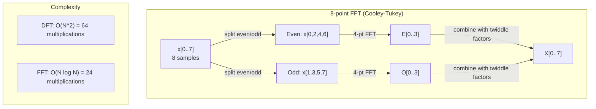
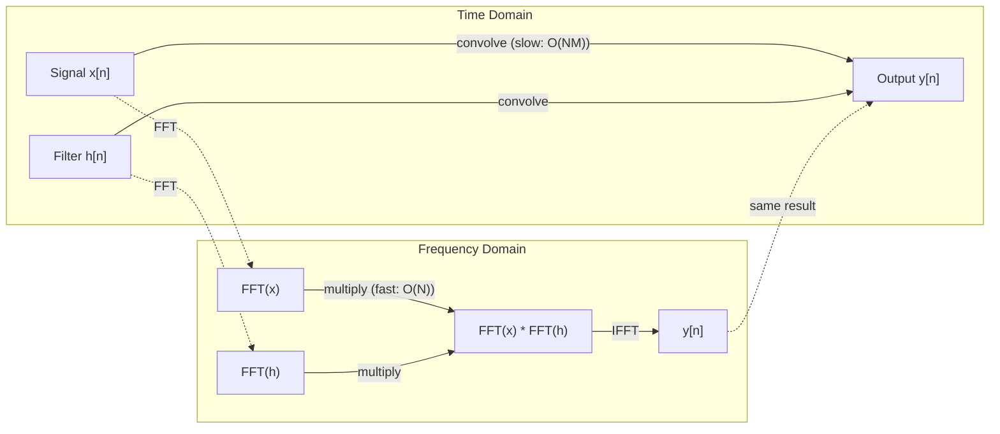

# The Fourier Transform | 傅里叶变换

> Every signal is a sum of sine waves. The Fourier transform tells you which ones.
> 每个信号都是正弦波的叠加。傅里叶变换告诉你具体是哪些。

**Type:** Build | **类型:** 动手
**Language:** Python | **语言:** Python
**Prerequisites:** Phase 1, Lessons 01-04, 19 (complex numbers) | **前置知识:** Phase 1, 第 01-04 课、第 19 课（复数）
**Time:** ~90 minutes | **时间:** ~90 分钟

## Learning Objectives | 学习目标

- Implement the DFT from scratch and verify it against the O(N log N) Cooley-Tukey FFT
  从零实现 DFT 并与 O(N log N) 的 Cooley-Tukey FFT 验证
- Interpret frequency coefficients: extract amplitude, phase, and power spectrum from a signal
  解释频率系数：从信号中提取幅度、相位和功率谱（Power Spectrum）
- Apply the convolution theorem to perform convolution via FFT multiplication
  应用卷积定理通过 FFT 乘法执行卷积
- Connect Fourier frequency decomposition to transformer positional encodings and CNN convolution layers
  将傅里叶频率分解与 Transformer 位置编码和 CNN 卷积层联系起来


> **【中文解读】**
> 任何信号都可以分解为正弦波。音频处理、图像压缩都依赖 FFT。卷积定理说时域卷积等于频域乘法，可用 FFT 加速 CNN 卷积。Transformer 正弦位置编码就是傅里叶基函数。

## The Problem | 问题引入

An audio recording is a sequence of pressure measurements over time. A stock price is a sequence of values over days. An image is a grid of pixel intensities over space. All of these are data in the time domain (or space domain). You see values changing over some index.

> 音频录制是随时间变化的压力测量序列。股票价格是随天数变化的值序列。图像是空间上像素强度的网格。这些都是时域（或空域）中的数据。你看到的是某个索引上变化的值。

But many patterns are invisible in the time domain. Is this audio signal a pure tone or a chord? Does this stock price have a weekly cycle? Does this image have a repeating texture? These questions are about frequency content, and the time domain hides it.

> 但许多模式在时域中是不可见的。这个音频信号是纯音还是和弦？这个股票价格有周周期吗？这个图像有重复纹理吗？这些问题关乎频率内容，而时域将其隐藏了。

The Fourier transform converts data from the time domain to the frequency domain. It takes a signal and decomposes it into sine waves of different frequencies. Each sine wave has an amplitude (how strong it is) and a phase (where it starts). The Fourier transform tells you both.

> 傅里叶变换将数据从时域转换到频域。它接收一个信号并将其分解为不同频率的正弦波。每个正弦波有幅度（有多强）和相位（从哪里开始）。傅里叶变换告诉你两者。

This matters for ML because frequency-domain thinking appears everywhere. Convolutional neural networks perform convolution, which is multiplication in the frequency domain. Transformer positional encodings use frequency decomposition to represent position. Audio models (speech recognition, music generation) operate on spectrograms -- frequency representations of sound. Time series models look for periodic patterns. Understanding the Fourier transform gives you the vocabulary to work with all of these.

> 这对 ML 很重要，因为频域思维无处不在。卷积神经网络执行卷积，这在频域中就是乘法。Transformer 位置编码使用频率分解来表示位置。音频模型（语音识别、音乐生成）在频谱图（Spectrogram）上操作——声音的频率表示。时间序列模型寻找周期性模式。理解傅里叶变换给了你处理所有这些的词汇。

## The Concept | 核心概念

> **【中文解读】**
> 傅里叶变换的核心思想：任何信号都可以分解为不同频率的正弦波之和。DFT 把时域信号变成频域系数——每个系数告诉你"这个频率有多少能量"。这就像棱镜把白光分解成彩虹：时域看到的是混合信号，频域看到的是各个成分。

> **【拓展：FFT 的计算影响力】**
> FFT 被誉为 20 世纪最重要的数值算法之一。Gauss 在 1805 年就发现了分治策略，但 Cooley-Tukey 在 1965 年的论文才让 FFT 广泛应用。如今，每次 4G/LTE 通话、每张 JPEG 照片、每首 MP3 歌曲都经过 FFT 处理。在 AI 领域，Whisper 语音模型对每秒音频计算约 100 次 FFT，Stable Diffusion 的图像处理管道也大量使用频域操作。

### The DFT definition

Given N samples x[0], x[1], ..., x[N-1], the Discrete Fourier Transform produces N frequency coefficients X[0], X[1], ..., X[N-1]:

> 给定 N 个样本 x[0], x[1], ..., x[N-1]，离散傅里叶变换产生 N 个频率系数 X[0], X[1], ..., X[N-1]：

```
X[k] = sum_{n=0}^{N-1} x[n] * e^(-2*pi*i*k*n/N)

for k = 0, 1, ..., N-1
```

Each X[k] is a complex number. Its magnitude |X[k]| tells you the amplitude of frequency k. Its phase angle(X[k]) tells you the phase offset of that frequency.

> 每个 X[k] 是复数。其模 |X[k]| 告诉你频率 k 的幅度。其相位 angle(X[k]) 告诉你该频率的相位偏移。

The key insight: `e^(-2*pi*i*k*n/N)` is a rotating phasor at frequency k. The DFT computes the correlation between the signal and each of N equally-spaced frequencies. If the signal contains energy at frequency k, the correlation is large. If not, it is near zero.

> 关键洞察：`e^(-2*pi*i*k*n/N)` 是频率为 k 的旋转相量。DFT 计算信号与 N 个等间距频率中每一个的相关性。如果信号在频率 k 有能量，相关性就大。否则接近零。

### What each coefficient means

**X[0]: the DC component.** This is the sum of all samples -- proportional to the mean. It represents the constant (zero-frequency) offset of the signal.

> **X[0]：直流分量（DC Component）。** 这是所有样本的总和——与均值成正比。代表信号的恒定（零频率）偏移。

```
X[0] = sum_{n=0}^{N-1} x[n] * e^0 = sum of all samples
```

**X[k] for 1 <= k <= N/2: positive frequencies.** X[k] represents frequency k cycles per N samples. Higher k means higher frequency (faster oscillation).

> **X[k]（1 <= k <= N/2）：正频率。** X[k] 代表每 N 个样本中 k 个周期的频率。k 越大频率越高（振荡越快）。

**X[N/2]: the Nyquist frequency.** The highest frequency you can represent with N samples. Above this, you get aliasing -- high frequencies masquerading as low ones.

> **X[N/2]：Nyquist 频率。** 用 N 个样本能表示的最高频率。超过此频率会产生混叠（Aliasing）——高频伪装成低频。

**X[k] for N/2 < k < N: negative frequencies.** For real-valued signals, X[N-k] = conj(X[k]). The negative frequencies are mirror images of the positive ones. This is why the useful information is in the first N/2 + 1 coefficients.

> **X[k]（N/2 < k < N）：负频率。** 对于实值信号，X[N-k] = conj(X[k])。负频率是正频率的镜像。这就是为什么有用信息在前 N/2 + 1 个系数中。

### Inverse DFT

The inverse DFT reconstructs the original signal from its frequency coefficients:

```
x[n] = (1/N) * sum_{k=0}^{N-1} X[k] * e^(2*pi*i*k*n/N)

for n = 0, 1, ..., N-1
```

The only differences from the forward DFT: the sign in the exponent is positive (not negative), and there is a 1/N normalization factor.

> 与正向 DFT 的唯一区别：指数符号为正（非负），且有一个 1/N 的归一化因子。

The inverse DFT is perfect reconstruction. No information is lost. You can go from time domain to frequency domain and back without any error. The DFT is a change of basis -- it re-expresses the same information in a different coordinate system.

> 逆 DFT 是完美重建。没有信息丢失。你可以从时域到频域再回来，没有任何误差。DFT 是基变换——它用不同的坐标系重新表达相同的信息。

### The FFT: making it fast

The DFT as defined above is O(N^2): for each of N output coefficients, you sum over N input samples. For N = 1 million, that is 10^12 operations.

> 上面定义的 DFT 是 O(N^2) 的：对于 N 个输出系数中的每一个，你对 N 个输入样本求和。对于 N = 100 万，那是 10^12 次运算。

The Fast Fourier Transform (FFT) computes the same result in O(N log N). For N = 1 million, that is about 20 million operations instead of a trillion. This is what makes frequency analysis practical.

> 快速傅里叶变换（FFT）以 O(N log N) 计算相同的结果。对于 N = 100 万，大约是 2000 万次运算而非一万亿次。这就是使频率分析变得可行的原因。

> **【中文解读】**
> DFT 的计算量是 O(N^2)，但 FFT 通过分治策略把它降到 O(N log N)。对于 N=100 万的信号，DFT 需要万亿次运算，FFT 只需约 2000 万次——加速 5 万倍！秘诀是把信号按奇偶下标分成两半，递归计算后再用"旋转因子"合并。这要求信号长度是 2 的幂。

The Cooley-Tukey algorithm (the most common FFT) works by divide and conquer:

> Cooley-Tukey 算法（最常用的 FFT）通过分治（Divide and Conquer）工作：

1. Split the signal into even-indexed and odd-indexed samples.
   将信号分成偶数索引和奇数索引的样本。
2. Compute the DFT of each half recursively.
   递归计算每一半的 DFT。
3. Combine the two half-size DFTs using "twiddle factors" e^(-2*pi*i*k/N).
   使用"旋转因子"（Twiddle Factor）e^(-2*pi*i*k/N) 合并两个半尺寸的 DFT。

```
X[k] = E[k] + e^(-2*pi*i*k/N) * O[k]          for k = 0, ..., N/2 - 1
X[k + N/2] = E[k] - e^(-2*pi*i*k/N) * O[k]    for k = 0, ..., N/2 - 1

where E = DFT of even-indexed samples
      O = DFT of odd-indexed samples
```

The symmetry means each level of recursion does O(N) work, and there are log2(N) levels. Total: O(N log N).

> 对称性意味着每层递归做 O(N) 的工作，共有 log2(N) 层。总计：O(N log N)。



The FFT requires the signal length to be a power of 2. In practice, signals are zero-padded to the next power of 2.

### Spectral analysis

The **power spectrum** is |X[k]|^2 -- the squared magnitude of each frequency coefficient. It shows how much energy is at each frequency.

The **phase spectrum** is angle(X[k]) -- the phase offset of each frequency. For most analysis tasks, you care about the power spectrum and ignore the phase.

```
Power at frequency k:  P[k] = |X[k]|^2 = X[k].real^2 + X[k].imag^2
Phase at frequency k:  phi[k] = atan2(X[k].imag, X[k].real)
```

### Frequency resolution

The frequency resolution of the DFT depends on the number of samples N and the sampling rate fs.

```
Frequency of bin k:      f_k = k * fs / N
Frequency resolution:    delta_f = fs / N
Maximum frequency:       f_max = fs / 2  (Nyquist)
```

To resolve two frequencies that are close together, you need more samples. To capture high frequencies, you need a higher sampling rate.

### The convolution theorem

This is one of the most important results in signal processing and directly relevant to CNNs.

> 这是信号处理中最重要的结果之一，与 CNN 直接相关。

**Convolution in the time domain equals pointwise multiplication in the frequency domain.**

> **时域中的卷积等于频域中的逐点相乘。**

```
x * h = IFFT(FFT(x) . FFT(h))

where * is convolution and . is element-wise multiplication
```

Why this matters:

- Direct convolution of two signals of length N and M takes O(N*M) operations.
  两个长度为 N 和 M 的信号直接卷积需要 O(N*M) 次运算。
- FFT-based convolution takes O(N log N): transform both, multiply, transform back.
  基于 FFT 的卷积需要 O(N log N)：变换两个信号、相乘、逆变换。
- For large kernels, FFT convolution is dramatically faster.
  对于大卷积核，FFT 卷积快得多。
- This is exactly what happens in convolutional layers with large receptive fields.
  这正是具有大感受野的卷积层中发生的事情。

> **【拓展：卷积定理在 CNN 中的实际应用】**
> 标准的 3x3 卷积直接计算比 FFT 快，但当感受野变大时 FFT 优势显现。ConvNeXt 和 Global Convolution 网络在 7x7 或更大的卷积中使用 FFT 加速。FNet (Lee-Thorp et al., 2021) 更是大胆地用 FFT 替代 Transformer 的自注意力，在 GLUE 基准上达到 92% 的 BERT 精度，但训练速度快 7 倍。频域乘法的复杂度是 O(N) 而时域卷积是 O(N^2)。

Note: the DFT computes circular convolution (the signal wraps around). For linear convolution (no wraparound), zero-pad both signals to length N + M - 1 before computing.

> 注意：DFT 计算的是循环卷积（信号会环绕）。对于线性卷积（无环绕），在计算前将两个信号补零到长度 N + M - 1。



### Windowing

The DFT assumes the signal is periodic -- it treats the N samples as one period of an infinitely repeating signal. If the signal does not start and end at the same value, this creates a discontinuity at the boundary, which shows up as spurious high-frequency content. This is called spectral leakage.

> DFT 假设信号是周期的——它将 N 个样本视为无限重复信号的一个周期。如果信号不在相同的值处开始和结束，边界处会产生不连续性，表现为虚假的高频内容。这称为频谱泄漏（Spectral Leakage）。

Windowing reduces leakage by tapering the signal to zero at both ends before computing the DFT.

> 窗函数（Windowing）通过在计算 DFT 之前将信号两端逐渐衰减到零来减少泄漏。

Common windows:

| Window | Shape | Main lobe width | Side lobe level | Use case |
|--------|-------|----------------|-----------------|----------|
| Rectangular | Flat (no window) | Narrowest | Highest (-13 dB) | When signal is exactly periodic in N samples |
| Hann | Raised cosine | Moderate | Low (-31 dB) | General purpose spectral analysis |
| Hamming | Modified cosine | Moderate | Lower (-42 dB) | Audio processing, speech analysis |
| Blackman | Triple cosine | Wide | Very low (-58 dB) | When side lobe suppression is critical |

```
Hann window:    w[n] = 0.5 * (1 - cos(2*pi*n / (N-1)))
Hamming window: w[n] = 0.54 - 0.46 * cos(2*pi*n / (N-1))
```

Apply the window by multiplying it element-wise with the signal before the DFT: `X = DFT(x * w)`.

### DFT properties

| Property | Time Domain | Frequency Domain |
|----------|-------------|-----------------|
| Linearity | a*x + b*y | a*X + b*Y |
| Time shift | x[n - k] | X[f] * e^(-2*pi*i*f*k/N) |
| Frequency shift | x[n] * e^(2*pi*i*f0*n/N) | X[f - f0] |
| Convolution | x * h | X * H (pointwise) |
| Multiplication | x * h (pointwise) | X * H (circular convolution, scaled by 1/N) |
| Parseval's theorem | sum \|x[n]\|^2 | (1/N) * sum \|X[k]\|^2 |
| Conjugate symmetry (real input) | x[n] real | X[k] = conj(X[N-k]) |

Parseval's theorem says the total energy is the same in both domains. Energy is conserved through the transform.

> Parseval 定理说明两个域中的总能量相同。能量在变换中守恒。

### Connection to positional encodings

The original Transformer uses sinusoidal positional encodings:

```
PE(pos, 2i)   = sin(pos / 10000^(2i/d_model))
PE(pos, 2i+1) = cos(pos / 10000^(2i/d_model))
```

Each dimension pair (2i, 2i+1) oscillates at a different frequency. The frequencies are geometrically spaced from high (dimension 0,1) to low (last dimensions). This gives each position a unique pattern across all frequency bands -- similar to how Fourier coefficients uniquely identify a signal.

> 每个维度对 (2i, 2i+1) 以不同频率振荡。频率从高（维度 0,1）到低（最后维度）呈几何间隔。这为每个位置提供跨所有频段的唯一模式——类似于傅里叶系数唯一标识信号。

The key properties this provides:

- **Uniqueness:** No two positions have the same encoding.
  **唯一性：** 没有两个位置有相同的编码。
- **Bounded values:** sin and cos are always in [-1, 1].
  **有界值：** sin 和 cos 始终在 [-1, 1] 中。
- **Relative position:** The encoding of position p+k can be expressed as a linear function of the encoding at position p. The model can learn to attend to relative positions.
  **相对位置：** 位置 p+k 的编码可以表示为位置 p 编码的线性函数。模型可以学习关注相对位置。

### Connection to CNNs

A convolution layer applies a learned filter (kernel) to the input by sliding it across the signal or image. Mathematically, this is the convolution operation.

> 卷积层通过在信号或图像上滑动学习的滤波器（卷积核）应用于输入。数学上，这就是卷积运算。

By the convolution theorem, this is equivalent to:
1. FFT the input
   FFT 输入
2. FFT the kernel
   FFT 卷积核
3. Multiply in frequency domain
   在频域中相乘
4. IFFT the result
   IFFT 结果

Standard CNN implementations use direct convolution (faster for small 3x3 kernels). But for large kernels or global convolution, FFT-based approaches are significantly faster. Some architectures (like FNet) replace attention entirely with FFT, achieving competitive accuracy with O(N log N) instead of O(N^2) complexity.

> 标准 CNN 实现使用直接卷积（小的 3x3 卷积核更快）。但对于大卷积核或全局卷积，基于 FFT 的方法显著更快。一些架构（如 FNet）完全用 FFT 替代注意力，以 O(N log N) 而非 O(N^2) 的复杂度达到竞争性精度。

### Spectrograms and the Short-Time Fourier Transform

A single FFT gives you the frequency content of the entire signal, but tells you nothing about when those frequencies occur. A chirp (a signal whose frequency increases over time) and a chord (all frequencies present simultaneously) can have the same magnitude spectrum.

> 单次 FFT 给你整个信号的频率内容，但不告诉你这些频率在什么时候出现。啁啾信号（频率随时间增加的信号）和和弦（所有频率同时出现）可以有相同的幅度谱。

The Short-Time Fourier Transform (STFT) solves this by computing FFTs on overlapping windows of the signal. The result is a spectrogram: a 2D representation with time on one axis and frequency on the other. The intensity at each point shows the energy at that frequency at that time.

> 短时傅里叶变换（STFT）通过在信号的重叠窗口上计算 FFT 来解决这个问题。结果是频谱图：一个以时间为一个轴、频率为另一个轴的 2D 表示。每个点的强度显示该频率在该时间的能量。

```
STFT procedure:
1. Choose a window size (e.g., 1024 samples)
2. Choose a hop size (e.g., 256 samples -- 75% overlap)
3. For each window position:
   a. Extract the windowed segment
   b. Apply a Hann/Hamming window
   c. Compute FFT
   d. Store the magnitude spectrum as one column of the spectrogram
```

Spectrograms are the standard input representation for audio ML models. Speech recognition models (Whisper, DeepSpeech) operate on mel-spectrograms -- spectrograms with frequencies mapped to the mel scale, which better matches human pitch perception.

> 频谱图是音频 ML 模型的标准输入表示。语音识别模型（Whisper、DeepSpeech）在梅尔频谱图（Mel-Spectrogram）上操作——频率映射到梅尔刻度的频谱图，更好地匹配人类音高感知。

> **【中文解读】**
> 单次 FFT 只能看到整个信号的频率成分，但不知道每个频率在"什么时候"出现。短时傅里叶变换（STFT）通过滑动窗口解决了这个问题：对每段窗口分别做 FFT，得到时间-频率-能量的三维表示（频谱图）。这就是音频 AI 的标准输入格式。

### Aliasing

If a signal contains frequencies above fs/2 (the Nyquist frequency), sampling at rate fs will create aliased copies. A 90 Hz signal sampled at 100 Hz looks identical to a 10 Hz signal. There is no way to distinguish them from the samples alone.

> 如果信号包含高于 fs/2（Nyquist 频率）的频率，以速率 fs 采样会产生混叠副本。90 Hz 信号以 100 Hz 采样看起来与 10 Hz 信号相同。仅从样本无法区分它们。

```
Example:
  True signal: 90 Hz sine wave
  Sampling rate: 100 Hz
  Apparent frequency: 100 - 90 = 10 Hz

  The samples from the 90 Hz signal at 100 Hz sampling rate
  are identical to the samples from a 10 Hz signal.
  No amount of math can recover the original 90 Hz.
```

This is why analog-to-digital converters include anti-aliasing filters that remove frequencies above Nyquist before sampling. In ML, aliasing appears when downsampling feature maps without proper low-pass filtering -- some architectures address this with anti-aliased pooling layers.

> 这就是为什么模数转换器包含抗混叠滤波器，在采样前移除 Nyquist 以上的频率。在 ML 中，当没有适当低通滤波就下采样特征图时会出现混叠——一些架构通过抗混叠池化层来解决这个问题。

### Zero-padding does not increase resolution

A common misconception: zero-padding a signal before FFT improves frequency resolution. It does not. Zero-padding interpolates between existing frequency bins, giving you a smoother-looking spectrum. But it cannot reveal frequency detail that was not present in the original samples.

> 常见误解：在 FFT 之前补零可以提高频率分辨率。实际上不能。补零在现有频率 bin 之间插值，给你更平滑的频谱外观。但它不能揭示原始样本中不存在的频率细节。

True frequency resolution depends only on the observation time T = N / fs. To resolve two frequencies separated by delta_f, you need at least T = 1 / delta_f seconds of data. No amount of zero-padding changes this fundamental limit.

> 真正的频率分辨率只取决于观测时间 T = N / fs。要分辨相隔 delta_f 的两个频率，至少需要 T = 1 / delta_f 秒的数据。再多补零也无法改变这个基本限制。

> **【拓展：频谱图在语音 AI 中的标准地位】**
> OpenAI Whisper 模型将音频转为 log-Mel 频谱图后输入编码器。Mel 刻度模拟人耳对频率的感知（低频区分得更细）。Whisper 使用 80 个 Mel 滤波器组、25ms 窗口、10ms 步长。一段 30 秒的音频产生约 3000 x 80 的频谱图矩阵。Google 的 WaveNet、Meta 的 EnCodec 也都以频谱图或频域表示为中间特征。

## Build It | 动手实现

### Step 1: DFT from scratch

The O(N^2) DFT follows directly from the definition.

```python
import math

class Complex:
    ...

def dft(x):
    N = len(x)
    result = []
    for k in range(N):
        total = Complex(0, 0)
        for n in range(N):
            angle = -2 * math.pi * k * n / N
            w = Complex(math.cos(angle), math.sin(angle))
            xn = x[n] if isinstance(x[n], Complex) else Complex(x[n])
            total = total + xn * w
        result.append(total)
    return result
```

### Step 2: Inverse DFT

Same structure, positive exponent, divide by N.

```python
def idft(X):
    N = len(X)
    result = []
    for n in range(N):
        total = Complex(0, 0)
        for k in range(N):
            angle = 2 * math.pi * k * n / N
            w = Complex(math.cos(angle), math.sin(angle))
            total = total + X[k] * w
        result.append(Complex(total.real / N, total.imag / N))
    return result
```

### Step 3: FFT (Cooley-Tukey)

The recursive FFT requires power-of-2 length. Split into even and odd, recurse, combine with twiddle factors.

```python
def fft(x):
    N = len(x)
    if N <= 1:                                      # 基础情况：长度 1 的 DFT 就是自身
        return [x[0] if isinstance(x[0], Complex) else Complex(x[0])]
    if N % 2 != 0:                                  # 非偶数长度，回退到普通 DFT
        return dft(x)

    even = fft([x[i] for i in range(0, N, 2)])     # 递归：偶数下标子序列
    odd = fft([x[i] for i in range(1, N, 2)])      # 递归：奇数下标子序列

    result = [Complex(0)] * N
    for k in range(N // 2):
        angle = -2 * math.pi * k / N                # 旋转因子角度
        twiddle = Complex(math.cos(angle), math.sin(angle))  # 旋转因子 e^(-2piik/N)
        t = twiddle * odd[k]                        # 蝶形运算：旋转后的奇数部分
        result[k] = even[k] + t                    # 前半：E[k] + twiddle * O[k]
        result[k + N // 2] = even[k] - t           # 后半：E[k] - twiddle * O[k]
    return result
```

### Step 4: Spectral analysis helpers

```python
def power_spectrum(X):
    return [xk.real ** 2 + xk.imag ** 2 for xk in X]

def convolve_fft(x, h):
    N = len(x) + len(h) - 1                         # 线性卷积的输出长度
    padded_N = 1
    while padded_N < N:
        padded_N *= 2                                # 补零到 2 的幂次

    x_padded = x + [0.0] * (padded_N - len(x))      # 补零避免循环卷积混叠
    h_padded = h + [0.0] * (padded_N - len(h))

    X = fft(x_padded)                               # 信号 FFT
    H = fft(h_padded)                               # 滤波器 FFT

    Y = [xk * hk for xk, hk in zip(X, H)]          # 频域逐点相乘（卷积定理）

    y = idft(Y)                                     # 逆 FFT 回到时域
    return [y[n].real for n in range(N)]
```

## Use It | 用框架实现

For real work, use numpy's FFT which is backed by highly optimized C libraries.

```python
import numpy as np

signal = np.sin(2 * np.pi * 5 * np.arange(256) / 256)
spectrum = np.fft.fft(signal)
freqs = np.fft.fftfreq(256, d=1/256)

power = np.abs(spectrum) ** 2

positive_freqs = freqs[:len(freqs)//2]
positive_power = power[:len(power)//2]
```

For windowing and more advanced spectral analysis:

```python
from scipy.signal import windows, stft

window = windows.hann(256)
windowed = signal * window
spectrum = np.fft.fft(windowed)
```

For convolution:

```python
from scipy.signal import fftconvolve

result = fftconvolve(signal, kernel, mode='full')
```

For spectrograms:

```python
from scipy.signal import stft

frequencies, times, Zxx = stft(signal, fs=sample_rate, nperseg=256)
spectrogram = np.abs(Zxx) ** 2
```

The spectrogram matrix has shape (n_frequencies, n_time_frames). Each column is the power spectrum at one time window. This is what audio ML models consume as input.

## Ship It | 产出物

Run `code/fourier.py` to generate `outputs/prompt-spectral-analyzer.md`.

## Exercises | 练习题

1. **Pure tone identification.** Create a signal with a single sine wave at an unknown frequency (between 1 and 50 Hz), sampled at 128 Hz for 1 second. Use your DFT to identify the frequency. Verify the answer matches. Now add Gaussian noise with standard deviation 0.5 and repeat. How does noise affect the spectrum?

2. **FFT vs DFT verification.** Generate a random signal of length 64. Compute both DFT (O(N^2)) and FFT. Verify that all coefficients match to within 1e-10. Time both functions on signals of length 256, 512, 1024, and 2048. Plot the ratio of DFT time to FFT time.

3. **Convolution theorem proof by example.** Create signal x = [1, 2, 3, 4, 0, 0, 0, 0] and filter h = [1, 1, 1, 0, 0, 0, 0, 0]. Compute their circular convolution directly (nested loop). Then compute it via FFT (transform, multiply, inverse transform). Verify the results match. Now do linear convolution by zero-padding appropriately.

4. **Windowing effects.** Create a signal that is the sum of two sine waves at 10 Hz and 12 Hz (very close). Sample at 128 Hz for 1 second. Compute the power spectrum with no window, Hann window, and Hamming window. Which window makes it easiest to distinguish the two peaks? Why?

5. **Positional encoding analysis.** Generate the sinusoidal positional encodings for d_model = 128 and max_pos = 512. For each pair of positions (p1, p2), compute the dot product of their encodings. Show that the dot product depends only on |p1 - p2|, not on the absolute positions. What happens to the dot product as the distance increases?

## Key Terms | 术语速查表

| Term | What it means |
|------|---------------|
| DFT (Discrete Fourier Transform) | Converts N time-domain samples into N frequency-domain coefficients. Each coefficient is the correlation with a complex sinusoid at that frequency |
| FFT (Fast Fourier Transform) | An O(N log N) algorithm to compute the DFT. The Cooley-Tukey algorithm splits even/odd indices recursively |
| Inverse DFT | Reconstructs the time-domain signal from frequency coefficients. Same formula as DFT with flipped exponent sign and 1/N scaling |
| Frequency bin | Each index k in the DFT output represents frequency k*fs/N Hz. The "bin" is the discrete frequency slot |
| DC component | X[0], the zero-frequency coefficient. Proportional to the signal mean |
| Nyquist frequency | fs/2, the maximum frequency representable at sampling rate fs. Frequencies above this alias |
| Power spectrum | \|X[k]\|^2, the squared magnitude of each frequency coefficient. Shows energy distribution across frequencies |
| Phase spectrum | angle(X[k]), the phase offset of each frequency component. Often ignored in analysis |
| Spectral leakage | Spurious frequency content caused by treating a non-periodic signal as periodic. Reduced by windowing |
| Window function | A tapering function (Hann, Hamming, Blackman) applied before DFT to reduce spectral leakage |
| Twiddle factor | The complex exponential e^(-2*pi*i*k/N) used to combine sub-DFTs in the FFT butterfly computation |
| Convolution theorem | Convolution in time domain equals pointwise multiplication in frequency domain. Fundamental to signal processing and CNNs |
| Circular convolution | Convolution where the signal wraps around. This is what the DFT naturally computes |
| Linear convolution | Standard convolution without wraparound. Achieved by zero-padding before DFT |
| Parseval's theorem | Total energy is preserved through the Fourier transform. sum \|x[n]\|^2 = (1/N) sum \|X[k]\|^2 |
| Aliasing | When frequencies above Nyquist appear as lower frequencies due to insufficient sampling rate |

## Further Reading | 延伸阅读

- [Cooley & Tukey: An Algorithm for the Machine Calculation of Complex Fourier Series (1965)](https://www.ams.org/journals/mcom/1965-19-090/S0025-5718-1965-0178586-1/) - the original FFT paper that changed computing
- [3Blue1Brown: But what is the Fourier Transform?](https://www.youtube.com/watch?v=spUNpyF58BY) - the best visual introduction to Fourier transforms
- [Lee-Thorp et al.: FNet: Mixing Tokens with Fourier Transforms (2021)](https://arxiv.org/abs/2105.03824) - replaces self-attention with FFT in transformers
- [Smith: The Scientist and Engineer's Guide to Digital Signal Processing](http://www.dspguide.com/) - free online textbook covering FFT, windowing, and spectral analysis in depth
- [Vaswani et al.: Attention Is All You Need (2017)](https://arxiv.org/abs/1706.03762) - sinusoidal positional encodings derived from Fourier frequency decomposition
- [Radford et al.: Whisper (2022)](https://arxiv.org/abs/2212.04356) - speech recognition using mel-spectrograms as input representation
