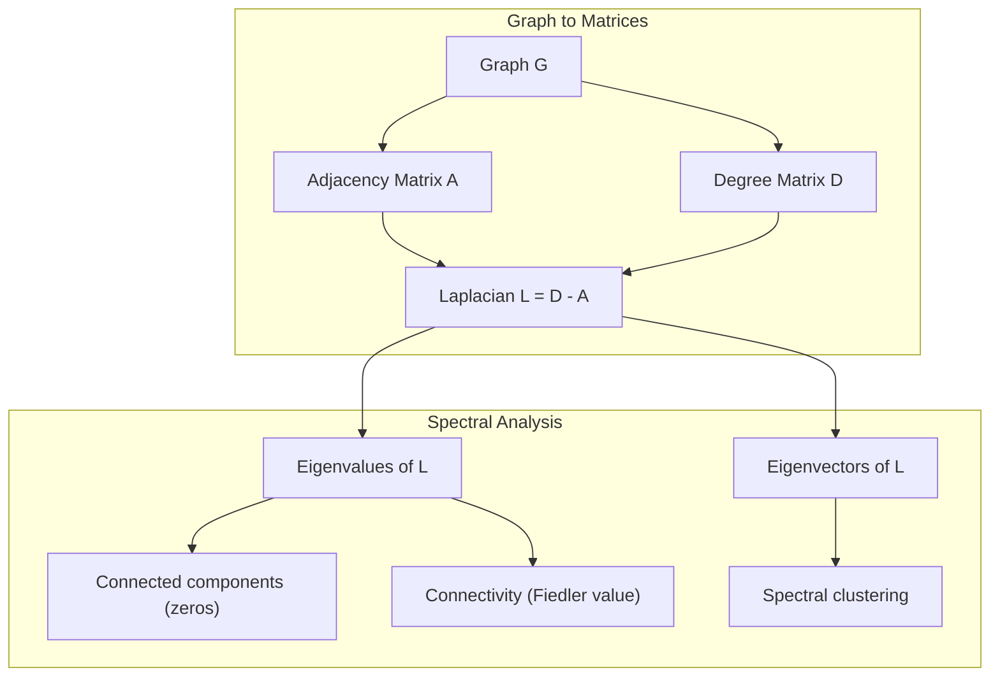
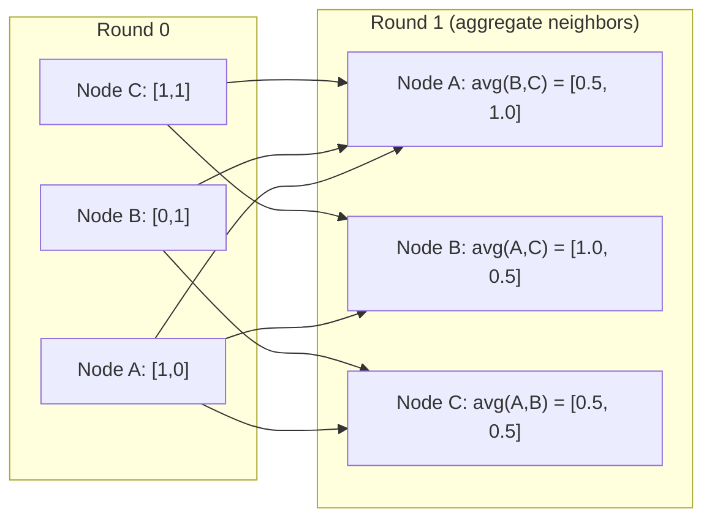

# Graph Theory for Machine Learning | 图论与机器学习

> Graphs are the data structure of relationships. If your data has connections, you need graph theory.
> 图是关系的数据结构。如果你的数据有连接，你需要图论。

**Type:** Build | **类型:** 动手
**Language:** Python | **语言:** Python
**Prerequisites:** Phase 1, Lessons 01-03 (linear algebra, matrices) | **前置知识:** Phase 1, 第 01-03 课（线性代数、矩阵）
**Time:** ~90 minutes | **时间:** ~90 分钟

## Learning Objectives | 学习目标

- Build a graph class with adjacency matrix/list representations and implement BFS and DFS traversals
  构建带有邻接矩阵/列表表示的图类，实现 BFS 和 DFS 遍历
- Compute the graph Laplacian and use its eigenvalues to detect connected components and cluster nodes
  计算图拉普拉斯矩阵（Graph Laplacian）并使用其特征值检测连通分量和聚类节点
- Implement one round of GNN-style message passing as a normalized adjacency matrix multiplication
  实现一轮 GNN 风格的消息传递——归一化邻接矩阵乘法
- Apply spectral clustering to partition a graph using the Fiedler vector
  应用谱聚类（Spectral Clustering）使用 Fiedler 向量划分图


> **【中文解读】**
> 社交网络、分子结构、知识图谱都是图。GNN 的消息传递本质上是邻接矩阵乘法。谱聚类用图拉普拉斯矩阵的特征向量聚类，比 K-Means 更适合非球形数据。

## The Problem | 问题引入

Social networks, molecules, knowledge bases, citation networks, road maps -- all are graphs. Traditional ML treats data as flat tables. Each row is independent. Each feature is a column. But when the structure of connections matters, tables fail.

> 社交网络、分子、知识库、引文网络、道路图——都是图（Graph）。传统 ML 将数据视为扁平表格。每行独立。每列是一个特征。但当连接结构很重要时，表格就失效了。

Consider a social network. You want to predict what product a user will buy. Their purchase history matters. But their friends' purchase history matters more. The connections carry signal.

> 考虑社交网络。你想预测用户会买什么产品。他们的购买历史很重要。但他们朋友的购买历史更重要。连接携带信号。

Or consider a molecule. You want to predict if it binds to a protein. The atoms matter, but what really matters is how atoms are bonded to each other. The structure is the data.

> 或者考虑分子。你想预测它是否与蛋白质结合。原子很重要，但真正重要的是原子之间如何键合。结构就是数据。

Graph Neural Networks (GNNs) are the fastest-growing area in deep learning. They power drug discovery, social recommendation, fraud detection, and knowledge graph reasoning. Every GNN builds on the same foundation: basic graph theory.

> 图神经网络（GNN）是深度学习中增长最快的领域。它们驱动药物发现、社交推荐、欺诈检测和知识图谱推理。每个 GNN 都建立在相同的基础上：基本图论。

You need four things:
1. A way to represent graphs as matrices (so you can multiply them)
   将图表示为矩阵的方法（这样可以做矩阵乘法）
2. Traversal algorithms to explore graph structure
   探索图结构的遍历算法
3. The Laplacian -- the single most important matrix in spectral graph theory
   拉普拉斯矩阵——谱图理论中最重要的矩阵
4. Message passing -- the operation that makes GNNs work
   消息传递——使 GNN 工作的操作

## The Concept | 核心概念

> **【中文解读】**
> 图是关系的数据结构。社交网络中人是节点、关注是边；分子中原子是节点、化学键是边；知识图谱中实体是节点、关系是边。图神经网络（GNN）的核心操作——消息传递——本质上是邻接矩阵乘法。谱聚类用图拉普拉斯矩阵的特征向量做聚类。

> **【拓展：图神经网络在药物发现中的突破】**
> DeepMind 的 AlphaFold2 (2020) 用图神经网络预测蛋白质 3D 结构，解决了困扰生物学界 50 年的蛋白质折叠问题。它把氨基酸残基建模为图节点，残基间的空间关系建模为边。在 CASP14 竞赛中，AlphaFold2 的中位 GDT 分数达到 92.4（满分 100），远超第二名 25 分。Insilico Medicine 用 GNN 设计新药分子，将药物发现周期从数年缩短到数月。

### Graphs: Nodes and Edges

A graph G = (V, E) consists of vertices (nodes) V and edges E. Each edge connects two nodes.

> 图 G = (V, E) 由顶点（节点）V 和边 E 组成。每条边连接两个节点。

**Directed vs undirected.** In an undirected graph, edge (u, v) means u connects to v AND v connects to u. In a directed graph (digraph), edge (u, v) means u points to v, but not necessarily the reverse.

> **有向与无向。** 在无向图中，边 (u, v) 意味着 u 连接 v 且 v 连接 u。在有向图中，边 (u, v) 意味着 u 指向 v，但反向不一定成立。

**Weighted vs unweighted.** In an unweighted graph, edges either exist or they don't. In a weighted graph, each edge has a numerical weight -- a distance, a cost, a strength.

> **加权与无权。** 在无权图中，边要么存在要么不存在。在加权图中，每条边有一个数值权重——距离、成本、强度。

| Graph type | Example |
|-----------|---------|
| Undirected, unweighted | Facebook friendship network |
| Directed, unweighted | Twitter follow network |
| Undirected, weighted | Road map (distances) |
| Directed, weighted | Web page links (PageRank scores) |

### The Adjacency Matrix

The adjacency matrix A is the core representation. For a graph with n nodes:

> 邻接矩阵（Adjacency Matrix）A 是核心表示。对于有 n 个节点的图：

```
A[i][j] = 1    if there is an edge from node i to node j
A[i][j] = 0    otherwise
```

For undirected graphs, A is symmetric: A[i][j] = A[j][i]. For weighted graphs, A[i][j] = weight of edge (i, j).

> 对于无向图，A 是对称的：A[i][j] = A[j][i]。对于加权图，A[i][j] = 边 (i, j) 的权重。

**Example -- a triangle:**

```
Nodes: 0, 1, 2
Edges: (0,1), (1,2), (0,2)

A = [[0, 1, 1],
     [1, 0, 1],
     [1, 1, 0]]
```

The adjacency matrix is the input to every GNN. Matrix operations on A correspond to operations on the graph.

> 邻接矩阵是每个 GNN 的输入。对 A 的矩阵运算对应于图上的操作。

> **【中文解读】**
> 邻接矩阵是图的"数字化表示"。A[i][j]=1 表示节点 i 和 j 之间有边。矩阵乘法的神奇之处：A^2 的元素 A^2[i][j] 恰好等于从 i 到 j 长度为 2 的路径数。GNN 的消息传递本质上就是 A 乘以特征矩阵——每个节点聚合邻居的信息。

### Degree

The degree of a node is the number of edges connected to it. For directed graphs, you have in-degree (edges coming in) and out-degree (edges going out).

> 节点的度（Degree）是连接到它的边数。对于有向图，有入度（In-degree，进入的边）和出度（Out-degree，出去的边）。

The degree matrix D is diagonal:

> 度矩阵（Degree Matrix）D 是对角矩阵：

```
D[i][i] = degree of node i
D[i][j] = 0    for i != j
```

For the triangle example: D = diag(2, 2, 2) because every node connects to two others.

Degree tells you about node importance. High degree = hub node. The degree distribution of a network reveals its structure. Social networks follow power laws (few hubs, many leaf nodes). Random graphs have Poisson-distributed degrees.

> 库告诉你节点重要性。高度 = 枢纽节点。网络的度分布揭示其结构。社交网络遵循幂律（少数枢纽，大量叶节点）。随机图的度服从泊松分布。

### BFS and DFS

The two fundamental graph traversal algorithms. You need both.

> 两种基本图遍历算法。两者都需要。

**Breadth-First Search (BFS):** Explore all neighbors first, then neighbors' neighbors. Uses a queue (FIFO).

> **广度优先搜索（BFS）：** 先探索所有邻居，然后是邻居的邻居。使用队列（先进先出）。

```
BFS from node 0:
  Visit 0
  Queue: [1, 2]        (neighbors of 0)
  Visit 1
  Queue: [2, 3]        (add neighbors of 1)
  Visit 2
  Queue: [3]           (neighbors of 2 already visited)
  Visit 3
  Queue: []            (done)
```

BFS finds shortest paths in unweighted graphs. The distance from the start to any node equals the BFS level at which that node is first discovered. This is why BFS is used for hop-count distances in social networks.

> BFS 在无权图中找到最短路径。从起点到任何节点的距离等于该节点首次被发现时的 BFS 层级。这就是为什么 BFS 用于社交网络中的跳数距离。

**Depth-First Search (DFS):** Go as deep as possible before backtracking. Uses a stack (LIFO) or recursion.

> **深度优先搜索（DFS）：** 尽可能深入再回溯。使用栈（后进先出）或递归。

```
DFS from node 0:
  Visit 0
  Stack: [1, 2]        (neighbors of 0)
  Visit 2               (pop from stack)
  Stack: [1, 3]         (add neighbors of 2)
  Visit 3               (pop from stack)
  Stack: [1]
  Visit 1               (pop from stack)
  Stack: []             (done)
```

DFS is useful for:
- Finding connected components (run DFS from unvisited nodes)
  寻找连通分量（从未访问节点运行 DFS）
- Cycle detection (back edges in DFS tree)
  环检测（DFS 树中的后向边）
- Topological sorting (reverse DFS finish order)
  拓扑排序（DFS 完成顺序的逆序）

| Algorithm | Data structure | Finds | Use case |
|-----------|---------------|-------|----------|
| BFS | Queue | Shortest paths | Social network distance, knowledge graph traversal |
| DFS | Stack | Components, cycles | Connectivity, topological sort |

### The Graph Laplacian

L = D - A. The most important matrix in spectral graph theory.

> L = D - A。谱图理论中最重要的矩阵。

For the triangle:

```
D = [[2, 0, 0],    A = [[0, 1, 1],    L = [[2, -1, -1],
     [0, 2, 0],         [1, 0, 1],         [-1, 2, -1],
     [0, 0, 2]]         [1, 1, 0]]         [-1, -1,  2]]
```

The Laplacian has remarkable properties:

> 拉普拉斯矩阵有非凡的性质：

1. **L is positive semi-definite.** All eigenvalues are >= 0.

> 1. **L 是半正定的。** 所有特征值 >= 0。

2. **The number of zero eigenvalues equals the number of connected components.** A connected graph has exactly one zero eigenvalue. A graph with 3 disconnected components has three zero eigenvalues.

> 2. **零特征值的个数等于连通分量的个数。** 连通图恰好有一个零特征值。有 3 个不连通分量的图有三个零特征值。

3. **The smallest non-zero eigenvalue (Fiedler value) measures connectivity.** A large Fiedler value means the graph is well-connected. A small Fiedler value means the graph has a weak point -- a bottleneck.

> 3. **最小非零特征值（Fiedler 值）衡量连通性。** Fiedler 值大意味着图连接良好。Fiedler 值小意味着图有弱点——瓶颈。

4. **The eigenvector of the Fiedler value (Fiedler vector) reveals the best split.** Nodes with positive values go in one group, nodes with negative values go in the other. This is spectral clustering.

> 4. **Fiedler 值对应的特征向量（Fiedler 向量）揭示最佳划分。** 正值的节点归一组，负值的归另一组。这就是谱聚类。

> **【中文解读】**
> 图拉普拉斯 L = D - A 是谱图理论中最重要的矩阵。它的四个关键性质：(1) 半正定；(2) 零特征值个数 = 连通分量个数；(3) 最小非零特征值（Fiedler 值）衡量连通性——越大越紧密；(4) Fiedler 向量的正负号自动将图分成两簇。这就是谱聚类的数学基础。



### Spectral Properties

The eigenvalues of the adjacency matrix and Laplacian reveal structural properties without any traversal.

> 邻接矩阵和拉普拉斯矩阵的特征值无需遍历就能揭示结构性质。

**Spectral clustering** works like this:
1. Compute the Laplacian L
   计算拉普拉斯矩阵 L
2. Find the k smallest eigenvectors of L (skip the first, which is all-ones for connected graphs)
   找到 L 的 k 个最小特征向量（跳过第一个，连通图中它是全 1 向量）
3. Use those eigenvectors as new coordinates for each node
   将这些特征向量用作每个节点的新坐标
4. Run k-means on those coordinates
   在这些坐标上运行 k-means

Why does this work? The eigenvectors of L encode the "smoothest" functions on the graph. Nodes that are well-connected get similar eigenvector values. Nodes separated by a bottleneck get different values. The eigenvectors naturally separate clusters.

> 为什么有效？L 的特征向量编码了图上"最平滑"的函数。连接良好的节点获得相似的特征向量值。被瓶颈分隔的节点获得不同的值。特征向量自然地分离簇。

**Random walk connection.** The normalized Laplacian relates to random walks on the graph. The stationary distribution of a random walk is proportional to node degree. The mixing time (how fast the walk converges) depends on the spectral gap.

> **随机游走联系。** 归一化拉普拉斯与图上的随机游走有关。随机游走的平稳分布与节点度成正比。混合时间（收敛速度）取决于谱间隙（Spectral Gap）。

### Message Passing

The core operation of Graph Neural Networks. Each node collects messages from its neighbors, aggregates them, and updates its own state.

> 图神经网络的核心操作。每个节点从邻居收集消息，聚合它们，并更新自己的状态。

```
h_v^(k+1) = UPDATE(h_v^(k), AGGREGATE({h_u^(k) : u in neighbors(v)}))
```

In the simplest form, AGGREGATE = mean, and UPDATE = linear transform + activation:

```
h_v^(k+1) = sigma(W * mean({h_u^(k) : u in neighbors(v)}))
```

This is matrix multiplication in disguise. If H is the matrix of all node features and A is the adjacency matrix:

```
H^(k+1) = sigma(A_norm * H^(k) * W)
```

where A_norm is the normalized adjacency matrix (each row sums to 1).

One round of message passing lets each node "see" its immediate neighbors. Two rounds let it see neighbors of neighbors. K rounds give each node information from its K-hop neighborhood.

> **【拓展：消息传递与 GNN 架构演进】**
> GCN (Kipf & Welling, 2017) 是最简单的消息传递 GNN：每层做一次归一化邻接矩阵乘法 + 线性变换。GAT (Veličković et al., 2018) 引入注意力机制让节点学习邻居的重要性权重。GraphSAGE (Hamilton et al., 2017) 支持采样邻居以处理大规模图。Pinterest 的 PinSage 模型在 30 亿节点的图上运行，每天生成超过 10 亿次推荐。GNN 是增长最快的 AI 子领域之一。



### Concepts and ML Applications

| Concept | ML Application |
|---------|---------------|
| Adjacency matrix | GNN input representation |
| Graph Laplacian | Spectral clustering, community detection |
| BFS/DFS | Knowledge graph traversal, path finding |
| Degree distribution | Node importance, feature engineering |
| Message passing | GNN layers (GCN, GAT, GraphSAGE) |
| Eigenvalues of L | Community detection, graph partitioning |
| Spectral clustering | Unsupervised node grouping |
| PageRank | Node importance, web search |

## Build It | 动手实现

### Step 1: Graph class from scratch

```python
class Graph:
    def __init__(self, n_nodes, directed=False):
        self.n = n_nodes
        self.directed = directed
        self.adj = {i: {} for i in range(n_nodes)}

    def add_edge(self, u, v, weight=1.0):
        self.adj[u][v] = weight
        if not self.directed:
            self.adj[v][u] = weight

    def neighbors(self, node):
        return list(self.adj[node].keys())

    def degree(self, node):
        return len(self.adj[node])

    def adjacency_matrix(self):
        import numpy as np
        A = np.zeros((self.n, self.n))
        for u in range(self.n):
            for v, w in self.adj[u].items():
                A[u][v] = w
        return A

    def degree_matrix(self):
        import numpy as np
        D = np.zeros((self.n, self.n))
        for i in range(self.n):
            D[i][i] = self.degree(i)
        return D

    def laplacian(self):
        return self.degree_matrix() - self.adjacency_matrix()
```

The adjacency list (`self.adj`) stores neighbors efficiently. The adjacency matrix conversion uses numpy because all the spectral operations need it.

### Step 2: BFS and DFS

```python
from collections import deque

def bfs(graph, start):
    visited = set()
    order = []
    distances = {}
    queue = deque([(start, 0)])                     # BFS 用队列：先进先出
    visited.add(start)
    while queue:
        node, dist = queue.popleft()                # 取出队列头部的节点
        order.append(node)
        distances[node] = dist                      # 距离 = BFS 层级（最短路径）
        for neighbor in graph.neighbors(node):
            if neighbor not in visited:
                visited.add(neighbor)
                queue.append((neighbor, dist + 1))  # 邻居距离 +1
    return order, distances


def dfs(graph, start):
    visited = set()
    order = []
    stack = [start]
    while stack:
        node = stack.pop()
        if node in visited:
            continue
        visited.add(node)
        order.append(node)
        for neighbor in reversed(graph.neighbors(node)):
            if neighbor not in visited:
                stack.append(neighbor)
    return order
```

BFS uses a deque (double-ended queue) for O(1) popleft. DFS uses a list as a stack. Both visit every node exactly once -- O(V + E) time.

### Step 3: Connected components and Laplacian eigenvalues

```python
def connected_components(graph):
    visited = set()
    components = []
    for node in range(graph.n):
        if node not in visited:
            order, _ = bfs(graph, node)
            visited.update(order)
            components.append(order)
    return components


def laplacian_eigenvalues(graph):
    import numpy as np
    L = graph.laplacian()
    eigenvalues = np.linalg.eigvalsh(L)
    return eigenvalues
```

`eigvalsh` is for symmetric matrices -- the Laplacian is always symmetric for undirected graphs. It returns eigenvalues in ascending order. Count the zeros to find the number of connected components.

### Step 4: Spectral clustering

```python
def spectral_clustering(graph, k=2):
    import numpy as np
    L = graph.laplacian()                           # 计算图拉普拉斯矩阵 L = D - A
    eigenvalues, eigenvectors = np.linalg.eigh(L)   # 特征分解（对称矩阵用 eigh）
    features = eigenvectors[:, 1:k+1]               # 取第 2 到 k+1 个特征向量（跳过第一个全 1 向量）

    labels = np.zeros(graph.n, dtype=int)
    for i in range(graph.n):
        if features[i, 0] >= 0:                     # Fiedler 向量 >= 0 → 簇 A
            labels[i] = 0
        else:                                       # Fiedler 向量 < 0 → 簇 B
            labels[i] = 1
    return labels
```

For k=2, the sign of the Fiedler vector splits the graph into two clusters. For k>2, you would run k-means on the first k eigenvectors (excluding the trivial all-ones eigenvector).

### Step 5: Message passing

```python
def message_passing(graph, features, weight_matrix):
    import numpy as np
    A = graph.adjacency_matrix()
    row_sums = A.sum(axis=1, keepdims=True)
    row_sums[row_sums == 0] = 1
    A_norm = A / row_sums
    aggregated = A_norm @ features
    output = aggregated @ weight_matrix
    return output
```

This is one round of GNN message passing. Each node's new features are the weighted average of its neighbors' features, transformed by the weight matrix. Stack multiple rounds to propagate information further.

## Use It | 用框架实现

With networkx and numpy, the same operations are one-liners:

```python
import networkx as nx
import numpy as np

G = nx.karate_club_graph()

A = nx.adjacency_matrix(G).toarray()
L = nx.laplacian_matrix(G).toarray()

eigenvalues = np.linalg.eigvalsh(L.astype(float))
print(f"Smallest eigenvalues: {eigenvalues[:5]}")
print(f"Connected components: {nx.number_connected_components(G)}")

communities = nx.community.greedy_modularity_communities(G)
print(f"Communities found: {len(communities)}")

pr = nx.pagerank(G)
top_nodes = sorted(pr.items(), key=lambda x: x[1], reverse=True)[:5]
print(f"Top 5 PageRank nodes: {top_nodes}")
```

networkx handles graphs of any size with optimized C backends. Use it in production. Use your from-scratch implementation to understand what it does.

### numpy spectral analysis

```python
import numpy as np

A = np.array([
    [0, 1, 1, 0, 0],
    [1, 0, 1, 0, 0],
    [1, 1, 0, 1, 0],
    [0, 0, 1, 0, 1],
    [0, 0, 0, 1, 0]
])

D = np.diag(A.sum(axis=1))
L = D - A

eigenvalues, eigenvectors = np.linalg.eigh(L)
print(f"Eigenvalues: {np.round(eigenvalues, 4)}")
print(f"Fiedler value: {eigenvalues[1]:.4f}")
print(f"Fiedler vector: {np.round(eigenvectors[:, 1], 4)}")

fiedler = eigenvectors[:, 1]
group_a = np.where(fiedler >= 0)[0]
group_b = np.where(fiedler < 0)[0]
print(f"Cluster A: {group_a}")
print(f"Cluster B: {group_b}")
```

The Fiedler vector does the heavy lifting. Positive entries in one cluster, negative in the other. No iterative optimization needed -- just one eigendecomposition.

## Ship It | 产出物

This lesson produces:
- `outputs/skill-graph-analysis.md` -- a skill reference for analyzing graph-structured data

## Connections | 概念关联地图

| Concept | Where it shows up |
|---------|------------------|
| Adjacency matrix | GCN, GAT, GraphSAGE input |
| Laplacian | Spectral clustering, ChebNet filters |
| BFS | Knowledge graph traversal, shortest path queries |
| Message passing | Every GNN layer, neural message passing |
| Spectral gap | Graph connectivity, mixing time of random walks |
| Degree distribution | Power-law networks, node feature engineering |
| Connected components | Preprocessing, handling disconnected graphs |
| PageRank | Node importance ranking, attention initialization |

GNNs deserve special mention. The graph convolution operation in GCN (Kipf & Welling, 2017) uses the adjacency matrix with added self-loops, A_hat = A + I:

```text
H^(l+1) = sigma(D_hat^(-1/2) * A_hat * D_hat^(-1/2) * H^(l) * W^(l))
```

where A_hat = A + I (adjacency plus self-loops) and D_hat is the degree matrix of A_hat. The self-loops ensure each node includes its own features during aggregation. This is exactly message passing with symmetric normalization. D_hat^(-1/2) * A_hat * D_hat^(-1/2) is the normalized adjacency matrix. The Laplacian shows up because this normalization is related to L_sym = I - D^(-1/2) * A * D^(-1/2). Understanding the Laplacian means understanding why GCNs work.

## Exercises | 练习题

1. **Implement PageRank from scratch.** Start with uniform scores. At each step: score(v) = (1-d)/n + d * sum(score(u)/out_degree(u)) for all u pointing to v. Use d=0.85. Run until convergence (change < 1e-6). Test on a small web graph.

2. **Find communities using spectral clustering.** Create a graph with two clearly separated clusters (e.g., two cliques connected by a single edge). Run spectral clustering and verify it finds the right split. What happens as you add more cross-cluster edges?

3. **Implement Dijkstra's algorithm** for shortest paths in weighted graphs. Compare results to BFS on the same graph with uniform weights.

4. **Build a 2-layer message passing network.** Apply message passing twice with different weight matrices. Show that after 2 rounds, each node has information from its 2-hop neighborhood.

5. **Analyze a real-world graph.** Use the Karate Club graph (34 nodes, 78 edges). Compute degree distribution, Laplacian eigenvalues, and spectral clustering. Compare the spectral clustering result to the known ground truth split.

## Key Terms | 术语速查表

| Term | What people say | What it actually means |
|------|----------------|----------------------|
| Graph | "Nodes and edges" | A mathematical structure G=(V,E) encoding pairwise relationships |
| Adjacency matrix | "The connection table" | An n x n matrix where A[i][j] = 1 if nodes i and j are connected |
| Degree | "How connected a node is" | The number of edges touching a node |
| Laplacian | "D minus A" | L = D - A, the matrix whose eigenvalues reveal graph structure |
| Fiedler value | "The algebraic connectivity" | The smallest non-zero eigenvalue of L, measuring how well-connected the graph is |
| BFS | "Level-by-level search" | Traversal that visits all neighbors before going deeper, finds shortest paths |
| DFS | "Go deep first" | Traversal that follows one path to its end before backtracking |
| Message passing | "Nodes talk to neighbors" | Each node aggregates information from its neighbors, the core of GNNs |
| Spectral clustering | "Cluster by eigenvectors" | Partition a graph using eigenvectors of its Laplacian |
| Connected component | "A separate piece" | A maximal subgraph where every node can reach every other node |

## Further Reading | 延伸阅读

- **Kipf & Welling (2017)** -- "Semi-Supervised Classification with Graph Convolutional Networks." The paper that launched modern GNNs. Shows that spectral graph convolutions simplify to message passing.
- **Spielman (2012)** -- "Spectral Graph Theory" lecture notes. The definitive introduction to Laplacians, spectral gaps, and graph partitioning.
- **Hamilton (2020)** -- "Graph Representation Learning." Book covering GNNs from fundamentals to applications.
- **Bronstein et al. (2021)** -- "Geometric Deep Learning: Grids, Groups, Graphs, Geodesics, and Gauges." The unifying framework paper.
- **Veličković et al. (2018)** -- "Graph Attention Networks." Extends message passing with attention mechanisms.
