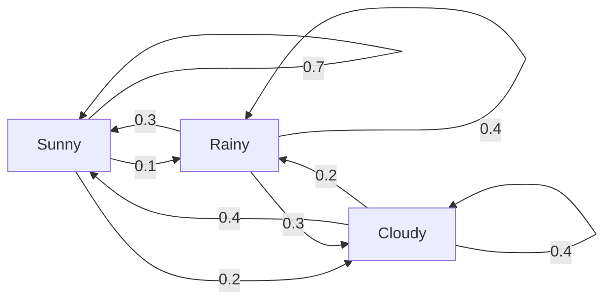
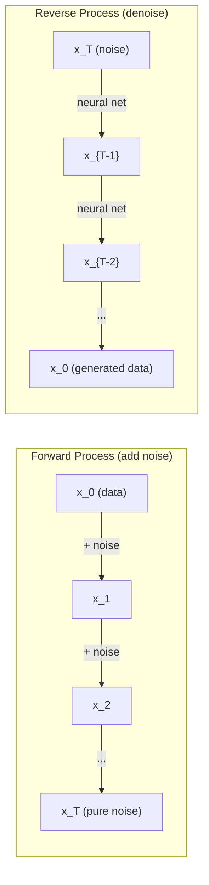

# Stochastic Processes | 随机过程

> Randomness with structure. The math behind random walks, Markov chains, and diffusion models.
> 有结构的随机性。随机游走、马尔可夫链和扩散模型背后的数学。

**Type:** Learn | **类型:** 学习
**Language:** Python | **语言:** Python
**Prerequisites:** Phase 1, Lessons 06-07 (probability, Bayes) | **前置知识:** Phase 1, 第 06-07 课（概率、贝叶斯）
**Time:** ~75 minutes | **时间:** ~75 分钟

## Learning Objectives | 学习目标

- Simulate 1D and 2D random walks and verify the sqrt(n) scaling of displacement
  模拟一维和二维随机游走，验证位移的 √n 缩放规律
- Build a Markov chain simulator and compute its stationary distribution via eigendecomposition
  构建马尔可夫链模拟器，通过特征分解计算平稳分布
- Implement Metropolis-Hastings MCMC and Langevin dynamics for sampling from target distributions
  实现 Metropolis-Hastings MCMC 和 Langevin 动力学，从目标分布中采样
- Connect the forward diffusion process to Brownian motion and explain how the reverse process generates data
  将前向扩散过程与布朗运动联系起来，解释反向过程如何生成数据


> **【中文解读】**
> 随机过程是有结构的随机性。马尔可夫链（当前状态只依赖前一步）是 PageRank 的基础。扩散模型的前向过程是布朗运动（加噪），反向过程是去噪生成。MCMC 是贝叶斯统计的基石。

## The Problem | 问题引入

Many AI systems involve randomness that evolves over time. Not static randomness -- structured, sequential randomness where each step depends on what came before.

> 许多 AI 系统都涉及随时间演化的随机性。不是静态的随机，而是有结构的、序列化的随机性——每一步都依赖于之前发生的事。

Language models generate tokens one at a time. Each token depends on the previous context. The model outputs a probability distribution, samples from it, and moves on. That is a stochastic process.

> 语言模型逐个生成 token。每个 token 依赖于之前的上下文。模型输出一个概率分布，从中采样，然后继续。这就是随机过程。

Diffusion models add noise to an image step by step until it becomes pure static. Then they reverse the process, denoising step by step until a new image emerges. The forward process is a Markov chain. The reverse process is a learned Markov chain running backward.

> 扩散模型逐步向图像添加噪声，直到变成纯静态。然后反转过程，逐步去噪直到新图像出现。前向过程是马尔可夫链，反向过程是学习到的反向马尔可夫链。

Reinforcement learning agents take actions in an environment. Each action leads to a new state with some probability. The agent follows a random policy in a random world. The whole thing is a Markov decision process.

> 强化学习智能体在环境中执行动作。每个动作以一定概率导致新状态。智能体在随机世界中遵循随机策略。整个系统是马尔可夫决策过程（MDP）。

MCMC sampling -- the backbone of Bayesian inference -- constructs a Markov chain whose stationary distribution is the posterior you want to sample from.

> MCMC 采样——贝叶斯推理的基石——构造一个马尔可夫链，其平稳分布就是你想从中采样的后验分布。

All of these build on four foundational ideas:
1. Random walks -- the simplest stochastic process
2. Markov chains -- structured randomness with a transition matrix
3. Langevin dynamics -- gradient descent with noise
4. Metropolis-Hastings -- sampling from any distribution

> 所有这些都建立在四个基础概念之上：1. 随机游走——最简单的随机过程；2. 马尔可夫链——带转移矩阵的结构化随机性；3. Langevin 动力学——带噪声的梯度下降；4. Metropolis-Hastings——从任意分布中采样。

## The Concept | 核心概念

### Random Walks

Start at position 0. At each step, flip a fair coin. Heads: move right (+1). Tails: move left (-1).

> 从位置 0 开始。每一步抛一枚公平硬币。正面：向右 (+1)。反面：向左 (-1)。

After n steps, your position is the sum of n random +/-1 values. The expected position is 0 (the walk is unbiased). But the expected distance from the origin grows as sqrt(n).

> n 步后，你的位置是 n 个随机 ±1 值的求和。期望位置为 0（游走无偏），但距离原点的期望距离按 √n 增长。

This is counterintuitive. The walk is fair -- no drift in either direction. But over time, it wanders further and further from where it started. The standard deviation after n steps is sqrt(n).

> 这有点反直觉。游走是公平的——两个方向没有漂移——但随着时间推移，它离起点越来越远。n 步后的标准差为 √n。

```
Step 0:  Position = 0
Step 1:  Position = +1 or -1
Step 2:  Position = +2, 0, or -2
...
Step 100: Expected distance from origin ~ 10 (sqrt(100))
Step 10000: Expected distance from origin ~ 100 (sqrt(10000))
```

**In 2D**, the walk moves up, down, left, or right with equal probability. The same sqrt(n) scaling applies to the distance from the origin. The path traces a fractal-like pattern.

> **二维情况下**，游走以等概率向上、下、左、右移动。同样的 √n 缩放适用于到原点的距离，路径呈分形图案。

**Why sqrt(n)?** Each step is +1 or -1 with equal probability. After n steps, the position S_n = X_1 + X_2 + ... + X_n where each X_i is +/-1. The variance of each step is 1, and the steps are independent, so Var(S_n) = n. Standard deviation = sqrt(n). By the central limit theorem, S_n / sqrt(n) converges to a standard normal distribution.

> **为什么是 √n？** 每步方差为 1，步与步独立，所以 Var(S_n) = n，标准差 = √n。由中心极限定理，S_n/√n 收敛到标准正态分布。

This sqrt(n) scaling shows up everywhere in ML. SGD noise scales as 1/sqrt(batch_size). Embedding dimensions scale as sqrt(d). The square root is the signature of independent random additions.

> √n 缩放在 ML 中无处不在。SGD 噪声按 1/√(batch_size) 缩放，嵌入维度按 √d 缩放。平方根是独立随机叠加的标志。

**Connection to Brownian motion.** Take a random walk with step size 1/sqrt(n) and n steps per unit time. As n goes to infinity, the walk converges to Brownian motion B(t) -- a continuous-time process where B(t) is normally distributed with mean 0 and variance t.

> **与布朗运动的联系。** 取步长 1/√n、每单位时间 n 步的随机游走。当 n → ∞ 时，游走收敛到布朗运动 B(t)——一个连续时间过程，B(t) ~ N(0, t)。

Brownian motion is the mathematical foundation of diffusion. It models the random jiggling of particles in a fluid, the fluctuations of stock prices, and -- crucially -- the noise process in diffusion models.

> 布朗运动是扩散模型的数学基础。它描述流体中粒子的随机抖动、股票价格的波动，以及——最关键的——扩散模型中的噪声过程。

**Gambler's ruin.** A random walker starting at position k, with absorbing barriers at 0 and N. What is the probability of reaching N before 0? For a fair walk: P(reach N) = k/N. This is surprisingly simple and elegant. It connects to the theory of martingales -- the fair random walk is a martingale (expected future value = current value).

> **赌徒破产问题。** 从位置 k 出发，在 0 和 N 处有吸收壁。到达 N（而非 0）的概率是多少？公平游走：P = k/N。这连接到鞅论——公平随机游走是一个鞅。

### Markov Chains

A Markov chain is a system that transitions between states according to fixed probabilities. The key property: the next state depends only on the current state, not on the history.

> 马尔可夫链是一个根据固定概率在状态之间转移的系统。核心性质：下一个状态只取决于当前状态，与历史无关（"无记忆性"）。

```
P(X_{t+1} = j | X_t = i, X_{t-1} = ...) = P(X_{t+1} = j | X_t = i)
```

This is the Markov property. It means you can describe the entire dynamics with a transition matrix P:

> 这就是马尔可夫性质。它意味着你可以用转移矩阵 P 描述整个动态。

```
P[i][j] = probability of going from state i to state j
```

Each row of P sums to 1 (you must go somewhere).

> P 的每行和为 1（你必须去某个地方）。

**Example -- Weather:**

> **示例——天气：**

```
States: Sunny (0), Rainy (1), Cloudy (2)

P = [[0.7, 0.1, 0.2],    (if sunny: 70% sunny, 10% rainy, 20% cloudy)
     [0.3, 0.4, 0.3],    (if rainy: 30% sunny, 40% rainy, 30% cloudy)
     [0.4, 0.2, 0.4]]    (if cloudy: 40% sunny, 20% rainy, 40% cloudy)
```

Start in any state. After many transitions, the distribution of states converges to the stationary distribution pi, where pi * P = pi. This is the left eigenvector of P with eigenvalue 1.

> 从任意状态开始，经过足够多转移后，状态分布收敛到平稳分布 π，满足 π·P = π。这是 P 的特征值为 1 的左特征向量。

For the weather chain, the stationary distribution might be [0.53, 0.18, 0.29] -- over the long run, it is sunny 53% of the time regardless of the starting state.

> 对天气链来说，平稳分布可能是 [0.53, 0.18, 0.29]——长期来看 53% 的时间晴天，与起始状态无关。



**Computing the stationary distribution.** There are two approaches:

1. **Power method**: multiply any initial distribution by P repeatedly. After enough iterations, it converges.
2. **Eigenvalue method**: find the left eigenvector of P with eigenvalue 1. This is the eigenvector of P^T with eigenvalue 1.

> **计算平稳分布。** 两种方法：1. **幂法**：反复用任意初始分布乘 P，足够多次后收敛。2. **特征值法**：求 P 的特征值为 1 的左特征向量（即 P^T 的特征值为 1 的右特征向量）。

Both approaches require the chain to satisfy convergence conditions.

> 两种方法都要求链满足收敛条件。

**Convergence conditions.** A Markov chain converges to a unique stationary distribution if it is:
- **Irreducible**: every state is reachable from every other state
- **Aperiodic**: the chain does not cycle with a fixed period

> **收敛条件。** 马尔可夫链收敛到唯一平稳分布需满足：**不可约**（每个状态都能从其他状态到达）；**非周期**（链不会以固定周期循环）。

Most chains you encounter in ML satisfy both conditions.

> 你在 ML 中遇到的大多数链都满足这两个条件。

**Absorbing states.** A state is absorbing if once you enter it, you never leave (P[i][i] = 1). Absorbing Markov chains model processes with terminal states -- a game that ends, a customer who churns, a token sequence that hits the end-of-text token.

> **吸收状态。** 一旦进入就永不离开的状态（P[i][i]=1）。吸收马尔可夫链建模有终止状态的过程——结束的游戏、流失的客户、命中结束 token 的序列。

**Mixing time.** How many steps until the chain is "close" to the stationary distribution? Formally, the number of steps until the total variation distance from stationarity drops below some threshold. Fast mixing = few steps needed. The spectral gap of P (1 minus the second-largest eigenvalue) controls the mixing time. Larger gap = faster mixing.

> **混合时间。** 链"接近"平稳分布需要多少步？形式上，是与平稳分布的总变差距离降到阈值以下的步数。快混合 = 步数少。谱间隙（1 - 第二大特征值）控制混合时间：间隙越大，混合越快。

### Connection to Language Models

Token generation in a language model is approximately a Markov process. Given the current context, the model outputs a distribution over the next token. Temperature controls the sharpness:

> 语言模型的 token 生成近似是一个马尔可夫过程。给定当前上下文，模型输出下一个 token 的概率分布。Temperature 控制分布的尖锐程度：

```
P(token_i) = exp(logit_i / temperature) / sum(exp(logit_j / temperature))
```

- Temperature = 1.0: standard distribution
- Temperature < 1.0: sharper (more deterministic)
- Temperature > 1.0: flatter (more random)
- Temperature -> 0: argmax (greedy)

> Temperature=1.0 标准分布；<1.0 更尖锐（更确定性）；>1.0 更平坦（更随机）；→0 退化为 argmax（贪心解码）。

Top-k sampling truncates to the k highest-probability tokens. Top-p (nucleus) sampling truncates to the smallest set of tokens whose cumulative probability exceeds p. Both modify the Markov transition probabilities.

> Top-k 采样保留概率最高的 k 个 token；Top-p（核采样）保留累积概率超过 p 的最小 token 集合。两者都修改了马尔可夫转移概率。

### Brownian Motion

The continuous-time limit of the random walk. Position B(t) has three properties:
1. B(0) = 0
2. B(t) - B(s) is normally distributed with mean 0 and variance t - s (for t > s)
3. Increments on non-overlapping intervals are independent

> 布朗运动是随机游走的连续时间极限。B(t) 有三条性质：B(0)=0；B(t)-B(s) ~ N(0, t-s)；非重叠区间上的增量独立。

Brownian motion is continuous but nowhere differentiable -- it jiggles at every scale. The path has fractal dimension 2 in the plane.

> 布朗运动连续但处处不可导——它在每个尺度都抖动。路径在平面上的分形维数为 2。

In discrete simulation, you approximate Brownian motion by:

```
B(t + dt) = B(t) + sqrt(dt) * z,    where z ~ N(0, 1)
```

The sqrt(dt) scaling is important. It comes from the central limit theorem applied to random walks.

> 离散仿真中用 B(t+dt) = B(t) + √dt × z 近似布朗运动（z ~ N(0,1)）。√dt 缩放很关键，源自随机游走的中心极限定理。

### Langevin Dynamics

Gradient descent finds the minimum of a function. Langevin dynamics finds the probability distribution proportional to exp(-U(x)/T), where U is an energy function and T is temperature.

> 梯度下降找函数最小值。Langevin 动力学找概率分布 ∝ exp(-U(x)/T)，其中 U 是能量函数，T 是温度。

```
x_{t+1} = x_t - dt * gradient(U(x_t)) + sqrt(2 * T * dt) * z_t
```

Two forces act on the particle:
1. **Gradient force** (-dt * gradient(U)): pushes toward low energy (like gradient descent)
2. **Random force** (sqrt(2*T*dt) * z): pushes in random directions (exploration)

> 两种力作用在粒子上：1. **梯度力** 推向低能量（类似梯度下降）；2. **随机力** 推向随机方向（探索）。

At temperature T = 0, this is pure gradient descent. At high temperature, it is nearly a random walk. At the right temperature, the particle explores the energy landscape and spends more time in low-energy regions.

> 温度 T=0 时是纯梯度下降。高温时近似随机游走。合适的温度下，粒子探索能量景观并在低能量区域停留更久。

**Connection to diffusion models.** The forward process of a diffusion model is:

```
x_t = sqrt(alpha_t) * x_{t-1} + sqrt(1 - alpha_t) * noise
```

This is a Markov chain that gradually mixes the data with noise. After enough steps, x_T is pure Gaussian noise.

> 扩散模型的前向过程：x_t = √α_t × x_{t-1} + √(1-α_t) × noise。这是逐步混入噪声的马尔可夫链，足够多步后 x_T 变为纯高斯噪声。

The reverse process -- going from noise back to data -- is also a Markov chain, but its transition probabilities are learned by a neural network. The network learns to predict the noise that was added at each step, then subtracts it.

> 反向过程——从噪声回到数据——也是马尔可夫链，但转移概率由神经网络学习。网络学会预测每步添加的噪声，然后减去它。



### MCMC: Markov Chain Monte Carlo

Sometimes you need to sample from a distribution p(x) that you can evaluate (up to a constant) but cannot sample from directly. Bayesian posteriors are the classic example -- you know the likelihood times the prior, but the normalizing constant is intractable.

> 有时你需要从一个可以计算（但缺少归一化常数）却无法直接采样的分布 p(x) 中采样。贝叶斯后验就是经典例子——你知道似然×先验，但归一化常数无法计算。

**Metropolis-Hastings** constructs a Markov chain whose stationary distribution is p(x):

1. Start at some position x
2. Propose a new position x' from a proposal distribution Q(x'|x)
3. Compute acceptance ratio: a = p(x') * Q(x|x') / (p(x) * Q(x'|x))
4. Accept x' with probability min(1, a). Otherwise stay at x.
5. Repeat.

> **Metropolis-Hastings** 构造一个平稳分布为 p(x) 的马尔可夫链：1) 从某点 x 出发；2) 从提议分布 Q(x'|x) 提出新位置 x'；3) 计算接受率 a = p(x')Q(x|x')/(p(x)Q(x'|x))；4) 以概率 min(1,a) 接受，否则停留；5) 重复。

If Q is symmetric (e.g., Q(x'|x) = Q(x|x') = N(x, sigma^2)), the ratio simplifies to a = p(x') / p(x). You only need the ratio of probabilities -- the normalizing constant cancels.

> 如果 Q 对称（如高斯），接受率简化为 a = p(x')/p(x)。只需概率比——归一化常数自动消去，这正是 MCMC 对贝叶斯后验如此有用的原因。

The chain is guaranteed to converge to p(x) under mild conditions. But convergence can be slow if the proposal is too small (random walk) or too large (high rejection). Tuning the proposal is the art of MCMC.

> 在温和条件下链保证收敛到 p(x)。但收敛可能慢——提议太小（变成随机游走）或太大（高拒绝率）。调参是 MCMC 的艺术。

**Why it works.** The acceptance ratio ensures detailed balance: the probability of being at x and moving to x' equals the probability of being at x' and moving to x. Detailed balance implies that p(x) is the stationary distribution of the chain. So after enough steps, the samples come from p(x).

> **为什么有效**：接受率保证细致平衡——从 x 到 x' 的概率等于从 x' 到 x 的概率。细致平衡意味着 p(x) 是链的平稳分布，足够多步后样本来自 p(x)。

**Practical considerations:**
- **Burn-in**: discard the first N samples. The chain needs time to reach the stationary distribution from its starting point.
- **Thinning**: keep every k-th sample to reduce autocorrelation.
- **Multiple chains**: run several chains from different starting points. If they converge to the same distribution, you have evidence of convergence.
- **Acceptance rate**: for Gaussian proposals in d dimensions, the optimal acceptance rate is about 23% (Roberts & Rosenthal, 2001). Too high means the chain barely moves. Too low means it rejects everything.

> 实战要点：**Burn-in** 丢弃前 N 个样本（链需要时间到达平稳分布）；**Thinning** 每 k 个样本取一个（降低自相关）；**Multiple chains** 从不同起点跑多条链（如果收敛到同分布，则有收敛证据）；**Acceptance rate** d 维高斯提议的最优接受率约 23%（太高=几乎不动，太低=全拒绝）。

### Stochastic Processes in AI

| Process | AI Application |
|---------|---------------|
| Random walk | Exploration in RL, Node2Vec embeddings |
| Markov chain | Text generation, MCMC sampling |
| Brownian motion | Diffusion models (forward process) |
| Langevin dynamics | Score-based generative models, SGLD |
| Markov decision process | Reinforcement learning |
| Metropolis-Hastings | Bayesian inference, posterior sampling |

> 随机过程在 AI 中的应用：随机游走（RL 探索、Node2Vec 嵌入）、马尔可夫链（文本生成、MCMC）、布朗运动（扩散模型前向）、Langevin 动力学（Score-based 模型、SGLD）、马尔可夫决策过程（强化学习）、Metropolis-Hastings（贝叶斯推理、后验采样）。

## Build It | 动手实现

### Step 1: Random walk simulator

> 第1步：随机游走模拟器。1D 用累加和，2D 用四个方向（上下左右）的累加。

```python
import numpy as np

def random_walk_1d(n_steps, seed=None):
    rng = np.random.RandomState(seed)
    steps = rng.choice([-1, 1], size=n_steps)
    positions = np.concatenate([[0], np.cumsum(steps)])
    return positions


def random_walk_2d(n_steps, seed=None):
    rng = np.random.RandomState(seed)
    directions = rng.choice(4, size=n_steps)
    dx = np.zeros(n_steps)
    dy = np.zeros(n_steps)
    dx[directions == 0] = 1   # right
    dx[directions == 1] = -1  # left
    dy[directions == 2] = 1   # up
    dy[directions == 3] = -1  # down
    x = np.concatenate([[0], np.cumsum(dx)])
    y = np.concatenate([[0], np.cumsum(dy)])
    return x, y
```

The 1D walk stores cumulative sums. Each step is +1 or -1. After n steps, the position is the sum. The variance grows linearly with n, so the standard deviation grows as sqrt(n).

> 一维随机游走存储累加和。每步是 +1 或 -1。n 步后位置是总和。方差线性增长 n，标准差按 √n 增长。

### Step 2: Markov chain

> 第2步：马尔可夫链。step() 按转移概率选下一状态；simulate() 跑多步生成轨迹；stationary_distribution() 用特征分解求平稳分布。

```python
class MarkovChain:
    def __init__(self, transition_matrix, state_names=None):
        self.P = np.array(transition_matrix, dtype=float)
        self.n_states = len(self.P)
        self.state_names = state_names or [str(i) for i in range(self.n_states)]

    def step(self, current_state, rng=None):
        if rng is None:
            rng = np.random.RandomState()
        probs = self.P[current_state]
        return rng.choice(self.n_states, p=probs)

    def simulate(self, start_state, n_steps, seed=None):
        rng = np.random.RandomState(seed)
        states = [start_state]
        current = start_state
        for _ in range(n_steps):
            current = self.step(current, rng)
            states.append(current)
        return states

    def stationary_distribution(self):
        eigenvalues, eigenvectors = np.linalg.eig(self.P.T)
        idx = np.argmin(np.abs(eigenvalues - 1.0))
        stationary = np.real(eigenvectors[:, idx])
        stationary = stationary / stationary.sum()
        return np.abs(stationary)
```

The stationary distribution is the left eigenvector of P with eigenvalue 1. We find it by computing eigenvectors of P^T (transposing turns left eigenvectors into right eigenvectors).

> 平稳分布是 P 的特征值为 1 的左特征向量。通过对 P^T 求特征向量得到（转置把左特征向量变成右特征向量）。

### Step 3: Langevin dynamics

> 第3步：Langevin 动力学。梯度下降 + 高斯噪声 = 探索能量景观并采样。

```python
def langevin_dynamics(grad_U, x0, dt, temperature, n_steps, seed=None):
    rng = np.random.RandomState(seed)
    x = np.array(x0, dtype=float)
    trajectory = [x.copy()]
    for _ in range(n_steps):
        noise = rng.randn(*x.shape)
        x = x - dt * grad_U(x) + np.sqrt(2 * temperature * dt) * noise
        trajectory.append(x.copy())
    return np.array(trajectory)
```

The gradient pushes x toward low energy. The noise prevents it from getting stuck. At equilibrium, the distribution of samples is proportional to exp(-U(x)/temperature).

> 梯度把 x 推向低能量区，噪声防止陷入局部最优。平衡时样本分布 ∝ exp(-U(x)/温度)。

### Step 4: Metropolis-Hastings

> 第4步：Metropolis-Hastings MCMC。从目标分布（无需归一化常数）采样的经典算法。

```python
def metropolis_hastings(target_log_prob, proposal_std, x0, n_samples, seed=None):
    rng = np.random.RandomState(seed)
    x = np.array(x0, dtype=float)
    samples = [x.copy()]
    accepted = 0
    for _ in range(n_samples - 1):
        x_proposed = x + rng.randn(*x.shape) * proposal_std
        log_ratio = target_log_prob(x_proposed) - target_log_prob(x)
        if np.log(rng.rand()) < log_ratio:
            x = x_proposed
            accepted += 1
        samples.append(x.copy())
    acceptance_rate = accepted / (n_samples - 1)
    return np.array(samples), acceptance_rate
```

The algorithm proposes a new point, checks if it has higher probability (or accepts with probability proportional to the ratio), and repeats. The acceptance rate should be around 23-50% for good mixing.

> 算法流程：提议新点 → 检查概率是否更高（或按比例接受）→ 重复。良好混合的接受率应在 23-50% 之间。

## Use It | 用框架实现

In practice, you use established libraries for these algorithms. But understanding the mechanics matters for debugging and tuning.

> 实际中你用成熟库实现这些算法。但理解机制对调试和调参很重要。

```python
import numpy as np

rng = np.random.RandomState(42)
walk = np.cumsum(rng.choice([-1, 1], size=10000))
print(f"Final position: {walk[-1]}")
print(f"Expected distance: {np.sqrt(10000):.1f}")
print(f"Actual distance: {abs(walk[-1])}")
```

> NumPy 实现随机游走：一行代码生成 10000 步 ±1 随机游走，验证实际距离与理论值 √10000 = 100 接近。

### numpy for transition matrices

```python
import numpy as np

P = np.array([[0.7, 0.1, 0.2],
              [0.3, 0.4, 0.3],
              [0.4, 0.2, 0.4]])

distribution = np.array([1.0, 0.0, 0.0])
for _ in range(100):
    distribution = distribution @ P

print(f"Stationary distribution: {np.round(distribution, 4)}")
```

> NumPy 处理转移矩阵：从 [1,0,0] 出发，反复左乘 P 100 次，自动收敛到平稳分布。这就是 PageRank 等算法的核心。

Multiply the initial distribution by P repeatedly. After enough iterations, it converges to the stationary distribution regardless of where you started. This is the power method for finding the dominant left eigenvector.

> 反复用初始分布乘 P。足够多次迭代后，无论从哪开始都收敛到平稳分布。这就是求主左特征向量的幂法。

### Connections to real frameworks

- **PyTorch diffusion:** The `DDPMScheduler` in Hugging Face `diffusers` implements the forward and reverse Markov chains
- **NumPyro / PyMC:** Use MCMC (NUTS sampler, which improves on Metropolis-Hastings) for Bayesian inference
- **Gymnasium (RL):** The environment step function defines a Markov decision process

> 与真实框架的连接：Hugging Face `diffusers` 的 DDPMScheduler 实现了扩散模型的前向/反向马尔可夫链；NumPyro/PyMC 用 NUTS 采样器（Metropolis-Hastings 的改进版）做贝叶斯推理；Gymnasium 的 step 函数定义了马尔可夫决策过程。

### Verifying Markov chain convergence

```python
import numpy as np

P = np.array([[0.9, 0.1], [0.3, 0.7]])

eigenvalues = np.linalg.eigvals(P)
spectral_gap = 1 - sorted(np.abs(eigenvalues))[-2]
print(f"Eigenvalues: {eigenvalues}")
print(f"Spectral gap: {spectral_gap:.4f}")
print(f"Approximate mixing time: {1/spectral_gap:.1f} steps")
```

The spectral gap tells you how fast the chain forgets its initial state. A gap of 0.2 means roughly 5 steps to mix. A gap of 0.01 means roughly 100 steps. Always check this before running long simulations -- a slowly mixing chain wastes compute.

> 谱隙告诉你链多快忘记初始状态。0.2 的间隙大约需要 5 步混合；0.01 大约需要 100 步。运行长仿真前总要检查这个——慢混合的链浪费算力。

## Ship It | 产出物

This lesson produces:
- `outputs/prompt-stochastic-process-advisor.md` -- a prompt that helps identify which stochastic process framework applies to a given problem

> 本课产出：帮助识别给定问题适用哪种随机过程框架的提示词。

## Connections | 概念关联地图

| Concept | Where it shows up |
|---------|------------------|
| Random walk | Node2Vec graph embeddings, exploration in RL |
| Markov chain | Token generation in LLMs, MCMC sampling |
| Brownian motion | Forward diffusion process in DDPM, SDE-based models |
| Langevin dynamics | Score-based generative models, stochastic gradient Langevin dynamics (SGLD) |
| Stationary distribution | MCMC convergence target, PageRank |
| Metropolis-Hastings | Bayesian posterior sampling, simulated annealing |
| Temperature | LLM sampling, Boltzmann exploration in RL, simulated annealing |
| Mixing time | Convergence speed of MCMC, spectral gap analysis |
| Absorbing state | End-of-sequence token, terminal states in RL |
| Detailed balance | Correctness guarantee for MCMC samplers |

> 概念关联：随机游走（Node2Vec、RL 探索）、马尔可夫链（LLM token 生成、MCMC）、布朗运动（DDPM 前向过程）、Langevin 动力学（Score-based 模型、SGLD）、平稳分布（MCMC 收敛目标、PageRank）、Metropolis-Hastings（贝叶斯后验、模拟退火）、Temperature（LLM 采样、Boltzmann 探索）、Mixing time（MCMC 收敛速度）、Absorbing state（序列结束 token、RL 终止状态）、Detailed balance（MCMC 采样器的正确性保证）。

Diffusion models deserve special attention. DDPM (Ho et al., 2020) defines a forward Markov chain:

```
q(x_t | x_{t-1}) = N(x_t; sqrt(1-beta_t) * x_{t-1}, beta_t * I)
```

where beta_t is a noise schedule. After T steps, x_T is approximately N(0, I). The reverse process is parameterized by a neural network that predicts the noise:

```
p_theta(x_{t-1} | x_t) = N(x_{t-1}; mu_theta(x_t, t), sigma_t^2 * I)
```

Every step of generation is a step in a learned Markov chain. Understanding Markov chains means understanding how and why diffusion models generate data.

SGLD (Stochastic Gradient Langevin Dynamics) combines mini-batch gradient descent with Langevin noise. Instead of computing the full gradient, you use a stochastic estimate and add calibrated noise. As learning rate decays, SGLD transitions from optimization to sampling -- you get approximate Bayesian posterior samples for free. This is one of the simplest ways to get uncertainty estimates from a neural network.

The key insight across all these connections: stochastic processes are not just theoretical tools. They are the computational mechanisms inside modern AI systems. When you tune the temperature of an LLM, you are adjusting a Markov chain. When you train a diffusion model, you are learning to reverse a Brownian-motion-like process. When you run Bayesian inference, you are constructing a chain that converges to the posterior.

> 贯穿所有这些联系的核心洞见：随机过程不只是理论工具，它们是现代 AI 系统内部的计算机制。调整 LLM 的 temperature 时，你在调整马尔可夫链；训练扩散模型时，你在学习反转布朗运动过程；运行贝叶斯推理时，你在构造收敛到后验的链。

## Exercises | 练习题

1. **Simulate 1000 random walks of 10000 steps.** Plot the distribution of final positions. Verify it is approximately Gaussian with mean 0 and standard deviation sqrt(10000) = 100.

2. **Build a text generator using a Markov chain.** Train on a small corpus: for each word, count transitions to the next word. Build the transition matrix. Generate new sentences by sampling from the chain.

3. **Implement simulated annealing** using Metropolis-Hastings. Start at high temperature (accept almost everything) and gradually cool down (accept only improvements). Use it to find the minimum of a function with many local minima.

4. **Compare Langevin dynamics at different temperatures.** Sample from a double-well potential U(x) = (x^2 - 1)^2. At low temperature, samples cluster in one well. At high temperature, they spread across both. Find the critical temperature where the chain mixes between wells.

5. **Implement the forward diffusion process.** Start with a 1D signal (e.g., a sine wave). Add noise progressively over 100 steps with a linear noise schedule. Show how the signal degrades to pure noise. Then implement a simple denoiser that reverses the process (even a naive one that just subtracts the estimated noise).

## Key Terms | 术语速查表

| Term | What people say | What it actually means |
|------|----------------|----------------------|
| Random walk | "Coin-flip movement" | A process where position changes by random increments at each step |
| Markov property | "Memoryless" | The future depends only on the present state, not on the history |
| Transition matrix | "The probability table" | P[i][j] = probability of moving from state i to state j |
| Stationary distribution | "The long-run average" | The distribution pi where pi*P = pi -- the chain's equilibrium |
| Brownian motion | "Random jiggling" | The continuous-time limit of a random walk, B(t) ~ N(0, t) |
| Langevin dynamics | "Gradient descent with noise" | Update rule that combines deterministic gradient and random perturbation |
| MCMC | "Walking toward the target" | Constructing a Markov chain whose stationary distribution is the one you want |
| Metropolis-Hastings | "Propose and accept/reject" | MCMC algorithm that uses acceptance ratios to ensure convergence |
| Temperature | "The randomness knob" | Parameter controlling the tradeoff between exploration and exploitation |
| Diffusion process | "Noise in, noise out" | Forward: gradually add noise. Reverse: gradually remove it. Generates data. |

> 术语速查：Random walk（随机游走）、Markov property（无记忆性）、Transition matrix（转移矩阵 P[i][j]）、Stationary distribution（平稳分布 π·P=π）、Brownian motion（布朗运动 B(t)~N(0,t)）、Langevin dynamics（带噪声的梯度下降）、MCMC（构造平稳分布为目标分布的马尔可夫链）、Metropolis-Hastings（提议-接受/拒绝 MCMC 算法）、Temperature（探索/利用平衡参数）、Diffusion process（前向加噪、反向去噪生成数据）。

## Further Reading | 延伸阅读

- **Ho, Jain, Abbeel (2020)** -- "Denoising Diffusion Probabilistic Models." The DDPM paper that launched the diffusion model revolution. Clear derivation of the forward and reverse Markov chains.
- **Song & Ermon (2019)** -- "Generative Modeling by Estimating Gradients of the Data Distribution." Score-based approach using Langevin dynamics for sampling.
- **Roberts & Rosenthal (2004)** -- "General state space Markov chains and MCMC algorithms." The theory behind when and why MCMC works.
- **Norris (1997)** -- "Markov Chains." The standard textbook. Covers convergence, stationary distributions, and hitting times.
- **Welling & Teh (2011)** -- "Bayesian Learning via Stochastic Gradient Langevin Dynamics." Combines SGD with Langevin dynamics for scalable Bayesian inference.
