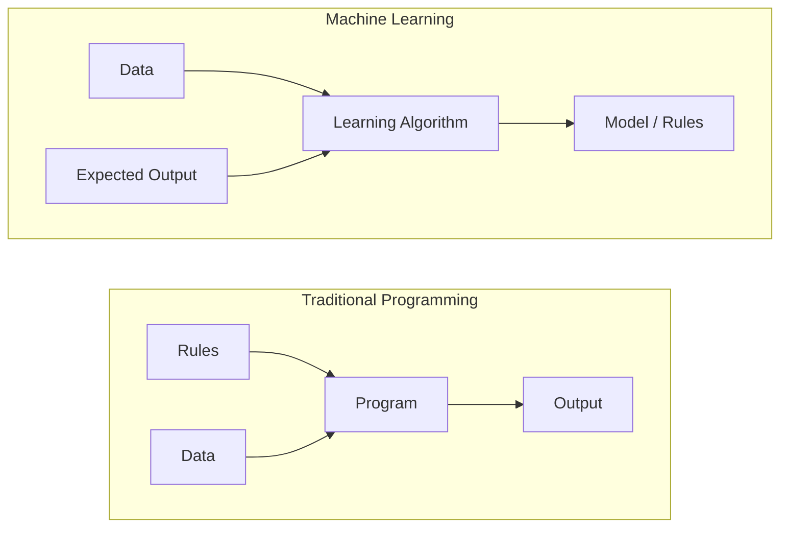
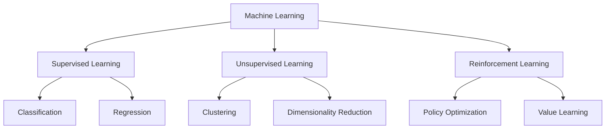
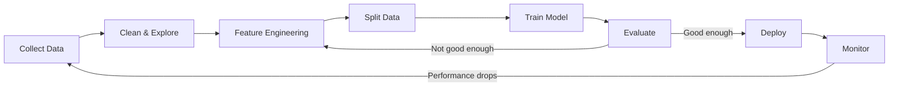
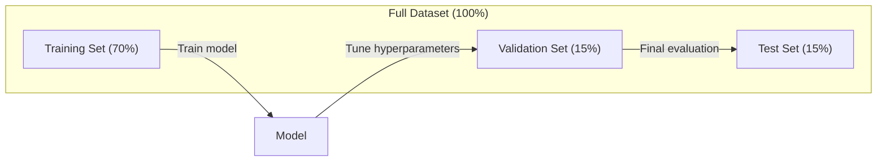
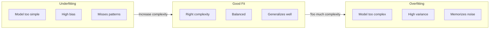
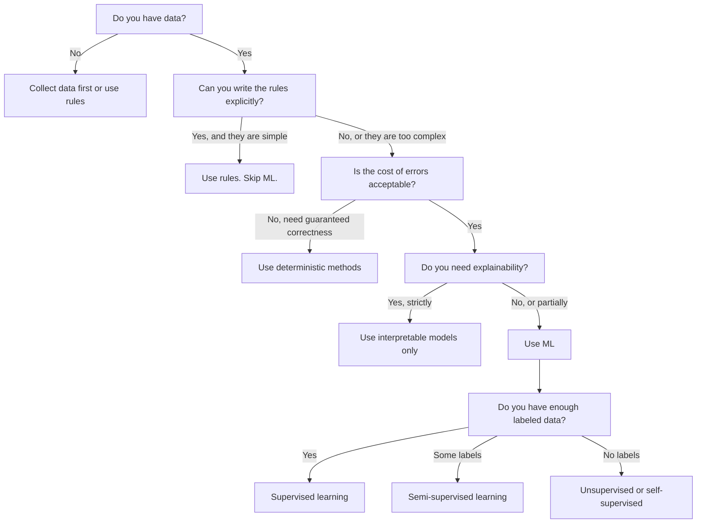

# What Is Machine Learning
# 什么是机器学习


> Machine learning is teaching computers to find patterns in data instead of writing rules by hand.

> 机器学习是教计算机从数据中发现规律，而不是靠人工编写规则。

**Type:** Learn | **类型：** 学习
**Languages:** Python
**Prerequisites:** Phase 1 (Math Foundations) | **前置知识：** Phase 1（数学基础）
**Time:** ~45 minutes | **时间：** 约 45 分钟

## Learning Objectives | 学习目标

- Explain the difference between supervised, unsupervised, and reinforcement learning and identify which type applies to a given problem
  解释监督学习、无监督学习和强化学习之间的区别，并判断给定问题适用于哪种类型
- Implement a nearest centroid classifier from scratch and evaluate it against a random baseline
  从零实现最近质心分类器，并与随机基线进行对比评估
- Distinguish between classification and regression tasks and select the appropriate loss function for each
  区分分类和回归任务，为每种任务选择合适的损失函数
- Evaluate whether a given business problem is suitable for ML or better solved with deterministic rules
  评估一个业务问题是否适合用 ML 解决，还是用确定性规则更好


> **【中文解读】**
> 机器学习是让计算机从数据中自动学习规律，而不是靠人工编写规则。监督学习（有标签）、无监督学习（无标签）、强化学习（奖惩信号）是三大范式。对应 sklearn 中的各类 estimator。

> **【拓展：机器学习范式的产业应用】**
> GPT-4 使用自监督学习（预测下一个 token）在约 13 万亿 token 上训练；BERT 使用掩码语言建模在 Wikipedia + BookCorpus 上预训练；AlphaGo 使用强化学习通过自我对弈超越人类围棋冠军。这三种范式在真实 AI 系统中常常组合使用——ChatGPT 先自监督预训练，再用 RLHF（人类反馈强化学习）对齐。

## The Problem | 问题引入

You want to build a spam filter. The traditional approach: sit down and write hundreds of rules. "If the email contains 'FREE MONEY', mark it spam. If it has more than 3 exclamation marks, mark it spam." You spend weeks writing rules. Then spammers change their wording. Your rules break. You write more rules. The cycle never ends.

> 你想构建一个垃圾邮件过滤器。传统方法是坐下来写数百条规则。"如果邮件包含 'FREE MONEY'，标记为垃圾邮件。如果超过 3 个感叹号，标记为垃圾邮件。" 你花了几周写规则。然后垃圾邮件发送者改变了措辞。你的规则失效了。你写更多规则。这个循环永无止境。

Machine learning flips this. Instead of writing rules, you give the computer thousands of labeled emails ("spam" or "not spam") and let it figure out the rules on its own. The computer finds patterns you never would have thought of. When spammers change tactics, you retrain on new data instead of rewriting code.

> 机器学习颠覆了这种方式。你不是编写规则，而是给计算机数千封标注好的邮件（"垃圾邮件"或"正常邮件"），让它自己找出规则。计算机能发现你从未想到过的模式。当垃圾邮件发送者改变策略时，你只需在新数据上重新训练，而不是重写代码。

This shift from "programming rules" to "learning from data" is the core of machine learning. Every recommendation engine, voice assistant, self-driving car, and language model works this way.

> 从"编程规则"到"从数据中学习"的转变是机器学习的核心。每一个推荐引擎、语音助手、自动驾驶汽车和语言模型都是这样工作的。

> **【中文解读】**
> 传统编程是"人写规则，机器执行"；机器学习是"人给数据，机器自己发现规则"。以垃圾邮件过滤器为例：传统方法需要手动维护数百条规则，而 ML 方法只需提供大量标注邮件，模型自动学习判别模式。当垃圾邮件策略变化时，只需重新训练而非重写代码。

> **【拓展：垃圾邮件过滤的演进】**
> Gmail 的垃圾邮件过滤器每天处理约 3 亿封邮件，准确率超过 99.9%。早期使用规则引擎（如 SpamAssassin），后来转向 ML（朴素贝叶斯 → 集成方法 → 深度学习）。现代系统结合 TF-IDF 特征、n-gram 模型和神经网络，在毫秒级完成分类。

## The Concept | 核心概念

### Learning From Data, Not Rules

Traditional programming and machine learning solve problems in opposite directions.

> 传统编程和机器学习以相反的方向解决问题。



Traditional programming: you write the rules. The program applies them to data to produce output.

> 传统编程：你编写规则。程序将规则应用于数据以产生输出。

Machine learning: you provide data and expected outputs. The algorithm discovers the rules.

> 机器学习：你提供数据和期望输出。算法自动发现规则。

The "model" that comes out of training IS the rules, encoded as numbers (weights, parameters). It generalizes from examples it has seen to make predictions on data it has never seen.

> 训练产出的"模型"就是规则本身，以数字（权重、参数）的形式编码。它能从已见过的样本中泛化，对从未见过的新数据做出预测。

> **【中文解读】**
> 传统编程 vs 机器学习的本质区别：传统编程输入"规则+数据"得到"输出"；机器学习输入"数据+期望输出"得到"模型（规则）"。模型本质上就是用数字编码的规则（权重和参数），它能对从未见过的新数据做出预测。这就是"泛化"——AI 系统最核心的能力。

### The Three Types of Machine Learning



**Supervised Learning**: You have input-output pairs. The model learns to map inputs to outputs.
- "Here are 10,000 photos labeled cat or dog. Learn to tell them apart."
- "Here are house features and prices. Learn to predict the price."

> **监督学习**：你有输入-输出对。模型学习将输入映射到输出。
> - "这里有 10,000 张标注了猫或狗的照片。学会区分它们。"
> - "这里有房屋特征和价格。学会预测价格。"

**Unsupervised Learning**: You have inputs only. No labels. The model finds structure on its own.
- "Here are 10,000 customer purchase histories. Find natural groupings."
- "Here are 1,000 dimensional data points. Reduce to 2 dimensions while keeping structure."

> **无监督学习**：你只有输入，没有标签。模型自己发现数据中的结构。
> - "这里有 10,000 个客户购买记录。找出自然的分组。"
> - "这里有 1,000 维的数据点。在保留结构的同时降到 2 维。"

**Reinforcement Learning**: An agent takes actions in an environment and receives rewards or penalties. It learns a strategy (policy) to maximize total reward.
- "Play this game. +1 for winning, -1 for losing. Figure out a strategy."
- "Control this robot arm. +1 for picking up the object, -0.01 for each second wasted."

> **强化学习**：智能体在环境中采取行动并获得奖励或惩罚。它学习一种策略（policy）来最大化总奖励。
> - "玩这个游戏。赢了 +1，输了 -1。自己找出策略。"
> - "控制这个机械臂。成功抓取物体 +1，每浪费一秒 -0.01。"

Most of what you will build in practice uses supervised learning. Unsupervised learning is common for preprocessing and exploration. Reinforcement learning powers game AI, robotics, and RLHF for language models.

> 在实践中你构建的大部分系统使用监督学习。无监督学习常用于预处理和探索。强化学习驱动游戏 AI、机器人和语言模型的 RLHF。

> **【拓展：三种范式在真实系统中的分工】**
> Netflix 推荐系统同时使用三种范式：协同过滤（无监督聚类用户群体）、监督学习（预测用户对电影的评分 1-5 星）、强化学习（A/B 测试选择最优推荐策略）。Tesla Autopilot 使用监督学习（目标检测）+ 强化学习（路径规划）。Stable Diffusion 的训练涉及自监督（图像-文本对比学习 CLIP）+ 监督微调。

### Beyond the Big Three

The three categories above are clean, but real-world ML often blurs the lines.

> 以上三个类别很清晰，但真实世界的 ML 往往模糊了这些界限。

**Semi-supervised learning** uses a small set of labeled data and a large set of unlabeled data. You might have 100 labeled medical images and 100,000 unlabeled ones. Techniques include:

> **半监督学习**使用少量标注数据和大量未标注数据。你可能有 100 张标注的医学影像和 100,000 张未标注的影像。技术包括：

- **Label propagation:** Build a graph connecting similar data points. Labels spread from labeled nodes to unlabeled neighbors through the graph.
  **标签传播：** 构建一个连接相似数据点的图。标签从标注节点通过图传播到未标注的邻居节点。
- **Pseudo-labeling:** Train a model on the labeled data, use it to predict labels for unlabeled data, then retrain on everything. The model bootstraps its own training set.
  **伪标签：** 在标注数据上训练模型，用它预测未标注数据的标签，然后在所有数据上重新训练。模型自举生成自己的训练集。
- **Consistency regularization:** The model should give the same prediction for an input and a slightly perturbed version of that input. This works even without labels.
  **一致性正则化：** 模型应该对输入及其轻微扰动版本给出相同的预测。即使没有标签也能工作。

**Self-supervised learning** creates supervision from the data itself. No human labels needed at all. The model creates its own prediction task from the structure of the data.

> **自监督学习**从数据本身创建监督信号。完全不需要人工标签。模型从数据的结构中创建自己的预测任务。

- **Masked language modeling (BERT):** Hide 15% of words in a sentence, train the model to predict the missing words. The "labels" come from the original text.
  **掩码语言建模（BERT）：** 遮盖句子中 15% 的词，训练模型预测被遮盖的词。"标签"来自原始文本。
- **Contrastive learning (SimCLR):** Take an image, create two augmented versions. Train the model to recognize they came from the same image while distinguishing them from augmented versions of other images.
  **对比学习（SimCLR）：** 取一张图像，创建两个增强版本。训练模型识别它们来自同一张图像，同时与其他图像的增强版本区分开。
- **Next-token prediction (GPT):** Predict the next word given all previous words. Every text document becomes a training example.
  **下一 token 预测（GPT）：** 给定前面所有词，预测下一个词。每个文本文档都成为训练样本。

> **【拓展：自监督学习如何驱动大模型革命】**
> GPT-4 的训练数据约 13 万亿 token，如果靠人工标注根本不可能。自监督学习让模型从数据自身结构中创建训练信号：BERT 遮盖 15% 的词让模型预测，GPT 预测下一个 token，SimCLR 通过数据增强学习视觉表征。这使得训练数据规模从百万级跃升到万亿级，是大模型成功的关键技术。

These are not separate categories from the big three. They are strategies that combine supervised and unsupervised ideas. Self-supervised learning is technically supervised (the model predicts something), but the labels are generated automatically, not by humans.

> 它们不是与三大类别分离的新类别。它们是结合监督和无监督思想的策略。自监督学习在技术上属于监督学习（模型预测某种东西），但标签是自动生成的，不是人工标注的。

### Classification vs Regression

These are the two main supervised learning tasks.

> 这是两个主要的监督学习任务。

| Aspect | Classification | Regression |
|--------|---------------|------------|
| Output | Discrete categories | Continuous numbers |
| Example | "Is this email spam?" | "What will the house price be?" |
| Output space | {cat, dog, bird} | Any real number |
| Loss function | Cross-entropy, accuracy | Mean squared error, MAE |
| Decision | Boundaries between classes | A curve that fits the data |

| 方面 | 分类 | 回归 |
|------|------|------|
| 输出 | 离散类别 | 连续数值 |
| 示例 | "这封邮件是垃圾邮件吗？" | "房价会是多少？" |
| 输出空间 | {猫, 狗, 鸟} | 任意实数 |
| 损失函数 | 交叉熵、准确率 | 均方误差、MAE |
| 决策方式 | 类别之间的边界 | 拟合数据的曲线 |

Classification answers "which category?" Regression answers "how much?"

> 分类回答"哪个类别？"回归回答"多少？"

Some problems can be framed either way. Predicting if a stock goes up or down is classification. Predicting the exact price is regression.

> 有些问题可以用两种方式建模。预测股票涨跌是分类问题。预测精确价格是回归问题。

> **【中文解读】**
> 分类和回归是监督学习的两大基本任务。分类预测离散类别（如"垃圾邮件/正常邮件"），回归预测连续数值（如"房价 250 万"）。关键区别在于输出空间：分类的输出是有限的类别集合，回归的输出是任意实数。选择哪种取决于业务需求——有时同一个问题可以用两种方式建模。

### The ML Workflow

Every machine learning project follows the same pipeline, regardless of the algorithm.

> 每个机器学习项目都遵循相同的流程，无论使用什么算法。



**Collect Data**: Gather raw data. More data is almost always better, but quality matters more than quantity.

> **收集数据**：获取原始数据。更多数据几乎总是更好的，但质量比数量更重要。

**Clean & Explore**: Handle missing values, remove duplicates, visualize distributions, spot anomalies. This step often takes 60-80% of total project time.

> **清洗与探索**：处理缺失值、去除重复项、可视化分布、发现异常。这一步通常占项目总时间的 60-80%。

**Feature Engineering**: Transform raw data into features the model can use. Turn dates into day-of-week. Normalize numerical columns. Encode categorical variables. Good features matter more than fancy algorithms.

> **特征工程**：将原始数据转换为模型可用的特征。将日期转为星期几。标准化数值列。编码分类变量。好的特征比花哨的算法更重要。

**Split Data**: Divide into training, validation, and test sets. The model trains on training data, you tune hyperparameters on validation data, and you report final performance on test data.

> **划分数据**：分为训练集、验证集和测试集。模型在训练数据上学习，你在验证数据上调节超参数，在测试数据上报告最终性能。

**Train Model**: Feed training data into an algorithm. The algorithm adjusts internal parameters to minimize a loss function.

> **训练模型**：将训练数据输入算法。算法调整内部参数以最小化损失函数。

**Evaluate**: Measure performance on validation/test data. If performance is not acceptable, go back and try different features, algorithms, or hyperparameters.

> **评估**：在验证/测试数据上测量性能。如果性能不可接受，回头尝试不同的特征、算法或超参数。

**Deploy**: Put the model into production where it makes predictions on new data.

> **部署**：将模型投入生产环境，对新数据进行预测。

**Monitor**: Track performance over time. Data distributions change (data drift), and models degrade. When performance drops, retrain.

> **监控**：随时间追踪性能。数据分布会变化（数据漂移），模型会退化。当性能下降时，重新训练。

### Training, Validation, and Test Splits

This is the most important concept beginners get wrong. You must evaluate your model on data it has never seen during training. Otherwise you are measuring memorization, not learning.

> 这是初学者最容易犯错的最重要的概念。你必须在训练期间从未见过的数据上评估模型。否则你测量的是记忆能力，而不是学习能力。



| Split | Purpose | When used | Typical size |
|-------|---------|-----------|-------------|
| Training | Model learns from this data | During training | 60-80% |
| Validation | Tune hyperparameters, compare models | After each training run | 10-20% |
| Test | Final unbiased performance estimate | Once, at the very end | 10-20% |

| 划分 | 用途 | 使用时机 | 典型比例 |
|------|------|---------|---------|
| 训练集 | 模型从中学习 | 训练期间 | 60-80% |
| 验证集 | 调节超参数，比较模型 | 每次训练后 | 10-20% |
| 测试集 | 最终无偏性能估计 | 最后仅使用一次 | 10-20% |

The test set is sacred. You look at it exactly once. If you keep adjusting your model based on test performance, you are effectively training on the test set and your reported numbers are meaningless.

> 测试集是神圣的。你只能查看它一次。如果你不断根据测试性能调整模型，你实际上是在测试集上训练，你报告的数字毫无意义。

> **【中文解读】**
> 数据划分是 ML 中最容易犯的错误之一。训练集用于学习参数，验证集用于调节超参数和选择模型，测试集只用于最终评估。如果反复在测试集上调优，就等于"偷看答案"，模型性能评估完全失效。对于小数据集，使用 k 折交叉验证可以更可靠地评估性能。

For small datasets, use k-fold cross-validation: split data into k parts, train on k-1 parts, validate on the remaining part, rotate, and average results.

> 对于小数据集，使用 k 折交叉验证：将数据分成 k 份，在 k-1 份上训练，在剩余一份上验证，轮换并取平均。

### Overfitting vs Underfitting



**Underfitting**: The model is too simple to capture the patterns in the data. A straight line trying to fit a curved relationship. Training error is high. Test error is high.

> **欠拟合**：模型太简单，无法捕捉数据中的模式。就像用直线拟合弯曲的关系。训练误差高。测试误差高。

**Overfitting**: The model is too complex and memorizes the training data, including its noise. A wiggly curve that passes through every training point but fails on new data. Training error is low. Test error is high.

> **过拟合**：模型太复杂，记住了训练数据中的噪声。一条穿过每个训练点的波动曲线，但在新数据上表现很差。训练误差低。测试误差高。

**Good fit**: The model captures real patterns without memorizing noise. Training error and test error are both reasonably low.

> **良好拟合**：模型捕捉了真实模式而没有记住噪声。训练误差和测试误差都相当低。

> **【中文解读】**
> 欠拟合 = 模型太简单，连训练数据中的规律都没学到；过拟合 = 模型太复杂，把训练数据中的噪声都记住了，遇到新数据就"露馅"。好的模型在训练集和测试集上都表现良好。判断标准：如果训练准确率远高于验证准确率，就是过拟合的典型信号。

Signs of overfitting:
- Training accuracy is much higher than validation accuracy
  训练准确率远高于验证准确率
- The model performs well on training data but poorly on new data
  模型在训练数据上表现好但在新数据上表现差
- Adding more training data improves performance (the model was memorizing, not learning)
  增加训练数据能提升性能（说明模型之前是在记忆而非学习）

> 过拟合的迹象：

Fixes for overfitting:
- Get more training data
  获取更多训练数据
- Reduce model complexity (fewer parameters, simpler architecture)
  降低模型复杂度（更少参数、更简单的架构）
- Regularization (add a penalty for large weights)
  正则化（对大权重添加惩罚）
- Dropout (randomly zero out neurons during training)
  Dropout（训练时随机将神经元置零）
- Early stopping (stop training when validation error starts increasing)
  早停（当验证误差开始上升时停止训练）

> 过拟合的修复方法：

Fixes for underfitting:
- Use a more complex model
  使用更复杂的模型
- Add more features
  添加更多特征
- Reduce regularization
  减少正则化
- Train longer
  训练更长时间

> 欠拟合的修复方法：

### The Bias-Variance Tradeoff

This is the mathematical framework behind overfitting and underfitting.

> 这是过拟合和欠拟合背后的数学框架。

**Bias**: Error from wrong assumptions in the model. A linear model has high bias when the true relationship is nonlinear. High bias leads to underfitting.

> **偏差**：来自模型错误假设的误差。当真实关系是非线性的，线性模型具有高偏差。高偏差导致欠拟合。

**Variance**: Error from sensitivity to small fluctuations in the training data. A model with high variance gives very different predictions when trained on different subsets of data. High variance leads to overfitting.

> **方差**：来自对训练数据微小波动敏感的误差。高方差的模型在不同数据子集上训练时会给出非常不同的预测。高方差导致过拟合。

| Model complexity | Bias | Variance | Result |
|-----------------|------|----------|--------|
| Too low (linear model for curved data) | High | Low | Underfitting |
| Just right | Medium | Medium | Good generalization |
| Too high (degree-20 polynomial for 10 points) | Low | High | Overfitting |

| 模型复杂度 | 偏差 | 方差 | 结果 |
|-----------|------|------|------|
| 太低（用线性模型拟合弯曲数据） | 高 | 低 | 欠拟合 |
| 恰好 | 中 | 中 | 良好泛化 |
| 太高（10 个点用 20 次多项式） | 低 | 高 | 过拟合 |

Total error = Bias^2 + Variance + Irreducible noise

> 总误差 = 偏差^2 + 方差 + 不可约噪声

You cannot reduce irreducible noise (it is randomness in the data itself). You want to find the sweet spot where bias^2 + variance is minimized.

> 你无法减少不可约噪声（它是数据本身的随机性）。你想找到偏差^2 + 方差最小化的最佳点。

### No Free Lunch Theorem

There is no single algorithm that works best for every problem. An algorithm that performs well on one class of problems will perform poorly on another. This is why data scientists try multiple algorithms and compare results.

> 没有单一算法能在所有问题上表现最好。在一类问题上表现良好的算法在另一类问题上会表现很差。这就是数据科学家尝试多种算法并比较结果的原因。

> **【拓展：没有免费午餐定理的实践意义】**
> 这个定理告诉我们： Kaggle 竞赛冠军几乎从不只用一种算法，而是用集成方法（XGBoost + LightGBM + 神经网络）融合多个模型。在实际项目中，通常先用多种算法做基线对比（逻辑回归、随机森林、SVM、XGBoost），再选最优的深入调优。AutoML 工具（如 Google Vertex AI、H2O.ai）正是自动化了这个"试多种算法"的过程。

In practice, the choice depends on:
- How much data you have
  你有多少数据
- How many features there are
  有多少特征
- Whether the relationship is linear or nonlinear
  关系是线性还是非线性
- Whether you need interpretability
  是否需要可解释性
- How much compute you can afford
  你能承担多少计算成本

> 在实践中，选择取决于：

### When NOT to Use Machine Learning

ML is powerful but not always the right tool. Before reaching for a model, ask whether you actually need one.

> ML 很强大，但并不总是正确的工具。在使用模型之前，先问问自己是否真的需要它。

**Do not use ML when:**

> **以下情况不要使用 ML：**

- **Rules are simple and well-defined.** Tax calculation, sorting algorithms, unit conversions. If you can write the logic in a few if-statements, a model adds complexity for no benefit.
  **规则简单且明确。** 税费计算、排序算法、单位转换。如果你能用几个 if 语句写完逻辑，模型只会增加复杂度而没有任何好处。
- **You have no data or very little data.** ML needs examples to learn from. With 10 data points, you cannot train anything meaningful. Collect data first.
  **没有数据或数据极少。** ML 需要从样本中学习。只有 10 个数据点，你无法训练出任何有意义的东西。先收集数据。
- **The cost of being wrong is catastrophic and you need guaranteed correctness.** Medical dosage calculation, nuclear reactor control, cryptographic verification. ML models are probabilistic. They will sometimes be wrong. If "sometimes wrong" is unacceptable, use deterministic methods.
  **错误的代价是灾难性的且需要保证正确性。** 医疗剂量计算、核反应堆控制、密码学验证。ML 模型是概率性的，它们有时会出错。如果"有时出错"不可接受，使用确定性方法。
- **A lookup table or heuristic solves the problem.** If a simple threshold or table covers 99% of cases, adding ML increases maintenance cost without meaningful improvement.
  **查找表或启发式规则就能解决问题。** 如果简单的阈值或表格能覆盖 99% 的情况，加 ML 只会增加维护成本而没有实质性改进。
- **You cannot explain the decision and explainability is required.** Regulated industries (lending, insurance, criminal justice) sometimes require that every decision be fully explainable. Some ML models are interpretable (linear regression, small decision trees). Most are not.
  **无法解释决策但需要可解释性。** 受监管行业（贷款、保险、刑事司法）有时要求每个决策都可完全解释。一些 ML 模型是可解释的（线性回归、小型决策树），大多数不是。
- **The problem changes faster than you can retrain.** If the rules change daily and retraining takes a week, the model is always stale.
  **问题变化的速度快于重训练速度。** 如果规则每天变化而重训练需要一周，模型总是过时的。

Use this decision flowchart:

> 使用以下决策流程图：



## Build It | 动手实现

The code in `code/ml_intro.py` implements a nearest centroid classifier from scratch, the simplest possible ML algorithm. It demonstrates the core idea: learn from data, then predict on new data.

> `code/ml_intro.py` 中的代码从零实现了最近质心分类器，这是最简单的 ML 算法。它演示了核心理念：从数据中学习，然后对新数据进行预测。

> **【中文解读】**
> 最近质心分类器是最简单的 ML 算法：训练时计算每个类别的中心点（均值），预测时将新样本分配给最近的中心。虽然简单，但它完整展示了 ML 的核心流程：fit（从数据学习）→ predict（对新数据预测）→ evaluate（与基线对比）。这个三步模式在从逻辑回归到 Transformer 的所有算法中都是一样的。

### Step 1: Nearest Centroid Classifier from Scratch

The nearest centroid classifier computes the center (mean) of each class in the training data. To predict, it assigns each new point to the class whose center is closest.

> 最近质心分类器计算训练数据中每个类别的中心（均值）。预测时，它将每个新点分配给中心最近的类别。

```python
class NearestCentroid:
    def fit(self, X, y):
        self.classes = np.unique(y)  # 获取所有唯一类别标签
        self.centroids = np.array([
            X[y == c].mean(axis=0) for c in self.classes  # 计算每个类别的质心（均值向量）
        ])

    def predict(self, X):
        distances = np.array([
            np.sqrt(((X - c) ** 2).sum(axis=1))  # 计算每个样本到各质心的欧氏距离
            for c in self.centroids
        ])
        return self.classes[distances.argmin(axis=0)]  # 返回距离最近的质心对应的类别
```

That is the entire algorithm. Fit computes two means. Predict computes distances. No gradient descent, no iteration, no hyperparameters.

> 这就是整个算法。Fit 计算两个均值。Predict 计算距离。没有梯度下降，没有迭代，没有超参数。

### Step 2: Train on Synthetic Data

We generate a 2D classification dataset with two classes that overlap slightly. The centroid classifier draws a linear decision boundary between the class centers.

> 我们生成一个两个类别略有重叠的 2D 分类数据集。质心分类器在类中心之间画出线性决策边界。

```python
rng = np.random.RandomState(42)  # 设置随机种子以保证可复现
X_class0 = rng.randn(100, 2) + np.array([1.0, 1.0])  # 类别 0 的数据：中心在 (1,1) 附近
X_class1 = rng.randn(100, 2) + np.array([-1.0, -1.0])  # 类别 1 的数据：中心在 (-1,-1) 附近
X = np.vstack([X_class0, X_class1])  # 合并所有特征数据
y = np.array([0] * 100 + [1] * 100)  # 创建对应的标签数组
```

### Step 3: Compare Against a Baseline

Every ML model should be compared against a trivial baseline. Here, the baseline predicts a random class. If your ML model does not beat random guessing, something is wrong.

> 每个 ML 模型都应该与一个简单基线进行对比。这里的基线预测随机类别。如果你的 ML 模型连随机猜测都打不过，说明有问题。

```python
baseline_preds = rng.choice([0, 1], size=len(y_test))  # 随机猜测作为基线
baseline_acc = np.mean(baseline_preds == y_test)  # 计算基线准确率
```

The centroid classifier should get around 90%+ accuracy on this clean dataset. Random baseline gets around 50%.

> 质心分类器在这个干净的数据集上应该能达到约 90%+ 的准确率。随机基线大约 50%。

### Why This Matters

The nearest centroid classifier is trivially simple. It has no hyperparameters, no iteration, no gradient descent. Yet it captures the fundamental ML pattern:

> 最近质心分类器极其简单。它没有超参数，没有迭代，没有梯度下降。但它捕捉了 ML 的基本模式：

1. **Learn** a representation from training data (the centroids)
   **学习**训练数据的表示（质心）
2. **Predict** on new data using that representation (nearest distance)
   使用该表示对新数据**预测**（最近距离）
3. **Evaluate** against a baseline (random guessing)
   与基线（随机猜测）进行**评估**

Every ML algorithm, from logistic regression to transformers, follows this same three-step pattern. The representation gets more complex, but the workflow stays the same.

> 从逻辑回归到 Transformer，每个 ML 算法都遵循相同的三步模式。只是表示变得更复杂了，但工作流程保持不变。

### Step 4: What the Centroid Classifier Cannot Do

The nearest centroid classifier assumes each class forms a single blob. It draws linear decision boundaries. It fails when:

> 最近质心分类器假设每个类别形成一个单一的团块。它画出线性决策边界。在以下情况下会失败：

- Classes have multiple clusters (e.g., the digit "1" can be written in several different ways)
  类别有多个簇（例如，数字"1"可以有多种写法）
- The decision boundary is nonlinear (e.g., one class wraps around another)
  决策边界是非线性的（例如，一个类别环绕另一个类别）
- Features have very different scales (distance is dominated by the largest-scale feature)
  特征量级差异很大（距离被最大量级的特征主导）

These limitations motivate every other algorithm you will learn. K-nearest neighbors handles multiple clusters. Decision trees handle nonlinear boundaries. Feature scaling fixes the scale problem. Each lesson builds on the limitations of the previous one.

> 这些局限性推动了你将学习的每一个其他算法。K 近邻处理多个簇。决策树处理非线性边界。特征缩放解决量级问题。每一课都建立在前一课的局限性之上。

## Use It | 用框架实现

sklearn provides `NearestCentroid` and synthetic data generators:

> sklearn 提供了 `NearestCentroid` 和合成数据生成器：

```python
from sklearn.neighbors import NearestCentroid
from sklearn.datasets import make_classification
from sklearn.model_selection import train_test_split

# 生成 500 个样本、2 个特征的合成分类数据集
X, y = make_classification(
    n_samples=500, n_features=2, n_redundant=0,
    n_clusters_per_class=1, random_state=42
)
# 按 70/30 比例划分训练集和测试集
X_train, X_test, y_train, y_test = train_test_split(X, y, test_size=0.3)

# 创建最近质心分类器并训练
clf = NearestCentroid()
clf.fit(X_train, y_train)
# 在测试集上评估准确率
print(f"Accuracy: {clf.score(X_test, y_test):.3f}")
```

## Ship It | 产出物

This lesson produces `outputs/prompt-ml-problem-framer.md` -- a prompt that turns vague business problems into concrete ML tasks. Give it a problem description ("we want to reduce churn" or "predict demand for next quarter") and it identifies the learning type, defines the prediction target, lists candidate features, picks a success metric, establishes a baseline, and flags pitfalls like data leakage or class imbalance. Use it at the start of any ML project to avoid building the wrong thing.

> 本课产出 `outputs/prompt-ml-problem-framer.md`——一个将模糊的业务问题转化为具体 ML 任务的提示词。给它一个问题描述（"我们想减少客户流失"或"预测下季度需求"），它会识别学习类型、定义预测目标、列出候选特征、选择成功指标、建立基线，并标记数据泄漏或类别不平衡等陷阱。在任何 ML 项目开始时使用它，避免构建错误的东西。

## Key Terms | 术语速查表

| Term | What people say | What it actually means |
|------|----------------|----------------------|
| Model | "The AI" | A mathematical function with learnable parameters that maps inputs to outputs |
| Training | "Teaching the AI" | Running an optimization algorithm to adjust model parameters so predictions match known outputs |
| Feature | "An input column" | A measurable property of the data that the model uses to make predictions |
| Label | "The answer" | The known output for a training example, used to compute the error signal |
| Hyperparameter | "A setting you tweak" | A parameter set before training that controls the learning process (learning rate, number of layers) |
| Loss function | "How wrong the model is" | A function that measures the gap between predicted and actual outputs, which training tries to minimize |
| Overfitting | "It memorized the test" | The model learned training-specific noise instead of general patterns, so it fails on new data |
| Underfitting | "It didn't learn anything" | The model is too simple to capture the real patterns in the data |
| Generalization | "It works on new data" | The model's ability to make accurate predictions on data it was not trained on |
| Cross-validation | "Testing on different chunks" | Repeatedly splitting data into train/test folds and averaging results, giving a more robust performance estimate |
| Regularization | "Keeping weights small" | Adding a penalty term to the loss function that discourages overly complex models |
| Data drift | "The world changed" | The statistical distribution of incoming data shifts over time, debegrading model performance |

| 术语 | 俗称 | 实际含义 |
|------|------|---------|
| Model / 模型 | "AI" | 一个具有可学习参数的数学函数，将输入映射到输出 |
| Training / 训练 | "教 AI" | 运行优化算法调整模型参数，使预测匹配已知输出 |
| Feature / 特征 | "输入列" | 数据中模型用于做预测的可测量属性 |
| Label / 标签 | "答案" | 训练样本的已知输出，用于计算误差信号 |
| Hyperparameter / 超参数 | "你调的设置" | 训练前设置的参数，控制学习过程（学习率、层数） |
| Loss function / 损失函数 | "模型有多错" | 衡量预测与实际输出差距的函数，训练试图最小化它 |
| Overfitting / 过拟合 | "它记住了测试集" | 模型学习了训练数据的噪声而非通用模式，在新数据上失效 |
| Underfitting / 欠拟合 | "它什么都没学到" | 模型太简单，无法捕捉数据中的真实模式 |
| Generalization / 泛化 | "在新数据上有效" | 模型对未训练数据做出准确预测的能力 |
| Cross-validation / 交叉验证 | "在不同块上测试" | 反复将数据划分为训练/测试折并平均结果，给出更稳健的性能估计 |
| Regularization / 正则化 | "保持权重小" | 在损失函数中添加惩罚项，阻止过于复杂的模型 |
| Data drift / 数据漂移 | "世界变了" | 输入数据的统计分布随时间变化，导致模型性能下降 |

## Exercises | 练习题

1. Take any dataset (e.g., Iris, Titanic). Split it 70/15/15 into train/validation/test. Explain why you should not tune hyperparameters on the test set.
   1. 取任意数据集（如 Iris、Titanic）。按 70/15/15 划分为训练/验证/测试集。解释为什么不应在测试集上调节超参数。
2. List three real-world problems. For each one, identify whether it is classification, regression, or clustering, and whether it is supervised or unsupervised.
   2. 列出三个现实世界的问题。对每个问题，判断它是分类、回归还是聚类，以及是监督学习还是无监督学习。
3. A model gets 99% accuracy on training data but 60% on test data. Diagnose the problem and list three things you would try to fix it.
   3. 一个模型在训练数据上得到 99% 准确率，但在测试数据上只有 60%。诊断问题并列出三种修复方法。

## Further Reading | 延伸阅读

- [An Introduction to Statistical Learning](https://www.statlearning.com/) - free textbook covering all classical ML methods with practical examples
  [An Introduction to Statistical Learning](https://www.statlearning.com/) - 免费教材，用实际例子涵盖所有经典 ML 方法
- [Google's Machine Learning Crash Course](https://developers.google.com/machine-learning/crash-course) - concise visual introduction to ML concepts
  [Google's Machine Learning Crash Course](https://developers.google.com/machine-learning/crash-course) - 简明的 ML 概念可视化介绍
- [Scikit-learn User Guide](https://scikit-learn.org/stable/user_guide.html) - the practical reference for implementing ML in Python
  [Scikit-learn User Guide](https://scikit-learn.org/stable/user_guide.html) - Python 实现 ML 的实用参考
