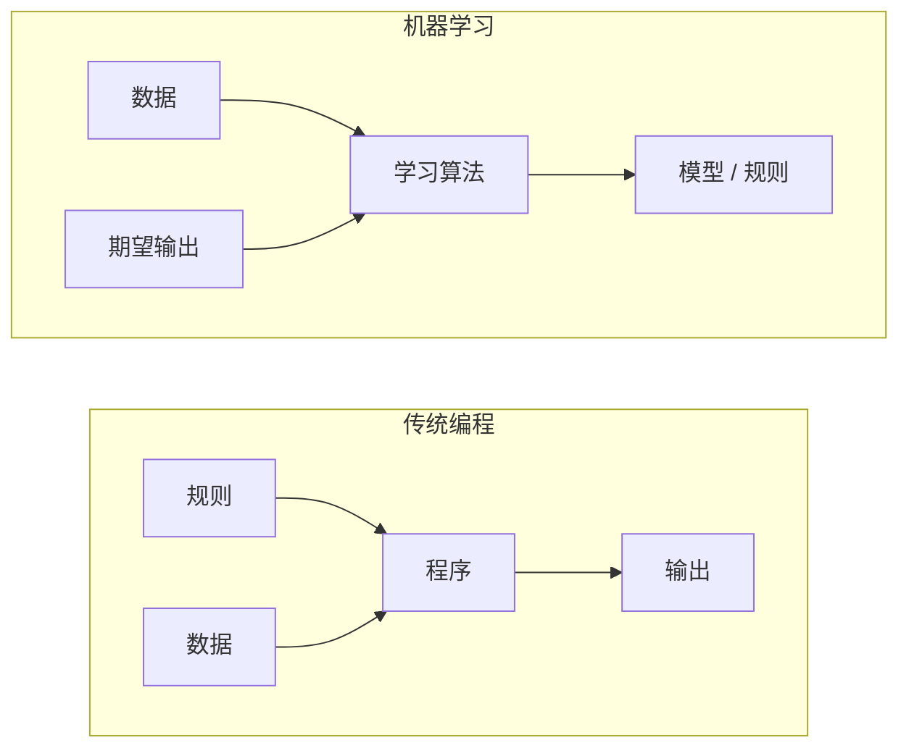
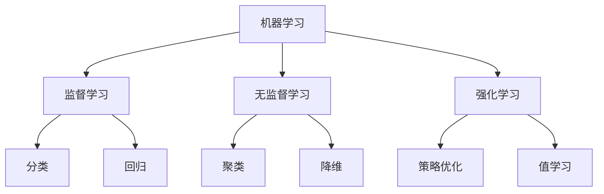
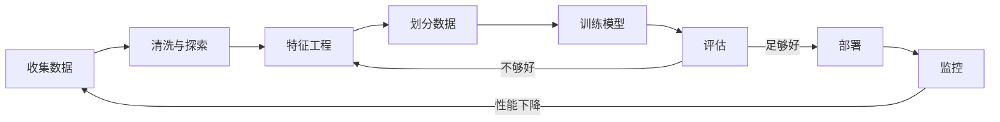
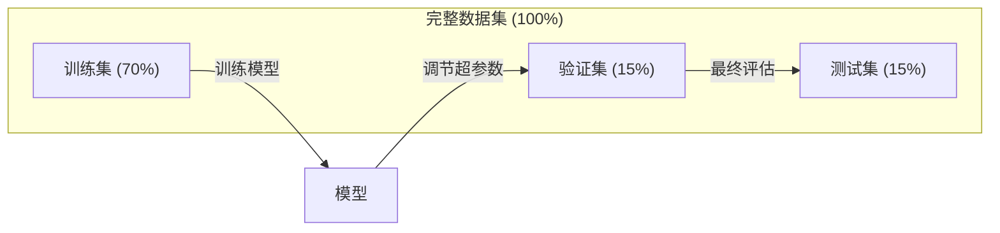
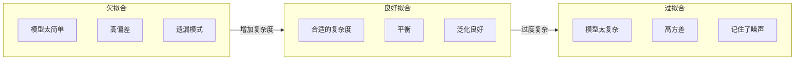
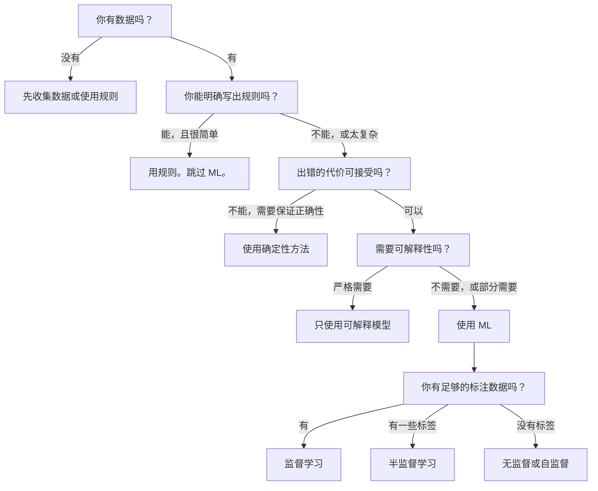

# 什么是机器学习

> 机器学习是教计算机从数据中发现规律，而不是靠人工编写规则。

**类型：** 学习
**语言：** Python
**前置知识：** Phase 1（数学基础）
**用时：** 约 45 分钟

## 学习目标

- 解释监督学习、无监督学习和强化学习之间的区别，并判断给定问题适用于哪种类型
- 从零实现最近质心分类器，并与随机基线进行对比评估
- 区分分类和回归任务，为每种任务选择合适的损失函数
- 评估一个业务问题是否适合用 ML 解决，还是用确定性规则更好


> **【中文解读】**
> 机器学习是让计算机从数据中自动学习规律，而不是靠人工编写规则。监督学习（有标签）、无监督学习（无标签）、强化学习（奖惩信号）是三大范式。对应 sklearn 中的各类 estimator。

> **【拓展：机器学习范式的产业应用】**
> GPT-4 使用自监督学习（预测下一个 token）在约 13 万亿 token 上训练；BERT 使用掩码语言建模在 Wikipedia + BookCorpus 上预训练；AlphaGo 使用强化学习通过自我对弈超越人类围棋冠军。这三种范式在真实 AI 系统中常常组合使用——ChatGPT 先自监督预训练，再用 RLHF（人类反馈强化学习）对齐。

## 问题引入

你想做一个垃圾邮件过滤器。传统方法：坐下来写几百条规则。"如果邮件包含 'FREE MONEY'，标记为垃圾邮件。如果有超过 3 个感叹号，标记为垃圾邮件。"你花了几周写规则。然后垃圾邮件发送者改变了措辞，你的规则失效了。你写更多规则。这个循环永远不会结束。

机器学习反转了这个过程。你不再是写规则，而是给计算机数千封已标注的邮件（"垃圾邮件"或"正常邮件"），让它自己找出规则。计算机能发现你从未想到过的模式。当垃圾邮件发送者改变策略时，你只需用新数据重新训练，而不是重写代码。

从"编写规则"到"从数据中学习"的转变，就是机器学习的核心。每个推荐引擎、语音助手、自动驾驶汽车和语言模型都是这样工作的。

> **【中文解读】**
> 传统编程是"人写规则，机器执行"；机器学习是"人给数据，机器自己发现规则"。以垃圾邮件过滤器为例：传统方法需要手动维护数百条规则，而 ML 方法只需提供大量标注邮件，模型自动学习判别模式。当垃圾邮件策略变化时，只需重新训练而非重写代码。

> **【拓展：垃圾邮件过滤的演进】**
> Gmail 的垃圾邮件过滤器每天处理约 3 亿封邮件，准确率超过 99.9%。早期使用规则引擎（如 SpamAssassin），后来转向 ML（朴素贝叶斯 → 集成方法 → 深度学习）。现代系统结合 TF-IDF 特征、n-gram 模型和神经网络，在毫秒级完成分类。

## 核心概念

### 从数据中学习，而非从规则中学习

传统编程和机器学习以相反的方向解决问题。



传统编程：你编写规则。程序将规则应用于数据以产生输出。

机器学习：你提供数据和期望输出。算法发现规则。

训练产生的"模型"本质上就是规则，以数字（权重、参数）的形式编码。它从见过的样本中泛化，对从未见过的新数据做出预测。

> **【中文解读】**
> 传统编程 vs 机器学习的本质区别：传统编程输入"规则+数据"得到"输出"；机器学习输入"数据+期望输出"得到"模型（规则）"。模型本质上就是用数字编码的规则（权重和参数），它能对从未见过的新数据做出预测。这就是"泛化"——AI 系统最核心的能力。

### 机器学习的三种类型



**监督学习 (Supervised Learning)**：你有输入-输出对。模型学习将输入映射到输出。
- "这里有 10,000 张标注为猫或狗的照片。学会区分它们。"
- "这里有房屋特征和价格。学会预测价格。"

**无监督学习 (Unsupervised Learning)**：你只有输入，没有标签。模型自己发现结构。
- "这里有 10,000 个客户购买记录。找出自然分组。"
- "这里有 1000 维的数据点。在保持结构的前提下降到 2 维。"

**强化学习 (Reinforcement Learning)**：智能体在环境中采取行动并获得奖励或惩罚。它学习一种策略来最大化总奖励。
- "玩这个游戏。赢 +1，输 -1。找出策略。"
- "控制这个机械臂。拿起物体 +1，每浪费一秒 -0.01。"

你在实践中构建的大部分东西使用监督学习。无监督学习常用于预处理和探索。强化学习驱动游戏 AI、机器人和语言模型的 RLHF。

> **【拓展：三种范式在真实系统中的分工】**
> Netflix 推荐系统同时使用三种范式：协同过滤（无监督聚类用户群体）、监督学习（预测用户对电影的评分 1-5 星）、强化学习（A/B 测试选择最优推荐策略）。Tesla Autopilot 使用监督学习（目标检测）+ 强化学习（路径规划）。Stable Diffusion 的训练涉及自监督（图像-文本对比学习 CLIP）+ 监督微调。

### 三大类型之外

上面三个类别是清晰的，但现实世界中的 ML 经常模糊界限。

**半监督学习 (Semi-supervised Learning)** 使用少量标注数据和大量未标注数据。你可能有 100 张标注的医学图像和 100,000 张未标注的。技术包括：

- **标签传播 (Label Propagation)**：构建一个连接相似数据点的图。标签从标注节点通过图传播到未标注的邻居节点。
- **伪标签 (Pseudo-labeling)**：在标注数据上训练模型，用它预测未标注数据的标签，然后在所有数据上重新训练。模型自举自己的训练集。
- **一致性正则化 (Consistency Regularization)**：模型应该对输入和输入的轻微扰动版本给出相同的预测。即使没有标签也能工作。

**自监督学习 (Self-supervised Learning)** 从数据本身创建监督信号，完全不需要人类标签。模型从数据结构中创建自己的预测任务。

- **掩码语言建模 (Masked Language Modeling, BERT)**：隐藏句子中 15% 的词，训练模型预测被遮盖的词。"标签"来自原始文本。
- **对比学习 (Contrastive Learning, SimCLR)**：取一张图像，创建两个增强版本。训练模型识别它们来自同一张图像，同时与其他图像的增强版本区分开来。
- **下一词预测 (Next-token Prediction, GPT)**：给定所有前面的词预测下一个词。每个文本文档都成为一个训练样本。

> **【拓展：自监督学习如何驱动大模型革命】**
> GPT-4 的训练数据约 13 万亿 token，如果靠人工标注根本不可能。自监督学习让模型从数据自身结构中创建训练信号：BERT 遮盖 15% 的词让模型预测，GPT 预测下一个 token，SimCLR 通过数据增强学习视觉表征。这使得训练数据规模从百万级跃升到万亿级，是大模型成功的关键技术。

这些并非与三大类型独立的类别，而是结合了监督和无监督思想的策略。自监督学习在技术上是有监督的（模型预测某物），但标签是自动生成的，不是人类标注的。

### 分类与回归

这是两种主要的监督学习任务。

| 方面 | 分类 (Classification) | 回归 (Regression) |
|------|---------------------|-------------------|
| 输出 | 离散类别 | 连续数值 |
| 示例 | "这封邮件是垃圾邮件吗？" | "房价会是多少？" |
| 输出空间 | {猫, 狗, 鸟} | 任意实数 |
| 损失函数 | 交叉熵、准确率 | 均方误差 (MSE)、MAE |
| 决策方式 | 类别之间的边界 | 拟合数据的曲线 |

分类回答"哪个类别？"，回归回答"多少？"

有些问题可以用两种方式建模。预测股票涨跌是分类，预测具体价格是回归。

> **【中文解读】**
> 分类和回归是监督学习的两大基本任务。分类预测离散类别（如"垃圾邮件/正常邮件"），回归预测连续数值（如"房价 250 万"）。关键区别在于输出空间：分类的输出是有限的类别集合，回归的输出是任意实数。选择哪种取决于业务需求——有时同一个问题可以用两种方式建模。

### ML 工作流

每个机器学习项目都遵循相同的流水线，无论使用什么算法。



**收集数据**：收集原始数据。数据越多几乎总是越好，但质量比数量更重要。

**清洗与探索**：处理缺失值，去除重复，可视化分布，发现异常。这一步通常占项目总时间的 60-80%。

**特征工程**：将原始数据转化为模型可用的特征。将日期转换为星期几。标准化数值列。编码分类变量。好的特征比花哨的算法更重要。

**划分数据**：分为训练集、验证集和测试集。模型在训练数据上学习，你在验证数据上调节超参数，在测试数据上报告最终性能。

**训练模型**：将训练数据输入算法。算法调整内部参数以最小化损失函数。

**评估**：在验证/测试数据上测量性能。如果性能不达标，回去尝试不同的特征、算法或超参数。

**部署**：将模型放入生产环境，对新数据进行预测。

**监控**：随时间跟踪性能。数据分布会变化（数据漂移），模型会退化。当性能下降时重新训练。

### 训练集、验证集和测试集的划分

这是初学者最容易犯的错误。你必须在模型训练期间从未见过的数据上评估模型。否则你测量的是记忆能力，而不是学习能力。



| 划分 | 用途 | 使用时机 | 典型大小 |
|------|------|----------|----------|
| 训练集 | 模型从这些数据学习 | 训练期间 | 60-80% |
| 验证集 | 调节超参数，比较模型 | 每次训练后 | 10-20% |
| 测试集 | 最终无偏性能估计 | 最末尾，只一次 | 10-20% |

测试集是神圣的。你只看一次。如果你不断根据测试性能调整模型，你实际上是在测试集上训练，你报告的数据毫无意义。

> **【中文解读】**
> 数据划分是 ML 中最容易犯的错误之一。训练集用于学习参数，验证集用于调节超参数和选择模型，测试集只用于最终评估。如果反复在测试集上调优，就等于"偷看答案"，模型性能评估完全失效。对于小数据集，使用 k 折交叉验证可以更可靠地评估性能。

对于小数据集，使用 k 折交叉验证 (K-Fold Cross-Validation)：将数据分成 k 份，在 k-1 份上训练，在剩余 1 份上验证，轮换并取平均。

### 过拟合与欠拟合



**欠拟合 (Underfitting)**：模型太简单，无法捕捉数据中的模式。用直线拟合曲线关系。训练误差高。测试误差高。

**过拟合 (Overfitting)**：模型太复杂，记住了训练数据包括噪声。一条摆动的曲线穿过每个训练点但在新数据上失败。训练误差低。测试误差高。

**良好拟合**：模型捕捉真实模式而不记忆噪声。训练误差和测试误差都合理地低。

> **【中文解读】**
> 欠拟合 = 模型太简单，连训练数据中的规律都没学到；过拟合 = 模型太复杂，把训练数据中的噪声都记住了，遇到新数据就"露馅"。好的模型在训练集和测试集上都表现良好。判断标准：如果训练准确率远高于验证准确率，就是过拟合的典型信号。

过拟合的信号：
- 训练准确率远高于验证准确率
- 模型在训练数据上表现好但在新数据上表现差
- 增加更多训练数据可以改善性能（模型在记忆而非学习）

过拟合的修复方法：
- 获取更多训练数据
- 降低模型复杂度（更少的参数，更简单的架构）
- 正则化（对大权重加惩罚）
- Dropout（训练时随机将神经元置零）
- 早停（当验证误差开始增加时停止训练）

欠拟合的修复方法：
- 使用更复杂的模型
- 增加更多特征
- 减少正则化
- 训练更长时间

### 偏差-方差权衡

这是过拟合和欠拟合背后的数学框架。

**偏差 (Bias)**：来自模型中错误假设的误差。当真实关系是非线性的时，线性模型具有高偏差。高偏差导致欠拟合。

**方差 (Variance)**：来自对训练数据微小波动敏感的误差。高方差的模型在不同数据子集上训练时给出非常不同的预测。高方差导致过拟合。

| 模型复杂度 | 偏差 | 方差 | 结果 |
|-----------|------|------|------|
| 太低（曲线数据用线性模型） | 高 | 低 | 欠拟合 |
| 刚好合适 | 中等 | 中等 | 良好泛化 |
| 太高（10 个点用 20 次多项式） | 低 | 高 | 过拟合 |

总误差 = 偏差² + 方差 + 不可约噪声

你无法减少不可约噪声（它是数据本身的随机性）。你需要找到偏差² + 方差最小的最佳平衡点。

### 没有免费午餐定理

没有单一算法对所有问题都最好。在一类问题上表现好的算法在另一类问题上会表现差。这就是为什么数据科学家尝试多种算法并比较结果。

> **【拓展：没有免费午餐定理的实践意义】**
> 这个定理告诉我们：Kaggle 竞赛冠军几乎从不只用一种算法，而是用集成方法（XGBoost + LightGBM + 神经网络）融合多个模型。在实际项目中，通常先用多种算法做基线对比（逻辑回归、随机森林、SVM、XGBoost），再选最优的深入调优。AutoML 工具（如 Google Vertex AI、H2O.ai）正是自动化了这个"试多种算法"的过程。

在实践中，选择取决于：
- 你有多少数据
- 有多少特征
- 关系是线性还是非线性
- 是否需要可解释性
- 你能负担多少计算资源

### 什么时候不应该用机器学习

ML 很强大，但并非总是正确的工具。在使用模型之前，先问你是否真的需要它。

**以下情况不要用 ML：**

- **规则简单且明确。** 税费计算、排序算法、单位转换。如果你能用几条 if 语句写出来，模型只会增加复杂性而不会带来好处。
- **你没有数据或数据很少。** ML 需要样本来学习。10 个数据点无法训练任何有意义的东西。先收集数据。
- **出错的代价是灾难性的且需要保证正确性。** 医疗剂量计算、核反应堆控制、密码学验证。ML 模型是概率性的。它们有时会出错。如果"有时出错"不可接受，使用确定性方法。
- **查找表或启发式规则就能解决。** 如果简单的阈值或表格覆盖 99% 的情况，加 ML 只增加维护成本而没有实质性改进。
- **你无法解释决策但需要可解释性。** 受监管行业（信贷、保险、刑事司法）有时要求每个决策都能完全解释。有些 ML 模型是可解释的（线性回归、小决策树），大多数不是。
- **问题变化快于你重新训练的速度。** 如果规则每天都在变而重新训练需要一周，模型永远是过时的。

使用这个决策流程图：



## 动手实现

`code/ml_intro.py` 中的代码从零实现了最近质心分类器——最简单的 ML 算法。它展示了核心理念：从数据中学习，然后对新数据预测。

> **【中文解读】**
> 最近质心分类器是最简单的 ML 算法：训练时计算每个类别的中心点（均值），预测时将新样本分配给最近的中心。虽然简单，但它完整展示了 ML 的核心流程：fit（从数据学习）→ predict（对新数据预测）→ evaluate（与基线对比）。这个三步模式在从逻辑回归到 Transformer 的所有算法中都是一样的。

### 第 1 步：从零实现最近质心分类器

最近质心分类器计算训练数据中每个类别的中心（均值）。预测时，它将每个新点分配给距离最近的类别中心。

```python
class NearestCentroid:
    def fit(self, X, y):
        self.classes = np.unique(y)  # 获取所有唯一类别标签
        self.centroids = np.array([
            X[y == c].mean(axis=0) for c in self.classes  # 计算每个类别的质心（均值向量）
        ])

    def predict(self, X):
        distances = np.array([
            np.sqrt(((X - c) ** 2).sum(axis=1))  # 计算每个样本到各质心的欧氏距离
            for c in self.centroids
        ])
        return self.classes[distances.argmin(axis=0)]  # 返回距离最近的质心对应的类别
```

这就是整个算法。fit 计算两个均值。predict 计算距离。没有梯度下降，没有迭代，没有超参数。

### 第 2 步：在合成数据上训练

我们生成一个 2D 分类数据集，两个类别略有重叠。质心分类器在类别中心之间画出线性决策边界。

```python
rng = np.random.RandomState(42)  # 设置随机种子以保证可复现
X_class0 = rng.randn(100, 2) + np.array([1.0, 1.0])  # 类别 0 的数据：中心在 (1,1) 附近
X_class1 = rng.randn(100, 2) + np.array([-1.0, -1.0])  # 类别 1 的数据：中心在 (-1,-1) 附近
X = np.vstack([X_class0, X_class1])  # 合并所有特征数据
y = np.array([0] * 100 + [1] * 100)  # 创建对应的标签数组
```

### 第 3 步：与基线对比

每个 ML 模型都应该与一个简单的基线对比。这里基线随机预测类别。如果你的 ML 模型打不过随机猜测，那就有问题。

```python
baseline_preds = rng.choice([0, 1], size=len(y_test))  # 随机猜测作为基线
baseline_acc = np.mean(baseline_preds == y_test)  # 计算基线准确率
```

质心分类器在这个干净的数据集上应该能达到 90%+ 的准确率。随机基线大约 50%。

### 为什么这很重要

最近质心分类器极其简单。它没有超参数，没有迭代，没有梯度下降。但它捕捉了 ML 的基本模式：

1. **学习**——从训练数据中学到一个表示（质心）
2. **预测**——使用该表示对新数据进行预测（最近距离）
3. **评估**——与基线对比（随机猜测）

每个 ML 算法，从逻辑回归到 Transformer，都遵循相同的三步模式。只是表示变得更复杂，但工作流不变。

### 第 4 步：质心分类器做不到什么

最近质心分类器假设每个类别形成单一的簇。它画出线性决策边界。以下情况它会失败：

- 类别有多个簇（例如数字"1"可以用多种不同方式书写）
- 决策边界是非线性的（例如一个类别围绕另一个类别）
- 特征的尺度差异很大（距离被最大尺度的特征主导）

这些局限性驱动着你将学到的每个其他算法。K 近邻处理多个簇。决策树处理非线性边界。特征缩放修复尺度问题。每节课都建立在前一节课的局限性之上。

## 用框架实现

sklearn 提供了 `NearestCentroid` 和合成数据生成器：

```python
from sklearn.neighbors import NearestCentroid
from sklearn.datasets import make_classification
from sklearn.model_selection import train_test_split

# 生成 500 个样本、2 个特征的合成分类数据集
X, y = make_classification(
    n_samples=500, n_features=2, n_redundant=0,
    n_clusters_per_class=1, random_state=42
)
# 按 70/30 比例划分训练集和测试集
X_train, X_test, y_train, y_test = train_test_split(X, y, test_size=0.3)

# 创建最近质心分类器并训练
clf = NearestCentroid()
clf.fit(X_train, y_train)
# 在测试集上评估准确率
print(f"Accuracy: {clf.score(X_test, y_test):.3f}")
```

## 产出物

本课程产出 `outputs/prompt-ml-problem-framer.md`——一个将模糊的业务问题转化为具体 ML 任务的 prompt。给它一个问题描述（"我们想减少流失"或"预测下季度需求"），它会识别学习类型、定义预测目标、列出候选特征、选择成功指标、建立基线，并标记数据泄漏或类别不平衡等陷阱。在任何 ML 项目开始时使用它来避免构建错误的东西。

## 术语速查表

| 术语 | 通俗说法 | 实际含义 |
|------|---------|---------|
| 模型 (Model) | "那个 AI" | 一个带有可学习参数的数学函数，将输入映射到输出 |
| 训练 (Training) | "教那个 AI" | 运行优化算法调整模型参数，使预测匹配已知输出 |
| 特征 (Feature) | "一个输入列" | 数据的一个可测量属性，模型用它来做预测 |
| 标签 (Label) | "答案" | 训练样本的已知输出，用于计算误差信号 |
| 超参数 (Hyperparameter) | "你调节的设置" | 训练前设定的控制学习过程的参数（学习率、层数） |
| 损失函数 (Loss Function) | "模型有多错" | 衡量预测与实际输出差距的函数，训练试图最小化它 |
| 过拟合 (Overfitting) | "它记住了测试集" | 模型学习了训练特有的噪声而非通用模式，在新数据上失败 |
| 欠拟合 (Underfitting) | "它什么都没学到" | 模型太简单，无法捕捉数据中的真实模式 |
| 泛化 (Generalization) | "在新数据上有效" | 模型对未训练数据做出准确预测的能力 |
| 交叉验证 (Cross-Validation) | "在不同数据块上测试" | 反复将数据分成训练/测试折并取平均结果，给出更稳健的性能估计 |
| 正则化 (Regularization) | "保持权重较小" | 在损失函数中添加惩罚项，阻止模型过于复杂 |
| 数据漂移 (Data Drift) | "世界变了" | 输入数据的统计分布随时间变化，导致模型性能退化 |

## 练习题

1. 取任意数据集（如 Iris、Titanic）。按 70/15/15 划分为训练/验证/测试集。解释为什么不应在测试集上调节超参数。
2. 列出三个现实世界的问题。对每个问题，判断它是分类、回归还是聚类，以及是监督学习还是无监督学习。
3. 一个模型在训练数据上得到 99% 准确率，但在测试数据上只有 60%。诊断问题并列出三种修复方法。

## 延伸阅读

- [An Introduction to Statistical Learning](https://www.statlearning.com/) - 免费教材，用实际例子涵盖所有经典 ML 方法
- [Google's Machine Learning Crash Course](https://developers.google.com/machine-learning/crash-course) - 简明的 ML 概念可视化介绍
- [Scikit-learn User Guide](https://scikit-learn.org/stable/user_guide.html) - Python 实现 ML 的实用参考
