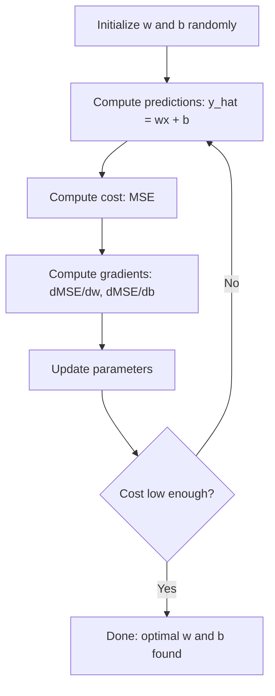

# Linear Regression
# 线性回归


> Linear regression draws the best straight line through your data. It is the "hello world" of machine learning.

> 线性回归穿过你的数据画出最佳直线。它是机器学习的"Hello World"。

**Type:** Build | **类型：** 构建
**Languages:** Python
**Prerequisites:** Phase 1 (Linear Algebra, Calculus, Optimization), Phase 2 Lesson 1 | **前置知识：** Phase 1（线性代数、微积分、优化），Phase 2 第 1 课
**Time:** ~90 minutes | **时间：** 约 90 分钟

## Learning Objectives | 学习目标

- Derive the gradient descent update rules for mean squared error and implement linear regression from scratch
  推导均方误差的梯度下降更新规则并从零实现线性回归
- Compare gradient descent and the normal equation in terms of computational complexity and when to use each
  比较梯度下降和正规方程的计算复杂度，判断何时使用各自
- Build a multiple linear regression model with feature standardization and interpret the learned weights
  构建带特征标准化的多元线性回归模型并解释学习到的权重
- Explain how Ridge regression (L2 regularization) prevents overfitting by penalizing large weights
  解释 Ridge 回归（L2 正则化）如何通过惩罚大权重来防止过拟合


> **【中文解读】**
> 线性回归是最简单的预测模型——用一条直线（或超平面）拟合数据。它也是最简单的神经网络：一个没有隐藏层、没有激活函数的网络。sklearn 中的 LinearRegression/Ridge/Lasso。金融中的因子模型就是线性回归。

> **【拓展：线性回归在真实 AI 系统中的角色】**
> 虽然"深度学习"更受关注，但线性回归仍然是工业界最常用的模型之一。Google 在 A/B 测试分析中大量使用线性回归估计因果效应；Uber 用线性回归做需求预测基线；金融领域的 Fama-French 三因子模型本质就是多元线性回归。在 Kaggle 竞赛中，线性回归常作为 baseline，快速验证特征工程的效果。

## The Problem | 问题引入

You have data: house sizes and their sale prices. You want to predict the price of a new house given its size. You could eyeball it on a scatter plot, but you need a formula. You need a line that best fits the data so you can plug in any size and get a price prediction.

> 你有数据：房屋面积和对应的售价。你想根据新房子的面积预测价格。你可以在散点图上目测，但你需要一个公式。你需要一条最佳拟合线，这样代入任意面积就能得到价格预测。

Linear regression gives you that line. More importantly, it introduces the entire ML training loop: define a model, define a cost function, optimize the parameters. Every ML algorithm follows this same pattern. Master it here with the simplest case, and you will recognize it everywhere.

> 线性回归为你提供了那条线。更重要的是，它引入了整个 ML 训练循环：定义模型、定义代价函数、优化参数。每个 ML 算法都遵循相同的模式。在这个最简单的案例中掌握它，你就能在任何地方认出它。

This is not just for simple problems. Linear regression is used in production systems for demand forecasting, A/B test analysis, financial modeling, and as a baseline for every regression task.

> 这不仅仅是用于简单问题。线性回归在生产系统中用于需求预测、A/B 测试分析、金融建模，以及作为每个回归任务的基线。

> **【中文解读】**
> 线性回归不仅是入门知识，更是整个机器学习训练循环的缩影：定义模型 → 定义损失函数 → 优化参数。掌握这个最简单的案例，你就能理解从逻辑回归到神经网络的全部算法——它们只是模型更复杂、损失函数不同，但训练流程完全一样。

## The Concept | 核心概念

### The Model

Linear regression assumes a linear relationship between input (x) and output (y):

> 线性回归假设输入 (x) 和输出 (y) 之间存在线性关系：

```
y = wx + b
```

- `w` (weight/slope): how much y changes when x increases by 1
  `w`（权重/斜率）：x 增加 1 时 y 变化多少
- `b` (bias/intercept): the value of y when x = 0
  `b`（偏置/截距）：当 x = 0 时 y 的值

For multiple inputs (features), this extends to:

> 对于多个输入（特征），扩展为：

```
y = w1*x1 + w2*x2 + ... + wn*xn + b
```

Or in vector form: `y = w^T * x + b`

> 或用向量形式表示：`y = w^T * x + b`

The goal: find the values of w and b that make the predicted y as close as possible to the actual y across all training examples.

> 目标：找到 w 和 b 的值，使所有训练样本中预测的 y 尽可能接近实际的 y。

> **【中文解读】**
> 线性回归的模型非常直观：`y = wx + b`，w 是斜率（权重），b 是截距（偏置）。多元情况下变成 `y = w1*x1 + w2*x2 + ... + wn*xn + b`，即用超平面拟合数据。训练的目标就是找到最优的 w 和 b，使预测值与真实值的差距最小。

### The Cost Function (Mean Squared Error)

How do you measure "as close as possible"? You need a single number that captures how wrong your predictions are. The most common choice is Mean Squared Error (MSE):

> 你如何衡量"尽可能接近"？你需要一个能捕捉预测错误程度的单一数值。最常用的选择是均方误差（MSE）：

```
MSE = (1/n) * sum((y_predicted - y_actual)^2)
```

Why squared? Two reasons. First, it penalizes large errors more than small errors (an error of 10 is 100x worse than an error of 1, not 10x). Second, the squared function is smooth and differentiable everywhere, which makes optimization straightforward.

> 为什么用平方？两个原因。首先，它对大误差的惩罚比对小误差更重（误差为 10 比误差为 1 差 100 倍，而不是 10 倍）。其次，平方函数处处平滑可微，这使得优化变得直接。

The cost function creates a surface. For a single weight w and bias b, the MSE surface looks like a bowl (a convex paraboloid). The bottom of the bowl is where MSE is minimized. Training means finding that bottom.

> 代价函数创建了一个曲面。对于单个权重 w 和偏置 b，MSE 曲面看起来像一个碗（凸抛物面）。碗的底部是 MSE 最小的地方。训练就是找到那个底部。

### Gradient Descent

Gradient descent finds the bottom of the bowl by taking steps downhill.

> 梯度下降通过向下走步来找到碗的底部。



The gradients tell you two things: which direction to move each parameter, and how much to move.

> 梯度告诉你两件事：每个参数应该朝哪个方向移动，以及移动多少。

For MSE with y_hat = wx + b:

> 对于 MSE 且 y_hat = wx + b：

```
dMSE/dw = (2/n) * sum((y_hat - y) * x)
dMSE/db = (2/n) * sum(y_hat - y)
```

The update rule:

> 更新规则：

```
w = w - learning_rate * dMSE/dw
b = b - learning_rate * dMSE/db
```

The learning rate controls step size. Too large: you overshoot the minimum and diverge. Too small: training takes forever. Typical starting values: 0.01, 0.001, or 0.0001.

> 学习率控制步长。太大：你会跳过最小值并发散。太小：训练需要很长时间。典型的初始值：0.01、0.001 或 0.0001。

> **【中文解读】**
> 梯度下降是机器学习最核心的优化算法。它的直觉很简单：站在山坡上，朝最陡的下坡方向走一步，重复直到到达谷底。梯度（导数）告诉你方向和陡峭程度，学习率控制步子大小。学习率太大→跳过最低点发散；太小→收敛太慢。这个原理在神经网络训练中完全相同。

> **【拓展：梯度下降在现代 AI 中的演进】**
> GPT-4 的训练使用 AdamW 优化器（Adam + 权重衰减），它是梯度下降的高级变体。学习率从 0 开始预热到峰值，然后余弦退火下降。训练 Batch Size 约 6000 万 token，使用约 25000 块 A100 GPU 并行。虽然优化器更复杂，但核心思想仍是"沿梯度方向走一步"。

### The Normal Equation (Closed-Form Solution)

For linear regression specifically, there is a direct formula that gives the optimal weights without any iteration:

> 专门针对线性回归，有一个直接公式无需迭代就能给出最优权重：

```
w = (X^T * X)^(-1) * X^T * y
```

This inverts a matrix to solve for w in one step. It works perfectly for small datasets. For large datasets (millions of rows or thousands of features), gradient descent is preferred because matrix inversion is O(n^3) in the number of features.

> 这通过矩阵求逆一步求解 w。它对小数据集非常有效。对于大数据集（百万行或数千特征），梯度下降更优，因为矩阵求逆在特征数上是 O(n^3) 的。

> **【拓展：正规方程 vs 梯度下降的选择】**
> 正规方程的时间复杂度是 O(n^3)（n 是特征数），当特征超过数万时计算极慢。深度学习模型有数十亿参数，只能用梯度下降。sklearn 的 LinearRegression 默认使用正规方程（对于小数据集更快），而 SGDRegressor 使用随机梯度下降。在实践中，数据量 < 10万条、特征 < 1000 时用正规方程；否则用梯度下降。

### Multiple Linear Regression

With multiple features, the model becomes:

> 有多个特征时，模型变为：

```
y = w1*x1 + w2*x2 + ... + wn*xn + b
```

Everything works the same: MSE is the cost function, gradient descent updates all weights simultaneously. The only difference is that you are fitting a hyperplane instead of a line.

> 一切原理相同：MSE 是代价函数，梯度下降同时更新所有权重。唯一的区别是你在拟合一个超平面而不是一条直线。

Feature scaling matters here. If one feature ranges from 0 to 1 and another ranges from 0 to 1,000,000, gradient descent will struggle because the cost surface becomes elongated. Standardize features (subtract mean, divide by standard deviation) before training.

> 特征缩放在这里很重要。如果一个特征的范围是 0 到 1，另一个是 0 到 1,000,000，梯度下降会变得困难，因为代价曲面会被拉长。训练前应标准化特征（减均值，除标准差）。

> **【中文解读】**
> 多元线性回归中，特征缩放至关重要。如果特征量级差异很大（如面积 500-3000 vs 卧室数 1-5），梯度下降的损失函数曲面会被严重拉长，导致收敛缓慢甚至无法收敛。解决方法：标准化（减均值除标准差）或归一化（缩放到 0-1），这在几乎所有 ML 算法中都是必要的预处理步骤。

### Polynomial Regression

What if the relationship is not linear? You can still use linear regression by creating polynomial features:

> 如果关系不是线性的怎么办？你可以通过创建多项式特征来继续使用线性回归：

```
y = w1*x + w2*x^2 + w3*x^3 + b
```

This is still "linear" regression because the model is linear in the weights (w1, w2, w3). You are just using nonlinear features of x.

> 这仍然是"线性"回归，因为模型在权重 (w1, w2, w3) 上是线性的。你只是使用了 x 的非线性特征。

Higher-degree polynomials can fit more complex curves but risk overfitting. A degree-10 polynomial will pass through every point in a 10-point dataset but predict poorly on new data.

> 高次多项式可以拟合更复杂的曲线但有过拟合风险。一个 10 次多项式会穿过 10 个数据集中的每个点，但在新数据上预测很差。

### R-Squared Score

MSE tells you how wrong you are, but the number depends on the scale of y. R-squared (R^2) gives a scale-independent measure:

> MSE 告诉你错了多少，但这个数字取决于 y 的量级。R-squared (R^2) 给出了一个与量级无关的度量：

```
R^2 = 1 - (sum of squared residuals) / (sum of squared deviations from mean)
    = 1 - SS_res / SS_tot
```

- R^2 = 1.0: perfect predictions
  R^2 = 1.0：完美预测
- R^2 = 0.0: the model is no better than predicting the mean every time
  R^2 = 0.0：模型不比每次预测均值好
- R^2 < 0.0: the model is worse than predicting the mean
  R^2 < 0.0：模型比预测均值还差

### Regularization Preview (Ridge Regression)

When you have many features, the model can overfit by assigning large weights. Ridge regression (L2 regularization) adds a penalty:

> 当你有很多特征时，模型可能通过赋予大权重来过拟合。Ridge 回归（L2 正则化）添加了惩罚项：

```
Cost = MSE + lambda * sum(w_i^2)
```

The penalty term discourages large weights. The hyperparameter lambda controls the tradeoff: higher lambda means smaller weights and more regularization. This is covered in depth in a later lesson. For now, know that it exists and why it helps.

> 惩罚项阻止权重过大。超参数 lambda 控制权衡：lambda 越大意味着权重越小、正则化越强。这将在后续课程中深入讨论。现在只需了解它的存在和作用。

> **【中文解读】**
> Ridge 回归（L2 正则化）通过在损失函数中添加权重平方和的惩罚项来防止过拟合。直觉：限制权重的大小，迫使模型"保守"地使用特征，而不是靠某个特征的极端权重来拟合噪声。正则化强度由 lambda 控制——lambda 越大，权重越小，模型越简单。这是深度学习中最常用的技术之一（权重衰减 weight decay）。

## Build It | 动手实现

### Step 1: Generate sample data

```python
import random
import math

random.seed(42)  # 设置随机种子以确保结果可复现

TRUE_W = 3.0  # 真实斜率（权重）
TRUE_B = 7.0  # 真实截距（偏置）
N_SAMPLES = 100  # 样本数量

X = [random.uniform(0, 10) for _ in range(N_SAMPLES)]  # 生成 0-10 之间的随机特征值
y = [TRUE_W * x + TRUE_B + random.gauss(0, 2.0) for x in X]  # 真实关系 + 高斯噪声

print(f"Generated {N_SAMPLES} samples")
print(f"True relationship: y = {TRUE_W}x + {TRUE_B} (+ noise)")
print(f"First 5 points: {[(round(X[i], 2), round(y[i], 2)) for i in range(5)]}")
```

### Step 2: Linear regression from scratch with gradient descent

```python
class LinearRegression:
    def __init__(self, learning_rate=0.01):
        self.w = 0.0  # 权重初始化为 0
        self.b = 0.0  # 偏置初始化为 0
        self.lr = learning_rate  # 学习率控制梯度下降步长
        self.cost_history = []  # 记录每轮的损失值

    def predict(self, X):
        return [self.w * x + self.b for x in X]  # y_hat = wx + b

    def compute_cost(self, X, y):
        predictions = self.predict(X)
        n = len(y)
        # 计算 MSE：均方误差
        cost = sum((pred - actual) ** 2 for pred, actual in zip(predictions, y)) / n
        return cost

    def compute_gradients(self, X, y):
        predictions = self.predict(X)
        n = len(y)
        # 对 w 的偏导数
        dw = (2 / n) * sum((pred - actual) * x for pred, actual, x in zip(predictions, y, X))
        # 对 b 的偏导数
        db = (2 / n) * sum(pred - actual for pred, actual in zip(predictions, y))
        return dw, db

    def fit(self, X, y, epochs=1000, print_every=200):
        for epoch in range(epochs):
            dw, db = self.compute_gradients(X, y)  # 计算梯度
            self.w -= self.lr * dw  # 沿梯度反方向更新权重
            self.b -= self.lr * db  # 沿梯度反方向更新偏置
            cost = self.compute_cost(X, y)
            self.cost_history.append(cost)
            if epoch % print_every == 0:
                print(f"  Epoch {epoch:4d} | Cost: {cost:.4f} | w: {self.w:.4f} | b: {self.b:.4f}")
        return self

    def r_squared(self, X, y):
        predictions = self.predict(X)
        y_mean = sum(y) / len(y)
        ss_res = sum((actual - pred) ** 2 for actual, pred in zip(y, predictions))  # 残差平方和
        ss_tot = sum((actual - y_mean) ** 2 for actual in y)  # 总变差
        return 1 - (ss_res / ss_tot)  # R² = 1 - SS_res/SS_tot


print("=== Training Linear Regression (Gradient Descent) ===")
model = LinearRegression(learning_rate=0.005)
model.fit(X, y, epochs=1000, print_every=200)
print(f"\nLearned: y = {model.w:.4f}x + {model.b:.4f}")
print(f"True:    y = {TRUE_W}x + {TRUE_B}")
print(f"R-squared: {model.r_squared(X, y):.4f}")
```

### Step 3: Normal equation (closed-form solution)

```python
class LinearRegressionNormal:
    def __init__(self):
        self.w = 0.0  # 斜率
        self.b = 0.0  # 截距

    def fit(self, X, y):
        n = len(X)
        x_mean = sum(X) / n  # 计算 x 的均值
        y_mean = sum(y) / n  # 计算 y 的均值
        # 协方差 / 方差 = 最优斜率
        numerator = sum((X[i] - x_mean) * (y[i] - y_mean) for i in range(n))
        denominator = sum((X[i] - x_mean) ** 2 for i in range(n))
        self.w = numerator / denominator
        # 截距 = y 均值 - 斜率 * x 均值
        self.b = y_mean - self.w * x_mean
        return self

    def predict(self, X):
        return [self.w * x + self.b for x in X]

    def r_squared(self, X, y):
        predictions = self.predict(X)
        y_mean = sum(y) / len(y)
        ss_res = sum((actual - pred) ** 2 for actual, pred in zip(y, predictions))
        ss_tot = sum((actual - y_mean) ** 2 for actual in y)
        return 1 - (ss_res / ss_tot)


print("\n=== Normal Equation (Closed-Form) ===")
model_normal = LinearRegressionNormal()
model_normal.fit(X, y)
print(f"Learned: y = {model_normal.w:.4f}x + {model_normal.b:.4f}")
print(f"R-squared: {model_normal.r_squared(X, y):.4f}")
```

### Step 4: Multiple linear regression

```python
class MultipleLinearRegression:
    def __init__(self, n_features, learning_rate=0.01):
        self.weights = [0.0] * n_features
        self.bias = 0.0
        self.lr = learning_rate
        self.cost_history = []

    def predict_single(self, x):
        return sum(w * xi for w, xi in zip(self.weights, x)) + self.bias

    def predict(self, X):
        return [self.predict_single(x) for x in X]

    def compute_cost(self, X, y):
        predictions = self.predict(X)
        n = len(y)
        return sum((pred - actual) ** 2 for pred, actual in zip(predictions, y)) / n

    def fit(self, X, y, epochs=1000, print_every=200):
        n = len(y)
        n_features = len(X[0])
        for epoch in range(epochs):
            predictions = self.predict(X)
            errors = [pred - actual for pred, actual in zip(predictions, y)]
            for j in range(n_features):
                grad = (2 / n) * sum(errors[i] * X[i][j] for i in range(n))
                self.weights[j] -= self.lr * grad
            grad_b = (2 / n) * sum(errors)
            self.bias -= self.lr * grad_b
            cost = self.compute_cost(X, y)
            self.cost_history.append(cost)
            if epoch % print_every == 0:
                print(f"  Epoch {epoch:4d} | Cost: {cost:.4f}")
        return self

    def r_squared(self, X, y):
        predictions = self.predict(X)
        y_mean = sum(y) / len(y)
        ss_res = sum((actual - pred) ** 2 for actual, pred in zip(y, predictions))
        ss_tot = sum((actual - y_mean) ** 2 for actual in y)
        return 1 - (ss_res / ss_tot)


random.seed(42)
N = 100
X_multi = []
y_multi = []
for _ in range(N):
    size = random.uniform(500, 3000)
    bedrooms = random.randint(1, 5)
    age = random.uniform(0, 50)
    price = 50 * size + 10000 * bedrooms - 1000 * age + 50000 + random.gauss(0, 20000)
    X_multi.append([size, bedrooms, age])
    y_multi.append(price)


def standardize(X):
    n_features = len(X[0])
    means = [sum(X[i][j] for i in range(len(X))) / len(X) for j in range(n_features)]
    stds = []
    for j in range(n_features):
        variance = sum((X[i][j] - means[j]) ** 2 for i in range(len(X))) / len(X)
        stds.append(variance ** 0.5)
    X_scaled = []
    for i in range(len(X)):
        row = [(X[i][j] - means[j]) / stds[j] if stds[j] > 0 else 0 for j in range(n_features)]
        X_scaled.append(row)
    return X_scaled, means, stds


y_mean_val = sum(y_multi) / len(y_multi)
y_std_val = (sum((yi - y_mean_val) ** 2 for yi in y_multi) / len(y_multi)) ** 0.5
y_scaled = [(yi - y_mean_val) / y_std_val for yi in y_multi]

X_scaled, x_means, x_stds = standardize(X_multi)

print("\n=== Multiple Linear Regression (3 features) ===")
print("Features: house size, bedrooms, age")
multi_model = MultipleLinearRegression(n_features=3, learning_rate=0.01)
multi_model.fit(X_scaled, y_scaled, epochs=1000, print_every=200)

print(f"\nWeights (standardized): {[round(w, 4) for w in multi_model.weights]}")
print(f"Bias (standardized): {multi_model.bias:.4f}")
print(f"R-squared: {multi_model.r_squared(X_scaled, y_scaled):.4f}")
```

### Step 5: Polynomial regression

```python
class PolynomialRegression:
    def __init__(self, degree, learning_rate=0.01):
        self.degree = degree
        self.weights = [0.0] * degree
        self.bias = 0.0
        self.lr = learning_rate

    def make_features(self, X):
        return [[x ** (d + 1) for d in range(self.degree)] for x in X]

    def predict(self, X):
        features = self.make_features(X)
        return [sum(w * f for w, f in zip(self.weights, row)) + self.bias for row in features]

    def fit(self, X, y, epochs=1000, print_every=200):
        features = self.make_features(X)
        n = len(y)
        for epoch in range(epochs):
            predictions = [sum(w * f for w, f in zip(self.weights, row)) + self.bias for row in features]
            errors = [pred - actual for pred, actual in zip(predictions, y)]
            for j in range(self.degree):
                grad = (2 / n) * sum(errors[i] * features[i][j] for i in range(n))
                self.weights[j] -= self.lr * grad
            grad_b = (2 / n) * sum(errors)
            self.bias -= self.lr * grad_b
            if epoch % print_every == 0:
                cost = sum(e ** 2 for e in errors) / n
                print(f"  Epoch {epoch:4d} | Cost: {cost:.6f}")
        return self

    def r_squared(self, X, y):
        predictions = self.predict(X)
        y_mean = sum(y) / len(y)
        ss_res = sum((actual - pred) ** 2 for actual, pred in zip(y, predictions))
        ss_tot = sum((actual - y_mean) ** 2 for actual in y)
        return 1 - (ss_res / ss_tot)


random.seed(42)
X_poly = [x / 10.0 for x in range(0, 50)]
y_poly = [0.5 * x ** 2 - 2 * x + 3 + random.gauss(0, 1.0) for x in X_poly]

x_max = max(abs(x) for x in X_poly)
X_poly_norm = [x / x_max for x in X_poly]
y_poly_mean = sum(y_poly) / len(y_poly)
y_poly_std = (sum((yi - y_poly_mean) ** 2 for yi in y_poly) / len(y_poly)) ** 0.5
y_poly_norm = [(yi - y_poly_mean) / y_poly_std for yi in y_poly]

print("\n=== Polynomial Regression (degree 2 vs degree 5) ===")
print("True relationship: y = 0.5x^2 - 2x + 3")

print("\nDegree 2:")
poly2 = PolynomialRegression(degree=2, learning_rate=0.1)
poly2.fit(X_poly_norm, y_poly_norm, epochs=2000, print_every=500)
print(f"  R-squared: {poly2.r_squared(X_poly_norm, y_poly_norm):.4f}")

print("\nDegree 5:")
poly5 = PolynomialRegression(degree=5, learning_rate=0.1)
poly5.fit(X_poly_norm, y_poly_norm, epochs=2000, print_every=500)
print(f"  R-squared: {poly5.r_squared(X_poly_norm, y_poly_norm):.4f}")

print("\nDegree 2 fits the true curve well. Degree 5 fits training data slightly better")
print("but risks overfitting on new data.")
```

### Step 6: Ridge regression (L2 regularization)

```python
class RidgeRegression:
    def __init__(self, n_features, learning_rate=0.01, alpha=1.0):
        self.weights = [0.0] * n_features
        self.bias = 0.0
        self.lr = learning_rate
        self.alpha = alpha

    def predict_single(self, x):
        return sum(w * xi for w, xi in zip(self.weights, x)) + self.bias

    def predict(self, X):
        return [self.predict_single(x) for x in X]

    def fit(self, X, y, epochs=1000, print_every=200):
        n = len(y)
        n_features = len(X[0])
        for epoch in range(epochs):
            predictions = self.predict(X)
            errors = [pred - actual for pred, actual in zip(predictions, y)]
            mse = sum(e ** 2 for e in errors) / n
            reg_term = self.alpha * sum(w ** 2 for w in self.weights)
            cost = mse + reg_term
            for j in range(n_features):
                grad = (2 / n) * sum(errors[i] * X[i][j] for i in range(n))
                grad += 2 * self.alpha * self.weights[j]
                self.weights[j] -= self.lr * grad
            grad_b = (2 / n) * sum(errors)
            self.bias -= self.lr * grad_b
            if epoch % print_every == 0:
                print(f"  Epoch {epoch:4d} | Cost: {cost:.4f} | L2 penalty: {reg_term:.4f}")
        return self


print("\n=== Ridge Regression (L2 Regularization) ===")
print("Same data as multiple regression, with alpha=0.1")
ridge = RidgeRegression(n_features=3, learning_rate=0.01, alpha=0.1)
ridge.fit(X_scaled, y_scaled, epochs=1000, print_every=200)
print(f"\nRidge weights: {[round(w, 4) for w in ridge.weights]}")
print(f"Plain weights: {[round(w, 4) for w in multi_model.weights]}")
print("Ridge weights are smaller (shrunk toward zero) due to the L2 penalty.")
```

## Use It | 用框架实现

Now the same thing with scikit-learn, which is what you will actually use in production.

> 现在用 scikit-learn 实现同样的功能，这是你在生产中实际会使用的工具。

```python
from sklearn.linear_model import LinearRegression as SklearnLR
from sklearn.linear_model import Ridge
from sklearn.preprocessing import PolynomialFeatures, StandardScaler
from sklearn.model_selection import train_test_split
from sklearn.metrics import mean_squared_error, r2_score
import numpy as np

# 生成与从零实现相同的数据
np.random.seed(42)
X_sk = np.random.uniform(0, 10, (100, 1))
y_sk = 3.0 * X_sk.squeeze() + 7.0 + np.random.normal(0, 2.0, 100)

# 划分训练集和测试集（80/20）
X_train, X_test, y_train, y_test = train_test_split(X_sk, y_sk, test_size=0.2, random_state=42)

# 线性回归
lr = SklearnLR()
lr.fit(X_train, y_train)
y_pred = lr.predict(X_test)

print("=== Scikit-learn Linear Regression ===")
print(f"Coefficient (w): {lr.coef_[0]:.4f}")
print(f"Intercept (b): {lr.intercept_:.4f}")
print(f"R-squared (test): {r2_score(y_test, y_pred):.4f}")
print(f"MSE (test): {mean_squared_error(y_test, y_pred):.4f}")

# 多项式回归（degree=2）
poly = PolynomialFeatures(degree=2, include_bias=False)
X_poly_sk = poly.fit_transform(X_train)  # 生成 x, x² 特征
X_poly_test = poly.transform(X_test)

lr_poly = SklearnLR()
lr_poly.fit(X_poly_sk, y_train)
print(f"\nPolynomial degree 2 R-squared: {r2_score(y_test, lr_poly.predict(X_poly_test)):.4f}")

# 标准化后使用 Ridge 回归
scaler = StandardScaler()
X_train_scaled = scaler.fit_transform(X_train)  # 在训练集上拟合并转换
X_test_scaled = scaler.transform(X_test)  # 在测试集上只转换

ridge = Ridge(alpha=1.0)  # alpha 即正则化强度 lambda
ridge.fit(X_train_scaled, y_train)
print(f"Ridge R-squared: {r2_score(y_test, ridge.predict(X_test_scaled)):.4f}")
print(f"Ridge coefficient: {ridge.coef_[0]:.4f}")
```

Your from-scratch implementation and scikit-learn produce the same results. The difference: scikit-learn handles edge cases, numerical stability, and performance optimizations. Use the library for production. Use the from-scratch version to understand what is happening.

> 你的从零实现和 scikit-learn 产生相同的结果。区别在于：scikit-learn 处理了边界情况、数值稳定性和性能优化。生产中使用库。用从零版本来理解原理。

## Ship It | 产出物

This lesson produces:
- `outputs/skill-regression.md` - a skill for choosing the right regression approach based on the problem

> 本课产出：
> - `outputs/skill-regression.md` - 一个根据问题选择正确回归方法的技能

## Exercises | 练习题

1. Implement batch gradient descent, stochastic gradient descent (SGD), and mini-batch gradient descent. Compare convergence speed on the same dataset. Which converges fastest? Which has the smoothest cost curve?
   1. 实现批量梯度下降、随机梯度下降 (SGD) 和小批量梯度下降。在同一数据集上比较收敛速度。哪个收敛最快？哪个损失曲线最平滑？
2. Generate data from a cubic function (y = ax^3 + bx^2 + cx + d + noise). Fit polynomials of degree 1, 3, and 10. Compare training R^2 and test R^2. At what degree does overfitting become obvious?
   2. 从三次函数 (y = ax^3 + bx^2 + cx + d + noise) 生成数据。拟合 1、3 和 10 次多项式。比较训练 R^2 和测试 R^2。几次多项式时过拟合变得明显？
3. Implement Lasso regression (L1 regularization: penalty = alpha * sum(|w_i|)). Train on the multi-feature housing data. Compare which weights go to zero vs Ridge. Why does L1 produce sparse solutions while L2 does not?
   3. 实现 Lasso 回归（L1 正则化：penalty = alpha * sum(|w_i|)）。在多特征房价数据上训练。比较哪些权重变为零（对比 Ridge）。为什么 L1 产生稀疏解而 L2 不会？

## Key Terms | 术语速查表

| Term | What people say | What it actually means |
|------|----------------|----------------------|
| Linear regression | "Draw a line through data" | Find weight w and bias b that minimize the sum of squared differences between wx+b and actual y values |
| Cost function | "How bad the model is" | A function that maps model parameters to a single number measuring prediction error, which optimization minimizes |
| Mean squared error | "Average of squared errors" | (1/n) * sum of (predicted - actual)^2, penalizing large errors disproportionately |
| Gradient descent | "Walk downhill" | Iteratively adjust parameters in the direction that reduces the cost function, using partial derivatives |
| Learning rate | "Step size" | A scalar that controls how much parameters change per gradient descent step |
| Normal equation | "Solve it directly" | The closed-form solution w = (X^T X)^-1 X^T y that gives optimal weights without iteration |
| R-squared | "How good the fit is" | The fraction of variance in y explained by the model, ranging from negative infinity to 1.0 |
| Feature scaling | "Make features comparable" | Transforming features to similar ranges (e.g., zero mean, unit variance) so gradient descent converges faster |
| Regularization | "Penalize complexity" | Adding a term to the cost function that shrinks weights, preventing overfitting |
| Ridge regression | "L2 regularization" | Linear regression with a penalty of lambda * sum(w_i^2) added to MSE |
| Polynomial regression | "Fitting curves with linear math" | Linear regression on polynomial features (x, x^2, x^3, ...), still linear in the weights |
| Overfitting | "Memorizing training data" | Using a model so complex that it fits noise in training data and fails on new data |

## Further Reading | 延伸阅读

- [An Introduction to Statistical Learning (ISLR)](https://www.statlearning.com/) -- free PDF, chapters 3 and 6 cover linear regression and regularization with practical R examples
  [An Introduction to Statistical Learning (ISLR)](https://www.statlearning.com/) -- 免费教材，第 3 章和第 6 章用实际 R 示例涵盖线性回归和正则化
- [The Elements of Statistical Learning (ESL)](https://hastie.su.domains/ElemStatLearn/) -- free PDF, the more mathematical companion to ISLR with deeper treatment of ridge and lasso
  [The Elements of Statistical Learning (ESL)](https://hastie.su.domains/ElemStatLearn/) -- 免费教材，ISLR 的数学版，对 ridge 和 lasso 有更深入的处理
- [Stanford CS229 Lecture Notes on Linear Regression](https://cs229.stanford.edu/main_notes.pdf) -- Andrew Ng's notes deriving the normal equation and gradient descent from first principles
  [Stanford CS229 Lecture Notes on Linear Regression](https://cs229.stanford.edu/main_notes.pdf) -- Andrew Ng 的笔记从第一性原理推导正规方程和梯度下降
- [scikit-learn LinearRegression documentation](https://scikit-learn.org/stable/modules/linear_model.html) -- practical reference for LinearRegression, Ridge, Lasso, and ElasticNet with code examples
  [scikit-learn LinearRegression documentation](https://scikit-learn.org/stable/modules/linear_model.html) -- LinearRegression、Ridge、Lasso 和 ElasticNet 的实用参考及代码示例
