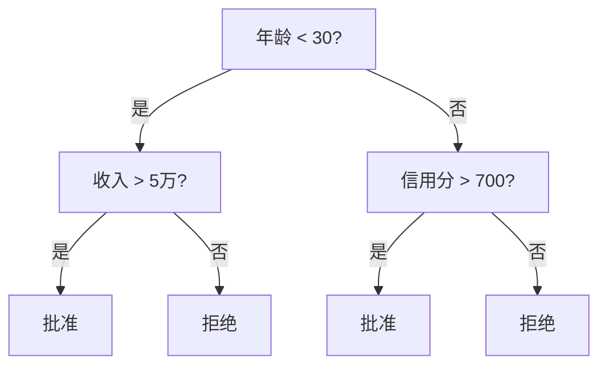
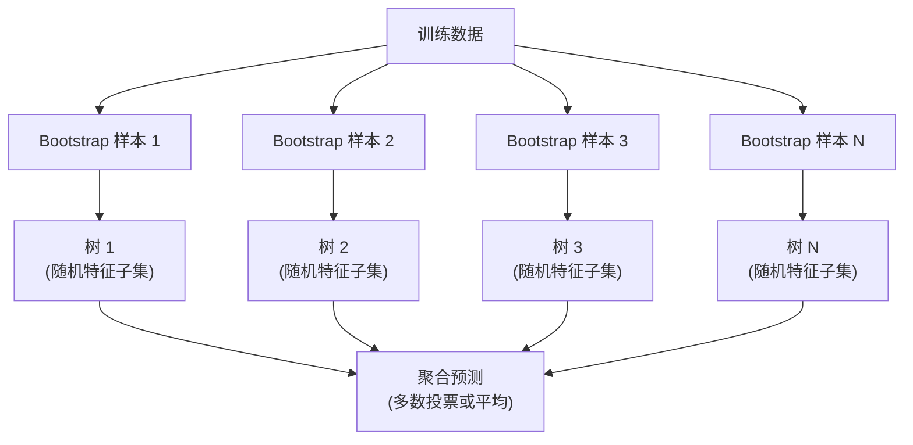

# 决策树与随机森林

> 一棵决策树就是一张流程图。但一片由它们组成的森林，是机器学习中最强大的工具之一。

**类型：** 构建
**语言：** Python
**前置知识：** Phase 1（第 9 课信息论、第 6 课概率论）
**时长：** 约 90 分钟

## 学习目标

- 实现 Gini 不纯度、熵和信息增益计算，找到最优决策树分裂点
- 从零构建带有预剪枝控制（最大深度、最小样本数）的决策树分类器
- 使用 Bootstrap 采样和特征随机化构建随机森林，并解释它为什么能降低方差
- 比较 MDI 特征重要性和置换重要性，识别 MDI 的偏差问题

## 问题引入

你有一份表格数据。行是样本，列是特征，还有一个你想预测的目标列。你可以用神经网络来处理。但对于表格数据，基于树的模型（决策树、随机森林、梯度提升树）始终优于深度学习。Kaggle 结构化数据竞赛被 XGBoost 和 LightGBM 统治，而不是 Transformer。

为什么？树模型无需预处理就能处理混合特征类型（数值型和分类型）。无需特征工程就能处理非线性关系。而且它们是可解释的：你可以查看树并准确理解为什么做出了某个预测。随机森林通过平均许多树的预测，对中等规模数据集的过拟合具有很强的抵抗力。

本课从零构建决策树（使用递归分裂），然后在其上构建随机森林。你将实现分裂标准背后的数学（Gini 不纯度、熵、信息增益），并理解为什么一组弱学习器的集成能变成强学习器。

## 核心概念

### 决策树做了什么

决策树通过一系列是/否问题将特征空间划分为矩形区域。



每个内部节点将一个特征与一个阈值进行比较。每个叶节点做出预测。要分类一个新数据点，从根节点开始，沿分支走直到到达叶节点。

树是自顶向下构建的：在每个节点选择能最好地分离数据的特征和阈值。"最好"由分裂标准定义。

### 分裂标准：衡量不纯度

在每个节点，我们有一组样本。我们想分裂它们，使产生的子节点尽可能"纯"——每个子节点主要包含一个类别。

**Gini 不纯度 (Gini Impurity)** 衡量如果按照该节点的类别分布随机标记，一个随机选择的样本被错误分类的概率。

```
Gini(S) = 1 - sum(p_k^2)

其中 p_k 是集合 S 中类别 k 的比例。
```

对于纯节点（只有一个类别），Gini = 0。对于 50/50 的二元分裂，Gini = 0.5。越小越好。

```
示例：6 只猫，4 只狗

Gini = 1 - (0.6^2 + 0.4^2) = 1 - (0.36 + 0.16) = 0.48
```

**熵 (Entropy)** 衡量节点中的信息含量（无序程度）。在 Phase 1 第 9 课中已讲解。

```
Entropy(S) = -sum(p_k * log2(p_k))
```

对于纯节点，熵 = 0。对于 50/50 的二元分裂，熵 = 1.0。越小越好。

```
示例：6 只猫，4 只狗

Entropy = -(0.6 * log2(0.6) + 0.4 * log2(0.4))
        = -(0.6 * -0.737 + 0.4 * -1.322)
        = 0.442 + 0.529
        = 0.971 bits
```

**信息增益 (Information Gain)** 是分裂后不纯度（熵或 Gini）的减少量。

```
IG(S, 特征, 阈值) = Impurity(S) - weighted_avg(Impurity(S_left), Impurity(S_right))

其中权重是每个子节点中样本的比例。
```

每个节点的贪心算法：尝试每个特征和每个可能的阈值。选择使信息增益最大的（特征，阈值）对。

### 分裂如何工作

对于当前节点有 n 个特征和 m 个样本的数据集：

1. 对于每个特征 j（j = 1 到 n）：
   - 按特征 j 排序样本
   - 尝试每对相邻不同值的中点作为阈值
   - 计算每个阈值的信息增益
2. 选择信息增益最高的特征和阈值
3. 将数据分为左（特征 <= 阈值）和右（特征 > 阈值）
4. 对每个子节点递归

这种贪心方法不保证全局最优的树。找到最优树是 NP-hard 问题。但贪心分裂在实践中效果很好。

### 停止条件

没有停止条件，树会生长到每个叶节点都变纯（每个叶节点一个样本）。这完美记忆了训练数据，但泛化能力极差。

**预剪枝 (Pre-pruning)** 在树完全长成之前停止：
- 最大深度：当树达到设定深度时停止分裂
- 叶节点最小样本数：如果节点少于 k 个样本则停止
- 最小信息增益：如果最佳分裂对不纯度的改进低于阈值则停止
- 最大叶节点数：限制叶节点总数

**后剪枝 (Post-pruning)** 先长成完整的树，然后再修剪：
- 代价复杂度剪枝（scikit-learn 使用）：添加与叶节点数成正比的惩罚。增大惩罚得到更小的树
- 降低误差剪枝：如果移除子树不增加验证误差，则移除它

预剪枝更简单快速。后剪枝通常产生更好的树，因为它不会过早停止可能通向有用分裂的分支。

### 回归决策树

对于回归任务，叶节点的预测是叶内目标值的均值。分裂标准也相应改变：

**方差减少 (Variance Reduction)** 替代信息增益：

```
VR(S, 特征, 阈值) = Var(S) - weighted_avg(Var(S_left), Var(S_right))
```

选择减少方差最多的分裂。树将输入空间划分为多个区域，在每个区域预测一个常数（均值）。

### 随机森林：集成的力量

单棵决策树方差很高。数据的小变化会产生完全不同的树。随机森林通过平均许多树来解决这个问题。



两个随机化来源使树具有多样性：

**Bagging（Bootstrap Aggregating，自助法聚合）：** 每棵树在 Bootstrap 样本上训练——从训练数据中有放回的随机抽样。大约 63% 的原始样本出现在每个 Bootstrap 样本中（其余是袋外样本，可用于验证）。

**特征随机化：** 在每次分裂时，只考虑特征的随机子集。对于分类，默认为 sqrt(n_features)。对于回归，为 n_features/3。这防止所有树都在同一个主导特征上分裂。

核心洞察：平均多个不相关的树降低方差而不增加偏差。每棵单独的树可能平庸。但集成是强大的。

### 特征重要性

随机森林天然提供特征重要性分数。最常用的方法：

**不纯度平均减少 (MDI, Mean Decrease in Impurity)：** 对于每个特征，汇总所有树和所有使用该特征的节点的不纯度减少总量。在更早分裂中产生更大不纯度减少的特征更重要。

```
importance(特征_j) = 对所有使用特征_j 的节点求和:
    (节点样本数 / 总样本数) * 不纯度减少量
```

这很快（训练时计算），但偏向高基数特征和有多个可能分裂点的特征。

**置换重要性 (Permutation Importance)** 是替代方案：打乱一个特征的值，测量模型准确率下降多少。更可靠但更慢。

### 树模型何时胜过神经网络

树和森林在表格数据上统治神经网络。原因如下：

| 因素 | 树模型 | 神经网络 |
|------|-------|---------|
| 混合类型（数值 + 分类型） | 原生支持 | 需要编码 |
| 小数据集（< 1 万行） | 表现好 | 过拟合 |
| 特征交互 | 通过分裂发现 | 需要架构设计 |
| 可解释性 | 完全透明 | 黑箱 |
| 训练时间 | 分钟级 | 小时级 |
| 超参数敏感度 | 低 | 高 |

神经网络在数据具有空间或序列结构（图像、文本、音频）时胜出。对于扁平的特征表，树模型是默认选择。

## 动手实现

### 步骤 1：Gini 不纯度和熵

从零构建两种分裂标准，验证它们对好坏分裂的判断一致。

```python
import math

def gini_impurity(labels):
    n = len(labels)
    if n == 0:
        return 0.0
    counts = {}
    for label in labels:
        counts[label] = counts.get(label, 0) + 1  # 统计每个类别的出现次数
    # Gini = 1 - sum(p_k^2)，衡量节点的不纯度
    return 1.0 - sum((c / n) ** 2 for c in counts.values())

def entropy(labels):
    n = len(labels)
    if n == 0:
        return 0.0
    counts = {}
    for label in labels:
        counts[label] = counts.get(label, 0) + 1
    # Entropy = -sum(p_k * log2(p_k))，信息论中的不确定性度量
    return -sum(
        (c / n) * math.log2(c / n) for c in counts.values() if c > 0
    )
```

### 步骤 2：找到最佳分裂

尝试每个特征和每个阈值。返回信息增益最高的那个。

```python
def information_gain(parent_labels, left_labels, right_labels, criterion="gini"):
    measure = gini_impurity if criterion == "gini" else entropy  # 选择不纯度度量
    n = len(parent_labels)
    n_left = len(left_labels)
    n_right = len(right_labels)
    if n_left == 0 or n_right == 0:
        return 0.0  # 空节点无法产生信息增益
    parent_impurity = measure(parent_labels)  # 父节点不纯度
    # 子节点加权不纯度
    child_impurity = (
        (n_left / n) * measure(left_labels) +
        (n_right / n) * measure(right_labels)
    )
    # 信息增益 = 父节点不纯度 - 子节点加权不纯度
    return parent_impurity - child_impurity
```

### 步骤 3：构建 DecisionTree 类

递归分裂、预测和特征重要性追踪。

```python
class DecisionTree:
    def __init__(self, max_depth=None, min_samples_split=2,
                 min_samples_leaf=1, criterion="gini",
                 max_features=None):
        self.max_depth = max_depth
        self.min_samples_split = min_samples_split
        self.min_samples_leaf = min_samples_leaf
        self.criterion = criterion
        self.max_features = max_features
        self.tree = None
        self.feature_importances_ = None

    def fit(self, X, y):
        self.n_features = len(X[0])
        self.feature_importances_ = [0.0] * self.n_features
        self.n_samples = len(X)
        self.tree = self._build(X, y, depth=0)
        total = sum(self.feature_importances_)
        if total > 0:
            self.feature_importances_ = [
                fi / total for fi in self.feature_importances_
            ]

    def predict(self, X):
        return [self._predict_one(x, self.tree) for x in X]
```

### 步骤 4：构建 RandomForest 类

Bootstrap 采样、特征随机化和多数投票。

```python
class RandomForest:
    def __init__(self, n_trees=100, max_depth=None,
                 min_samples_split=2, max_features="sqrt",
                 criterion="gini"):
        self.n_trees = n_trees
        self.max_depth = max_depth
        self.min_samples_split = min_samples_split
        self.max_features = max_features
        self.criterion = criterion
        self.trees = []

    def fit(self, X, y):
        n = len(X)
        for _ in range(self.n_trees):
            indices = [random.randint(0, n - 1) for _ in range(n)]
            X_boot = [X[i] for i in indices]
            y_boot = [y[i] for i in indices]
            tree = DecisionTree(
                max_depth=self.max_depth,
                min_samples_split=self.min_samples_split,
                max_features=self.max_features,
                criterion=self.criterion,
            )
            tree.fit(X_boot, y_boot)
            self.trees.append(tree)

    def predict(self, X):
        all_preds = [tree.predict(X) for tree in self.trees]
        predictions = []
        for i in range(len(X)):
            votes = {}
            for preds in all_preds:
                v = preds[i]
                votes[v] = votes.get(v, 0) + 1
            predictions.append(max(votes, key=votes.get))
        return predictions
```

完整实现（含所有辅助方法）见 `code/trees.py`。

## 用框架实现

使用 scikit-learn，训练随机森林只需三行：

```python
from sklearn.ensemble import RandomForestClassifier
from sklearn.datasets import load_iris
from sklearn.model_selection import train_test_split

X, y = load_iris(return_X_y=True)  # 加载鸢尾花数据集
X_train, X_test, y_train, y_test = train_test_split(X, y, random_state=42)  # 划分训练/测试集

rf = RandomForestClassifier(n_estimators=100, random_state=42)  # 100 棵树的随机森林
rf.fit(X_train, y_train)  # 训练
print(f"准确率: {rf.score(X_test, y_test):.4f}")  # 评估准确率
print(f"特征重要性: {rf.feature_importances_}")
```

在实践中，梯度提升树（XGBoost、LightGBM、CatBoost）通常比随机森林更强，因为它们串行构建树，每棵树纠正前一棵树的错误。但随机森林更难配错，几乎不需要超参数调优。

## 产出物

本课产出 `outputs/prompt-tree-interpreter.md`——一个为业务干系人解释决策树分裂的 prompt 模板。输入训练好的树结构（深度、特征、分裂阈值、准确率），它将模型翻译成自然语言规则，排列特征重要性，标记过拟合或数据泄漏，并推荐下一步。当你需要向不看代码的人解释树模型时使用它。

## 练习题

1. 在 3 类 2D 数据集上训练单棵决策树。手动追踪分裂并绘制矩形决策边界。比较 max_depth=2 和 max_depth=10 的边界。

2. 实现回归树的方差减少分裂。为 200 个点生成 y = sin(x) + noise，拟合回归树。绘制树的分段常数预测与真实曲线。

3. 分别用 1、5、10、50 和 200 棵树构建随机森林。绘制训练准确率和测试准确率随树数量的变化。观察测试准确率趋于平稳但不会下降（森林抗过拟合）。

4. 在 5 个不同数据集上比较 Gini 不纯度和熵作为分裂标准。测量准确率和树深度。大多数情况下它们产生几乎相同的结果。解释原因。

5. 实现置换重要性。在一个包含随机噪声但高基数特征的数据集上，将其与 MDI 重要性比较。MDI 会将噪声特征排在前列。置换重要性不会。

## 术语速查表

| 术语 | 实际含义 |
|------|---------|
| 决策树 (Decision Tree) | 通过学习 if/else 分裂序列将特征空间划分为矩形区域的模型 |
| Gini 不纯度 (Gini Impurity) | 在节点随机分类一个样本的错误概率。0 = 纯，0.5 = 二元最大不纯度 |
| 熵 (Entropy) | 节点的信息含量。0 = 纯，1.0 = 二元最大不确定性。来自信息论 |
| 信息增益 (Information Gain) | 分裂后不纯度的减少量。选择分裂的贪心标准 |
| 预剪枝 (Pre-pruning) | 通过设置最大深度、最小样本数或最小增益阈值提前停止树的生长 |
| 后剪枝 (Post-pruning) | 先长成完整的树，然后移除不改善验证性能的子树 |
| Bagging | Bootstrap 聚合。在每个不同的有放回随机样本上训练每个模型 |
| 随机森林 (Random Forest) | 决策树的集成，每棵在 Bootstrap 样本上训练，每次分裂使用随机特征子集 |
| 特征重要性 MDI | 每个特征贡献的总不纯度减少，汇总所有树和节点 |
| 置换重要性 (Permutation Importance) | 打乱一个特征的值后准确率的下降量。对噪声特征比 MDI 更可靠 |
| 方差减少 (Variance Reduction) | 回归树中信息增益的类比。选择减少目标方差最多的分裂 |
| Bootstrap 样本 | 从原始数据集中有放回抽取的随机样本。大小相同，但有重复 |

## 延伸阅读

- [Breiman: Random Forests (2001)](https://link.springer.com/article/10.1023/A:1010933404324) - 随机森林原始论文
- [Grinsztajn et al.: Why do tree-based models still outperform deep learning on tabular data? (2022)](https://arxiv.org/abs/2207.08815) - 树模型与神经网络在表格数据上的严格比较
- [scikit-learn 决策树文档](https://scikit-learn.org/stable/modules/tree.html) - 实用指南及可视化工具
- [XGBoost: A Scalable Tree Boosting System (Chen & Guestrin, 2016)](https://arxiv.org/abs/1603.02754) - 统治 Kaggle 的梯度提升论文
