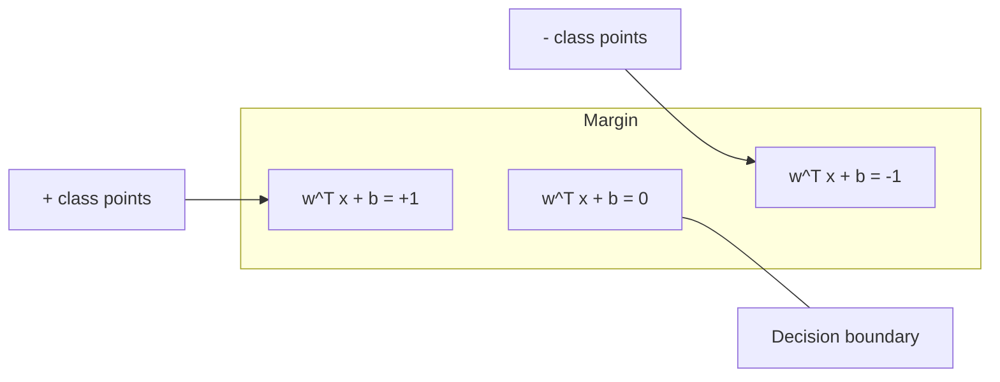
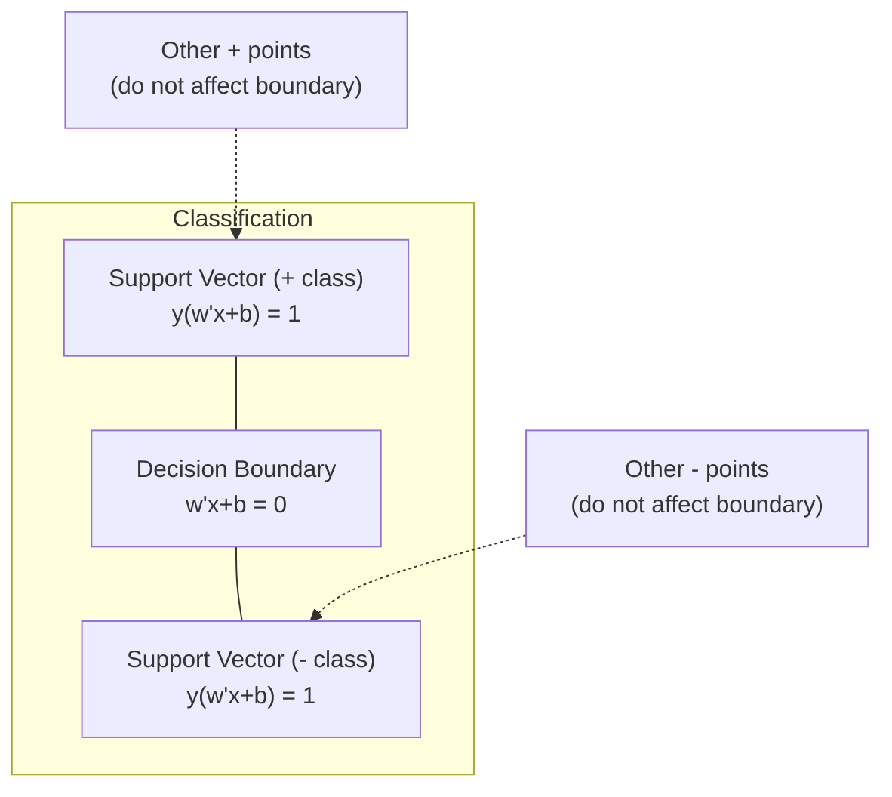
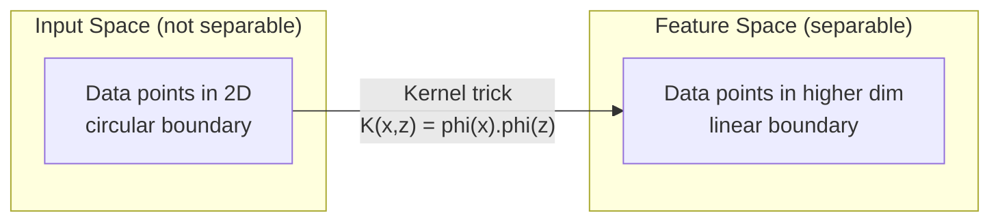

# Support Vector Machines
# 支持向量机 (SVM)


> Find the widest street between two classes. That is the entire idea.

> 找到两类之间最宽的街道。这就是全部思想。

**Type:** Build | **类型：** 构建
**Language:** Python | **语言：** Python
**Prerequisites:** Phase 1 (Lessons 08 Optimization, 14 Norms and Distances, 18 Convex Optimization) | **前置知识：** Phase 1（第 8 课优化、第 14 课范数与距离、第 18 课凸优化）
**Time:** ~90 minutes | **时间：** 约 90 分钟

## Learning Objectives | 学习目标

- Implement a linear SVM from scratch using hinge loss and gradient descent on the primal formulation
  在原始形式上使用合页损失和梯度下降从零实现线性 SVM
- Explain the maximum margin principle and identify support vectors from a trained model
  解释最大间隔原理，并从训练好的模型中识别支持向量
- Compare linear, polynomial, and RBF kernels and explain how the kernel trick avoids explicit high-dimensional mapping
  比较线性核、多项式核和 RBF 核，解释核技巧如何避免显式高维映射
- Evaluate the tradeoff controlled by the C parameter between margin width and classification errors
  评估 C 参数控制的间隔宽度与分类错误之间的权衡


> **【中文解读】**
> SVM 找到最大间隔的分类边界。核技巧让 SVM 在高维空间中处理非线性问题——直观理解就是升维后再切分。sklearn 中的 SVC/SVR。文本分类、图像识别中曾广泛使用。

> **【拓展：SVM 在深度学习时代仍然重要的场景】**
> SVM 在小数据集（数百到数千样本）上仍然优于深度学习。Google 在早期垃圾邮件分类中使用线性 SVM（LIBLINEAR），因为 TF-IDF 特征维度高但样本稀疏，SVM 的高维优势恰好发挥。在生物信息学（蛋白质分类、基因表达分析）中，SVM 仍是主流算法。One-Class SVM 被广泛用于异常检测（如网络安全入侵检测）。

## The Problem | 问题引入

You have two classes of data points and need to draw a line (or hyperplane) separating them. Infinitely many lines could work. Which one should you pick?

The one with the biggest margin. The margin is the distance between the decision boundary and the nearest data points on each side. A wider margin means the classifier is more confident and generalizes better to unseen data.

This intuition leads to Support Vector Machines, one of the most mathematically elegant algorithms in ML. SVMs were the dominant classification method before deep learning and remain the best choice for small datasets, high-dimensional data, and problems where you need a principled, well-understood model with theoretical guarantees.

SVMs connect directly to Phase 1: the optimization is convex (Lesson 18), the margin is measured with norms (Lesson 14), and the kernel trick exploits dot products to handle nonlinear boundaries without ever computing in the high-dimensional space.

> **【中文解读】**
> SVM 的核心思想：在无数条可分离两类数据的直线中，选择离最近数据点最远的那条——即"最大间隔"原则。间隔越大，分类器越自信，泛化能力越好。只有恰好位于间隔边界上的少数点（支持向量）决定了决策边界，其他点不影响结果。这使得 SVM 在预测时内存效率很高。

## The Concept | 核心概念

### The maximum margin classifier

Given linearly separable data with labels y_i in {-1, +1} and feature vectors x_i, we want a hyperplane w^T x + b = 0 that separates the classes.

The distance from a point x_i to the hyperplane is:

```
distance = |w^T x_i + b| / ||w||
```

For a correctly classified point: y_i * (w^T x_i + b) > 0. The margin is twice the distance from the hyperplane to the nearest point on either side.



The optimization problem:

```
maximize    2 / ||w||     (the margin width)
subject to  y_i * (w^T x_i + b) >= 1  for all i
```

Equivalently (minimizing ||w||^2 is easier to optimize):

```
minimize    (1/2) ||w||^2
subject to  y_i * (w^T x_i + b) >= 1  for all i
```

This is a convex quadratic program. It has a unique global solution. The data points that sit exactly on the margin boundaries (where y_i * (w^T x_i + b) = 1) are the support vectors. They are the only points that determine the decision boundary. Move or remove any non-support-vector point, and the boundary does not change.

### Support vectors: the critical few



Most training points are irrelevant. Only the support vectors matter. This is why SVMs are memory-efficient at prediction time: you only need to store the support vectors, not the entire training set.

The number of support vectors also gives a bound on generalization error. Fewer support vectors relative to the dataset size means better generalization.

### Soft margin: handling noise with the C parameter

Real data is rarely perfectly separable. Some points may be on the wrong side of the boundary, or inside the margin. The soft margin formulation allows violations by introducing slack variables.

```
minimize    (1/2) ||w||^2 + C * sum(xi_i)
subject to  y_i * (w^T x_i + b) >= 1 - xi_i
            xi_i >= 0  for all i
```

The slack variable xi_i measures how much point i violates the margin. C controls the trade-off:

| C value | Behavior |
|---------|----------|
| Large C | Penalizes violations heavily. Narrow margin, fewer misclassifications. Overfits |
| Small C | Allows more violations. Wide margin, more misclassifications. Underfits |

C is the regularization strength, inverted. Large C = less regularization. Small C = more regularization.

### Hinge loss: the SVM loss function

The soft margin SVM can be rewritten as an unconstrained optimization:

```
minimize    (1/2) ||w||^2 + C * sum(max(0, 1 - y_i * (w^T x_i + b)))
```

The term max(0, 1 - y_i * f(x_i)) is the hinge loss. It is zero when the point is correctly classified and beyond the margin. It is linear when the point is inside the margin or misclassified.

```
Hinge loss for a single point:

loss
  |
  | \
  |  \
  |   \
  |    \
  |     \_______________
  |
  +-----|-----|-------->  y * f(x)
       0     1

Zero loss when y*f(x) >= 1 (correctly classified, outside margin).
Linear penalty when y*f(x) < 1.
```

Compare with logistic loss (logistic regression):

```
Hinge:     max(0, 1 - y*f(x))          Hard cutoff at margin
Logistic:  log(1 + exp(-y*f(x)))        Smooth, never exactly zero
```

Hinge loss produces sparse solutions (only support vectors have nonzero contribution). Logistic loss uses all data points. This makes SVMs more memory-efficient at prediction time.

### Training a linear SVM with gradient descent

You can train a linear SVM using gradient descent on the hinge loss plus L2 regularization, without solving the constrained QP:

```
L(w, b) = (lambda/2) * ||w||^2 + (1/n) * sum(max(0, 1 - y_i * (w^T x_i + b)))

Gradient with respect to w:
  If y_i * (w^T x_i + b) >= 1:  dL/dw = lambda * w
  If y_i * (w^T x_i + b) < 1:   dL/dw = lambda * w - y_i * x_i

Gradient with respect to b:
  If y_i * (w^T x_i + b) >= 1:  dL/db = 0
  If y_i * (w^T x_i + b) < 1:   dL/db = -y_i
```

This is called the primal formulation. It runs in O(n * d) per epoch, where n is the number of samples and d is the number of features. For large, sparse, high-dimensional data (text classification), this is fast.

> **【中文解读】**
> 合页损失（Hinge Loss）是 SVM 的核心损失函数：当样本被正确分类且在间隔之外时损失为 0，否则线性惩罚。与逻辑回归的交叉熵损失不同，合页损失产生稀疏解——只有支持向量有非零贡献，预测时只需存储这些点。C 参数控制间隔宽度与分类错误的权衡：大 C = 窄间隔少犯错（可能过拟合），小 C = 宽间隔多犯错（可能欠拟合）。

### The dual formulation and the kernel trick

The Lagrangian dual of the SVM problem (from Phase 1 Lesson 18, KKT conditions) is:

```
maximize    sum(alpha_i) - (1/2) * sum_ij(alpha_i * alpha_j * y_i * y_j * (x_i . x_j))
subject to  0 <= alpha_i <= C
            sum(alpha_i * y_i) = 0
```

The dual only involves dot products x_i . x_j between data points. This is the key insight. Replace every dot product with a kernel function K(x_i, x_j) and the SVM can learn nonlinear boundaries without ever computing the transformation explicitly.

```
Linear kernel:      K(x, z) = x . z
Polynomial kernel:  K(x, z) = (x . z + c)^d
RBF (Gaussian):     K(x, z) = exp(-gamma * ||x - z||^2)
```

The RBF kernel maps data into an infinite-dimensional space. Points that are close in input space have kernel value near 1. Points that are far apart have kernel value near 0. It can learn any smooth decision boundary.



The kernel trick computes the dot product in the high-dimensional space without ever going there. For the polynomial kernel of degree d in D dimensions, the explicit feature space has O(D^d) dimensions. But K(x, z) is computed in O(D) time.

> **【中文解读】**
> 核技巧是 SVM 最优雅的数学贡献。对偶形式只涉及数据点之间的点积 x_i · x_j，将其替换为核函数 K(x_i, x_j) 即可在高维（甚至无限维）空间中学习非线性边界，而无需显式计算高维映射。RBF 核将数据映射到无限维空间，能学习任意光滑的决策边界。计算开销：多项式核的显式特征空间有 O(D^d) 维，但核函数只需 O(D) 时间。

> **【拓展：核技巧的思想在现代 AI 中的延续】**
> 核技巧的核心思想——"在高维空间中计算相似度而不显式映射"——在 Transformer 的注意力机制中有类似体现。注意力分数 A(q,k) = softmax(qK^T/√d) 本质上也是一种相似度核函数。此外，核方法在 GP（高斯过程）中仍然是核心工具，被 Google DeepMind 用于贝叶斯优化（如超参数调优工具 Vizier）。

### SVM for regression (SVR)

Support Vector Regression fits a tube of width epsilon around the data. Points inside the tube have zero loss. Points outside the tube are penalized linearly.

```
minimize    (1/2) ||w||^2 + C * sum(xi_i + xi_i*)
subject to  y_i - (w^T x_i + b) <= epsilon + xi_i
            (w^T x_i + b) - y_i <= epsilon + xi_i*
            xi_i, xi_i* >= 0
```

The epsilon parameter controls the tube width. Wider tube = fewer support vectors = smoother fit. Narrower tube = more support vectors = tighter fit.

### Why SVMs lost to deep learning (and when they still win)

SVMs dominated ML from the late 1990s through the early 2010s. Deep learning surpassed them for several reasons:

| Factor | SVMs | Deep learning |
|--------|------|---------------|
| Feature engineering | Requires it | Learns features |
| Scalability | O(n^2) to O(n^3) for kernel | O(n) per epoch with SGD |
| Image/text/audio | Needs handcrafted features | Learns from raw data |
| Large datasets (>100k) | Slow | Scales well |
| GPU acceleration | Limited benefit | Massive speedup |

SVMs still win in these situations:
- Small datasets (hundreds to low thousands of samples)
- High-dimensional sparse data (text with TF-IDF features)
- When you need mathematical guarantees (margin bounds)
- When training time must be minimal (linear SVM is very fast)
- Binary classification with clear margin structure
- Anomaly detection (one-class SVM)

## Build It | 动手实现

### Step 1: Hinge loss and gradient

The foundation. Compute hinge loss for a batch and its gradient.

```python
def hinge_loss(X, y, w, b):
    n = len(X)
    total_loss = 0.0
    for i in range(n):
        margin = y[i] * (dot(w, X[i]) + b)  # 计算样本到决策边界的函数间隔
        total_loss += max(0.0, 1.0 - margin)  # 合页损失：间隔 < 1 时才有惩罚
    return total_loss / n  # 返回平均损失
```

### Step 2: Linear SVM via gradient descent

Train by minimizing regularized hinge loss. No QP solver needed.

```python
class LinearSVM:
    def __init__(self, lr=0.001, lambda_param=0.01, n_epochs=1000):
        self.lr = lr  # 学习率
        self.lambda_param = lambda_param  # 正则化参数（对应 1/C）
        self.n_epochs = n_epochs
        self.w = None  # 权重向量
        self.b = 0.0  # 偏置

    def fit(self, X, y):
        n_features = len(X[0])
        self.w = [0.0] * n_features
        self.b = 0.0

        for epoch in range(self.n_epochs):
            for i in range(len(X)):
                margin = y[i] * (dot(self.w, X[i]) + self.b)  # 函数间隔
                if margin >= 1:
                    # 样本在间隔之外，只需正则化梯度
                    self.w = [wj - self.lr * self.lambda_param * wj
                              for wj in self.w]
                else:
                    # 样本在间隔内或被误分类，需要额外的损失梯度
                    self.w = [wj - self.lr * (self.lambda_param * wj - y[i] * X[i][j])
                              for j, wj in enumerate(self.w)]
                    self.b -= self.lr * (-y[i])

    def predict(self, X):
        return [1 if dot(self.w, x) + self.b >= 0 else -1 for x in X]  # 根据符号预测类别
```

### Step 3: Kernel functions

Implement linear, polynomial, and RBF kernels.

```python
def linear_kernel(x, z):
    return dot(x, z)  # 线性核：直接点积

def polynomial_kernel(x, z, degree=3, c=1.0):
    return (dot(x, z) + c) ** degree  # 多项式核：(x·z + c)^d

def rbf_kernel(x, z, gamma=0.5):
    diff = [xi - zi for xi, zi in zip(x, z)]  # 计算差向量
    return math.exp(-gamma * dot(diff, diff))  # RBF 核：exp(-γ||x-z||²)
```

### Step 4: Margin and support vector identification

After training, identify which points are support vectors and compute the margin width.

```python
def find_support_vectors(X, y, w, b, tol=1e-3):
    support_vectors = []
    for i in range(len(X)):
        margin = y[i] * (dot(w, X[i]) + b)
        if abs(margin - 1.0) < tol:
            support_vectors.append(i)
    return support_vectors
```

See `code/svm.py` for the complete implementation with all demos.

## Use It | 用框架实现

> **【中文解读】**
> sklearn 中 SVM 的使用关键点：(1) 必须先标准化特征——SVM 对特征尺度敏感，因为间隔依赖 ||w||；(2) 小数据集用 SVC（支持核函数），大数据集用 LinearSVC（使用原始形式，O(n) 每轮）；(3) gamma 控制 RBF 核的影响范围，太大→过拟合，太小→欠拟合。Pipeline 封装确保 scaler 在训练集上 fit、在测试集上只 transform。

With scikit-learn:

```python
from sklearn.svm import SVC, LinearSVC, SVR
from sklearn.preprocessing import StandardScaler
from sklearn.pipeline import Pipeline

# 标准化 + SVM 的标准管线
clf = Pipeline([
    ("scaler", StandardScaler()),  # 标准化是 SVM 的必选项
    ("svm", SVC(kernel="rbf", C=1.0, gamma="scale")),  # RBF 核 SVM
])
clf.fit(X_train, y_train)
print(f"Accuracy: {clf.score(X_test, y_test):.4f}")
print(f"Support vectors: {clf['svm'].n_support_}")
```

Important: always scale your features before training an SVM. SVMs are sensitive to feature magnitudes because the margin depends on ||w||, and unscaled features distort the geometry.

For large datasets, use `LinearSVC` (primal formulation, O(n) per epoch) instead of `SVC` (dual formulation, O(n^2) to O(n^3)):

```python
from sklearn.svm import LinearSVC

clf = Pipeline([
    ("scaler", StandardScaler()),
    ("svm", LinearSVC(C=1.0, max_iter=10000)),
])
```

## Exercises | 练习题

1. Generate a 2D linearly separable dataset. Train your LinearSVM and identify the support vectors. Verify that the support vectors are the points closest to the decision boundary.
   1. 生成一个 2D 线性可分数据集。训练你的 LinearSVM 并识别支持向量。验证支持向量是离决策边界最近的点。

2. Vary C from 0.001 to 1000 on a noisy dataset. Plot the decision boundary for each C value. Observe the transition from wide margin (underfitting) to narrow margin (overfitting).
   2. 在有噪声的数据集上，将 C 从 0.001 变化到 1000。为每个 C 值绘制决策边界。观察从宽间隔（欠拟合）到窄间隔（过拟合）的转变。

3. Create a dataset where class boundaries are circular (not linear). Show that a linear SVM fails. Compute the RBF kernel matrix and show that the classes become separable in the kernel-induced feature space.
   3. 创建一个类别边界为圆形（非线形）的数据集。展示线性 SVM 失败。计算 RBF 核矩阵，展示在核诱导的特征空间中类别变得可分。

4. Compare hinge loss vs logistic loss on the same dataset. Train a linear SVM and logistic regression. Count how many training points contribute to each model's decision boundary (support vectors vs all points).
   4. 在同一数据集上比较合页损失和逻辑损失。训练线性 SVM 和逻辑回归。统计每个模型的决策边界贡献了多少训练点（支持向量 vs 所有点）。

5. Implement SVR (epsilon-insensitive loss). Fit it to y = sin(x) + noise. Plot the epsilon tube around the predictions and highlight the support vectors (points outside the tube).
   5. 实现 SVR（epsilon 不敏感损失）。拟合 y = sin(x) + noise。绘制预测周围的 epsilon 管道并标记支持向量（管道外的点）。

## Key Terms | 术语速查表

| Term | What it actually means |
|------|----------------------|
| Support vectors | The training points closest to the decision boundary. The only points that determine the hyperplane |
| Margin | The distance between the decision boundary and the nearest support vectors. SVMs maximize this |
| Hinge loss | max(0, 1 - y*f(x)). Zero when correctly classified and outside the margin. Linear penalty otherwise |
| C parameter | Trade-off between margin width and classification errors. Large C = narrow margin, small C = wide margin |
| Soft margin | SVM formulation that allows margin violations via slack variables. Handles non-separable data |
| Kernel trick | Computing dot products in a high-dimensional feature space without explicitly mapping to that space |
| Linear kernel | K(x, z) = x . z. Equivalent to standard dot product. For linearly separable data |
| RBF kernel | K(x, z) = exp(-gamma * \|\|x-z\|\|^2). Maps to infinite dimensions. Learns any smooth boundary |
| Polynomial kernel | K(x, z) = (x . z + c)^d. Maps to a feature space of polynomial combinations |
| Dual formulation | Reformulation of the SVM problem that depends only on dot products between data points. Enables kernels |
| SVR | Support Vector Regression. Fits an epsilon-tube around the data. Points inside the tube have zero loss |
| Slack variables | xi_i: measures how much a point violates the margin. Zero for correctly classified points outside margin |
| Maximum margin | The principle of choosing the hyperplane that maximizes the distance to the nearest points of each class |

## Further Reading | 延伸阅读

- [Vapnik: The Nature of Statistical Learning Theory (1995)](https://link.springer.com/book/10.1007/978-1-4757-3264-1) - the foundational text on SVMs and statistical learning
  [Vapnik: The Nature of Statistical Learning Theory (1995)](https://link.springer.com/book/10.1007/978-1-4757-3264-1) - SVM 和统计学习理论的奠基性著作
- [Cortes & Vapnik: Support-vector networks (1995)](https://link.springer.com/article/10.1007/BF00994018) - the original SVM paper
  [Cortes & Vapnik: Support-vector networks (1995)](https://link.springer.com/article/10.1007/BF00994018) - SVM 原始论文
- [Platt: Sequential Minimal Optimization (1998)](https://www.microsoft.com/en-us/research/publication/sequential-minimal-optimization-a-fast-algorithm-for-training-support-vector-machines/) - the SMO algorithm that made SVM training practical
  [Platt: Sequential Minimal Optimization (1998)](https://www.microsoft.com/en-us/research/publication/sequential-minimal-optimization-a-fast-algorithm-for-training-support-vector-machines/) - 使 SVM 训练变得实用的 SMO 算法
- [scikit-learn SVM documentation](https://scikit-learn.org/stable/modules/svm.html) - practical guide with implementation details
  [scikit-learn SVM 文档](https://scikit-learn.org/stable/modules/svm.html) - 实用指南及实现细节
- [LIBSVM: A Library for Support Vector Machines](https://www.csie.ntu.edu.tw/~cjlin/libsvm/) - the C++ library behind most SVM implementations
  [LIBSVM](https://www.csie.ntu.edu.tw/~cjlin/libsvm/) - 大多数 SVM 实现背后的 C++ 库
