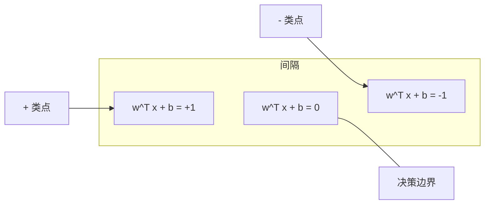
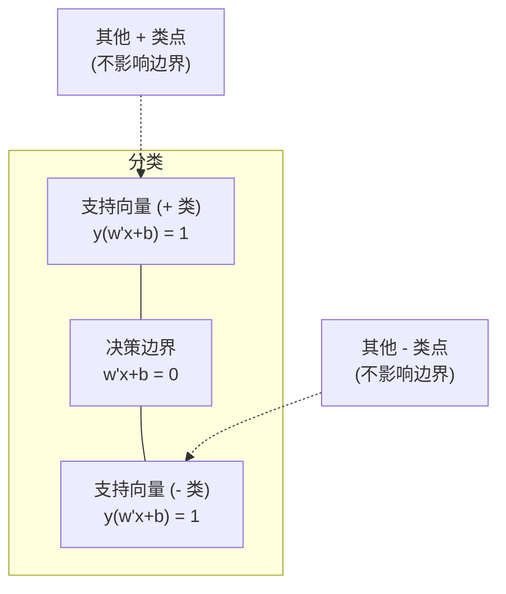
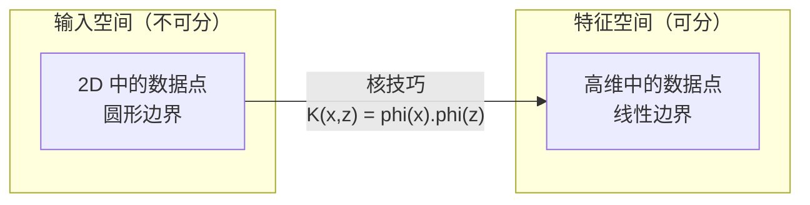

# 支持向量机 (SVM)

> 找到两类之间最宽的街道。这就是全部思想。

**类型：** 构建
**语言：** Python
**前置知识：** Phase 1（第 8 课优化、第 14 课范数与距离、第 18 课凸优化）
**时长：** 约 90 分钟

## 学习目标

- 在原始形式上使用合页损失和梯度下降从零实现线性 SVM
- 解释最大间隔原理，并从训练好的模型中识别支持向量
- 比较线性核、多项式核和 RBF 核，解释核技巧如何避免显式高维映射
- 评估 C 参数控制的间隔宽度与分类错误之间的权衡

## 问题引入

你有两类的数据点，需要画一条线（或超平面）来分隔它们。有无限条线可以用。你应该选哪一条？

间隔最大的那条。间隔 (Margin) 是决策边界到两侧最近数据点之间的距离。更宽的间隔意味着分类器更自信，对未知数据的泛化能力更强。

这个直觉引出了支持向量机 (Support Vector Machine)，机器学习中数学最优雅的算法之一。SVM 在深度学习之前是主流的分类方法，至今仍是小数据集、高维数据和需要理论保证的问题的最佳选择。

SVM 直接关联到 Phase 1：优化是凸的（第 18 课），间隔用范数衡量（第 14 课），核技巧利用点积处理非线性边界而无需在高维空间中计算。

## 核心概念

### 最大间隔分类器

给定标签 y_i 在 {-1, +1}、特征向量为 x_i 的线性可分数据，我们想要一个超平面 w^T x + b = 0 分隔两类。

点到超平面的距离：

```
distance = |w^T x_i + b| / ||w||
```

对于正确分类的点：y_i * (w^T x_i + b) > 0。间隔是从超平面到两侧最近点距离的两倍。



优化问题：

```
最大化    2 / ||w||     （间隔宽度）
约束条件  y_i * (w^T x_i + b) >= 1  对所有 i
```

等价地（最小化 ||w||^2 更容易优化）：

```
最小化    (1/2) ||w||^2
约束条件  y_i * (w^T x_i + b) >= 1  对所有 i
```

这是一个凸二次规划问题，有唯一的全局解。恰好位于间隔边界上的数据点（y_i * (w^T x_i + b) = 1）就是支持向量。它们是唯一决定决策边界的点。移动或移除任何非支持向量的点，边界不会改变。

### 支持向量：关键的少数



大多数训练点是无关的。只有支持向量重要。这就是为什么 SVM 在预测时内存效率高：你只需要存储支持向量，而不是整个训练集。

支持向量的数量相对于数据集大小的比例也给出了泛化误差的上界。支持向量越少，泛化越好。

### 软间隔：用 C 参数处理噪声

真实数据很少能完美分隔。有些点可能在边界的错误一侧，或在间隔内部。软间隔公式通过引入松弛变量允许违规：

```
最小化    (1/2) ||w||^2 + C * sum(xi_i)
约束条件  y_i * (w^T x_i + b) >= 1 - xi_i
          xi_i >= 0  对所有 i
```

松弛变量 xi_i 衡量点 i 违反间隔的程度。C 控制权衡：

| C 值 | 行为 |
|------|------|
| 大 C | 重罚违规。窄间隔，少误分类。过拟合 |
| 小 C | 允许更多违规。宽间隔，多误分类。欠拟合 |

C 是正则化强度的倒数。大 C = 弱正则化。小 C = 强正则化。

### 合页损失：SVM 的损失函数

软间隔 SVM 可以重写为无约束优化：

```
最小化    (1/2) ||w||^2 + C * sum(max(0, 1 - y_i * (w^T x_i + b)))
```

项 max(0, 1 - y_i * f(x_i)) 是合页损失 (Hinge Loss)。当点被正确分类且在间隔之外时，损失为零。当点在间隔内部或被误分类时，线性惩罚。

```
单个点的合页损失：

loss
  |
  | \
  |  \
  |   \
  |    \
  |     \_______________
  |
  +-----|-----|-------->  y * f(x)
       0     1

当 y*f(x) >= 1 时损失为零（正确分类，间隔之外）。
当 y*f(x) < 1 时线性惩罚。
```

与逻辑损失（逻辑回归）比较：

```
合页损失:     max(0, 1 - y*f(x))          在间隔处硬截断
逻辑损失:     log(1 + exp(-y*f(x)))        光滑，永远不会精确为零
```

合页损失产生稀疏解（只有支持向量有非零贡献）。逻辑损失使用所有数据点。这使得 SVM 在预测时更节省内存。

### 用梯度下降训练线性 SVM

你可以在合页损失加 L2 正则化上使用梯度下降训练线性 SVM，无需解约束二次规划：

```
L(w, b) = (lambda/2) * ||w||^2 + (1/n) * sum(max(0, 1 - y_i * (w^T x_i + b)))

关于 w 的梯度：
  如果 y_i * (w^T x_i + b) >= 1:  dL/dw = lambda * w
  如果 y_i * (w^T x_i + b) < 1:   dL/dw = lambda * w - y_i * x_i

关于 b 的梯度：
  如果 y_i * (w^T x_i + b) >= 1:  dL/db = 0
  如果 y_i * (w^T x_i + b) < 1:   dL/db = -y_i
```

这称为原始形式 (Primal Formulation)。每轮复杂度 O(n * d)，其中 n 是样本数，d 是特征数。对于大型稀疏高维数据（文本分类），这很快。

### 对偶形式与核技巧

SVM 问题的拉格朗日对偶形式（来自 Phase 1 第 18 课 KKT 条件）：

```
最大化    sum(alpha_i) - (1/2) * sum_ij(alpha_i * alpha_j * y_i * y_j * (x_i . x_j))
约束条件  0 <= alpha_i <= C
          sum(alpha_i * y_i) = 0
```

对偶形式只涉及数据点之间的点积 x_i . x_j。这是关键洞察。将每个点积替换为核函数 K(x_i, x_j)，SVM 就能学习非线性边界而无需显式计算高维变换。

```
线性核:      K(x, z) = x . z
多项式核:    K(x, z) = (x . z + c)^d
RBF（高斯核）: K(x, z) = exp(-gamma * ||x - z||^2)
```

RBF 核将数据映射到无限维空间。在输入空间中相近的点核值接近 1。相距很远的点核值接近 0。它可以学习任何光滑的决策边界。



核技巧在高维空间中计算点积而无需真正去那里。对于 D 维中度数为 d 的多项式核，显式特征空间有 O(D^d) 维。但 K(x, z) 在 O(D) 时间内计算。

### SVM 用于回归 (SVR)

支持向量回归 (Support Vector Regression) 在数据周围拟合一个宽度为 epsilon 的管道。管道内的点损失为零。管道外的点被线性惩罚。

```
最小化    (1/2) ||w||^2 + C * sum(xi_i + xi_i*)
约束条件  y_i - (w^T x_i + b) <= epsilon + xi_i
          (w^T x_i + b) - y_i <= epsilon + xi_i*
          xi_i, xi_i* >= 0
```

epsilon 参数控制管道宽度。更宽的管道 = 更少支持向量 = 更光滑的拟合。更窄的管道 = 更多支持向量 = 更紧密的拟合。

### 为什么 SVM 输给了深度学习（以及它们何时仍然赢）

SVM 从 1990 年代末到 2010 年代初统治了机器学习。深度学习在几个方面超越了它们：

| 因素 | SVM | 深度学习 |
|------|-----|---------|
| 特征工程 | 需要 | 自动学习特征 |
| 可扩展性 | 核方法 O(n^2) 到 O(n^3) | SGD 每轮 O(n) |
| 图像/文本/音频 | 需要手工特征 | 从原始数据学习 |
| 大数据集（>10 万） | 慢 | 扩展性好 |
| GPU 加速 | 有限收益 | 大幅加速 |

SVM 在以下情况仍然胜出：
- 小数据集（数百到数千样本）
- 高维稀疏数据（TF-IDF 特征的文本）
- 需要数学保证（间隔上界）
- 训练时间必须最短（线性 SVM 非常快）
- 具有清晰间隔结构的二分类
- 异常检测（单类 SVM）

## 动手实现

### 步骤 1：合页损失和梯度

基础。计算一批数据的合页损失及其梯度。

```python
def hinge_loss(X, y, w, b):
    n = len(X)
    total_loss = 0.0
    for i in range(n):
        margin = y[i] * (dot(w, X[i]) + b)  # 计算样本到决策边界的函数间隔
        total_loss += max(0.0, 1.0 - margin)  # 合页损失：间隔 < 1 时才有惩罚
    return total_loss / n  # 返回平均损失
```

### 步骤 2：通过梯度下降训练线性 SVM

通过最小化正则化合页损失来训练。不需要二次规划求解器。

```python
class LinearSVM:
    def __init__(self, lr=0.001, lambda_param=0.01, n_epochs=1000):
        self.lr = lr  # 学习率
        self.lambda_param = lambda_param  # 正则化参数（对应 1/C）
        self.n_epochs = n_epochs
        self.w = None  # 权重向量
        self.b = 0.0  # 偏置

    def fit(self, X, y):
        n_features = len(X[0])
        self.w = [0.0] * n_features
        self.b = 0.0

        for epoch in range(self.n_epochs):
            for i in range(len(X)):
                margin = y[i] * (dot(self.w, X[i]) + self.b)  # 函数间隔
                if margin >= 1:
                    # 样本在间隔之外，只需正则化梯度
                    self.w = [wj - self.lr * self.lambda_param * wj
                              for wj in self.w]
                else:
                    # 样本在间隔内或被误分类，需要额外的损失梯度
                    self.w = [wj - self.lr * (self.lambda_param * wj - y[i] * X[i][j])
                              for j, wj in enumerate(self.w)]
                    self.b -= self.lr * (-y[i])

    def predict(self, X):
        return [1 if dot(self.w, x) + self.b >= 0 else -1 for x in X]  # 根据符号预测类别
```

### 步骤 3：核函数

实现线性核、多项式核和 RBF 核。

```python
def linear_kernel(x, z):
    return dot(x, z)  # 线性核：直接点积

def polynomial_kernel(x, z, degree=3, c=1.0):
    return (dot(x, z) + c) ** degree  # 多项式核：(x·z + c)^d

def rbf_kernel(x, z, gamma=0.5):
    diff = [xi - zi for xi, zi in zip(x, z)]  # 计算差向量
    return math.exp(-gamma * dot(diff, diff))  # RBF 核：exp(-gamma*||x-z||^2)
```

### 步骤 4：间隔和支持向量识别

训练后，识别哪些点是支持向量，计算间隔宽度。

```python
def find_support_vectors(X, y, w, b, tol=1e-3):
    support_vectors = []
    for i in range(len(X)):
        margin = y[i] * (dot(w, X[i]) + b)
        if abs(margin - 1.0) < tol:
            support_vectors.append(i)
    return support_vectors
```

完整实现（含所有演示）见 `code/svm.py`。

## 用框架实现

使用 scikit-learn：

```python
from sklearn.svm import SVC, LinearSVC, SVR
from sklearn.preprocessing import StandardScaler
from sklearn.pipeline import Pipeline

# 标准化 + SVM 的标准管线
clf = Pipeline([
    ("scaler", StandardScaler()),  # 标准化是 SVM 的必选项
    ("svm", SVC(kernel="rbf", C=1.0, gamma="scale")),  # RBF 核 SVM
])
clf.fit(X_train, y_train)
print(f"准确率: {clf.score(X_test, y_test):.4f}")
print(f"支持向量: {clf['svm'].n_support_}")
```

重要提示：训练 SVM 前必须标准化特征。SVM 对特征量级敏感，因为间隔依赖于 ||w||，未缩放的特征会扭曲几何。

对于大数据集，使用 `LinearSVC`（原始形式，每轮 O(n)）而非 `SVC`（对偶形式，O(n^2) 到 O(n^3)）：

```python
from sklearn.svm import LinearSVC

clf = Pipeline([
    ("scaler", StandardScaler()),
    ("svm", LinearSVC(C=1.0, max_iter=10000)),
])
```

## 练习题

1. 生成一个 2D 线性可分数据集。训练你的 LinearSVM 并识别支持向量。验证支持向量是离决策边界最近的点。

2. 在有噪声的数据集上，将 C 从 0.001 变化到 1000。为每个 C 值绘制决策边界。观察从宽间隔（欠拟合）到窄间隔（过拟合）的转变。

3. 创建一个类别边界为圆形（非线形）的数据集。展示线性 SVM 失败。计算 RBF 核矩阵，展示在核诱导的特征空间中类别变得可分。

4. 在同一数据集上比较合页损失和逻辑损失。训练线性 SVM 和逻辑回归。统计每个模型的决策边界贡献了多少训练点（支持向量 vs 所有点）。

5. 实现 SVR（epsilon 不敏感损失）。拟合 y = sin(x) + noise。绘制预测周围的 epsilon 管道并标记支持向量（管道外的点）。

## 术语速查表

| 术语 | 实际含义 |
|------|---------|
| 支持向量 (Support Vectors) | 离决策边界最近的训练点。唯一决定超平面的点 |
| 间隔 (Margin) | 决策边界与最近支持向量之间的距离。SVM 最大化这个值 |
| 合页损失 (Hinge Loss) | max(0, 1 - y*f(x))。正确分类且在间隔外时为零，否则线性惩罚 |
| C 参数 | 间隔宽度与分类错误的权衡。大 C = 窄间隔，小 C = 宽间隔 |
| 软间隔 (Soft Margin) | 通过松弛变量允许间隔违规的 SVM 公式。处理不可分数据 |
| 核技巧 (Kernel Trick) | 在高维特征空间中计算点积而不显式映射到该空间 |
| 线性核 | K(x, z) = x . z。等价于标准点积。用于线性可分数据 |
| RBF 核 | K(x, z) = exp(-gamma * ||x-z||^2)。映射到无限维。学习任何光滑边界 |
| 多项式核 | K(x, z) = (x . z + c)^d。映射到多项式组合的特征空间 |
| 对偶形式 (Dual Formulation) | 仅依赖数据点之间点积的 SVM 重述。使核函数成为可能 |
| SVR | 支持向量回归。在数据周围拟合 epsilon 管道。管道内的点损失为零 |
| 松弛变量 (Slack Variables) | xi_i：衡量点违反间隔的程度。正确分类且在间隔外的点为零 |
| 最大间隔 (Maximum Margin) | 选择使到每类最近点距离最大的超平面的原则 |

## 延伸阅读

- [Vapnik: The Nature of Statistical Learning Theory (1995)](https://link.springer.com/book/10.1007/978-1-4757-3264-1) - SVM 和统计学习理论的奠基性著作
- [Cortes & Vapnik: Support-vector networks (1995)](https://link.springer.com/article/10.1007/BF00994018) - SVM 原始论文
- [Platt: Sequential Minimal Optimization (1998)](https://www.microsoft.com/en-us/research/publication/sequential-minimal-optimization-a-fast-algorithm-for-training-support-vector-machines/) - 使 SVM 训练变得实用的 SMO 算法
- [scikit-learn SVM 文档](https://scikit-learn.org/stable/modules/svm.html) - 实用指南及实现细节
- [LIBSVM](https://www.csie.ntu.edu.tw/~cjlin/libsvm/) - 大多数 SVM 实现背后的 C++ 库
