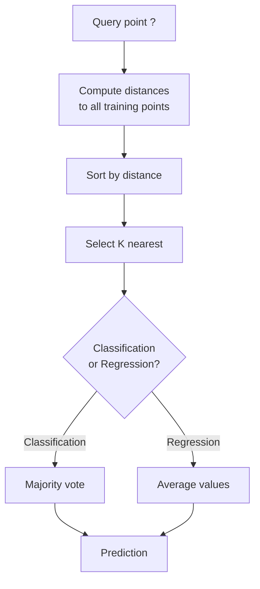
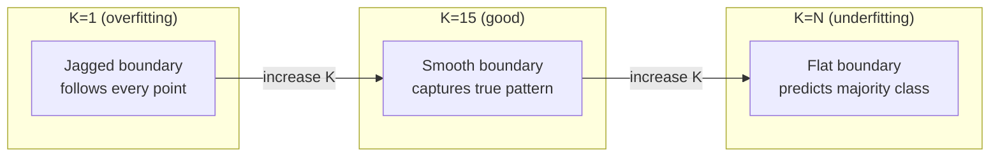
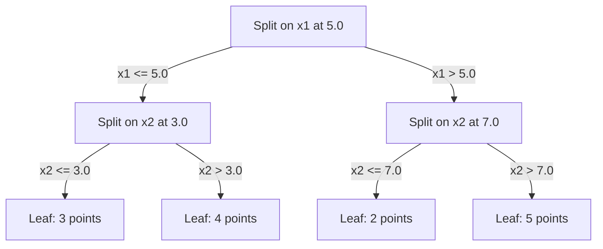

# K-Nearest Neighbors and Distances
# K 近邻与距离


> Store everything. Predict by looking at your neighbors. The simplest algorithm that actually works.

> 存储一切。预测时看看邻居。最简单但确实有效的算法。

**Type:** Build | **类型：** 构建
**Language:** Python | **语言：** Python
**Prerequisites:** Phase 1 (Lesson 14 Norms and Distances) | **前置知识：** Phase 1（第 14 课范数与距离）
**Time:** ~90 minutes | **时间：** 约 90 分钟

## Learning Objectives | 学习目标

- Implement KNN classification and regression from scratch with configurable K and distance-weighted voting
  从零实现可配置 K 值和距离加权投票的 KNN 分类和回归
- Compare L1, L2, cosine, and Minkowski distance metrics and select the appropriate one for a given data type
  比较 L1、L2、余弦和闵可夫斯基距离度量，为给定数据类型选择合适的度量
- Explain the curse of dimensionality and demonstrate why KNN degrades in high-dimensional spaces
  解释维度灾难，演示为什么 KNN 在高维空间中性能下降
- Build a KD-tree for efficient nearest neighbor search and analyze when it outperforms brute-force
  构建 KD 树进行高效最近邻搜索，分析它何时优于暴力搜索


> **【中文解读】**
> KNN 的核心思想是近朱者赤——看离你最近的 K 个邻居是什么类别，你就预测什么类别。推荐系统中的找相似用户就是 KNN 思想。sklearn 中的 KNeighborsClassifier。

> **【拓展：KNN 思想在现代 AI 中的广泛应用】**
> RAG（检索增强生成）本质就是 KNN：将用户问题编码为向量，在向量数据库（Pinecone、Milvus、FAISS）中搜索 K 个最相似的文档片段，再将它们提供给 LLM 生成回答。Spotify 的音乐推荐用近似最近邻（ANN）在数亿首歌中找相似的；Pinterest 的图片搜索用视觉 embedding + KNN。KNN 的思想无处不在，只是数据结构和规模不同。

## The Problem | 问题引入

You have a dataset. A new data point arrives. You need to classify it or predict its value. Instead of learning parameters from the data (like linear regression or SVMs), you just find the K training points closest to the new point and let them vote.

> 你有一个数据集。一个新数据点到来。你需要对它分类或预测其值。你不需要从数据中学习参数（如线性回归或 SVM），而是找到离新点最近的 K 个训练点，让它们投票。

This is K-nearest neighbors. There is no training phase. No parameters to learn. No loss function to minimize. You store the entire training set and compute distances at prediction time.

> 这就是 K 近邻。没有训练阶段。没有需要学习的参数。没有需要最小化的损失函数。你存储整个训练集，在预测时计算距离。

It sounds too simple to work. But KNN is surprisingly competitive for many problems, especially with small to medium datasets, and understanding it deeply reveals fundamental concepts: the choice of distance metric (connecting to Phase 1 Lesson 14), the curse of dimensionality, and the difference between lazy and eager learning.

> 听起来太简单了，但 KNN 在许多问题上出奇地有竞争力，尤其对于中小数据集。深入理解它揭示了基本概念：距离度量的选择（连接 Phase 1 第 14 课）、维度灾难以及懒惰学习与积极学习的区别。

KNN also shows up everywhere in modern AI, just under different names. Vector databases do KNN search over embeddings. Retrieval-augmented generation (RAG) finds the K nearest document chunks. Recommendation systems find similar users or items. The algorithm is the same. The scale and the data structures are different.

> KNN 在现代 AI 中无处不在，只是名称不同。向量数据库在 embedding 上做 KNN 搜索。检索增强生成（RAG）找 K 个最近的文档片段。推荐系统找相似用户或物品。算法是相同的，只是规模和数据结构不同。

> **【中文解读】**
> KNN 是"懒惰学习"——没有训练过程，预测时才计算距离。核心三要素：K 值选择（太小→过拟合噪声，太大→欠拟合）、距离度量（欧氏、曼哈顿、余弦等）、投票规则（等权或距离加权）。KNN 的缺点：高维空间中距离失去意义（维度灾难），大数据集预测慢（需要与所有训练点比较）。

## The Concept | 核心概念

### How KNN works

Given a dataset of labeled points and a new query point:

> 给定一个带标签的数据集和一个新的查询点：

1. Compute the distance from the query to every point in the dataset
   计算查询点到数据集中每个点的距离
2. Sort by distance
   按距离排序
3. Take the K closest points
   取 K 个最近的点
4. For classification: majority vote among the K neighbors
   分类任务：K 个邻居中多数投票
5. For regression: average (or weighted average) of the K neighbors' values
   回归任务：K 个邻居值的平均（或加权平均）



That is the entire algorithm. No fitting. No gradient descent. No epochs.

> 这就是整个算法。没有拟合。没有梯度下降。没有迭代轮次。

### Choosing K

K is the single hyperparameter. It controls the bias-variance trade-off:

> K 是唯一的超参数。它控制偏差-方差权衡：

| K | Behavior |
|---|----------|
| K = 1 | Decision boundary follows every point. Zero training error. High variance. Overfits |
| Small K (3-5) | Sensitive to local structure. Can capture complex boundaries |
| Large K | Smoother boundaries. More robust to noise. May underfit |
| K = N | Predicts the majority class for every point. Maximum bias |

| K | 行为 |
|---|------|
| K = 1 | 决策边界跟随每个点。训练误差为零。高方差。过拟合 |
| 小 K (3-5) | 对局部结构敏感。能捕捉复杂边界 |
| 大 K | 更平滑的边界。对噪声更鲁棒。可能欠拟合 |
| K = N | 每个点都预测多数类。最大偏差 |

A common starting point is K = sqrt(N) for a dataset of N points. Use odd K for binary classification to avoid ties.

> 常用的初始值是 K = sqrt(N)（N 为数据集大小）。二分类使用奇数 K 以避免平票。



### Distance metrics

The distance function defines what "near" means. Different metrics produce different neighbors, different predictions.

> 距离函数定义了"近"的含义。不同的度量产生不同的邻居，不同的预测。

**L2 (Euclidean)** is the default. Straight-line distance.

> **L2（欧氏距离）**是默认选择。直线距离。

```
d(a, b) = sqrt(sum((a_i - b_i)^2))
```

Sensitive to feature scale. Always standardize features before using L2 with KNN.

> 对特征尺度敏感。在 KNN 中使用 L2 前务必标准化特征。

**L1 (Manhattan)** sums absolute differences. More robust to outliers than L2 because it does not square the differences.

> **L1（曼哈顿距离）**对绝对差值求和。比 L2 更鲁棒，因为它不平方差值。

```
d(a, b) = sum(|a_i - b_i|)
```

**Cosine distance** measures the angle between vectors, ignoring magnitude. Essential for text and embedding data.

> **余弦距离**衡量向量之间的角度，忽略大小。对文本和嵌入数据至关重要。

```
d(a, b) = 1 - (a . b) / (||a|| * ||b||)
```

**Minkowski** generalizes L1 and L2 with parameter p.

> **闵可夫斯基距离**用参数 p 推广了 L1 和 L2。

```
d(a, b) = (sum(|a_i - b_i|^p))^(1/p)

p=1: Manhattan
p=2: Euclidean
p->inf: Chebyshev (max absolute difference)
```

Which metric to use depends on the data:

> 选择哪种度量取决于数据：

| Data type | Best metric | Why |
|-----------|------------|-----|
| Numeric features, similar scale | L2 (Euclidean) | Default, works for spatial data |
| Numeric features, outliers | L1 (Manhattan) | Robust, does not amplify large differences |
| Text embeddings | Cosine | Magnitude is noise, direction is meaning |
| High-dimensional sparse | Cosine or L1 | L2 suffers from curse of dimensionality |
| Mixed types | Custom distance | Combine metrics per feature type |

| 数据类型 | 最佳度量 | 原因 |
|---------|--------|------|
| 数值特征，量级相近 | L2（欧氏） | 默认选择，适合空间数据 |
| 数值特征，有异常值 | L1（曼哈顿） | 鲁棒，不放大大的差异 |
| 文本嵌入 | 余弦 | 大小是噪声，方向是含义 |
| 高维稀疏 | 余弦或 L1 | L2 受维度灾难影响 |
| 混合类型 | 自定义距离 | 按特征类型组合度量 |

### Weighted KNN

Standard KNN gives equal weight to all K neighbors. But a neighbor at distance 0.1 should matter more than one at distance 5.0.

> 标准 KNN 对所有 K 个邻居赋予相同权重。但距离 0.1 的邻居应该比距离 5.0 的更重要。

**Distance-weighted KNN** weights each neighbor inversely by distance:

> **距离加权 KNN**按距离的倒数加权每个邻居：

```
weight_i = 1 / (distance_i + epsilon)

For classification: weighted vote
For regression:     weighted average = sum(w_i * y_i) / sum(w_i)
```

The epsilon prevents division by zero when a query point exactly matches a training point.

> epsilon 防止当查询点完全匹配训练点时除以零。

Weighted KNN is less sensitive to the choice of K because distant neighbors contribute very little regardless.

> 加权 KNN 对 K 的选择不太敏感，因为远距离的邻居无论 K 值如何贡献都很小。

### The curse of dimensionality

KNN performance degrades in high dimensions. This is not a vague concern. It is a mathematical fact.

> KNN 性能在高维中退化。这不是模糊的担忧，而是数学事实。

**Problem 1: distances converge.** As dimensionality increases, the ratio of the maximum distance to the minimum distance approaches 1. All points become equally "far" from the query.

> **问题 1：距离趋同。** 随着维度增加，最大距离与最小距离的比值趋近于 1。所有点变得与查询点"等距"。

```
In d dimensions, for random uniform points:

d=2:    max_dist / min_dist = varies widely
d=100:  max_dist / min_dist ~ 1.01
d=1000: max_dist / min_dist ~ 1.001

When all distances are nearly equal, "nearest" is meaningless.
```

**Problem 2: volume explodes.** To capture K neighbors within a fixed fraction of the data, you need to extend your search radius to cover a much larger fraction of the feature space. The "neighborhood" in high dimensions encompasses most of the space.

> **问题 2：体积爆炸。** 要在数据的固定比例内捕获 K 个邻居，需要将搜索半径扩展到覆盖特征空间的更大比例。高维中的"邻域"覆盖了大部分空间。

**Problem 3: corners dominate.** In a unit hypercube in d dimensions, most of the volume is concentrated near the corners, not the center. A sphere inscribed in the cube contains a vanishing fraction of the volume as d grows.

> **问题 3：角落主导。** 在 d 维单位超立方体中，大部分体积集中在角落附近，而非中心。随着 d 增长，立方体内切球包含的体积比例趋近于零。

Practical consequence: KNN works well up to about 20-50 features. Beyond that, you need dimensionality reduction (PCA, UMAP, t-SNE) before applying KNN, or you need to use tree-based search structures that exploit the data's intrinsic lower dimensionality.

> 实际后果：KNN 在约 20-50 个特征以下效果良好。超过这个范围，需要在应用 KNN 前进行降维（PCA、UMAP、t-SNE），或使用利用数据内在低维性的树搜索结构。

### KD-trees: fast nearest neighbor search

Brute-force KNN computes the distance from the query to every training point. That is O(n * d) per query. For large datasets, this is too slow.

> 暴力 KNN 计算查询点到每个训练点的距离。每次查询 O(n * d)。对于大数据集太慢了。

A KD-tree recursively partitions the space along feature axes. At each level, it splits along one dimension at the median value.

> KD 树沿特征轴递归划分空间。每层沿一个维度在中值处分裂。



To find the nearest neighbor, traverse the tree to the leaf containing the query, then backtrack and check neighboring partitions only if they could contain closer points.

> 要找到最近邻，遍历树到包含查询点的叶节点，然后回溯并只在相邻分区可能包含更近点时检查。

Average query time: O(log n) for low dimensions. But KD-trees degrade to O(n) in high dimensions (d > 20) because the backtracking eliminates fewer and fewer branches.

> 低维平均查询时间：O(log n)。但 KD 树在高维（d > 20）时退化为 O(n)，因为回溯消除的分支越来越少。

### Ball trees: better for moderate dimensions

Ball trees partition data into nested hyperspheres instead of axis-aligned boxes. Each node defines a ball (center + radius) that contains all points in that subtree.

> 球树将数据划分为嵌套的超球面而非轴对齐的盒子。每个节点定义一个包含该子树所有点的球（中心 + 半径）。

Advantages over KD-trees:
- Work better in moderate dimensions (up to ~50)
  在中等维度（最高约 50）效果更好
- Handle non-axis-aligned structure
  能处理非轴对齐结构
- Tighter bounding volumes mean more branches are pruned during search
  更紧的包围体意味着搜索时剪枝更多分支

Both KD-trees and ball trees are exact algorithms. For truly large-scale search (millions of points, hundreds of dimensions), approximate nearest neighbor methods (HNSW, IVF, product quantization) are used instead. These are covered in Phase 1 Lesson 14.

> KD 树和球树都是精确算法。对于真正大规模的搜索（百万点、数百维），使用近似最近邻方法（HNSW、IVF、乘积量化）。这些在 Phase 1 第 14 课中讨论。

### Lazy learning vs eager learning

KNN is a lazy learner: it does no work at training time and all work at prediction time. Most other algorithms (linear regression, SVMs, neural networks) are eager learners: they do heavy computation at training time to build a compact model, then predictions are fast.

> KNN 是懒惰学习器：训练时不做任何工作，所有工作在预测时完成。大多数其他算法（线性回归、SVM、神经网络）是积极学习器：训练时做大量计算构建紧凑模型，然后预测很快。

| Aspect | Lazy (KNN) | Eager (SVM, neural net) |
|--------|------------|------------------------|
| Training time | O(1) just store data | O(n * epochs) |
| Prediction time | O(n * d) per query | O(d) or O(parameters) |
| Memory at prediction | Store entire training set | Store model parameters only |
| Adapts to new data | Add points instantly | Retrain the model |
| Decision boundary | Implicit, computed on the fly | Explicit, fixed after training |

| 方面 | 懒惰学习 (KNN) | 积极学习 (SVM, 神经网络) |
|------|---------------|------------------------|
| 训练时间 | O(1) 仅存储数据 | O(n * epochs) |
| 预测时间 | 每次查询 O(n * d) | O(d) 或 O(参数) |
| 预测时内存 | 存储整个训练集 | 仅存储模型参数 |
| 适应新数据 | 即时添加点 | 重新训练模型 |
| 决策边界 | 隐式，即时计算 | 显式，训练后固定 |

Lazy learning is ideal when:
- The dataset changes frequently (add/remove points without retraining)
  数据集频繁变化（无需重训练即可添加/删除点）
- You need predictions for very few queries
  只需对很少的查询做预测
- You want zero training time
  需要零训练时间
- The dataset is small enough that brute-force search is fast
  数据集足够小，暴力搜索很快

> 懒惰学习在以下情况最理想：

### KNN for regression

Instead of majority voting, KNN for regression averages the target values of the K neighbors.

> KNN 回归不使用多数投票，而是对 K 个邻居的目标值取平均。

```
prediction = (1/K) * sum(y_i for i in K nearest neighbors)

Or with distance weighting:
prediction = sum(w_i * y_i) / sum(w_i)
where w_i = 1 / distance_i
```

KNN regression produces piecewise-constant (or piecewise-smooth with weighting) predictions. It cannot extrapolate beyond the range of the training data. If the training targets are all between 0 and 100, KNN will never predict 200.

> KNN 回归产生分段常数（或加权时分段光滑）的预测。它不能外推到训练数据范围之外。如果训练目标值都在 0-100 之间，KNN 永远不会预测 200。

> **【中文解读】**
> KNN 回归用 K 个最近邻的目标值取平均（或距离加权平均）作为预测值。与分类不同，回归产生分段常数或分段光滑的预测面。KNN 回归不能外推——如果训练目标值都在 0-100 之间，它永远不会预测 200。这是所有"基于实例"方法的共同限制。

> **【拓展：大规模最近邻搜索——从 KNN 到 FAISS】**
> 当数据规模从数千增长到数十亿时，精确 KNN 搜索太慢。Meta 开源的 FAISS 库使用乘积量化（PQ）和倒排文件索引（IVF），在 10 亿级向量中实现毫秒级搜索。HNSW（分层可导航小世界图）是另一种流行算法，被 Elasticsearch 和 Milvus 采用。这些近似最近邻（ANN）方法牺牲少量精度换取 100-1000 倍的搜索加速。

## Build It | 动手实现

### Step 1: Distance functions

Implement L1, L2, cosine, and Minkowski distances. These connect directly to Phase 1 Lesson 14.

> 实现 L1、L2、余弦和闵可夫斯基距离。这些直接连接到 Phase 1 第 14 课。

```python
import math

def l2_distance(a, b):
    return math.sqrt(sum((ai - bi) ** 2 for ai, bi in zip(a, b)))  # 欧氏距离（L2 范数）

def l1_distance(a, b):
    return sum(abs(ai - bi) for ai, bi in zip(a, b))  # 曼哈顿距离（L1 范数）

def cosine_distance(a, b):
    dot_val = sum(ai * bi for ai, bi in zip(a, b))  # 点积
    norm_a = math.sqrt(sum(ai ** 2 for ai in a))  # 向量 a 的模
    norm_b = math.sqrt(sum(bi ** 2 for bi in b))  # 向量 b 的模
    if norm_a == 0 or norm_b == 0:
        return 1.0
    return 1.0 - dot_val / (norm_a * norm_b)  # 余弦距离 = 1 - 余弦相似度

def minkowski_distance(a, b, p=2):
    if p == float('inf'):
        return max(abs(ai - bi) for ai, bi in zip(a, b))  # p=∞ 时为切比雪夫距离
    return sum(abs(ai - bi) ** p for ai, bi in zip(a, b)) ** (1 / p)  # 闵可夫斯基距离
```

### Step 2: KNN classifier and regressor

Build the full KNN with configurable K, distance metric, and optional distance weighting.

> 构建完整的 KNN，支持可配置 K、距离度量和可选的距离加权。

```python
class KNN:
    def __init__(self, k=5, distance_fn=l2_distance, weighted=False,
                 task="classification"):
        self.k = k
        self.distance_fn = distance_fn
        self.weighted = weighted
        self.task = task
        self.X_train = None
        self.y_train = None

    def fit(self, X, y):
        self.X_train = X
        self.y_train = y

    def predict(self, X):
        return [self._predict_one(x) for x in X]
```

### Step 3: KD-tree for efficient search

Build a KD-tree from scratch that recursively splits on the median of each dimension.

> 从零构建 KD 树，沿每个维度的中值递归分裂。

```python
class KDTree:
    def __init__(self, X, indices=None, depth=0):
        # Recursively partition the data
        self.axis = depth % len(X[0])
        # Split on median of the current axis
        ...

    def query(self, point, k=1):
        # Traverse to leaf, then backtrack
        ...
```

See `code/knn.py` for the complete implementation with all helper methods and demos.

> 完整实现（含所有辅助方法和演示）见 `code/knn.py`。

### Step 4: Feature scaling

KNN requires feature scaling because distances are sensitive to feature magnitudes. A feature ranging from 0 to 1000 will dominate a feature ranging from 0 to 1.

> KNN 需要特征缩放，因为距离对特征量级敏感。范围 0-1000 的特征会主导范围 0-1 的特征。

```python
def standardize(X):
    n = len(X)
    d = len(X[0])
    means = [sum(X[i][j] for i in range(n)) / n for j in range(d)]
    stds = [
        max(1e-10, (sum((X[i][j] - means[j]) ** 2 for i in range(n)) / n) ** 0.5)
        for j in range(d)
    ]
    return [[((X[i][j] - means[j]) / stds[j]) for j in range(d)] for i in range(n)], means, stds
```

## Use It | 用框架实现

With scikit-learn:

> 使用 scikit-learn：

```python
from sklearn.neighbors import KNeighborsClassifier
from sklearn.preprocessing import StandardScaler
from sklearn.pipeline import Pipeline

clf = Pipeline([
    ("scaler", StandardScaler()),
    ("knn", KNeighborsClassifier(n_neighbors=5, metric="euclidean")),
])
clf.fit(X_train, y_train)
print(f"Accuracy: {clf.score(X_test, y_test):.4f}")
```

Scikit-learn automatically uses KD-trees or ball trees when the dataset is large enough and the dimensionality is low enough. For high-dimensional data, it falls back to brute force. You can control this with the `algorithm` parameter.

> Scikit-learn 在数据集足够大且维度足够低时自动使用 KD 树或球树。对于高维数据，它会退回暴力搜索。你可以通过 `algorithm` 参数控制。

For large-scale nearest neighbor search (millions of vectors), use FAISS, Annoy, or a vector database:

> 对于大规模最近邻搜索（百万向量），使用 FAISS、Annoy 或向量数据库：

```python
import faiss

index = faiss.IndexFlatL2(dimension)
index.add(embeddings)
distances, indices = index.search(query_vectors, k=5)
```

> **【拓展：从 KNN 到向量数据库——AI 基础设施的演进】**
> KNN 的思想是现代 AI 基础设施的核心。RAG（检索增强生成）用 KNN 在向量数据库中搜索相关文档；推荐系统用近似最近邻（ANN）在数亿向量中找到相似商品；图像搜索用 CLIP embedding + FAISS 实现跨模态检索。向量数据库市场（Pinecone、Milvus、Weaviate、Qdrant）预计在 2025 年达到 40 亿美元规模，其核心算法仍然是 KNN 的高效变体。

## Exercises | 练习题

1. Implement KNN classification on a 2D dataset with 3 classes. Plot the decision boundary for K=1, K=5, K=15, and K=N. Observe the transition from overfitting to underfitting.
   1. 在 3 类 2D 数据集上实现 KNN 分类。绘制 K=1、K=5、K=15 和 K=N 的决策边界。观察从过拟合到欠拟合的转变。

2. Generate 1000 random points in 2, 5, 10, 50, 100, and 500 dimensions. For each dimensionality, compute the ratio of the maximum pairwise distance to the minimum pairwise distance. Plot the ratio vs dimensionality to visualize the curse of dimensionality.
   2. 在 2、5、10、50、100 和 500 维中各生成 1000 个随机点。对于每个维度，计算最大成对距离与最小成对距离的比值。绘制比值与维度的关系图，可视化维度灾难。

3. Compare L1, L2, and cosine distance for KNN on a text classification problem (use TF-IDF vectors). Which metric gives the best accuracy? Why does cosine tend to win for text?
   3. 在文本分类问题（使用 TF-IDF 向量）上比较 L1、L2 和余弦距离。哪个度量准确率最高？为什么余弦在文本上通常最好？

4. Implement a KD-tree and measure query time vs brute force for datasets of 1k, 10k, and 100k points in 2D, 10D, and 50D. At what dimensionality does the KD-tree stop being faster than brute force?
   4. 实现 KD 树，测量 1k、10k 和 100k 点在 2D、10D 和 50D 中的查询时间与暴力搜索的对比。在什么维度下 KD 树不再比暴力搜索快？

5. Build a weighted KNN regressor for y = sin(x) + noise. Compare it with unweighted KNN for K=3, 10, 30. Show that weighting produces smoother predictions, especially for large K.
   5. 为 y = sin(x) + noise 构建加权 KNN 回归器。在 K=3、10、30 时与未加权 KNN 比较。展示加权产生更光滑的预测，尤其在大 K 时。

## Key Terms | 术语速查表

| Term | What it actually means |
|------|----------------------|
| K-nearest neighbors | Non-parametric algorithm that predicts by finding the K closest training points to a query |
| Lazy learning | No computation at training time. All work happens at prediction time. KNN is the canonical example |
| Eager learning | Heavy computation at training time to build a compact model. Most ML algorithms are eager |
| Curse of dimensionality | In high dimensions, distances converge and neighborhoods expand to cover most of the space, making KNN ineffective |
| KD-tree | Binary tree that recursively partitions space along feature axes. O(log n) queries in low dimensions |
| Ball tree | Tree of nested hyperspheres. Works better than KD-trees in moderate dimensions (up to ~50) |
| Weighted KNN | Neighbors weighted inversely by distance. Closer neighbors have more influence on the prediction |
| Feature scaling | Normalizing features to comparable ranges. Required for distance-based methods like KNN |
| Majority vote | Classification by counting which class is most common among K neighbors |
| Brute force search | Computing distance to every training point. O(n*d) per query. Exact but slow for large n |
| Approximate nearest neighbor | Algorithms (HNSW, LSH, IVF) that find approximately nearest points much faster than exact search |
| Voronoi diagram | The partition of space where each region contains all points closer to one training point than any other. K=1 KNN produces Voronoi boundaries |

## Further Reading | 延伸阅读

- [Cover & Hart: Nearest Neighbor Pattern Classification (1967)](https://ieeexplore.ieee.org/document/1053964) - the foundational KNN paper proving it has error rate at most twice the Bayes optimal
  [Cover & Hart: Nearest Neighbor Pattern Classification (1967)](https://ieeexplore.ieee.org/document/1053964) - 证明 KNN 错误率最多是贝叶斯最优两倍的奠基论文
- [Friedman, Bentley, Finkel: An Algorithm for Finding Best Matches in Logarithmic Expected Time (1977)](https://dl.acm.org/doi/10.1145/355744.355745) - the original KD-tree paper
  [Friedman, Bentley, Finkel: An Algorithm for Finding Best Matches in Logarithmic Expected Time (1977)](https://dl.acm.org/doi/10.1145/355744.355745) - KD 树原始论文
- [Beyer et al.: When Is "Nearest Neighbor" Meaningful? (1999)](https://link.springer.com/chapter/10.1007/3-540-49257-7_15) - formal analysis of the curse of dimensionality for nearest neighbor
  [Beyer et al.: When Is "Nearest Neighbor" Meaningful? (1999)](https://link.springer.com/chapter/10.1007/3-540-49257-7_15) - 最近邻维度灾难的正式分析
- [scikit-learn Nearest Neighbors documentation](https://scikit-learn.org/stable/modules/neighbors.html) - practical guide with algorithm selection
  [scikit-learn 最近邻文档](https://scikit-learn.org/stable/modules/neighbors.html) - 实用指南及算法选择
- [FAISS: A Library for Efficient Similarity Search](https://github.com/facebookresearch/faiss) - Meta's library for billion-scale approximate nearest neighbor search
  [FAISS](https://github.com/facebookresearch/faiss) - Meta 的十亿级近似最近邻搜索库
