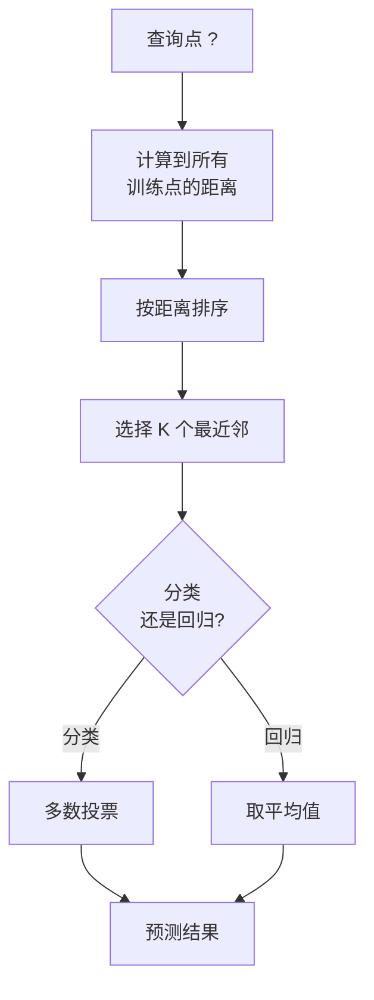
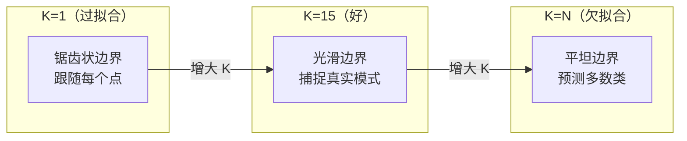
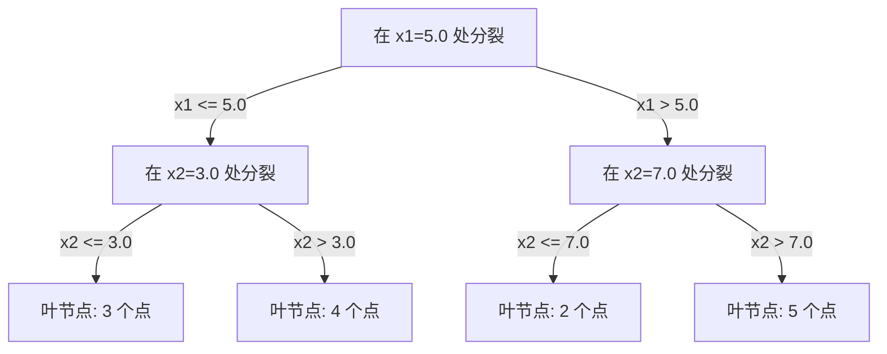

# K 近邻与距离

> 存储一切。预测时看看邻居。最简单但确实有效的算法。

**类型：** 构建
**语言：** Python
**前置知识：** Phase 1（第 14 课范数与距离）
**时长：** 约 90 分钟

## 学习目标

- 从零实现可配置 K 值和距离加权投票的 KNN 分类和回归
- 比较 L1、L2、余弦和闵可夫斯基距离度量，为给定数据类型选择合适的度量
- 解释维度灾难，演示为什么 KNN 在高维空间中性能下降
- 构建 KD 树进行高效最近邻搜索，分析它何时优于暴力搜索

## 问题引入

你有一个数据集。一个新的数据点来了。你需要对它分类或预测其值。与从数据中学习参数（如线性回归或 SVM）不同，你只需找到离新点最近的 K 个训练点，让它们投票。

这就是 K 近邻 (K-Nearest Neighbors)。没有训练阶段。没有要学习的参数。没有要最小化的损失函数。你存储整个训练集，在预测时计算距离。

听起来太简单以至于不能工作。但 KNN 在许多问题上出人意料地有竞争力，尤其是中小型数据集。深入理解它揭示了基本概念：距离度量的选择（关联 Phase 1 第 14 课）、维度灾难，以及懒惰学习和急切学习的区别。

KNN 也以不同的名字出现在现代 AI 的各个角落。向量数据库对嵌入做 KNN 搜索。检索增强生成 (RAG) 找到 K 个最近的文档片段。推荐系统找相似的用户或物品。算法相同，只是规模和数据结构不同。

## 核心概念

### KNN 如何工作

给定带标签的数据点和一个新的查询点：

1. 计算查询点到数据集中每个点的距离
2. 按距离排序
3. 取最近的 K 个点
4. 分类任务：K 个邻居中多数投票
5. 回归任务：K 个邻居值的平均（或加权平均）



这就是全部算法。没有拟合。没有梯度下降。没有迭代。

### 选择 K

K 是唯一的超参数。它控制偏差-方差权衡：

| K | 行为 |
|---|------|
| K = 1 | 决策边界跟随每个点。零训练误差。高方差。过拟合 |
| 小 K（3-5） | 对局部结构敏感。能捕捉复杂边界 |
| 大 K | 更光滑的边界。对噪声更鲁棒。可能欠拟合 |
| K = N | 对每个点都预测多数类。最大偏差 |

常见的起点是 K = sqrt(N)，其中 N 是数据集的点数。二分类用奇数 K 以避免平票。



### 距离度量

距离函数定义了"近"的含义。不同度量产生不同的邻居，不同的预测。

**L2（欧氏距离）** 是默认选择。直线距离。

```
d(a, b) = sqrt(sum((a_i - b_i)^2))
```

对特征尺度敏感。使用 L2 KNN 前务必标准化特征。

**L1（曼哈顿距离）** 对绝对差求和。比 L2 更抗离群值，因为它不对差值取平方。

```
d(a, b) = sum(|a_i - b_i|)
```

**余弦距离** 衡量向量之间的角度，忽略大小。对文本和嵌入数据至关重要。

```
d(a, b) = 1 - (a . b) / (||a|| * ||b||)
```

**闵可夫斯基距离 (Minkowski)** 用参数 p 推广了 L1 和 L2。

```
d(a, b) = (sum(|a_i - b_i|^p))^(1/p)

p=1: 曼哈顿距离
p=2: 欧氏距离
p->inf: 切比雪夫距离（最大绝对差）
```

选择哪个度量取决于数据：

| 数据类型 | 最佳度量 | 原因 |
|---------|---------|------|
| 数值特征，尺度相似 | L2（欧氏） | 默认，适合空间数据 |
| 数值特征，有离群值 | L1（曼哈顿） | 鲁棒，不会放大大的差异 |
| 文本嵌入 | 余弦 | 大小是噪声，方向是含义 |
| 高维稀疏数据 | 余弦或 L1 | L2 受维度灾难影响 |
| 混合类型 | 自定义距离 | 按特征类型组合度量 |

### 加权 KNN

标准 KNN 对所有 K 个邻居赋予相同权重。但距离 0.1 的邻居应该比距离 5.0 的邻居更重要。

**距离加权 KNN** 按距离的倒数对每个邻居加权：

```
weight_i = 1 / (distance_i + epsilon)

分类: 加权投票
回归:  加权平均 = sum(w_i * y_i) / sum(w_i)
```

epsilon 防止当查询点恰好匹配训练点时除以零。

加权 KNN 对 K 值的选择不太敏感，因为远距离的邻居无论 K 多大都贡献很小。

### 维度灾难

KNN 性能在高维中退化。这不是模糊的担忧，而是数学事实。

**问题 1：距离趋同。** 随着维度增加，最大距离与最小距离之比趋近于 1。所有点变得与查询点"等距"。

```
在 d 维中，对于随机均匀点：

d=2:    max_dist / min_dist = 变化很大
d=100:  max_dist / min_dist ~ 1.01
d=1000: max_dist / min_dist ~ 1.001

当所有距离几乎相等时，"最近"就没有意义了。
```

**问题 2：体积爆炸。** 为了在数据的固定比例内捕获 K 个邻居，你需要将搜索半径扩展到覆盖特征空间的更大比例。高维中的"邻域"涵盖了大部分空间。

**问题 3：角落主导。** 在 d 维的单位超立方体中，大部分体积集中在角落附近，而非中心。内切球体包含的体积比例随 d 增长趋近于零。

实际影响：KNN 在约 20-50 个特征以内效果良好。超过这个范围，需要在应用 KNN 前进行降维（PCA、UMAP、t-SNE），或使用能利用数据内在低维结构的树形搜索。

### KD 树：快速最近邻搜索

暴力 KNN 计算查询点到每个训练点的距离。每个查询 O(n * d)。对于大数据集，这太慢了。

KD 树沿特征轴递归划分空间。在每一层，沿一个维度在中位数处分裂。



要找最近邻，遍历树到包含查询点的叶节点，然后回溯并只在可能包含更近点的相邻分区中检查。

平均查询时间：低维时 O(log n)。但 KD 树在高维（d > 20）时退化为 O(n)，因为回溯消除的分支越来越少。

### 球树：更适合中等维度

球树将数据划分为嵌套的超球体而非轴对齐的盒子。每个节点定义一个球（中心 + 半径），包含该子树中的所有点。

相比 KD 树的优势：
- 在中等维度（约 50 维以内）表现更好
- 处理非轴对齐的结构
- 更紧密的包围体积意味着搜索时剪枝更多分支

KD 树和球树都是精确算法。对于真正的大规模搜索（数百万点、数百维），使用近似最近邻方法（HNSW、IVF、乘积量化）。

### 懒惰学习与急切学习

KNN 是懒惰学习器 (Lazy Learner)：训练时不做任何工作，预测时做所有工作。大多数其他算法（线性回归、SVM、神经网络）是急切学习器 (Eager Learner)：训练时做大量计算以构建紧凑模型，然后预测很快。

| 方面 | 懒惰（KNN） | 急切（SVM、神经网络） |
|------|------------|---------------------|
| 训练时间 | O(1)，只存数据 | O(n * epochs) |
| 预测时间 | 每次查询 O(n * d) | O(d) 或 O(参数量) |
| 预测时内存 | 存储整个训练集 | 只存模型参数 |
| 适应新数据 | 即时添加点 | 重新训练模型 |
| 决策边界 | 隐式的，即时计算 | 显式的，训练后固定 |

懒惰学习适合以下场景：
- 数据集频繁变化（无需重新训练即可添加/删除点）
- 需要对很少的查询做预测
- 你需要零训练时间
- 数据集小到暴力搜索足够快

### KNN 用于回归

KNN 回归不是多数投票，而是对 K 个邻居的目标值取平均。

```
prediction = (1/K) * sum(y_i for i in K nearest neighbors)

或距离加权:
prediction = sum(w_i * y_i) / sum(w_i)
其中 w_i = 1 / distance_i
```

KNN 回归产生分段常数（或加权时分段光滑）的预测。它不能外推到训练数据范围之外。如果训练目标值都在 0 到 100 之间，KNN 永远不会预测 200。

## 动手实现

### 步骤 1：距离函数

实现 L1、L2、余弦和闵可夫斯基距离。这些直接关联 Phase 1 第 14 课。

```python
import math

def l2_distance(a, b):
    return math.sqrt(sum((ai - bi) ** 2 for ai, bi in zip(a, b)))  # 欧氏距离（L2 范数）

def l1_distance(a, b):
    return sum(abs(ai - bi) for ai, bi in zip(a, b))  # 曼哈顿距离（L1 范数）

def cosine_distance(a, b):
    dot_val = sum(ai * bi for ai, bi in zip(a, b))  # 点积
    norm_a = math.sqrt(sum(ai ** 2 for ai in a))  # 向量 a 的模
    norm_b = math.sqrt(sum(bi ** 2 for bi in b))  # 向量 b 的模
    if norm_a == 0 or norm_b == 0:
        return 1.0
    return 1.0 - dot_val / (norm_a * norm_b)  # 余弦距离 = 1 - 余弦相似度

def minkowski_distance(a, b, p=2):
    if p == float('inf'):
        return max(abs(ai - bi) for ai, bi in zip(a, b))  # p=inf 时为切比雪夫距离
    return sum(abs(ai - bi) ** p for ai, bi in zip(a, b)) ** (1 / p)  # 闵可夫斯基距离
```

### 步骤 2：KNN 分类器和回归器

构建支持可配置 K、距离度量和可选距离加权的完整 KNN。

```python
class KNN:
    def __init__(self, k=5, distance_fn=l2_distance, weighted=False,
                 task="classification"):
        self.k = k
        self.distance_fn = distance_fn
        self.weighted = weighted
        self.task = task
        self.X_train = None
        self.y_train = None

    def fit(self, X, y):
        self.X_train = X
        self.y_train = y

    def predict(self, X):
        return [self._predict_one(x) for x in X]
```

### 步骤 3：KD 树高效搜索

从零构建 KD 树，在每个维度的中位数上递归分裂。

```python
class KDTree:
    def __init__(self, X, indices=None, depth=0):
        # 递归划分数据
        self.axis = depth % len(X[0])
        # 在当前轴的中位数处分裂
        ...

    def query(self, point, k=1):
        # 遍历到叶节点，然后回溯
        ...
```

完整实现（含所有辅助方法和演示）见 `code/knn.py`。

### 步骤 4：特征缩放

KNN 需要特征缩放，因为距离对特征量级敏感。范围 0-1000 的特征会主导范围 0-1 的特征。

```python
def standardize(X):
    n = len(X)
    d = len(X[0])
    means = [sum(X[i][j] for i in range(n)) / n for j in range(d)]
    stds = [
        max(1e-10, (sum((X[i][j] - means[j]) ** 2 for i in range(n)) / n) ** 0.5)
        for j in range(d)
    ]
    return [[((X[i][j] - means[j]) / stds[j]) for j in range(d)] for i in range(n)], means, stds
```

## 用框架实现

使用 scikit-learn：

```python
from sklearn.neighbors import KNeighborsClassifier
from sklearn.preprocessing import StandardScaler
from sklearn.pipeline import Pipeline

clf = Pipeline([
    ("scaler", StandardScaler()),
    ("knn", KNeighborsClassifier(n_neighbors=5, metric="euclidean")),
])
clf.fit(X_train, y_train)
print(f"准确率: {clf.score(X_test, y_test):.4f}")
```

scikit-learn 在数据集足够大且维度足够低时自动使用 KD 树或球树。对于高维数据，它回退到暴力搜索。你可以通过 `algorithm` 参数控制这一点。

对于大规模最近邻搜索（数百万向量），使用 FAISS、Annoy 或向量数据库：

```python
import faiss

index = faiss.IndexFlatL2(dimension)
index.add(embeddings)
distances, indices = index.search(query_vectors, k=5)
```

## 练习题

1. 在 3 类 2D 数据集上实现 KNN 分类。绘制 K=1、K=5、K=15 和 K=N 的决策边界。观察从过拟合到欠拟合的转变。

2. 在 2、5、10、50、100 和 500 维中各生成 1000 个随机点。对于每个维度，计算最大成对距离与最小成对距离的比值。绘制比值与维度的关系图，可视化维度灾难。

3. 在文本分类问题（使用 TF-IDF 向量）上比较 L1、L2 和余弦距离。哪个度量准确率最高？为什么余弦在文本上通常最好？

4. 实现 KD 树，测量 1k、10k 和 100k 点在 2D、10D 和 50D 中的查询时间与暴力搜索的对比。在什么维度下 KD 树不再比暴力搜索快？

5. 为 y = sin(x) + noise 构建加权 KNN 回归器。在 K=3、10、30 时与未加权 KNN 比较。展示加权产生更光滑的预测，尤其在大 K 时。

## 术语速查表

| 术语 | 实际含义 |
|------|---------|
| K 近邻 (KNN) | 通过找到离查询最近的 K 个训练点进行预测的非参数算法 |
| 懒惰学习 (Lazy Learning) | 训练时不做计算，所有工作在预测时完成。KNN 是典型例子 |
| 急切学习 (Eager Learning) | 训练时做大量计算构建紧凑模型。大多数 ML 算法是急切学习 |
| 维度灾难 (Curse of Dimensionality) | 高维中距离趋同、邻域扩大到覆盖大部分空间，使 KNN 失效 |
| KD 树 | 沿特征轴递归划分空间的二叉树。低维查询 O(log n) |
| 球树 (Ball Tree) | 嵌套超球体的树。在中等维度（约 50 维以内）比 KD 树更好 |
| 加权 KNN | 按距离倒数对邻居加权。更近的邻居对预测影响更大 |
| 特征缩放 (Feature Scaling) | 将特征归一化到可比较的范围。KNN 等基于距离的方法必需 |
| 多数投票 (Majority Vote) | 统计 K 个邻居中哪个类别最常见来进行分类 |
| 暴力搜索 (Brute Force) | 计算到每个训练点的距离。每次查询 O(n*d)。精确但对大 n 慢 |
| 近似最近邻 (ANN) | 算法（HNSW、LSH、IVF）能比精确搜索快得多地找到近似最近点 |
| Voronoi 图 | 空间的划分，每个区域包含比任何其他训练点更接近一个训练点的所有点。K=1 的 KNN 产生 Voronoi 边界 |

## 延伸阅读

- [Cover & Hart: Nearest Neighbor Pattern Classification (1967)](https://ieeexplore.ieee.org/document/1053964) - 证明 KNN 错误率最多是贝叶斯最优两倍的奠基论文
- [Friedman, Bentley, Finkel: An Algorithm for Finding Best Matches in Logarithmic Expected Time (1977)](https://dl.acm.org/doi/10.1145/355744.355745) - KD 树原始论文
- [Beyer et al.: When Is "Nearest Neighbor" Meaningful? (1999)](https://link.springer.com/chapter/10.1007/3-540-49257-7_15) - 最近邻维度灾难的正式分析
- [scikit-learn 最近邻文档](https://scikit-learn.org/stable/modules/neighbors.html) - 实用指南及算法选择
- [FAISS](https://github.com/facebookresearch/faiss) - Meta 的十亿级近似最近邻搜索库
