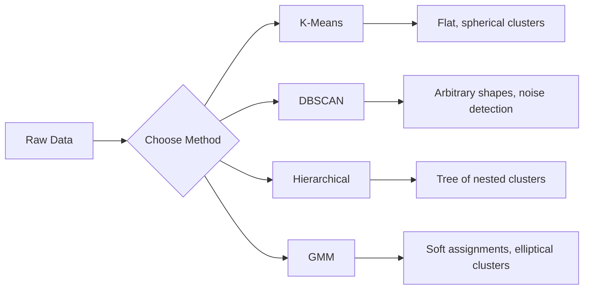

# Unsupervised Learning
# 无监督学习


> No labels, no teacher. The algorithm finds structure on its own.

> 没有标签，没有老师。算法自己发现结构。

**Type:** Build | **类型：** 构建
**Languages:** Python
**Prerequisites:** Phase 1 (Norms & Distances, Probability & Distributions), Phase 2 Lessons 1-6 | **前置知识：** Phase 1（范数与距离、概率与分布），Phase 2 第 1-6 课
**Time:** ~90 minutes | **时间：** 约 90 分钟

## Learning Objectives | 学习目标

- Implement K-Means, DBSCAN, and Gaussian Mixture Models from scratch and compare their clustering behavior
  从零实现 K-Means、DBSCAN 和高斯混合模型 (GMM)，比较它们的聚类行为
- Evaluate cluster quality using the silhouette score and the elbow method to select the optimal K
  使用轮廓系数和肘部法评估聚类质量，选择最优 K
- Explain when DBSCAN outperforms K-Means and identify which algorithm handles non-spherical clusters and outliers
  解释 DBSCAN 何时优于 K-Means，识别哪种算法能处理非球形簇和异常值
- Build an anomaly detection pipeline using clustering methods to flag points that deviate from normal patterns
  使用聚类方法构建异常检测管线，标记偏离正常模式的点


> **【中文解读】**
> 无监督学习没有标签，目标是发现数据中的结构。K-Means 是最经典的聚类算法，DBSCAN 能发现任意形状的簇。sklearn 中的 KMeans/DBSCAN。客户分群、异常检测是典型应用。

> **【拓展：无监督学习在真实 AI 系统中的价值】**
> Google Photos 的自动相册分组使用聚类算法将相似照片归类（人脸、地点、场景）；Spotify 的"发现"功能用聚类将用户分群后推荐；网络安全领域的异常检测用 DBSCAN/Isolation Forest 发现异常流量。在没有标签或标签获取成本极高的场景下，无监督学习是唯一的选项。

## The Problem | 问题引入

Every ML lesson so far has assumed labeled data: "here is an input, here is the correct output." In the real world, labels are expensive. A hospital has millions of patient records but no one has manually tagged each one with a disease category. An e-commerce site has millions of user sessions but no one has hand-labeled customer segments. A security team has network logs but nobody has flagged every anomaly.

> 之前的每一课都假设有标注数据："这是输入，这是正确输出。"在真实世界中，标注是昂贵的。一家医院有数百万患者记录，但没有人手动给每一条标注疾病类别。一个电商网站有数百万用户会话，但没有人手工标注客户分群。一个安全团队有网络日志，但没有人标记了每一个异常。

Unsupervised learning finds patterns without being told what to look for. It groups similar data points, discovers hidden structures, and surfaces anomalies. If supervised learning is learning from a textbook with an answer key, unsupervised learning is staring at raw data until the patterns reveal themselves.

> 无监督学习在没有被告知寻找什么的情况下发现模式。它将相似的数据点分组，发现隐藏结构，揭示异常。如果监督学习是从有答案的教科书学习，无监督学习就是盯着原始数据直到模式自己显现。

The catch: without labels, you cannot directly measure "right" or "wrong." You need different tools to evaluate whether the structure your algorithm found is meaningful.

> 关键问题：没有标签，你无法直接衡量"对"或"错"。你需要不同的工具来评估算法发现的结构是否有意义。

> **【中文解读】**
> 无监督学习的核心挑战是评估：没有标签就无法直接衡量"对错"。需要用轮廓系数、肘部法则等指标间接评估聚类质量。K-Means 假设簇是球形的且大小相近，对异常值敏感；DBSCAN 能发现任意形状的簇并自动识别噪声点，但需要设置密度参数。

## The Concept | 核心概念

### Clustering: Grouping Similar Things Together

Clustering assigns each data point to a group (cluster) so that points within the same group are more similar to each other than to points in other groups. The question is always: what does "similar" mean?

> 聚类将每个数据点分配到一个组（簇），使同一组内的点比其他组的点更相似。问题始终是："相似"意味着什么？



### K-Means: The Workhorse

K-Means partitions data into exactly K clusters. Each cluster has a centroid (its center of mass), and every point belongs to the nearest centroid.

> K-Means 将数据精确划分为 K 个簇。每个簇有一个质心（其质心），每个点属于最近的质心。

Lloyd's algorithm:

> Lloyd 算法：

1. Pick K random points as initial centroids
   随机选择 K 个点作为初始质心
2. Assign each data point to the nearest centroid
   将每个数据点分配给最近的质心
3. Recompute each centroid as the mean of its assigned points
   重新计算每个质心为其分配点的均值
4. Repeat steps 2-3 until assignments stop changing
   重复步骤 2-3 直到分配不再变化

The objective function (inertia) measures the total squared distance from each point to its assigned centroid. K-Means minimizes this, but only finds a local minimum. Different initializations can give different results.

> 目标函数（惯性）衡量每个点到其分配质心的总平方距离。K-Means 最小化它，但只找到局部最小值。不同的初始化可能产生不同的结果。

### Choosing K

Two standard methods:

> 两种标准方法：

**Elbow method:** Run K-Means for K = 1, 2, 3, ..., n. Plot inertia vs K. Look for the "elbow" where adding more clusters stops reducing inertia significantly.

> **肘部法则：** 对 K = 1, 2, 3, ..., n 运行 K-Means。绘制惯性 vs K 的图。寻找"肘部"——增加更多簇不再显著减少惯性的位置。

**Silhouette score:** For each point, measure how similar it is to its own cluster (a) versus the nearest other cluster (b). The silhouette coefficient is (b - a) / max(a, b), ranging from -1 (wrong cluster) to +1 (well-clustered). Average across all points for a global score.

> **轮廓系数：** 对每个点，测量它与自己簇的相似度 (a) 相对于最近其他簇的相似度 (b)。轮廓系数为 (b - a) / max(a, b)，范围从 -1（错误的簇）到 +1（良好的聚类）。对所有点取平均得到全局分数。

### DBSCAN: Density-Based Clustering

K-Means assumes clusters are spherical and requires you to pick K upfront. DBSCAN makes neither assumption. It finds clusters as dense regions separated by sparse regions.

> K-Means 假设簇是球形的且需要预先选 K。DBSCAN 不做这些假设。它将簇发现为被稀疏区域分隔的密集区域。

Two parameters:
- **eps**: the radius of a neighborhood
  **eps**：邻域半径
- **min_samples**: the minimum number of points needed to form a dense region
  **min_samples**：形成密集区域所需的最少点数

Three types of points:
- **Core point**: has at least min_samples points within eps distance
  **核心点**：在 eps 距离内至少有 min_samples 个点
- **Border point**: within eps of a core point but not itself a core point
  **边界点**：在核心点的 eps 范围内但本身不是核心点
- **Noise point**: neither core nor border. These are outliers.
  **噪声点**：既非核心也非边界。这些是异常值。

DBSCAN connects core points that are within eps of each other into the same cluster. Border points join the cluster of a nearby core point. Noise points belong to no cluster.

> DBSCAN 将彼此在 eps 范围内的核心点连接到同一簇。边界点加入附近核心点的簇。噪声点不属于任何簇。

Strengths: finds clusters of any shape, automatically determines the number of clusters, identifies outliers. Weakness: struggles with clusters of varying densities.

> 优势：发现任意形状的簇，自动确定簇数量，识别异常值。劣势：难以处理密度不同的簇。

### Hierarchical Clustering

Builds a tree (dendrogram) of nested clusters.

> 构建嵌套簇的树（树状图）。

Agglomerative (bottom-up):

> 聚合式（自底向上）：

1. Start with each point as its own cluster
   开始时每个点是自己的簇
2. Merge the two closest clusters
   合并两个最近的簇
3. Repeat until only one cluster remains
   重复直到只剩一个簇
4. Cut the dendrogram at the desired level to get K clusters
   在所需层级切割树状图得到 K 个簇

The "closeness" between clusters can be measured as:
- **Single linkage**: minimum distance between any two points in the two clusters
  **单链接**：两个簇中任意两点之间的最小距离
- **Complete linkage**: maximum distance between any two points
  **全链接**：任意两点之间的最大距离
- **Average linkage**: average distance between all pairs
  **平均链接**：所有点对的平均距离
- **Ward's method**: the merge that causes the smallest increase in total within-cluster variance
  **Ward 方法**：导致簇内总方差增加最小的合并

### Gaussian Mixture Models (GMM)

K-Means gives hard assignments: each point belongs to exactly one cluster. GMM gives soft assignments: each point has a probability of belonging to each cluster.

> K-Means 给出硬分配：每个点恰好属于一个簇。GMM 给出软分配：每个点有属于每个簇的概率。

GMM assumes the data is generated from a mixture of K Gaussian distributions, each with its own mean and covariance. The Expectation-Maximization (EM) algorithm alternates between:

> GMM 假设数据由 K 个高斯分布的混合生成，每个有自己的均值和协方差。期望最大化（EM）算法交替进行：

- **E-step**: compute the probability that each point belongs to each Gaussian
  **E 步**：计算每个点属于每个高斯分布的概率
- **M-step**: update the mean, covariance, and mixing weight of each Gaussian to maximize the likelihood of the data
  **M 步**：更新每个高斯分布的均值、协方差和混合权重以最大化数据似然

GMM can model elliptical clusters (not just spherical like K-Means) and naturally handles overlapping clusters.

> GMM 能建模椭圆簇（不只是 K-Means 的球形簇），自然处理重叠簇。

### When to Use Which

| Method | Best for | Avoid when |
|--------|----------|------------|
| K-Means | Large datasets, spherical clusters, known K | Irregular shapes, outliers present |
| DBSCAN | Unknown K, arbitrary shapes, outlier detection | Varying densities, very high dimensions |
| Hierarchical | Small datasets, need dendrogram, unknown K | Large datasets (O(n^2) memory) |
| GMM | Overlapping clusters, soft assignments needed | Very large datasets, too many dimensions |

| 方法 | 最适合 | 避免使用 |
|------|--------|---------|
| K-Means | 大数据集，球形簇，已知 K | 不规则形状，有异常值 |
| DBSCAN | 未知 K，任意形状，异常检测 | 密度不均匀，极高维度 |
| 层次聚类 | 小数据集，需要树状图，未知 K | 大数据集（O(n^2) 内存） |
| GMM | 重叠簇，需要软分配 | 非常大的数据集，维度太高 |

### Anomaly Detection with Clustering

Clustering naturally supports anomaly detection:
- **K-Means**: points far from any centroid are anomalies
  **K-Means**：离任何质心都很远的点是异常值
- **DBSCAN**: noise points are anomalies by definition
  **DBSCAN**：噪声点根据定义就是异常值
- **GMM**: points with low probability under all Gaussians are anomalies
  **GMM**：在所有高斯分布下概率都很低的点是异常值

> 聚类天然支持异常检测：

## Build It | 动手实现

> **【中文解读】**
> 从零实现 K-Means、DBSCAN 和高斯混合模型。K-Means 的三步迭代：随机初始化中心 → 分配每个点到最近中心 → 重新计算中心。重复直到收敛。DBSCAN 从高密度区域开始扩展簇，自动处理噪声点。

### Step 1: K-Means from scratch

```python
import math
import random


def euclidean_distance(a, b):
    return math.sqrt(sum((ai - bi) ** 2 for ai, bi in zip(a, b)))


def kmeans(data, k, max_iterations=100, seed=42):
    random.seed(seed)
    n_features = len(data[0])

    centroids = random.sample(data, k)

    for iteration in range(max_iterations):
        clusters = [[] for _ in range(k)]
        assignments = []

        for point in data:
            distances = [euclidean_distance(point, c) for c in centroids]
            nearest = distances.index(min(distances))
            clusters[nearest].append(point)
            assignments.append(nearest)

        new_centroids = []
        for cluster in clusters:
            if len(cluster) == 0:
                new_centroids.append(random.choice(data))
                continue
            centroid = [
                sum(point[j] for point in cluster) / len(cluster)
                for j in range(n_features)
            ]
            new_centroids.append(centroid)

        if all(
            euclidean_distance(old, new) < 1e-6
            for old, new in zip(centroids, new_centroids)
        ):
            print(f"  Converged at iteration {iteration + 1}")
            break

        centroids = new_centroids

    return assignments, centroids
```

### Step 2: Elbow method and silhouette score

```python
def compute_inertia(data, assignments, centroids):
    total = 0.0
    for point, cluster_id in zip(data, assignments):
        total += euclidean_distance(point, centroids[cluster_id]) ** 2
    return total


def silhouette_score(data, assignments):
    n = len(data)
    if n < 2:
        return 0.0

    clusters = {}
    for i, c in enumerate(assignments):
        clusters.setdefault(c, []).append(i)

    if len(clusters) < 2:
        return 0.0

    scores = []
    for i in range(n):
        own_cluster = assignments[i]
        own_members = [j for j in clusters[own_cluster] if j != i]

        if len(own_members) == 0:
            scores.append(0.0)
            continue

        a = sum(euclidean_distance(data[i], data[j]) for j in own_members) / len(own_members)

        b = float("inf")
        for cluster_id, members in clusters.items():
            if cluster_id == own_cluster:
                continue
            avg_dist = sum(euclidean_distance(data[i], data[j]) for j in members) / len(members)
            b = min(b, avg_dist)

        if max(a, b) == 0:
            scores.append(0.0)
        else:
            scores.append((b - a) / max(a, b))

    return sum(scores) / len(scores)


def find_best_k(data, max_k=10):
    print("Elbow method:")
    inertias = []
    for k in range(1, max_k + 1):
        assignments, centroids = kmeans(data, k)
        inertia = compute_inertia(data, assignments, centroids)
        inertias.append(inertia)
        print(f"  K={k}: inertia={inertia:.2f}")

    print("\nSilhouette scores:")
    for k in range(2, max_k + 1):
        assignments, centroids = kmeans(data, k)
        score = silhouette_score(data, assignments)
        print(f"  K={k}: silhouette={score:.4f}")

    return inertias
```

### Step 3: DBSCAN from scratch

```python
def dbscan(data, eps, min_samples):
    n = len(data)
    labels = [-1] * n
    cluster_id = 0

    def region_query(point_idx):
        neighbors = []
        for i in range(n):
            if euclidean_distance(data[point_idx], data[i]) <= eps:
                neighbors.append(i)
        return neighbors

    visited = [False] * n

    for i in range(n):
        if visited[i]:
            continue
        visited[i] = True

        neighbors = region_query(i)

        if len(neighbors) < min_samples:
            labels[i] = -1
            continue

        labels[i] = cluster_id
        seed_set = list(neighbors)
        seed_set.remove(i)

        j = 0
        while j < len(seed_set):
            q = seed_set[j]

            if not visited[q]:
                visited[q] = True
                q_neighbors = region_query(q)
                if len(q_neighbors) >= min_samples:
                    for nb in q_neighbors:
                        if nb not in seed_set:
                            seed_set.append(nb)

            if labels[q] == -1:
                labels[q] = cluster_id

            j += 1

        cluster_id += 1

    return labels
```

### Step 4: Gaussian Mixture Model (EM algorithm)

```python
def gmm(data, k, max_iterations=100, seed=42):
    random.seed(seed)
    n = len(data)
    d = len(data[0])

    indices = random.sample(range(n), k)
    means = [list(data[i]) for i in indices]
    variances = [1.0] * k
    weights = [1.0 / k] * k

    def gaussian_pdf(x, mean, variance):
        d = len(x)
        coeff = 1.0 / ((2 * math.pi * variance) ** (d / 2))
        exponent = -sum((xi - mi) ** 2 for xi, mi in zip(x, mean)) / (2 * variance)
        return coeff * math.exp(max(exponent, -500))

    for iteration in range(max_iterations):
        responsibilities = []
        for i in range(n):
            probs = []
            for j in range(k):
                probs.append(weights[j] * gaussian_pdf(data[i], means[j], variances[j]))
            total = sum(probs)
            if total == 0:
                total = 1e-300
            responsibilities.append([p / total for p in probs])

        old_means = [list(m) for m in means]

        for j in range(k):
            r_sum = sum(responsibilities[i][j] for i in range(n))
            if r_sum < 1e-10:
                continue

            weights[j] = r_sum / n

            for dim in range(d):
                means[j][dim] = sum(
                    responsibilities[i][j] * data[i][dim] for i in range(n)
                ) / r_sum

            variances[j] = sum(
                responsibilities[i][j]
                * sum((data[i][dim] - means[j][dim]) ** 2 for dim in range(d))
                for i in range(n)
            ) / (r_sum * d)
            variances[j] = max(variances[j], 1e-6)

        shift = sum(
            euclidean_distance(old_means[j], means[j]) for j in range(k)
        )
        if shift < 1e-6:
            print(f"  GMM converged at iteration {iteration + 1}")
            break

    assignments = []
    for i in range(n):
        assignments.append(responsibilities[i].index(max(responsibilities[i])))

    return assignments, means, weights, responsibilities
```

### Step 5: Generate test data and run everything

```python
def make_blobs(centers, n_per_cluster=50, spread=0.5, seed=42):
    random.seed(seed)
    data = []
    true_labels = []
    for label, (cx, cy) in enumerate(centers):
        for _ in range(n_per_cluster):
            x = cx + random.gauss(0, spread)
            y = cy + random.gauss(0, spread)
            data.append([x, y])
            true_labels.append(label)
    return data, true_labels


def make_moons(n_samples=200, noise=0.1, seed=42):
    random.seed(seed)
    data = []
    labels = []
    n_half = n_samples // 2
    for i in range(n_half):
        angle = math.pi * i / n_half
        x = math.cos(angle) + random.gauss(0, noise)
        y = math.sin(angle) + random.gauss(0, noise)
        data.append([x, y])
        labels.append(0)
    for i in range(n_half):
        angle = math.pi * i / n_half
        x = 1 - math.cos(angle) + random.gauss(0, noise)
        y = 1 - math.sin(angle) - 0.5 + random.gauss(0, noise)
        data.append([x, y])
        labels.append(1)
    return data, labels


if __name__ == "__main__":
    centers = [[2, 2], [8, 3], [5, 8]]
    data, true_labels = make_blobs(centers, n_per_cluster=50, spread=0.8)

    print("=== K-Means on 3 blobs ===")
    assignments, centroids = kmeans(data, k=3)
    print(f"  Centroids: {[[round(c, 2) for c in cent] for cent in centroids]}")
    sil = silhouette_score(data, assignments)
    print(f"  Silhouette score: {sil:.4f}")

    print("\n=== Elbow Method ===")
    find_best_k(data, max_k=6)

    print("\n=== DBSCAN on 3 blobs ===")
    db_labels = dbscan(data, eps=1.5, min_samples=5)
    n_clusters = len(set(db_labels) - {-1})
    n_noise = db_labels.count(-1)
    print(f"  Found {n_clusters} clusters, {n_noise} noise points")

    print("\n=== GMM on 3 blobs ===")
    gmm_assignments, gmm_means, gmm_weights, _ = gmm(data, k=3)
    print(f"  Means: {[[round(m, 2) for m in mean] for mean in gmm_means]}")
    print(f"  Weights: {[round(w, 3) for w in gmm_weights]}")
    gmm_sil = silhouette_score(data, gmm_assignments)
    print(f"  Silhouette score: {gmm_sil:.4f}")

    print("\n=== DBSCAN on moons (non-spherical clusters) ===")
    moon_data, moon_labels = make_moons(n_samples=200, noise=0.1)
    moon_db = dbscan(moon_data, eps=0.3, min_samples=5)
    n_moon_clusters = len(set(moon_db) - {-1})
    n_moon_noise = moon_db.count(-1)
    print(f"  Found {n_moon_clusters} clusters, {n_moon_noise} noise points")

    print("\n=== K-Means on moons (will fail to separate) ===")
    moon_km, moon_centroids = kmeans(moon_data, k=2)
    moon_sil = silhouette_score(moon_data, moon_km)
    print(f"  Silhouette score: {moon_sil:.4f}")
    print("  K-Means splits moons poorly because they are not spherical")

    print("\n=== Anomaly detection with DBSCAN ===")
    anomaly_data = list(data)
    anomaly_data.append([20.0, 20.0])
    anomaly_data.append([-5.0, -5.0])
    anomaly_data.append([15.0, 0.0])
    anomaly_labels = dbscan(anomaly_data, eps=1.5, min_samples=5)
    anomalies = [
        anomaly_data[i]
        for i in range(len(anomaly_labels))
        if anomaly_labels[i] == -1
    ]
    print(f"  Detected {len(anomalies)} anomalies")
    for a in anomalies[-3:]:
        print(f"    Point {[round(v, 2) for v in a]}")
```

## Use It | 用框架实现

With scikit-learn, the same algorithms are one-liners:

> 使用 scikit-learn，相同的算法只需一行代码：

```python
from sklearn.cluster import KMeans, DBSCAN, AgglomerativeClustering
from sklearn.mixture import GaussianMixture
from sklearn.metrics import silhouette_score as sklearn_silhouette

km = KMeans(n_clusters=3, random_state=42).fit(data)  # K-Means 聚类（默认 K-Means++ 初始化）
db = DBSCAN(eps=1.5, min_samples=5).fit(data)  # DBSCAN 密度聚类（eps 为邻域半径）
agg = AgglomerativeClustering(n_clusters=3).fit(data)  # 层次聚类
gmm_model = GaussianMixture(n_components=3, random_state=42).fit(data)  # 高斯混合模型（EM 算法）
```

The from-scratch versions show you exactly what these libraries compute. K-Means iterates between assigning and recomputing. DBSCAN grows clusters from dense seeds. GMM alternates between expectation and maximization. The library versions add numerical stability, smarter initialization (K-Means++), and GPU acceleration, but the core logic is the same.

> 从零版本向你展示了这些库到底计算了什么。K-Means 在分配和重计算之间迭代。DBSCAN 从密集种子扩展簇。GMM 在期望和最大化之间交替。库版本增加了数值稳定性、更智能的初始化（K-Means++）和 GPU 加速，但核心逻辑是相同的。

## Ship It | 产出物

This lesson produces working implementations of K-Means, DBSCAN, and GMM from scratch. The clustering code can be reused as a foundation for more advanced unsupervised methods.

> 本课产出从零实现的 K-Means、DBSCAN 和 GMM。聚类代码可作为更高级无监督方法的基础复用。

> **【拓展：聚类在用户分群和推荐系统中的应用】**
> Spotify 将用户聚类为"品味群体"来推荐音乐——每个群体内的用户有相似的听歌习惯。Airbnb 用聚类将房源分组来优化搜索排序。Amazon 用聚类发现购买模式来推荐商品。在市场营销中，RFM 模型（Recency, Frequency, Monetary）+ K-Means 将客户分为高价值、潜力、流失风险等群体，指导差异化营销策略。

> **【中文解读】**
> 无监督学习的评估比监督学习更困难。轮廓系数衡量簇内紧密度 vs 簇间分离度，范围 [-1, 1]，越高越好。肘部法则寻找 WCSS（簇内平方和）随 K 增加的"拐点"。GMM 使用 EM 算法（期望最大化）交替更新簇分配和簇参数，比 K-Means 更灵活（椭圆簇而非球形簇）但更慢。

## Exercises | 练习题

1. Implement K-Means++ initialization: instead of picking random centroids, pick the first randomly and each subsequent centroid with probability proportional to its squared distance from the nearest existing centroid. Compare convergence speed to random initialization.
   1. 实现 K-Means++ 初始化：不是随机选择质心，而是随机选择第一个，然后每个后续质心以与其到最近已有质心的平方距离成正比的概率选择。比较收敛速度与随机初始化的差别。
2. Add hierarchical agglomerative clustering to the code. Implement Ward's linkage and produce a dendrogram (as a nested list of merges). Cut it at different levels and compare to K-Means results.
   2. 向代码中添加层次聚合聚类。实现 Ward 链接并生成树状图（作为合并的嵌套列表）。在不同层级切割并与 K-Means 结果比较。
3. Build a simple anomaly detection pipeline: run DBSCAN and GMM on the same data, flag points that both methods agree are outliers (noise in DBSCAN, low probability in GMM). Measure the overlap and discuss when the methods disagree.
   3. 构建简单的异常检测管线：在同一数据上运行 DBSCAN 和 GMM，标记两种方法都认为是异常值的点（DBSCAN 中的噪声、GMM 中的低概率点）。测量重叠并讨论方法何时不一致。

## Key Terms | 术语速查表

| Term | What people say | What it actually means |
|------|----------------|----------------------|
| Clustering | "Grouping similar things" | Partitioning data into subsets where within-group similarity exceeds between-group similarity, measured by a specific distance metric |
| Centroid | "The center of a cluster" | The mean of all points assigned to a cluster; used by K-Means as the cluster representative |
| Inertia | "How tight the clusters are" | Sum of squared distances from each point to its assigned centroid; lower is tighter |
| Silhouette score | "How well-separated clusters are" | For each point, (b - a) / max(a, b) where a is mean intra-cluster distance and b is mean nearest-cluster distance |
| Core point | "A point in a dense region" | A point with at least min_samples neighbors within eps distance, in DBSCAN |
| EM algorithm | "Soft K-Means" | Expectation-Maximization: iteratively compute membership probabilities (E-step) and update distribution parameters (M-step) |
| Dendrogram | "A tree of clusters" | A tree diagram showing the order and distance at which clusters were merged in hierarchical clustering |
| Anomaly | "An outlier" | A data point that does not conform to the expected pattern, identified as noise by DBSCAN or low-probability by GMM |

## Further Reading | 延伸阅读

- [Stanford CS229 - Unsupervised Learning](https://cs229.stanford.edu/notes2022fall/main_notes.pdf) - Andrew Ng's lecture notes on clustering and EM
  [Stanford CS229 - 无监督学习](https://cs229.stanford.edu/notes2022fall/main_notes.pdf) - Andrew Ng 的聚类和 EM 讲义
- [scikit-learn Clustering Guide](https://scikit-learn.org/stable/modules/clustering.html) - practical comparison of all clustering algorithms with visual examples
  [scikit-learn 聚类指南](https://scikit-learn.org/stable/modules/clustering.html) - 所有聚类算法的实用比较和可视化示例
- [DBSCAN original paper (Ester et al., 1996)](https://www.aaai.org/Papers/KDD/1996/KDD96-037.pdf) - the paper that introduced density-based clustering
  [DBSCAN 原始论文 (Ester et al., 1996)](https://www.aaai.org/Papers/KDD/1996/KDD96-037.pdf) - 引入基于密度聚类的论文
