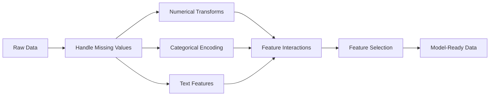

# Feature Engineering & Selection | 特征工程与选择

> A good feature is worth a thousand data points.

**Type:** Build
**Languages:** Python
**Prerequisites:** Phase 1 (Statistics for ML, Linear Algebra), Phase 2 Lessons 1-7
**Time:** ~90 minutes

## Learning Objectives | 学习目标

- Implement numerical transforms (standardization, min-max scaling, log transform, binning) and explain when each is appropriate
- Build one-hot, label, and target encoding for categorical features and identify the data leakage risk in target encoding
- Construct a TF-IDF vectorizer from scratch and explain why it outperforms raw word counts for text classification
- Apply filter-based feature selection (variance threshold, correlation, mutual information) to reduce dimensionality


> **【中文解读】** 特征工程是把原始数据转化为模型能理解的特征——这是 ML 中最耗时的步骤。标准化、编码、交叉特征、多项式特征都是常用技巧。sklearn 中的 StandardScaler/OneHotEncoder。本节覆盖数值变换、类别编码、文本特征、缺失值处理和特征选择。

## The Problem

You have a dataset. You pick an algorithm. You train it. The results are mediocre. You try a fancier algorithm. Still mediocre. You spend a week tuning hyperparameters. Marginal improvement.

Then someone transforms the raw data into better features and a simple logistic regression beats your tuned gradient-boosted ensemble.

This happens constantly. In classical ML, the representation of the data matters more than the choice of algorithm. A house price model with "square footage" and "number of bedrooms" will beat a model with "address as a raw string" no matter how sophisticated the learner is. The algorithm can only work with what you give it.

Feature engineering is the process of transforming raw data into representations that make patterns easier for models to find. Feature selection is the process of throwing away features that add noise without adding signal. Together, they are the highest-leverage activity in classical ML.

> **【中文解读】** 核心洞察：换算法不如换特征。一个简单逻辑回归配好特征，可以打败精心调参的梯度提升集成。模型只能处理你给它的数据表示——"面积"和"卧室数"比"地址字符串"有效得多。特征工程 = 让模式更容易被发现；特征选择 = 扔掉只加噪声不加信号的特征。

## The Concept

### The Feature Pipeline



### Numerical Features

Raw numbers are rarely model-ready. Common transforms:

**Scaling:** Put features on the same range so distance-based algorithms (K-Means, KNN, SVM) treat all features equally. Min-max scaling maps to [0, 1]. Standardization (z-score) maps to mean=0, std=1.

**Log transform:** Compresses right-skewed distributions (income, population, word counts). Turns multiplicative relationships into additive ones.

**Binning:** Converts continuous values into categories. Useful when the relationship between feature and target is non-linear but step-wise (e.g., age groups).

**Polynomial features:** Creates x^2, x^3, x1*x2 terms. Lets linear models capture non-linear relationships at the cost of more features.

> **【中文解读】** 数值特征变换四件套：**缩放**（Min-Max 或 Z-score 标准化）让距离类算法（KNN、SVM）公平对待所有特征；**对数变换**压缩右偏分布（收入、人口），把乘法关系变成加法；**分箱**把连续值变成类别，适用于阶梯式关系；**多项式特征**生成 x^2、x1*x2 项，让线性模型能捕捉非线性关系，代价是特征数爆炸。

### Categorical Features

Models need numbers. Categories need encoding.

**One-hot encoding:** Creates a binary column for each category. "color = red/blue/green" becomes three columns: is_red, is_blue, is_green. Works well for low-cardinality features but explodes with many categories.

**Label encoding:** Maps each category to an integer: red=0, blue=1, green=2. Introduces false ordering (the model might think green > blue > red). Only appropriate for tree-based models that split on individual values.

**Target encoding:** Replaces each category with the mean of the target variable for that category. Powerful but dangerous: high risk of data leakage. Must be computed only on training data and applied to test data.

> **【中文解读】** 类别编码三种方式：**One-hot** 为每个类别创建一列二值特征，低基数效果好但高基数会爆炸；**Label encoding** 映射为整数，引入虚假排序（模型可能以为 green>blue>red），只适合树模型；**Target encoding** 用该类别的目标均值替代，效果强大但有数据泄漏风险——必须只在训练集上计算，再应用到测试集。

### Text Features

**Count vectorizer:** Counts how many times each word appears in a document. "the cat sat on the mat" becomes {the: 2, cat: 1, sat: 1, on: 1, mat: 1}.

**TF-IDF:** Term Frequency-Inverse Document Frequency. Weighs words by how unique they are across documents. Common words like "the" get low weight. Rare, distinctive words get high weight.

```
TF(word, doc) = count(word in doc) / total words in doc
IDF(word) = log(total docs / docs containing word)
TF-IDF = TF * IDF
```

> **【中文解读】** 文本特征两种表示：**词袋模型**（Count Vectorizer）统计每个词在文档中出现的次数；**TF-IDF** 在词频基础上乘以逆文档频率，让常见词（"the"）权重低，稀有区分性词权重高。TF-IDF 在文本分类中几乎总是优于原始词频。

### Missing Values

Real data has holes. Strategies:

- **Drop rows:** Only when missing data is rare and random
- **Mean/median imputation:** Simple, preserves distribution shape (median is more robust to outliers)
- **Mode imputation:** For categorical features
- **Indicator column:** Add a binary column "was_this_missing" before imputing. The fact that data is missing can itself be informative
- **Forward/backward fill:** For time series data

> **【中文解读】** 缺失值处理策略：数据少且随机缺失时删行；均值/中位数填充简单但中位数更抗异常值；众数填充用于类别特征；加一个"是否缺失"的指示列——缺失本身可能是信息；时间序列用前向/后向填充。

### Feature Interaction

Sometimes the relationship is in the combination. "Height" and "weight" alone are less predictive than "BMI = weight / height^2". Feature interactions multiply the feature space, so use domain knowledge to pick the right ones.

### Feature Selection

More features is not always better. Irrelevant features add noise, increase training time, and can cause overfitting.

**Filter methods (pre-model):**
- Correlation: remove features highly correlated with each other (redundant)
- Mutual information: measures how much knowing a feature reduces uncertainty about the target
- Variance threshold: remove features that barely vary

**Wrapper methods (model-based):**
- L1 regularization (Lasso): drives irrelevant feature weights to exactly zero
- Recursive feature elimination: train, remove least important feature, repeat

**Why selection matters:** A model with 10 good features will usually outperform a model with 10 good features and 90 noisy ones. The noisy features give the model opportunities to overfit on training data patterns that do not generalize.

> **【中文解读】** 特征选择三类方法：**过滤法**（建模前）——去掉高相关冗余特征、用互信息衡量特征与目标的相关性、去掉方差太小的特征；**包装法**（基于模型）——L1 正则化把无关特征权重压到零、递归特征消除逐步删最不重要的。10 个好特征通常胜过 10 个好特征加 90 个噪声特征，因为噪声给模型过拟合的机会。

## Build It

### Step 1: Numerical transforms from scratch

```python
import math


def min_max_scale(values):
    min_val = min(values)
    max_val = max(values)
    if max_val == min_val:
        return [0.0] * len(values)
    return [(v - min_val) / (max_val - min_val) for v in values]


def standardize(values):
    n = len(values)
    mean = sum(values) / n
    variance = sum((v - mean) ** 2 for v in values) / n
    std = math.sqrt(variance) if variance > 0 else 1.0
    return [(v - mean) / std for v in values]


def log_transform(values):
    return [math.log(v + 1) for v in values]


def bin_values(values, n_bins=5):
    min_val = min(values)
    max_val = max(values)
    bin_width = (max_val - min_val) / n_bins
    if bin_width == 0:
        return [0] * len(values)
    result = []
    for v in values:
        bin_idx = int((v - min_val) / bin_width)
        bin_idx = min(bin_idx, n_bins - 1)
        result.append(bin_idx)
    return result


def polynomial_features(row, degree=2):
    n = len(row)
    result = list(row)
    if degree >= 2:
        for i in range(n):
            result.append(row[i] ** 2)
        for i in range(n):
            for j in range(i + 1, n):
                result.append(row[i] * row[j])
    return result
```

### Step 2: Categorical encoding from scratch

```python
def one_hot_encode(values):
    categories = sorted(set(values))
    cat_to_idx = {cat: i for i, cat in enumerate(categories)}
    n_cats = len(categories)

    encoded = []
    for v in values:
        row = [0] * n_cats
        row[cat_to_idx[v]] = 1
        encoded.append(row)

    return encoded, categories


def label_encode(values):
    categories = sorted(set(values))
    cat_to_int = {cat: i for i, cat in enumerate(categories)}
    return [cat_to_int[v] for v in values], cat_to_int


def target_encode(feature_values, target_values, smoothing=10):
    global_mean = sum(target_values) / len(target_values)

    category_stats = {}
    for feat, target in zip(feature_values, target_values):
        if feat not in category_stats:
            category_stats[feat] = {"sum": 0.0, "count": 0}
        category_stats[feat]["sum"] += target
        category_stats[feat]["count"] += 1

    encoding = {}
    for cat, stats in category_stats.items():
        cat_mean = stats["sum"] / stats["count"]
        weight = stats["count"] / (stats["count"] + smoothing)
        encoding[cat] = weight * cat_mean + (1 - weight) * global_mean

    return [encoding[v] for v in feature_values], encoding
```

### Step 3: Text features from scratch

```python
def count_vectorize(documents):
    vocab = {}
    idx = 0
    for doc in documents:
        for word in doc.lower().split():
            if word not in vocab:
                vocab[word] = idx
                idx += 1

    vectors = []
    for doc in documents:
        vec = [0] * len(vocab)
        for word in doc.lower().split():
            vec[vocab[word]] += 1
        vectors.append(vec)

    return vectors, vocab


def tfidf(documents):
    n_docs = len(documents)

    vocab = {}
    idx = 0
    for doc in documents:
        for word in doc.lower().split():
            if word not in vocab:
                vocab[word] = idx
                idx += 1

    doc_freq = {}
    for doc in documents:
        seen = set()
        for word in doc.lower().split():
            if word not in seen:
                doc_freq[word] = doc_freq.get(word, 0) + 1
                seen.add(word)

    vectors = []
    for doc in documents:
        words = doc.lower().split()
        word_count = len(words)
        tf_map = {}
        for word in words:
            tf_map[word] = tf_map.get(word, 0) + 1

        vec = [0.0] * len(vocab)
        for word, count in tf_map.items():
            tf = count / word_count
            idf = math.log(n_docs / doc_freq[word])
            vec[vocab[word]] = tf * idf
        vectors.append(vec)

    return vectors, vocab
```

### Step 4: Missing value imputation from scratch

```python
def impute_mean(values):
    present = [v for v in values if v is not None]
    if not present:
        return [0.0] * len(values), 0.0
    mean = sum(present) / len(present)
    return [v if v is not None else mean for v in values], mean


def impute_median(values):
    present = sorted(v for v in values if v is not None)
    if not present:
        return [0.0] * len(values), 0.0
    n = len(present)
    if n % 2 == 0:
        median = (present[n // 2 - 1] + present[n // 2]) / 2
    else:
        median = present[n // 2]
    return [v if v is not None else median for v in values], median


def impute_mode(values):
    present = [v for v in values if v is not None]
    if not present:
        return values, None
    counts = {}
    for v in present:
        counts[v] = counts.get(v, 0) + 1
    mode = max(counts, key=counts.get)
    return [v if v is not None else mode for v in values], mode


def add_missing_indicator(values):
    return [0 if v is not None else 1 for v in values]
```

### Step 5: Feature selection from scratch

```python
def correlation(x, y):
    n = len(x)
    mean_x = sum(x) / n
    mean_y = sum(y) / n
    cov = sum((xi - mean_x) * (yi - mean_y) for xi, yi in zip(x, y)) / n
    std_x = math.sqrt(sum((xi - mean_x) ** 2 for xi in x) / n)
    std_y = math.sqrt(sum((yi - mean_y) ** 2 for yi in y) / n)
    if std_x == 0 or std_y == 0:
        return 0.0
    return cov / (std_x * std_y)


def mutual_information(feature, target, n_bins=10):
    feat_min = min(feature)
    feat_max = max(feature)
    bin_width = (feat_max - feat_min) / n_bins if feat_max != feat_min else 1.0
    feat_binned = [
        min(int((f - feat_min) / bin_width), n_bins - 1) for f in feature
    ]

    n = len(feature)
    target_classes = sorted(set(target))

    feat_bins = sorted(set(feat_binned))
    p_feat = {}
    for b in feat_bins:
        p_feat[b] = feat_binned.count(b) / n

    p_target = {}
    for t in target_classes:
        p_target[t] = target.count(t) / n

    mi = 0.0
    for b in feat_bins:
        for t in target_classes:
            joint_count = sum(
                1 for fb, tv in zip(feat_binned, target) if fb == b and tv == t
            )
            p_joint = joint_count / n
            if p_joint > 0:
                mi += p_joint * math.log(p_joint / (p_feat[b] * p_target[t]))

    return mi


def variance_threshold(features, threshold=0.01):
    n_features = len(features[0])
    n_samples = len(features)
    selected = []

    for j in range(n_features):
        col = [features[i][j] for i in range(n_samples)]
        mean = sum(col) / n_samples
        var = sum((v - mean) ** 2 for v in col) / n_samples
        if var >= threshold:
            selected.append(j)

    return selected


def remove_correlated(features, threshold=0.9):
    n_features = len(features[0])
    n_samples = len(features)

    to_remove = set()
    for i in range(n_features):
        if i in to_remove:
            continue
        col_i = [features[r][i] for r in range(n_samples)]
        for j in range(i + 1, n_features):
            if j in to_remove:
                continue
            col_j = [features[r][j] for r in range(n_samples)]
            corr = abs(correlation(col_i, col_j))
            if corr >= threshold:
                to_remove.add(j)

    return [i for i in range(n_features) if i not in to_remove]
```

### Step 6: Full pipeline and demo

```python
import random


def make_housing_data(n=200, seed=42):
    random.seed(seed)
    data = []
    for _ in range(n):
        sqft = random.uniform(500, 5000)
        bedrooms = random.choice([1, 2, 3, 4, 5])
        age = random.uniform(0, 50)
        neighborhood = random.choice(["downtown", "suburbs", "rural"])
        has_pool = random.choice([True, False])

        sqft_with_missing = sqft if random.random() > 0.05 else None
        age_with_missing = age if random.random() > 0.08 else None

        price = (
            50 * sqft
            + 20000 * bedrooms
            - 1000 * age
            + (50000 if neighborhood == "downtown" else 10000 if neighborhood == "suburbs" else 0)
            + (15000 if has_pool else 0)
            + random.gauss(0, 20000)
        )

        data.append({
            "sqft": sqft_with_missing,
            "bedrooms": bedrooms,
            "age": age_with_missing,
            "neighborhood": neighborhood,
            "has_pool": has_pool,
            "price": price,
        })
    return data


if __name__ == "__main__":
    data = make_housing_data(200)

    print("=== Raw Data Sample ===")
    for row in data[:3]:
        print(f"  {row}")

    sqft_raw = [d["sqft"] for d in data]
    age_raw = [d["age"] for d in data]
    prices = [d["price"] for d in data]

    print("\n=== Missing Value Handling ===")
    sqft_missing = sum(1 for v in sqft_raw if v is None)
    age_missing = sum(1 for v in age_raw if v is None)
    print(f"  sqft missing: {sqft_missing}/{len(sqft_raw)}")
    print(f"  age missing: {age_missing}/{len(age_raw)}")

    sqft_indicator = add_missing_indicator(sqft_raw)
    age_indicator = add_missing_indicator(age_raw)
    sqft_imputed, sqft_fill = impute_median(sqft_raw)
    age_imputed, age_fill = impute_mean(age_raw)
    print(f"  sqft filled with median: {sqft_fill:.0f}")
    print(f"  age filled with mean: {age_fill:.1f}")

    print("\n=== Numerical Transforms ===")
    sqft_scaled = standardize(sqft_imputed)
    age_scaled = min_max_scale(age_imputed)
    sqft_log = log_transform(sqft_imputed)
    age_binned = bin_values(age_imputed, n_bins=5)
    print(f"  sqft standardized: mean={sum(sqft_scaled)/len(sqft_scaled):.4f}, std={math.sqrt(sum(v**2 for v in sqft_scaled)/len(sqft_scaled)):.4f}")
    print(f"  age min-max: [{min(age_scaled):.2f}, {max(age_scaled):.2f}]")
    print(f"  age bins: {sorted(set(age_binned))}")

    print("\n=== Categorical Encoding ===")
    neighborhoods = [d["neighborhood"] for d in data]

    ohe, ohe_cats = one_hot_encode(neighborhoods)
    print(f"  One-hot categories: {ohe_cats}")
    print(f"  Sample encoding: {neighborhoods[0]} -> {ohe[0]}")

    le, le_map = label_encode(neighborhoods)
    print(f"  Label encoding map: {le_map}")

    te, te_map = target_encode(neighborhoods, prices, smoothing=10)
    print(f"  Target encoding: {({k: round(v) for k, v in te_map.items()})}")

    print("\n=== Text Features ===")
    descriptions = [
        "large modern house with pool",
        "small cozy cottage near downtown",
        "spacious family home with large yard",
        "modern apartment downtown with view",
        "rustic cabin in rural area",
    ]
    cv, cv_vocab = count_vectorize(descriptions)
    print(f"  Vocabulary size: {len(cv_vocab)}")
    print(f"  Doc 0 non-zero features: {sum(1 for v in cv[0] if v > 0)}")

    tf, tf_vocab = tfidf(descriptions)
    print(f"  TF-IDF vocabulary size: {len(tf_vocab)}")
    top_words = sorted(tf_vocab.keys(), key=lambda w: tf[0][tf_vocab[w]], reverse=True)[:3]
    print(f"  Doc 0 top TF-IDF words: {top_words}")

    print("\n=== Polynomial Features ===")
    sample_row = [sqft_scaled[0], age_scaled[0]]
    poly = polynomial_features(sample_row, degree=2)
    print(f"  Input: {[round(v, 4) for v in sample_row]}")
    print(f"  Polynomial: {[round(v, 4) for v in poly]}")
    print(f"  Features: [x1, x2, x1^2, x2^2, x1*x2]")

    print("\n=== Feature Selection ===")
    feature_matrix = [
        [sqft_scaled[i], age_scaled[i], float(sqft_indicator[i]), float(age_indicator[i])]
        + ohe[i]
        for i in range(len(data))
    ]

    print(f"  Total features: {len(feature_matrix[0])}")

    surviving_var = variance_threshold(feature_matrix, threshold=0.01)
    print(f"  After variance threshold (0.01): {len(surviving_var)} features kept")

    surviving_corr = remove_correlated(feature_matrix, threshold=0.9)
    print(f"  After correlation filter (0.9): {len(surviving_corr)} features kept")

    binary_prices = [1 if p > sum(prices) / len(prices) else 0 for p in prices]
    print("\n  Mutual information with target:")
    feature_names = ["sqft", "age", "sqft_missing", "age_missing"] + [f"neigh_{c}" for c in ohe_cats]
    for j in range(len(feature_matrix[0])):
        col = [feature_matrix[i][j] for i in range(len(feature_matrix))]
        mi = mutual_information(col, binary_prices, n_bins=10)
        print(f"    {feature_names[j]}: MI={mi:.4f}")

    print("\n  Correlation with price:")
    for j in range(len(feature_matrix[0])):
        col = [feature_matrix[i][j] for i in range(len(feature_matrix))]
        corr = correlation(col, prices)
        print(f"    {feature_names[j]}: r={corr:.4f}")
```

## Use It

With scikit-learn, these transforms are composable pipelines:

```python
from sklearn.preprocessing import StandardScaler, OneHotEncoder, PolynomialFeatures
from sklearn.impute import SimpleImputer
from sklearn.feature_extraction.text import TfidfVectorizer
from sklearn.feature_selection import mutual_info_classif, VarianceThreshold
from sklearn.compose import ColumnTransformer
from sklearn.pipeline import Pipeline

numeric_pipe = Pipeline([
    ("imputer", SimpleImputer(strategy="median")),
    ("scaler", StandardScaler()),
])

categorical_pipe = Pipeline([
    ("encoder", OneHotEncoder(sparse_output=False)),
])

preprocessor = ColumnTransformer([
    ("num", numeric_pipe, ["sqft", "age"]),
    ("cat", categorical_pipe, ["neighborhood"]),
])
```

The from-scratch versions show exactly what happens inside each transform. The library versions add edge-case handling, sparse matrix support, and pipeline composition, but the math is the same.

## Ship It

This lesson produces:
- `outputs/prompt-feature-engineer.md` - a prompt for systematically engineering features from raw data

## Exercises

1. Add robust scaling (using median and interquartile range instead of mean and standard deviation) to the numerical transforms. Compare it to standard scaling on data with extreme outliers.
   > **中文：** 添加鲁棒缩放（用中位数和四分位距替代均值和标准差）。在有极端异常值的数据上比较它和标准缩放的效果。

2. Implement leave-one-out target encoding: for each row, compute the target mean excluding that row's own target value. Show how this reduces overfitting compared to naive target encoding.
   > **中文：** 实现留一法目标编码：对每行，计算排除该行自身目标值后的目标均值。展示它如何比朴素目标编码减少过拟合。

3. Build an automated feature selection pipeline that combines variance threshold, correlation filtering, and mutual information ranking. Apply it to the housing dataset and compare model performance (use a simple linear regression) with all features vs selected features.
   > **中文：** 构建自动化特征选择管道，结合方差阈值、相关性过滤和互信息排序。应用于房价数据集，比较使用全部特征和选择后特征的模型性能。

## Key Terms

| Term | What people say | What it actually means | 中文释义 |
|------|----------------|----------------------|---------|
| Feature engineering | "Making new columns" | Transforming raw data into representations that expose patterns to the model | 特征工程：把原始数据转化为模型能发现模式的表示 |
| Standardization | "Making it normal" | Subtracting the mean and dividing by standard deviation so the feature has mean=0 and std=1 | 标准化：减均值除标准差，使特征均值为 0 标准差为 1 |
| One-hot encoding | "Making dummy variables" | Creating one binary column per category, where exactly one column is 1 for each row | One-hot 编码：每个类别一列二值特征 |
| Target encoding | "Using the answer to encode" | Replacing each category with the average target value for that category, with smoothing to prevent overfitting | 目标编码：用类别对应的目标均值替代，有数据泄漏风险 |
| TF-IDF | "Fancy word counts" | Term Frequency times Inverse Document Frequency: words weighted by how distinctive they are across the corpus | TF-IDF：词频乘逆文档频率，稀有词权重高 |
| Imputation | "Filling in blanks" | Replacing missing values with estimated values (mean, median, mode, or model-predicted) | 插补：用估计值替换缺失值 |
| Feature selection | "Throwing out bad columns" | Removing features that add noise or redundancy, keeping only those with signal about the target | 特征选择：去除噪声和冗余特征 |
| Mutual information | "How much one thing tells you about another" | A measure of the reduction in uncertainty about variable Y gained by observing variable X | 互信息：衡量知道 X 后对 Y 不确定性的减少 |
| Data leakage | "Accidentally cheating" | Using information during training that would not be available at prediction time, giving falsely optimistic results | 数据泄漏：训练时用了预测时不可能获得的信息 |

## Further Reading

- [Feature Engineering and Selection (Max Kuhn & Kjell Johnson)](http://www.feat.engineering/) - free online book covering the full landscape of feature engineering
- [scikit-learn Preprocessing Guide](https://scikit-learn.org/stable/modules/preprocessing.html) - practical reference for all standard transforms
- [Target Encoding Done Right (Micci-Barreca, 2001)](https://dl.acm.org/doi/10.1145/507533.507538) - the original paper on target encoding with smoothing
