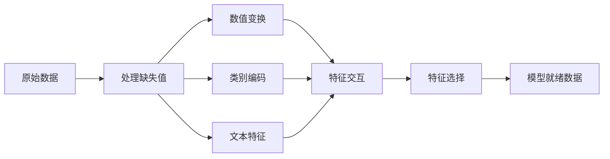

# 特征工程与选择

> 一个好的特征顶一千个数据点。

**类型：** 构建
**语言：** Python
**前置知识：** Phase 1（统计学、线性代数），Phase 2 第 1-7 课
**时长：** 约 90 分钟

## 学习目标

- 实现数值变换（标准化、Min-Max 缩放、对数变换、分箱）并解释各自的适用场景
- 构建独热编码、标签编码和目标编码，识别目标编码的数据泄漏风险
- 从零构建 TF-IDF 向量化器，解释它为什么优于原始词频计数
- 应用基于过滤的特征选择（方差阈值、相关性、互信息）降低维度

## 问题引入

你有一个数据集。你选择了一个算法。你训练了它。结果平庸。你尝试更花哨的算法。仍然平庸。你花了一周调参。微小的改进。

然后有人把原始数据转换成了更好的特征，一个简单的逻辑回归打败了你调好的梯度提升集成。

这种事经常发生。在经典 ML 中，数据的表示比算法的选择更重要。一个有"面积"和"卧室数量"的房价模型，无论学习器多复杂，都会打败一个用"地址作为原始字符串"的模型。算法只能处理你给它的东西。

特征工程 (Feature Engineering) 是将原始数据转换为使模式更容易被模型发现的表示的过程。特征选择 (Feature Selection) 是丢弃只增加噪声而不增加信号的特征。它们合起来是经典 ML 中杠杆率最高的活动。

## 核心概念

### 特征流水线



### 数值特征

原始数值很少能直接用于建模。常见变换：

**缩放 (Scaling)：** 将特征放到同一范围内，使基于距离的算法（K-Means、KNN、SVM）平等对待所有特征。Min-Max 缩放映射到 [0, 1]。标准化 (z-score) 映射到均值=0、标准差=1。

**对数变换 (Log Transform)：** 压缩右偏分布（收入、人口、词频）。将乘法关系变成加法关系。

**分箱 (Binning)：** 将连续值转换为类别。当特征与目标的关系是非线性但阶梯式的时候有用（例如年龄段）。

**多项式特征 (Polynomial Features)：** 创建 x^2、x^3、x1*x2 项。让线性模型能捕捉非线性关系，代价是更多特征。

### 类别特征

模型需要数字。类别需要编码。

**独热编码 (One-Hot Encoding)：** 为每个类别创建一个二进制列。"颜色 = 红/蓝/绿"变成三列：is_red、is_blue、is_green。适用于低基数特征，但类别多时会爆炸。

**标签编码 (Label Encoding)：** 将每个类别映射到整数：红=0、蓝=1、绿=2。引入虚假排序（模型可能认为绿 > 蓝 > 红）。只适合基于树的模型（按单个值分裂）。

**目标编码 (Target Encoding)：** 用每个类别的目标变量均值替换类别。强大但危险：数据泄漏风险高。必须只在训练数据上计算，再应用到测试数据。

### 文本特征

**计数向量化 (Count Vectorizer)：** 统计每个词在文档中出现的次数。"the cat sat on the mat" 变成 {the: 2, cat: 1, sat: 1, on: 1, mat: 1}。

**TF-IDF：** 词频-逆文档频率 (Term Frequency-Inverse Document Frequency)。按词在文档中的独特程度加权。常见词如"the"权重低。稀有、有区分力的词权重高。

```
TF(词, 文档) = 词在文档中出现的次数 / 文档总词数
IDF(词) = log(总文档数 / 包含该词的文档数)
TF-IDF = TF * IDF
```

### 缺失值

真实数据有空洞。策略：

- **删除行：** 只在缺失数据稀少且随机时使用
- **均值/中位数填充：** 简单，保持分布形状（中位数对离群值更鲁棒）
- **众数填充：** 用于类别特征
- **指示列：** 填充前添加二进制列"是否缺失"。数据缺失这一事实本身就可能有信息量
- **前向/后向填充：** 用于时间序列数据

### 特征交互

有时关系在组合中。"身高"和"体重"单独来看不如"BMI = 体重 / 身高^2"有预测力。特征交互成倍增加特征空间，所以用领域知识选择正确的交互。

### 特征选择

特征不是越多越好。不相关的特征增加噪声、增加训练时间、可能导致过拟合。

**过滤方法（建模前）：**
- 相关性：移除彼此高度相关的特征（冗余）
- 互信息：衡量知道一个特征能减少多少关于目标的不确定性
- 方差阈值：移除几乎不变的特征

**包装方法（基于模型）：**
- L1 正则化 (Lasso)：将不相关特征的权重驱动到恰好为零
- 递归特征消除：训练，移除最不重要的特征，重复

**为什么选择很重要：** 一个有 10 个好特征的模型通常优于一个有 10 个好特征加 90 个噪声特征的模型。噪声特征给模型在训练数据上过拟合的机会，这些模式不能泛化。

## 动手实现

### 步骤 1：从零实现数值变换

```python
import math


def min_max_scale(values):
    min_val = min(values)
    max_val = max(values)
    if max_val == min_val:
        return [0.0] * len(values)
    return [(v - min_val) / (max_val - min_val) for v in values]


def standardize(values):
    n = len(values)
    mean = sum(values) / n
    variance = sum((v - mean) ** 2 for v in values) / n
    std = math.sqrt(variance) if variance > 0 else 1.0
    return [(v - mean) / std for v in values]


def log_transform(values):
    return [math.log(v + 1) for v in values]


def bin_values(values, n_bins=5):
    min_val = min(values)
    max_val = max(values)
    bin_width = (max_val - min_val) / n_bins
    if bin_width == 0:
        return [0] * len(values)
    result = []
    for v in values:
        bin_idx = int((v - min_val) / bin_width)
        bin_idx = min(bin_idx, n_bins - 1)
        result.append(bin_idx)
    return result


def polynomial_features(row, degree=2):
    n = len(row)
    result = list(row)
    if degree >= 2:
        for i in range(n):
            result.append(row[i] ** 2)
        for i in range(n):
            for j in range(i + 1, n):
                result.append(row[i] * row[j])
    return result
```

### 步骤 2：从零实现类别编码

```python
def one_hot_encode(values):
    categories = sorted(set(values))
    cat_to_idx = {cat: i for i, cat in enumerate(categories)}
    n_cats = len(categories)

    encoded = []
    for v in values:
        row = [0] * n_cats
        row[cat_to_idx[v]] = 1
        encoded.append(row)

    return encoded, categories


def label_encode(values):
    categories = sorted(set(values))
    cat_to_int = {cat: i for i, cat in enumerate(categories)}
    return [cat_to_int[v] for v in values], cat_to_int


def target_encode(feature_values, target_values, smoothing=10):
    global_mean = sum(target_values) / len(target_values)

    category_stats = {}
    for feat, target in zip(feature_values, target_values):
        if feat not in category_stats:
            category_stats[feat] = {"sum": 0.0, "count": 0}
        category_stats[feat]["sum"] += target
        category_stats[feat]["count"] += 1

    encoding = {}
    for cat, stats in category_stats.items():
        cat_mean = stats["sum"] / stats["count"]
        weight = stats["count"] / (stats["count"] + smoothing)
        encoding[cat] = weight * cat_mean + (1 - weight) * global_mean

    return [encoding[v] for v in feature_values], encoding
```

### 步骤 3：从零实现文本特征

```python
def count_vectorize(documents):
    vocab = {}
    idx = 0
    for doc in documents:
        for word in doc.lower().split():
            if word not in vocab:
                vocab[word] = idx
                idx += 1

    vectors = []
    for doc in documents:
        vec = [0] * len(vocab)
        for word in doc.lower().split():
            vec[vocab[word]] += 1
        vectors.append(vec)

    return vectors, vocab


def tfidf(documents):
    n_docs = len(documents)

    vocab = {}
    idx = 0
    for doc in documents:
        for word in doc.lower().split():
            if word not in vocab:
                vocab[word] = idx
                idx += 1

    doc_freq = {}
    for doc in documents:
        seen = set()
        for word in doc.lower().split():
            if word not in seen:
                doc_freq[word] = doc_freq.get(word, 0) + 1
                seen.add(word)

    vectors = []
    for doc in documents:
        words = doc.lower().split()
        word_count = len(words)
        tf_map = {}
        for word in words:
            tf_map[word] = tf_map.get(word, 0) + 1

        vec = [0.0] * len(vocab)
        for word, count in tf_map.items():
            tf = count / word_count
            idf = math.log(n_docs / doc_freq[word])
            vec[vocab[word]] = tf * idf
        vectors.append(vec)

    return vectors, vocab
```

### 步骤 4：从零实现缺失值填充

```python
def impute_mean(values):
    present = [v for v in values if v is not None]
    if not present:
        return [0.0] * len(values), 0.0
    mean = sum(present) / len(present)
    return [v if v is not None else mean for v in values], mean


def impute_median(values):
    present = sorted(v for v in values if v is not None)
    if not present:
        return [0.0] * len(values), 0.0
    n = len(present)
    if n % 2 == 0:
        median = (present[n // 2 - 1] + present[n // 2]) / 2
    else:
        median = present[n // 2]
    return [v if v is not None else median for v in values], median


def impute_mode(values):
    present = [v for v in values if v is not None]
    if not present:
        return values, None
    counts = {}
    for v in present:
        counts[v] = counts.get(v, 0) + 1
    mode = max(counts, key=counts.get)
    return [v if v is not None else mode for v in values], mode


def add_missing_indicator(values):
    return [0 if v is not None else 1 for v in values]
```

### 步骤 5：从零实现特征选择

```python
def correlation(x, y):
    n = len(x)
    mean_x = sum(x) / n
    mean_y = sum(y) / n
    cov = sum((xi - mean_x) * (yi - mean_y) for xi, yi in zip(x, y)) / n
    std_x = math.sqrt(sum((xi - mean_x) ** 2 for xi in x) / n)
    std_y = math.sqrt(sum((yi - mean_y) ** 2 for yi in y) / n)
    if std_x == 0 or std_y == 0:
        return 0.0
    return cov / (std_x * std_y)


def mutual_information(feature, target, n_bins=10):
    feat_min = min(feature)
    feat_max = max(feature)
    bin_width = (feat_max - feat_min) / n_bins if feat_max != feat_min else 1.0
    feat_binned = [
        min(int((f - feat_min) / bin_width), n_bins - 1) for f in feature
    ]

    n = len(feature)
    target_classes = sorted(set(target))

    feat_bins = sorted(set(feat_binned))
    p_feat = {}
    for b in feat_bins:
        p_feat[b] = feat_binned.count(b) / n

    p_target = {}
    for t in target_classes:
        p_target[t] = target.count(t) / n

    mi = 0.0
    for b in feat_bins:
        for t in target_classes:
            joint_count = sum(
                1 for fb, tv in zip(feat_binned, target) if fb == b and tv == t
            )
            p_joint = joint_count / n
            if p_joint > 0:
                mi += p_joint * math.log(p_joint / (p_feat[b] * p_target[t]))

    return mi


def variance_threshold(features, threshold=0.01):
    n_features = len(features[0])
    n_samples = len(features)
    selected = []

    for j in range(n_features):
        col = [features[i][j] for i in range(n_samples)]
        mean = sum(col) / n_samples
        var = sum((v - mean) ** 2 for v in col) / n_samples
        if var >= threshold:
            selected.append(j)

    return selected


def remove_correlated(features, threshold=0.9):
    n_features = len(features[0])
    n_samples = len(features)

    to_remove = set()
    for i in range(n_features):
        if i in to_remove:
            continue
        col_i = [features[r][i] for r in range(n_samples)]
        for j in range(i + 1, n_features):
            if j in to_remove:
                continue
            col_j = [features[r][j] for r in range(n_samples)]
            corr = abs(correlation(col_i, col_j))
            if corr >= threshold:
                to_remove.add(j)

    return [i for i in range(n_features) if i not in to_remove]
```

### 步骤 6：完整管线和演示

完整演示代码见 `code/feature_engineering.py`。

## 用框架实现

使用 scikit-learn，这些变换可以组合成管线：

```python
from sklearn.preprocessing import StandardScaler, OneHotEncoder, PolynomialFeatures
from sklearn.impute import SimpleImputer
from sklearn.feature_extraction.text import TfidfVectorizer
from sklearn.feature_selection import mutual_info_classif, VarianceThreshold
from sklearn.compose import ColumnTransformer
from sklearn.pipeline import Pipeline

numeric_pipe = Pipeline([
    ("imputer", SimpleImputer(strategy="median")),
    ("scaler", StandardScaler()),
])

categorical_pipe = Pipeline([
    ("encoder", OneHotEncoder(sparse_output=False)),
])

preprocessor = ColumnTransformer([
    ("num", numeric_pipe, ["sqft", "age"]),
    ("cat", categorical_pipe, ["neighborhood"]),
])
```

从零实现版本准确展示了每个变换内部发生了什么。库版本增加了边缘情况处理、稀疏矩阵支持和管线组合，但数学是相同的。

## 产出物

本课产出：
- `outputs/prompt-feature-engineer.md` - 系统地从原始数据工程特征的 prompt 模板

## 练习题

1. 在数值变换中添加鲁棒缩放（使用中位数和四分位距代替均值和标准差）。在有极端离群值的数据上与标准缩放比较。

2. 实现留一法目标编码：对每行，计算排除该行自身目标值的目标均值。展示这如何减少过拟合，与朴素目标编码比较。

3. 构建自动化特征选择管线，结合方差阈值、相关性过滤和互信息排序。应用到住房数据集，比较使用所有特征和选定特征的模型性能（使用简单线性回归）。

## 术语速查表

| 术语 | 实际含义 |
|------|---------|
| 特征工程 (Feature Engineering) | 将原始数据转换为能暴露模式给模型的表示 |
| 标准化 (Standardization) | 减去均值除以标准差，使特征均值=0、标准差=1 |
| 独热编码 (One-Hot Encoding) | 为每个类别创建一个二进制列，每行恰好一列为 1 |
| 目标编码 (Target Encoding) | 用每个类别的目标均值替换类别，带平滑以防止过拟合 |
| TF-IDF | 词频乘以逆文档频率：按词在语料库中的独特程度加权 |
| 填充 (Imputation) | 用估计值（均值、中位数、众数或模型预测）替换缺失值 |
| 特征选择 (Feature Selection) | 移除添加噪声或冗余的特征，只保留对目标有信号的特征 |
| 互信息 (Mutual Information) | 衡量通过观察变量 X 获得的对变量 Y 不确定性减少的量 |
| 数据泄漏 (Data Leakage) | 训练时使用了预测时不可用的信息，给出虚假的乐观结果 |

## 延伸阅读

- [Feature Engineering and Selection (Max Kuhn & Kjell Johnson)](http://www.feat.engineering/) - 涵盖特征工程全景的免费在线书籍
- [scikit-learn 预处理指南](https://scikit-learn.org/stable/modules/preprocessing.html) - 所有标准变换的实用参考
- [Target Encoding Done Right (Micci-Barreca, 2001)](https://dl.acm.org/doi/10.1145/507533.507538) - 带平滑的目标编码原始论文
