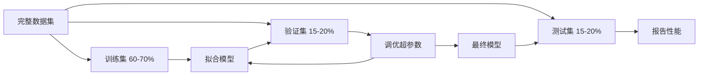

# 模型评估

> 模型的好坏取决于你如何衡量它。

**类型：** 构建
**语言：** Python
**前置知识：** Phase 1（概率与分布、统计学），Phase 2 第 1-8 课
**时长：** 约 90 分钟

## 学习目标

- 从零实现 K 折和分层 K 折交叉验证，解释为什么分层对不平衡数据很重要
- 从零计算精确率、召回率、F1、AUC-ROC 和回归指标（MSE、RMSE、MAE、R-squared）
- 解释学习曲线以诊断模型是否存在高偏差或高方差
- 识别常见评估错误，包括数据泄漏、错误指标选择和测试集污染

## 问题引入

你训练了一个模型。它在你的数据上有 95% 的准确率。好吗？

也许好，也许不好。如果 95% 的数据属于一个类别，一个始终预测那个类别的模型得到 95% 准确率，但完全无用。如果你在训练过的数据上评估，95% 这个数字毫无意义，因为模型只是记住了答案。如果你的数据集有时间成分，你在分割前随机打乱，你的模型可能用未来数据预测过去。

模型评估是大多数 ML 项目出错的地方。错误的指标让坏模型看起来好。错误的分割让模型作弊。错误的比较让你选了更差的模型。做对评估不是可选的——它是模型在生产中有效和一见到真实数据就失败之间的区别。

## 核心概念

### 训练集、验证集、测试集



三个划分，三个目的：

- **训练集**：模型从这个数据中学习。训练时看到这些样本。
- **验证集**：用于调优超参数和在模型之间选择。模型从不在这个数据上训练，但你的决策受它影响。
- **测试集**：只在最后碰一次，报告最终性能。如果你看了测试性能然后回头改模型，它就不再是测试集了——它变成了第二个验证集。

测试集是你的保底保证：报告的性能反映了模型在真正未见数据上的表现。

### K 折交叉验证

对于小数据集，单次训练/验证分割浪费数据且估计噪声大。K 折交叉验证将所有数据既用于训练又用于验证：

1. 将数据分成 K 个等大的折
2. 对每个折，在 K-1 个折上训练，在剩余的折上验证
3. 对 K 个验证分数取平均

K=5 或 K=10 是标准选择。每个数据点恰好被用于验证一次。平均分数比任何单次分割都更稳定。

**分层 K 折 (Stratified K-Fold)**：在每个折中保持类别分布。如果你的数据集 70% 是类别 A、30% 是类别 B，每个折将有大致相同的比例。这对不平衡数据集很重要，因为随机分割可能把所有少数类样本放到一个折里。

### 分类指标

**混淆矩阵**：基础。对于二分类：

|  | 预测为正 | 预测为负 |
|--|---|---|
| 实际为正 | 真正例 (TP) | 假负例 (FN) |
| 实际为负 | 假正例 (FP) | 真负例 (TN) |

从这个矩阵出发，所有其他指标：

- **准确率 (Accuracy)** = (TP + TN) / (TP + TN + FP + FN)。正确预测的比例。类别不平衡时有误导性。
- **精确率 (Precision)** = TP / (TP + FP)。预测为正的中有多少确实是正的。假正例代价高时使用（如垃圾邮件过滤标记正常邮件）。
- **召回率 (Recall)**（灵敏度）= TP / (TP + FN)。实际为正的中有多少被找到。假负例代价高时使用（如癌症筛查遗漏肿瘤）。
- **F1 分数** = 2 * 精确率 * 召回率 / (精确率 + 召回率)。精确率和召回率的调和平均。
- **AUC-ROC**：ROC 曲线下面积。在不同分类阈值下绘制真正例率 vs 假正例率。AUC = 0.5 意味着随机猜测，AUC = 1.0 意味着完美分离。与阈值无关：衡量模型将正例排在负例前面的能力。

### 回归指标

- **MSE**（均方误差）= mean((y_true - y_pred)^2)。对大误差二次惩罚。对离群值敏感。
- **RMSE**（均方根误差）= sqrt(MSE)。与目标变量同单位。比 MSE 更易解释。
- **MAE**（平均绝对误差）= mean(|y_true - y_pred|)。对所有误差线性处理。比 MSE 更抗离群值。
- **R-squared** = 1 - SS_res / SS_tot。模型解释的方差比例。R^2 = 1.0 完美。R^2 = 0.0 意味着模型不比始终预测均值好。R^2 可以是负的（模型比均值更差）。

### 学习曲线

绘制训练分数和验证分数随训练集大小的变化：

- **高偏差（欠拟合）**：两条曲线收敛到低分。增加更多数据没用。需要更复杂的模型。
- **高方差（过拟合）**：训练分数高但验证分数低得多。差距大。增加更多数据应该有帮助。

### 验证曲线

绘制训练分数和验证分数随超参数的变化：

- 低复杂度：两个分数都低（欠拟合）
- 合适复杂度：两个分数都高且接近
- 高复杂度：训练分数保持高但验证分数下降（过拟合）

### 常见评估错误

**数据泄漏**：测试集信息泄漏到训练中。例如：分割前在整个数据集上拟合缩放器、时间序列预测中包含未来数据、使用从目标派生的特征。始终先分割，再预处理。

**类别不平衡**：99% 的交易合法，1% 欺诈。始终预测"合法"的模型有 99% 准确率。用精确率、召回率、F1 或 AUC-ROC 代替。

**错误指标**：该优化召回率时优化准确率（医疗诊断），或数据有重尾离群值时用 RMSE（用 MAE 代替）。

**不用分层分割**：不平衡数据下，随机分割可能将很少的少数类样本放到验证折中，给出不稳定的估计。

**测试太多**：每次你看测试性能然后调整，你就对测试集过拟合了。测试集是一次性的。

## 动手实现

### 步骤 1：训练/验证/测试分割

```python
import random
import math


def train_val_test_split(X, y, train_ratio=0.6, val_ratio=0.2, seed=42):
    random.seed(seed)
    n = len(X)
    indices = list(range(n))
    random.shuffle(indices)

    train_end = int(n * train_ratio)
    val_end = int(n * (train_ratio + val_ratio))

    train_idx = indices[:train_end]
    val_idx = indices[train_end:val_end]
    test_idx = indices[val_end:]

    return ([X[i] for i in train_idx], [y[i] for i in train_idx],
            [X[i] for i in val_idx], [y[i] for i in val_idx],
            [X[i] for i in test_idx], [y[i] for i in test_idx])
```

### 步骤 2：K 折和分层 K 折交叉验证

```python
def kfold_split(n, k=5, seed=42):
    random.seed(seed)
    indices = list(range(n))
    random.shuffle(indices)

    fold_size = n // k
    folds = []

    for i in range(k):
        start = i * fold_size
        end = start + fold_size if i < k - 1 else n
        val_idx = indices[start:end]
        train_idx = indices[:start] + indices[end:]
        folds.append((train_idx, val_idx))

    return folds


def stratified_kfold_split(y, k=5, seed=42):
    random.seed(seed)

    class_indices = {}
    for i, label in enumerate(y):
        class_indices.setdefault(label, []).append(i)

    for label in class_indices:
        random.shuffle(class_indices[label])

    folds = [{"train": [], "val": []} for _ in range(k)]

    for label, indices in class_indices.items():
        fold_size = len(indices) // k
        for i in range(k):
            start = i * fold_size
            end = start + fold_size if i < k - 1 else len(indices)
            val_part = indices[start:end]
            train_part = indices[:start] + indices[end:]
            folds[i]["val"].extend(val_part)
            folds[i]["train"].extend(train_part)

    return [(f["train"], f["val"]) for f in folds]


def cross_validate(X, y, model_fn, k=5, metric_fn=None, stratified=False):
    n = len(X)

    if stratified:
        folds = stratified_kfold_split(y, k)
    else:
        folds = kfold_split(n, k)

    scores = []
    for train_idx, val_idx in folds:
        X_train = [X[i] for i in train_idx]
        y_train = [y[i] for i in train_idx]
        X_val = [X[i] for i in val_idx]
        y_val = [y[i] for i in val_idx]

        model = model_fn()
        model.fit(X_train, y_train)
        predictions = [model.predict(x) for x in X_val]

        if metric_fn:
            score = metric_fn(y_val, predictions)
        else:
            score = sum(1 for yt, yp in zip(y_val, predictions) if yt == yp) / len(y_val)
        scores.append(score)

    return scores
```

### 步骤 3：混淆矩阵和分类指标

```python
def confusion_matrix(y_true, y_pred):
    tp = sum(1 for yt, yp in zip(y_true, y_pred) if yt == 1 and yp == 1)
    tn = sum(1 for yt, yp in zip(y_true, y_pred) if yt == 0 and yp == 0)
    fp = sum(1 for yt, yp in zip(y_true, y_pred) if yt == 0 and yp == 1)
    fn = sum(1 for yt, yp in zip(y_true, y_pred) if yt == 1 and yp == 0)
    return tp, tn, fp, fn


def accuracy(y_true, y_pred):
    tp, tn, fp, fn = confusion_matrix(y_true, y_pred)
    total = tp + tn + fp + fn
    return (tp + tn) / total if total > 0 else 0.0


def precision(y_true, y_pred):
    tp, tn, fp, fn = confusion_matrix(y_true, y_pred)
    return tp / (tp + fp) if (tp + fp) > 0 else 0.0


def recall(y_true, y_pred):
    tp, tn, fp, fn = confusion_matrix(y_true, y_pred)
    return tp / (tp + fn) if (tp + fn) > 0 else 0.0


def f1_score(y_true, y_pred):
    p = precision(y_true, y_pred)
    r = recall(y_true, y_pred)
    return 2 * p * r / (p + r) if (p + r) > 0 else 0.0


def roc_curve(y_true, y_scores):
    thresholds = sorted(set(y_scores), reverse=True)
    tpr_list = []
    fpr_list = []

    total_positives = sum(y_true)
    total_negatives = len(y_true) - total_positives

    for threshold in thresholds:
        y_pred = [1 if s >= threshold else 0 for s in y_scores]
        tp = sum(1 for yt, yp in zip(y_true, y_pred) if yt == 1 and yp == 1)
        fp = sum(1 for yt, yp in zip(y_true, y_pred) if yt == 0 and yp == 1)

        tpr = tp / total_positives if total_positives > 0 else 0.0
        fpr = fp / total_negatives if total_negatives > 0 else 0.0

        tpr_list.append(tpr)
        fpr_list.append(fpr)

    return fpr_list, tpr_list, thresholds


def auc_roc(y_true, y_scores):
    fpr_list, tpr_list, _ = roc_curve(y_true, y_scores)

    pairs = sorted(zip(fpr_list, tpr_list))
    fpr_sorted = [p[0] for p in pairs]
    tpr_sorted = [p[1] for p in pairs]

    area = 0.0
    for i in range(1, len(fpr_sorted)):
        width = fpr_sorted[i] - fpr_sorted[i - 1]
        height = (tpr_sorted[i] + tpr_sorted[i - 1]) / 2
        area += width * height

    return area
```

### 步骤 4：回归指标

```python
def mse(y_true, y_pred):
    n = len(y_true)
    return sum((yt - yp) ** 2 for yt, yp in zip(y_true, y_pred)) / n

def rmse(y_true, y_pred):
    return math.sqrt(mse(y_true, y_pred))

def mae(y_true, y_pred):
    n = len(y_true)
    return sum(abs(yt - yp) for yt, yp in zip(y_true, y_pred)) / n

def r_squared(y_true, y_pred):
    mean_y = sum(y_true) / len(y_true)
    ss_res = sum((yt - yp) ** 2 for yt, yp in zip(y_true, y_pred))
    ss_tot = sum((yt - mean_y) ** 2 for yt in y_true)
    if ss_tot == 0:
        return 0.0
    return 1.0 - ss_res / ss_tot
```

### 步骤 5：学习曲线

```python
def learning_curve(X, y, model_fn, metric_fn, train_sizes=None, val_ratio=0.2, seed=42):
    random.seed(seed)
    n = len(X)
    indices = list(range(n))
    random.shuffle(indices)

    val_size = int(n * val_ratio)
    val_idx = indices[:val_size]
    pool_idx = indices[val_size:]

    X_val = [X[i] for i in val_idx]
    y_val = [y[i] for i in val_idx]

    if train_sizes is None:
        train_sizes = [int(len(pool_idx) * r) for r in [0.1, 0.2, 0.4, 0.6, 0.8, 1.0]]

    train_scores = []
    val_scores = []

    for size in train_sizes:
        subset = pool_idx[:size]
        X_train = [X[i] for i in subset]
        y_train = [y[i] for i in subset]

        model = model_fn()
        model.fit(X_train, y_train)

        train_pred = [model.predict(x) for x in X_train]
        val_pred = [model.predict(x) for x in X_val]

        train_scores.append(metric_fn(y_train, train_pred))
        val_scores.append(metric_fn(y_val, val_pred))

    return train_sizes, train_scores, val_scores
```

完整演示代码见 `code/model_evaluation.py`。

## 用框架实现

使用 scikit-learn，评估已内置于工作流：

```python
from sklearn.model_selection import cross_val_score, StratifiedKFold, learning_curve
from sklearn.metrics import (
    accuracy_score, precision_score, recall_score, f1_score,
    roc_auc_score, confusion_matrix, mean_squared_error, r2_score,
)
from sklearn.linear_model import LogisticRegression

model = LogisticRegression()
scores = cross_val_score(model, X, y, cv=StratifiedKFold(5), scoring="f1")
```

从零实现版本准确展示了交叉验证做了什么（没有魔法，只是循环和索引追踪）、每个指标如何计算（只是计数 TP/FP/TN/FN），以及为什么分层重要（在每个折中保持类别比例）。库版本增加了并行、更多评分选项和管线集成。

## 产出物

本课产出：
- `outputs/skill-evaluation.md` - 涵盖分类和回归模型评估策略的技能文档

## 练习题

1. 实现精确率-召回率曲线：在不同阈值下绘制精确率 vs 召回率。计算平均精确率（PR 曲线下面积）。在不平衡数据集上将 PR 曲线与 ROC 曲线比较，解释各自何时更有信息量。

2. 构建嵌套交叉验证循环：外循环评估模型性能，内循环调优超参数。用它公平比较两个模型，不将验证数据泄漏到评估中。

3. 实现模型比较的置换检验：打乱标签，重新训练，测量性能。重复 100 次建立零分布。计算观测模型性能对这个分布的 p 值。

## 术语速查表

| 术语 | 实际含义 |
|------|---------|
| 过拟合 (Overfitting) | 模型捕获了训练数据中的噪声，训练表现好但未见数据表现差 |
| 交叉验证 (Cross-Validation) | 系统性地轮换哪部分数据用于验证，对所有轮换结果取平均 |
| 精确率 (Precision) | TP / (TP + FP)：正预测中实际为正的比例 |
| 召回率 (Recall) | TP / (TP + FN)：实际正例中被正确识别的比例 |
| AUC-ROC | 真正例率 vs 假正例率曲线下面积，从 0.5（随机）到 1.0（完美） |
| R-squared | 1 - (残差平方和 / 总平方和)：模型捕获的目标方差比例 |
| 数据泄漏 (Data Leakage) | 训练时使用了预测时不可用的信息，导致乐观的评估 |
| 学习曲线 (Learning Curve) | 训练和验证分数随训练集大小的变化图，揭示欠拟合或过拟合 |
| 分层分割 (Stratified Split) | 分割数据使每个子集有与完整数据集相同的类别比例 |

## 延伸阅读

- [scikit-learn 模型选择指南](https://scikit-learn.org/stable/model_selection.html) - 交叉验证、指标和超参数调优的全面参考
- [Beyond Accuracy: Precision and Recall (Google ML Crash Course)](https://developers.google.com/machine-learning/crash-course/classification/precision-and-recall) - 带交互示例的清晰解释
- [A Survey of Cross-Validation Procedures (Arlot & Celisse, 2010)](https://projecteuclid.org/journals/statistics-surveys/volume-4/issue-none/A-survey-of-cross-validation-procedures-for-model-selection/10.1214/09-SS054.full) - 不同交叉验证策略何时有效的严格分析
