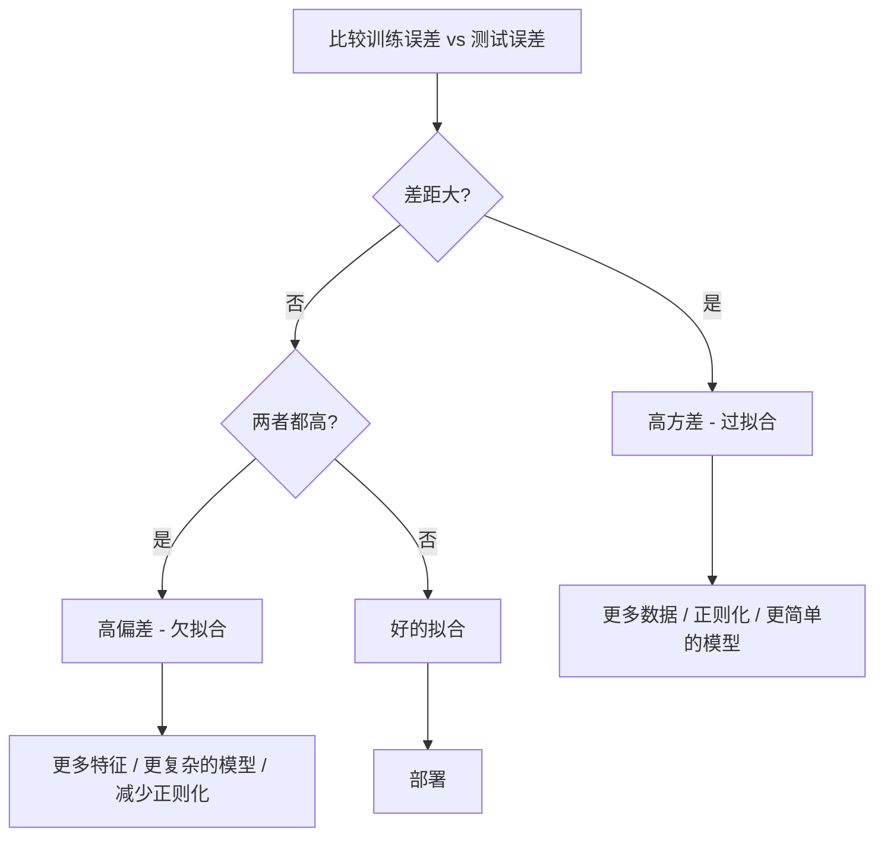

# 偏差-方差权衡

> 每个模型误差来自三个来源之一：偏差、方差或噪声。你只能控制前两个。

**类型：** 学习
**语言：** Python
**前置知识：** Phase 2 第 1-9 课（ML 基础、回归、分类、评估）
**时长：** 约 75 分钟

## 学习目标

- 推导期望预测误差的偏差-方差分解，解释不可约噪声的角色
- 使用训练误差和测试误差模式诊断模型是否存在高偏差或高方差
- 解释正则化技术（L1、L2、Dropout、早停）如何在偏差和方差之间权衡
- 实现可视化模型复杂度增加时偏差-方差权衡的实验

## 问题引入

你训练了一个模型。它在测试数据上有一些误差。这些误差从哪来？

如果你的模型太简单（在曲线数据集上用线性回归），它会持续偏离真实模式。这就是偏差。如果你的模型太复杂（在 15 个点上用 20 次多项式），它会完美拟合训练数据但在新数据上给出剧烈不同的预测。这就是方差。

对于固定的模型容量，你无法同时最小化两者。把偏差压下去，方差就上来。把方差压下去，偏差就上来。理解这个权衡是机器学习中最有用的诊断技能。它告诉你应该让模型更复杂还是更简单，应该获取更多数据还是工程更好的特征，应该正则化更多还是更少。

## 核心概念

### 偏差：系统性误差

偏差衡量你的模型平均预测值与真实值差多远。如果你在从同一分布抽取的许多不同训练集上训练同一模型并取预测平均，偏差就是那个平均值与真实值之间的差距。

高偏差意味着模型太死板，无法捕获真实模式。用直线拟合抛物线永远会错过曲线，不管你给它多少数据。这就是欠拟合。

```
高偏差（欠拟合）：
  模型始终预测大致相同的错误结果。
  训练误差：高
  测试误差：高
  差距：小
```

### 方差：对训练数据的敏感度

方差衡量你在不同数据子集上训练时预测变化多少。如果训练集的小变化导致模型的大变化，方差就高。

高方差意味着模型在拟合训练数据中的噪声，而不是底层信号。一个 20 次多项式会穿过每个训练点但在它们之间剧烈振荡。这就是过拟合。

```
高方差（过拟合）：
  模型完美拟合训练数据但在新数据上失败。
  训练误差：低
  测试误差：高
  差距：大
```

### 分解

对于任何点 x，平方损失下的期望预测误差精确分解：

```
期望误差 = 偏差^2 + 方差 + 不可约噪声

其中：
  偏差^2   = (E[f_hat(x)] - f(x))^2
  方差     = E[(f_hat(x) - E[f_hat(x)])^2]
  噪声     = E[(y - f(x))^2]             (sigma^2)
```

- `f(x)` 是真实函数
- `f_hat(x)` 是你的模型预测
- `E[...]` 是对不同训练集的期望
- `y` 是观测标签（真实函数加噪声）

噪声项是不可约的。没有模型能在有噪声的数据上比 sigma^2 更好。你的工作是在偏差^2 和方差之间找到正确的平衡。

### 模型复杂度 vs 误差

经典的 U 形曲线：

| 复杂度 | 偏差 | 方差 | 总误差 |
|-------|------|------|--------|
| 太低 | 高 | 低 | 高（欠拟合） |
| 恰好 | 中等 | 中等 | 最低 |
| 太高 | 低 | 高 | 高（过拟合） |

### 正则化作为偏差-方差控制

正则化有意增加偏差来减少方差。它约束模型使其不能追逐噪声。

- **L2（Ridge）**：将所有权重向零收缩。保留所有特征但减少它们的影响。
- **L1（Lasso）**：将某些权重精确推到零。执行特征选择。
- **Dropout**：训练时随机禁用神经元。强制冗余表示。
- **早停**：在模型完全拟合训练数据之前停止训练。

正则化强度（lambda、dropout 率、epoch 数）直接控制你在偏差-方差曲线上的位置。更多正则化意味着更多偏差、更少方差。

### 双重下降：现代视角

经典理论说：过了最佳点后，更多复杂度总会更差。但 2019 年以来的研究发现了意想不到的事。如果你继续增加模型容量，远超插值阈值（模型有足够参数完美拟合训练数据的位置），测试误差可能再次下降。

这种"双重下降"现象解释了为什么大规模过参数化的神经网络（参数远多于训练样本）仍然能很好泛化。经典的偏差-方差权衡没有错，但对现代场景不完整。

关于双重下降的关键观察：
- 它在线性模型、决策树和神经网络中都会发生
- 在插值区域更多数据实际上可能有害（样本-wise 双重下降）
- 更多训练 epoch 也可能导致它（epoch-wise 双重下降）
- 正则化平滑了峰值但不能消除它

为什么发生？在插值阈值处，模型恰好有足够容量拟合所有训练点。它被迫采用一个穿过每个点的特定解，数据的小扰动导致拟合的大变化。这是方差峰值的地方。过了阈值后，模型有很多可能完美拟合数据的解。学习算法（如带隐式正则化的梯度下降）倾向于选择其中最简单的。这种对简单解的隐式偏好就是过参数化模型能泛化的原因。

| 机制 | 参数 vs 样本 | 行为 |
|------|------------|------|
| 欠参数化 | p << n | 经典权衡适用 |
| 插值阈值 | p ~ n | 方差峰值，测试误差飙升 |
| 过参数化 | p >> n | 隐式正则化启动，测试误差下降 |

实用建议：如果你使用神经网络或大型树集成，不要停在插值阈值处。要么远低于它（带显式正则化），要么远超过它。最糟糕的位置恰好是阈值处。

### 诊断你的模型



| 症状 | 诊断 | 修复 |
|------|------|------|
| 训练误差高，测试误差高 | 偏差 | 更多特征、复杂模型、减少正则化 |
| 训练误差低，测试误差高 | 方差 | 更多数据、正则化、更简单模型、Dropout |
| 训练误差低，测试误差低 | 好的拟合 | 部署 |
| 训练误差下降中，测试误差上升中 | 正在过拟合 | 早停 |

### 实用策略

**当偏差是问题时：**
- 添加多项式或交互特征
- 使用更灵活的模型（树集成代替线性）
- 减少正则化强度
- 训练更长时间（如果还没收敛）

**当方差是问题时：**
- 获取更多训练数据
- 使用 Bagging（随机森林）
- 增加正则化（更高的 lambda、更多 Dropout）
- 特征选择（移除噪声特征）
- 用交叉验证及早检测

### 集成方法与方差减少

集成方法是应对方差最实用的工具。

**Bagging（Bootstrap Aggregating）** 在训练数据的不同 Bootstrap 样本上训练多个模型，然后平均预测。每个单独的模型方差高，但平均值方差低得多。随机森林就是 Bagging 应用于决策树。

数学原理：如果你平均 N 个独立预测，每个方差为 sigma^2，平均的方差是 sigma^2 / N。模型并非真正独立（它们看到相似的数据），所以减少少于 1/N，但仍然很可观。

**Boosting** 通过串行构建模型来减少偏差，每个新模型关注集成到目前为止的错误。梯度提升和 AdaBoost 是主要例子。如果加太多模型 Boosting 会过拟合，所以需要早停或正则化。

| 方法 | 主要效果 | 偏差变化 | 方差变化 |
|------|---------|---------|---------|
| Bagging | 减少方差 | 不变 | 减少 |
| Boosting | 减少偏差 | 减少 | 可能增加 |
| Stacking | 两者都减少 | 取决于元学习器 | 取决于基础模型 |
| Dropout | 隐式 Bagging | 略增 | 减少 |

**实用规则：** 如果基础模型方差高（深树、高次多项式），用 Bagging。如果基础模型偏差高（浅树桩、简单线性模型），用 Boosting。

### 学习曲线

学习曲线绘制训练和验证误差随训练集大小的变化。它们是你最实用的诊断工具。与单次训练/测试比较不同，学习曲线展示了模型的轨迹，告诉你更多数据是否有帮助。

如何解读：

| 场景 | 训练误差 | 验证误差 | 差距 | 含义 | 该做什么 |
|------|---------|---------|------|------|---------|
| 高偏差 | 高 | 高 | 小 | 模型不能捕获模式 | 更多特征、复杂模型、减少正则化 |
| 高方差 | 低 | 高 | 大 | 模型记忆训练数据 | 更多数据、正则化、更简单模型 |
| 好的拟合 | 中等 | 中等 | 小 | 模型泛化良好 | 部署 |
| 高方差，在改善 | 低 | 随数据减少 | 在缩小 | 数据能解决的方差问题 | 收集更多数据 |
| 高偏差，平坦 | 高 | 高且平坦 | 小且平坦 | 更多数据无用 | 改变模型架构 |

关键洞察：如果两条曲线都已平稳且差距小但两者误差都高，更多数据无用。你需要更好的模型。如果差距大且还在缩小，更多数据会有帮助。

## 动手实现

`code/bias_variance.py` 中的代码运行完整的偏差-方差分解实验。代码包含：生成合成数据、Bootstrap 采样和多项式拟合、计算偏差^2 和方差分解、学习曲线、正则化扫描。

详见 `code/bias_variance.py` 获取完整实现。

## 用框架实现

sklearn 提供 `learning_curve` 和 `validation_curve` 自动化这些诊断，无需写 Bootstrap 循环。

```python
from sklearn.model_selection import learning_curve, validation_curve, cross_val_score
from sklearn.pipeline import make_pipeline
from sklearn.preprocessing import PolynomialFeatures
from sklearn.linear_model import Ridge

# 学习曲线：扫描训练集大小
pipe = make_pipeline(PolynomialFeatures(5), Ridge(alpha=0.01))
train_sizes, train_scores, val_scores = learning_curve(
    pipe, X, y, train_sizes=np.linspace(0.1, 1.0, 10),
    cv=5, scoring="neg_mean_squared_error"
)
train_mse = -train_scores.mean(axis=1)
val_mse = -val_scores.mean(axis=1)

# 正则化扫描
alphas = [0.001, 0.01, 0.1, 1.0, 10.0, 100.0]
for alpha in alphas:
    pipe = make_pipeline(PolynomialFeatures(10), Ridge(alpha=alpha))
    scores = cross_val_score(pipe, X, y, cv=5, scoring="neg_mean_squared_error")
    print(f"alpha={alpha:>7.3f}  MSE={-scores.mean():.4f}")
```

## 产出物

本课产出：`outputs/prompt-model-diagnostics.md`

## 练习题

1. 用 `noise_std=0`（无噪声）运行分解。不可约误差项发生了什么？最优复杂度变化了吗？

2. 将训练集大小从 30 增加到 300。这如何影响方差分量？最优多项式次数移动了吗？

3. 在实验中添加 L2 正则化（Ridge 回归）。对固定的高次多项式（degree 15），从 0 到 100 扫描 lambda。绘制偏差^2 和方差作为 lambda 的函数。

4. 将真实函数从多项式改为 `sin(x)`。偏差-方差分解如何变化？是否还有清晰的最优次数？

5. 实现简单的 Bootstrap 聚合（Bagging）包装器：在 Bootstrap 样本上训练 10 个模型并平均预测。展示这减少了方差而不显著增加偏差。

## 术语速查表

| 术语 | 实际含义 |
|------|---------|
| 偏差 (Bias) | 来自错误假设的系统性误差。平均模型预测与真实值之间的差距 |
| 方差 (Variance) | 对训练数据敏感导致的误差。不同训练集上预测的变化量 |
| 不可约误差 (Irreducible Error) | 真实数据生成过程中的随机性。没有模型能消除它 |
| 欠拟合 (Underfitting) | 模型有高偏差。即使在训练数据上也错过了真实模式 |
| 过拟合 (Overfitting) | 模型有高方差。拟合了训练数据中不能泛化的噪声 |
| 正则化 (Regularization) | 添加惩罚减少模型复杂度，以偏差换取更低方差 |
| 双重下降 (Double Descent) | 当模型容量远超插值阈值后测试误差再次下降 |
| 模型复杂度 (Model Complexity) | 模型拟合任意模式的能力。由架构、特征或正则化控制 |

## 延伸阅读

- [Hastie, Tibshirani, Friedman: Elements of Statistical Learning, Ch. 7](https://hastie.su.domains/ElemStatLearn/) - 偏差-方差分解的权威论述
- [Belkin et al., Reconciling modern machine learning practice and the bias-variance trade-off (2019)](https://arxiv.org/abs/1812.11118) - 双重下降论文
- [Nakkiran et al., Deep Double Descent (2019)](https://arxiv.org/abs/1912.02292) - epoch-wise 和 sample-wise 双重下降
- [Scott Fortmann-Roe: Understanding the Bias-Variance Tradeoff](http://scott.fortmann-roe.com/docs/BiasVariance.html) - 清晰的可视化解释
