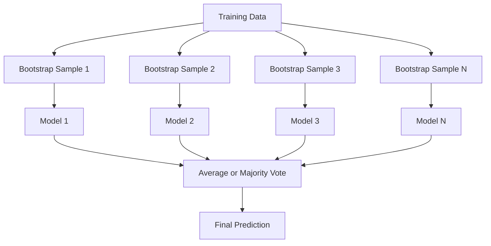
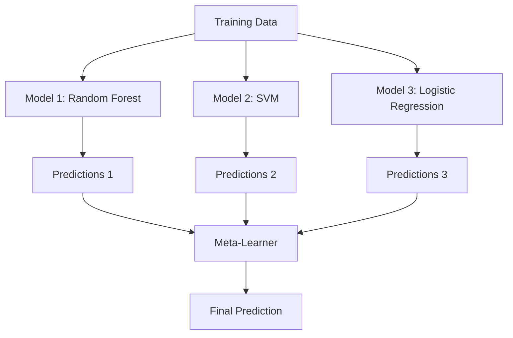

# Ensemble Methods
# 集成方法


> A group of weak learners, combined correctly, becomes a strong learner. This is not a metaphor. It is a theorem.

> 一组弱学习器，正确组合后，就变成强学习器。这不是比喻，这是定理。

**Type:** Build | **类型：** 构建
**Language:** Python | **语言：** Python
**Prerequisites:** Phase 2, Lesson 10 (Bias-Variance Tradeoff) | **前置知识：** Phase 2 第 10 课（偏差-方差权衡）
**Time:** ~120 minutes | **时间：** 约 120 分钟

## Learning Objectives | 学习目标

- Implement AdaBoost and gradient boosting from scratch and explain how boosting sequentially reduces bias
  从零实现 AdaBoost 和梯度提升，解释 Boosting 如何串行减少偏差
- Build a bagging ensemble and demonstrate how averaging decorrelated models reduces variance without increasing bias
  构建 Bagging 集成，展示平均不相关模型如何在不增加偏差的情况下减少方差
- Compare bagging, boosting, and stacking in terms of what error component each method targets
  比较 Bagging、Boosting 和 Stacking 各自针对的误差分量
- Evaluate ensemble diversity and explain why majority voting accuracy improves with more independent weak learners
  评估集成多样性，解释为什么多数投票准确率随更多独立弱学习器而提高


> **【中文解读】**
> 集成方法组合多个弱模型成一个强模型。Bagging（随机森林）降低方差，Boosting（XGBoost）降低偏差。XGBoost/LightGBM 在 Kaggle 比赛中占据统治地位。金融风控、推荐系统广泛使用。

> **【拓展：集成方法在 Kaggle 和工业界的主导地位】**
> Kaggle 结构化数据竞赛中，排名前 10 的方案几乎 100% 使用集成方法。Netflix Prize 的获胜方案是 107 个模型的加权集成。在工业界，支付宝的风控系统使用 XGBoost + LightGBM 的集成；Amazon 的商品推荐使用多模型 Stacking。集成方法之所以强大，是因为它将"模型选择"问题转化为"模型组合"问题。

## The Problem | 问题引入

A single decision tree is fast to train and easy to interpret, but it overfits. A single linear model underfits on complex boundaries. You could spend days engineering the perfect model architecture. Or you could combine a bunch of imperfect models and get something better than any of them individually.

> 单棵决策树训练快、易解释，但会过拟合。单个线性模型在复杂边界上欠拟合。你可以花几天时间设计完美的模型架构，或者把一堆不完美的模型组合起来，得到比任何一个都更好的结果。

Ensemble methods do exactly this. They are the most reliable technique for winning Kaggle competitions on tabular data, they power most production ML systems, and they illustrate the bias-variance tradeoff in action. Bagging reduces variance. Boosting reduces bias. Stacking learns which models to trust on which inputs.

> 集成方法正是这样做的。它们是赢得 Kaggle 表格数据竞赛最可靠的技术，驱动着大多数生产 ML 系统，并直观展示了偏差-方差权衡的实际运作。Bagging 降低方差。Boosting 降低偏差。Stacking 学习在哪些输入上信任哪些模型。

> **【中文解读】**
> 集成方法的核心原理：如果多个不完美的模型犯不同的错误，它们的平均预测会更准确。Bagging（如随机森林）通过训练独立的模型取平均来降低方差；Boosting（如 AdaBoost、GBDT）通过串行训练让每个新模型纠正前一个的错误来降低偏差；Stacking 用元学习器组合不同类型的基模型。

## The Concept | 核心概念

### Why Ensembles Work

Suppose you have N independent classifiers, each with accuracy p > 0.5. The majority vote has accuracy:

> 假设你有 N 个独立分类器，每个准确率为 p > 0.5。多数投票的准确率为：

```
P(majority correct) = sum over k > N/2 of C(N,k) * p^k * (1-p)^(N-k)
```

For 21 classifiers each with 60% accuracy, majority vote accuracy is about 74%. With 101 classifiers, it rises to 84%. The errors cancel out when the models make different mistakes.

> 21 个准确率各为 60% 的分类器，多数投票准确率约为 74%。101 个分类器时上升到 84%。当模型犯不同错误时，误差会相互抵消。

The key requirement is **diversity**. If all models make the same errors, combining them helps nothing. Ensembles work because they produce diverse models through:

> 关键要求是**多样性**。如果所有模型犯相同的错误，组合它们毫无帮助。集成之所以有效，是因为通过以下方式产生多样化的模型：

- Different training subsets (bagging)
  不同的训练子集（Bagging）
- Different feature subsets (random forests)
  不同的特征子集（随机森林）
- Sequential error correction (boosting)
  顺序错误纠正（Boosting）
- Different model families (stacking)
  不同的模型族（Stacking）

### Bagging (Bootstrap Aggregating)

Bagging creates diversity by training each model on a different bootstrap sample of the training data.

> Bagging 通过在每个不同的 bootstrap 训练样本上训练每个模型来创造多样性。



A bootstrap sample is drawn with replacement from the original data, same size as the original. About 63.2% of unique samples appear in each bootstrap. The remaining 36.8% (out-of-bag samples) provide a free validation set.

> Bootstrap 样本从原始数据中有放回地抽取，大小与原始数据相同。约 63.2% 的唯一样本出现在每个 bootstrap 中。剩余 36.8%（袋外样本）提供了一个免费的验证集。

Bagging reduces variance without increasing bias much. Each individual tree overfits to its bootstrap sample, but the overfitting is different for each tree, so averaging cancels out the noise.

> Bagging 在不增加太多偏差的情况下减少方差。每棵单独的树过拟合其 bootstrap 样本，但每棵树的过拟合不同，因此平均会抵消噪声。

**Random Forests** are bagging with an extra twist: at each split, only a random subset of features is considered. This forces even more diversity among trees. The typical number of candidate features is `sqrt(n_features)` for classification and `n_features / 3` for regression.

> **随机森林**是 Bagging 加上一个额外技巧：在每次分裂时，只考虑一个随机特征子集。这迫使树之间更加多样化。分类的典型候选特征数为 `sqrt(n_features)`，回归为 `n_features / 3`。

### Boosting (Sequential Error Correction)

Boosting trains models sequentially. Each new model focuses on the examples that previous models got wrong.

> Boosting 顺序训练模型。每个新模型关注之前模型弄错的样本。


Boosting reduces bias. Each new model corrects the systematic errors of the ensemble so far. The final prediction is a weighted sum of all models, where better models get higher weights.

> Boosting 减少偏差。每个新模型纠正迄今为止集成的系统性错误。最终预测是所有模型的加权和，更好的模型获得更高的权重。

The tradeoff: boosting can overfit if you run too many rounds, because it keeps fitting harder examples, some of which may be noise.

> 权衡：如果运行太多轮，Boosting 可能过拟合，因为它持续拟合更难的样本，其中一些可能是噪声。

### AdaBoost

AdaBoost (Adaptive Boosting) was the first practical boosting algorithm. It works with any base learner, typically decision stumps (depth-1 trees).

> AdaBoost（自适应提升）是第一个实用的提升算法。它适用于任何基学习器，通常使用决策树桩（深度为 1 的树）。

The algorithm:

> 算法流程：

```
1. Initialize sample weights: w_i = 1/N for all i

2. For t = 1 to T:
   a. Train weak learner h_t on weighted data
   b. Compute weighted error:
      err_t = sum(w_i * I(h_t(x_i) != y_i)) / sum(w_i)
   c. Compute model weight:
      alpha_t = 0.5 * ln((1 - err_t) / err_t)
   d. Update sample weights:
      w_i = w_i * exp(-alpha_t * y_i * h_t(x_i))
   e. Normalize weights to sum to 1

3. Final prediction: H(x) = sign(sum(alpha_t * h_t(x)))
```

Models with lower error get higher alpha. Misclassified samples get higher weights so the next model focuses on them.

> 错误率较低的模型获得更高的 alpha。被误分类的样本获得更高的权重，这样下一个模型就会关注它们。

### Gradient Boosting

Gradient boosting generalizes boosting to arbitrary loss functions. Instead of reweighting samples, it fits each new model to the residuals (negative gradient of the loss) of the current ensemble.

> 梯度提升将提升推广到任意损失函数。与重新加权样本不同，它将每个新模型拟合到当前集成的残差（损失的负梯度）。

```
1. Initialize: F_0(x) = argmin_c sum(L(y_i, c))

2. For t = 1 to T:
   a. Compute pseudo-residuals:
      r_i = -dL(y_i, F_{t-1}(x_i)) / dF_{t-1}(x_i)
   b. Fit a tree h_t to the residuals r_i
   c. Find optimal step size:
      gamma_t = argmin_gamma sum(L(y_i, F_{t-1}(x_i) + gamma * h_t(x_i)))
   d. Update:
      F_t(x) = F_{t-1}(x) + learning_rate * gamma_t * h_t(x)

3. Final prediction: F_T(x)
```

For squared error loss, the pseudo-residuals are just the actual residuals: `r_i = y_i - F_{t-1}(x_i)`. Each tree literally fits the errors of the previous ensemble.

> 对于平方误差损失，伪残差就是实际残差：`r_i = y_i - F_{t-1}(x_i)`。每棵树实际上在拟合之前集成的误差。

The learning rate (shrinkage) controls how much each tree contributes. Smaller learning rates require more trees but generalize better. Typical values: 0.01 to 0.3.

> 学习率（收缩）控制每棵树的贡献量。更小的学习率需要更多的树但泛化更好。典型值：0.01 到 0.3。

### XGBoost: Why It Dominates Tabular Data

XGBoost (eXtreme Gradient Boosting) is gradient boosting with engineering optimizations that make it fast, accurate, and resistant to overfitting:

> XGBoost（极端梯度提升）是带有工程优化的梯度提升，使其快速、准确且抗过拟合：

- **Regularized objective:** L1 and L2 penalties on leaf weights prevent individual trees from being too confident
  **正则化目标**：叶权重的 L1 和 L2 惩罚防止单棵树过于自信
- **Second-order approximation:** Uses both first and second derivatives of the loss, giving better split decisions
  **二阶近似**：同时使用损失的一阶和二阶导数，给出更好的分裂决策
- **Sparsity-aware splits:** Handles missing values natively by learning the best direction for missing data at each split
  **稀疏感知分裂**：原生处理缺失值，在每个分裂点学习缺失数据的最佳方向
- **Column subsampling:** Like random forests, samples features at each split for diversity
  **列子采样**：像随机森林一样，在每次分裂时采样特征以增加多样性
- **Weighted quantile sketch:** Efficiently finds split points for continuous features on distributed data
  **加权分位数草图**：高效地在分布式数据上找到连续特征的分裂点
- **Cache-aware block structure:** Memory layout optimized for CPU cache lines
  **缓存感知块结构**：针对 CPU 缓存行优化的内存布局

For tabular data, XGBoost (and its successor LightGBM) consistently outperforms neural networks. This is not changing anytime soon. If your data fits in a table with rows and columns, start with gradient boosting.

> 对于表格数据，XGBoost（及其继任者 LightGBM）始终优于神经网络。短期内这不会改变。如果你的数据适合放入行列表格中，从梯度提升开始。

### Stacking (Meta-Learning)

Stacking uses the predictions of multiple base models as features for a meta-learner.

> Stacking 将多个基模型的预测作为元学习器的特征。



The meta-learner learns which base model to trust for which inputs. If the random forest is better at certain regions and the SVM at others, the meta-learner will learn to route accordingly.

> 元学习器学习在哪些输入上信任哪个基模型。如果随机森林在某些区域更好，SVM 在其他区域更好，元学习器会学会相应地路由。

To avoid data leakage, base model predictions must be generated via cross-validation on the training set. You never train base models and generate meta-features on the same data.

> 为避免数据泄漏，基模型预测必须通过训练集上的交叉验证生成。永远不要在相同数据上训练基模型并生成元特征。

### Voting

The simplest ensemble. Just combine predictions directly.

> 最简单的集成。直接组合预测。

- **Hard voting:** Majority vote on class labels.
  **硬投票**：对类标签进行多数投票。
- **Soft voting:** Average predicted probabilities, pick the class with highest average probability. Usually better because it uses confidence information.
  **软投票**：平均预测概率，选择平均概率最高的类别。通常更好因为它利用了置信度信息。

## Build It | 动手实现

> **【中文解读】**
> 从零实现三种集成方法：Bagging（并行训练独立模型取平均）、AdaBoost（串行训练加权投票）、Gradient Boosting（串行训练纠正残差）。AdaBoost 的核心是给被前一个模型误分类的样本增加权重，Gradient Boosting 每棵新树拟合前一棵树的残差。

### Step 1: Decision Stump (Base Learner)

The code in `code/ensembles.py` implements everything from scratch. We start with a decision stump: a tree with a single split.

> `code/ensembles.py` 中的代码从零实现一切。我们从决策树桩开始：只有一次分裂的树。

```python
class DecisionStump:
    def __init__(self):
        self.feature_idx = None
        self.threshold = None
        self.polarity = 1
        self.alpha = None

    def fit(self, X, y, weights):
        n_samples, n_features = X.shape
        best_error = float("inf")

        for f in range(n_features):
            thresholds = np.unique(X[:, f])
            for thresh in thresholds:
                for polarity in [1, -1]:
                    pred = np.ones(n_samples)
                    pred[polarity * X[:, f] < polarity * thresh] = -1
                    error = np.sum(weights[pred != y])
                    if error < best_error:
                        best_error = error
                        self.feature_idx = f
                        self.threshold = thresh
                        self.polarity = polarity

    def predict(self, X):
        n = X.shape[0]
        pred = np.ones(n)
        idx = self.polarity * X[:, self.feature_idx] < self.polarity * self.threshold
        pred[idx] = -1
        return pred
```

### Step 2: AdaBoost from Scratch

```python
class AdaBoostScratch:
    def __init__(self, n_estimators=50):
        self.n_estimators = n_estimators
        self.stumps = []
        self.alphas = []

    def fit(self, X, y):
        n = X.shape[0]
        weights = np.full(n, 1 / n)

        for _ in range(self.n_estimators):
            stump = DecisionStump()
            stump.fit(X, y, weights)
            pred = stump.predict(X)

            err = np.sum(weights[pred != y])
            err = np.clip(err, 1e-10, 1 - 1e-10)

            alpha = 0.5 * np.log((1 - err) / err)
            weights *= np.exp(-alpha * y * pred)
            weights /= weights.sum()

            stump.alpha = alpha
            self.stumps.append(stump)
            self.alphas.append(alpha)

    def predict(self, X):
        total = sum(a * s.predict(X) for a, s in zip(self.alphas, self.stumps))
        return np.sign(total)
```

### Step 3: Gradient Boosting from Scratch

```python
class GradientBoostingScratch:
    def __init__(self, n_estimators=100, learning_rate=0.1, max_depth=3):
        self.n_estimators = n_estimators
        self.lr = learning_rate
        self.max_depth = max_depth
        self.trees = []
        self.initial_pred = None

    def fit(self, X, y):
        self.initial_pred = np.mean(y)
        current_pred = np.full(len(y), self.initial_pred)

        for _ in range(self.n_estimators):
            residuals = y - current_pred
            tree = SimpleRegressionTree(max_depth=self.max_depth)
            tree.fit(X, residuals)
            update = tree.predict(X)
            current_pred += self.lr * update
            self.trees.append(tree)

    def predict(self, X):
        pred = np.full(X.shape[0], self.initial_pred)
        for tree in self.trees:
            pred += self.lr * tree.predict(X)
        return pred
```

### Step 4: Compare against sklearn

The code verifies that our from-scratch implementations produce similar accuracy to sklearn's `AdaBoostClassifier` and `GradientBoostingClassifier`, and compares all methods side by side.

> 代码验证我们从零的实现产生与 sklearn 的 `AdaBoostClassifier` 和 `GradientBoostingClassifier` 相似的准确率，并并排比较所有方法。

## Use It | 用框架实现

### When to Use Each Method

> 何时使用每种方法

| Method | Reduces | Best for | Watch out for |
|--------|---------|----------|---------------|
| Bagging / Random Forest | Variance | Noisy data, many features | Does not help with bias |
| AdaBoost | Bias | Clean data, simple base learners | Sensitive to outliers and noise |
| Gradient Boosting | Bias | Tabular data, competitions | Slow to train, easy to overfit without tuning |
| XGBoost / LightGBM | Both | Production tabular ML | Many hyperparameters |
| Stacking | Both | Getting last 1-2% accuracy | Complex, risk of overfitting meta-learner |
| Voting | Variance | Quick combination of diverse models | Only helps if models are diverse |

| 方法 | 减少 | 最适合 | 注意事项 |
|------|------|--------|---------|
| Bagging / 随机森林 | 方差 | 噪声数据、多特征 | 不能帮助偏差 |
| AdaBoost | 偏差 | 干净数据、简单基学习器 | 对异常值和噪声敏感 |
| 梯度提升 | 偏差 | 表格数据、竞赛 | 训练慢、不调参容易过拟合 |
| XGBoost / LightGBM | 两者 | 生产表格 ML | 超参数多 |
| Stacking | 两者 | 获取最后 1-2% 准确率 | 复杂、元学习器有过拟合风险 |
| Voting | 方差 | 快速组合多样模型 | 模型不多样时无帮助 |

### The Production Stack for Tabular Data

For most tabular prediction problems, this is the order to try:

> 对于大多数表格预测问题，这是推荐的尝试顺序：

1. **LightGBM or XGBoost** with default parameters
   **LightGBM 或 XGBoost** 使用默认参数
2. Tune n_estimators, learning_rate, max_depth, min_child_weight
   调优 n_estimators、learning_rate、max_depth、min_child_weight
3. If you need the last 0.5%, build a stacking ensemble with 3-5 diverse models
   如果需要最后 0.5%，构建 3-5 个多样模型的 Stacking 集成
4. Use cross-validation throughout
   全程使用交叉验证

Neural networks on tabular data are almost always worse than gradient boosting, despite continued research attempts. TabNet, NODE, and similar architectures occasionally match but rarely beat a well-tuned XGBoost.

> 尽管不断有研究尝试，神经网络在表格数据上几乎总是不如梯度提升。TabNet、NODE 及类似架构偶尔能追平，但很少能击败调好参的 XGBoost。

## Ship It | 产出物

This lesson produces `outputs/prompt-ensemble-selector.md` -- a prompt that helps you pick the right ensemble method for a given dataset. Describe your data (size, feature types, noise level, class balance) and the problem you are solving. The prompt walks through a decision checklist, recommends a method, suggests starting hyperparameters, and warns about common mistakes for that method. Also produces `outputs/skill-ensemble-builder.md` with the full selection guide.

> 本课产出 `outputs/prompt-ensemble-selector.md`——一个帮助你为给定数据集选择正确集成方法的提示词。描述你的数据（大小、特征类型、噪声水平、类别平衡）和你正在解决的问题。该提示词会引导你走一个决策清单，推荐方法，建议起始超参数，并警告该方法的常见错误。还产出 `outputs/skill-ensemble-builder.md`，包含完整选择指南。

## Exercises | 练习题

1. Modify the AdaBoost implementation to track training accuracy after each round. Plot accuracy vs. number of estimators. When does it converge?
   1. 修改 AdaBoost 实现在每轮后追踪训练准确率。绘制准确率 vs 估计器数量。何时收敛？

2. Implement a random forest from scratch by adding random feature subsampling to the regression tree. Train 100 trees with `max_features=sqrt(n_features)` and average predictions. Compare variance reduction to a single tree.
   2. 从零实现随机森林：在回归树上添加随机特征子采样。训练 100 棵树，`max_features=sqrt(n_features)`，平均预测。比较方差减少与单棵树。

3. In the gradient boosting implementation, add early stopping: track validation loss after each round and stop when it has not improved for 10 consecutive rounds. How many trees does it actually need?
   3. 在梯度提升实现中添加早停：每轮后追踪验证损失，连续 10 轮没改善就停止。实际需要多少棵树？

4. Build a stacking ensemble with three base models (logistic regression, decision tree, k-nearest neighbors) and a logistic regression meta-learner. Use 5-fold cross-validation to generate meta-features. Compare to each base model alone.
   4. 构建三个基础模型（逻辑回归、决策树、KNN）和一个逻辑回归元学习器的 Stacking 集成。用 5 折交叉验证生成元特征。与每个基础模型单独比较。

5. Run XGBoost on the same dataset with default parameters. Compare its accuracy to your from-scratch gradient boosting. Time both. How large is the speed difference?
   5. 在同一数据集上用默认参数运行 XGBoost。与从零实现的梯度提升比较准确率。计时两者。速度差异有多大？

> **【中文解读】**
> AdaBoost（自适应提升）的核心流程：训练一个弱分类器→计算错误率→增加被误分类样本的权重→训练下一个弱分类器。最终预测是所有弱分类器的加权投票，权重与错误率成反比。Gradient Boosting 的核心流程：训练第一棵树→计算残差→训练第二棵树拟合残差→重复。每棵新树都在纠正之前所有树的集体错误。

> **【拓展：XGBoost、LightGBM、CatBoost——梯度提升树三巨头】**
> XGBoost（eXtreme Gradient Boosting）由陈天奇于 2014 年开发，引入了正则化、稀疏数据处理和并行计算，成为 Kaggle 竞赛的标配工具。LightGBM（微软，2017）使用基于直方图的分裂和叶子生长策略（leaf-wise），训练速度比 XGBoost 快 5-10 倍。CatBoost（Yandex，2018）自动处理类别特征，无需手动编码。三者在不同场景下各有优势：小数据用 XGBoost，大数据用 LightGBM，类别特征多用 CatBoost。

## Key Terms | 术语速查表

| Term | What people say | What it actually means |
|------|----------------|----------------------|
| Bagging | "Train on random subsets" | Bootstrap aggregating: train models on bootstrap samples, average predictions to reduce variance |
| Boosting | "Focus on hard examples" | Train models sequentially, each correcting errors of the ensemble so far, to reduce bias |
| AdaBoost | "Reweight the data" | Boosting via sample weight updates; misclassified points get higher weight for the next learner |
| Gradient boosting | "Fit the residuals" | Boosting via fitting each new model to the negative gradient of the loss function |
| XGBoost | "The Kaggle weapon" | Gradient boosting with regularization, second-order optimization, and systems-level speed tricks |
| Stacking | "Models on top of models" | Use predictions of base models as input features for a meta-learner |
| Random forest | "Many randomized trees" | Bagging with decision trees, adding random feature subsampling at each split for diversity |
| Ensemble diversity | "Make different mistakes" | Models must be uncorrelated in their errors for the ensemble to improve over individuals |
| Out-of-bag error | "Free validation" | Samples not in a bootstrap draw (~36.8%) serve as a validation set without needing a holdout |

## Further Reading | 延伸阅读

- [Schapire & Freund: Boosting: Foundations and Algorithms](https://mitpress.mit.edu/9780262526036/) -- the book by AdaBoost's creators
  [Schapire & Freund: Boosting: Foundations and Algorithms](https://mitpress.mit.edu/9780262526036/) - AdaBoost 创始人的著作
- [Friedman: Greedy Function Approximation: A Gradient Boosting Machine (2001)](https://statweb.stanford.edu/~jhf/ftp/trebst.pdf) -- the original gradient boosting paper
  [Friedman: Greedy Function Approximation: A Gradient Boosting Machine (2001)](https://statweb.stanford.edu/~jhf/ftp/trebst.pdf) - 梯度提升原始论文
- [Chen & Guestrin: XGBoost (2016)](https://arxiv.org/abs/1603.02754) -- the XGBoost paper
  [Chen & Guestrin: XGBoost (2016)](https://arxiv.org/abs/1603.02754) - XGBoost 论文
- [Wolpert: Stacked Generalization (1992)](https://www.sciencedirect.com/science/article/abs/pii/S0893608005800231) -- the original stacking paper
  [Wolpert: Stacked Generalization (1992)](https://www.sciencedirect.com/science/article/abs/pii/S0893608005800231) - Stacking 原始论文
- [scikit-learn Ensemble Methods](https://scikit-learn.org/stable/modules/ensemble.html) -- practical reference
  [scikit-learn 集成方法](https://scikit-learn.org/stable/modules/ensemble.html) - 实用参考
