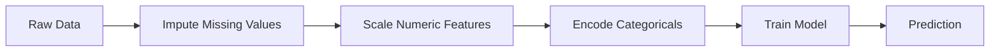
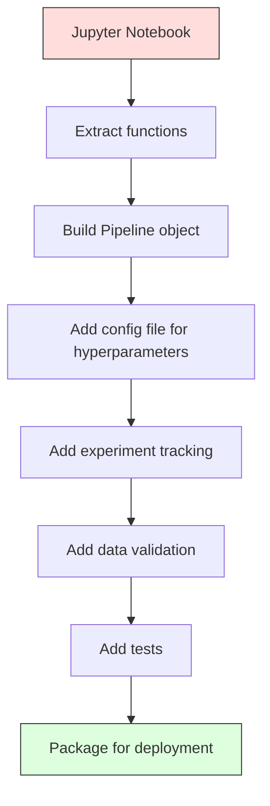

# ML Pipelines
# ML 管线


> A model is not a product. A pipeline is. The pipeline is everything from raw data to deployed prediction, and every step must be reproducible.

> 模型不是产品，管线才是。管线是从原始数据到部署预测的一切，每一步都必须可复现。

**Type:** Build | **类型：** 构建
**Language:** Python | **语言：** Python
**Prerequisites:** Phase 2, Lesson 12 (Hyperparameter Tuning) | **前置知识：** Phase 2 第 12 课（超参数调优）
**Time:** ~120 minutes | **时间：** 约 120 分钟

## Learning Objectives | 学习目标

- Build an ML pipeline from scratch that chains imputation, scaling, encoding, and model training into a single reproducible object
  从零构建 ML 管线，将填充、缩放、编码和模型训练链接为单个可复现对象
- Identify data leakage scenarios and explain how pipelines prevent them by fitting transformers only on training data
  识别数据泄漏场景，解释管线如何通过只在训练数据上拟合变换器来防止泄漏
- Construct a ColumnTransformer that applies different preprocessing to numeric and categorical features
  构建 ColumnTransformer，对数值和类别特征应用不同预处理
- Implement pipeline serialization and demonstrate that the same fitted pipeline produces identical results in training and production
  实现管线序列化，展示同一拟合管线在训练和生产中产生相同结果


> **【中文解读】**
> ML 管线把数据预处理、特征工程、模型训练串成一条流水线。sklearn Pipeline 确保训练和推理的数据处理一致。生产环境中管线化是模型部署的基础。

> **【拓展：从 sklearn Pipeline 到 MLOps 工业级管线】**
> sklearn Pipeline 处理单机场景的端到端流水线，但在工业界，ML 管线涉及更多环节：数据版本管理（DVC）、实验追踪（MLflow/W&B）、模型注册（Model Registry）、持续训练（CT）、模型服务（Seldon/TF Serving）。Google 的 TFX（TensorFlow Extended）和 Kubeflow Pipelines 是端到端 MLOps 的代表框架。核心理念不变：每一步都要可复现、可追踪、可回滚。

## The Problem | 问题引入

You have a notebook that loads data, fills missing values with the median, scales features, trains a model, and prints accuracy. It works. You ship it.

> 你有一个 notebook，加载数据、用中位数填充缺失值、缩放特征、训练模型、打印准确率。它有效。你上线了。

A month later, someone retrains the model and gets different results. The median was computed on the full dataset including test data (data leakage). The scaling parameters were not saved, so inference uses different statistics. The feature engineering code was copy-pasted between training and serving, and the copies diverged. A categorical column gained a new value in production that the encoder has never seen.

> 一个月后，有人重新训练模型并得到不同结果。中位数是在包含测试数据的全量数据集上计算的（数据泄漏）。缩放参数没有保存，推理时使用了不同的统计量。特征工程代码在训练和服务之间复制粘贴，副本已经分叉。一个类别列在生产中出现编码器从未见过的新值。

These are not hypothetical. They are the most common reasons ML systems fail in production. Pipelines solve all of them by packaging every transformation step into a single, ordered, reproducible object.

> 这些不是假设。它们是 ML 系统在生产中失败的最常见原因。管线通过将每个变换步骤打包为一个有序、可复现的对象来解决所有这些问题。

> **【中文解读】**
> ML 管线解决的核心问题：训练和推理的数据处理必须完全一致。最常见的失败模式——在训练时用全量数据计算均值做标准化（包含了测试集），推理时用新数据计算均值——这就是数据泄漏。Pipeline 通过"只在训练集上 fit，在测试集/推理时只 transform"来保证一致性。

## The Concept | 核心概念

### What a Pipeline Is

A pipeline is an ordered sequence of data transformations followed by a model. Each step takes the output of the previous step as input. The entire pipeline is fitted once on training data. At inference time, the same fitted pipeline transforms new data and produces predictions.

> 管线是一个有序的数据变换序列，最后跟一个模型。每一步将上一步的输出作为输入。整个管线在训练数据上拟合一次。推理时，同一个拟合好的管线变换新数据并产生预测。



The pipeline guarantees:
- Transformations are fitted only on training data (no leakage)
  变换只在训练数据上拟合（无泄漏）
- The same transformations are applied at inference time
  推理时应用相同的变换
- The entire object can be serialized and deployed as one artifact
  整个对象可以序列化并作为一个构件部署
- Cross-validation applies the pipeline per fold, preventing subtle leakage
  交叉验证在每个折中应用管线，防止微妙的泄漏

### Data Leakage: The Silent Killer

Data leakage happens when information from the test set or future data contaminates training. Pipelines prevent the most common forms.

> 数据泄漏在测试集或未来数据的信息污染训练时发生。管线防止了最常见的泄漏形式。

**Leaky (wrong):**
```python
X = df.drop("target", axis=1)
y = df["target"]

scaler = StandardScaler()
X_scaled = scaler.fit_transform(X)

X_train, X_test = X_scaled[:800], X_scaled[800:]
y_train, y_test = y[:800], y[800:]
```

The scaler saw test data. The mean and standard deviation include test samples. This inflates accuracy estimates.

> 缩放器看到了测试数据。均值和标准差包含测试样本。这会夸大准确率估计。

**Correct:**
```python
X_train, X_test = X[:800], X[800:]

scaler = StandardScaler()
X_train_scaled = scaler.fit_transform(X_train)
X_test_scaled = scaler.transform(X_test)
```

With a pipeline, you do not need to think about this. The pipeline handles it automatically.

> 使用管线，你不需要考虑这些。管线自动处理。

### sklearn Pipeline

sklearn's `Pipeline` chains transformers and an estimator. It exposes `.fit()`, `.predict()`, and `.score()` that apply all steps in order.

> sklearn 的 `Pipeline` 将变换器和估计器链接起来。它暴露 `.fit()`、`.predict()` 和 `.score()`，按顺序应用所有步骤。

```python
from sklearn.pipeline import Pipeline
from sklearn.preprocessing import StandardScaler
from sklearn.linear_model import LogisticRegression

pipe = Pipeline([
    ("scaler", StandardScaler()),
    ("model", LogisticRegression()),
])

pipe.fit(X_train, y_train)
predictions = pipe.predict(X_test)
```

When you call `pipe.fit(X_train, y_train)`:
1. Scaler calls `fit_transform` on X_train
2. Model calls `fit` on the scaled X_train

When you call `pipe.predict(X_test)`:
1. Scaler calls `transform` (not fit_transform) on X_test
2. Model calls `predict` on the scaled X_test

The scaler never sees test data during fitting. This is the whole point.

> 当你调用 `pipe.fit(X_train, y_train)`：
> 1. 缩放器对 X_train 调用 `fit_transform`
> 2. 模型对缩放后的 X_train 调用 `fit`
>
> 当你调用 `pipe.predict(X_test)`：
> 1. 缩放器对 X_test 调用 `transform`（不是 fit_transform）
> 2. 模型对缩放后的 X_test 调用 `predict`
>
> 缩放器在拟合期间永远看不到测试数据。这就是全部意义。

### ColumnTransformer: Different Pipelines for Different Columns

Real datasets have numeric and categorical columns that need different preprocessing. `ColumnTransformer` handles this.

> 真实数据集有数值列和类别列，需要不同的预处理。`ColumnTransformer` 处理这个。

```python
from sklearn.compose import ColumnTransformer
from sklearn.preprocessing import StandardScaler, OneHotEncoder
from sklearn.impute import SimpleImputer

numeric_pipe = Pipeline([
    ("impute", SimpleImputer(strategy="median")),
    ("scale", StandardScaler()),
])

categorical_pipe = Pipeline([
    ("impute", SimpleImputer(strategy="most_frequent")),
    ("encode", OneHotEncoder(handle_unknown="ignore")),
])

preprocessor = ColumnTransformer([
    ("num", numeric_pipe, ["age", "income", "score"]),
    ("cat", categorical_pipe, ["city", "gender", "plan"]),
])

full_pipeline = Pipeline([
    ("preprocess", preprocessor),
    ("model", GradientBoostingClassifier()),
])
```

The `handle_unknown="ignore"` in OneHotEncoder is critical for production. When a new category appears (a city the model has never seen), it produces a zero vector instead of crashing.

> OneHotEncoder 中的 `handle_unknown="ignore"` 对生产至关重要。当出现新类别（模型从未见过的城市）时，它产生零向量而不是崩溃。

### Experiment Tracking

A pipeline makes training reproducible, but you also need to track what happened across experiments: which hyperparameters were used, which dataset version, what the metrics were, which code was running.

> 管线让训练可复现，但你还需要追踪实验间发生了什么：用了哪些超参数、哪个数据集版本、指标是什么、运行的是哪段代码。

**MLflow** is the most common open-source solution:

> **MLflow** 是最常见的开源方案：

```python
import mlflow

with mlflow.start_run():
    mlflow.log_param("max_depth", 5)
    mlflow.log_param("n_estimators", 100)
    mlflow.log_param("learning_rate", 0.1)

    pipe.fit(X_train, y_train)
    accuracy = pipe.score(X_test, y_test)

    mlflow.log_metric("accuracy", accuracy)
    mlflow.sklearn.log_model(pipe, "model")
```

Every run is recorded with parameters, metrics, artifacts, and the full model. You can compare runs, reproduce any experiment, and deploy any model version.

> 每次运行都记录参数、指标、构件和完整模型。你可以比较运行、复现任何实验、部署任何模型版本。

**Weights & Biases (wandb)** provides the same functionality with a hosted dashboard:

> **Weights & Biases (wandb)** 提供相同功能，带托管仪表盘：

```python
import wandb

wandb.init(project="my-pipeline")
wandb.config.update({"max_depth": 5, "n_estimators": 100})

pipe.fit(X_train, y_train)
accuracy = pipe.score(X_test, y_test)

wandb.log({"accuracy": accuracy})
```

### Model Versioning

After experiment tracking, you need to manage model versions. Which model is in production? Which is staging? Which was last week's?

> 实验追踪之后，你需要管理模型版本。哪个模型在生产中？哪个是 staging？上周的是哪个？

MLflow's Model Registry provides:
- **Version tracking:** Every saved model gets a version number
  **版本追踪：** 每个保存的模型获得版本号
- **Stage transitions:** "Staging", "Production", "Archived"
  **阶段转换：** "Staging"、"Production"、"Archived"
- **Approval workflow:** Models must be explicitly promoted to production
  **审批工作流：** 模型必须显式提升到生产
- **Rollback:** Switch back to a previous version instantly
  **回滚：** 立即切回之前的版本

### Data Versioning with DVC

Code is versioned with git. Data should be versioned too, but git cannot handle large files. DVC (Data Version Control) solves this.

> 代码用 git 版本化。数据也应该版本化，但 git 不能处理大文件。DVC（Data Version Control）解决这个问题。

```
dvc init
dvc add data/training.csv
git add data/training.csv.dvc data/.gitignore
git commit -m "Track training data"
dvc push
```

DVC stores the actual data in remote storage (S3, GCS, Azure) and keeps a small `.dvc` file in git that records the hash. When you checkout a git commit, `dvc checkout` restores the exact data that was used.

> DVC 把实际数据存储在远端（S3、GCS、Azure），在 git 中保留一个小的 `.dvc` 文件记录哈希。当你 checkout 一个 git 提交时，`dvc checkout` 恢复当时使用的精确数据。

This means every git commit pins both the code and the data. Full reproducibility.

> 这意味着每个 git 提交同时固定了代码和数据。完全可复现。

### Reproducible Experiments

A reproducible experiment requires four things:

> 一个可复现的实验需要四件事：

1. **Fixed random seeds:** Set seeds for numpy, random, and the framework (torch, sklearn)
   **固定随机种子：** 为 numpy、random 和框架（torch、sklearn）设置种子
2. **Pinned dependencies:** requirements.txt or poetry.lock with exact versions
   **固定依赖：** requirements.txt 或 poetry.lock 锁定精确版本
3. **Versioned data:** DVC or similar
   **版本化数据：** DVC 或类似工具
4. **Config files:** All hyperparameters in a config, not hardcoded
   **配置文件：** 所有超参数放配置里，不要硬编码

```python
import numpy as np
import random

def set_seed(seed=42):
    random.seed(seed)
    np.random.seed(seed)
    try:
        import torch
        torch.manual_seed(seed)
        torch.cuda.manual_seed_all(seed)
        torch.backends.cudnn.deterministic = True
    except ImportError:
        pass
```

### From Notebook to Production Pipeline



The typical progression:

> 典型演进：

1. **Notebook exploration:** Quick experiments, visualizations, feature ideas
   **notebook 探索：** 快速实验、可视化、特征想法
2. **Extract functions:** Move preprocessing, feature engineering, evaluation into modules
   **抽取函数：** 把预处理、特征工程、评估移到模块里
3. **Build Pipeline:** Chain transformations into a sklearn Pipeline or custom class
   **构建 Pipeline：** 把变换链成 sklearn Pipeline 或自定义类
4. **Config management:** Move all hyperparameters into a YAML/JSON config
   **配置管理：** 把所有超参数移到 YAML/JSON 配置
5. **Experiment tracking:** Add MLflow or wandb logging
   **实验追踪：** 添加 MLflow 或 wandb 日志
6. **Data validation:** Check schema, distributions, and missing value patterns before training
   **数据验证：** 训练前检查 schema、分布、缺失模式
7. **Tests:** Unit tests for transformers, integration tests for the full pipeline
   **测试：** 变换器的单元测试、完整管线的集成测试
8. **Deployment:** Serialize the pipeline, wrap in an API (FastAPI, Flask), containerize
   **部署：** 序列化管线、包成 API（FastAPI、Flask）、容器化

### Common Pipeline Mistakes

| Mistake | Why it is bad | Fix |
|---------|-------------|-----|
| Fitting on full data before splitting | Data leakage | Use Pipeline with cross_val_score |
| Feature engineering outside pipeline | Different transforms at train vs serve | Put all transforms in the Pipeline |
| Not handling unknown categories | Production crash on new values | OneHotEncoder(handle_unknown="ignore") |
| Hardcoded column names | Breaks when schema changes | Use column name lists from config |
| No data validation | Silently wrong predictions on bad data | Add schema checks before prediction |
| Training/serving skew | Model sees different features in prod | One Pipeline object for both |

| 错误 | 为什么坏 | 修复 |
|------|---------|------|
| 划分前在全量数据上 fit | 数据泄漏 | 用 Pipeline 配合 cross_val_score |
| 管线外做特征工程 | 训练和服务变换不同 | 把所有变换放进 Pipeline |
| 不处理未知类别 | 生产中新值导致崩溃 | OneHotEncoder(handle_unknown="ignore") |
| 硬编码列名 | schema 改变时失效 | 用配置中的列名列表 |
| 没有数据验证 | 坏数据上预测错误无提示 | 预测前加 schema 检查 |
| 训练/服务偏差 | 生产中模型看到不同特征 | 训练和服务用同一个 Pipeline 对象 |

## Build It | 动手实现

> **【中文解读】**
> 从零实现 ML 管线：自定义 Transformer（实现 fit/transform 接口）、Pipeline 类（链式调用多个变换器）、ColumnTransformer（按列分组处理不同类型特征）。管线的关键保证是：fit 只在训练数据上学习参数，transform 在测试/推理数据上应用相同变换，杜绝数据泄漏。

> **【拓展：sklearn Pipeline 在 Kaggle 和工业界的标准模式】**
> Kaggle Grandmaster 的标准代码模板几乎总是包含一个 sklearn Pipeline：数值特征用 SimpleImputer + StandardScaler，类别特征用 SimpleImputer + OneHotEncoder，通过 ColumnTransformer 组合后输入模型。这确保了：交叉验证中每折独立 fit、新数据推理时变换一致、代码简洁可维护。在生产中，Pipeline 可以用 joblib 序列化保存，部署时直接加载使用。

The code in `code/pipeline.py` builds a complete ML pipeline from scratch:

### Step 1: Custom Transformer

```python
class CustomTransformer:
    def __init__(self):
        self.means = None
        self.stds = None

    def fit(self, X):
        self.means = np.mean(X, axis=0)
        self.stds = np.std(X, axis=0)
        self.stds[self.stds == 0] = 1.0
        return self

    def transform(self, X):
        return (X - self.means) / self.stds

    def fit_transform(self, X):
        return self.fit(X).transform(X)
```

### Step 2: Pipeline from Scratch

```python
class PipelineFromScratch:
    def __init__(self, steps):
        self.steps = steps

    def fit(self, X, y=None):
        X_current = X.copy()
        for name, step in self.steps[:-1]:
            X_current = step.fit_transform(X_current)
        name, model = self.steps[-1]
        model.fit(X_current, y)
        return self

    def predict(self, X):
        X_current = X.copy()
        for name, step in self.steps[:-1]:
            X_current = step.transform(X_current)
        name, model = self.steps[-1]
        return model.predict(X_current)
```

### Step 3: Cross-Validation with Pipeline

The code demonstrates how cross-validation with a pipeline prevents data leakage: the scaler is fit separately on each fold's training data.

### Step 4: Full Production Pipeline with sklearn

A complete pipeline with `ColumnTransformer`, multiple preprocessing paths, and a model, trained with proper cross-validation and experiment logging.

## Ship It | 产出物

This lesson produces:
- `outputs/prompt-ml-pipeline.md` -- a skill for building and debugging ML pipelines
- `code/pipeline.py` -- a complete pipeline from scratch through sklearn

## Exercises | 练习题

1. Build a pipeline that handles a dataset with 3 numeric columns and 2 categorical columns. Use `ColumnTransformer` to apply median imputation + scaling to numerics and most-frequent imputation + one-hot encoding to categoricals. Train with 5-fold cross-validation.
   1. 构建处理 3 个数值列和 2 个类别列的数据集的管线。用 `ColumnTransformer` 对数值列应用中位数填充+缩放，对类别列应用众数填充+独热编码。用 5 折交叉验证训练。

2. Deliberately introduce data leakage: fit the scaler on the full dataset before splitting. Compare the cross-validation score (leaky) to the pipeline cross-validation score (clean). How large is the difference?
   2. 故意引入数据泄漏：在划分前对全量数据 fit scaler。比较泄漏的交叉验证分数和管线的交叉验证分数。差异多大？

3. Serialize your pipeline with `joblib.dump`. Load it in a separate script and run predictions. Verify the predictions are identical.
   3. 用 `joblib.dump` 序列化你的管线。在另一个脚本中加载并运行预测。验证预测完全相同。

4. Add a custom transformer to the pipeline that creates polynomial features (degree 2) for the two most important numeric columns. Where should it go in the pipeline?
   4. 在管线中添加一个自定义变换器，为最重要的两个数值列创建多项式特征（degree 2）。它应该放在管线的什么位置？

5. Set up MLflow tracking for the pipeline. Run 5 experiments with different hyperparameters. Use the MLflow UI (`mlflow ui`) to compare runs and pick the best model.
   5. 为管线设置 MLflow 追踪。用不同超参数运行 5 个实验。用 MLflow UI（`mlflow ui`）比较运行并挑选最佳模型。

> **【中文解读】**
> ML 管线的关键设计原则：(1) 所有变换必须可序列化——用 joblib/pickle 保存完整的 fitted pipeline，部署时直接加载；(2) ColumnTransformer 处理混合类型——数值特征和类别特征分别变换后合并；(3) 管线内不能有任何全局状态——每个 transformer 的 fit 只依赖传入的训练数据。这些原则确保了训练-推理一致性。

> **【拓展：数据泄漏的六种常见形式】**
> (1) 在全量数据上 fit scaler 再划分；(2) 目标编码使用全量数据计算均值；(3) 时间序列随机划分；（4）特征选择在全量数据上做；(5) 交叉验证中重复样本出现在多个 fold；(6) 预测时使用了未来才能获取的特征。Pipeline 通过严格的 fit/transform 分离防止前四种泄漏。对于时间序列和重复样本，需要特殊的交叉验证策略。

## Key Terms | 术语速查表

| Term | What people say | What it actually means |
|------|----------------|----------------------|
| Pipeline | "Chain of transforms + model" | An ordered sequence of fitted transformers and a model, applied as one unit to prevent leakage |
| Data leakage | "Test info leaked into training" | Using information from outside the training set to build the model, inflating performance estimates |
| ColumnTransformer | "Different preprocessing per column" | Applies different pipelines to different subsets of columns, combining results |
| Experiment tracking | "Logging your runs" | Recording parameters, metrics, artifacts, and code versions for every training run |
| MLflow | "Track and deploy models" | Open-source platform for experiment tracking, model registry, and deployment |
| DVC | "Git for data" | Version control system for large data files, storing hashes in git and data in remote storage |
| Model registry | "Model version catalog" | A system that tracks model versions with stage labels (staging, production, archived) |
| Training/serving skew | "It worked in the notebook" | Differences between how data is processed during training versus inference, causing silent errors |
| Reproducibility | "Same code, same result" | The ability to get identical results from the same code, data, and configuration |

## Further Reading | 延伸阅读

- [scikit-learn Pipeline docs](https://scikit-learn.org/stable/modules/compose.html) -- the official pipeline reference
  [scikit-learn Pipeline 文档](https://scikit-learn.org/stable/modules/compose.html) - 官方管线参考
- [MLflow documentation](https://mlflow.org/docs/latest/index.html) -- experiment tracking and model registry
  [MLflow 文档](https://mlflow.org/docs/latest/index.html) - 实验追踪和模型注册
- [DVC documentation](https://dvc.org/doc) -- data versioning
  [DVC 文档](https://dvc.org/doc) - 数据版本管理
- [Sculley et al., Hidden Technical Debt in Machine Learning Systems (2015)](https://papers.nips.cc/paper/2015/hash/86df7dcfd896fcaf2674f757a2463eba-Abstract.html) -- the seminal paper on ML systems complexity
  [Sculley et al., Hidden Technical Debt in ML Systems (2015)](https://papers.nips.cc/paper/2015/hash/86df7dcfd896fcaf2674f757a2463eba-Abstract.html) - ML 系统复杂性的奠基论文
- [Google ML Best Practices: Rules of ML](https://developers.google.com/machine-learning/guides/rules-of-ml) -- practical production ML advice
  [Google ML Best Practices](https://developers.google.com/machine-learning/guides/rules-of-ml) - 实用生产 ML 建议
