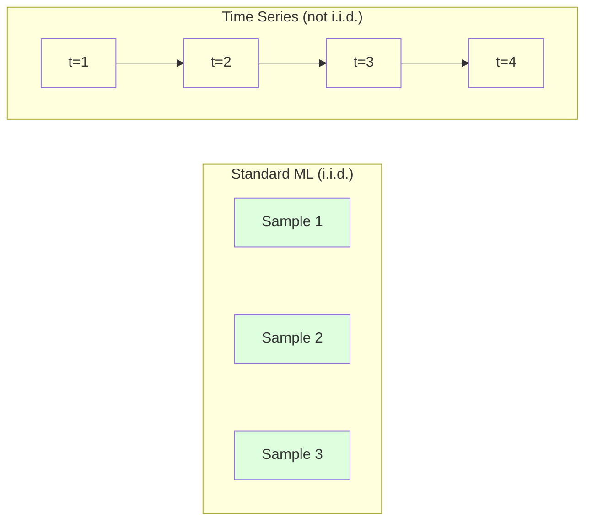
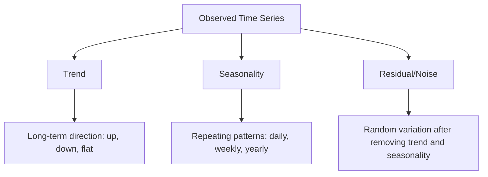
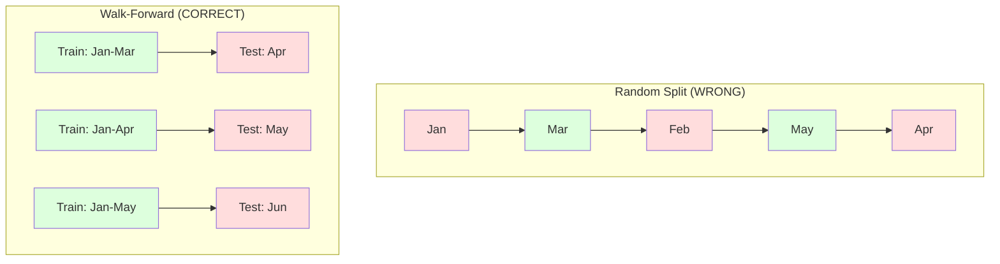

# Time Series Fundamentals
# 时间序列基础


> Past performance does predict future results -- if you check for stationarity first.

> 过去的表现确实能预测未来——前提是你先检查了平稳性。

**Type:** Build | **类型：** 构建
**Language:** Python | **语言：** Python
**Prerequisites:** Phase 2, Lessons 01-09 | **前置知识：** Phase 2 第 1-9 课
**Time:** ~90 minutes | **时间：** 约 90 分钟

## Learning Objectives | 学习目标

- Decompose a time series into trend, seasonality, and residual components and test for stationarity
  将时间序列分解为趋势、季节性和残差分量，并检验平稳性
- Implement lag features and rolling statistics to convert a time series into a supervised learning problem
  实现滞后特征和滚动统计将时间序列转换为监督学习问题
- Build a walk-forward validation framework that prevents future data from leaking into training
  构建前向滚动验证框架，防止未来数据泄漏到训练中
- Explain why random train/test splits are invalid for time series and demonstrate the performance gap versus proper temporal splits
  解释为什么随机训练/测试分割对时间序列无效，并用正确的时间分割展示性能差距


> **【中文解读】**
> 时间序列是按时间顺序排列的数据。ARIMA、指数平滑是经典方法，LSTM/Transformer 是深度学习方法。股票预测、销量预测、天气预报是典型应用。

> **【拓展：时间序列预测在金融和供应链中的关键角色】**
> Amazon 使用时间序列预测来管理全球数亿 SKU 的库存，每天的预测量超过 4 亿次；Uber 使用时间序列模型预测需求来动态调价（Surge Pricing）；金融机构用 ARIMA/GARCH 模型预测波动率进行风险管理。时间序列最关键的教训：绝不能用随机划分做交叉验证——必须用时间顺序划分（walk-forward validation），否则就是"用未来预测过去"。

## The Problem | 问题引入

You have data ordered by time. Daily sales, hourly temperature, per-minute CPU usage, weekly stock prices. You want to predict the next value, the next week, the next quarter.

> 你有按时间排序的数据。日销售额、小时温度、每分钟 CPU 使用率、周股票价格。你想预测下一个值、下一周、下一个季度。

You reach for your standard ML toolkit: random train/test split, cross-validation, feature matrix in, prediction out. Every step is wrong.

> 你使用标准 ML 工具：随机训练/测试划分、交叉验证、特征矩阵输入、预测输出。每一步都是错的。

Time series breaks the assumptions that standard ML relies on. Samples are not independent -- today's temperature depends on yesterday's. Random splits leak future information into the past. Features that look great in backtest fail in production because they rely on patterns that shift over time.

> 时间序列打破了标准 ML 所依赖的假设。样本不是独立的——今天的温度取决于昨天的。随机划分将未来信息泄漏到过去。在回测中看起来很好的特征在生产中失败，因为它们依赖随时间变化的模式。

A model that gets 95% accuracy with random cross-validation might get 55% with proper time-based evaluation. The difference is not a technicality. It is the difference between a model that works on paper and one that works in production.

> 一个在随机交叉验证中获得 95% 准确率的模型在正确的时间评估下可能只获得 55%。这不是技术细节。这是在纸面上有效的模型与在生产中有效的模型之间的区别。

This lesson covers the fundamentals: what makes time data different, how to evaluate models honestly, and how to turn a time series into features that standard ML models can consume.

> 本课涵盖基础知识：什么使时间数据不同、如何诚实地评估模型，以及如何将时间序列转化为标准 ML 模型可以使用的特征。

> **【中文解读】**
> 时间序列分析的独特之处在于数据点之间有时间依赖性——今天的值依赖昨天的值。这打破了标准 ML 的独立同分布假设。核心概念：平稳性（stationarity）——统计特性不随时间变化；趋势+季节性+残差分解；滞后特征和滚动统计将序列转为监督学习问题。正确的评估方法是 walk-forward validation，而非随机交叉验证。

## The Concept | 核心概念

### What Makes Time Series Different

Standard ML assumes i.i.d. -- independent and identically distributed. Each sample is drawn from the same distribution, independently of other samples. Time series violates both:

> 标准 ML 假设 i.i.d.——独立同分布。每个样本从相同分布中抽取，与其他样本无关。时间序列违反了这两个假设：

- **Not independent.** Today's stock price depends on yesterday's. This week's sales correlate with last week's.
  不独立。今天的股价取决于昨天的。本周的销售额与上周相关。
- **Not identically distributed.** The distribution shifts over time. Sales in December look different from sales in March.
  非同分布。分布随时间变化。12 月的销售额与 3 月的不同。

These violations are not minor. They change how you build features, how you evaluate models, and which algorithms work.

> 这些违反不是小问题。它们改变了你如何构建特征、如何评估模型以及哪些算法有效。



In standard ML, samples are interchangeable. Shuffling them changes nothing. In time series, order is everything. Shuffling destroys the signal.

> 在标准 ML 中，样本是可互换的。打乱它们不会有任何改变。在时间序列中，顺序就是一切。打乱会破坏信号。

### Components of a Time Series

Every time series is a combination of:

> 每个时间序列都是以下成分的组合：



- **Trend**: The long-term direction. Revenue growing 10% per year. Global temperature rising.
  趋势：长期方向。收入每年增长 10%。全球温度上升。
- **Seasonality**: Repeating patterns at fixed intervals. Retail sales spike in December. Air conditioning usage peaks in July.
  季节性：固定间隔的重复模式。零售销售额在 12 月激增。空调使用量在 7 月达到峰值。
- **Residual**: Whatever is left after removing trend and seasonality. If the residual looks like white noise, the decomposition captured the signal.
  残差：去除趋势和季节性后剩下的部分。如果残差看起来像白噪声，说明分解已捕获了信号。

### Stationarity

A time series is stationary if its statistical properties (mean, variance, autocorrelation) do not change over time. Most forecasting methods assume stationarity.

> 如果一个时间序列的统计特性（均值、方差、自相关）不随时间变化，则它是平稳的。大多数预测方法假设平稳性。

**Why it matters:** A non-stationary series has a mean that drifts. A model trained on data from January has learned a different mean than what February will show. It will be systematically wrong.

> **为什么重要：** 非平稳序列的均值会漂移。用 1 月数据训练的模型学到的均值与 2 月显示的不同。它会系统性地出错。

**How to check:** Compute rolling mean and rolling standard deviation over windows. If they drift, the series is non-stationary.

> **如何检查：** 计算窗口内的滚动均值和滚动标准差。如果它们漂移，序列就是非平稳的。

**How to fix:** Differencing. Instead of modeling the raw values, model the change between consecutive values:

> **如何修复：** 差分。不对原始值建模，而是对连续值之间的变化建模：

```
diff[t] = value[t] - value[t-1]
```

If one round of differencing does not make the series stationary, apply it again (second-order differencing). Most real-world series need at most two rounds.

> 如果一轮差分不能使序列平稳，再应用一次（二阶差分）。大多数真实世界的序列最多需要两轮。

**Example:**

> **示例：**

Original series: [100, 102, 106, 112, 120]
First difference:  [2, 4, 6, 8] (still trending upward)
Second difference:  [2, 2, 2] (constant -- stationary)

The original series had a quadratic trend. First differencing turned it into a linear trend. Second differencing made it flat. In practice, you rarely need more than two rounds.

> 原始序列有二次趋势。一阶差分将其变为线性趋势。二阶差分使其平坦。实践中，你很少需要超过两轮。

**Formal test:** The Augmented Dickey-Fuller (ADF) test is the standard statistical test for stationarity. The null hypothesis is "the series is non-stationary." A p-value below 0.05 means you can reject the null and conclude stationarity. We do not implement ADF from scratch (it requires asymptotic distribution tables), but the rolling statistics approach in our code gives a practical visual check.

> **正式检验：** Augmented Dickey-Fuller（ADF）检验是平稳性的标准统计检验。零假设是"序列非平稳"。p 值低于 0.05 意味着你可以拒绝零假设并得出平稳的结论。我们不从零实现 ADF（它需要渐近分布表），但代码中的滚动统计方法提供了实用的可视化检查。

### Autocorrelation

Autocorrelation measures how much a value at time t correlates with the value at time t-k (k steps in the past). The autocorrelation function (ACF) plots this correlation for each lag k.

> 自相关衡量时间 t 的值与时间 t-k（过去 k 步）的值之间的相关性。自相关函数（ACF）绘制每个滞后 k 的相关性。

**ACF tells you:**
- How far back the series remembers. If ACF drops to zero after lag 5, values more than 5 steps ago are irrelevant.
  序列的记忆有多远。如果 ACF 在滞后 5 后降为零，超过 5 步之前的值就无关了。
- Whether seasonality exists. If ACF spikes at lag 12 (monthly data), there is yearly seasonality.
  是否存在季节性。如果 ACF 在滞后 12 处（月度数据）出现尖峰，则存在年度季节性。
- How many lag features to create. Use lags up to where ACF becomes negligible.
  创建多少滞后特征。使用直到 ACF 变得可忽略的滞后。

**PACF (Partial Autocorrelation Function)** removes indirect correlations. If today correlates with 3 days ago only because both correlate with yesterday, PACF at lag 3 will be zero while ACF at lag 3 will not.

> **PACF（偏自相关函数）** 去除间接相关性。如果今天与 3 天前相关仅仅因为两者都与昨天相关，PACF 在滞后 3 处为零，而 ACF 在滞后 3 处不为零。

### Lag Features: Turning Time Series into Supervised Learning

Standard ML models need a feature matrix X and a target y. Time series gives you a single column of values. The bridge is lag features.

> 标准 ML 模型需要特征矩阵 X 和目标 y。时间序列给你一列值。桥梁是滞后特征。

Take the series [10, 12, 14, 13, 15] and create lag-1 and lag-2 features:

> 取序列 [10, 12, 14, 13, 15] 并创建滞后 1 和滞后 2 特征：

| lag_2 | lag_1 | target |
|-------|-------|--------|
| 10    | 12    | 14     |
| 12    | 14    | 13     |
| 14    | 13    | 15     |

Now you have a standard regression problem. Any ML model (linear regression, random forest, gradient boosting) can predict the target from the lags.

> 现在你有了一个标准的回归问题。任何 ML 模型（线性回归、随机森林、梯度提升）都可以从滞后特征预测目标。

Additional features you can engineer:
- **Rolling statistics:** mean, std, min, max over the last k values
  滚动统计：过去 k 个值的均值、标准差、最小值、最大值
- **Calendar features:** day of week, month, is_holiday, is_weekend
  日历特征：星期几、月份、是否假期、是否周末
- **Differenced values:** change from previous step
  差分值：与前一步的变化
- **Expanding statistics:** cumulative mean, cumulative sum
  扩展统计：累积均值、累积和
- **Ratio features:** current value / rolling mean (how far from recent average)
  比率特征：当前值 / 滚动均值（与近期平均值的偏离程度）
- **Interaction features:** lag_1 * day_of_week (weekday effects on momentum)
  交互特征：lag_1 * day_of_week（工作日对动量的影响）

**How many lags?** Use the autocorrelation function. If ACF is significant up to lag 10, use at least 10 lags. If there is weekly seasonality, include lag 7 (and possibly 14). More lags give the model more history but also more features to fit, increasing the risk of overfitting.

> **用多少个滞后？** 使用自相关函数。如果 ACF 在滞后 10 以内都显著，至少使用 10 个滞后。如果有周季节性，包括滞后 7（可能还有 14）。更多滞后给模型更多历史，但也需要拟合更多特征，增加过拟合风险。

**The target alignment trap.** When creating lag features, the target must be the value at time t, and all features must use values at time t-1 or earlier. If you accidentally include the value at time t as a feature, you have a perfect predictor -- and a completely useless model. This is the most common bug in time series feature engineering.

> **目标对齐陷阱。** 创建滞后特征时，目标必须是时间 t 的值，所有特征必须使用时间 t-1 或更早的值。如果你不小心将时间 t 的值作为特征，你就有了一个完美的预测器——但也是一个完全无用的模型。这是时间序列特征工程中最常见的 bug。

### Walk-Forward Validation

This is the most important concept in this lesson. Standard k-fold cross-validation randomly assigns samples to train and test. For time series, this leaks future information.

> 这是本课最重要的概念。标准 k 折交叉验证随机分配样本到训练集和测试集。对于时间序列，这会泄漏未来信息。



Walk-forward validation:
1. Train on data up to time t
   在时间 t 之前的数据上训练
2. Predict at time t+1 (or t+1 to t+k for multi-step)
   在时间 t+1 预测（或多步预测 t+1 到 t+k）
3. Slide the window forward
   向前滑动窗口
4. Repeat
   重复

Each test fold only contains data that comes after all training data. No future leakage. This gives you an honest estimate of how the model will perform when deployed.

> 每个测试折只包含所有训练数据之后的数据。没有未来泄漏。这为你提供了模型部署时性能的诚实估计。

**Expanding window** uses all historical data for training (window grows). **Sliding window** uses a fixed-size training window (window slides). Use expanding when you believe older data is still relevant. Use sliding when the world changes and old data hurts.

> **扩展窗口**使用所有历史数据进行训练（窗口增长）。**滑动窗口**使用固定大小的训练窗口（窗口滑动）。当你认为旧数据仍然相关时使用扩展窗口。当世界变化且旧数据有害时使用滑动窗口。

### ARIMA Intuition

ARIMA is the classical time series model. It has three components:

> ARIMA 是经典的时间序列模型。它有三个组成部分：

- **AR (Autoregressive):** Predict from past values. AR(p) uses the last p values.
  AR（自回归）：从过去的值预测。AR(p) 使用最近 p 个值。
- **I (Integrated):** Differencing to achieve stationarity. I(d) applies d rounds of differencing.
  I（积分）：通过差分实现平稳性。I(d) 应用 d 轮差分。
- **MA (Moving Average):** Predict from past forecast errors. MA(q) uses the last q errors.
  MA（移动平均）：从过去的预测误差预测。MA(q) 使用最近 q 个误差。

ARIMA(p, d, q) combines all three. You choose p, d, q based on ACF/PACF analysis or automated search (auto-ARIMA).

> ARIMA(p, d, q) 组合了所有三个成分。你基于 ACF/PACF 分析或自动搜索（auto-ARIMA）选择 p、d、q。

We will not implement ARIMA from scratch -- it requires numerical optimization that is beyond the scope of this lesson. The key insight is understanding what each component does so you can interpret ARIMA results and know when to use it.

> 我们不会从零实现 ARIMA——它需要超出本课范围的数值优化。关键洞察是理解每个成分的作用，这样你就能解读 ARIMA 结果并知道何时使用它。

### When to Use What

| Approach | Best For | Handles Seasonality | Handles External Features |
|----------|---------|-------------------|------------------------|
| Lag features + ML | Tabular with many external features | With calendar features | Yes |
| ARIMA | Single univariate series, short-term | SARIMA variant | No (ARIMAX for limited) |
| Exponential smoothing | Simple trend + seasonality | Yes (Holt-Winters) | No |
| Prophet | Business forecasting, holidays | Yes (Fourier terms) | Limited |
| Neural networks (LSTM, Transformer) | Long sequences, many series | Learned | Yes |

For most practical problems, lag features + gradient boosting is the strongest starting point. It handles external features naturally, does not require stationarity, and is easy to debug.

> 对于大多数实际问题，滞后特征 + 梯度提升是最强的起点。它自然地处理外部特征，不需要平稳性，而且易于调试。

### Forecasting Horizons and Strategies

Single-step forecasting predicts one time step ahead. Multi-step forecasting predicts multiple steps. There are three strategies:

> 单步预测预测下一个时间步。多步预测预测多个时间步。有三种策略：

**Recursive (iterated):** Predict one step ahead, use the prediction as input for the next step. Simple but errors accumulate -- each prediction uses the previous prediction, so mistakes compound.

> **递归（迭代）：** 预测一步，将预测结果作为下一步的输入。简单但误差会累积——每个预测使用前一个预测，因此错误会叠加。

**Direct:** Train a separate model for each horizon. Model-1 predicts t+1, Model-5 predicts t+5. No error accumulation, but each model has fewer training samples and they do not share information.

> **直接：** 为每个预测范围训练单独的模型。Model-1 预测 t+1，Model-5 预测 t+5。没有误差累积，但每个模型的训练样本更少且不共享信息。

**Multi-output:** Train one model that outputs all horizons simultaneously. Shares information across horizons but requires a model that supports multiple outputs (or a custom loss function).

> **多输出：** 训练一个模型同时输出所有预测范围。跨范围共享信息，但需要支持多输出的模型（或自定义损失函数）。

For most practical problems, start with recursive for short horizons (1-5 steps) and direct for longer horizons.

> 对于大多数实际问题，短范围（1-5 步）用递归，长范围用直接方法。

### Common Mistakes in Time Series

| Mistake | Why it happens | How to fix |
|---------|---------------|-----------|
| Random train/test split | Habit from standard ML | Use walk-forward or temporal split |
| Using future features | Feature at time t included by mistake | Audit every feature for temporal alignment |
| Overfitting to seasonality | Model memorizes calendar patterns | Hold out a full seasonal cycle in the test set |
| Ignoring scale changes | Revenue doubles but patterns stay | Model percentage change instead of absolute |
| Too many lag features | "More history is better" | Use ACF to determine relevant lags |
| Not differencing | "The model will figure it out" | Tree models handle trends; linear models need stationarity |

## Build It | 动手实现

> **【中文解读】**
> 从零实现时间序列的核心工具：滞后特征生成器（将序列转为监督学习格式）、滚动统计（移动平均、移动标准差）、平稳性检验（ADF 检验）、时间序列分解（趋势+季节性+残差）、walk-forward 验证框架。关键教训：绝不能随机划分时间序列数据。

> **【拓展：从 ARIMA 到 Transformer——时间序列预测的进化】**
> 经典时间序列方法（ARIMA、Holt-Winters）在单变量、短序列上仍然有效。但现代方法已大幅超越：Facebook 的 Prophet 自动处理节假日和季节性；Amazon 的 DeepAR 使用自回归 RNN 做概率预测；Google 的 TimesFM 和 Amazon 的 Chronos 使用 Transformer 架构，在零样本（zero-shot）时间序列预测上取得突破。这些模型可以处理数千个相关时间序列的联合预测。

The code in `code/time_series.py` implements the core building blocks from scratch.

> `code/time_series.py` 中的代码从零实现了核心构建模块。

### Lag Feature Creator

```python
def make_lag_features(series, n_lags):
    n = len(series)
    X = np.full((n, n_lags), np.nan)
    for lag in range(1, n_lags + 1):
        X[lag:, lag - 1] = series[:-lag]
    valid = ~np.isnan(X).any(axis=1)
    return X[valid], series[valid]
```

This converts a 1D series into a feature matrix where each row has the last `n_lags` values as features, and the current value as the target.

> 这将一维序列转换为特征矩阵，每行将最近 `n_lags` 个值作为特征，当前值作为目标。

### Walk-Forward Cross-Validation

```python
def walk_forward_split(n_samples, n_splits=5, min_train=50):
    assert min_train < n_samples, "min_train must be less than n_samples"
    step = max(1, (n_samples - min_train) // n_splits)
    for i in range(n_splits):
        train_end = min_train + i * step
        test_end = min(train_end + step, n_samples)
        if train_end >= n_samples:
            break
        yield slice(0, train_end), slice(train_end, test_end)
```

Each split ensures training data comes strictly before test data. The training window expands with each fold.

> 每次分割确保训练数据严格在测试数据之前。训练窗口随每折扩展。

### Simple Autoregressive Model

A pure AR model is just linear regression on lag features:

> 纯 AR 模型就是滞后特征上的线性回归：

```python
class SimpleAR:
    def __init__(self, n_lags=5):
        self.n_lags = n_lags
        self.weights = None
        self.bias = None

    def fit(self, series):
        X, y = make_lag_features(series, self.n_lags)
        # Solve via normal equations
        X_b = np.column_stack([np.ones(len(X)), X])
        theta = np.linalg.lstsq(X_b, y, rcond=None)[0]
        self.bias = theta[0]
        self.weights = theta[1:]
        return self
```

This is conceptually identical to linear regression from Lesson 02, but applied to time-lagged versions of the same variable.

> 这在概念上与第 2 课的线性回归相同，但应用于同一变量的时间滞后版本。

### Stationarity Check

The code computes rolling statistics to visually and numerically assess stationarity:

> 代码计算滚动统计量，以可视化和数值方式评估平稳性：

```python
def check_stationarity(series, window=50):
    rolling_mean = np.array([
        series[max(0, i - window):i].mean()
        for i in range(1, len(series) + 1)
    ])
    rolling_std = np.array([
        series[max(0, i - window):i].std()
        for i in range(1, len(series) + 1)
    ])
    return rolling_mean, rolling_std
```

If the rolling mean drifts or the rolling std changes, the series is non-stationary. Apply differencing and check again.

> 如果滚动均值漂移或滚动标准差变化，序列就是非平稳的。应用差分然后重新检查。

The code also checks stationarity by comparing the first half and second half of the series. If the means differ by more than half a standard deviation or the variance ratio exceeds 2x, the series is flagged as non-stationary.

> 代码还通过比较序列的前半部分和后半部分来检查平稳性。如果均值差异超过半个标准差，或方差比超过 2 倍，序列被标记为非平稳。

### Autocorrelation

```python
def autocorrelation(series, max_lag=20):
    n = len(series)
    mean = series.mean()
    var = series.var()
    acf = np.zeros(max_lag + 1)
    for k in range(max_lag + 1):
        cov = np.mean((series[:n-k] - mean) * (series[k:] - mean))
        acf[k] = cov / var if var > 0 else 0
    return acf
```

## Use It | 用框架实现

With sklearn, you use lag features directly with any regressor:

> 使用 sklearn，你可以直接将滞后特征用于任何回归器：

```python
from sklearn.linear_model import Ridge
from sklearn.ensemble import GradientBoostingRegressor

X, y = make_lag_features(series, n_lags=10)

for train_idx, test_idx in walk_forward_split(len(X)):
    model = Ridge(alpha=1.0)
    model.fit(X[train_idx], y[train_idx])
    predictions = model.predict(X[test_idx])
```

For ARIMA, use statsmodels:

> 对于 ARIMA，使用 statsmodels：

```python
from statsmodels.tsa.arima.model import ARIMA

model = ARIMA(train_series, order=(5, 1, 2))
fitted = model.fit()
forecast = fitted.forecast(steps=30)
```

The code in `time_series.py` demonstrates both approaches and compares them using walk-forward validation.

> `time_series.py` 中的代码演示了两种方法，并使用前向滚动验证进行比较。

### sklearn TimeSeriesSplit

sklearn provides `TimeSeriesSplit` which implements walk-forward validation:

> sklearn 提供了 `TimeSeriesSplit`，实现了前向滚动验证：

```python
from sklearn.model_selection import TimeSeriesSplit

tscv = TimeSeriesSplit(n_splits=5)
for train_index, test_index in tscv.split(X):
    X_train, X_test = X[train_index], X[test_index]
    y_train, y_test = y[train_index], y[test_index]
    model.fit(X_train, y_train)
    score = model.score(X_test, y_test)
```

This is equivalent to our from-scratch `walk_forward_split` but integrated into sklearn's cross-validation framework. You can use it with `cross_val_score`:

> 这等同于我们从零实现的 `walk_forward_split`，但集成在 sklearn 的交叉验证框架中。你可以将其与 `cross_val_score` 一起使用：

```python
from sklearn.model_selection import cross_val_score

scores = cross_val_score(model, X, y, cv=TimeSeriesSplit(n_splits=5))
print(f"Mean score: {scores.mean():.4f} +/- {scores.std():.4f}")
```

### Evaluation Metrics

Time series forecasting uses regression metrics, but with time-aware context:

> 时间序列预测使用回归指标，但具有时间感知的上下文：

- **MAE (Mean Absolute Error):** Average of |y_true - y_pred|. Easy to interpret in original units. "On average, predictions are off by 3.2 degrees."
  MAE（平均绝对误差）：|y_true - y_pred| 的平均值。易于用原始单位解释。"平均而言，预测偏差 3.2 度。"
- **RMSE (Root Mean Squared Error):** Square root of mean squared error. Penalizes large errors more than MAE. Use when big errors are worse than many small errors.
  RMSE（均方根误差）：均方误差的平方根。比 MAE 更严重地惩罚大误差。当大误差比许多小误差更糟糕时使用。
- **MAPE (Mean Absolute Percentage Error):** Average of |error / true_value| * 100. Scale-independent, useful for comparing across different series. But undefined when true values are zero.
  MAPE（平均绝对百分比误差）：|误差 / 真实值| * 100 的平均值。与尺度无关，适用于跨不同序列比较。但当真实值为零时未定义。
- **Naive baseline comparison:** Always compare against simple baselines. The seasonal naive baseline predicts the value from one period ago (yesterday, last week). If your model cannot beat naive, something is wrong.
  朴素基线比较：始终与简单基线比较。季节性朴素基线预测一个周期前的值（昨天、上周）。如果你的模型无法超越朴素基线，说明出了问题。

### Rolling Features

The code demonstrates adding rolling statistics (mean, std, min, max over windows of 7 and 14 days) to lag features. These give the model information about recent trends and volatility that lag features alone do not capture.

> 代码演示了将滚动统计（7 天和 14 天窗口的均值、标准差、最小值、最大值）添加到滞后特征中。这些为模型提供了单独的滞后特征无法捕获的近期趋势和波动性信息。

For example, if the rolling mean is rising, it suggests an upward trend. If the rolling std is increasing, it suggests growing volatility. These are the kinds of patterns that tree-based models can learn from but linear models cannot.

> 例如，如果滚动均值在上升，说明有上升趋势。如果滚动标准差在增加，说明波动性在增长。这些是树模型可以学习但线性模型无法学习的模式。

## Ship It | 产出物

This lesson produces:
- `outputs/prompt-time-series-advisor.md` -- a prompt for framing time series problems
  `outputs/prompt-time-series-advisor.md` —— 构建时间序列问题的提示词
- `code/time_series.py` -- lag features, walk-forward validation, AR model, stationarity checks
  `code/time_series.py` —— 滞后特征、前向滚动验证、AR 模型、平稳性检查

### Baselines You Must Beat

Before building any model, establish baselines:

> 在构建任何模型之前，建立基线：

1. **Last value (persistence).** Predict that tomorrow will be the same as today. For many series, this is surprisingly hard to beat.
   最后值（持久性）。预测明天和今天一样。对于许多序列，这出奇地难以超越。
2. **Seasonal naive.** Predict that today will be the same as the same day last week (or last year). If your model cannot beat this, it has not learned any useful pattern beyond seasonality.
   季节性朴素。预测今天与上周（或去年）同一天相同。如果你的模型无法超越这个基线，它没有学到任何超出季节性的有用模式。
3. **Moving average.** Predict the average of the last k values. Smooths noise but cannot capture sudden changes.
   移动平均。预测最近 k 个值的平均值。平滑噪声但无法捕获突变。

If your fancy ML model loses to the seasonal naive baseline, you have a bug. Most commonly: future leakage in features, wrong evaluation method, or the series is truly random and unpredictable.

> 如果你精心设计的 ML 模型输给了季节性朴素基线，你有 bug。最常见的是：特征中的未来泄漏、错误的评估方法，或者序列确实是随机且不可预测的。

### Practical Tips

1. **Start with plotting.** Before any modeling, plot the raw series. Look for trends, seasonality, outliers, structural breaks (sudden changes in behavior). A 30-second visual inspection often tells you more than an hour of automated analysis.
   先画图。在任何建模之前，绘制原始序列。寻找趋势、季节性、异常值、结构性突变（行为的突然变化）。30 秒的视觉检查通常比一小时的自动分析告诉你更多。

2. **Difference first, model second.** If the series has a clear trend, difference it before creating lag features. Tree-based models can handle trends, but linear models cannot, and differencing never hurts.
   先差分，后建模。如果序列有明显趋势，在创建滞后特征之前先差分。树模型可以处理趋势，但线性模型不能，而差分不会有负面影响。

3. **Hold out at least one full seasonal cycle.** If you have weekly seasonality, your test set needs at least one full week. If monthly, at least one full month. Otherwise you cannot evaluate whether the model captured the seasonal pattern.
   留出至少一个完整的季节周期。如果你有周季节性，测试集需要至少一整周。如果是月度的，至少一整月。否则你无法评估模型是否捕获了季节性模式。

4. **Monitor in production.** Time series models degrade over time as the world changes. Track prediction errors on a rolling basis. When errors start increasing, retrain the model on recent data.
   在生产中监控。时间序列模型随着世界变化而退化。以滚动方式跟踪预测误差。当误差开始增加时，用近期数据重新训练模型。

5. **Beware of regime changes.** A model trained on pre-pandemic data will not predict post-pandemic behavior. Include indicators of known regime changes as features, or use a sliding window that forgets old data.
   当心状态变化。用疫情前数据训练的模型无法预测疫情后的行为。将已知状态变化的指示器作为特征，或使用会遗忘旧数据的滑动窗口。

6. **Log-transform skewed series.** Revenue, prices, and counts are often right-skewed. Taking the log stabilizes variance and makes multiplicative patterns additive, which linear models can handle. Forecast in log space, then exponentiate to get back to original units.
   对数变换偏斜序列。收入、价格和计数通常是右偏的。取对数可稳定方差，使乘法模式变为加法模式，线性模型可以处理。在对数空间预测，然后指数化回到原始单位。

## Exercises | 练习题

1. **Stationarity experiment.** Generate a series with a linear trend. Check stationarity with rolling statistics. Apply first differencing. Check again. How many rounds of differencing does it take for a quadratic trend?
   1. 生成一个带趋势和季节性的合成时间序列。用移动平均和差分去除趋势。ADF 检验确认平稳性。

2. **Lag selection.** Compute ACF on a seasonal series (period=7). Which lags have the highest autocorrelation? Create lag features using only those lags (not consecutive lags). Does accuracy improve compared to using lags 1 through 7?
   2. 构建滞后特征（lag 1-7）和滚动统计（窗口 3、7、14）。用梯度提升树预测。比较不同特征组合的准确率。

3. **Walk-forward vs random split.** Train a Ridge regression on lag features. Evaluate with random 80/20 split and with walk-forward validation. How much does the random split overestimate performance?
   3. 在同一数据集上比较随机交叉验证和前向滚动验证。展示随机分割导致过度乐观的估计。

4. **Feature engineering.** Add rolling mean (window=7), rolling std (window=7), and day-of-week features to the lag features. Compare accuracy with and without these extras using walk-forward validation.
   4. 实现 ARIMA(p, d, q) 从零。网格搜索最优参数，用 AIC 选择最佳模型。

5. **Multi-step forecasting.** Modify the AR model to predict 5 steps ahead instead of 1. Compare two strategies: (a) predict one step, use the prediction as input for the next step (recursive), and (b) train separate models for each horizon (direct). Which is more accurate?

> **【中文解读】**
> 时间序列的核心工具箱：ADF 检验判断平稳性（p-value < 0.05 拒绝非平稳假设）；差分消除趋势（一阶差分 = 今天 - 昨天）；滞后特征将序列转为监督学习格式（用 t-1, t-2,... 的值预测 t）；滚动统计捕获局部趋势（7 天移动平均）。Walk-forward 验证是唯一正确的评估方法：每次用过去的数据预测未来，然后滑动窗口。

## Key Terms | 术语速查表

| Term | What people say | What it actually means |
|------|----------------|----------------------|
| Stationarity | "The stats don't change over time" | A series whose mean, variance, and autocorrelation structure are constant over time |
| Differencing | "Subtract consecutive values" | Computing y[t] - y[t-1] to remove trends and achieve stationarity |
| Autocorrelation (ACF) | "How a series correlates with itself" | The correlation between a time series and a lagged copy of itself, as a function of the lag |
| Partial autocorrelation (PACF) | "Direct correlation only" | Autocorrelation at lag k after removing the effect of all shorter lags |
| Lag features | "Past values as inputs" | Using y[t-1], y[t-2], ..., y[t-k] as features to predict y[t] |
| Walk-forward validation | "Time-respecting cross-validation" | Evaluation where training data always precedes test data chronologically |
| ARIMA | "The classic time series model" | AutoRegressive Integrated Moving Average: combines past values (AR), differencing (I), and past errors (MA) |
| Seasonality | "Repeating calendar patterns" | Regular, predictable cycles in a time series tied to calendar periods (daily, weekly, yearly) |
| Trend | "The long-term direction" | A persistent increase or decrease in the series level over time |
| Expanding window | "Use all history" | Walk-forward validation where the training set grows with each fold |
| Sliding window | "Fixed-size history" | Walk-forward validation where the training set is a fixed-length window that slides forward |

## Further Reading | 延伸阅读

- [Hyndman and Athanasopoulos, Forecasting: Principles and Practice (3rd ed.)](https://otexts.com/fpp3/) -- the best free textbook on time series forecasting
  [Hyndman & Athanasopoulos: Forecasting: Principles and Practice](https://otexts.com/fpp3/) - 免费在线教材
- [scikit-learn Time Series Split](https://scikit-learn.org/stable/modules/generated/sklearn.model_selection.TimeSeriesSplit.html) -- sklearn's walk-forward splitter
  [statsmodels 时间序列文档](https://www.statsmodels.org/stable/tsa.html) - Python 时间序列分析库
- [statsmodels ARIMA docs](https://www.statsmodels.org/stable/generated/statsmodels.tsa.arima.model.ARIMA.html) -- ARIMA implementation with diagnostics
  [sklearn TimeSeriesSplit](https://scikit-learn.org/stable/modules/cross_validation.html#time-series-cross-validation)
- [Makridakis et al., The M5 Competition (2022)](https://www.sciencedirect.com/science/article/pii/S0169207021001874) -- large-scale forecasting competition showing ML methods vs statistical methods
