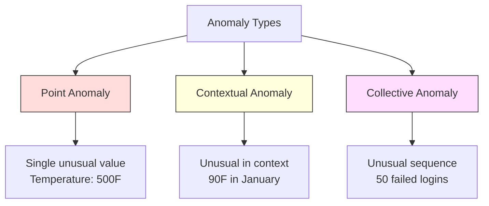
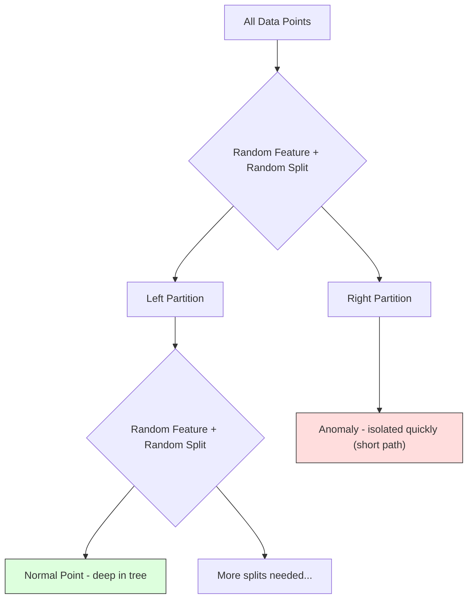
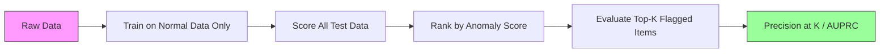

# Anomaly Detection
# 异常检测


> Normal is easy to define. Abnormal is whatever doesn't fit.

> 正常容易定义。不正常的就是不拟合的。

**Type:** Build | **类型：** 构建
**Language:** Python | **语言：** Python
**Prerequisites:** Phase 2, Lessons 01-09 | **前置知识：** Phase 2 第 1-9 课
**Time:** ~75 minutes | **时间：** 约 75 分钟

## Learning Objectives | 学习目标

- Implement Z-score, IQR, and Isolation Forest anomaly detection methods from scratch
  从零实现 Z-score、IQR 和 Isolation Forest 异常检测方法
- Distinguish between point, contextual, and collective anomalies and select the appropriate detection method for each
  区分点异常、上下文异常和集合异常，为每种选择合适的检测方法
- Explain why anomaly detection is framed as modeling normal data rather than classifying anomalies
  解释为什么异常检测被框架为建模正常数据而非分类异常
- Compare unsupervised anomaly detection with supervised classification and evaluate the tradeoff between novel anomaly coverage and precision
  比较无监督异常检测与监督分类，评估新异常覆盖率和精确率之间的权衡


> **【中文解读】**
> 异常检测找出不一样的数据点。信用卡欺诈检测、设备故障预警、网络入侵检测都依赖它。Isolation Forest 和 One-Class SVM 是常用方法。sklearn 中的 IsolationForest。

> **【拓展：异常检测在金融和网络安全中的核心应用】**
> Visa 的实时欺诈检测系统每秒处理约 76,000 笔交易，使用异常检测+监督学习的混合方法，在约 150 毫秒内判断是否为欺诈。Google 的网络安全系统使用异常检测发现 DDoS 攻击和异常登录行为。特斯拉的电池管理系统用异常检测提前预警电池故障。异常检测的核心挑战是极度不平衡——欺诈率通常低于 0.1%，使得监督学习难以直接使用。

## The Problem | 问题引入

A credit card is used in New York at 2pm, then in Tokyo at 2:05pm. A factory sensor reads 150 degrees when the normal range is 80-120. A server sends 50,000 requests per second when the daily average is 200.

> 一张信用卡下午 2 点在纽约使用，然后 2:05 在东京使用。工厂传感器读数 150 度，而正常范围是 80-120。服务器每秒发送 50,000 个请求，而日平均是 200。

These are anomalies. Finding them matters. Fraud costs billions. Equipment failures cost downtime. Network intrusions cost data.

> 这些是异常。发现它们很重要。欺诈造成数十亿损失。设备故障导致停机。网络入侵造成数据泄露。

The challenge: you rarely have labeled examples of anomalies. Fraud makes up 0.1% of transactions. Equipment failures happen a few times per year. You cannot train a standard classifier because there is almost nothing in the "anomaly" class to learn from. Even if you have some labels, the anomalies you have seen are not the only types you will encounter. Tomorrow's fraud scheme looks different from today's.

> 挑战在于：你很少有异常的标注样本。欺诈只占交易的 0.1%。设备故障每年只发生几次。你无法训练标准分类器，因为"异常"类中几乎没有东西可以学习。即使有一些标签，你见过的异常也不是你会遇到的唯一类型。明天的欺诈方案看起来和今天不同。

Anomaly detection flips the problem. Instead of learning what is abnormal, learn what is normal. Anything that deviates from normal is suspicious. This works without labels, adapts to new types of anomalies, and scales to massive datasets.

> 异常检测翻转了问题。不学"什么是异常"，而是学"什么是正常"。任何偏离正常的东西都是可疑的。这无需标签，适应新类型的异常，并扩展到大规模数据集。

> **【中文解读】**
> 异常检测的关键思路反转：不学"什么是异常"，而是学"什么是正常"，偏离正常的就是可疑的。常用方法：Z-score（基于统计）、IQR（基于四分位距）、Isolation Forest（基于隔离的随机森林）、One-Class SVM（学习正常数据的边界）。异常类型分为点异常、上下文异常和集合异常，不同类型需要不同的检测策略。

## The Concept | 核心概念

### Types of Anomalies

Not all anomalies are the same:

> 并非所有异常都相同：

- **Point anomalies.** A single data point that is unusual regardless of context. A temperature reading of 500 degrees. A transaction of $50,000 from an account that normally spends $50.
  点异常。无论上下文如何都不正常的单个数据点。500 度的温度读数。通常花费 50 美元的账户突然有一笔 50,000 美元的交易。
- **Contextual anomalies.** A data point that is unusual given its context. A temperature of 90 degrees is normal in summer, anomalous in winter. Same value, different context.
  上下文异常。给定上下文后不正常的数据点。90 度在夏天正常，在冬天则异常。同样的值，不同的上下文。
- **Collective anomalies.** A sequence of data points that is unusual as a group, even though each individual point might be normal. Five login failures is normal. Fifty in a row is a brute-force attack.
  集合异常。一组数据点作为整体不正常，即使每个单独的点可能是正常的。五次登录失败正常。连续五十次就是暴力破解攻击。

Most methods detect point anomalies. Contextual anomalies need time or location features. Collective anomalies need sequence-aware methods.

> 大多数方法检测点异常。上下文异常需要时间或位置特征。集合异常需要序列感知方法。



### The Unsupervised Framing

In standard classification, you have labels for both classes. In anomaly detection, you typically have one of three situations:

> 在标准分类中，你有两个类别的标签。在异常检测中，你通常遇到以下三种情况之一：

1. **Fully unsupervised.** No labels at all. You fit the detector on all data and hope anomalies are rare enough not to corrupt the "normal" model.
   完全无监督。完全没有标签。你在所有数据上拟合检测器，希望异常足够少以至于不会破坏"正常"模型。
2. **Semi-supervised.** You have a clean dataset of normal data only. You fit on this clean set and score everything else. This is the strongest setup when possible.
   半监督。你只有一个干净的正 常数据集。你在这个干净集合上拟合，然后对其他所有数据打分。这是可能时最强的设置。
3. **Weakly supervised.** You have a few labeled anomalies. Use them for evaluation, not training. Train unsupervised, then measure precision/recall on the labeled subset.
   弱监督。你有一些标注的异常。将它们用于评估而非训练。无监督训练，然后在标注子集上测量精确率/召回率。

The key insight: anomaly detection is fundamentally different from classification. You are modeling the distribution of normal data, not the decision boundary between two classes.

> 关键洞察：异常检测与分类根本不同。你在建模正常数据的分布，而不是两个类别之间的决策边界。

### Supervised vs Unsupervised: The Tradeoff

If you do have labeled anomalies, should you use them for training (supervised classification) or for evaluation only (unsupervised detection)?

> 如果你确实有标注的异常，应该将它们用于训练（监督分类）还是仅用于评估（无监督检测）？

**Supervised (treat as classification):**
- Catches the exact types of anomalies you have seen before
  捕获你之前见过的确切类型的异常
- Higher precision on known anomaly types
  对已知异常类型有更高的精确率
- Misses novel anomaly types entirely
  完全错过新类型的异常
- Requires retraining when new anomaly types emerge
  当新异常类型出现时需要重新训练
- Needs enough anomaly examples (often too few)
  需要足够的异常样本（通常太少）

**Unsupervised (model normal, flag deviations):**
- Catches any deviation from normal, including novel types
  捕获任何偏离正常的情况，包括新类型
- Does not require labeled anomalies
  不需要标注的异常
- Higher false positive rate (not everything unusual is bad)
  更高的假阳性率（并非所有不寻常的都是坏的）
- More robust to distribution shift
  对分布偏移更鲁棒

In practice, the best systems combine both: unsupervised detection for broad coverage, supervised models for known high-priority anomaly types, and human review for ambiguous cases.

> 在实践中，最好的系统结合两者：无监督检测用于广泛覆盖，监督模型用于已知的高优先级异常类型，人工审查用于模棱两可的情况。

### Z-Score Method

The simplest approach. Compute the mean and standard deviation of each feature. Flag any point more than k standard deviations from the mean.

> 最简单的方法。计算每个特征的均值和标准差。标记任何偏离均值超过 k 个标准差的点。

```text
z_score = (x - mean) / std
anomaly if |z_score| > threshold
```

The default threshold is 3.0 (99.7% of normal data falls within 3 standard deviations for a Gaussian distribution).

> 默认阈值为 3.0（高斯分布中 99.7% 的正常数据落在 3 个标准差以内）。

**Strengths:** Simple. Fast. Interpretable ("this value is 4.5 standard deviations from normal").

> **优势：** 简单。快速。可解释（"这个值偏离正常 4.5 个标准差"）。

**Weaknesses:** Assumes data is normally distributed. Sensitive to outliers in the training data (the outliers shift the mean and inflate the std, making them harder to detect). Fails on multimodal distributions.

> **劣势：** 假设数据服从正态分布。对训练数据中的异常值敏感（异常值会偏移均值并膨胀标准差，使它们更难被检测）。在多峰分布上失败。

**When it works well:** Single-feature monitoring where data is roughly bell-shaped. Server response times, manufacturing tolerances, sensor readings with stable baselines.

> **适用场景：** 数据大致呈钟形的单特征监控。服务器响应时间、制造公差、具有稳定基线的传感器读数。

**When it fails:** Multi-cluster data (two office locations with different baseline temperatures), skewed data (transaction amounts where $1000 is rare but not anomalous), data with outliers in the training set.

> **失效场景：** 多聚类数据（两个办公室有不同的基线温度）、偏斜数据（1000 美元的交易金额虽罕见但并非异常）、训练集中有异常值的数据。

### IQR Method

More robust than Z-score. Uses the interquartile range instead of mean and standard deviation.

> 比 Z-score 更鲁棒。使用四分位距代替均值和标准差。

```
Q1 = 25th percentile
Q3 = 75th percentile
IQR = Q3 - Q1
lower_bound = Q1 - factor * IQR
upper_bound = Q3 + factor * IQR
anomaly if x < lower_bound or x > upper_bound
```

The default factor is 1.5.

> 默认因子为 1.5。

**Strengths:** Robust to outliers (percentiles are not affected by extreme values). Works on skewed distributions. No normality assumption.

> **优势：** 对异常值鲁棒（百分位数不受极端值影响）。适用于偏斜分布。无正态性假设。

**Weaknesses:** Univariate only (applies per feature independently). Cannot detect anomalies that are unusual only when features are considered together (a point might be normal in each feature individually but anomalous in the joint space).

> **劣势：** 仅限单变量（独立应用于每个特征）。无法检测仅在特征联合考虑时才异常的点（一个点在每个特征上可能正常，但在联合空间中异常）。

**Practical note:** The 1.5 factor in IQR corresponds to the whiskers in a box plot. Points outside the whiskers are potential outliers. Using 3.0 instead of 1.5 makes the detector more conservative (fewer flags, fewer false positives). The right factor depends on your tolerance for false alarms.

> **实践提示：** IQR 中的 1.5 因子对应于箱线图的须。须外的点是潜在的异常值。使用 3.0 而非 1.5 使检测器更保守（更少的标记、更少的假阳性）。正确的因子取决于你对误报的容忍度。

### Isolation Forest

The key insight: anomalies are few and different. In a random partitioning of the data, anomalies are easier to isolate -- they need fewer random splits to be separated from the rest.

> 关键洞察：异常很少且与众不同。在数据的随机划分中，异常更容易被隔离——它们需要更少的随机分裂就能与其余数据分离。



**How it works:**
1. Build many random trees (an isolation forest)
   构建许多随机树（隔离森林）
2. At each node, pick a random feature and a random split value between the feature's min and max
   在每个节点，随机选择一个特征和特征最小值与最大值之间的随机分裂值
3. Keep splitting until every point is isolated (in its own leaf)
   持续分裂直到每个点都被隔离（在自己的叶节点中）
4. Anomalies have shorter average path lengths across all trees
   异常在所有树中的平均路径长度更短

**Why it works:** Normal points live in dense regions. Many random splits are needed to isolate one from its neighbors. Anomalies live in sparse regions. One or two random splits are enough to isolate them.

> **为什么有效：** 正常点位于密集区域。需要许多随机分裂才能将一个点与其邻居隔离。异常位于稀疏区域。一两次随机分裂就足以隔离它们。

The anomaly score is based on the average path length across all trees, normalized by the expected path length of a random binary search tree:

> 异常分数基于所有树中的平均路径长度，由随机二叉搜索树的期望路径长度归一化：

```
score(x) = 2^(-average_path_length(x) / c(n))
```

Where `c(n)` is the expected path length for n samples. Score near 1 means anomaly. Score near 0.5 means normal. Score near 0 means very normal (deep in dense clusters).

> 其中 `c(n)` 是 n 个样本的期望路径长度。分数接近 1 意味着异常。分数接近 0.5 意味着正常。分数接近 0 意味着非常正常（位于密集聚类深处）。

**Strengths:** No distribution assumptions. Works in high dimensions. Scales well (sublinear in sample size because each tree uses a subsample). Handles mixed feature types.

> **优势：** 无分布假设。适用于高维。扩展性好（样本量亚线性，因为每棵树使用子采样）。处理混合特征类型。

**Weaknesses:** Struggles with anomalies in dense regions (masking effect). Random splitting is less effective when many features are irrelevant.

> **劣势：** 难以处理密集区域中的异常（遮蔽效应）。当许多特征无关时，随机分裂效果较差。

**Key hyperparameters:**
- `n_estimators`: Number of trees. 100 is usually enough. More trees give more stable scores but slower computation.
  `n_estimators`：树的数量。100 通常足够。更多树给出更稳定的分数但计算更慢。
- `max_samples`: Number of samples per tree. 256 is the default in the original paper. Smaller values make individual trees less accurate but increase diversity. The subsampling is what makes Isolation Forest fast -- each tree sees a small fraction of the data.
  `max_samples`：每棵树的样本数。原始论文默认为 256。更小的值使单棵树不够准确但增加多样性。子采样是 Isolation Forest 快速的原因——每棵树只看到数据的一小部分。
- `contamination`: Expected fraction of anomalies. Used only for setting the threshold. Does not affect the scores themselves.
  `contamination`：预期的异常比例。仅用于设置阈值。不影响分数本身。

### Local Outlier Factor (LOF)

LOF compares the local density around a point to the density around its neighbors. A point in a sparse region surrounded by dense regions is anomalous.

> LOF 将一个点周围的局部密度与其邻居周围的密度进行比较。一个被密集区域包围的稀疏区域中的点是异常的。

**How it works:**
1. For each point, find its k nearest neighbors
   对于每个点，找到其 k 个最近邻
2. Compute the local reachability density (how dense is the neighborhood)
   计算局部可达密度（邻域有多密集）
3. Compare each point's density to its neighbors' densities
   比较每个点的密度与其邻居的密度
4. If a point has much lower density than its neighbors, it is an outlier
   如果一个点的密度远低于其邻居，它就是异常点

**LOF score:**
- LOF close to 1.0 means similar density as neighbors (normal)
  LOF 接近 1.0 意味着与邻居密度相似（正常）
- LOF greater than 1.0 means lower density than neighbors (potentially anomalous)
  LOF 大于 1.0 意味着密度低于邻居（可能异常）
- LOF much greater than 1.0 (e.g., 2.0+) means significantly lower density (likely anomaly)
  LOF 远大于 1.0（如 2.0+）意味着密度显著更低（很可能是异常）

The "local" part is critical. Consider a dataset with two clusters: a dense cluster of 1000 points and a sparse cluster of 50 points. A point on the edge of the sparse cluster is not globally unusual -- it has 50 neighbors. But it is locally unusual if its immediate neighbors are denser than it is. LOF captures this nuance that global methods miss.

> "局部"是关键。考虑一个有两个聚类的数据集：一个 1000 个点的密集聚类和一个 50 个点的稀疏聚类。稀疏聚类边缘的点并非全局异常——它有 50 个邻居。但如果它的近邻比它更密集，它就是局部异常的。LOF 捕获了全局方法遗漏的这种细微差别。

**Strengths:** Detects local anomalies (points that are unusual in their neighborhood, even if they are not globally unusual). Works on clusters of different densities.

> **优势：** 检测局部异常（在邻域中不寻常的点，即使它们不是全局异常）。适用于不同密度的聚类。

**Weaknesses:** Slow on large datasets (O(n^2) for naive implementation). Sensitive to the choice of k. Does not work well in very high dimensions (curse of dimensionality affects distance calculations).

> **劣势：** 在大数据集上速度慢（朴素实现为 O(n^2)）。对 k 的选择敏感。在非常高维度上效果不佳（维度诅咒影响距离计算）。

### Comparison

| Method | Assumptions | Speed | Handles High Dims | Detects Local Anomalies |
|--------|------------|-------|-------------------|------------------------|
| Z-score | Normal distribution | Very fast | Yes (per feature) | No |
| IQR | None (per feature) | Very fast | Yes (per feature) | No |
| Isolation Forest | None | Fast | Yes | Partially |
| LOF | Distance is meaningful | Slow | Poorly | Yes |

### Evaluation Challenges

Evaluating anomaly detectors is harder than evaluating classifiers:

> 评估异常检测器比评估分类器更困难：

- **Extreme class imbalance.** With 0.1% anomalies, predicting "normal" for everything gives 99.9% accuracy. Accuracy is useless.
  极端的类别不平衡。0.1% 的异常率下，全部预测为"正常"可得 99.9% 准确率。准确率毫无用处。
- **AUROC is misleading.** With heavy imbalance, AUROC can look good even when the model misses most anomalies at practical thresholds.
  AUROC 具有误导性。在严重不平衡时，即使模型在实用阈值下错过了大部分异常，AUROC 看起来仍然不错。
- **Better metrics:** Precision@k (of the top k flagged items, how many are real anomalies), AUPRC (area under precision-recall curve), and recall at a fixed false positive rate.
  更好的指标：Precision@k（排名前 k 个标记项中有多少是真正的异常）、AUPRC（精确率-召回率曲线下面积）和固定假阳性率下的召回率。



### Anomaly Detection Pipeline

In practice, anomaly detection follows this workflow:

> 在实践中，异常检测遵循以下工作流：

1. **Collect baseline data.** Ideally, a period where you know there are no (or very few) anomalies.
   收集基线数据。理想情况下，是一段你知道没有（或很少有）异常的时期。
2. **Feature engineering.** Raw features plus derived features (rolling statistics, time features, ratios).
   特征工程。原始特征加上衍生特征（滚动统计、时间特征、比率）。
3. **Train the detector.** Fit on the baseline data. The model learns what "normal" looks like.
   训练检测器。在基线数据上拟合。模型学习"正常"的样子。
4. **Score new data.** Each new observation gets an anomaly score.
   对新数据打分。每个新观测获得一个异常分数。
5. **Threshold selection.** Choose the score cutoff. This is a business decision: higher threshold means fewer false alarms but more missed anomalies.
   选择阈值。选择分数截断值。这是一个业务决策：更高的阈值意味着更少的误报但更多漏检。
6. **Alert and investigate.** Flagged points go to human review or automated response.
   告警和调查。标记的点进入人工审查或自动响应。
7. **Feedback collection.** Record whether flagged items were true anomalies or false alarms. Use this data to evaluate the detector and tune the threshold over time.
   收集反馈。记录标记项是真正的异常还是误报。用这些数据评估检测器并随时间调优阈值。

The pipeline is never "done." Data distributions shift, new anomaly types emerge, and thresholds need adjustment. Treat anomaly detection as a living system, not a one-time model.

> 管线永远不会"完成"。数据分布偏移，新的异常类型出现，阈值需要调整。将异常检测视为一个活系统，而不是一次性模型。

## Build It | 动手实现

> **【中文解读】**
> 从零实现三种异常检测方法：Z-score（基于均值和标准差，适合近似正态分布的数据）、IQR（基于四分位距，对异常值鲁棒）、Isolation Forest（随机选择特征和分裂点隔离数据点，异常点平均需要更少的分裂次数）。Isolation Forest 是工业界最常用的无监督异常检测方法。

> **【拓展：异常检测在 AIOps 和制造业中的应用】**
> Microsoft Azure Monitor 使用异常检测自动发现云服务的性能异常；Netflix 用异常检测监控流媒体服务的各项指标（延迟、错误率等），每天检测数十亿数据点；富士康在生产线中使用异常检测提前发现设备故障，将停机时间减少 30%。异常检测的关键挑战是控制误报率——太多误报会让运维人员对告警"免疫"。

The code in `code/anomaly_detection.py` implements Z-score, IQR, and Isolation Forest from scratch.

> `code/anomaly_detection.py` 中的代码从零实现了 Z-score、IQR 和 Isolation Forest。

### Z-Score Detector

```python
def zscore_detect(X, threshold=3.0):
    mean = X.mean(axis=0)
    std = X.std(axis=0)
    std[std == 0] = 1.0
    z = np.abs((X - mean) / std)
    return z.max(axis=1) > threshold
```

Simple and vectorized. Flags a point if any feature exceeds the threshold.

> 简单且向量化。如果任何特征超过阈值则标记该点。

### IQR Detector

```python
def iqr_detect(X, factor=1.5):
    q1 = np.percentile(X, 25, axis=0)
    q3 = np.percentile(X, 75, axis=0)
    iqr = q3 - q1
    iqr[iqr == 0] = 1.0
    lower = q1 - factor * iqr
    upper = q3 + factor * iqr
    outside = (X < lower) | (X > upper)
    return outside.any(axis=1)
```

### Isolation Forest from Scratch

The from-scratch implementation builds isolation trees that randomly partition the feature space:

> 从零实现构建随机划分特征空间的隔离树：

```python
class IsolationTree:
    def __init__(self, max_depth):
        self.max_depth = max_depth

    def fit(self, X, depth=0):
        n, p = X.shape
        if depth >= self.max_depth or n <= 1:
            self.is_leaf = True
            self.size = n
            return self
        self.is_leaf = False
        self.feature = np.random.randint(p)
        x_min = X[:, self.feature].min()
        x_max = X[:, self.feature].max()
        if x_min == x_max:
            self.is_leaf = True
            self.size = n
            return self
        self.threshold = np.random.uniform(x_min, x_max)
        left_mask = X[:, self.feature] < self.threshold
        self.left = IsolationTree(self.max_depth).fit(X[left_mask], depth + 1)
        self.right = IsolationTree(self.max_depth).fit(X[~left_mask], depth + 1)
        return self
```

The path length to isolate a point determines its anomaly score. Shorter paths mean more anomalous.

> 隔离一个点的路径长度决定其异常分数。更短的路径意味着更异常。

The `IsolationForest` class wraps multiple trees:

> `IsolationForest` 类包装了多棵树：

```python
class IsolationForest:
    def __init__(self, n_estimators=100, max_samples=256, seed=42):
        self.n_estimators = n_estimators
        self.max_samples = max_samples

    def fit(self, X):
        sample_size = min(self.max_samples, X.shape[0])
        max_depth = int(np.ceil(np.log2(sample_size)))
        for _ in range(self.n_estimators):
            idx = rng.choice(X.shape[0], size=sample_size, replace=False)
            tree = IsolationTree(max_depth=max_depth)
            tree.fit(X[idx])
            self.trees.append(tree)

    def anomaly_score(self, X):
        avg_path = average path length across all trees
        scores = 2.0 ** (-avg_path / c(max_samples))
        return scores
```

The normalization factor `c(n)` is the expected path length of an unsuccessful search in a binary search tree with n elements. It equals `2 * H(n-1) - 2*(n-1)/n` where `H` is the harmonic number. This normalization ensures scores are comparable across datasets of different sizes.

> 归一化因子 `c(n)` 是 n 个元素的二叉搜索树中不成功搜索的期望路径长度。它等于 `2 * H(n-1) - 2*(n-1)/n`，其中 `H` 是调和数。这种归一化确保分数在不同大小的数据集之间可比较。

### Demo Scenarios

The code generates multiple test scenarios:

> 代码生成多个测试场景：

1. **Single cluster with outliers.** A 2D Gaussian cluster with anomalies injected far from the center. All methods should work here.
   单聚类加异常值。一个 2D 高斯聚类，在远离中心处注入异常。所有方法在此场景下应该都能工作。
2. **Multimodal data.** Three clusters of different sizes and densities. Points between clusters are anomalous. Z-score struggles because the per-feature ranges are wide.
   多峰数据。三个不同大小和密度的聚类。聚类之间的点是异常的。Z-score 在此表现不佳，因为每个特征的范围很宽。
3. **High-dimensional data.** 50 features, but anomalies differ in only 5 of them. Tests whether methods can find anomalies in a subset of features.
   高维数据。50 个特征，但异常仅在 5 个特征上不同。测试方法能否在特征子集中发现异常。

Each demo compares all methods using precision, recall, F1, and Precision@k.

> 每个演示使用精确率、召回率、F1 和 Precision@k 比较所有方法。

## Use It | 用框架实现

With sklearn (using library implementations, not from-scratch):

> 使用 sklearn（使用库实现，非从零实现）：

```python
from sklearn.ensemble import IsolationForest
from sklearn.neighbors import LocalOutlierFactor

iso = IsolationForest(n_estimators=100, contamination=0.05, random_state=42)
iso.fit(X_train)
predictions = iso.predict(X_test)

lof = LocalOutlierFactor(n_neighbors=20, contamination=0.05, novelty=True)
lof.fit(X_train)
predictions = lof.predict(X_test)
```

Note `contamination` sets the expected fraction of anomalies. Setting it correctly matters -- too low misses anomalies, too high creates false alarms.

> 注意 `contamination` 设置预期的异常比例。正确设置很重要——太低会漏检异常，太高会产生误报。

The code in `anomaly_detection.py` compares from-scratch implementations against sklearn on the same data.

> `anomaly_detection.py` 中的代码在相同数据上比较从零实现与 sklearn。

### sklearn Contamination Parameter

The `contamination` parameter in sklearn determines the threshold for converting continuous anomaly scores into binary predictions. It does not change the underlying scores.

> sklearn 中的 `contamination` 参数决定将连续异常分数转换为二值预测的阈值。它不改变底层分数。

```python
iso_5 = IsolationForest(contamination=0.05)
iso_10 = IsolationForest(contamination=0.10)
```

Both produce the same anomaly scores. But `iso_5` flags the top 5% while `iso_10` flags the top 10%. If you do not know the true anomaly rate (you usually do not), set contamination to "auto" and work with the raw scores directly. Set your own threshold based on the cost tradeoff between false positives and false negatives.

> 两者产生相同的异常分数。但 `iso_5` 标记前 5%，而 `iso_10` 标记前 10%。如果你不知道真实的异常率（通常不知道），将 contamination 设为"auto"并直接使用原始分数。根据假阳性和假阴性之间的成本权衡设置自己的阈值。

### One-Class SVM

Another unsupervised anomaly detector worth knowing. One-Class SVM fits a boundary around normal data in a high-dimensional feature space (using the kernel trick).

> 另一个值得了解的无监督异常检测器。One-Class SVM 在高维特征空间中围绕正常数据拟合一个边界（使用核技巧）。

```python
from sklearn.svm import OneClassSVM

oc_svm = OneClassSVM(kernel="rbf", gamma="auto", nu=0.05)
oc_svm.fit(X_train)
predictions = oc_svm.predict(X_test)
```

The `nu` parameter approximates the fraction of anomalies. One-Class SVM works well on small to medium datasets but does not scale to very large data (the kernel matrix grows quadratically).

> `nu` 参数近似异常的比例。One-Class SVM 在中小型数据集上效果良好，但不能扩展到非常大的数据（核矩阵呈二次增长）。

### Autoencoder Approach (Preview)

Autoencoders are neural networks that learn to compress and reconstruct data. Train on normal data. At test time, anomalies have high reconstruction error because the network learned to reconstruct normal patterns only.

> 自编码器是学习压缩和重构数据的神经网络。在正常数据上训练。测试时，异常具有高重构误差，因为网络只学会了重构正常模式。

This is covered in Phase 3 (Deep Learning), but the principle is the same: model what is normal, flag what deviates.

> 这在 Phase 3（深度学习）中讨论，但原理相同：建模什么是正常的，标记偏离的。

### Ensemble Anomaly Detection

Just as ensemble methods improve classification (Lesson 11), combining multiple anomaly detectors improves detection. The simplest approach:

> 正如集成方法改善分类（第 11 课），组合多个异常检测器可以改善检测。最简单的方法：

1. Run multiple detectors (Z-score, IQR, Isolation Forest, LOF)
   运行多个检测器（Z-score、IQR、Isolation Forest、LOF）
2. Normalize each detector's scores to [0, 1]
   将每个检测器的分数归一化到 [0, 1]
3. Average the normalized scores
   平均归一化后的分数
4. Flag points above the threshold on the average score
   标记平均分数超过阈值的点

This reduces false positives because different methods have different failure modes. A point flagged by all four methods is almost certainly anomalous. A point flagged by only one might be a quirk of that method.

> 这减少了假阳性，因为不同方法有不同的失败模式。被所有四种方法标记的点几乎肯定是异常的。只被一种方法标记的可能只是该方法的特性。

More sophisticated ensembles weight each detector by its estimated reliability (measured on a validation set with known anomalies, if available).

> 更复杂的集成根据每个检测器的估计可靠性加权（如果可用，在有已知异常的验证集上测量）。

### Production Considerations

1. **Threshold drift.** As data distribution shifts, a fixed threshold becomes outdated. Monitor the distribution of anomaly scores and adjust periodically.
   阈值漂移。随着数据分布偏移，固定阈值变得过时。监控异常分数的分布并定期调整。
2. **Alert fatigue.** Too many false alarms and operators stop paying attention. Start with a high threshold (fewer, more reliable alerts) and lower it as trust builds.
   告警疲劳。太多误报会让操作员不再关注。从高阈值开始（更少、更可靠的告警），随着信任建立再降低。
3. **Ensemble approach.** In production, combine multiple detectors. Flag a point only if multiple methods agree it is anomalous. This reduces false positives significantly.
   集成方法。在生产中，组合多个检测器。只有当多种方法一致认为异常时才标记。这显著减少假阳性。
4. **Feature engineering.** Raw features are rarely enough. Add rolling statistics, ratios, time-since-last-event, and domain-specific features. A good feature set matters more than the choice of detector.
   特征工程。原始特征很少足够。添加滚动统计、比率、距上次事件的时间等领域特定特征。好的特征集比检测器的选择更重要。
5. **Feedback loop.** When operators investigate flagged items and confirm or dismiss them, feed this back into the system. Accumulate labeled data over time to evaluate and improve the detector.
   反馈循环。当操作员调查标记项并确认或排除时，将反馈输入系统。随时间积累标注数据以评估和改进检测器。

## Ship It | 产出物

This lesson produces:
- `outputs/skill-anomaly-detector.md` -- a decision skill for choosing the right detector
  `outputs/skill-anomaly-detector.md` —— 选择合适检测器的决策技能
- `code/anomaly_detection.py` -- Z-score, IQR, and Isolation Forest from scratch, with sklearn comparison
  `code/anomaly_detection.py` —— 从零实现 Z-score、IQR 和 Isolation Forest，附 sklearn 比较

### Choosing a Threshold

The anomaly score is continuous. You need a threshold to make binary decisions. This is a business decision, not a technical one.

> 异常分数是连续的。你需要一个阈值来做出二值决策。这是一个业务决策，而非技术决策。

Consider two scenarios:
- **Fraud detection.** Missing fraud is expensive (chargebacks, customer trust). False alarms cost a human analyst 5 minutes to investigate. Set the threshold low to catch more fraud, accept more false alarms.
  欺诈检测。漏检欺诈代价高昂（退款、客户信任）。误报需要分析师 5 分钟调查。设置低阈值以捕获更多欺诈，接受更多误报。
- **Equipment maintenance.** A false alarm means an unnecessary shutdown costing $50,000. A missed failure means a $500,000 repair. Set the threshold to balance these costs.
  设备维护。误报意味着不必要的停机，成本 50,000 美元。漏检故障意味着 500,000 美元的维修。设置阈值以平衡这些成本。

In both cases, the optimal threshold depends on the cost ratio between false positives and false negatives. Plot precision and recall at different thresholds, overlay the cost function, and pick the minimum-cost point.

> 在两种情况下，最优阈值取决于假阳性和假阴性之间的成本比率。在不同阈值下绘制精确率和召回率，叠加成本函数，选择最小成本点。

### Scaling to Production

For real-time anomaly detection in production:

> 对于生产中的实时异常检测：

1. **Batch training, online scoring.** Train the model periodically (daily, weekly) on recent normal data. Score each new observation as it arrives.
   批量训练，在线打分。定期（每天、每周）在近期正常数据上训练模型。每个新观测到达时打分。
2. **Feature computation must match.** If you trained with rolling statistics over 30 days, you need 30 days of history to compute features for a new observation. Buffer the required history.
   特征计算必须匹配。如果你用 30 天的滚动统计训练，你需要 30 天的历史来为新观测计算特征。缓冲所需的历史数据。
3. **Score distribution monitoring.** Track the distribution of anomaly scores over time. If the median score drifts upward, either the data is changing or the model is stale.
   分数分布监控。随时间跟踪异常分数的分布。如果中位分数向上漂移，要么数据在变化，要么模型已过时。
4. **Explainability.** When you flag an anomaly, say why. Z-score: "Feature X is 4.2 standard deviations above normal." Isolation Forest: "This point was isolated in 3.1 splits on average (normal points take 8.5)."
   可解释性。当你标记异常时，说明原因。Z-score："特征 X 高于正常 4.2 个标准差。"Isolation Forest："该点平均被 3.1 次分裂隔离（正常点需要 8.5 次）。"

## Exercises | 练习题

1. **Threshold tuning.** Run the Z-score detector with thresholds from 1.0 to 5.0 in steps of 0.5. Plot precision and recall at each threshold. Where is the sweet spot for your data?
   1. 在正态数据中注入不同比例的异常（1%、5%、10%）。比较 Z-score、IQR 和 Isolation Forest 的精确率和召回率。

2. **Multivariate anomalies.** Create 2D data where each feature individually looks normal, but the combination is anomalous (e.g., points far from the main cluster diagonal). Show that Z-score per feature misses these but Isolation Forest catches them.
   2. 生成一个上下文异常数据集（正常值在冬季和夏季不同）。展示简单的 Z-score 在冬天把夏天的正常值标为异常。添加上下文特征后重新检测。

3. **LOF from scratch.** Implement Local Outlier Factor using k-nearest neighbors. Compare against sklearn's LocalOutlierFactor on the same data. Use k=10 and k=50 -- how does the choice of k affect results?
   3. 构建 Isolation Forest 的集成：训练 10 棵 Isolation Tree，取平均路径长度。比较单棵树与集成的稳定性。

4. **Streaming anomaly detection.** Modify the Z-score detector to work in a streaming setting: update the running mean and variance as new points arrive (Welford's online algorithm). Compare to batch Z-score on the same data.
   4. 用 Autoencoder 思路实现异常检测：训练一个简单的重构模型，标记重构误差高的点为异常。

5. **Real-world evaluation.** Take a dataset with known anomalies (credit card fraud from Kaggle, for example). Evaluate all four methods using precision@100, precision@500, and AUPRC. Which method works best? Why?

> **【中文解读】**
> 异常检测的评估用 Precision@K（排名前 K 个可疑案例中有多少是真正的异常）和 AUPRC（精确率-召回率曲线下面积）比准确率更有意义。Isolation Forest 的核心洞察：异常数据点更"稀疏"，随机特征分裂更容易将它们单独隔离——平均需要的分裂次数更少。这使它不需要定义"正常"的具体形式就能发现异常。

## Key Terms | 术语速查表

| Term | What people say | What it actually means |
|------|----------------|----------------------|
| Anomaly | "Outlier, unusual point" | A data point that deviates significantly from the expected pattern of normal data |
| Point anomaly | "A single weird value" | An individual observation that is unusual regardless of context |
| Contextual anomaly | "Normal value, wrong context" | An observation that is unusual given its context (time, location, etc.) but might be normal in another context |
| Isolation Forest | "Random splits to find outliers" | An ensemble of random trees that isolates anomalies with fewer splits than normal points |
| Local Outlier Factor | "Compare density to neighbors" | A method that flags points whose local density is much lower than their neighbors' density |
| Z-score | "Standard deviations from mean" | (x - mean) / std, measuring how far a point is from the center in units of standard deviation |
| IQR | "Interquartile range" | Q3 - Q1, measuring the spread of the middle 50% of data, used for robust outlier detection |
| Contamination | "Expected fraction of anomalies" | A hyperparameter telling the detector what proportion of the data it should flag as anomalous |
| Precision@k | "Of the top k flags, how many are real" | Precision computed on only the k most suspicious points, useful for imbalanced anomaly detection |
| AUPRC | "Area under precision-recall curve" | A metric that summarizes precision-recall performance across all thresholds, better than AUROC for imbalanced data |

## Further Reading | 延伸阅读

- [Liu et al., Isolation Forest (2008)](https://cs.nju.edu.cn/zhouzh/zhouzh.files/publication/icdm08b.pdf) -- the original Isolation Forest paper
  [Liu et al.: Isolation Forest (2008)](https://ieeexplore.ieee.org/document/4781136) - Isolation Forest 原始论文
- [Breunig et al., LOF: Identifying Density-Based Local Outliers (2000)](https://dl.acm.org/doi/10.1145/342009.335388) -- the original LOF paper
  [Chandola et al.: Anomaly Detection: A Survey (2009)](https://dl.acm.org/doi/10.1145/1541880.1541882) - 异常检测综述
- [scikit-learn Outlier Detection docs](https://scikit-learn.org/stable/modules/outlier_detection.html) -- overview of all sklearn anomaly detectors
  [scikit-learn 异常检测](https://scikit-learn.org/stable/modules/outlier_detection.html)
- [Chandola et al., Anomaly Detection: A Survey (2009)](https://dl.acm.org/doi/10.1145/1541880.1541882) -- comprehensive survey of anomaly detection methods
- [Goldstein and Uchida, A Comparative Evaluation of Unsupervised Anomaly Detection Algorithms (2016)](https://journals.plos.org/plosone/article?id=10.1371/journal.pone.0152173) -- empirical comparison of 10 methods on real datasets
