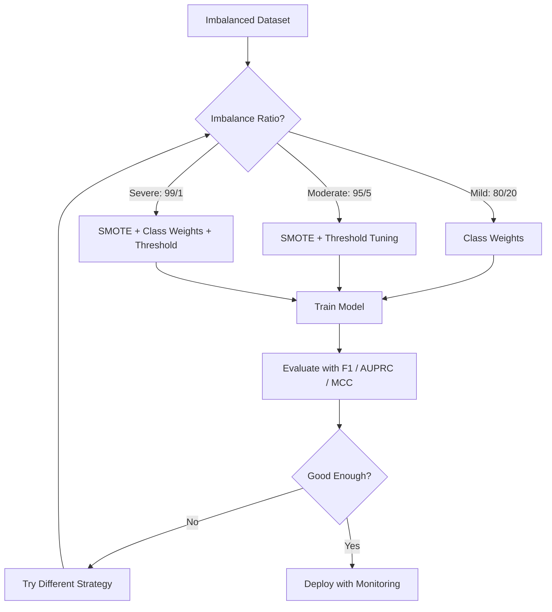
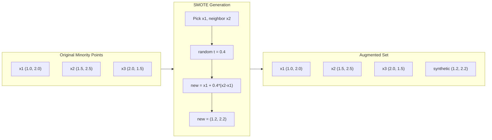
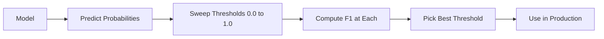
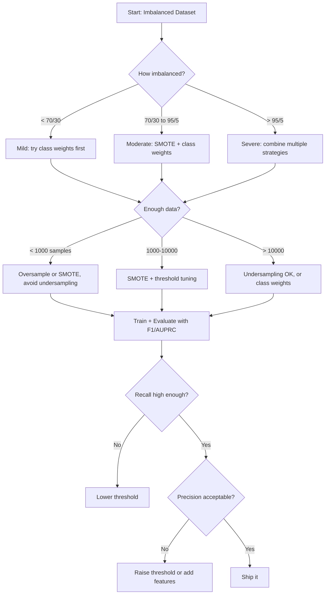

# Handling Imbalanced Data
# 处理不平衡数据


> When 99% of your data is "normal," accuracy is a lie.

> 当 99% 的数据是"正常"时，准确率就是一个谎言。

**Type:** Build | **类型：** 构建
**Language:** Python | **语言：** Python
**Prerequisites:** Phase 2, Lessons 01-09 (especially evaluation metrics) | **前置知识：** Phase 2 第 1-9 课（尤其是评估指标）
**Time:** ~90 minutes | **时间：** 约 90 分钟

## Learning Objectives | 学习目标

- Implement SMOTE from scratch and explain how synthetic oversampling differs from random duplication
  从零实现 SMOTE，解释合成过采样与随机复制的区别
- Evaluate imbalanced classifiers using F1, AUPRC, and Matthews Correlation Coefficient instead of accuracy
  使用 F1、AUPRC 和马修斯相关系数 (MCC) 评估不平衡分类器，而非准确率
- Compare class weighting, threshold tuning, and resampling strategies and select the right approach for a given imbalance ratio
  比较类权重、阈值调优和重采样策略，为给定不平衡比例选择正确方法
- Build a complete imbalanced data pipeline that combines SMOTE, class weights, and threshold optimization
  构建结合 SMOTE、类权重和阈值优化的完整不平衡数据管线


> **【中文解读】**
> 不平衡数据中少数类极少（如欺诈占比 0.1%）。过采样（SMOTE）、欠采样、类权重调整是常用策略。金融欺诈检测和医疗诊断中不平衡数据是常态。

> **【拓展：不平衡数据在真实系统中的挑战】**
> PayPal 每天处理约 4 亿笔交易，欺诈率仅 0.3%，但每天仍意味着约 120 万笔欺诈交易。用准确率评估毫无意义（99.7% 准确率可以是全猜"非欺诈"），必须用 F1、AUPRC 等指标。SMOTE（合成少数类过采样技术）通过在少数类样本之间插值生成新样本来缓解不平衡，但在高维空间中可能生成噪声样本。

## The Problem | 问题引入

You build a fraud detection model. It gets 99.9% accuracy. You celebrate. Then you realize it predicts "not fraud" for every single transaction.

> 你构建了一个欺诈检测模型。它获得 99.9% 的准确率。你庆祝。然后你意识到它对每笔交易都预测"非欺诈"。

This is not a bug. It is the rational thing to do when only 0.1% of transactions are fraudulent. The model learns that always guessing the majority class minimizes overall error. It is technically correct and completely useless.

> 这不是 bug。当只有 0.1% 的交易是欺诈时，这是合理的行为。模型学到始终猜测多数类能最小化整体误差。它在技术上正确但完全无用。

This happens everywhere real classification matters. Disease diagnosis: 1% positive rate. Network intrusion: 0.01% attacks. Manufacturing defects: 0.5% defective. Spam filtering: 20% spam. Churn prediction: 5% churners. The more consequential the minority class, the rarer it tends to be.

> 这在真正需要分类的地方都会发生。疾病诊断：1% 阳性率。网络入侵：0.01% 攻击。制造缺陷：0.5% 缺陷。垃圾邮件过滤：20% 垃圾邮件。客户流失预测：5% 流失者。少数类越重要，它就越稀有。

Accuracy fails because it treats all correct predictions equally. Correctly labeling a legitimate transaction and correctly catching fraud both count as one point of accuracy. But catching fraud is the entire reason the model exists. We need metrics, techniques, and training strategies that force the model to pay attention to the rare but important class.

> 准确率失败因为它同等对待所有正确预测。正确标记合法交易和正确捕获欺诈都算准确率的一分。但捕获欺诈是模型存在的全部原因。我们需要迫使模型关注稀有但重要类别的指标、技术和训练策略。

> **【中文解读】**
> 不平衡数据的核心问题：准确率是"谎言"。99.9% 准确率可能只是全猜多数类。正确做法：(1) 换指标——用 F1、AUPRC、MCC 替代准确率；(2) 重采样——SMOTE 过采样少数类或欠采样多数类；(3) 代价敏感学习——给少数类更大的损失权重；(4) 调整阈值——降低分类阈值来提高召回率。通常组合使用多种策略效果最好。

## The Concept | 核心概念

### Why Accuracy Fails

Consider a dataset with 1000 samples: 990 negative, 10 positive. A model that always predicts negative:

> 考虑一个 1000 个样本的数据集：990 个负样本，10 个正样本。一个始终预测负类的模型：

|  | Predicted Positive | Predicted Negative |
|--|---|---|
| Actually Positive | 0 (TP) | 10 (FN) |
| Actually Negative | 0 (FP) | 990 (TN) |

Accuracy = (0 + 990) / 1000 = 99.0%

The model catches zero fraud. Zero disease. Zero defects. But accuracy says 99%. This is why accuracy is dangerous for imbalanced problems.

> 模型捕获了零个欺诈。零个疾病。零个缺陷。但准确率显示 99%。这就是为什么准确率在不平衡问题中是危险的。

### Better Metrics

**Precision** = TP / (TP + FP). Of everything flagged as positive, how many actually are? High precision means few false alarms.

> **精确率** = TP / (TP + FP)。在所有标记为正的样本中，有多少确实是正的？高精确率意味着少假阳性。

**Recall** = TP / (TP + FN). Of everything actually positive, how many did we catch? High recall means few missed positives.

> **召回率** = TP / (TP + FN)。在所有实际为正的样本中，我们捕获了多少？高召回率意味着少漏检。

**F1 Score** = 2 * precision * recall / (precision + recall). The harmonic mean. Penalizes extreme imbalance between precision and recall more than the arithmetic mean would.

> **F1 分数** = 2 * 精确率 * 召回率 / (精确率 + 召回率)。调和平均值。比算术平均值更严厉地惩罚精确率和召回率之间的极端不平衡。

**F-beta Score** = (1 + beta^2) * precision * recall / (beta^2 * precision + recall). When beta > 1, recall matters more. When beta < 1, precision matters more. F2 is common in fraud detection (missing fraud is worse than a false alarm).

> **F-beta 分数** = (1 + beta^2) * 精确率 * 召回率 / (beta^2 * 精确率 + 召回率)。当 beta > 1 时，召回率更重要。当 beta < 1 时，精确率更重要。F2 在欺诈检测中常用（漏检欺诈比误报更糟糕）。

**AUPRC** (Area Under Precision-Recall Curve). Like AUC-ROC but more informative for imbalanced data. A random classifier has AUPRC equal to the positive class rate (not 0.5 like ROC). This makes improvements easier to see.

> **AUPRC**（精确率-召回率曲线下面积）。类似于 AUC-ROC 但对不平衡数据更有信息量。随机分类器的 AUPRC 等于正类比例（不像 ROC 的 0.5）。这使得改进更容易看到。

**Matthews Correlation Coefficient** = (TP * TN - FP * FN) / sqrt((TP+FP)(TP+FN)(TN+FP)(TN+FN)). Ranges from -1 to +1. Only gives a high score when the model does well on both classes. Balanced even when classes are very different sizes.

> **马修斯相关系数 (MCC)** = (TP * TN - FP * FN) / sqrt((TP+FP)(TP+FN)(TN+FP)(TN+FN))。范围从 -1 到 +1。只有在两个类别上都表现良好时才给高分。即使类别大小差异很大也保持平衡。

For the "always predict negative" model above: precision = 0/0 (undefined, often set to 0), recall = 0/10 = 0, F1 = 0, MCC = 0. These metrics correctly identify the model as worthless.

> 对于上面的"始终预测负类"模型：精确率 = 0/0（未定义，通常设为 0），召回率 = 0/10 = 0，F1 = 0，MCC = 0。这些指标正确地将模型识别为无用。

### The Imbalanced Data Pipeline



### SMOTE: Synthetic Minority Oversampling Technique

Random oversampling duplicates existing minority samples. This works but risks overfitting because the model sees identical points repeatedly.

> 随机过采样复制现有少数类样本。这有效但有过拟合风险，因为模型会重复看到相同的点。

SMOTE creates new synthetic minority samples that are plausible but not copies. The algorithm:

> SMOTE 创建新的合成少数类样本，它们合理但不是副本。算法如下：

1. For each minority sample x, find its k nearest neighbors among other minority samples
   对于每个少数类样本 x，在其他少数类样本中找到其 k 个最近邻
2. Pick one neighbor at random
   随机选择一个邻居
3. Create a new sample on the line segment between x and that neighbor
   在 x 和该邻居之间的线段上创建一个新样本

The formula: `new_sample = x + random(0, 1) * (neighbor - x)`

> 公式：`new_sample = x + random(0, 1) * (neighbor - x)`

This interpolates between real minority points, creating samples in the same region of feature space without just copying existing data.

> 这在真实少数类点之间插值，在特征空间的同一区域创建样本，而不仅仅是复制现有数据。



### Sampling Strategies Compared

**Random Oversampling**: duplicate minority samples to match majority count.
- Pros: simple, no information loss
  优点：简单，无信息损失
- Cons: exact duplicates cause overfitting, increases training time
  缺点：完全相同的副本导致过拟合，增加训练时间

**Random Undersampling**: remove majority samples to match minority count.
- Pros: fast training, simple
  优点：训练快，简单
- Cons: throws away potentially useful majority data, higher variance
  缺点：丢弃可能有用的多数类数据，方差更高

**SMOTE**: create synthetic minority samples via interpolation.
- Pros: generates new data points, reduces overfitting compared to random oversampling
  优点：生成新数据点，比随机过采样减少过拟合
- Cons: can create noisy samples near the decision boundary, does not account for majority class distribution
  缺点：可能在决策边界附近创建噪声样本，不考虑多数类分布

| Strategy | Data Changed | Risk | When to Use |
|----------|-------------|------|-------------|
| Oversample | Minority duplicated | Overfitting | Small datasets, moderate imbalance |
| Undersample | Majority removed | Information loss | Large datasets, want fast training |
| SMOTE | Synthetic minority added | Boundary noise | Moderate imbalance, enough minority samples for k-NN |

### Class Weights

Instead of changing the data, change how the model treats errors. Assign higher weight to misclassifying the minority class.

> 不改变数据，而是改变模型对待错误的方式。给少数类的误分类分配更高的权重。

For a binary problem with 950 negative and 50 positive samples:
- Weight for negative class = n_samples / (2 * n_negative) = 1000 / (2 * 950) = 0.526
  负类权重 = n_samples / (2 * n_negative) = 1000 / (2 * 950) = 0.526
- Weight for positive class = n_samples / (2 * n_positive) = 1000 / (2 * 50) = 10.0
  正类权重 = n_samples / (2 * n_positive) = 1000 / (2 * 50) = 10.0

The positive class gets 19x the weight. Misclassifying one positive sample costs as much as misclassifying 19 negative samples. The model is forced to pay attention to the minority class.

> 正类获得了 19 倍的权重。误分类一个正样本的代价等同于误分类 19 个负样本。模型被迫关注少数类。

In logistic regression, this modifies the loss function:

```
weighted_loss = -sum(w_i * [y_i * log(p_i) + (1-y_i) * log(1-p_i)])
```

where w_i depends on the class of sample i.

Class weights are mathematically equivalent to oversampling in expectation, but without creating new data points. This makes them faster and avoids the overfitting risk of duplicated samples.

> 类权重在期望上与过采样数学等价，但不创建新数据点。这使得它们更快，并避免了复制样本的过拟合风险。

### Threshold Tuning

Most classifiers output a probability. The default threshold is 0.5: if P(positive) >= 0.5, predict positive. But 0.5 is arbitrary. When classes are imbalanced, the optimal threshold is usually much lower.

> 大多数分类器输出概率。默认阈值为 0.5：如果 P(positive) >= 0.5，预测为正。但 0.5 是任意的。当类别不平衡时，最优阈值通常低得多。

The process:
1. Train a model
   训练一个模型
2. Get predicted probabilities on the validation set
   在验证集上获取预测概率
3. Sweep thresholds from 0.0 to 1.0
   从 0.0 到 1.0 扫描阈值
4. Compute F1 (or your chosen metric) at each threshold
   在每个阈值下计算 F1（或你选择的指标）
5. Pick the threshold that maximizes your metric
   选择最大化你的指标的阈值



A model might output P(fraud) = 0.15 for a fraudulent transaction. At threshold 0.5, this is classified as not fraud. At threshold 0.10, it is correctly caught. The probability calibration matters less than the ranking -- as long as fraud gets higher probabilities than non-fraud, there exists a threshold that separates them.

> 模型可能对一笔欺诈交易输出 P(fraud) = 0.15。在阈值 0.5 下，这被分类为非欺诈。在阈值 0.10 下，它被正确捕获。概率校准不如排名重要——只要欺诈获得比非欺诈更高的概率，就存在一个能分离它们的阈值。

### Cost-Sensitive Learning

Generalization of class weights. Instead of uniform costs, assign specific misclassification costs:

> 类权重的推广。不使用统一代价，而是分配特定的误分类代价：

| | Predict Positive | Predict Negative |
|--|---|---|
| Actually Positive | 0 (correct) | C_FN = 100 |
| Actually Negative | C_FP = 1 | 0 (correct) |

Missing a fraudulent transaction (FN) costs 100x more than a false alarm (FP). The model optimizes for total cost, not total error count.

> 漏检一笔欺诈交易（FN）的代价是误报（FP）的 100 倍。模型优化总代价，而非总错误数。

This is the most principled approach when you can estimate real-world costs. A missed cancer diagnosis has a very different cost than a false alarm that leads to an extra biopsy. Making these costs explicit forces the right tradeoffs.

> 这是当你能估计真实世界成本时最有原则的方法。漏诊癌症的代价与导致额外活检的误报截然不同。明确这些代价可以促成正确的权衡。

### Decision Flowchart



## Build It | 动手实现

> **【中文解读】**
> 从零实现 SMOTE（合成少数类过采样技术）：对每个少数类样本，找到其 K 个最近邻，在连线上随机插值生成新的合成样本。相比简单复制少数类样本，SMOTE 生成的样本更多样化，不易过拟合。此外实现类权重调整和阈值优化策略。

> **【拓展：工业级不平衡数据处理的高级技术】**
> 在实际金融风控中，处理不平衡数据的策略比 SMOTE 更复杂：使用 Focal Loss（焦点损失，让模型更关注难分类样本）、两阶段训练（先用过采样训练，再用原始数据微调）、代价敏感学习（将欺诈的误分类代价设为正常交易的 100 倍）。Square（前 Square Inc.）的欺诈检测系统使用多模型融合 + 动态阈值来处理每天百万级交易中的极少数欺诈案例。

### Step 1: Generate an imbalanced dataset

```python
import numpy as np


def make_imbalanced_data(n_majority=950, n_minority=50, seed=42):
    rng = np.random.RandomState(seed)

    X_maj = rng.randn(n_majority, 2) * 1.0 + np.array([0.0, 0.0])
    X_min = rng.randn(n_minority, 2) * 0.8 + np.array([2.5, 2.5])

    X = np.vstack([X_maj, X_min])
    y = np.concatenate([np.zeros(n_majority), np.ones(n_minority)])

    shuffle_idx = rng.permutation(len(y))
    return X[shuffle_idx], y[shuffle_idx]
```

### Step 2: SMOTE from scratch

```python
def euclidean_distance(a, b):
    return np.sqrt(np.sum((a - b) ** 2))


def find_k_neighbors(X, idx, k):
    distances = []
    for i in range(len(X)):
        if i == idx:
            continue
        d = euclidean_distance(X[idx], X[i])
        distances.append((i, d))
    distances.sort(key=lambda x: x[1])
    return [d[0] for d in distances[:k]]


def smote(X_minority, k=5, n_synthetic=100, seed=42):
    rng = np.random.RandomState(seed)
    n_samples = len(X_minority)
    k = min(k, n_samples - 1)
    synthetic = []

    for _ in range(n_synthetic):
        idx = rng.randint(0, n_samples)
        neighbors = find_k_neighbors(X_minority, idx, k)
        neighbor_idx = neighbors[rng.randint(0, len(neighbors))]
        t = rng.random()
        new_point = X_minority[idx] + t * (X_minority[neighbor_idx] - X_minority[idx])
        synthetic.append(new_point)

    return np.array(synthetic)
```

### Step 3: Random oversampling and undersampling

```python
def random_oversample(X, y, seed=42):
    rng = np.random.RandomState(seed)
    classes, counts = np.unique(y, return_counts=True)
    max_count = counts.max()

    X_resampled = list(X)
    y_resampled = list(y)

    for cls, count in zip(classes, counts):
        if count < max_count:
            cls_indices = np.where(y == cls)[0]
            n_needed = max_count - count
            chosen = rng.choice(cls_indices, size=n_needed, replace=True)
            X_resampled.extend(X[chosen])
            y_resampled.extend(y[chosen])

    X_out = np.array(X_resampled)
    y_out = np.array(y_resampled)
    shuffle = rng.permutation(len(y_out))
    return X_out[shuffle], y_out[shuffle]


def random_undersample(X, y, seed=42):
    rng = np.random.RandomState(seed)
    classes, counts = np.unique(y, return_counts=True)
    min_count = counts.min()

    X_resampled = []
    y_resampled = []

    for cls in classes:
        cls_indices = np.where(y == cls)[0]
        chosen = rng.choice(cls_indices, size=min_count, replace=False)
        X_resampled.extend(X[chosen])
        y_resampled.extend(y[chosen])

    X_out = np.array(X_resampled)
    y_out = np.array(y_resampled)
    shuffle = rng.permutation(len(y_out))
    return X_out[shuffle], y_out[shuffle]
```

### Step 4: Logistic regression with class weights

```python
def sigmoid(z):
    return 1.0 / (1.0 + np.exp(-np.clip(z, -500, 500)))


def logistic_regression_weighted(X, y, weights, lr=0.01, epochs=200):
    n_samples, n_features = X.shape
    w = np.zeros(n_features)
    b = 0.0

    for _ in range(epochs):
        z = X @ w + b
        pred = sigmoid(z)
        error = pred - y
        weighted_error = error * weights

        gradient_w = (X.T @ weighted_error) / n_samples
        gradient_b = np.mean(weighted_error)

        w -= lr * gradient_w
        b -= lr * gradient_b

    return w, b


def compute_class_weights(y):
    classes, counts = np.unique(y, return_counts=True)
    n_samples = len(y)
    n_classes = len(classes)
    weight_map = {}
    for cls, count in zip(classes, counts):
        weight_map[cls] = n_samples / (n_classes * count)
    return np.array([weight_map[yi] for yi in y])
```

### Step 5: Threshold tuning

```python
def find_optimal_threshold(y_true, y_probs, metric="f1"):
    best_threshold = 0.5
    best_score = -1.0

    for threshold in np.arange(0.05, 0.96, 0.01):
        y_pred = (y_probs >= threshold).astype(int)
        tp = np.sum((y_pred == 1) & (y_true == 1))
        fp = np.sum((y_pred == 1) & (y_true == 0))
        fn = np.sum((y_pred == 0) & (y_true == 1))

        if metric == "f1":
            precision = tp / (tp + fp) if (tp + fp) > 0 else 0.0
            recall = tp / (tp + fn) if (tp + fn) > 0 else 0.0
            score = 2 * precision * recall / (precision + recall) if (precision + recall) > 0 else 0.0
        elif metric == "recall":
            score = tp / (tp + fn) if (tp + fn) > 0 else 0.0
        elif metric == "precision":
            score = tp / (tp + fp) if (tp + fp) > 0 else 0.0

        if score > best_score:
            best_score = score
            best_threshold = threshold

    return best_threshold, best_score
```

### Step 6: Evaluation functions

```python
def confusion_matrix_values(y_true, y_pred):
    tp = np.sum((y_pred == 1) & (y_true == 1))
    tn = np.sum((y_pred == 0) & (y_true == 0))
    fp = np.sum((y_pred == 1) & (y_true == 0))
    fn = np.sum((y_pred == 0) & (y_true == 1))
    return tp, tn, fp, fn


def compute_metrics(y_true, y_pred):
    tp, tn, fp, fn = confusion_matrix_values(y_true, y_pred)
    accuracy = (tp + tn) / (tp + tn + fp + fn)
    precision = tp / (tp + fp) if (tp + fp) > 0 else 0.0
    recall = tp / (tp + fn) if (tp + fn) > 0 else 0.0
    f1 = 2 * precision * recall / (precision + recall) if (precision + recall) > 0 else 0.0

    denom = np.sqrt(float((tp + fp) * (tp + fn) * (tn + fp) * (tn + fn)))
    mcc = (tp * tn - fp * fn) / denom if denom > 0 else 0.0

    return {
        "accuracy": accuracy,
        "precision": precision,
        "recall": recall,
        "f1": f1,
        "mcc": mcc,
    }
```

### Step 7: Compare all approaches

```python
X, y = make_imbalanced_data(950, 50, seed=42)
split = int(0.8 * len(y))
X_train, X_test = X[:split], X[split:]
y_train, y_test = y[:split], y[split:]

# Baseline: no treatment
w_base, b_base = logistic_regression_weighted(
    X_train, y_train, np.ones(len(y_train)), lr=0.1, epochs=300
)
probs_base = sigmoid(X_test @ w_base + b_base)
preds_base = (probs_base >= 0.5).astype(int)

# Oversampled
X_over, y_over = random_oversample(X_train, y_train)
w_over, b_over = logistic_regression_weighted(
    X_over, y_over, np.ones(len(y_over)), lr=0.1, epochs=300
)
preds_over = (sigmoid(X_test @ w_over + b_over) >= 0.5).astype(int)

# SMOTE
minority_mask = y_train == 1
X_minority = X_train[minority_mask]
synthetic = smote(X_minority, k=5, n_synthetic=len(y_train) - 2 * int(minority_mask.sum()))
X_smote = np.vstack([X_train, synthetic])
y_smote = np.concatenate([y_train, np.ones(len(synthetic))])
w_sm, b_sm = logistic_regression_weighted(
    X_smote, y_smote, np.ones(len(y_smote)), lr=0.1, epochs=300
)
preds_smote = (sigmoid(X_test @ w_sm + b_sm) >= 0.5).astype(int)

# Class weights
sample_weights = compute_class_weights(y_train)
w_cw, b_cw = logistic_regression_weighted(
    X_train, y_train, sample_weights, lr=0.1, epochs=300
)
probs_cw = sigmoid(X_test @ w_cw + b_cw)
preds_cw = (probs_cw >= 0.5).astype(int)

# Threshold tuning (tune on held-out validation set, not test set)
probs_val = sigmoid(X_val @ w_cw + b_cw)
best_thresh, best_f1 = find_optimal_threshold(y_val, probs_val, metric="f1")
preds_thresh = (probs_cw >= best_thresh).astype(int)
```

The code file runs all of this in a single script and prints results.

> 代码文件在单个脚本中运行所有这些并打印结果。

## Use It | 用框架实现

With scikit-learn and imbalanced-learn, these techniques are one-liners:

> 使用 scikit-learn 和 imbalanced-learn，这些技术只需一行代码：

```python
from sklearn.linear_model import LogisticRegression
from sklearn.metrics import classification_report, f1_score
from sklearn.model_selection import train_test_split
from imblearn.over_sampling import SMOTE
from imblearn.under_sampling import RandomUnderSampler
from imblearn.pipeline import Pipeline

X_train, X_test, y_train, y_test = train_test_split(X, y, stratify=y)

model_weighted = LogisticRegression(class_weight="balanced")
model_weighted.fit(X_train, y_train)
print(classification_report(y_test, model_weighted.predict(X_test)))

smote = SMOTE(random_state=42)
X_resampled, y_resampled = smote.fit_resample(X_train, y_train)
model_smote = LogisticRegression()
model_smote.fit(X_resampled, y_resampled)
print(classification_report(y_test, model_smote.predict(X_test)))

pipeline = Pipeline([
    ("smote", SMOTE()),
    ("model", LogisticRegression(class_weight="balanced")),
])
pipeline.fit(X_train, y_train)
print(classification_report(y_test, pipeline.predict(X_test)))
```

The from-scratch implementations show exactly what each technique does. SMOTE is just k-NN interpolation on the minority class. Class weights multiply the loss. Threshold tuning is a for-loop over cutoffs. No magic.

> 从零实现准确展示了每种技术的作用。SMOTE 就是少数类上的 k-NN 插值。类权重乘以损失。阈值调优是对截断值的 for 循环。没有魔法。

## Ship It | 产出物

This lesson produces:
- `outputs/skill-imbalanced-data.md` -- a decision checklist for handling imbalanced classification problems

## Exercises | 练习题

1. **Borderline-SMOTE**: modify the SMOTE implementation to only generate synthetic samples for minority points that are near the decision boundary (those whose k-nearest neighbors include majority class samples). Compare results with standard SMOTE on a dataset where classes overlap.
   1. 生成不平衡数据集（1% 正例）。比较始终预测多数类、随机森林（默认）、随机森林（class_weight='balanced'）和 SMOTE+随机森林的 F1 和 MCC。

2. **Cost matrix optimization**: implement cost-sensitive learning where the cost matrix is a parameter. Create a function that takes a cost matrix and returns optimal predictions that minimize expected cost. Test with different cost ratios (1:10, 1:100, 1:1000) and plot how the precision-recall tradeoff changes.
   2. 在同一数据集上比较随机过采样和 SMOTE。展示 SMOTE 产生更好的决策边界。

3. **Threshold calibration**: implement Platt scaling (fit a logistic regression on the model's raw outputs to produce calibrated probabilities). Compare the precision-recall curve before and after calibration. Show that calibration does not change the ranking (AUC stays the same) but makes the probabilities more meaningful.
   3. 实现阈值调优：对逻辑回归输出的概率，扫描 0.01 到 0.99 的阈值，找到 F1 最高的阈值。展示它比默认阈值 0.5 好多少。

4. **Ensemble with balanced bagging**: train multiple models, each on a balanced bootstrap sample (all minority + random subset of majority). Average their predictions. Compare this approach against a single model with SMOTE. Measure both performance and variance across runs.
   4. 构建完整管线：SMOTE -> 标准化 -> 逻辑回归（class_weight='balanced'）-> 阈值优化。比较管线中移除任一步骤的性能下降。

5. **Imbalance ratio experiment**: take a balanced dataset and progressively increase the imbalance ratio (50/50, 70/30, 90/10, 95/5, 99/1). For each ratio, train with and without SMOTE. Plot F1 vs imbalance ratio for both approaches. At what ratio does SMOTE start making a meaningful difference?

> **【中文解读】**
> 不平衡数据处理的完整策略组合：(1) 评估指标——用 F1/AUPRC/MCC 替代准确率；(2) 重采样——SMOTE 过采样少数类或随机欠采样多数类；(3) 代价敏感——在损失函数中给少数类加权（sklearn 中 class_weight='balanced'）；(4) 阈值调整——降低分类阈值提高召回率。关键洞察：没有万能方法，不同策略的组合通常效果最好。

> **【拓展：Focal Loss——深度学习中的不平衡数据解决方案】**
> Focal Loss（Lin et al., 2017）最初为解决目标检测中正负样本极度不平衡而提出（背景像素远多于目标像素）。核心思想：降低"容易分类"样本的损失权重，让模型聚焦于"难分类"样本。公式：FL(p) = -(1-p)^gamma * log(p)，gamma=2 时效果最好。RetinaNet 使用 Focal Loss 在 COCO 检测任务上超越了当时的 SOTA 方法。

## Key Terms | 术语速查表

| Term | What people say | What it actually means |
|------|----------------|----------------------|
| Class imbalance | "One class has way more samples" | The distribution of classes in the dataset is significantly skewed, causing models to favor the majority class |
| SMOTE | "Synthetic oversampling" | Creates new minority samples by interpolating between existing minority samples and their k-nearest minority neighbors |
| Class weights | "Making errors on rare classes more expensive" | Multiplying the loss function by class-specific weights so the model penalizes minority misclassification more heavily |
| Threshold tuning | "Moving the decision boundary" | Changing the probability cutoff for classification from the default 0.5 to a value that optimizes the desired metric |
| Precision-recall tradeoff | "You cannot have both" | Lowering the threshold catches more positives (higher recall) but also flags more false positives (lower precision), and vice versa |
| AUPRC | "Area under the PR curve" | Summarizes the precision-recall curve into a single number; more informative than AUC-ROC when classes are heavily imbalanced |
| Matthews Correlation Coefficient | "The balanced metric" | A correlation between predicted and actual labels that produces a high score only when the model performs well on both classes |
| Cost-sensitive learning | "Different mistakes cost different amounts" | Incorporating real-world misclassification costs into the training objective so the model optimizes for total cost, not error count |
| Random oversampling | "Duplicate the minority" | Repeating minority class samples to balance class counts; simple but risks overfitting to duplicated points |

## Further Reading | 延伸阅读

- [SMOTE: Synthetic Minority Over-sampling Technique (Chawla et al., 2002)](https://arxiv.org/abs/1106.1813) -- the original SMOTE paper, still the most cited work on imbalanced learning
  [Chawla et al.: SMOTE (2002)](https://arxiv.org/abs/1106.1813) - SMOTE 原始论文
- [Learning from Imbalanced Data (He & Garcia, 2009)](https://ieeexplore.ieee.org/document/5128907) -- comprehensive survey covering sampling, cost-sensitive, and algorithmic approaches
  [He & Garcia: Learning from Imbalanced Data (2009)](https://link.springer.com/article/10.1007/s10115-008-0164-4) - 不平衡学习综述
- [imbalanced-learn documentation](https://imbalanced-learn.org/stable/) -- Python library with SMOTE variants, undersampling strategies, and pipeline integration
  [imbalanced-learn 文档](https://imbalanced-learn.org/) - Python 不平衡学习库
- [The Precision-Recall Plot Is More Informative than the ROC Plot (Saito & Rehmsmeier, 2015)](https://journals.plos.org/plosone/article?id=10.1371/journal.pone.0118432) -- when and why to prefer PR curves over ROC curves for imbalanced problems
